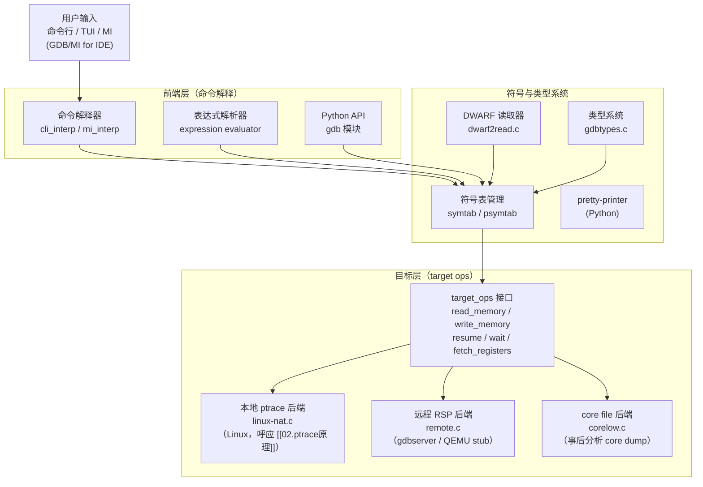
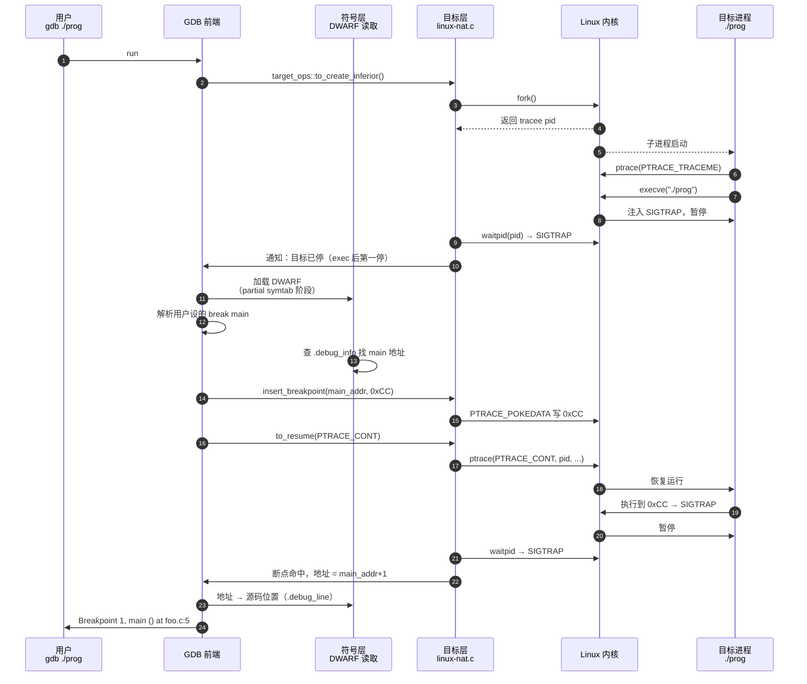
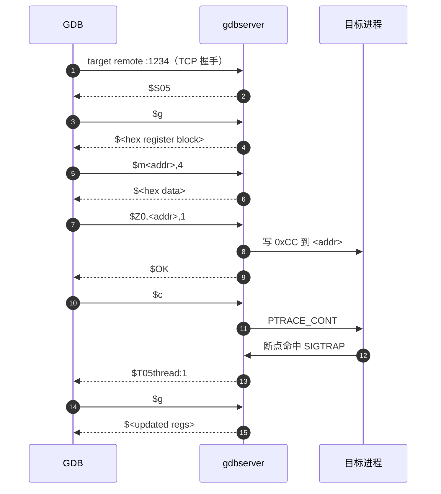

# 调试器原理与实战（8）· GDB原理与实战

> [!abstract] TL;DR
> - **GDB 是什么**：GNU Debugger，跨平台、支持多语言的开源调试器，内核是"前端命令解释 + 符号/类型系统 + 可插拔目标后端"三层架构。
> - **本地调试**：GDB 在 Linux 上通过 `ptrace`（见 [[02.ptrace原理]]）控制 tracee；在 macOS 上走 Mach 异常端口；在 Windows 上通过 MinGW/WSL 或 Windows Debug API。
> - **远程调试**：GDB 通过 GDB Remote Serial Protocol（RSP）与 `gdbserver` 或嵌入式 stub 通信，解耦"前端 UI + 符号解析"与"目标控制"。
> - **符号理解**：读取 DWARF（见 [[05.调试信息DWARF]]）把地址映射回"文件:行:变量"，支持表达式求值与 pretty-print。
> - **可扩展性**：Python API（`gdb` 模块）允许自定义命令、pretty-printer、断点回调；pwndbg/GEF 等插件借此大幅增强 pwn/逆向分析能力。

本篇是系列第 8 篇。[[07.栈回溯unwind]] 已讲清"调试器如何通过 `.eh_frame`/`.debug_frame` 展开调用栈"，本篇把镜头拉到 GDB 整体：**架构、常用命令、Python API、远程调试，以及 TUI 与插件生态**。理解本篇之后，[[09.LLDB原理与实战]] 将对比 GDB 与 LLDB 的设计差异。

---

## 概述与定位

### GDB 是什么

GDB（GNU Debugger）是 GNU 项目的旗舰调试器，诞生于 1986 年，至今仍是 Linux 平台最广泛使用的调试工具。它的核心能力：

- **检查与修改**程序状态（变量、内存、寄存器）。
- **控制执行流**（断点、单步、跳转到任意地址）。
- **理解源码符号**（从地址反查 `文件:行:函数名:变量`）。
- **远程调试**（通过串口/TCP 连接嵌入式设备、QEMU、容器）。

GDB 支持 C、C++、Rust、Go、Ada、Fortran 等语言，支持 x86/x86-64、ARM/AArch64、RISC-V、MIPS、PowerPC 等架构，本质上是**多目标、多语言的通用调试前端**。

### GDB 在系列中的位置

| 已知机制 | 本篇 GDB 如何利用 |
|---|---|
| `ptrace`（[[02.ptrace原理]]） | 本地目标后端的底层系统调用 |
| 断点（`03.断点原理`） | `break` 命令下 `int 3`；硬件断点用 DR 寄存器 |
| 单步（`04.单步与执行控制`） | `step`/`next`/`nexti`/`stepi` 的实现 |
| DWARF（[[05.调试信息DWARF]]） | 符号/类型系统读取调试信息 |
| 栈回溯（[[07.栈回溯unwind]]） | `bt` 命令通过 `.eh_frame` 展开栈帧 |

---

## 原理与机制

### GDB 三层架构

GDB 内部分为三个大层，彼此通过定义良好的接口隔离：



> 三层职责一句话：**前端层**解析用户命令并管理输出；**符号层**理解 DWARF（[[05.调试信息DWARF]]）把地址变成"有意义的名字"；**目标层**通过 `target_ops` 虚函数表操控实际的进程或硬件，同一套命令可无缝切换本地调试、远程调试、core 分析。

### 前端：命令解释器

GDB 有两种前端接口：

- **CLI（命令行解释器）**：人类直接键入 `break main`、`run`、`print x`，默认模式。
- **MI（Machine Interface，`gdb/mi`）**：IDE（CLion、VS Code、Eclipse）通过标准化结构化消息与 GDB 通信，GDB 用 `--interpreter=mi` 启动。`gdb -i=mi` 输出形如 `^done,bkpt={number="1",...}` 的 S-表达式。

表达式求值器是前端的关键部件：执行 `print x + y * 2` 时，GDB 先在当前帧的 DWARF 符号中查 `x`、`y` 的位置描述（`DW_AT_location`），读取其值，然后在 GDB 进程内部计算表达式，输出结果。支持 C 表达式、类型转换 `(char*)ptr`、解引用 `*ptr`、`sizeof`、字符串字面量。

### 符号与类型系统

符号层的核心是**延迟加载**（partial symtab）：GDB 启动时不立即解析所有 DWARF，而是先建立轻量的 "partial symbol table"（仅含全局函数/变量名与所在编译单元）；只有当用户访问某个符号时才"展开"那个编译单元的完整 DIE 树。大型项目（glibc、Linux 内核）几十万函数时这个优化至关重要。

类型系统（`gdbtypes.c`）把 DWARF 的 `DW_TAG_base_type`、`DW_TAG_structure_type`、`DW_TAG_pointer_type` 等映射成 GDB 内部的 `struct type`，支持：

- 输出结构体成员（`print obj`）
- 访问 C++ 派生类的虚函数表
- 调用 pretty-printer 格式化 `std::vector<int>`

pretty-printer 机制：GDB 在打印一个值前，先查 Python 注册的 pretty-printer 链表，找到匹配类型的 printer，调用其 `to_string()` 方法生成可读输出。GCC 源码树的 `libstdc++-v3/python/` 目录包含标准库的完整 pretty-printer 集。

### 目标层：本地 ptrace 后端

在 Linux 上，GDB 的本地调试后端位于 `linux-nat.c`，它直接调用 `ptrace(2)` 实现 `target_ops` 的每个虚方法：

| `target_ops` 方法 | 对应 `ptrace` 请求 |
|---|---|
| `to_resume` | `PTRACE_CONT` / `PTRACE_SINGLESTEP` / `PTRACE_SYSCALL` |
| `to_wait` | `waitpid(pid, &status, __WALL)` |
| `to_fetch_registers` | `PTRACE_GETREGS` / `PTRACE_GETREGSET` |
| `to_store_registers` | `PTRACE_SETREGS` / `PTRACE_SETREGSET` |
| `to_xfer_partial`（读内存） | `/proc/<pid>/mem`（大块）或 `PTRACE_PEEKDATA`（小块） |
| `to_xfer_partial`（写内存） | `PTRACE_POKEDATA` 或 `/proc/<pid>/mem` |
| `to_insert_breakpoint` | `PTRACE_POKEDATA` 写 `0xCC`（`int 3`） |
| `to_remove_breakpoint` | `PTRACE_POKEDATA` 恢复原字节 |
| `to_insert_hw_breakpoint` | `PTRACE_POKEUSER` 设 `DR0-DR3` + `DR7` |

这张表完整呼应了 [[02.ptrace原理]] 的"核心执行控制请求"和"PEEKTEXT/POKETEXT vs /proc/mem"两节。

### 目标层：远程调试与 GDB Remote Serial Protocol

当目标不能运行完整的 `ptrace` 栈时（嵌入式设备、QEMU 虚拟机、容器、裸金属），使用**远程调试**：

```
GDB（前端+符号层）  ←──── RSP over TCP/UDP/串口 ────→  gdbserver 或硬件 stub
```

**GDB Remote Serial Protocol（RSP）** 是一个基于 ASCII 的请求-应答协议，消息格式：

```
$<packet_data>#<two-digit checksum>
```

核心包（举例）：

| 包 | 方向 | 含义 |
|---|---|---|
| `?` | GDB→stub | 查询目标当前停止原因 |
| `g` | GDB→stub | 读所有通用寄存器（返回十六进制寄存器块） |
| `G<hex regs>` | GDB→stub | 写所有通用寄存器 |
| `m<addr>,<len>` | GDB→stub | 读内存 |
| `M<addr>,<len>:<data>` | GDB→stub | 写内存 |
| `c[<addr>]` | GDB→stub | 继续执行（可选起始地址） |
| `s[<addr>]` | GDB→stub | 单步（可选起始地址） |
| `Z0,<addr>,<kind>` | GDB→stub | 插入软件断点 |
| `z0,<addr>,<kind>` | GDB→stub | 移除软件断点 |
| `T<thread-id>` | GDB→stub | 检查线程是否存活 |
| `vCont;c:<tid>` | GDB→stub | 多线程精细控制 |

`gdbserver` 是 GDB 工具链附带的独立进程，在目标机上运行，实现 RSP 的服务端：

```bash
# 目标机：监听 TCP 1234，调试 /bin/ls
gdbserver :1234 /bin/ls

# 开发机：连接
gdb
(gdb) target remote 192.168.1.100:1234
```

> [!warning] 示例输出为示意
> 上述命令在 Linux 开发环境中运行，实际端口、IP 需根据环境调整。`gdbserver` 也支持 `--attach <pid>` 附加运行中进程。

---

## 三平台对照

| 维度 | Linux | macOS | Windows |
|---|---|---|---|
| 本地目标后端 | `linux-nat.c`，基于 `ptrace(2)` | `darwin-nat.c`，基于 Mach 异常端口（`task_get_exception_ports`） | MinGW GDB 用 Windows Debug API（`WaitForDebugEvent`）；WSL2 内 Linux GDB 走 ptrace |
| 调试信息格式 | DWARF（`.debug_*` 节），`-g` 编译 | DWARF in Mach-O（`__DWARF` segment）；`dsymutil` 提取到 `.dSYM` bundle | PDB（见 `06.PDB与Windows符号`）；MinGW 编译产物带 DWARF |
| 主流工具 | GDB（本篇）；LLDB 也可用 | LLDB 是系统默认（见 [[09.LLDB原理与实战]]）；GDB 可 homebrew 安装 | WinDbg（见 `10.WinDbg原理与实战`）；VS 内置调试器；MinGW GDB 覆盖跨平台场景 |
| 调试器权限 | `ptrace_scope`（Yama LSM）；容器需 `--cap-add=SYS_PTRACE` | SIP + `com.apple.security.cs.debugger` 权限；沙箱 App 默认拒绝 | 以管理员身份运行；UAC 提权；内核驱动调试需 SecureBoot 关闭或签名 |
| 远程调试 | `gdbserver` 原生支持 | `debugserver`（LLDB 配套）；GDB `gdbserver` 也可 | Visual Studio 远程调试器；OpenOCD + GDB RSP 覆盖嵌入式 |
| 多线程支持 | `PTRACE_O_TRACECLONE`；每线程独立追踪 | Mach 线程列表 + 异常端口 | `WaitForDebugEvent` 可见 `CREATE_THREAD_DEBUG_EVENT` |

---

## 常用命令速查

### 运行与附加

| 命令 | 说明 |
|---|---|
| `gdb <prog>` | 加载可执行文件（不启动） |
| `gdb <prog> <core>` | 加载 core dump（事后分析） |
| `gdb -p <pid>` | 附加到运行中进程（等价于 `attach <pid>`） |
| `run [args]` / `r` | 启动目标程序（fork + PTRACE_TRACEME） |
| `start` | 启动并在 `main` 第一行停止（自动设临时断点） |
| `attach <pid>` | 附加到已运行进程 |
| `detach` | 解除附加（目标继续运行） |
| `kill` | 终止被调试进程 |
| `quit` / `q` | 退出 GDB |

### 断点

| 命令 | 说明 |
|---|---|
| `break <func>` / `b main` | 在函数入口设断点 |
| `break <file>:<line>` / `b foo.c:42` | 在源码行设断点 |
| `break *<addr>` / `b *0x401136` | 在指令地址设断点 |
| `tbreak <loc>` | 临时断点（命中一次后自动删除） |
| `watch <expr>` | 数据观察点（写入时停止） |
| `rwatch <expr>` | 读观察点（读取时停止） |
| `awatch <expr>` | 访问观察点（读或写时停止） |
| `catch syscall <name>` | 捕获系统调用（如 `catch syscall open`） |
| `catch throw` | 捕获 C++ 异常 throw |
| `info breakpoints` / `i b` | 列出所有断点/观察点 |
| `delete <n>` / `d <n>` | 删除断点 n |
| `disable <n>` / `enable <n>` | 禁用/启用断点 n |
| `condition <n> <expr>` | 给断点 n 加条件（`condition 1 x > 10`） |
| `commands <n>` | 断点 n 命中时自动执行一批命令 |

### 检查

| 命令 | 说明 |
|---|---|
| `print <expr>` / `p` | 打印表达式（变量、内存、寄存器）|
| `print/x <expr>` | 十六进制格式 |
| `print/d`、`/o`、`/t`、`/c` | 有符号十进制、八进制、二进制、字符 |
| `display <expr>` | 每次停止都自动打印 |
| `x/<n><fmt><size> <addr>` | 检查内存；如 `x/16xb 0x601020`（16字节十六进制）|
| `info registers` / `i r` | 显示所有通用寄存器 |
| `info register rip` | 显示单个寄存器 |
| `info locals` | 显示当前帧所有局部变量 |
| `info args` | 显示当前帧函数参数 |
| `info proc mappings` | 显示进程内存映射（类似 `/proc/<pid>/maps`） |
| `whatis <expr>` | 显示表达式的类型 |
| `ptype <type>` | 显示类型完整定义（展开结构体/类） |

### 栈

| 命令 | 说明 |
|---|---|
| `backtrace` / `bt` | 显示完整调用栈 |
| `bt <n>` | 只显示最近 n 帧 |
| `frame <n>` / `f <n>` | 切换到帧 n（0 为最顶部当前帧） |
| `info frame` | 显示当前帧详细信息（SP、PC、帧地址） |
| `up` / `down` | 向上/向下移动一帧 |

### 执行控制

| 命令 | 说明 |
|---|---|
| `continue` / `c` | 继续运行到下一个断点/事件 |
| `step` / `s` | 步进一个**源码行**（进入函数调用） |
| `next` / `n` | 步过一个**源码行**（跨过函数调用） |
| `stepi` / `si` | 步进一条**机器指令** |
| `nexti` / `ni` | 步过一条**机器指令** |
| `finish` | 运行到当前函数返回 |
| `until <loc>` | 运行到指定位置（常用于跳出循环） |
| `jump <loc>` | 强制跳转到指定地址/行（不执行中间代码） |
| `set variable <var>=<val>` | 运行时修改变量值 |

---

## TUI 模式

GDB 内置 **TUI（Text User Interface）**，分割终端窗口同时显示源码/汇编和命令行，无需 IDE。

| 操作 | 说明 |
|---|---|
| `tui enable` 或 `Ctrl-X A` | 开启 TUI |
| `tui disable` 或 再次 `Ctrl-X A` | 关闭 TUI |
| `layout src` | 显示源码窗口 |
| `layout asm` | 显示汇编窗口 |
| `layout split` | 源码 + 汇编双窗口 |
| `layout regs` | 添加寄存器窗口 |
| `focus cmd` / `focus src` | 切换焦点到命令/源码窗口 |
| `Ctrl-X 2` | 在 split 模式中循环切换布局 |
| `refresh` / `Ctrl-L` | 刷新 TUI 显示（终端窗口大小变化后） |

> [!warning] 示例输出为示意
> TUI 效果依赖终端对 ncurses 的支持，在 SSH 或部分模拟终端下可能出现乱码；可改用 `gdb -tui` 直接以 TUI 模式启动。

---

## Python API

GDB 内嵌 Python 解释器（需编译时开启 `--with-python`），通过 `gdb` 模块暴露调试器内部状态。

### 基础：`gdb.Breakpoint`

```python
import gdb

class MallocBreakpoint(gdb.Breakpoint):
    """在每次 malloc 调用时打印申请大小"""
    def __init__(self):
        # 在 malloc 函数入口设断点，不在 GDB 命令行停下（silent=True）
        super().__init__("malloc", gdb.BP_BREAKPOINT, internal=False)

    def stop(self):
        # 返回 True 则命中时停下，False 则继续运行
        size = gdb.parse_and_eval("(size_t)$rdi")   # x86-64 第一参数
        gdb.write(f"[malloc] size={int(size)}\n")
        return False   # 不停，继续运行

MallocBreakpoint()
```

### 基础：`gdb.parse_and_eval`

```python
# 在断点回调或命令中求值
val = gdb.parse_and_eval("my_struct->field_name")
addr = int(val.address)
raw = gdb.selected_inferior().read_memory(addr, 8)
```

`gdb.parse_and_eval(expr)` 把字符串当 C 表达式求值，返回 `gdb.Value`，可以：
- `int(val)` 取整数值
- `val['member']` 访问结构体成员
- `val.type` 获取 `gdb.Type`
- `val.dereference()` 解引用指针

### pretty-printer

```python
import gdb
import gdb.printing

class MyVecPrinter:
    """给自定义 MyVec<T> 结构体实现 pretty-print"""
    def __init__(self, val):
        self.val = val

    def to_string(self):
        size = int(self.val['size'])
        return f"MyVec of size {size}"

    def children(self):
        size = int(self.val['size'])
        data = self.val['data']
        for i in range(size):
            yield f"[{i}]", (data + i).dereference()

    def display_hint(self):
        return 'array'

def build_pretty_printer():
    pp = gdb.printing.RegexpCollectionPrettyPrinter("my_lib")
    pp.add_printer('MyVec', r'^MyVec<.*>$', MyVecPrinter)
    return pp

gdb.printing.register_pretty_printer(
    gdb.current_objfile(), build_pretty_printer())
```

加载方式：`.gdbinit` 中 `source /path/to/my_printers.py`，或 GDB 命令行 `python execfile('my_printers.py')`。

### 自定义命令

```python
class HeapDump(gdb.Command):
    """用法: heap-dump <ptr> <size>  打印堆块内容"""
    def __init__(self):
        super().__init__("heap-dump", gdb.COMMAND_DATA)

    def invoke(self, args, from_tty):
        argv = gdb.string_to_argv(args)
        ptr  = int(gdb.parse_and_eval(argv[0]))
        size = int(argv[1])
        inf  = gdb.selected_inferior()
        data = bytes(inf.read_memory(ptr, size))
        for i in range(0, len(data), 16):
            chunk = data[i:i+16]
            hex_part = " ".join(f"{b:02x}" for b in chunk)
            asc_part = "".join(chr(b) if 32 <= b < 127 else "." for b in chunk)
            gdb.write(f"{ptr+i:#010x}: {hex_part:<48}  {asc_part}\n")

HeapDump()
```

---

## `.gdbinit` 与配置

`.gdbinit` 是 GDB 的启动配置文件，分两级：

- **全局** `~/.gdbinit`：所有 GDB 会话生效。
- **本地** `<工程目录>/.gdbinit`：需在 `~/.gdbinit` 中 `set auto-load safe-path /` 或具体路径才能自动加载（安全机制）。

常用配置片段：

```text
# ~/.gdbinit

# 允许本地 .gdbinit 自动加载
set auto-load safe-path /

# 启动时显示汇编风格（Intel 更易读）
set disassembly-flavor intel

# 分页关闭（脚本/批处理场景）
set pagination off

# 打印数组不截断
set print elements 0

# 打印 C++ 对象时展开成员
set print object on

# 始终按派生类打印
set print pretty on

# 加载 GCC libstdc++ pretty-printers（如已安装）
python
import sys, os
sys.path.insert(0, '/usr/share/gcc/python')
try:
    from libstdcxx.v6.printers import register_libstdcxx_printers
    register_libstdcxx_printers(None)
except ImportError:
    pass
end

# 自动记录历史（方便 Ctrl-R 搜索）
set history save on
set history filename ~/.gdb_history
set history size 10000
```

---

## pwndbg / GEF 插件

原生 GDB 的输出对逆向/pwn 分析不够友好。两大流行插件利用 Python API 大幅增强：

### pwndbg

- **项目**：`pwndbg/pwndbg`（GitHub）
- **安装**：`git clone https://github.com/pwndbg/pwndbg && cd pwndbg && ./setup.sh`
- **特色**：
  - 每次停止自动输出寄存器、栈、源码/反汇编上下文面板。
  - `heap` / `bins` / `vis_heap_chunks` 命令可视化 glibc 堆（ptmalloc）的 chunk 布局和 fastbins/tcache。
  - `checksec` 显示二进制的安全属性（NX、PIE、RELRO、Canary）。
  - `search -s "flag{"` 在内存中搜索字符串/字节模式。
  - `vmmap` 美化版内存映射表。
  - `rop` 快速查找 ROP gadget。

### GEF（GDB Enhanced Features）

- **项目**：`hugsy/gef`（GitHub）
- **安装**：单文件 `gef.py`，`source gef.py` 即可。
- **特色**：
  - 类似 pwndbg 的上下文面板（`context` 命令）。
  - `format-string-helper` 辅助格式化字符串漏洞分析。
  - `pattern create` / `pattern search` 生成/查找 De Bruijn 模式（偏移计算）。
  - `heap-analysis-helper` 监控堆操作，检测 double-free/use-after-free。
  - 支持远程调试时透明使用（只需 GDB 端安装）。

> [!warning] 示例输出为示意
> pwndbg/GEF 功能依赖 Python 3 及对应版本的 GDB。部分堆分析命令需要 glibc 调试符号（`libc-dbg` 包）才能完整工作。两者不能同时加载（`.gdbinit` 中只 `source` 其一）。

---

## 远程调试实战：`target remote`

### 典型流程

```bash
# === 目标机（嵌入式 Linux / ARM 开发板 / QEMU）===
gdbserver :1234 ./my_program --arg1 arg2

# 或附加已运行进程
gdbserver :1234 --attach 12345
```

```bash
# === 开发机（x86-64，装有 GDB 与目标架构 sysroot）===
aarch64-linux-gnu-gdb ./my_program   # 交叉调试用对应架构 GDB
(gdb) set sysroot /opt/arm-sysroot   # 告诉 GDB 去哪找 .so
(gdb) target remote 192.168.1.100:1234
```

> [!warning] 示例输出为示意
> 连接成功后 GDB 输出如：
> ```
> Remote debugging using 192.168.1.100:1234
> Reading /lib/ld-linux-aarch64.so.1 from remote target...
> 0x0000ffff8a000000 in ?? ()
> (gdb) b main
> (gdb) c
> ```
> 实际路径、地址随目标环境而异。

### `target extended-remote`

比 `target remote` 多一个能力：目标程序退出后不断开连接，可继续 `run` 启动新实例或 `attach`。适合反复启动目标的开发调试场景。

```
(gdb) target extended-remote :1234
(gdb) run
```

### QEMU 内置 GDB stub

QEMU 启动时加 `-s -S` 即开启内置 GDB stub（监听 `localhost:1234`，启动后挂起等待 GDB 连接），是调试 OS 内核（Linux、UEFI）的标准方式：

```bash
qemu-system-x86_64 -kernel vmlinuz -append "nokaslr" \
    -initrd initrd.img -s -S &

gdb vmlinux
(gdb) target remote :1234
(gdb) b start_kernel
(gdb) c
```

> [!warning] 示例输出为示意
> `-s` 等价于 `-gdb tcp::1234`，`-S` 让 CPU 暂停等 GDB 连接。`nokaslr` 禁止内核地址随机化，否则符号地址与运行地址不符。

---

## 调试实战小流程

以调试一个 C 程序的段错误为例，完整走一遍 GDB 工作流：

```bash
gcc -g -O0 -o crash crash.c      # -g 生成 DWARF，-O0 禁优化
gdb ./crash
```

```text
(gdb) run
# 程序崩溃，GDB 截获 SIGSEGV
Program received signal SIGSEGV, Segmentation fault.
0x0000000000401156 in get_name (id=5) at crash.c:12
12          return names[id];     # 越界访问
```

```text
(gdb) bt                          # 查看调用栈
#0  0x0000000000401156 in get_name (id=5) at crash.c:12
#1  0x00000000004011a3 in main () at crash.c:23

(gdb) frame 1                     # 切到 main 帧
(gdb) info locals                 # 查看 main 的局部变量
idx = 5

(gdb) print sizeof(names)/sizeof(names[0])
# 查看数组实际大小（假设是 4）

(gdb) watch idx                   # 对 idx 设观察点，找它变成 5 的地方
(gdb) run
Hardware watchpoint 2: idx
Old value = 0
New value = 5
0x0000000000401198 in main () at crash.c:20
20          idx = get_index_from_input();
```

```text
(gdb) set variable idx = 3        # 临时修改值，验证后续逻辑
(gdb) continue                    # 继续运行验证 fix 方向
```

> [!warning] 示例输出为示意
> 上述输出为示意，地址、行号随实际代码变化。核心流程：`run` → 崩溃截获 → `bt` 定位帧 → `info locals`/`print` 检查状态 → `watch` 追溯变化来源 → `set variable` 验证修复方向。

---

## 数据结构 / 流程详解

### GDB 启动调试一个程序的完整流程



### GDB RSP 远程调试时序（简化）



---

## 陷阱与常见问题

### 1. `ptrace_scope` 拒绝附加

```bash
(gdb) attach 12345
Attaching to process 12345
ptrace: Operation not permitted.
```

原因：Ubuntu/Debian 默认 `ptrace_scope=1`，非父进程附加被拒。临时解决：

```bash
echo 0 | sudo tee /proc/sys/kernel/yama/ptrace_scope
```

> [!warning] 示例输出为示意
> 生产环境不应长期设 `ptrace_scope=0`；开发机可在 `/etc/sysctl.d/` 固化。容器内需 `--cap-add=SYS_PTRACE`。

### 2. `no debugging symbols found`

```bash
(gdb) run
...
(No debugging symbols found in ./prog)
```

原因：编译时未加 `-g`，或 strip 过了。检查：

```bash
readelf -S ./prog | grep debug   # 看有没有 .debug_* 节
file ./prog                      # 看是否标注 "stripped"
```

解决：重新编译加 `-g`；或用 `objcopy --only-keep-debug` 分离符号文件后 `symbol-file` 加载。

### 3. 优化代码调试变量"<optimized out>"

`-O2` 下编译器把变量放寄存器或直接消除，DWARF 记录的 `DW_AT_location` 包含条件位置表，特定 PC 范围内变量不存在，GDB 显示 `<optimized out>`。

解决：调试时用 `-O0 -g`；或在汇编层 `info registers` + `si` 追踪。

### 4. 多线程调试时所有线程一起停

GDB 默认 `scheduler-locking off`——单步时所有线程都停，`continue` 时所有线程都跑。若需要"只让当前线程单步其他线程冻结"：

```text
(gdb) set scheduler-locking on      # 单步期间锁定其他线程
(gdb) set scheduler-locking step    # 仅 step 时锁定，continue 时放开
```

### 5. 断点在共享库函数上挂起

```text
(gdb) break printf
Function "printf" not defined.
Make breakpoint pending on future shared library load? (y or [n]) y
```

GDB 会创建 pending 断点，等动态链接器加载 `libc.so` 后自动激活。可以用 `set stop-on-solib-events 1` 在每次 `.so` 加载时都停下来检查。

---

## 小结

1. **GDB 是三层架构**：前端命令解释（CLI/MI）+ 符号类型系统（读 DWARF）+ 可插拔目标后端（本地 `ptrace`、远程 RSP、core dump），三层解耦让同一套命令能调试本地进程、嵌入式设备、OS 内核。
2. **本地调试的本质是 `ptrace` 循环**：所有断点、单步、内存读写都通过 [[02.ptrace原理]] 里的那张 `waitpid`/`ptrace` 事件循环完成；符号层（[[05.调试信息DWARF]]）把原始地址翻译成"有意义的名字"；栈回溯（[[07.栈回溯unwind]]）通过 `.eh_frame` 展开。
3. **远程调试靠 RSP**：GDB 与 `gdbserver`/QEMU stub 通过 ASCII 文本协议交换寄存器/内存/断点指令，前端体验完全一致。
4. **Python API 是 GDB 的第二生命**：`gdb.Breakpoint`、`gdb.parse_and_eval`、pretty-printer 让用户把调试器变成脚本化分析平台；pwndbg/GEF 是这套 API 最成熟的应用。
5. **TUI 无需 IDE**：`layout split` 即可在终端里同时看源码、汇编、寄存器，调试嵌入式或 SSH 远程场景首选。
6. **下篇预告**：[[09.LLDB原理与实战]] 将对比 LLDB 的插件架构（SB API / Python 模块）与 GDB 的差异，以及 LLDB 在 macOS/iOS 上依靠 Mach 异常端口的优势。

---

## 相关阅读

- **ptrace 底层机制** → [[02.ptrace原理]]
- **DWARF 调试信息** → [[05.调试信息DWARF]]、[[11.ELF文件详解/24.debug节.md]]、[[11.ELF文件详解/26.debug_info节.md]]、[[11.ELF文件详解/27.debug_line节.md]]
- **栈回溯展开** → [[07.栈回溯unwind]]、[[11.ELF文件详解/46.eh_frame节.md]]、[[11.ELF文件详解/32.debug_frame节.md]]
- **下一篇：LLDB** → [[09.LLDB原理与实战]]
- **延迟绑定（PLT/GOT，调试共享库函数相关）** → [[14.动态链接与加载器详解/08.PLT与GOT与延迟绑定.md]]
- **反调试与 hook** → [[32.hooks/03-linux-hook.md]]
- **官方手册**：`man gdb`、[GDB Documentation](https://sourceware.org/gdb/documentation/)、[GDB Python API](https://sourceware.org/gdb/current/onlinedocs/gdb.html/Python-API.html)

---

⬅️ 上一篇 [[07.栈回溯unwind]] ｜ 🏠 [[00.调试器原理与实战总览]] ｜ 下一篇 [[09.LLDB原理与实战]] ➡️
