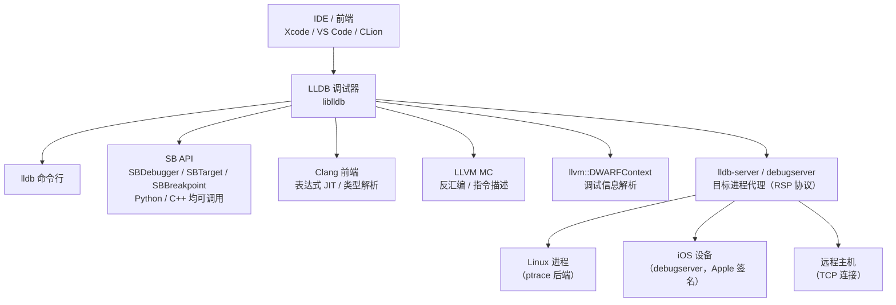
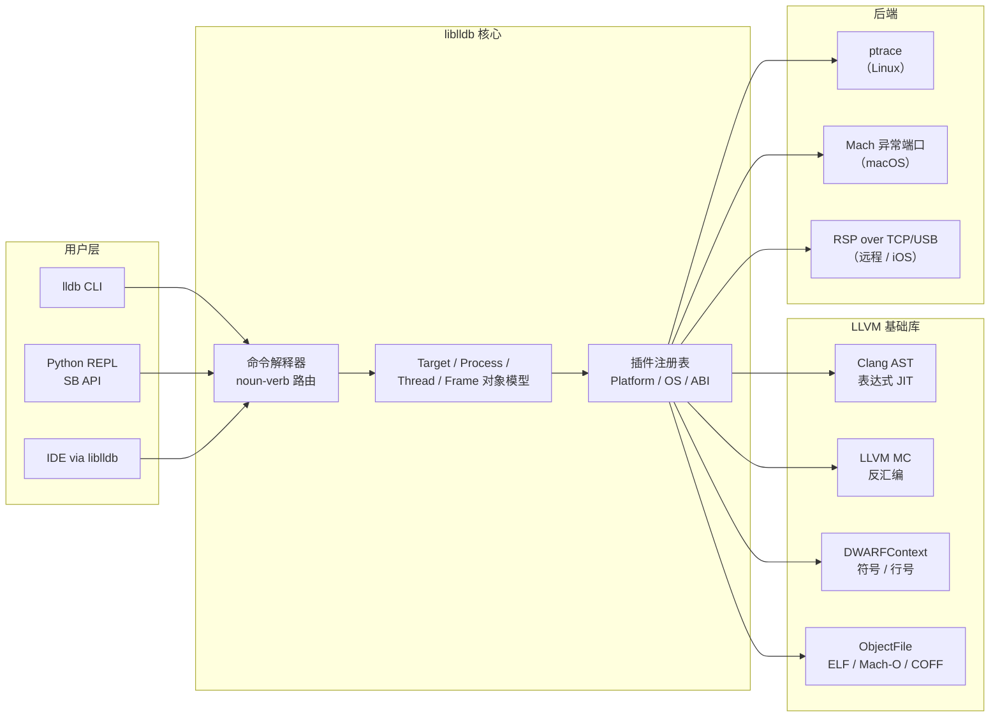
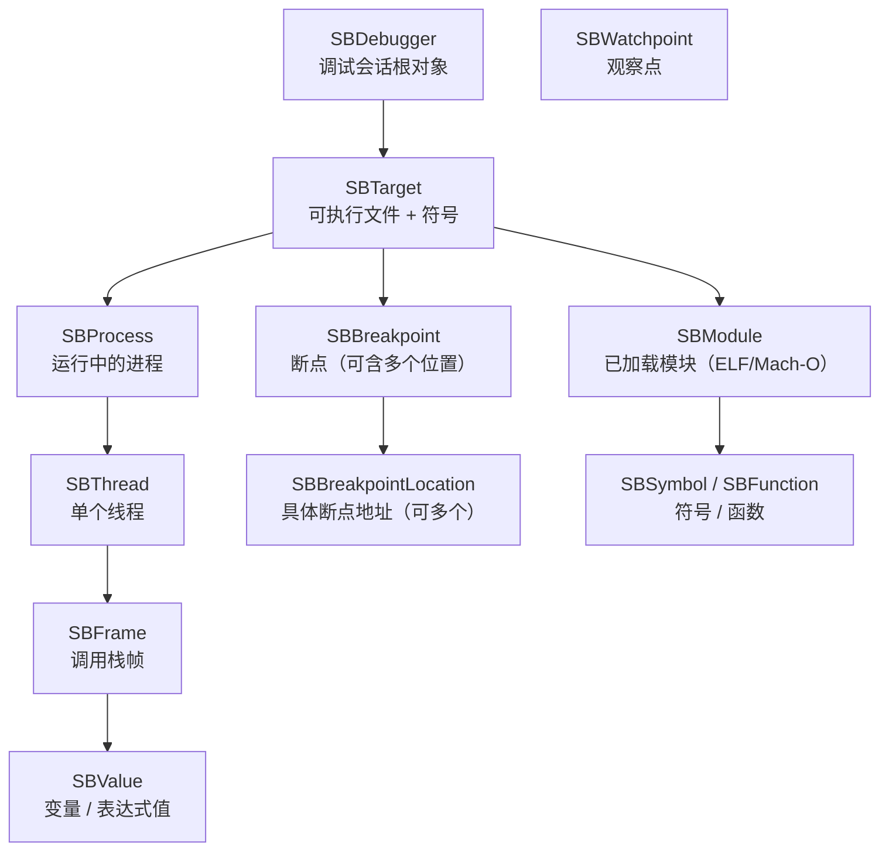

# 调试器原理与实战（9）· LLDB原理与实战

> [!abstract] TL;DR
> - **LLDB 是 LLVM 项目的官方调试器**：复用 Clang 前端做表达式求值与类型解析，复用 LLVM 反汇编引擎做指令显示，天生理解 C++/Objective-C/Swift 类型系统。
> - **命令结构 `<noun> <verb>`**：如 `breakpoint set`、`thread step-over`，语义比 GDB 的缩写更清晰；同时提供 GDB 命令别名（`b`/`n`/`s`/`p` 均可用）以降低迁移成本。
> - **模块化后端**：`lldb-server` 作为独立目标进程代理（类 gdbserver），通过 GDB Remote Serial Protocol (RSP) 与主进程通信，同一套前端可对接本地进程、iOS 设备（debugserver）、远程 Linux。
> - **Python SB API**：`SBDebugger`/`SBTarget`/`SBBreakpoint` 等脚本化接口比 GDB Python 更系统、类型更安全，是 LLDB 自动化与插件生态的核心。
> - **macOS/iOS 调试主力**：配合 `debugserver`（Apple 签名版 lldb-server），是 Xcode 唯一支持的底层调试通道，对 Objective-C、Swift runtime 有原生感知。

本篇是「调试器原理与实战」第 9 篇，紧承 [[08.GDB原理与实战]] 对 GDB 的剖析。两者在功能上高度重叠，但架构出发点截然不同：GDB 是"单体 C 程序"逐步扩展而来，LLDB 是"从第一天就为可复用的库生态而设计"。理解 LLDB 的架构，也是理解 LLVM 工具链如何以模块化方式共享前端/后端能力的最佳视角。调试信息层（DWARF 符号、地址←→行号映射）与 [[05.调试信息DWARF]] 强相关，LLDB 复用 LLVM 的 `llvm::DWARFContext` 解析它们；栈展开依赖 [[11.ELF文件详解/46.eh_frame节.md]] 与 [[11.ELF文件详解/32.debug_frame节.md]]。后续 Windows 侧比较见 [[10.WinDbg与x64dbg]]。

---

## 概述与定位

### LLDB 是什么

LLDB（Low Level Debugger）是 LLVM 生态下的调试器，2010 年前后由 Apple 主导启动，目的是替代 GDB 成为 macOS/iOS 的默认调试器。它并非从零写起，而是最大程度地**重用 LLVM/Clang 已有组件**：

| 能力 | LLDB 复用的 LLVM/Clang 组件 |
|---|---|
| 表达式求值（`expr`） | Clang 前端：词法/语法分析 → AST → JIT 编译执行 |
| 类型系统（C++/ObjC/Swift） | Clang `ASTContext`/`CompilerType` |
| 反汇编（`disassemble`） | LLVM MC 层（支持所有 LLVM 目标架构） |
| DWARF 符号解析 | LLVM `llvm::DWARFContext`（`libDebugInfoDWARF`） |
| 目标文件/节解析 | LLVM `llvm::object::ObjectFile`（ELF/Mach-O/COFF 统一） |

这意味着 LLDB **天生支持 LLVM 支持的所有架构**（x86、ARM、AArch64、RISC-V、MIPS、PowerPC 等）的反汇编与寄存器描述，而无需像 GDB 那样为每个架构写独立的反汇编适配层。

### LLDB 在工具链中的位置



> [!warning] 示例输出为示意
> 上图为架构示意，非运行时拓扑截图。

---

## 原理与机制

### 架构：liblldb 与分层设计

LLDB 的核心是 **`liblldb`**，一个共享库，对外暴露 SB API（Scripting Bridge API）。`lldb` 命令行工具本身不过是这个库的一个薄客户端。这种设计让 IDE（Xcode、VS Code 的 CodeLLDB 插件）可以直接链接 `liblldb` 获得全功能调试，而不必解析调试器的文本输出。

内部分层大致如下：



> [!warning] 示例输出为示意
> 分层为概念图，实际 LLDB 内部类层次更细（`ProcessLinux`、`DynamicLoaderPOSIXDYLD`、`SymbolFileDWARF` 等），图仅示意模块边界。

### 命令结构：`<noun> <verb>`

GDB 命令大多是动词主导（`break`、`print`、`step`），LLDB 采用**名词-动词**结构，语义更统一、补全更规则：

| LLDB 命令 | GDB 等价命令 | 含义 |
|---|---|---|
| `breakpoint set --name main` | `break main` | 在函数名设断点 |
| `breakpoint set --file foo.c --line 42` | `break foo.c:42` | 在文件行设断点 |
| `breakpoint list` | `info breakpoints` | 列出所有断点 |
| `breakpoint delete 1` | `delete 1` | 删除断点 1 |
| `breakpoint enable 2` | `enable 2` | 启用断点 2 |
| `breakpoint command add 1` | `commands 1` | 给断点加命令 |
| `thread backtrace` | `backtrace` / `bt` | 打印调用栈 |
| `thread step-over` | `next` | 步进（不进函数） |
| `thread step-in` | `step` | 步入（进函数） |
| `thread step-out` | `finish` | 步出当前函数 |
| `thread list` | `info threads` | 列出所有线程 |
| `thread select 2` | `thread 2` | 切换到线程 2 |
| `frame variable` | `info locals` | 显示局部变量 |
| `frame variable foo` | `print foo` | 打印变量 |
| `frame select 3` | `frame 3` | 切换到第 3 帧 |
| `memory read 0x400080` | `x/16xb 0x400080` | 读内存 |
| `register read rip` | `info register rip` | 读寄存器 |
| `process launch` | `run` | 启动程序 |
| `process attach --pid 1234` | `attach 1234` | 附加进程 |
| `process detach` | `detach` | 解除附加 |
| `process kill` | `kill` | 终止进程 |
| `expression foo + 1` | `print foo + 1` | 求值表达式 |
| `disassemble --count 10` | `disas /10` | 反汇编 |
| `target modules list` | `info sharedlibrary` | 列出已加载模块 |
| `watchpoint set variable foo` | `watch foo` | 观察点 |

> LLDB 也内置了大量 GDB 兼容别名（`b`/`bt`/`n`/`s`/`p`/`x` 等），从 GDB 迁移时常用命令基本无需改写。

### 表达式求值：Clang JIT

LLDB 的 `expression`（或简写 `expr`/`p`）命令与 GDB 最大的差异在于**求值深度**：

- GDB：内建一个轻量表达式解析器，对复杂 C++ 表达式（模板实例化、lambda、重载运算符）支持有限。
- LLDB：把表达式发送给 **Clang 前端**，生成 LLVM IR，再用 JIT（`llvm::LLJIT`）编译为机器码，直接在目标进程地址空间执行，结果映射回宿主机。

这使 LLDB 能在 `expr` 中：
- 调用任意已链接的函数（包括运行时 Objective-C 方法）
- 实例化 C++ 模板
- 使用 `auto`/lambda
- 读写寄存器伪变量（`$rip`/`$rax`）

代价是第一次 `expr` 启动 Clang 有冷启动延迟（通常 < 1s），之后缓存上下文再求值则很快。

### lldb-server 与 RSP 协议

LLDB 把"控制目标进程"的能力抽离到 **`lldb-server`** 进程，通过 **GDB Remote Serial Protocol（RSP）** over UNIX socket 或 TCP 与 `liblldb` 主进程通信。

```mermaid
sequenceDiagram
    autonumber
    participant LLDB as lldb 主进程<br/>（liblldb + 用户）
    participant SRV as lldb-server<br/>（目标侧）
    participant PT2 as ptrace<br/>（内核）
    participant APP as 被调试程序

    LLDB->>SRV: 启动 lldb-server 或 TCP 连接
    LLDB->>SRV: RSP: qSupported（协商特性）
    SRV-->>LLDB: 特性列表（qXfer:memory-map:read+ 等）
    LLDB->>SRV: RSP: vRun（启动进程）或 vAttach（附加）
    SRV->>PT2: ptrace(PTRACE_TRACEME) / PTRACE_ATTACH
    PT2-->>SRV: tracee 停止
    SRV-->>LLDB: T05 thread:p1.t1;（stop-reply packet）
    LLDB->>SRV: RSP: m addr,len（读内存）
    SRV->>PT2: /proc/pid/mem 或 PTRACE_PEEKTEXT
    PT2-->>SRV: 内存数据
    SRV-->>LLDB: 十六进制内存数据
    LLDB->>SRV: RSP: Z0,addr,1（设软件断点）
    SRV->>PT2: PTRACE_POKETEXT (写 0xCC)
    LLDB->>SRV: RSP: c（continue）
    SRV->>PT2: PTRACE_CONT
    PT2-->>SRV: SIGTRAP（断点命中）
    SRV-->>LLDB: T05 thread:p1.t1;（停止通知）
```

> [!warning] 示例输出为示意
> RSP 包格式简化示意（实际包含校验和 `$packet#xx`），流程基于 LLDB 源码 `GDBRemoteCommunicationClient.cpp` 的实现逻辑。

这套分离架构的好处：
1. `lldb-server` 可以单独运行在嵌入式设备/iOS 上（`debugserver` 是 Apple 签名的 `lldb-server`）
2. 主进程崩溃不会杀死目标进程
3. 跨平台调试（主机 macOS，目标 Linux/Android）只需替换 `lldb-server`

### macOS/iOS：Mach 异常端口路径

在 macOS 上，`lldb-server`/`debugserver` 不走 `ptrace`（Apple 的 `ptrace` 功能严重受限），而是走 **Mach 异常端口**（与 [[02.ptrace原理]] 三平台对照节描述的机制相同）：

1. `debugserver` 调用 `task_get_exception_ports` 把目标 task 的异常消息路由到自己的 Mach 端口。
2. 目标触发 `EXC_BREAKPOINT`（int 3/BRK）或 `EXC_BAD_ACCESS` 时，内核向端口发消息，目标线程挂起。
3. `debugserver` 接收消息，读取/修改寄存器（`thread_get_state` / `thread_set_state`）和内存（`mach_vm_read_overwrite` / `mach_vm_write`），回复消息恢复执行。

iOS 上还需要 `debugserver` 有 `com.apple.private.security.no-container` 和 `get-task-allow` 权利签名，才能 attach 到第三方 App，这正是越狱调试的关键权限门槛。

---

## 三平台对照

| 维度 | Linux（LLDB + lldb-server） | macOS（LLDB + debugserver） | Windows（LLDB 实验性支持） |
|---|---|---|---|
| 进程控制后端 | `ptrace(2)`（经 `ProcessLinux` 插件） | Mach 异常端口（`ProcessMachCore` / `ProcessKDP`） | Windows Debug API（`ProcessWindows` 插件，仍不成熟） |
| lldb-server 对应物 | `lldb-server` | `debugserver`（Apple 签名，随 Xcode 发布） | 无稳定官方版本 |
| 主要使用场景 | 服务器/嵌入式/交叉调试 | macOS App / iOS App（Xcode 默认） | 较少；WinDbg/x64dbg 仍是主流 |
| DWARF 读取 | `llvm::DWARFContext` 读 ELF `.debug_*` | 同左，或 dSYM bundle（独立 `.debug_info`） | `llvm::DWARFContext` 读 PE/COFF 内嵌 DWARF（GCC/clang-cl 编译物）；PDB 由 `SymbolFilePDB` 插件（实验性）支持 |
| Swift/ObjC 感知 | 弱（需 LLDB 配套 Swift 工具链） | 原生：理解 ObjC isa、Swift 存在容器、ARC 引用计数 | 无 |
| IDE 集成 | VS Code CodeLLDB 插件（`liblldb`） | Xcode（直接嵌入 `liblldb`）/ VS Code lldb-dap | VS Code CodeLLDB（可用但 Windows 体验不及 MSVC） |
| 二进制格式 | ELF | Mach-O | PE/COFF |

---

## 数据结构 / 对象模型

### LLDB 核心对象层次



> [!warning] 示例输出为示意
> 对象层次基于 LLDB 公开 SB API 文档，简化了部分中间层（如 `SBSection`、`SBType` 等）。

关键对象说明：

- **`SBDebugger`**：最顶层的会话对象，管理全局设置（目标平台、默认架构）。一个进程可创建多个 `SBDebugger` 以并行调试多个目标。
- **`SBTarget`**：对应一个可执行文件（包含它加载的所有模块）。断点、watchpoint 附着在 `SBTarget` 上（不附着在进程上，这样重启进程断点不丢）。
- **`SBProcess`**：运行中的进程实例。提供 `ReadMemory` / `WriteMemory` / `GetThreadAtIndex` 等。
- **`SBThread`**：线程。每次停止后通过 `GetStopReason()` 查停止原因（断点/信号/单步/崩溃）。
- **`SBFrame`**：调用帧。`GetVariables()` 返回局部变量列表（`SBValueList`），`EvaluateExpression()` 在帧上下文求值。
- **`SBBreakpoint`**：逻辑断点（一个函数名可能对应多个内联实例 → 多个 `SBBreakpointLocation`）。

### SBValue：LLDB 的变量表示

`SBValue` 是 LLDB 中最重要的数据容器，统一表示局部变量、全局变量、寄存器、表达式结果：

```python
# 示例：通过 SB API 遍历所有局部变量
frame = thread.GetFrameAtIndex(0)
variables = frame.GetVariables(True, True, True, True)  # locals, statics, args, inScopeOnly
for var in variables:
    print(f"{var.GetName()} = {var.GetValue()} (type: {var.GetTypeName()})")
```

`SBValue` 还支持：
- `GetChildMemberWithName("field")` — 访问结构体字段
- `GetChildAtIndex(n)` — 访问数组元素
- `CreateValueFromExpression()` — 动态求值
- 设置 `SummaryString` / `SyntheticChildrenProvider` 实现自定义格式化

---

## Python 脚本与 SB API

### 为什么 LLDB 的 Python API 比 GDB 更好

GDB 的 Python API 大量操作通过字符串（把命令字符串发给解释器，再解析文本输出）；LLDB 的 **SB API** 是**类型化的 C++ 类** 通过 SWIG 暴露给 Python，每个操作都有明确的方法、参数类型和返回类型，不依赖文本解析。

| 维度 | GDB Python | LLDB SB API |
|---|---|---|
| 对象类型 | `gdb.Breakpoint`/`gdb.Frame`/`gdb.Value` 等（数量有限） | 50+ `SB*` 类，覆盖调试器所有概念 |
| 表达式求值 | `gdb.parse_and_eval()` — 内建解析器 | `frame.EvaluateExpression()` — Clang JIT |
| 断点回调 | `gdb.Breakpoint.stop()` | `SBBreakpointLocation.SetCallback()` / `HandleCommand` |
| 事件监听 | 有限的事件钩子 | `SBListener` + `SBEvent`：完整事件系统（进程状态变化/断点/日志） |
| 类型综合器 | `gdb.printing` pretty-printer | `SBTypeSummary` / `SBTypeSynthetic`（更结构化） |

### 基本脚本骨架

```python
# lldb_example.py ── 在 LLDB Python REPL 里执行（lldb 命令行下 `script import lldb_example`）
import lldb

def count_calls(frame: lldb.SBFrame, loc: lldb.SBBreakpointLocation, dict):
    """断点回调：每次命中打印调用计数，然后继续执行。"""
    count_calls.hits = getattr(count_calls, 'hits', 0) + 1
    thread = frame.GetThread()
    process = thread.GetProcess()
    print(f"[hit #{count_calls.hits}] {frame.GetFunctionName()} "
          f"at {frame.GetLineEntry().GetFileSpec().GetFilename()}"
          f":{frame.GetLineEntry().GetLine()}")
    return False   # 返回 False = 不停止，继续执行


def setup(debugger: lldb.SBDebugger, command: str, result, internal_dict):
    """作为 LLDB 命令脚本的入口（`command script add -f lldb_example.setup setup`）。"""
    target: lldb.SBTarget = debugger.GetSelectedTarget()
    bp: lldb.SBBreakpoint = target.BreakpointCreateByName("malloc")
    bp.SetScriptCallbackFunction("lldb_example.count_calls")
    print(f"Breakpoint #{bp.GetID()} set on malloc with callback.")
```

### SBBreakpoint 高级用法

```python
import lldb

def demo_breakpoints(debugger: lldb.SBDebugger):
    target: lldb.SBTarget = debugger.GetSelectedTarget()

    # 1. 按文件行设断点
    bp_line: lldb.SBBreakpoint = target.BreakpointCreateByLocation("main.c", 42)

    # 2. 按正则表达式匹配函数名（批量断）
    bp_regex: lldb.SBBreakpoint = target.BreakpointCreateByRegex("^SSL_.*")

    # 3. 按地址设断点
    bp_addr: lldb.SBBreakpoint = target.BreakpointCreateByAddress(0x400800)

    # 4. 条件断点（只在 x > 10 时停止）
    bp_line.SetCondition("x > 10")

    # 5. 命中次数：第 5 次才真正停下
    bp_line.SetIgnoreCount(4)

    # 6. 遍历所有断点位置
    for i in range(bp_regex.GetNumLocations()):
        loc: lldb.SBBreakpointLocation = bp_regex.GetLocationAtIndex(i)
        addr: lldb.SBAddress = loc.GetAddress()
        sym: lldb.SBSymbol = addr.GetSymbol()
        print(f"  location {i}: {sym.GetName()} @ {addr.GetLoadAddress(target):#x}")
```

### 读写内存与寄存器

```python
def read_memory_example(process: lldb.SBProcess, target: lldb.SBTarget):
    err = lldb.SBError()
    # 读 16 字节
    data: bytes = process.ReadMemory(0x400000, 16, err)
    if err.Success():
        print(data.hex())

    # 写 1 字节（写 0xCC = int 3）
    process.WriteMemory(0x400800, b'\xCC', err)

def read_register(thread: lldb.SBThread):
    frame = thread.GetFrameAtIndex(0)
    regs = frame.GetRegisters()           # SBValueList，按组：通用/浮点/向量
    for reg_group in regs:
        for reg in reg_group:
            if reg.GetName() == "rip":
                print(f"RIP = {int(reg.GetValue(), 16):#x}")
```

---

## 数据格式化：type summary / synthetic

LLDB 的自定义数据显示分两层：

### type summary：控制变量的单行显示

```bash
# 内联 Python 格式字符串（快速）
type summary add --summary-string "${var.size} elements" "std::vector<*>"

# 或用 Python 函数（强大）
type summary add --python-function mymod.vec_summary "std::vector<*>"
```

Python 函数形式：

```python
def vec_summary(valobj: lldb.SBValue, internal_dict) -> str:
    size = valobj.GetChildMemberWithName('_M_impl') \
                 .GetChildMemberWithName('_M_finish').GetValueAsUnsigned() - \
           valobj.GetChildMemberWithName('_M_impl') \
                 .GetChildMemberWithName('_M_start').GetValueAsUnsigned()
    return f"std::vector of size {size // 8}"   # 假设 64 位元素
```

### type synthetic：控制子节点展开

```python
class VectorSyntheticProvider:
    """让 LLDB 把 std::vector<T> 展开成 [0]/[1]/[2]... 子节点。"""
    def __init__(self, valobj: lldb.SBValue, internal_dict):
        self.valobj = valobj
        self.update()

    def update(self):
        impl = self.valobj.GetChildMemberWithName('_M_impl')
        self.start = impl.GetChildMemberWithName('_M_start').GetValueAsUnsigned()
        self.finish = impl.GetChildMemberWithName('_M_finish').GetValueAsUnsigned()
        self.elem_type = self.valobj.GetType().GetTemplateArgumentType(0)
        self.elem_size = self.elem_type.GetByteSize()

    def num_children(self) -> int:
        if self.elem_size == 0:
            return 0
        return (self.finish - self.start) // self.elem_size

    def get_child_at_index(self, index: int) -> lldb.SBValue:
        addr = self.start + index * self.elem_size
        return self.valobj.CreateValueFromAddress(
            f"[{index}]", addr, self.elem_type
        )

    def get_child_index(self, name: str) -> int:
        try:
            return int(name.strip('[]'))
        except ValueError:
            return -1

# 注册
def __lldb_init_module(debugger: lldb.SBDebugger, internal_dict):
    debugger.HandleCommand(
        'type synthetic add -l myplugin.VectorSyntheticProvider "std::vector<*>"'
    )
```

> LLDB 自带的 `lldb.formatters.cpp.libcxx` / `libstdcpp` 模块已为 libc++/libstdc++ 的 `std::vector`/`std::map`/`std::string` 等提供了完整的 summary 和 synthetic，`settings set target.import-std-module true` 可进一步改善表达式中对 STL 类型的求值。

---

## 实操：一个完整的 LLDB 调试流程

以调试一个 x86-64 Linux 程序 `./target` 为例（程序有一个 `segfault` 崩溃问题）：

### 1. 启动与加载

```bash
lldb ./target
```

> [!warning] 示例输出为示意
> 以下所有 LLDB 命令输出均为示意，在本机 Windows 环境下无法直接运行，以 Linux/macOS 实机为准。

```text
(lldb) target create "./target"
Current executable set to '/home/user/target' (x86_64).
```

### 2. 设断点

```bash
(lldb) breakpoint set --name main
Breakpoint 1: where = target`main + 0 at main.c:10:5, address = 0x00000000004006a0

(lldb) breakpoint set --file main.c --line 25
Breakpoint 2: where = target`process_input + 42 at main.c:25:9, address = 0x0000000000400730
```

### 3. 运行与命中

```bash
(lldb) process launch -- arg1 arg2
Process 12345 launched: '/home/user/target' (x86_64)
Process 12345 stopped
* thread #1, name = 'target', stop reason = breakpoint 1.1
    frame #0: 0x00000000004006a0 target`main(argc=3, argv=0x7fff...) at main.c:10:5
   7    #include <stdio.h>
   8    #include <stdlib.h>
   9
-> 10   int main(int argc, char *argv[]) {
   11       printf("start\n");
```

> [!warning] 示例输出为示意

### 4. 单步与变量查看

```bash
(lldb) thread step-over          # 等价 GDB 的 next
(lldb) frame variable            # 等价 GDB 的 info locals
(lldb) frame variable buf        # 等价 GDB 的 print buf
(lldb) expression strlen(buf)    # Clang JIT 求值，可调用任意函数
```

### 5. 崩溃时查看现场

```bash
(lldb) process launch
...
Process 12345 stopped
* thread #1, stop reason = EXC_BAD_ACCESS (SIGSEGV) (signal SIGSEGV)
    frame #0: 0x00007fff...
(lldb) thread backtrace           # 打印完整调用栈
(lldb) frame variable             # 查看崩溃帧的局部变量
(lldb) register read              # 查看所有寄存器
(lldb) memory read --size 8 --format x $rsp   # 查看栈顶
```

> [!warning] 示例输出为示意

### 6. 远程调试（Linux 目标机）

```bash
# 目标机启动 lldb-server（监听 1234 端口）
$ lldb-server gdbserver 0.0.0.0:1234 -- ./target arg1

# 本机 LLDB 连接
$ lldb
(lldb) target create ./target
(lldb) gdb-remote 192.168.1.100:1234
(lldb) breakpoint set --name main
(lldb) process continue
```

> [!warning] 示例输出为示意
> 远程调试使用 GDB RSP 协议，lldb-server 版本需与 LLDB 主进程匹配（同一 LLVM 版本构建）以保证协议兼容性。

---

## 与 GDB 的架构与能力对比

| 维度 | GDB | LLDB |
|---|---|---|
| 发布年份 | 1986（GNU 项目） | 2010（LLVM 项目） |
| 核心语言 | C（大量全局状态） | C++（面向对象，库化设计） |
| 架构风格 | 单体，内部模块化程度低 | 插件化（Platform/ABI/ObjectFile/SymbolFile 均为插件） |
| 反汇编器 | 内建（`opcodes` 库，各架构独立实现） | 复用 LLVM MC（支持所有 LLVM 目标架构） |
| 表达式求值 | 内建 C/C++ 解析器（GDB expression evaluator） | Clang 前端 + LLVM JIT（完整 C++/ObjC/Swift） |
| DWARF 解析 | 内建 DWARF 解析器 | 复用 `llvm::DWARFContext` |
| Python API | `gdb` 模块（较早引入，API 覆盖较浅） | `lldb` SB API（类型化，覆盖调试器全部概念） |
| 远程协议 | GDB RSP（原创方） | GDB RSP（兼容实现，支持 LLDB 扩展包） |
| 多目标 | `inferior` 概念，多进程支持 | `SBTarget` 多个，支持同时调试多进程 |
| 主力平台 | Linux（GNU 生态） | macOS/iOS（Xcode 默认）；Linux 可用 |
| Windows 支持 | MinGW/Cygwin 路径，PE/PDB 支持有限 | 实验性 Windows 支持（`ProcessWindows`），PE/PDB 插件 |
| Rust/Swift 支持 | Rust：`rust-gdb` 脚本；Swift：无 | Swift：Apple 官方支持；Rust：`rust-lldb` 脚本 |
| 命令风格 | 动词主导（`break`/`print`/`next`），大量缩写 | 名词-动词（`breakpoint set`），缩写可用 |
| 配置文件 | `~/.gdbinit` | `~/.lldbinit` |

---

## 小结

1. **架构即复用**：LLDB 最大的设计选择是"不重造轮子"——把 Clang/LLVM 已经做好的前端、反汇编、DWARF 解析全部拿来用，自己专注于调试器的控制流逻辑和 SB API 的设计。这让它在 C++/ObjC/Swift 类型感知上远超 GDB。

2. **`lldb-server` 分离**：把"控制目标进程"解耦到独立进程，通过 GDB RSP 协议通信。macOS 上的 `debugserver` 是这个模型的典型实例，iOS 调试也建立在同一套协议上。

3. **命令结构更规范**：`<noun> <verb>` 让命令语义自描述，`--option` 风格便于脚本生成；同时保留 GDB 别名以降低迁移门槛。GDB 命令对照表见上节。

4. **SB API 是 LLDB 的核心优势**：50+ 类型化类覆盖调试器全部概念，Python/C++ 均可调用，不依赖文本解析，是 IDE 集成、自动化测试、逆向分析脚本的首选接口。

5. **数据格式化体系**：`type summary` + `type synthetic` 让自定义数据显示变得可声明、可复用；LLDB 标准库已内置 libc++/libstdc++ STL 格式化器。

6. **平台格局**：macOS/iOS 调试 LLDB 是唯一选择（Xcode 独占）；Linux 上 LLDB 可替换 GDB 用于日常开发，lldb-server 支持远程/嵌入式场景；Windows 支持仍不成熟，见 [[10.WinDbg与x64dbg]]。

---

## 相关阅读

- **GDB 原理与对比基础** → [[08.GDB原理与实战]]
- **DWARF 调试信息（LLDB 符号解析的底层依据）** → [[05.调试信息DWARF]]、[[11.ELF文件详解/24.debug节.md]]、[[11.ELF文件详解/26.debug_info节.md]]、[[11.ELF文件详解/27.debug_line节.md]]
- **栈展开（thread backtrace 的基础）** → [[11.ELF文件详解/46.eh_frame节.md]]、[[11.ELF文件详解/32.debug_frame节.md]]
- **macOS Mach 异常机制详情** → [[02.ptrace原理]]（三平台对照节）
- **Windows 调试器** → [[10.WinDbg与x64dbg]]
- **反调试与 LLDB 对抗** → [[11.调试器与反调试]]
- **参考资料**：[LLDB 官方文档](https://lldb.llvm.org/)、[LLDB Python API 参考](https://lldb.llvm.org/python_api.html)（以官网为准，版本不同 API 有差异）

---

⬅️ 上一篇 [[08.GDB原理与实战]] ｜ 🏠 [[00.调试器原理与实战总览]] ｜ 下一篇 [[10.WinDbg与x64dbg]] ➡️
