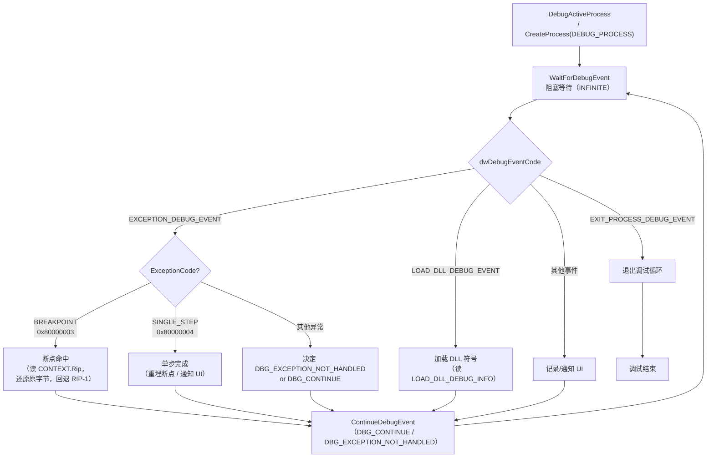
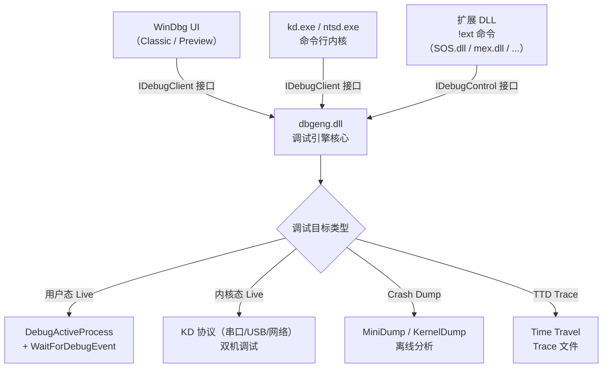
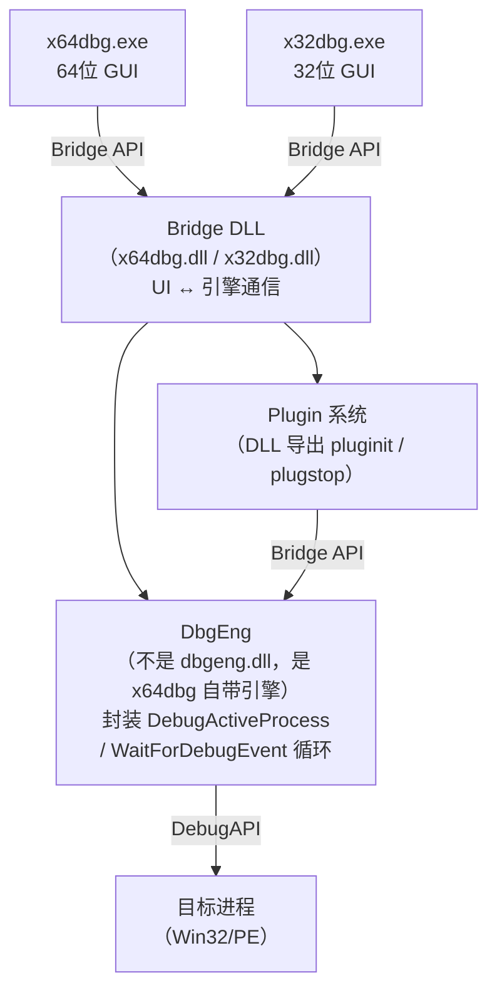

# 调试器原理与实战（10）· WinDbg与x64dbg

> [!abstract] TL;DR
> - **Windows 调试 API 三件套**：`DebugActiveProcess` 附加目标、`WaitForDebugEvent` 阻塞等待调试事件（`DEBUG_EVENT` 结构）、`ContinueDebugEvent` 恢复执行——对应 Linux 的 `ptrace(ATTACH)` + `waitpid` + `ptrace(CONT)`；读写内存靠 `ReadProcessMemory`/`WriteProcessMemory`，操作寄存器靠 `GetThreadContext`/`SetThreadContext`。
> - **WinDbg**：微软官方调试器，同时覆盖**用户态**（`ntsd.exe` 内核）和**内核态**（`kd.exe` / 双机调试），核心引擎是 `dbgeng.dll`；扩展命令（`!`）通过加载 `.dll` 插件动态扩展；符号系统靠 `.sympath` + `.reload` 加载 PDB，与 [[06.PDB与Windows符号]] 深度耦合；新特性 **TTD（Time Travel Debugging）** 把进程执行录制为 trace 文件，支持时间旅行式回放与反向调试。
> - **x64dbg**：开源、纯用户态、图形化；插件生态丰富（ScyllaHide 反反调试、Scylla 脱壳/IAT 修复）；是逆向工程的主力工具，与 [[33 系列逆向]] 互补。
> - **定位对比**：WinDbg = 系统级/内核调试/崩溃分析首选；x64dbg = 用户态逆向/脱壳/动态分析首选。
> - **三平台**：Linux `ptrace` + `waitpid` / Windows `DebugAPI` / macOS `task_for_pid` + 异常端口——本质相同：劫持执行、收事件、发信号。

本篇是系列「调试器实战」板块的第三篇（前两篇是 [[08.GDB原理与实战]] 和 [[09.LLDB原理与实战]]），视角从 POSIX 世界转向 **Windows 原生调试体系**。底层 API 的设计哲学与 `ptrace` 大相径庭，但目的相同：拦截目标、读/写状态、恢复执行。理解 Windows DebugAPI 之后，WinDbg 和 x64dbg 的行为就有了根基，反调试检测（[[11.调试器与反调试]]）也能拆得更清楚。

PE 文件的调试数据结构（`IMAGE_DEBUG_DIRECTORY`、RSDS/PDB 路径）已在 [[13.PE文件详解/14-详解PE文件(十四)：调试数据.md]] 详述；符号系统已在 [[06.PDB与Windows符号]] 展开，本篇互补其运行视角，聚焦"调试器在运行时怎么与这些结构交互"。

---

## 概述与定位

### Windows 调试生态的两个层次

Windows 调试工具可按**调试层次**和**开放程度**分成两个象限：

| | 微软官方 | 开源/社区 |
|---|---|---|
| **内核态 + 用户态** | WinDbg（WinDbg Preview / Classic） | — |
| **用户态** | Visual Studio Debugger | x64dbg、OllyDbg（已过时） |

**WinDbg** 是微软调试基础设施的公开面：它既能调试普通进程（用户态），也能通过串口/USB/网络做双机内核调试，还能分析内核转储（Kernel Dump）。企业崩溃分析、驱动开发、安全研究的系统级场景，WinDbg 是首选。

**x64dbg** 填补了 OllyDbg 退出历史舞台后留下的空白：纯用户态、图形化、开源（GPL-3.0），有活跃的插件生态，逆向工程师的日常脱壳、函数 hook、动态分析几乎都靠它完成。

两者并不是竞争关系，而是互补：系统级问题找 WinDbg，二进制逆向动态分析用 x64dbg。

---

## 原理与机制

### Windows 调试 API（DebugAPI）

Windows 内核在 `ntoskrnl.exe` 中实现了调试基础设施，`kernel32.dll` / `ntdll.dll` 暴露用户态接口。与 Linux `ptrace` 的"所有操作统一一个系统调用"不同，Windows 调试 API 是一组独立函数。

#### 核心函数

```c
// ---- 附加/启动 ----
// 附加到已运行的进程（需要 DEBUG_PROCESS 访问权限）
BOOL DebugActiveProcess(DWORD dwProcessId);

// 或者从一开始就以调试方式创建进程
BOOL CreateProcess(
    LPCTSTR lpApplicationName,
    LPTSTR  lpCommandLine,
    ...
    DWORD   dwCreationFlags,   // 含 DEBUG_PROCESS | DEBUG_ONLY_THIS_PROCESS
    ...
    LPPROCESS_INFORMATION lpProcessInformation
);

// ---- 事件等待 ----
// 阻塞，等待目标产生调试事件；dwMilliseconds = INFINITE 则永久等待
BOOL WaitForDebugEvent(
    LPDEBUG_EVENT lpDebugEvent,   // 输出：调试事件详情
    DWORD         dwMilliseconds
);

// ---- 恢复执行 ----
// dwContinueStatus: DBG_CONTINUE（调试器处理了事件）
//                   DBG_EXCEPTION_NOT_HANDLED（把异常传回目标）
BOOL ContinueDebugEvent(
    DWORD dwProcessId,
    DWORD dwThreadId,
    DWORD dwContinueStatus
);

// ---- 分离 ----
BOOL DebugActiveProcessStop(DWORD dwProcessId);

// ---- 读写内存 ----
BOOL ReadProcessMemory(HANDLE hProcess, LPCVOID lpBaseAddress,
                       LPVOID lpBuffer, SIZE_T nSize, SIZE_T *lpNumberOfBytesRead);
BOOL WriteProcessMemory(HANDLE hProcess, LPVOID lpBaseAddress,
                        LPCVOID lpBuffer, SIZE_T nSize, SIZE_T *lpNumberOfBytesWritten);

// ---- 寄存器读写（通过 CONTEXT 结构）----
BOOL GetThreadContext(HANDLE hThread, LPCONTEXT lpContext);
BOOL SetThreadContext(HANDLE hThread, const CONTEXT *lpContext);
```

#### `DEBUG_EVENT` 结构

`WaitForDebugEvent` 填充的 `DEBUG_EVENT` 是 Windows 调试事件系统的核心。它用 `dwDebugEventCode` 区分事件类型，联合体 `u` 携带不同子结构：

```c
typedef struct _DEBUG_EVENT {
    DWORD dwDebugEventCode;   // 事件类型（见下表）
    DWORD dwProcessId;
    DWORD dwThreadId;
    union {
        EXCEPTION_DEBUG_INFO      Exception;       // dwDebugEventCode == EXCEPTION_DEBUG_EVENT
        CREATE_THREAD_DEBUG_INFO  CreateThread;
        CREATE_PROCESS_DEBUG_INFO CreateProcessInfo;
        EXIT_THREAD_DEBUG_INFO    ExitThread;
        EXIT_PROCESS_DEBUG_INFO   ExitProcess;
        LOAD_DLL_DEBUG_INFO       LoadDll;
        UNLOAD_DLL_DEBUG_INFO     UnloadDll;
        OUTPUT_DEBUG_STRING_INFO  DebugString;     // OutputDebugString() 触发
        RIP_INFO                  RipInfo;
    } u;
} DEBUG_EVENT, *LPDEBUG_EVENT;
```

| `dwDebugEventCode` | 值 | 触发时机 | 典型用途 |
|---|---|---|---|
| `EXCEPTION_DEBUG_EVENT` | 1 | 目标进程产生异常（含 `int3` 断点 / 单步 / 访问违例） | 断点命中、单步完成 |
| `CREATE_THREAD_DEBUG_EVENT` | 2 | 新线程创建 | 线程追踪 |
| `CREATE_PROCESS_DEBUG_EVENT` | 3 | 进程创建（首个事件） | 初始化符号、设初始断点 |
| `EXIT_THREAD_DEBUG_EVENT` | 4 | 线程退出 | 清理线程状态 |
| `EXIT_PROCESS_DEBUG_EVENT` | 5 | 进程退出 | 结束调试循环 |
| `LOAD_DLL_DEBUG_EVENT` | 6 | DLL 加载 | 延迟符号加载、DLL 断点 |
| `UNLOAD_DLL_DEBUG_EVENT` | 7 | DLL 卸载 | 清理符号 |
| `OUTPUT_DEBUG_STRING_EVENT` | 8 | `OutputDebugString()` 调用 | 日志收集 |

对于 `EXCEPTION_DEBUG_EVENT`，`u.Exception.ExceptionRecord.ExceptionCode` 区分异常类型：

| ExceptionCode | 含义 | 对应 Linux 信号 |
|---|---|---|
| `EXCEPTION_BREAKPOINT` (0x80000003) | `int3` 断点 | `SIGTRAP` |
| `EXCEPTION_SINGLE_STEP` (0x80000004) | 单步（TF 标志或 DR6） | `SIGTRAP` |
| `EXCEPTION_ACCESS_VIOLATION` (0xC0000005) | 内存访问违例 | `SIGSEGV` |
| `EXCEPTION_STACK_OVERFLOW` (0xC00000FD) | 栈溢出 | `SIGSEGV` |

#### 调试事件循环

调试器的主体是一个以 `WaitForDebugEvent` 为核心的事件循环——这是所有 Windows 调试器（WinDbg、x64dbg、Visual Studio）共有的骨架：



> [!warning] 示例输出为示意
> 上图流程为原理级示意，实际调试器在每个节点还有线程追踪、命令队列、UI 通知等并发逻辑。

---

## 三平台对照

三大平台的调试基础设施解决同一个问题——"父进程监控子进程的执行"——但 API 设计风格差异显著：

| 维度 | Linux | Windows | macOS |
|---|---|---|---|
| **核心接口** | `ptrace(request, pid, addr, data)` | `DebugActiveProcess` / `WaitForDebugEvent` / `ContinueDebugEvent` | `task_for_pid()` 获取 `task_t` + 异常端口（`mach_exception_port`） |
| **附加机制** | `ptrace(PTRACE_ATTACH, pid, …)` → 目标收 `SIGSTOP` | `DebugActiveProcess(pid)` → 目标暂停 | 发送 `task` 端口，注册异常处理端口 |
| **等待事件** | `waitpid(pid, &status, 0)` | `WaitForDebugEvent(&evt, INFINITE)` | `mach_msg()` 在异常端口上阻塞 |
| **恢复执行** | `ptrace(PTRACE_CONT, pid, …)` | `ContinueDebugEvent(pid, tid, DBG_CONTINUE)` | 向内核异常端口回复（`KERN_SUCCESS`） |
| **读写内存** | `ptrace(PTRACE_PEEKTEXT/POKETEXT)` 或 `/proc/pid/mem` | `ReadProcessMemory` / `WriteProcessMemory` | `vm_read` / `vm_write` |
| **寄存器** | `ptrace(PTRACE_GETREGS/SETREGS)` → `user_regs_struct` | `GetThreadContext/SetThreadContext` → `CONTEXT` | `thread_get_state/thread_set_state` → `arm_thread_state64_t` 等 |
| **单步** | `ptrace(PTRACE_SINGLESTEP)` → 内核设 TF 位 | `SetThreadContext` 设 `CONTEXT.EFlags.TF=1`，再 `ContinueDebugEvent` | `thread_set_state` 设 CPSR.SS / T 标志 |
| **事件模型** | 信号：`SIGTRAP`/`SIGSTOP`/`SIGSEGV` 等 | 结构化事件：`DEBUG_EVENT.dwDebugEventCode` 枚举 | Mach 异常消息：`EXC_BREAKPOINT`/`EXC_BAD_ACCESS` 等 |
| **调试符号** | DWARF（`.debug_*` 节，ELF 格式） | PDB（独立文件，[[06.PDB与Windows符号]]） | DWARF in Mach-O（`__DWARF` segment） |
| **代表调试器** | GDB（[[08.GDB原理与实战]]）、LLDB（[[09.LLDB原理与实战]]） | WinDbg、x64dbg、Visual Studio | LLDB（[[09.LLDB原理与实战]]）、Instruments |

### 设计哲学对比

- **Linux ptrace**：接口极简，所有操作归于一个系统调用，通过 `request` 参数区分；事件通过信号机制与 `waitpid` 对接，调试器和被调试进程之间的通信完全在内核内完成。代价是"父进程才能调试子进程"这一限制（`PTRACE_ATTACH` 的权限检查、`/proc/sys/kernel/yama/ptrace_scope`）。
- **Windows DebugAPI**：多函数、基于 Handle、事件结构化（`DEBUG_EVENT` 是一个完整的结构体，不是信号码），读写内存和寄存器有独立 API，粒度更细。另一个关键差异：Windows 调试器收到事件后**目标所有线程都暂停**，而 Linux 只有被 `SIGSTOP` 的线程停下。
- **macOS Mach 异常**：通过 Mach 端口（IPC 机制）传递异常，调试器是异常的"接收服务"而非父进程——这允许非父子关系的调试，但要求 `task_for_pid` 的特殊权限（macOS SIP 对此严格限制，LLDB 在 macOS 上需要 codesign 的 `get-task-allow` entitlement）。

---

## 数据结构 / 流程详解

### `CONTEXT` 结构——寄存器快照

`CONTEXT` 是 Windows 调试中最重要的数据结构，它是目标线程寄存器状态的完整快照。调试器通过 `GetThreadContext` 读取、`SetThreadContext` 写回：

```c
// x64 CONTEXT 关键字段（简化，真实结构有 1200+ 字节）
typedef struct _CONTEXT {
    DWORD64 ContextFlags;    // 指定哪些组件有效（CONTEXT_FULL / CONTEXT_DEBUG_REGISTERS 等）

    // 调试寄存器（需 CONTEXT_DEBUG_REGISTERS）
    DWORD64 Dr0, Dr1, Dr2, Dr3;   // 硬件断点地址（最多 4 个）
    DWORD64 Dr6;                   // 调试状态（上次命中哪个 DR）
    DWORD64 Dr7;                   // 调试控制（启用位、触发条件、操作数长度）

    // 通用寄存器（需 CONTEXT_INTEGER）
    DWORD64 Rax, Rcx, Rdx, Rbx;
    DWORD64 Rsp, Rbp, Rsi, Rdi;
    DWORD64 R8, R9, R10, R11, R12, R13, R14, R15;
    DWORD64 Rip;              // 程序计数器（断点命中后调试器回退 Rip -= 1）

    // 标志寄存器（需 CONTEXT_CONTROL）
    DWORD64 EFlags;           // 含 TF（Trap Flag，位 8）——单步控制

    // 浮点/SIMD（需 CONTEXT_FLOATING_POINT）
    // M128A FltSave / XMM0–XMM15 ...
} CONTEXT;
```

软件断点（`0xCC`）命中时，`Rip` 已指向 `int3` 的**下一条指令**（Windows 与 Linux 行为相同——CPU 执行 `int3` 后 RIP 已自增）。调试器处理断点的步骤：

1. `GetThreadContext` 读 `Rip`（值为 `断点地址 + 1`）。
2. 把 `0xCC` 还原为原字节（`WriteProcessMemory`）。
3. `SetThreadContext` 将 `Rip -= 1` 回退到断点地址。
4. 设 `EFlags.TF = 1` 并 `ContinueDebugEvent`，目标单步执行原指令。
5. 收到 `EXCEPTION_SINGLE_STEP`，重新写入 `0xCC`，清 `EFlags.TF`，继续。

### 硬件断点（DR 寄存器）

Windows 硬件断点通过 `CONTEXT` 的 `Dr0–Dr7` 控制，原理与 [[03.断点原理]] 中描述的 x86 调试寄存器完全一致：

- `Dr0–Dr3`：最多 4 个断点地址。
- `Dr7`：控制寄存器，每个 DR 有"全局/本地启用位"、"触发条件"（执行/写/读写）、"操作数长度"（1/2/4/8 字节）。
- `Dr6`：命中状态，`WaitForDebugEvent` 收到 `EXCEPTION_SINGLE_STEP` 时读 `Dr6` 判断是哪个 DR 命中。

```c
// 设置 DR0 为执行断点（写入 CONTEXT 后 SetThreadContext）
ctx.ContextFlags = CONTEXT_DEBUG_REGISTERS;
GetThreadContext(hThread, &ctx);

ctx.Dr0 = targetAddress;        // 断点地址
ctx.Dr7 |= 1;                   // 本地启用 DR0（L0 位）
// DR7 条件字段：00=执行触发（默认），10=写触发，11=读写触发

SetThreadContext(hThread, &ctx);
```

---

## WinDbg 深度解析

### 架构与组件

WinDbg 的架构是**引擎与 UI 分离**的设计：



`dbgeng.dll` 是整套体系的核心，它实现了 `IDebugClient`、`IDebugControl`、`IDebugSymbols`、`IDebugDataSpaces` 等 COM 接口。外部工具（包括 Python 脚本）可以直接 `CoCreateInstance` 这个引擎，不需要启动 WinDbg UI。

### 符号系统：`.sympath` 与 `.reload`

WinDbg 的符号系统与 [[06.PDB与Windows符号]] 描述的 PDB/符号服务器机制直接对接：

```text
; 设置符号路径（优先本地缓存，再查微软公共符号服务器）
.sympath srv*C:\Symbols*https://msdl.microsoft.com/download/symbols

; 追加私有符号路径
.sympath+ C:\MyProject\x64\Debug

; 强制重新加载所有模块符号（常在附加后或 DLL 加载后执行）
.reload /f

; 查看已加载模块和符号状态
lm          ; 列出所有模块
!sym noisy  ; 开启符号加载诊断输出（排查符号找不到的问题）
```

调试器加载符号的流程（与 [[13.PE文件详解/14-详解PE文件(十四)：调试数据.md]] 直接呼应）：

1. 收到 `LOAD_DLL_DEBUG_EVENT`，从 `LOAD_DLL_DEBUG_INFO.lpImageName` 得到 DLL 路径。
2. 解析 DLL 的 `IMAGE_DEBUG_DIRECTORY`（`DataDirectory[6]`），找 `TYPE_CODEVIEW` 条目，读出 RSDS 块里的 **GUID + Age + PDB 路径**。
3. 按 `.sympath` 依次在本地缓存、私有路径、符号服务器中以 `GUID\Age\xxx.pdb` 路径格式查找 PDB。
4. 加载 PDB，建立"地址 → 函数名 + 源码行"映射，供后续 `k`（栈回溯）、`u`（反汇编标注）等命令使用。

### `!` 扩展命令

WinDbg 的 `!` 命令（感叹号前缀）调用扩展 DLL 导出的函数，这是 WinDbg 可扩展性的核心机制：

```text
!ext_name.command [args]    ; 显式指定 DLL
!command                    ; 在已加载扩展中按名查找
```

常用内置/预装扩展：

| 扩展 DLL | 典型命令 | 场景 |
|---|---|---|
| `exts.dll`（内置） | `!address`、`!heap`、`!peb`、`!teb` | 地址分析、堆检查、进程/线程环境块 |
| `ntsdexts.dll` | `!locks`、`!cs` | 死锁分析 |
| `SOS.dll` | `!clrstack`、`!dumpheap`、`!threads` | .NET / CLR 调试 |
| `mex.dll` | `!mex.tl`、`!mex.us`（社区工具） | 增强栈分析 |
| `jsprovider.dll` | `dx` 命令（数据模型） | 结构化对象浏览 |

```text
; 查看进程环境块（PEB）
!peb

; 查看堆内存（检测损坏）
!heap -a

; .NET 托管堆统计
.loadby sos mscorwks
!dumpheap -stat

; 数据模型：枚举所有进程
dx @$cursession.Processes

; 函数参数/局部变量（需符号）
dv            ; display locals
dt _PEB @$peb ; 按结构体格式化显示
```

### 用户态调试实操

> [!warning] 示例输出为示意
> 以下所有 WinDbg 命令输出均为代表性示意，非本机实跑。地址、偏移因目标程序和操作系统版本而异。

```text
; ---- 附加到进程 ----
windbg -p 1234          ; 命令行附加到 PID 1234
.attach 1234            ; WinDbg 内部附加

; ---- 基本流程 ----
g                       ; go（继续执行）
bp 0x00401000           ; 设软件断点（地址）
bp mymodule!MyFunction  ; 设符号断点
bl                      ; 列出所有断点
bd 0                    ; 禁用断点 #0
bc *                    ; 删除所有断点
t                       ; trace（单步进入）
p                       ; step（单步越过）

; ---- 查看状态 ----
r                       ; 显示所有寄存器
r rax                   ; 显示 rax
r rip=0x00401234        ; 修改 rip（跳到指定地址）
dd @rsp                 ; 显示栈顶 DWORD 数组（示意地址）
db 0x00401000 L20       ; 显示 0x00401000 处 0x20 字节
k                       ; 显示调用栈（需符号）
kv                      ; 调用栈 + 参数值

; ---- 内存搜索 ----
s -b 0x00400000 L0x10000 90 90 90   ; 搜索 NOP sled

; ---- 反汇编 ----
u mymodule!main         ; 反汇编 main 函数起始
uf mymodule!main        ; 反汇编整个函数（follow calls，跨页）
```

### 内核态调试

WinDbg 的内核态调试（KD）通过 **KD 协议**与目标机器通信，支持串口/USB 3.0/网络（KDNET）三种传输：

```text
; ---- 在目标机（被调试）配置启动项 ----
; 管理员 cmd 执行：
bcdedit /debug on
bcdedit /dbgsettings net hostip:192.168.1.100 port:50000 key:a.b.c.d

; ---- 在宿主机启动 WinDbg ----
windbg -k net:port=50000,key=a.b.c.d

; ---- 内核调试常用命令 ----
!process 0 0            ; 列出所有进程（简略）
!process 0 7            ; 列出所有进程（详细含线程栈）
!drvobj \Driver\MyDrv 3 ; 查看驱动对象
!irp <addr>             ; 解析 IRP 结构
lkd> g                  ; 继续内核执行

; 内核断点
bp nt!NtCreateFile      ; 系统调用断点
ba r4 0xffff...         ; 硬件访问断点（读，4 字节）
```

> [!warning] 示例输出为示意
> 内核调试地址均为示意。真实内核地址随 KASLR 每次启动不同；内核符号需要 `.sympath` 指向微软符号服务器，`nt!NtCreateFile` 这类符号才能解析。

### TTD（Time Travel Debugging）时间旅行调试

TTD 是 WinDbg Preview 引入的核心特性，也是 Windows 平台独有的调试能力。其原理是**在运行时录制进程的每条指令执行轨迹**，保存为 `.run` + `.idx` trace 文件，调试器可以在这个 trace 上**反向重放**——不仅能向前步进，还能**倒退**回任意历史状态。

```text
; ---- 录制（通过 WinDbg Preview UI 或命令行）----
ttd.exe -out C:\traces\myapp.run myapp.exe

; ---- 打开 trace 文件 ----
windbg -z C:\traces\myapp.run

; ---- TTD 特有命令 ----
!tt 0                   ; 跳到 trace 起点
!tt 100                 ; 跳到 trace 终点（100%）
!tt 50.0                ; 跳到 50% 位置
p-                      ; 反向单步（step backward）
g-                      ; 反向执行到上一个断点
!positions              ; 列出 trace 中所有线程当前位置

; TTD 查询（类 SQL 语法，通过 dx 数据模型）
dx @$cursession.TTD.Calls("kernelbase!CreateFileW")      ; 查询所有 CreateFileW 调用记录
dx @$cursession.TTD.Memory(0x401000, 0x401010, "w")      ; 查询对某地址范围的写操作历史
```

TTD 的实现原理是动态二进制插桩（类似 Intel PIN / DynamoRIO）：WinDbg 注入的 `TTDRecorder.dll` 在目标进程里对每条指令做影子记录，把寄存器和内存变化序列化到 trace 文件。回放时，调试引擎在 trace 上"重放"而非真正执行，因此可以任意倒退。代价是：录制开销大（CPU 密集型程序通常有 5–20x 的性能下降），trace 文件可能很大。

**TTD 的典型用途**：

- 崩溃根因分析：崩溃发生后打开 trace，反向追溯到第一次"坏数据"写入的时刻。
- 竞态条件：录制多线程程序，在 trace 上观察时序而不依赖重现。
- 安全研究：捕获漏洞 PoC 的完整执行轨迹，分析 exploit 链路。

---

## x64dbg 深度解析

### 架构与定位

x64dbg 是开源（GPL-3.0）的 Windows 用户态调试器，分为 `x64dbg`（64 位目标）和 `x32dbg`（32 位目标）两个可执行文件，内核同源。



UI 与引擎通过 Bridge DLL 的共享内存通信，这意味着插件可以完全控制调试引擎，也意味着 x64dbg 天然支持脚本化（x64dbg Script Language，`x64dbg-script`）。

### 图形化界面布局

x64dbg 的主窗口分四个主要面板，布局直接反映"动态分析"工作流：

| 面板 | 内容 | 常用操作 |
|---|---|---|
| **反汇编面板** | 目标代码反汇编 + 注释 | `F2` 设软件断点，`F9` 运行，`F7` 单步进，`F8` 单步过 |
| **寄存器面板** | 当前线程 CONTEXT（GP/FP/XMM） | 双击值可直接修改寄存器 |
| **栈面板** | 当前 RSP 所在栈帧内存 | 右键追踪调用者 |
| **内存面板** | 任意内存 hex dump + 编辑 | `Ctrl+G` 跳地址，右键设观察点 |

另有独立窗口：Symbols（模块 + 导出表）、Breakpoints（断点列表）、Call Stack、Threads、Handles、Notes（用户注释）等。

### 插件生态

x64dbg 插件系统通过 DLL 的导出函数 `pluginit` / `plugstop` / `CBXX`（事件回调）与主程序交互。

| 插件 | 功能 | 典型场景 |
|---|---|---|
| **ScyllaHide** | 隐藏调试器特征（反反调试） | 分析有反调试措施的恶意软件（与 [[11.调试器与反调试]] 直接相关） |
| **Scylla / x64dbg-Scylla** | IAT 扫描修复 + PE 转储（脱壳） | OEP 定位后 dump 加壳 PE，修复 IAT，还原可运行 EXE |
| **xAnalyzer** | 自动分析 API 调用，注释参数 | 快速理解未知二进制的行为 |
| **BarbTab** | 多 tab 会话管理 | 同时调试多个目标 |
| **StringAssist** | 字符串搜索 + 高亮 | 快速定位关键字符串引用 |
| **APIInfo** | MSDN 参数说明内联显示 | 减少查文档往返 |

### 脱壳工作流（以 Scylla 为例）

脱壳（unpacking）是 x64dbg 的标志性用途，配合 Scylla 插件：

> [!warning] 示例输出为示意
> 以下操作步骤为原理示意，实际加壳方案千变万化，步骤因壳的类型而异。

1. **找 OEP（Original Entry Point）**：加壳程序启动时先执行壳代码，解密/解压原始代码到内存，最后 `jmp` 到 OEP。常用手法：
   - 对 `.text` 段设**内存断点**（访问权限）——壳首次向 OEP 区域写入时触发。
   - 在常见 API（`VirtualAlloc`/`VirtualProtect`）处设断点，trace 到 `jmp` 跳出壳代码范围。
   - x64dbg 的"运行到用户代码"（`Alt+F9`）会在从系统 DLL 返回到模块时停下，常落在 OEP 附近。

2. **dump 内存**：OEP 停下后，通过 Scylla 的 **Dump** 功能把目标模块的内存映像保存为 PE 文件。

3. **修复 IAT**：dump 的 PE 里 IAT 可能仍指向壳的 thunk，Scylla 的 **IAT Autosearch + Fix Dump** 会扫描 IAT 项、通过 `GetProcAddress` 逆向查找对应 DLL+函数名，重建正确的导入表。

4. **验证**：用 PE-bear / CFF Explorer 检查 dump 文件的 `IMAGE_IMPORT_DESCRIPTOR`；用 x64dbg 重新加载 dump，确认能正常运行。

### x64dbg 脚本化

x64dbg 支持内置脚本语言（类 OllyDbg Script 语法），也可通过插件调用 Python/Lua：

```text
; x64dbg script 示例：在 CreateFileW 处记录第一个参数（文件名）
bp CreateFileW             ; 设断点
run                        ; 执行到断点
;--- 到达断点 ---
; RCX 是第一个参数（x64 调用约定），指向文件名 UNICODE 字符串
log "CreateFileW called: {s:rcx}"   ; 打印字符串
run                        ; 继续
```

---

## WinDbg vs x64dbg 定位对比

| 维度 | WinDbg | x64dbg |
|---|---|---|
| **开源** | 否（微软专有） | 是（GPL-3.0） |
| **调试层次** | 用户态 + **内核态** | 仅用户态 |
| **核心引擎** | `dbgeng.dll`（COM 接口，可编程） | 自有引擎（Bridge DLL） |
| **崩溃分析** | 原生支持 MiniDump / KernelDump | 不支持 dump 分析 |
| **符号集成** | 深度，与微软 PDB / 符号服务器原生集成 | 基础（PE 导出表 + PDB 可选插件） |
| **UI 交互** | 命令行为主（Preview 版改善） | 图形化为主，操作直观 |
| **TTD** | 支持（WinDbg Preview） | 不支持 |
| **脱壳/逆向** | 较弱（非定位） | **强**（Scylla、插件生态） |
| **反反调试** | 手动（改 PEB.NtGlobalFlag 等） | 插件 ScyllaHide 自动化 |
| **脚本** | `dx`/JavaScript/Python（DbgEng API） | 内置脚本 + 插件（Python/Lua） |
| **典型用户** | 系统工程师、驱动开发者、崩溃分析工程师 | 逆向工程师、安全研究员、CTF 选手 |
| **与本系列关联** | [[06.PDB与Windows符号]]、[[13.PE文件详解/14-详解PE文件(十四)：调试数据.md]] | [[09.LLDB原理与实战]]（对比）、[[11.调试器与反调试]]（对抗） |

---

## 代码与示例

### 最小 Windows 调试器骨架（C）

以下代码展示 Windows DebugAPI 调试循环的最小实现，与 Linux ptrace 骨架形成对照（见 [[12.手写mini调试器]]）：

```c
#include <windows.h>
#include <stdio.h>

// 最小 Windows 调试器：附加到目标 PID，打印调试事件
int main(int argc, char *argv[]) {
    if (argc < 2) { printf("Usage: mindbg <pid>\n"); return 1; }
    DWORD pid = (DWORD)atoi(argv[1]);

    // 1. 附加到目标进程
    if (!DebugActiveProcess(pid)) {
        printf("DebugActiveProcess failed: %lu\n", GetLastError());
        return 1;
    }
    // 选项：目标进程退出时调试器不跟着退出
    DebugSetProcessKillOnExit(FALSE);

    printf("[*] Attached to PID %lu\n", pid);

    // 2. 调试事件循环
    DEBUG_EVENT evt = {0};
    BOOL running = TRUE;

    while (running && WaitForDebugEvent(&evt, INFINITE)) {
        DWORD continueStatus = DBG_CONTINUE;

        switch (evt.dwDebugEventCode) {

        case EXCEPTION_DEBUG_EVENT: {
            DWORD code = evt.u.Exception.ExceptionRecord.ExceptionCode;
            PVOID addr = evt.u.Exception.ExceptionRecord.ExceptionAddress;
            printf("[EXCEPTION] Code=0x%08lX Addr=%p FirstChance=%d\n",
                   code, addr, evt.u.Exception.dwFirstChance);
            // 非调试器自己设的断点，不处理 → 传回给目标
            if (code != EXCEPTION_BREAKPOINT && code != EXCEPTION_SINGLE_STEP)
                continueStatus = DBG_EXCEPTION_NOT_HANDLED;
            break;
        }

        case CREATE_PROCESS_DEBUG_EVENT:
            printf("[CREATE_PROCESS] ImageBase=%p\n",
                   evt.u.CreateProcessInfo.lpBaseOfImage);
            // 关闭文件句柄（必须，否则泄漏）
            CloseHandle(evt.u.CreateProcessInfo.hFile);
            break;

        case LOAD_DLL_DEBUG_EVENT:
            printf("[LOAD_DLL] Base=%p\n", evt.u.LoadDll.lpBaseOfDll);
            if (evt.u.LoadDll.hFile) CloseHandle(evt.u.LoadDll.hFile);
            break;

        case EXIT_PROCESS_DEBUG_EVENT:
            printf("[EXIT_PROCESS] ExitCode=%lu\n",
                   evt.u.ExitProcess.dwExitCode);
            running = FALSE;
            break;

        default:
            printf("[EVENT] Code=%lu\n", evt.dwDebugEventCode);
            break;
        }

        // 3. 恢复目标执行
        ContinueDebugEvent(evt.dwProcessId, evt.dwThreadId, continueStatus);
    }

    DebugActiveProcessStop(pid);
    printf("[*] Detached\n");
    return 0;
}
```

> [!warning] 示例输出为示意
> 上述代码在 Windows 上可正常编译（MSVC `cl mindbg.c` 或 MinGW），但为原理示意；实际调试器还需处理多线程同步、符号加载、断点管理等。

### Linux ptrace 对照（最小骨架）

```c
// Linux 对照版：用 ptrace+waitpid 实现同等功能
#include <sys/ptrace.h>
#include <sys/wait.h>
#include <stdio.h>

int main(int argc, char *argv[]) {
    pid_t pid = atoi(argv[1]);

    // 附加（对应 DebugActiveProcess）
    ptrace(PTRACE_ATTACH, pid, NULL, NULL);
    waitpid(pid, NULL, 0);   // 等待 SIGSTOP（对应 WaitForDebugEvent）
    printf("[*] Attached to %d\n", pid);

    int status;
    while (1) {
        ptrace(PTRACE_CONT, pid, NULL, NULL);   // 对应 ContinueDebugEvent
        waitpid(pid, &status, 0);               // 对应 WaitForDebugEvent

        if (WIFEXITED(status)) { printf("[EXIT] %d\n", WEXITSTATUS(status)); break; }
        if (WIFSTOPPED(status)) {
            int sig = WSTOPSIG(status);
            printf("[STOP] signal=%d\n", sig);
            // sig == SIGTRAP → 断点或单步
            // sig == SIGSEGV → 访问违例
            // （对应 EXCEPTION_DEBUG_EVENT 的 ExceptionCode 区分）
        }
    }
    return 0;
}
```

两段代码并排对照，可以清晰看到：`DebugActiveProcess ↔ ptrace(ATTACH)`、`WaitForDebugEvent ↔ waitpid`、`ContinueDebugEvent ↔ ptrace(CONT)`、`DEBUG_EVENT.dwDebugEventCode ↔ WSTOPSIG(status)` 的一一对应关系。

---

## 实操

> [!warning] 示例输出为示意
> 以下操作场景为原理示意，非本机实跑。实际结果因 Windows 版本、目标程序、是否有符号而异。

### 场景 1：WinDbg 分析 MiniDump

崩溃分析是 WinDbg 最经典的用途。程序崩溃时 Windows 可生成 MiniDump（`.dmp`）：

```text
; 打开 dump 文件
windbg -z C:\crash\myapp.dmp

; 自动分析（最常用的第一条命令）
!analyze -v

; 典型输出片段（示意）：
;   EXCEPTION_CODE: (NTSTATUS) 0xc0000005 - Access violation
;   FAULTING_IP: mymodule!ProcessData+0x42
;   CONTEXT:  ...
;   STACK_TEXT:
;       0x...  mymodule!ProcessData+0x42
;       0x...  mymodule!HandleRequest+0x1a0
;       0x...  mymodule!WorkerThread+0x88

; 手动查看崩溃时的寄存器
r
; 手动看崩溃地址附近的反汇编
uf @rip
; 查看调用栈（需符号）
kv
```

### 场景 2：x64dbg 追踪 API 调用序列

```text
; 1. 打开目标二进制（x64dbg 菜单：File → Open）
; 2. 在 Symbols 窗口找 kernel32.CreateFileW，右键 → Toggle Breakpoint
; 3. F9 运行，等待断点命中
; 4. 断点命中后，寄存器面板显示：
;    RCX = 指向文件名的宽字符指针
;    RDX = dwDesiredAccess
;    ...（前 4 个参数在 RCX/RDX/R8/R9，其余在栈上）
; 5. 在内存面板中 Ctrl+G 输入 RCX 值，查看文件路径字符串
; 6. F9 继续，记录每次命中的文件名
```

### 场景 3：WinDbg TTD 反向追踪内存覆写

```text
; 1. 用 TTD 录制崩溃场景
;    ttd.exe -out C:\traces\crash.run badapp.exe
; 2. 打开 trace
;    windbg -z C:\traces\crash.run
; 3. 跳到崩溃时刻
;    !tt 100
; 4. 查看此时坏指针的值（示意地址）
;    r rax
; 5. 设内存写断点，反向执行到该地址最后一次被写的时刻
;    ba w8 0xdeadbeef
;    g-
; 6. 命中：看调用栈，找到是哪行代码覆写了这个指针
;    k
```

---

## 小结

1. **Windows DebugAPI 三件套**：`DebugActiveProcess`（附加）→ `WaitForDebugEvent`（等事件）→ `ContinueDebugEvent`（恢复）构成所有 Windows 调试器的底层骨架，与 Linux 的 `ptrace` + `waitpid` 设计目标相同、接口形态不同。`DEBUG_EVENT` 结构化事件模型比 Linux 信号模型信息更丰富，但代价是设计更重。

2. **`CONTEXT` 是 Windows 寄存器操作的核心**：断点命中后通过 `GetThreadContext` 读 `Rip`、`SetThreadContext` 修改 `Rip`/`EFlags.TF`/`Dr*`，统一完成软件断点恢复、单步设置、硬件断点配置。

3. **WinDbg = `dbgeng.dll` 生态**：`!` 扩展命令允许加载任意 DLL 扩展调试能力；`.sympath` + `.reload` 对接 PDB/符号服务器（[[06.PDB与Windows符号]]），让地址翻译为符号名；TTD 时间旅行调试把执行录制为可回放的 trace，支持反向调试，是崩溃分析和安全研究的强力工具。

4. **x64dbg = 开源用户态逆向主力**：GUI 直观、插件丰富（ScyllaHide 对抗反调试、Scylla 脱壳修复 IAT），与 PE 格式（[[13.PE文件详解/14-详解PE文件(十四)：调试数据.md]]）和逆向工程实践（33 系列）深度互补。

5. **三平台本质相同**：Linux `ptrace`/`waitpid`、Windows `DebugAPI`、macOS Mach 异常端口，都在解决"父/监控进程劫持目标执行、收事件、读写状态"这一核心问题；差异在 API 形态、权限模型（SIP/ptrace_scope）和调试信息格式（DWARF vs PDB）。

---

## 相关阅读

- **PE 调试数据（IMAGE_DEBUG_DIRECTORY / RSDS）**：[[13.PE文件详解/14-详解PE文件(十四)：调试数据.md]]
- **PDB 格式与符号服务器**：[[06.PDB与Windows符号]]
- **断点原理（`0xCC` / `DR*`）**：[[03.断点原理]]
- **单步机制（TF 标志）**：[[04.单步与执行控制]]
- **Linux ptrace 对照**：[[02.ptrace原理]]
- **LLDB（macOS/跨平台对照）**：[[09.LLDB原理与实战]]
- **反调试技术（与 WinDbg/x64dbg 的攻防）**：[[11.调试器与反调试]]
- **手写 mini 调试器（DebugAPI 完整实现）**：[[12.手写mini调试器]]
- **PLT 与延迟绑定（Linux 动态符号调试背景）**：[[14.动态链接与加载器详解/08.PLT与GOT与延迟绑定.md]]

---

⬅️ 上一篇 [[09.LLDB原理与实战]] ｜ 🏠 [[00.调试器原理与实战总览]] ｜ 下一篇 [[11.调试器与反调试]] ➡️
