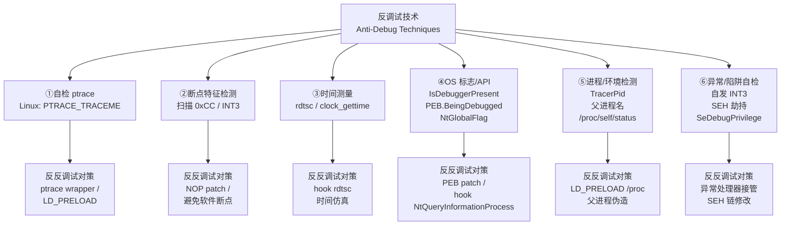
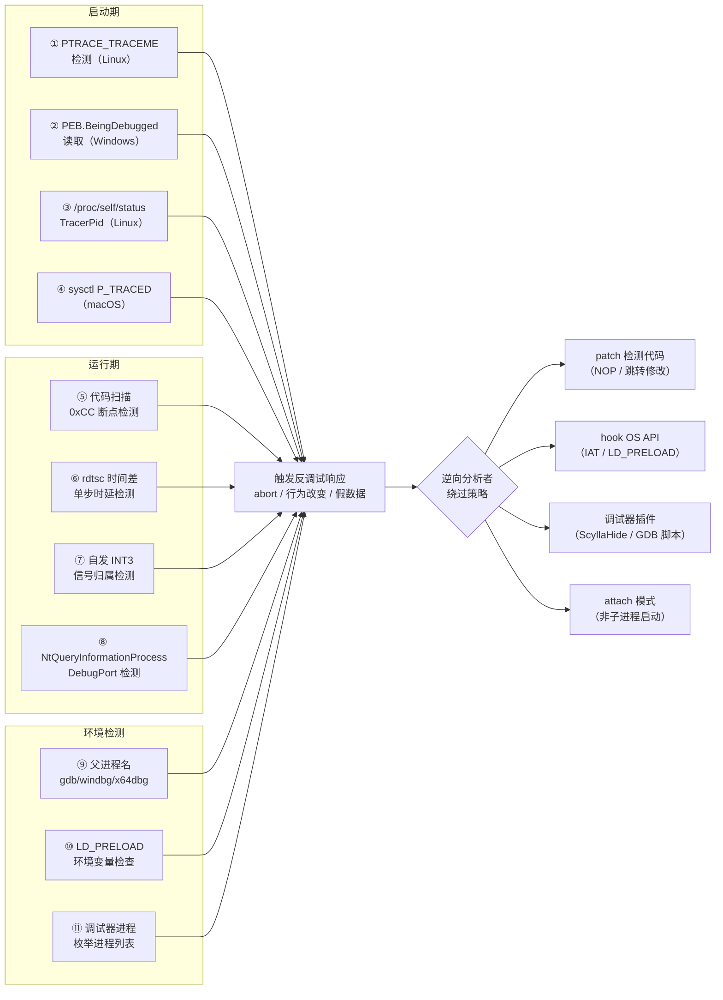

# 调试器原理与实战（11）· 调试器与反调试

> [!abstract] TL;DR
> - **反调试**是程序用于探测自身是否处于调试环境、并在发现后改变行为的技术集合，广泛存在于加壳软件、DRM、恶意软件和某些商业授权模块。
> - 技术分六大类：①**自检 ptrace**（Linux 独占）；②**检测断点特征**（扫描自身代码中的 `0xCC`，呼应 [[03.断点原理]]）；③**时间测量**（`rdtsc`/`clock_gettime` 检测单步带来的时延膨胀）；④**OS 标志与 API**（Windows `IsDebuggerPresent`、PEB `BeingDebugged`/`NtGlobalFlag`；macOS `sysctl P_TRACED`）；⑤**进程/环境检测**（`/proc/self/status` 的 `TracerPid`、父进程名/命令行）；⑥**异常/陷阱自检**（自发 `int3`、`SEH` 劫持、`SeDebugPrivilege` 探测）。
> - **反反调试**是逆向分析时绕过上述机制的对抗手段：patch 检测代码、hook OS API 返回假值、`LD_PRELOAD` 伪造 `/proc` 输出、调试器插件自动跳过反调试块。
> - 本篇立场为**分析/教育视角**，讲清每种技术的底层机制，供安全研究、逆向工程、防御加固参考。

本篇是对抗层的核心篇，承接 [[03.断点原理]] 对 `0xCC` 机制的讲解，与 [[32.hooks/00.总览.md]] 描述的 hook 体系形成交集——反调试的本质是"被调试程序用各种探针检测调试器行为"，反反调试则是"在调试器侧用 hook 或 patch 屏蔽探针输出"。上篇 [[10.WinDbg与x64dbg]] 介绍了主流 Windows 调试器，下篇 [[12.手写mini调试器]] 将在掌握对抗技术后动手实现一个具备基本反反调试能力的 mini 调试器。

---

## 概述与定位

### 为什么要研究反调试

| 场景 | 攻方（软件作者）目标 | 守方（分析者）目标 |
|---|---|---|
| 商业软件 / DRM | 防止逆向、破解授权 | 理解授权流程、分析漏洞 |
| 恶意软件 / 勒索软件 | 阻止沙箱、拖延分析 | 提取恶意行为、提炼 IOC |
| CTF 逆向题 | 增加难度 | 还原算法、找 flag |
| 安全加固（己方产品） | 检测环境异常（反作弊） | 确保检测可靠且难绕过 |

从防御设计角度：了解反调试技术的每种检测点，才能在己方产品里选出**误报率低、覆盖率高**的组合；从分析角度：了解这些技术，才能快速定位并绕过检测代码，把时间花在真正的逻辑上。

### 技术家谱概览



---

## 原理与机制

### ① 自检 ptrace（Linux）

Linux 的 `ptrace` 有一条约束：**一个进程同时只能有一个 tracer**。`ptrace(PTRACE_TRACEME, 0, NULL, NULL)` 的语义是"我愿意被父进程跟踪"，在已被调试的进程中调用它会立刻返回 `EPERM`（`errno == 1`）：

```c
/* 反调试：自检 ptrace —— Linux 下最简单的检测手段 */
#include <sys/ptrace.h>
#include <stdlib.h>
#include <errno.h>

static void anti_debug_ptrace(void) {
    if (ptrace(PTRACE_TRACEME, 0, NULL, NULL) == -1 && errno == EPERM) {
        /* 已被调试器跟踪，触发防御行为 */
        abort();   /* 或者静默改变程序逻辑 */
    }
    /* 首次成功 TRACEME 后，子进程变成可被父进程 trace 的状态；
       实际程序通常 fork 出一个子进程 re-attach 自己来持续监控。 */
}
```

> [!warning] 示例输出为示意
> 上述代码仅展示检测逻辑骨架，未在本机执行。实际商业软件会把 `ptrace` 调用混入正常逻辑流中，并对成功/失败走不同代码路径。

**机制要点**

| 要素 | 说明 |
|---|---|
| 系统调用层依据 | 内核 `security_ptrace_traceme()` / `ptrace_traceme()`：若 `current->ptrace` 非 0（已有 tracer），返回 `EPERM` |
| 检测粒度 | 进程级。子线程 `ptrace` 也受同一约束 |
| 同一技巧的扩展 | `fork` 一个子进程，让子进程 `ptrace(PTRACE_ATTACH, getppid(), ...)` 监控父进程；若已被 GDB attach，`ATTACH` 同样失败 |

**反反调试**：在 GDB / LLDB 里用 `catch syscall ptrace` 拦截调用，用 `set $rax = 0` 强制返回值为 0（成功）；或编写 `LD_PRELOAD` 库覆盖 `ptrace()` 符号，无论参数如何都返回 0。

---

### ② 断点特征检测（扫描 `0xCC`）

软件断点的底层就是把指令首字节替换为 `0xCC`（详见 [[03.断点原理]]）。程序可在运行期扫描自身代码段，寻找非预期的 `0xCC` 字节：

```c
/* 示意：扫描自身代码段的 0xCC */
#include <stdint.h>
#include <string.h>

extern char __executable_start[];  /* 链接器提供：代码段起始 */
extern char _etext[];              /* 链接器提供：代码段结束 */

static int scan_for_breakpoints(void) {
    uint8_t *p = (uint8_t *)__executable_start;
    uint8_t *end = (uint8_t *)_etext;
    while (p < end) {
        if (*p == 0xCC) return 1;  /* 发现疑似软件断点 */
        p++;
    }
    return 0;
}
```

> [!warning] 示例输出为示意
> 实际程序需结合自身二进制布局定位代码段地址，并排除源码中本来就有的 `int3`（如 `__debugbreak()` 内建或 `assert` 内嵌的 `int3`）。

**检测点与对抗**

| 攻（反调试） | 守（反反调试） |
|---|---|
| 扫描整个 `.text` 段找 `0xCC` | 改用**硬件断点**（DR0–DR3）：不修改代码内存，扫描无效 |
| 对关键函数入口做 CRC/哈希校验 | 在调试器里 hook 哈希函数，返回预期正确值 |
| `memcmp` 与 `.rodata` 里存的原始字节比对 | patch 掉比对跳转（`jne` → `nop`） |

与断点深度关联：如果分析对象里有扫描断点的逻辑，优先切换为硬件断点（WinDbg `ba e1 addr`、GDB `hbreak`）。

---

### ③ 时间测量（rdtsc / 时钟差）

调试器下的单步执行每步都需要进入内核（信号往返），每步开销通常在 **1 µs–10 µs** 量级；正常执行同样代码只需数个时钟周期（< 10 ns）。程序可利用这个**时延比**探测单步状态：

```c
/* x86-64：用 RDTSC 测量两段代码之间的时钟差 */
#include <stdint.h>
#include <stdio.h>

static inline uint64_t rdtsc(void) {
    uint32_t lo, hi;
    __asm__ volatile ("rdtsc" : "=a"(lo), "=d"(hi));
    return ((uint64_t)hi << 32) | lo;
}

#define TIMING_THRESHOLD  5000000ULL  /* 约 1.67 ms @ 3 GHz */

static void timing_check(void) {
    uint64_t t0 = rdtsc();
    /* 被测代码块（几条算术指令，正常 < 100 cycles） */
    volatile int dummy = 0;
    for (int i = 0; i < 100; i++) dummy += i;
    uint64_t t1 = rdtsc();

    if (t1 - t0 > TIMING_THRESHOLD) {
        /* 超时：很可能处于单步调试中 */
        /* 触发反调试响应 */
    }
}
```

> [!warning] 示例输出为示意
> `RDTSC` 在虚拟化环境（VMware、Hyper-V）下也可能被截获或缩放，导致误判。阈值需根据目标场景经验校准。

**更精细的时间检测手段**

| 手段 | API | 适用平台 | 粒度 |
|---|---|---|---|
| `RDTSC` | x86 汇编 | Linux / Windows / macOS (x86-64) | CPU 时钟周期，最高精度 |
| `RDTSCP` | x86 汇编 | 同上，序列化版 | 防指令重排 |
| `QueryPerformanceCounter` | Windows API | Windows | 100 ns 量级 |
| `clock_gettime(CLOCK_MONOTONIC)` | POSIX | Linux / macOS | 1 ns 量级 |
| `mach_absolute_time()` | macOS Mach API | macOS | 纳秒级 |

**反反调试**：在调试器里 hook `rdtsc` 指令（x86 Ring-3 可读，但 GDB 可用 `catch syscall` + 脚本拦截；WinDbg / x64dbg 插件可替换 `RDTSC` 返回值）；或使用**全速执行**（`continue` 而非单步），让时差不超阈值后再在关键位置设断点。

---

### ④ OS 标志与 API 检测（Windows 重点）

Windows 把调试状态暴露在多个可查询点，形成了一条完整的检测链：

#### PEB（进程环境块）标志

```
PEB（Process Environment Block，TEB.ProcessEnvironmentBlock）
  ├── BeingDebugged    [offset 0x02]  BYTE  —— 被调试时为 1
  ├── NtGlobalFlag     [offset 0x68]  DWORD —— 调试进程默认带 0x70
  │     FLG_HEAP_ENABLE_TAIL_CHECK  (0x10)
  │     FLG_HEAP_ENABLE_FREE_CHECK  (0x20)
  │     FLG_HEAP_VALIDATE_PARAMETERS (0x40)
  └── HeapForceFlags   [在 Heap 头部]  DWORD —— 调试堆会设额外标志
```

```c
/* Windows 汇编读 PEB.BeingDebugged（x64） */
static BOOL peb_being_debugged(void) {
#ifdef _WIN64
    /* GS 段基址 = TEB；TEB+0x60 = PEB；PEB+0x2 = BeingDebugged */
    BYTE being_debugged;
    __asm__ volatile (
        "movq %%gs:0x60, %%rax\n"   /* RAX = PEB */
        "movb 0x2(%%rax), %0\n"     /* BeingDebugged */
        : "=r"(being_debugged)
        :
        : "rax"
    );
    return (BOOL)being_debugged;
#else
    /* x86: FS:0x30 = PEB */
    BYTE bd;
    __asm__ volatile (
        "movl %%fs:0x30, %%eax\n"
        "movb 0x2(%%eax), %0\n"
        : "=r"(bd)
        :
        : "eax"
    );
    return (BOOL)bd;
#endif
}
```

> [!warning] 示例输出为示意
> 上述内联汇编在 MSVC 下写法不同（使用 `__readgsqword` / `__readfsdword` 内建函数）。此处为 GCC/MinGW 格式示意。

#### Windows API 检测链

```
IsDebuggerPresent()              ──→ 读 PEB.BeingDebugged（一行）
CheckRemoteDebuggerPresent()     ──→ 内部调用 NtQueryInformationProcess
NtQueryInformationProcess()      ──→ ProcessDebugPort (7) / ProcessDebugObjectHandle (30)
                                      返回非 NULL 则进程被调试
OutputDebugString() + GetLastError() ——
    调试器存在时，error 不变（0）；
    调试器不存在时，GetLastError 变为 ERROR_FILE_NOT_FOUND（某些旧版 Windows）
CloseHandle(invalid_handle)      ──→ 调试器下抛 EXCEPTION_INVALID_HANDLE；
                                      无调试器则静默失败（旧行为）
```

**反反调试（Windows 侧）**

| 检测点 | 绕过方式 |
|---|---|
| `PEB.BeingDebugged` | x64dbg/WinDbg 插件直接写 0（`eb $peb+2 0`）；ScyllaHide 自动化 |
| `PEB.NtGlobalFlag` | 写 0 到 PEB+0x68 |
| `NtQueryInformationProcess` | IAT Hook 或 Inline Hook，返回假 Port=0 |
| `CheckRemoteDebuggerPresent` | Hook，伪造 `*pbDebuggerPresent = FALSE` |

这里的 hook 原理与 [[32.hooks/00.总览.md]] 中的 IAT Hook / Inline Hook 完全对应——IAT 表里的 `NtQueryInformationProcess` 指针可以被替换为自定义函数（参见 `02-windows-api-hook.md`）。

---

### ⑤ 进程与环境检测

#### Linux：`/proc/self/status` 的 `TracerPid`

```
/proc/self/status 部分字段（被 GDB 跟踪时）：
...
TracerPid:    1234        <-- 非 0 表示正被 PID=1234 的进程跟踪
...
```

程序可在运行期解析该文件：

```c
#include <stdio.h>
#include <string.h>

static int linux_tracer_pid(void) {
    FILE *f = fopen("/proc/self/status", "r");
    if (!f) return -1;
    char line[256];
    int tracer_pid = 0;
    while (fgets(line, sizeof(line), f)) {
        if (sscanf(line, "TracerPid: %d", &tracer_pid) == 1) break;
    }
    fclose(f);
    return tracer_pid;   /* 0 = 未被跟踪；非 0 = 被调试 */
}
```

> [!warning] 示例输出为示意
> 上述解析仅为示意；真实程序中该调用会被混入大量无关 I/O 以增加静态分析难度。

**反反调试（Linux）**：最经典的手法是用 `LD_PRELOAD` 覆盖 `fopen`，当参数为 `/proc/self/status`（或 `/proc/<pid>/status`）时，返回一个经过过滤的临时文件，把 `TracerPid: xxx` 替换为 `TracerPid: 0`。

```c
/* LD_PRELOAD 示意：伪造 /proc/self/status 的 TracerPid */
#define _GNU_SOURCE
#include <dlfcn.h>
#include <stdio.h>
#include <string.h>

FILE *fopen(const char *path, const char *mode) {
    static FILE *(*real_fopen)(const char *, const char *) = NULL;
    if (!real_fopen)
        real_fopen = dlsym(RTLD_NEXT, "fopen");

    FILE *f = real_fopen(path, mode);
    if (strstr(path, "/status") && f) {
        /* 构造一个去掉 TracerPid 的临时文件并返回 */
        /* （示意，省略完整实现） */
    }
    return f;
}
```

这与 [[32.hooks/00.总览.md]] 里 `LD_PRELOAD + dlsym(RTLD_NEXT, ...)` 的完整模式（见 `03-linux-hook.md`）完全一致。

#### 父进程名检测

正常程序从 shell 启动，父进程通常是 `bash`/`zsh`/`explorer.exe`。被调试器启动时父进程是 `gdb`/`lldb`/`x64dbg`/`windbg`。

```c
/* Linux：读 /proc/<ppid>/comm 获取父进程名 */
#include <unistd.h>
#include <stdio.h>
#include <string.h>

static int parent_is_debugger(void) {
    char path[64], comm[64] = {0};
    snprintf(path, sizeof(path), "/proc/%d/comm", (int)getppid());
    FILE *f = fopen(path, "r");
    if (!f) return 0;
    fgets(comm, sizeof(comm), f);
    fclose(f);
    /* 粗暴比对；实际会列举更多调试器名 */
    return (strncmp(comm, "gdb", 3) == 0 ||
            strncmp(comm, "lldb", 4) == 0 ||
            strncmp(comm, "strace", 6) == 0);
}
```

**Windows 等价**：通过 `CreateToolhelp32Snapshot` + `Process32Next` 遍历进程列表，找到 `th32ParentProcessID == GetCurrentProcessId()` 的条目，检查其 `szExeFile` 是否是调试器名。

**反反调试**：对于父进程名检测，最直接的绕过是不以调试器为父进程——先启动目标程序，再用 `attach` 模式连接（GDB `attach <pid>`；WinDbg `-p <pid>`；x64dbg "Attach"）。

---

### ⑥ 异常与陷阱自检

#### 自发 INT3（异常归属检测）

程序主动在代码中插入 `int3`，同时设置自己的 SEH/信号处理器：

- **无调试器**：`int3` 触发 `SIGTRAP`/`EXCEPTION_BREAKPOINT`，信号被**自身处理器**捕获，程序正常继续。
- **有调试器**：调试器会先于信号处理器拦截该异常，处理后再把控制权交回（多数调试器可配置是否转发 `SIGTRAP`）；未正确转发时，自身处理器永远收不到信号——程序检测到处理器"未被调用"，触发反调试响应。

```c
/* Linux 示意：用 SIGTRAP 自检 */
#include <signal.h>
#include <setjmp.h>

static volatile int handler_called = 0;
static jmp_buf jmp_env;

static void sigtrap_handler(int sig) {
    handler_called = 1;
    longjmp(jmp_env, 1);
}

static int is_debugged_via_trap(void) {
    signal(SIGTRAP, sigtrap_handler);
    if (setjmp(jmp_env) == 0) {
        handler_called = 0;
        __asm__ volatile ("int3");   /* 自发 SIGTRAP */
        /* 若调试器拦截且不转发，程序会停在这里 */
    }
    signal(SIGTRAP, SIG_DFL);
    return !handler_called;  /* 处理器未被调用 → 调试器存在 */
}
```

> [!warning] 示例输出为示意
> 不同调试器对 `SIGTRAP` 转发策略不同。GDB 默认**不转发**调试相关信号；可用 `handle SIGTRAP pass noprint nostop` 改变此行为。LLDB 类似。

#### Windows SEH 链检测

Windows 异常分发顺序：调试器的 first-chance handler → SEH 链 → 调试器的 last-chance handler。程序可利用 first-chance 和 SEH 之间的执行差异探测调试器：

```
程序主动触发异常（如访问地址 0、除以零）
    ├── [有调试器] first-chance → 调试器中断 → 用户手动 continue → SEH 被调用
    └── [无调试器] 直接进 SEH 链处理，时序不同、堆栈帧不同
```

反反调试：在 WinDbg 里 `sxd av`（忽略 access violation first-chance）、`sxd bpe`（忽略断点）可让调试器不拦截这些异常，透明转发给 SEH。

#### SeDebugPrivilege 探测（Windows）

拥有 `SeDebugPrivilege` 的进程（通常是调试器）可以打开任意进程的句柄。被调试进程通过检测自身能否打开系统进程（如 SYSTEM 的 csrss.exe）来推断自己是否运行在调试器权限提升的环境中：

```c
/* 示意：检查是否有过高权限（调试器注入场景） */
#include <windows.h>
#include <tlhelp32.h>

static BOOL has_debug_privilege(void) {
    HANDLE hProc = OpenProcess(PROCESS_ALL_ACCESS, FALSE,
                               4 /* 通常为 System Process PID */);
    if (hProc != NULL) {
        CloseHandle(hProc);
        return TRUE;  /* 普通程序不该能打开 System Process */
    }
    return FALSE;
}
```

---

## 三平台对照

| 检测类别 | Linux | Windows | macOS |
|---|---|---|---|
| **OS 专用 API** | `ptrace(PTRACE_TRACEME)` 返回 `EPERM` | `IsDebuggerPresent()` / `CheckRemoteDebuggerPresent()` | `sysctl(CTL_KERN, KERN_PROC, ...)` 查 `P_TRACED` 标志 |
| **进程标志** | `/proc/self/status` 的 `TracerPid` | `PEB.BeingDebugged` (offset 0x02) / `PEB.NtGlobalFlag` (0x68) | `kinfo_proc.kp_proc.p_flag & P_TRACED` |
| **NT 内部接口** | `open("/proc/self/mem", ...)` 权限差异 | `NtQueryInformationProcess(ProcessDebugPort=7)` | `task_get_exception_ports` 检测异常端口是否被接管 |
| **断点扫描** | 扫描 `.text` 中的 `0xCC` | 同左 | 扫描 `__text` 中的 `0xCC` 或 `BRK #0` (arm64) |
| **时间检测** | `rdtsc` / `clock_gettime(CLOCK_MONOTONIC)` | `rdtsc` / `QueryPerformanceCounter` | `mach_absolute_time()` / `rdtsc` (x86) |
| **异常自检** | `SIGTRAP` 自发 + 信号处理器归属 | SEH + first-chance 分发时序 / `CloseHandle` 无效句柄 | Mach exception port 被接管 (`EXC_BREAKPOINT` 归属) |
| **父进程检测** | `/proc/<ppid>/comm` | `CreateToolhelp32Snapshot` + 父 PID → 进程名 | `sysctl(KERN_PROC_PID, ppid)` → `kp_proc.p_comm` |
| **调试器痕迹** | 检测 `gdb`/`strace` 在 `/proc/net/unix` 或 `LD_PRELOAD` 环境变量 | 检测 `ntice`/`SoftICE` 驱动 device name / 调试器窗口标题 | 检测 `lldb`/`dtrace` 进程 |
| **反反调试手段** | `LD_PRELOAD` 劫持 libc / GDB `handle SIGTRAP pass` / `ptrace` syscall patch | ScyllaHide 插件 / PEB 直写 / IAT Hook | LLDB `process handle --pass true SIGTRAP` / `lldb` 脚本 |

---

## 与 Hook 体系的交集

反调试技术与 [[32.hooks/00.总览.md]] 中描述的 hook 体系在两个维度深度交叉：

### 反调试用 hook 实现检测

部分反调试技术本身就是 hook——程序把 Windows 异常处理链（SEH/VEH）或 Linux 信号处理器注册为"探针"，侦测调试器是否拦截了异常。这是应用层的"显式注册"类 hook，用于感知外部行为。

### 反反调试用 hook 实现绕过

反反调试的核心武器是 **hook OS API 返回假值**：

| 目标函数 | hook 手段 | 伪造内容 |
|---|---|---|
| `IsDebuggerPresent` | IAT Hook / Inline Hook | 永远返回 0 |
| `NtQueryInformationProcess` | IAT Hook | `DebugPort` 字段置 NULL |
| `ptrace()` | `LD_PRELOAD` 覆盖 | 忽略 `PTRACE_TRACEME`，返回 0 |
| `fopen("/proc/self/status")` | `LD_PRELOAD` 覆盖 | 过滤 `TracerPid` 行 |
| `rdtsc` 指令 | x64dbg 插件替换返回值 | 固定低差值 |
| `CheckRemoteDebuggerPresent` | IAT Hook | 置 `*pbDebugger = FALSE` |

这些 hook 的底层机制见 [[32.hooks/00.总览.md]] → `02-windows-api-hook.md`（IAT/Inline Hook）和 `03-linux-hook.md`（`LD_PRELOAD`）。

---

## 反调试检测点分布（Mermaid 流程图）



---

## 数据结构：Windows PEB 反调试相关字段

```
PEB（x64，选取反调试相关字段）
偏移   大小   字段名                    用于反调试的含义
────────────────────────────────────────────────────────
0x002  BYTE   BeingDebugged             1 = 被调试；IsDebuggerPresent 读此
0x010  PVOID  ImageBaseAddress          程序映像基址
0x018  PVOID  Ldr                       → PEB_LDR_DATA（模块列表）
0x068  DWORD  NtGlobalFlag             调试进程默认 0x70（三个堆检查标志）
0x070  PVOID  NtGlobalFlagOverride     可用于绕过（写 0）
─────── 在 HeapBase 处 ───────────────────────────────────
       DWORD  HeapFlags                调试堆附加标志（含 0x40000060）
       DWORD  HeapForceFlags          调试堆强制标志（含 0x40000060）
```

多数反调试绕过工具（ScyllaHide、x64dbg 插件）都在进程启动后、执行任何用户代码前**直接写这些字段**：

```
// WinDbg 手动清除：
eb @$peb+0x2 0       // BeingDebugged = 0
ed @$peb+0x68 0      // NtGlobalFlag = 0
```

---

## 反反调试实操对照表

| 反调试手段 | 识别特征（逆向时看到…） | 绕过操作 |
|---|---|---|
| `ptrace(PTRACE_TRACEME)` | 调用后立刻检查返回值 / `errno` | GDB: `catch syscall ptrace` + `set $rax=0`；或 LD_PRELOAD |
| `IsDebuggerPresent()` | 调用后 `test al,al` / `jnz` | 调试器断在调用处，修改 `al=0`；或 ScyllaHide 自动 patch |
| `PEB.BeingDebugged` 直读 | 内联汇编读 GS/FS 偏移 | WinDbg `eb $peb+2 0`；x64dbg "Run Script" |
| `NtQueryInformationProcess` | 调用 class=7 检查 DebugPort | Hook 函数让 port=0 |
| `0xCC` 代码扫描 | 循环遍历代码段、`cmp byte ptr [rdi], 0xCC` | 改用硬件断点（`ba e1`/`hbreak`） |
| `rdtsc` 时间差 | 两次 `rdtsc` 相减后比较阈值 | x64dbg 插件返回固定差值；全速运行到感兴趣位置再 break |
| `/proc/self/status` `TracerPid` | `fopen("/proc/self/status")` + `strstr("TracerPid")` | LD_PRELOAD 过滤；或 GDB `catch syscall openat` 替换路径 |
| 父进程名检测 | `getppid()` + `open("/proc/<ppid>/comm")` | `attach` 附加模式，debugger 非父进程 |
| 自发 `int3` + 信号归属 | `signal(SIGTRAP, handler); int3;` 后检查 `handler_called` | GDB `handle SIGTRAP pass noprint nostop` |
| SEH + CloseHandle 无效句柄 | `CloseHandle(0xDEADBEEF)` 期望引发异常 | WinDbg `sxd eh`（忽略无效句柄异常） |

---

## 陷阱与常见误区

> [!warning] 分析视角的五类高频误判

1. **`LD_PRELOAD` 的 hook 只对动态链接生效**：静态链接的程序（`musl-libc` 全静态二进制）`LD_PRELOAD` 无效，需要用 `ptrace` 内存写入或改 `/proc/self/mem` 来 patch 函数体。
2. **`BeingDebugged` 清零后仍被检测**：程序可能绕过 `IsDebuggerPresent`，直接调用 `NtQueryInformationProcess(ProcessDebugPort)` 作二次确认。ScyllaHide 一般两者都 patch；手动绕过时不要只清 `BeingDebugged`。
3. **`rdtsc` 阈值因机器而异**：在虚拟机里 `rdtsc` 可能被拦截导致误判，也可能因 VM clock scale 不一致让正常程序触发检测。分析时先摸清目标环境。
4. **自发 `int3` 与编译器插入的 `int3` 冲突**：MSVC 在 Debug 构建的未初始化区域填 `0xCC`，AddressSanitizer 也会插 `int3`；扫描代码段前要区分"真正的 `0xCC` 断点"和"编译器行为留下的 `0xCC`"。
5. **多层反调试叠加**：商业壳（如 Themida、VMProtect）会把多种检测写入同一代码流，绕过其中一层后触发另一层，并对失败路径静默走错误的解密 key 而非直接崩溃，导致分析者难以察觉已进入错误流。逐一定位检测块是基本功；符号执行（angr/Triton）可辅助定位所有检测分支。

---

## 小结

1. **反调试 = 探针集合**：从自检 `ptrace` 到扫描 `0xCC`，从 `rdtsc` 时延到 PEB 标志，每种手段都是在利用调试器对目标进程留下的某种"副作用"——反调试就是把这些副作用暴露为可感知的探针。
2. **断点 `0xCC` 是最直接的指纹**：任何用软件断点分析的行为都会在代码段留下 `0xCC`；切换到硬件断点（DR0–DR3）是最省力的绕过手段，无需 patch 任何反调试逻辑。
3. **hook 是反反调试的主武器**：`LD_PRELOAD`（Linux）与 IAT/Inline Hook（Windows）可以让反调试的每一个 OS API 调用返回"无调试器"状态；原理与 [[32.hooks/00.总览.md]] 中的 hook 体系完全一致。
4. **attach 模式是最轻量的绕过**：父进程检测、`PTRACE_TRACEME` 占用检测均针对"被调试器启动"的场景；先启动目标进程再 attach，可以绕过大量启动期检测。
5. **三平台机制不同，检测逻辑通用**：Linux 依赖 `/proc` 虚拟文件系统和 `ptrace` 语义；Windows 依赖 PEB 结构和 NT 内部接口；macOS 走 Mach exception port 和 `sysctl`——底层接口各异，但"检测副作用"的思路完全平行。
6. **本文为分析/教育用途**：理解反调试机制的目的是提升安全研究效率、加固己方产品检测可靠性，不鼓励用于破坏授权保护或恶意用途。

---

## 相关阅读

- **断点原理（`0xCC` 替换与硬件断点 DR0–DR3）**：[[03.断点原理]]
- **上一篇：主流 Windows 调试器工具链**：[[10.WinDbg与x64dbg]]
- **下一篇：手写 mini 调试器（含基本反反调试支持）**：[[12.手写mini调试器]]
- **Hook 技术全景（IAT Hook / LD_PRELOAD / Inline Hook）**：[[32.hooks/00.总览.md]]
- **ELF 调试信息（DWARF 节总览）**：[[11.ELF文件详解/24.debug节.md]]
- **PLT/GOT 延迟绑定（与 IAT Hook 的对比背景）**：[[14.动态链接与加载器详解/08.PLT与GOT与延迟绑定.md]]
- **Linux Hook 详解（LD_PRELOAD + dlsym 完整流程）**：[[32.hooks/03-linux-hook.md]]

---

⬅️ 上一篇 [[10.WinDbg与x64dbg]] ｜ 🏠 [[00.调试器原理与实战总览]] ｜ 下一篇 [[12.手写mini调试器]] ➡️
