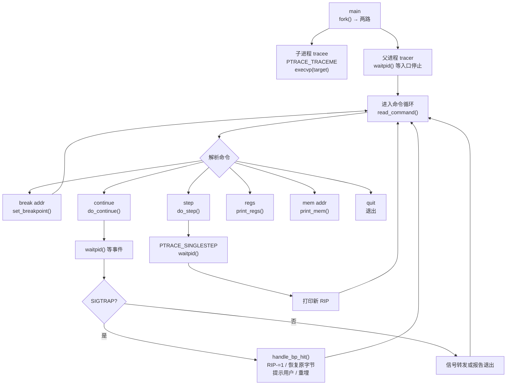
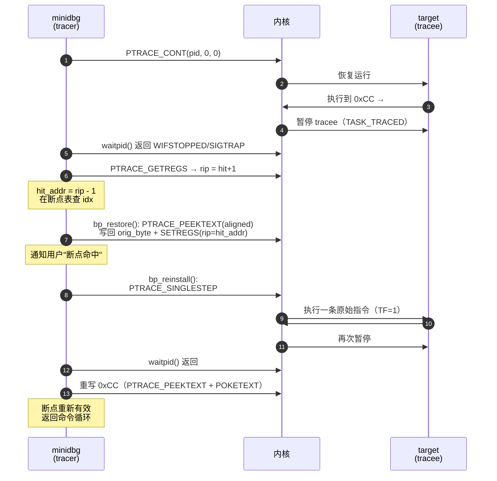

# 调试器原理与实战（12）· 手写mini调试器

> [!abstract] TL;DR
> - 用不到 500 行 C 代码，从零实现一个在 Linux x86-64 上可实际运行的最小调试器（minidbg）。
> - 覆盖调试器的完整核心循环：`fork` + `PTRACE_TRACEME` + `execvp` 启动目标并停在入口；`waitpid` 主循环 + 命令解析；`break <addr>` 软件断点（读-改-写 `0xCC`，保存原字节）；`continue` 命中（`GETREGS`、`rip-1`、写回原字节、报告，可选重埋）；`step` 单步（`PTRACE_SINGLESTEP`）；`regs` / `mem` 读寄存器与内存。
> - 这是对系列前 11 篇的**代码级串联**：[[02.ptrace原理]] 的控制接口、[[03.断点原理]] 的 `0xCC` 读-改-写、[[04.单步与执行控制]] 的 TF 机制，在此全部落地为可编译的 C 代码。
> - 真实调试器还需要 DWARF 行号表（[[05.调试信息DWARF]]）、栈展开 CFI（[[07.栈回溯unwind]]）、符号表解析，以及处理多线程、信号转发、子进程跟踪等大量边界情况——本篇只打通骨架，指出每个扩展点。

本篇是「调试器原理与实战」的**实战收束篇**，在第 1–11 篇建立了足够的理论积累后，本篇用一份端到端的 C 代码把所有机制在同一个运行时骨架里串起来。读完本篇，你应当能在一台 Linux x86-64 机器上编译运行这个 minidbg，对任意 ELF 可执行文件设断点、单步、查寄存器。

---

## 概述与定位

### minidbg 要做什么

一个最小可用的调试器需要能够：

1. **启动目标程序**，并在入口前停住（`fork` + `PTRACE_TRACEME` + `execvp`）
2. **等待调试事件**（`waitpid` 主循环）
3. **设置软件断点**（`PTRACE_PEEKTEXT` 读取原字节，写入 `0xCC`，命中后恢复）
4. **继续运行**（`PTRACE_CONT`）并在断点命中时正确处理 RIP 回退
5. **单步执行**（`PTRACE_SINGLESTEP`）
6. **读取寄存器**（`PTRACE_GETREGS`）
7. **读取内存**（`PTRACE_PEEKDATA` 或 `/proc/pid/mem`）
8. **重新埋下断点**，维持断点持续有效

这正是 GDB `run` → `break` → `continue` → `step` → `info registers` 这几条最常用命令的完整底层。

### 与前篇的映射关系

| minidbg 功能 | 依赖篇章 | 关键 ptrace 请求 |
|---|---|---|
| 启动目标停在入口 | [[02.ptrace原理]] § PTRACE_TRACEME 路径 | `PTRACE_TRACEME`, `execvp`, `waitpid` |
| 设软件断点 | [[03.断点原理]] § 软件断点：用 0xCC 替换首字节 | `PTRACE_PEEKTEXT`, `PTRACE_POKETEXT` |
| 命中后 RIP 回退 | [[03.断点原理]] § 命中-恢复-重埋循环 | `PTRACE_GETREGS`, `PTRACE_SETREGS` |
| 继续运行 | [[02.ptrace原理]] § 核心执行控制请求 | `PTRACE_CONT` |
| 单步 | [[04.单步与执行控制]] § 指令级单步 | `PTRACE_SINGLESTEP` |
| 重埋断点 | [[03.断点原理]] § 命中-恢复-重埋循环 | `PTRACE_SINGLESTEP` + `PTRACE_POKETEXT` |
| 读寄存器/内存 | [[02.ptrace原理]] § user_regs_struct | `PTRACE_GETREGS`, `PTRACE_PEEKDATA` |

---

## 原理与机制

### minidbg 主循环架构



> 图中绿色为主事件循环，蓝色为用户命令处理，橙色为断点命中处理。所有路径最终都回到 `read_command()`，保持交互性。

### 断点表设计

minidbg 需要维护一张断点表，记录每个已设断点的地址与被替换的原始字节：

```c
#define MAX_BREAKPOINTS 64

typedef struct {
    uintptr_t addr;      /* 断点虚拟地址（命令行输入的十六进制数） */
    uint8_t   orig_byte; /* 被 0xCC 替换前的原始首字节 */
    int       enabled;   /* 1=有效，0=已恢复原字节等待重埋 */
} breakpoint_t;

static breakpoint_t bp_table[MAX_BREAKPOINTS];
static int          bp_count = 0;
```

---

## 完整代码骨架

### 整体文件结构

minidbg 分为以下几个逻辑块：

1. **头文件与数据结构**
2. **断点管理**（`bp_set` / `bp_find` / `bp_remove_byte` / `bp_reinstall`）
3. **启动目标**（`launch_tracee`）
4. **事件循环**（`wait_and_dispatch`）
5. **命令处理**（`cmd_break` / `cmd_continue` / `cmd_step` / `cmd_regs` / `cmd_mem`）
6. **主函数**（`main`）

### ① 头文件与断点表

```c
/*
 * minidbg.c — 手写 mini 调试器（Linux x86-64，单文件）
 *
 * 编译：gcc -Wall -g minidbg.c -o minidbg
 * 用法：./minidbg <目标ELF>  [arg1 arg2 ...]
 *
 * 支持命令：
 *   break <hex_addr>   在地址设软件断点
 *   continue           继续运行（命中断点后自动 RIP-1 + 重埋）
 *   step               单步一条指令（PTRACE_SINGLESTEP）
 *   regs               打印全部通用寄存器
 *   mem <hex_addr>     读 8 字节内存并十六进制打印
 *   quit               杀掉 tracee 并退出
 */

#include <stdio.h>
#include <stdlib.h>
#include <string.h>
#include <errno.h>
#include <unistd.h>
#include <sys/ptrace.h>
#include <sys/wait.h>
#include <sys/user.h>   /* struct user_regs_struct */
#include <sys/types.h>
#include <stdint.h>
#include <signal.h>

/* ── 断点表 ── */
#define MAX_BP 64

typedef struct {
    uintptr_t addr;
    uint8_t   orig_byte;
    int       active;     /* 0xCC 当前在内存中=1；已恢复原字节=0 */
} bp_t;

static bp_t   g_bps[MAX_BP];
static int    g_bp_cnt = 0;
static pid_t  g_pid    = 0;   /* 全局 tracee pid，供信号清理用 */
```

### ② 断点管理函数

```c
/* ── 辅助：读一个机器字（8 字节，x86-64），以字对齐地址 ── */
static long peek_word(pid_t pid, uintptr_t addr) {
    long v = ptrace(PTRACE_PEEKTEXT, pid, (void *)addr, NULL);
    if (v == -1 && errno) {
        perror("PTRACE_PEEKTEXT");
    }
    return v;
}

static void poke_word(pid_t pid, uintptr_t addr, long val) {
    if (ptrace(PTRACE_POKETEXT, pid, (void *)addr, (void *)val) < 0)
        perror("PTRACE_POKETEXT");
}

/*
 * 在 addr 处写入 0xCC，保存原始首字节。
 * 注意：PEEKTEXT/POKETEXT 以机器字（8字节）为粒度；
 * 我们只替换最低字节（小端序，addr 处的字节即 word & 0xFF）。
 * 若 addr 不是 8 字节对齐，需先对齐再按 byte_offset 移位——
 * 下面的实现已处理非对齐情形。
 */
static int bp_set(pid_t pid, uintptr_t addr) {
    if (g_bp_cnt >= MAX_BP) {
        fprintf(stderr, "断点表已满（最多 %d 个）\n", MAX_BP);
        return -1;
    }
    /* 检查是否已有断点在此地址 */
    for (int i = 0; i < g_bp_cnt; i++) {
        if (g_bps[i].addr == addr) {
            fprintf(stderr, "地址 0x%lx 已有断点\n", addr);
            return -1;
        }
    }

    /* 计算对齐字地址和字节偏移（处理非 8 字节对齐地址） */
    uintptr_t aligned  = addr & ~(uintptr_t)(sizeof(long) - 1);
    int       byte_off = (int)(addr - aligned);

    long word     = peek_word(pid, aligned);
    uint8_t orig  = (uint8_t)((unsigned long)word >> (byte_off * 8));
    long mask     = ~((long)0xFF << (byte_off * 8));
    long patched  = (word & mask) | ((long)0xCC << (byte_off * 8));
    poke_word(pid, aligned, patched);

    g_bps[g_bp_cnt].addr      = addr;
    g_bps[g_bp_cnt].orig_byte = orig;
    g_bps[g_bp_cnt].active    = 1;
    g_bp_cnt++;

    printf("[断点 %d] 已设置在 0x%lx（原字节 0x%02x）\n",
           g_bp_cnt, addr, orig);
    return 0;
}

/* 找断点表项，返回下标；-1 表示未找到 */
static int bp_find(uintptr_t addr) {
    for (int i = 0; i < g_bp_cnt; i++)
        if (g_bps[i].addr == addr) return i;
    return -1;
}

/*
 * 恢复原字节（把 0xCC 换回 orig_byte），同时把 RIP 回退 1 字节。
 * 调用前 tracee 已暂停（waitpid 返回 SIGTRAP）。
 * 呼应 [[03.断点原理]] § 命中-恢复-重埋循环。
 */
static void bp_restore(pid_t pid, int idx) {
    uintptr_t addr     = g_bps[idx].addr;
    uint8_t   orig     = g_bps[idx].orig_byte;
    uintptr_t aligned  = addr & ~(uintptr_t)(sizeof(long) - 1);
    int       byte_off = (int)(addr - aligned);

    long word    = peek_word(pid, aligned);
    long mask    = ~((long)0xFF << (byte_off * 8));
    long restored = (word & mask) | ((long)orig << (byte_off * 8));
    poke_word(pid, aligned, restored);

    /* x86-64：int3 触发后 RIP 已指向 0xCC 后一字节，必须回退 1 */
    struct user_regs_struct regs;
    ptrace(PTRACE_GETREGS, pid, NULL, &regs);
    regs.rip = addr;   /* 等价于 regs.rip -= 1，但直接赋地址更清晰 */
    ptrace(PTRACE_SETREGS, pid, NULL, &regs);

    g_bps[idx].active = 0;  /* 原字节已在内存中，0xCC 已清除 */
}

/*
 * 重埋断点：单步执行一条指令（原始指令），然后再写 0xCC。
 * 呼应 [[04.单步与执行控制]] § 指令级单步。
 */
static void bp_reinstall(pid_t pid, int idx) {
    int wstatus;
    /* 单步：内核置 EFLAGS.TF，执行完一条指令后触发 #DB → SIGTRAP */
    ptrace(PTRACE_SINGLESTEP, pid, NULL, NULL);
    waitpid(pid, &wstatus, 0);
    /* 此时原始指令已执行完毕，重新写入 0xCC */
    uintptr_t addr     = g_bps[idx].addr;
    uintptr_t aligned  = addr & ~(uintptr_t)(sizeof(long) - 1);
    int       byte_off = (int)(addr - aligned);
    long word    = peek_word(pid, aligned);
    long mask    = ~((long)0xFF << (byte_off * 8));
    long patched = (word & mask) | ((long)0xCC << (byte_off * 8));
    poke_word(pid, aligned, patched);
    g_bps[idx].active = 1;
}
```

### ③ 启动目标：fork + PTRACE_TRACEME + execvp

```c
/*
 * 启动目标程序，停在第一条指令执行之前。
 * 呼应 [[02.ptrace原理]] § 路径一：子进程自陈（PTRACE_TRACEME）。
 *
 * 流程：
 *   1. fork() 产生子进程
 *   2. 子进程调用 PTRACE_TRACEME 声明自己接受追踪
 *   3. 子进程 execvp() 加载目标 ELF
 *   4. 内核在 exec 成功后自动向子进程发 SIGTRAP，使其暂停
 *   5. 父进程 waitpid() 收到停止，开始调试循环
 *
 * 注意：此暂停点在动态链接器（ld.so）运行之前——RIP 指向 ld.so
 *       入口（PIE/动态链接目标）或程序入口（静态链接），取决于目标类型。
 */
static pid_t launch_tracee(char **argv) {
    pid_t pid = fork();
    if (pid < 0) { perror("fork"); exit(1); }

    if (pid == 0) {
        /* ── 子进程（tracee）────────────────────────── */
        if (ptrace(PTRACE_TRACEME, 0, NULL, NULL) < 0) {
            perror("PTRACE_TRACEME"); _exit(1);
        }
        execvp(argv[0], argv);   /* 成功后内核自动发 SIGTRAP */
        perror("execvp"); _exit(1);
    }

    /* ── 父进程（tracer）────────────────────────── */
    int wstatus;
    waitpid(pid, &wstatus, 0);   /* 等待 exec 后的初始 SIGTRAP */
    if (!WIFSTOPPED(wstatus)) {
        fprintf(stderr, "目标启动异常\n"); exit(1);
    }

    /* 设置选项：tracee 退出时自动收到 SIGKILL，避免僵尸 */
    ptrace(PTRACE_SETOPTIONS, pid, 0, PTRACE_O_EXITKILL);

    struct user_regs_struct regs;
    ptrace(PTRACE_GETREGS, pid, NULL, &regs);
    printf("[minidbg] 目标已启动，PID=%d，RIP=0x%llx\n",
           pid, (unsigned long long)regs.rip);
    printf("[minidbg] 输入 'help' 查看命令。\n");

    return pid;
}
```

### ④ 命令处理函数

```c
/* ── 打印全部通用寄存器 ── */
static void cmd_regs(pid_t pid) {
    struct user_regs_struct r;
    if (ptrace(PTRACE_GETREGS, pid, NULL, &r) < 0) {
        perror("PTRACE_GETREGS"); return;
    }
    printf("rip = 0x%016llx   rsp = 0x%016llx   rbp = 0x%016llx\n",
           (unsigned long long)r.rip,
           (unsigned long long)r.rsp,
           (unsigned long long)r.rbp);
    printf("rax = 0x%016llx   rbx = 0x%016llx   rcx = 0x%016llx\n",
           (unsigned long long)r.rax,
           (unsigned long long)r.rbx,
           (unsigned long long)r.rcx);
    printf("rdx = 0x%016llx   rsi = 0x%016llx   rdi = 0x%016llx\n",
           (unsigned long long)r.rdx,
           (unsigned long long)r.rsi,
           (unsigned long long)r.rdi);
    printf("r8  = 0x%016llx   r9  = 0x%016llx   r10 = 0x%016llx\n",
           (unsigned long long)r.r8,
           (unsigned long long)r.r9,
           (unsigned long long)r.r10);
    printf("r11 = 0x%016llx   r12 = 0x%016llx   r13 = 0x%016llx\n",
           (unsigned long long)r.r11,
           (unsigned long long)r.r12,
           (unsigned long long)r.r13);
    printf("r14 = 0x%016llx   r15 = 0x%016llx\n",
           (unsigned long long)r.r14,
           (unsigned long long)r.r15);
    printf("eflags = 0x%08llx   cs = 0x%llx   ss = 0x%llx\n",
           (unsigned long long)r.eflags,
           (unsigned long long)r.cs,
           (unsigned long long)r.ss);
}

/*
 * 读取 addr 处 8 字节并打印。
 * PTRACE_PEEKDATA 每次读一个机器字（8 字节，x86-64）；
 * 批量读取应改用 /proc/pid/mem（效率更高，见 [[02.ptrace原理]] § PEEKTEXT vs /proc/mem）。
 */
static void cmd_mem(pid_t pid, uintptr_t addr) {
    errno = 0;
    long val = ptrace(PTRACE_PEEKDATA, pid, (void *)addr, NULL);
    if (val == -1 && errno) {
        perror("PTRACE_PEEKDATA"); return;
    }
    /* 打印为小端字节序 */
    unsigned char *bytes = (unsigned char *)&val;
    printf("0x%lx: ", addr);
    for (int i = 0; i < 8; i++) printf("%02x ", bytes[i]);
    printf("  (%ld)\n", val);
}

/* ── 设断点 ── */
static void cmd_break(pid_t pid, const char *arg) {
    uintptr_t addr = (uintptr_t)strtoull(arg, NULL, 16);
    bp_set(pid, addr);
}

/*
 * continue：让 tracee 全速运行，直到断点命中或程序退出。
 * 命中后：恢复原字节、RIP 回退、重埋断点，然后返回命令循环。
 * 呼应 [[03.断点原理]] § 命中-恢复-重埋循环 + [[02.ptrace原理]] § PTRACE_CONT。
 */
static int cmd_continue(pid_t pid) {
    ptrace(PTRACE_CONT, pid, NULL, NULL);

    int wstatus;
    waitpid(pid, &wstatus, 0);

    if (WIFEXITED(wstatus)) {
        printf("[minidbg] 目标正常退出，code=%d\n", WEXITSTATUS(wstatus));
        return 0;  /* 0 = 目标已结束 */
    }
    if (WIFSIGNALED(wstatus)) {
        printf("[minidbg] 目标被信号 %d 终止\n", WTERMSIG(wstatus));
        return 0;
    }

    if (WIFSTOPPED(wstatus)) {
        int sig = WSTOPSIG(wstatus);
        if (sig == SIGTRAP) {
            /* 可能是断点命中，也可能是 exec/fork 等 ptrace 事件 */
            int ptrace_event = (wstatus >> 16) & 0xFF;
            if (ptrace_event != 0) {
                printf("[minidbg] ptrace 事件 %d，继续...\n", ptrace_event);
                return 1;
            }

            /* 读 RIP（命中 int3 后 RIP 已在 0xCC 后一字节）*/
            struct user_regs_struct regs;
            ptrace(PTRACE_GETREGS, pid, NULL, &regs);
            uintptr_t hit_addr = (uintptr_t)regs.rip - 1;

            int idx = bp_find(hit_addr);
            if (idx >= 0) {
                printf("[minidbg] 断点 %d 命中！地址 0x%lx\n", idx + 1, hit_addr);
                /* ① 恢复原字节 + RIP 回退 1 */
                bp_restore(pid, idx);
                /* ② 重埋断点（单步执行原始指令后再写 0xCC）*/
                bp_reinstall(pid, idx);
                /* 打印当前 RIP，方便用户确认 */
                struct user_regs_struct regs2;
                ptrace(PTRACE_GETREGS, pid, NULL, &regs2);
                printf("[minidbg] 当前 RIP = 0x%llx\n",
                       (unsigned long long)regs2.rip);
            } else {
                /* 不是我们设的断点的 SIGTRAP（如目标自身调用了 int3）*/
                printf("[minidbg] SIGTRAP @ 0x%lx（非断点 SIGTRAP，透传？）\n",
                       (uintptr_t)regs.rip);
            }
        } else {
            /*
             * 非 SIGTRAP 的停止信号：透传给 tracee，让 tracee 自己处理。
             * 呼应 [[04.单步与执行控制]] § continue：PTRACE_CONT 与信号转发。
             */
            printf("[minidbg] 收到信号 %d（%s），将透传给 tracee\n",
                   sig, strsignal(sig));
            ptrace(PTRACE_CONT, pid, NULL, (void *)(long)sig);
            return cmd_continue(pid);   /* 递归等下一个事件 */
        }
    }
    return 1;  /* 1 = 目标仍在运行 */
}

/*
 * step：单步执行一条机器指令。
 * 内核设置 EFLAGS.TF，CPU 执行一条指令后触发 #DB → SIGTRAP。
 * 呼应 [[04.单步与执行控制]] § 指令级单步：EFLAGS.TF 与 #DB。
 */
static int cmd_step(pid_t pid) {
    ptrace(PTRACE_SINGLESTEP, pid, NULL, NULL);

    int wstatus;
    waitpid(pid, &wstatus, 0);

    if (WIFEXITED(wstatus)) {
        printf("[minidbg] 目标退出，code=%d\n", WEXITSTATUS(wstatus));
        return 0;
    }
    if (WIFSTOPPED(wstatus) && WSTOPSIG(wstatus) == SIGTRAP) {
        struct user_regs_struct regs;
        ptrace(PTRACE_GETREGS, pid, NULL, &regs);
        printf("[minidbg] 单步完成，RIP = 0x%llx\n",
               (unsigned long long)regs.rip);
    }
    return 1;
}
```

### ⑤ 主函数与命令循环

```c
static void print_help(void) {
    puts("命令：");
    puts("  break <hex>   在地址 0x<hex> 设软件断点");
    puts("  continue      继续运行（简写 c）");
    puts("  step          单步一条指令（简写 s）");
    puts("  regs          打印通用寄存器");
    puts("  mem <hex>     读地址 0x<hex> 处 8 字节");
    puts("  quit          退出（简写 q）");
    puts("  help          显示此帮助");
}

int main(int argc, char *argv[]) {
    if (argc < 2) {
        fprintf(stderr, "用法: %s <目标ELF> [arg...]\n", argv[0]);
        return 1;
    }

    /* 启动目标并等待入口停止 */
    pid_t pid = launch_tracee(argv + 1);
    g_pid = pid;

    char line[256];
    int  running = 1;

    while (running) {
        printf("(minidbg) ");
        fflush(stdout);

        if (!fgets(line, sizeof(line), stdin)) break;

        /* 去掉末尾换行 */
        line[strcspn(line, "\n")] = '\0';

        char cmd[64] = {0};
        char arg[192] = {0};
        sscanf(line, "%63s %191s", cmd, arg);

        if (strcmp(cmd, "break") == 0 || strcmp(cmd, "b") == 0) {
            if (!arg[0]) { puts("用法: break <hex_addr>"); continue; }
            cmd_break(pid, arg);
        } else if (strcmp(cmd, "continue") == 0 || strcmp(cmd, "c") == 0) {
            running = cmd_continue(pid);
        } else if (strcmp(cmd, "step") == 0 || strcmp(cmd, "s") == 0) {
            running = cmd_step(pid);
        } else if (strcmp(cmd, "regs") == 0 || strcmp(cmd, "r") == 0) {
            cmd_regs(pid);
        } else if (strcmp(cmd, "mem") == 0 || strcmp(cmd, "m") == 0) {
            if (!arg[0]) { puts("用法: mem <hex_addr>"); continue; }
            uintptr_t addr = (uintptr_t)strtoull(arg, NULL, 16);
            cmd_mem(pid, addr);
        } else if (strcmp(cmd, "quit") == 0 || strcmp(cmd, "q") == 0) {
            kill(pid, SIGKILL);
            break;
        } else if (strcmp(cmd, "help") == 0 || strcmp(cmd, "h") == 0) {
            print_help();
        } else if (cmd[0] != '\0') {
            printf("未知命令 '%s'，输入 help 查看帮助\n", cmd);
        }
    }

    printf("[minidbg] 结束\n");
    return 0;
}
```

---

## 编译与运行

### 编译

```bash
# 在 Linux x86-64 上
gcc -Wall -g minidbg.c -o minidbg
```

### 目标程序示例

为了演示断点，先准备一个简单的目标（无需调试信息）：

```c
/* target.c */
#include <stdio.h>

void say_hello(int n) {
    printf("hello #%d\n", n);
}

int main(void) {
    for (int i = 0; i < 3; i++) {
        say_hello(i);
    }
    return 0;
}
```

```bash
# 编译目标（关掉 PIE 方便断点地址固定，便于演示）
gcc -no-pie -g target.c -o target

# 查看 say_hello 的地址
objdump -d target | grep '<say_hello>'
# 示例输出（地址因机器而异）：0000000000401136 <say_hello>:
```

### 运行示例

```bash
./minidbg ./target
```

> [!warning] 示例输出为示意
> 以下终端会话是代表性示意，非本机实跑。地址以你的 `objdump` 输出为准。

```text
[minidbg] 目标已启动，PID=12345，RIP=0x7f3abc001090
[minidbg] 输入 'help' 查看命令。
(minidbg) break 401136
[断点 1] 已设置在 0x401136（原字节 0x55）
(minidbg) continue
[minidbg] 断点 1 命中！地址 0x401136
[minidbg] 当前 RIP = 0x401137
(minidbg) regs
rip = 0x0000000000401137   rsp = 0x00007ffc12345678   rbp = 0x0000000000000000
rax = 0x0000000000000000   rbx = 0x0000000000000000   rcx = 0x0000000000000000
...
(minidbg) step
[minidbg] 单步完成，RIP = 0x401138
(minidbg) mem 401136
0x401136: 55 48 89 e5 48 83 ec 10   (6139187961916325)
(minidbg) continue
hello #0
[minidbg] 断点 1 命中！地址 0x401136
[minidbg] 当前 RIP = 0x401137
(minidbg) continue
hello #1
[minidbg] 断点 1 命中！地址 0x401136
[minidbg] 当前 RIP = 0x401137
(minidbg) continue
hello #2
[minidbg] 目标正常退出，code=0
(minidbg) quit
[minidbg] 结束
```

---

## 三平台对照

| 机制 | Linux minidbg（本篇实现） | Windows 等价路径 | macOS 等价路径 |
|---|---|---|---|
| 启动目标停在入口 | `fork` + `PTRACE_TRACEME` + `execvp` | `CreateProcess(..., DEBUG_PROCESS, ...)` | `fork` + `ptrace(PT_ATTACHEXC)` + `exec` |
| 等待调试事件 | `waitpid(pid, &status, 0)` | `WaitForDebugEvent(&de, INFINITE)` | `mach_msg()` 在异常端口等待 |
| 写软件断点 | `PTRACE_POKETEXT`（字对齐读-改-写） | `WriteProcessMemory(hProc, addr, "\xCC", 1, ...)` | `vm_write(task, addr, "\xCC", 1)` |
| 读原字节 | `PTRACE_PEEKTEXT`（同字对齐） | `ReadProcessMemory` | `vm_read` |
| RIP 回退 | `GETREGS` → `rip -= 1` → `SETREGS` | Windows 调试事件 `ExceptionAddress` 已指向 int3，无需手动回退 | LLDB 内部处理 |
| 读寄存器 | `PTRACE_GETREGS`（`user_regs_struct`） | `GetThreadContext(hThread, &ctx)` | `thread_get_state(..., x86_THREAD_STATE64, ...)` |
| 读内存 | `PTRACE_PEEKDATA`（逐字）或 `/proc/pid/mem` | `ReadProcessMemory` | `mach_vm_read_overwrite` |
| 单步 | `PTRACE_SINGLESTEP`（内核自动设 EFLAGS.TF） | `ctx.EFlags |= 0x100` + `SetThreadContext` + `ContinueDebugEvent` | `thread_set_state` 设 TF + 回复 Mach 消息 |
| 信号转发 | `ptrace(PTRACE_CONT, pid, 0, sig)` 传非零信号 | `ContinueDebugEvent(pid, tid, DBG_EXCEPTION_NOT_HANDLED)` | Mach 消息回复方向控制 |

---

## 数据结构 / 流程详解

### PEEKTEXT/POKETEXT 字对齐细节

`PTRACE_PEEKTEXT` 和 `PTRACE_POKETEXT` 必须传**机器字对齐**的地址（x86-64 为 8 字节对齐）。当断点地址本身不是 8 的倍数时，需要：

```
addr       = 0x401137（不对齐）
aligned    = 0x401130（下舍 8 字节对齐）
byte_off   = 7（addr - aligned）
word       = peek_word(pid, aligned)  // 读 [0x401130, 0x401137]
orig_byte  = (word >> (7 * 8)) & 0xFF
patched    = (word & ~(0xFFL << 56)) | (0xCCL << 56)
poke_word(pid, aligned, patched)
```

minidbg 的 `bp_set()` 已包含此逻辑，支持任意字节地址。

### waitpid 状态码解析

```
wstatus 各部分（POSIX 宏）：
  WIFEXITED(s)   → 正常退出     WEXITSTATUS(s) = 退出码
  WIFSIGNALED(s) → 被信号杀死   WTERMSIG(s)    = 信号号
  WIFSTOPPED(s)  → 暂停         WSTOPSIG(s)    = 停止信号
  (s >> 16) & 0xFF              = ptrace 扩展事件类型
                                  (PTRACE_EVENT_FORK / EXEC / EXIT 等)
```

断点命中的特征：`WIFSTOPPED` 且 `WSTOPSIG == SIGTRAP` 且 `(wstatus >> 16) == 0`。若 `>> 16` 非零，则是 ptrace 扩展事件（exec、fork、clone…），需要单独处理而非当断点命中。

### 命中后的完整时序



---

## 实操：陷阱与常见错误

> [!warning] 五类高频坑

**① 忘记 RIP -= 1**
`waitpid` 返回 `SIGTRAP` 后直接 `PTRACE_CONT`，tracee 从 `0xCC` **后一字节**恢复执行，原始指令被跳过，程序行为随机崩溃。务必在 `bp_restore()` 里把 `rip` 设回断点地址。

**② 对已有断点的地址再次 `PEEKTEXT` 读出 `0xCC` 当 `orig_byte` 保存**
同一地址设两次断点时，第二次读到的首字节已经是 `0xCC`，保存的 orig 是错的，恢复后程序崩溃。minidbg 的 `bp_set()` 在设置前先检查地址重复。

**③ POKETEXT 非对齐地址**
直接把断点地址传给 `PTRACE_POKETEXT`，内核会返回 `EIO`（地址未对齐）。必须先对齐到 `sizeof(long)` 边界再读-改-写。

**④ SIGTRAP 来源误判**
目标程序自己可能调用 `raise(SIGTRAP)` 或有内联 `asm("int3")`（反调试），这同样触发 `SIGTRAP`，但 `rip - 1` 不在我们的断点表里。minidbg 的 `cmd_continue()` 用 `bp_find(rip - 1)` 判断，找不到则不当断点命中处理。参见 [[11.调试器与反调试]] 对反调试的全面讨论。

**⑤ PIE 目标地址每次变化（ASLR）**
编译目标时加 `-no-pie` 可固定地址方便演示。若目标是 PIE，需要先读 `/proc/pid/maps` 获取加载基址，再加偏移算出真实虚拟地址，才能在正确位置设断点。

---

## 小结

| 步骤 | ptrace 请求 | 承接前篇 |
|---|---|---|
| 启动目标停在入口 | `PTRACE_TRACEME` + `execvp` + `waitpid` | [[02.ptrace原理]] § TRACEME 路径 |
| 设软件断点 | `PTRACE_PEEKTEXT` + `PTRACE_POKETEXT`（0xCC） | [[03.断点原理]] § 软件断点 |
| 等待命中 | `waitpid` → `WIFSTOPPED` + `SIGTRAP` | [[02.ptrace原理]] § waitpid 状态解析 |
| 恢复原字节 + RIP-1 | `PTRACE_GETREGS` + `PTRACE_SETREGS` + `POKETEXT` | [[03.断点原理]] § 命中-恢复-重埋 |
| 重埋断点 | `PTRACE_SINGLESTEP` + `waitpid` + `POKETEXT` | [[04.单步与执行控制]] § 指令级单步 |
| 单步 | `PTRACE_SINGLESTEP` | [[04.单步与执行控制]] § EFLAGS.TF |
| 读寄存器 | `PTRACE_GETREGS`（`user_regs_struct`） | [[02.ptrace原理]] § user_regs_struct |
| 读内存 | `PTRACE_PEEKDATA` | [[02.ptrace原理]] § PEEKTEXT vs /proc/mem |

**这个骨架离生产级调试器还差什么？**

- **DWARF 符号支持**（[[05.调试信息DWARF]]）：把断点地址翻译为函数名/文件名/行号；实现 `break main` 而非 `break 0x401136`。
- **栈展开 / 调用栈显示**（[[07.栈回溯unwind]]、[[11.ELF文件详解/46.eh_frame节.md]]）：实现 `backtrace`。
- **多线程支持**：为每个新线程（`PTRACE_EVENT_CLONE`）设置追踪；停止所有线程再重埋断点，避免多线程竞态（[[03.断点原理]] § 多线程下漏掉重埋）。
- **PIE/ASLR 地址解析**：从 `/proc/pid/maps` 读加载基址，支持 `break main` 在 PIE 目标上正确工作。
- **硬件断点/观察点**（[[03.断点原理]] § 硬件断点）：用 `PTRACE_POKEUSER` 操作 DR0–DR7，实现 `watch` 命令。
- **信号管理**：完善 `handle`/`nohandle`/`pass`/`nopass` 信号控制。
- **反调试对抗**（[[11.调试器与反调试]]）：处理 `PTRACE_TRACEME` 检测、int3 扫描、计时器反调试等。
- **远程调试协议（GDB RSP）**（[[13.远程与内核调试]]）：把本地 ptrace 循环包成 stub，通过 TCP 向远端 GDB 暴露调试接口。

---

## 相关阅读

- **ptrace 控制接口（本篇所有 ptrace 请求的语义）** → [[02.ptrace原理]]
- **软件断点 0xCC 与命中-恢复-重埋循环** → [[03.断点原理]]
- **EFLAGS.TF 单步与 step over/into 机制** → [[04.单步与执行控制]]
- **DWARF 行号表（源码级断点的基础）** → [[05.调试信息DWARF]]、[[11.ELF文件详解/27.debug_line节.md]]
- **栈展开 CFI（backtrace 的基础）** → [[07.栈回溯unwind]]、[[11.ELF文件详解/46.eh_frame节.md]]
- **反调试检测与对抗** → [[11.调试器与反调试]]
- **远程调试与内核调试（GDB RSP、KGDB）** → [[13.远程与内核调试]]
- **PLT/GOT（动态库函数断点的正确位置）** → [[14.动态链接与加载器详解/08.PLT与GOT与延迟绑定.md]]
- **DWARF 调试信息总览** → [[11.ELF文件详解/24.debug节.md]]
- **ptrace 注入与 hook** → [[32.hooks/03-linux-hook.md]]

---

⬅️ 上一篇 [[11.调试器与反调试]] ｜ 🏠 [[00.调试器原理与实战总览]] ｜ 下一篇 [[13.远程与内核调试]] ➡️
