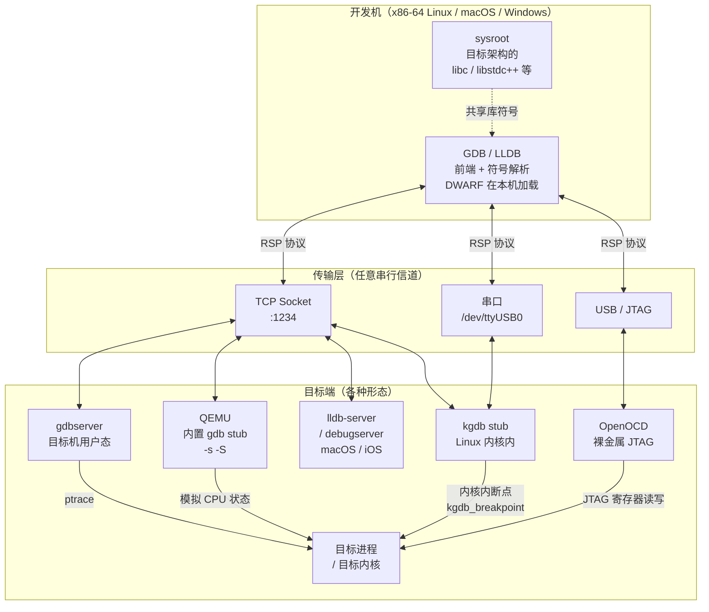
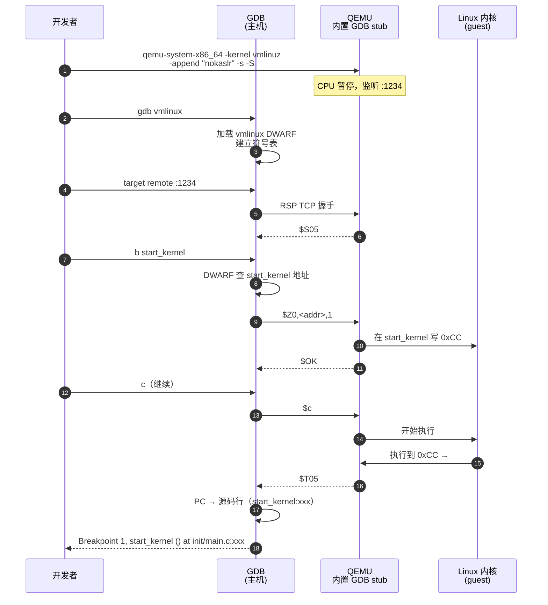
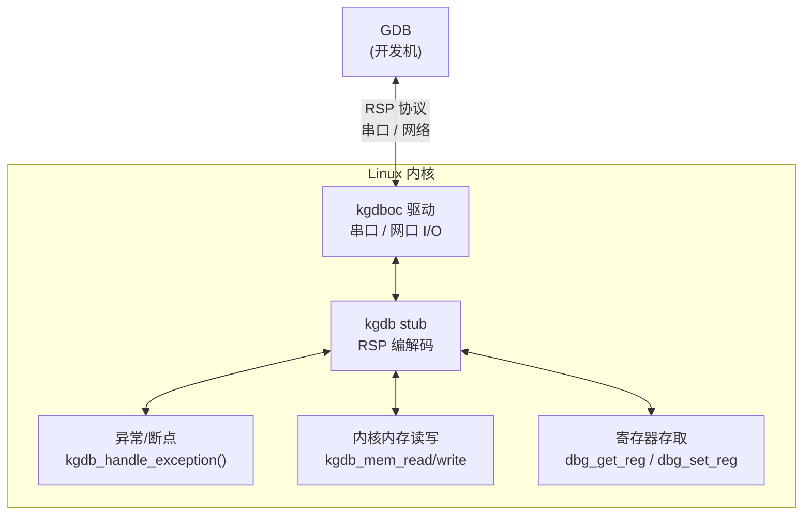
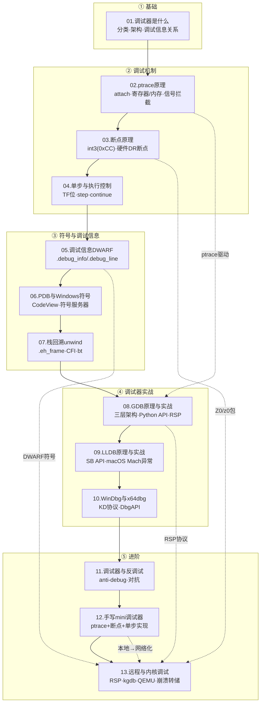

# 调试器原理与实战（13）· 远程与内核调试

> [!abstract] TL;DR
> - **远程调试**：GDB 通过 GDB Remote Serial Protocol（RSP）与 `gdbserver`/`lldb-server`/QEMU stub 通信，把"调试前端 + 符号解析"和"目标进程控制"彻底解耦，同一套命令能调试嵌入式板子、ARM 容器、跨架构目标。
> - **内核调试**：内核不能被自身 `ptrace`，需要另一套机制——Linux 的 `kgdb`/`kdb`（串口/网络透传 RSP 给 GDB）、QEMU `+gdb tcp::1234`（最普及的内核调试入口）、`/proc/kcore` 事后分析；Windows 用 WinDbg + KDNET/串口双机调试、Hyper-V 集成调试。
> - **崩溃转储**：Linux `vmcore + crash`（类 GDB 命令集分析内核崩溃）、Windows minidump/full dump + WinDbg、macOS panic log + `lldb`——崩溃时的"快照调试"是生产环境最后的情报来源。
> - **本篇是系列收官篇**：它串起了 [[02.ptrace原理]]、[[03.断点原理]]、[[08.GDB原理与实战]]、[[12.手写mini调试器]] 的每一个原理，让调试器的全景图最终闭合。

本篇是系列第 13 篇，也是**收官篇**。前 12 篇从 `ptrace`、断点、单步、DWARF，到 GDB/LLDB/WinDbg 工具链，再到反调试与手写 mini 调试器，已把用户态调试的机制讲透。本篇把视角拉到两个"极端场景"：**目标在远端**（嵌入式/容器/跨架构）与**目标是内核本身**（OS 调试），并在最后串起全系列，给出调试器的完整全景。

---

## 概述与定位

### 为何需要"远程"和"内核"这两个视角

标准 `ptrace` 调试有两个隐含前提：

1. 调试器与目标**在同一台机器**（可以 fork / attach）。
2. 目标是**用户态进程**（内核可以作仲裁者，让 `ptrace` 工作）。

一旦打破任一前提，`ptrace` 就不够用了：

| 场景 | 打破的前提 | 解法 |
|---|---|---|
| 调试 ARM 嵌入式板 | 开发机 ≠ 目标机 | `gdbserver` on 板 + GDB RSP |
| 调试 Docker 容器内程序 | 命名空间隔离（pid 视图不同） | 容器内 `gdbserver` 或 `--pid-mode=host` |
| 调试内核代码 | 目标是内核，没有"更高层"仲裁者 | `kgdb`、QEMU stub、WinDbg KD |
| 调试已崩溃的内核 | 进程不再运行 | `vmcore + crash`、minidump + WinDbg |

理解这些场景之前，先掌握它们共同的信道：GDB Remote Serial Protocol。

### 本篇在系列中的位置

| 前置篇章 | 本篇如何使用 |
|---|---|
| [[02.ptrace原理]] | 本地调试的底座；gdbserver 在目标机上仍用 ptrace 驱动目标 |
| [[03.断点原理]] | RSP 的 `Z0`/`z0` 包映射到 gdbserver 侧的 `int 3` 写入 |
| [[04.单步与执行控制]] | RSP 的 `s`/`c` 包映射到目标的 TF 位操作 |
| [[05.调试信息DWARF]] | 符号解析留在 GDB 前端，QEMU/gdbserver 端无需解析 DWARF |
| [[08.GDB原理与实战]] | RSP 协议在第 8 篇已有引入，本篇完整展开并扩展到内核侧 |
| [[12.手写mini调试器]] | mini 调试器实现了本地 ptrace 循环；本篇讲清"把它搬到网络上"需要什么 |

---

## 原理与机制

### GDB Remote Serial Protocol（RSP）深解

RSP 是一个**基于 ASCII 文本的请求-应答协议**，设计目标是轻量、可在任意串行信道（串口、TCP、UDP、USB）上运行。[[08.GDB原理与实战]] 第一次提到了它的格式，本篇完整展开。

#### 包格式

```
$<packet_data>#<checksum>
```

- `$`：包开始标记。
- `<packet_data>`：ASCII 文本命令或数据，特殊字节需转义：用 `}` (0x7D) 作转义前缀，后跟原字节 XOR 0x20（例如 `#` (0x23) → `} 0x03`，`$` (0x24) → `} 0x04`，`}` (0x7D) 自身 → `} 0x5D`）。
- `#`：包结束标记。
- `<checksum>`：`packet_data` 各字节模 256 求和，以两位十六进制表示（如 `a3`）。

接收方回复：
- `+`：确认收到且校验通过。
- `-`：请求重传。
- `$<reply>#<checksum>`：正常应答（与请求同格式）。

#### 核心包速查表

| 包 | 方向 | 含义 |
|---|---|---|
| `?` | GDB → stub | 查询目标当前停止原因（首连时先发这个） |
| `g` | GDB → stub | 读所有通用寄存器（返回十六进制寄存器块，顺序依 ABI） |
| `G<hex regs>` | GDB → stub | 写所有通用寄存器 |
| `p<n>` | GDB → stub | 读第 n 号寄存器（单寄存器读，效率高于 `g`） |
| `P<n>=<v>` | GDB → stub | 写第 n 号寄存器 |
| `m<addr>,<len>` | GDB → stub | 读内存（返回十六进制字节序列） |
| `M<addr>,<len>:<data>` | GDB → stub | 写内存 |
| `X<addr>,<len>:<binary>` | GDB → stub | 写内存（二进制，效率高于 `M`） |
| `c[<addr>]` | GDB → stub | 继续执行（可选起始地址） |
| `s[<addr>]` | GDB → stub | 单步执行一条指令 |
| `C<sig>[;<addr>]` | GDB → stub | 带信号继续（signal delivery） |
| `Z0,<addr>,<kind>` | GDB → stub | 插入软件断点（kind=字节宽度，x86=1） |
| `z0,<addr>,<kind>` | GDB → stub | 移除软件断点 |
| `Z1,<addr>,<kind>` | GDB → stub | 插入硬件执行断点 |
| `Z2`/`Z3`/`Z4` | GDB → stub | 插入写/读/访问观察点 |
| `T<thread-id>` | GDB → stub | 检查线程是否存活 |
| `H<op><thread-id>` | GDB → stub | 选择操作线程（`Hg` 用于读写，`Hc` 用于执行控制） |
| `qXfer:...` | GDB → stub | 扩展查询（读远端文件、内存映射、线程列表等） |
| `vCont;c:<tid>` | GDB → stub | 多线程精细控制（不同线程不同动作） |
| `S<sig>` | stub → GDB | 停止通知（收到信号 `sig`，旧格式） |
| `T<sig>thread:<n>;...` | stub → GDB | 停止通知（新格式，携带更多上下文） |
| `OK` | stub → GDB | 通用成功应答 |
| `E<errno>` | stub → GDB | 错误应答 |

#### RSP 连接协商（Feature Negotiation）

GDB 和 stub 在连接时会互发 `qSupported` 包协商能力，例如：

```
GDB → stub: $qSupported:multiprocess+;swbreak+;hwbreak+;qRelocInsn+#xx
stub → GDB: $PacketSize=4000;multiprocess+;swbreak+#xx
```

通过协商，GDB 知道 stub 支持软件断点停止通知（`swbreak+`），因此断点命中时 PC 已被 stub 回退一字节（`int 3` 后的 PC 减去 1），双方不会重复调整。

### 远程调试架构



> [!warning] 示例输出为示意
> 上图为逻辑架构，实际网络拓扑可更复杂（如通过 SSH 隧道转发端口）。

### gdbserver 工作原理

`gdbserver` 是 GDB 工具链自带的独立进程，在目标机上运行，作为 RSP 服务端。它本质上是一个"把 `ptrace` 操作翻译成 RSP 消息"的桥接层。

```
GDB 前端       RSP over TCP/串口      gdbserver           Linux 内核
─────────                              ─────────────
命令解析   ←── $g#67（读寄存器）──→   PTRACE_GETREGS    →  ptrace(2)
DWARF符号  ←── $m addr,len#xx ──→    /proc/pid/mem     →  内核内存
断点管理   ←── $Z0,addr,1#xx ──→    PTRACE_POKEDATA 0xCC
执行控制   ←── $c#63 ──────────→    PTRACE_CONT
          ←── $T05thread:1;#xx ←── waitpid SIGTRAP   ←  内核通知
```

gdbserver 典型用法：

```bash
# 目标机（ARM / RISC-V / x86 等）：启动并监听 TCP 1234
gdbserver :1234 /usr/bin/my_app --arg1

# 目标机：附加到已运行进程
gdbserver :1234 --attach 2345

# 目标机：多进程模式（每个新进程独立通道）
gdbserver --multi :1234
```

```bash
# 开发机：交叉调试 AArch64 目标
aarch64-linux-gnu-gdb ./my_app
(gdb) set sysroot /opt/sysroots/aarch64-linux
(gdb) set solib-search-path /opt/sysroots/aarch64-linux/usr/lib
(gdb) target remote 192.168.1.100:1234
(gdb) b main
(gdb) c
```

> [!warning] 示例输出为示意
> 连接成功后 GDB 输出：
> ```
> Remote debugging using 192.168.1.100:1234
> Reading /lib/ld-linux-aarch64.so.1 from remote target...
> 0x0000ffff9a000000 in ?? ()
> (gdb) b main
> Breakpoint 1 at 0x4008b4: file main.c, line 12.
> ```
> 实际地址随目标环境变化。`set sysroot` 告诉 GDB 去本机哪里找目标架构的共享库，用于符号解析（参见 [[14.动态链接与加载器详解/02.程序加载全景.md]] 的 PT_INTERP 与 .so 加载流程）。

### lldb-server 与 debugserver

macOS/iOS 生态对应的远程调试服务端是 `lldb-server`（通用）和 `debugserver`（iOS 专用，Xcode 工具链附带）。

```bash
# macOS / Linux（LLDB 工具链）：目标机
lldb-server gdbserver :1234 -- /usr/bin/my_app

# 开发机
lldb
(lldb) gdb-remote 192.168.1.200:1234
```

`debugserver` 在 iOS 设备上由 Xcode 通过 `iProxy` 隧道部署，LLDB 通过 USB over TCP 透传连接；其协议底层仍是 RSP（LLDB 与 GDB 的 RSP 扩展有差异，但核心包兼容）。

> [!warning] 示例输出为示意
> `debugserver` 是苹果私有签名二进制，只在 Xcode 安装目录及 DeveloperDiskImage 中存在，不能直接复制到设备。

### target extended-remote vs target remote

| 特性 | `target remote` | `target extended-remote` |
|---|---|---|
| 目标退出后 | 连接断开 | 连接保持 |
| 可重新 `run` | 否 | 是（gdbserver 在 --multi 模式下启动新进程） |
| 可 `attach` 新进程 | 否 | 是 |
| 适用场景 | 一次性调试单个程序 | 反复启动同一目标、调试器循环测试 |

### JTAG/OpenOCD 硬件调试

当目标是**裸金属嵌入式 MCU/SoC**（无操作系统，或操作系统尚未启动），`gdbserver` 无处运行，需要通过 JTAG/SWD 硬件探针直接操作 CPU 的调试接口。**OpenOCD**（Open On-Chip Debugger）是这条链路的核心中间件。

#### 链路拓扑

```
开发机
 └── GDB（arm-none-eabi-gdb）
       │  RSP over TCP :3333
 OpenOCD（开发机或独立硬件上运行）
       │  USB（libusb）
 JTAG/SWD 探针（ST-Link / J-Link / CMSIS-DAP / FT2232H 等）
       │  JTAG（4 线：TCK/TMS/TDI/TDO）
       │  或 SWD（2 线：SWDIO/SWDCLK，ARM Cortex-M 专属）
 目标 MCU/SoC（ARM Cortex-M/A/R、RISC-V 等）
```

**SWD vs JTAG**：SWD（Serial Wire Debug）是 ARM 对 JTAG 的 2 线简化，Cortex-M 系列几乎全部支持 SWD；JTAG 兼容性更广，支持多设备菊花链（daisy chain）扫描。OpenOCD 两者均支持，由探针和目标配置决定使用哪种。

#### OpenOCD 配置与 GDB 连接

```bash
# 启动 OpenOCD（以 STM32F4 + ST-Link 为例）
openocd \
  -f interface/stlink.cfg \          # 探针类型
  -f target/stm32f4x.cfg             # 目标芯片

# OpenOCD 启动后输出（示意）：
# Info : STLINK V2J37S7 (API v2) VID:PID 0483:374B
# Info : stm32f4x.cpu: hardware has 6 breakpoints, 4 watchpoints
# Info : Listening on port 3333 for gdb connections
# Info : Listening on port 4444 for telnet connections
```

```bash
# GDB 侧（交叉编译器工具链）
arm-none-eabi-gdb build/firmware.elf
(gdb) target remote :3333       # 连接 OpenOCD 的 GDB RSP 端口
(gdb) monitor reset halt        # 通过 OpenOCD 发送复位并停住
(gdb) load                      # 下载 ELF 到目标 Flash/RAM
(gdb) b main
(gdb) c
```

OpenOCD 同时暴露 **Telnet 端口（4444）**，可直接发送 OpenOCD 原生命令（`flash write_image`、`reset`、`mww` 写内存字等），不经过 GDB。

#### 硬件断点与观察点

嵌入式 CPU 的**硬件断点**数量有限（Cortex-M 通常 4–8 个执行断点 + 4 个数据观察点），但可设在 **Flash 中的只读代码**——软件断点写 `0xCC` 需要代码可写，而 Flash 不可直接写入（需 Flash 擦写序列）。GDB 通过 RSP `Z1` 包（硬件执行断点）和 `Z2`/`Z3`/`Z4`（写/读/访问观察点）使用这些资源；OpenOCD 负责映射到目标的调试寄存器（ARM 的 FP/WP 单元）。

> [!tip] 深入阅读
> 完整的 JTAG/OpenOCD 嵌入式调试链路、Flash 编程、多核 SMP 调试等内容详见 [[17.JTAG与OpenOCD硬件调试]]。

---

## 三平台对照

### 远程调试

| 维度 | Linux | macOS | Windows |
|---|---|---|---|
| 服务端 | `gdbserver`（GDB 工具链）| `lldb-server` / `debugserver`（Xcode）| Visual Studio 远程调试器（`msvsmon.exe`）；也可 MinGW `gdbserver` |
| 协议 | RSP（GDB 标准）| RSP（LLDB 扩展超集）| DCOM + DebugDiag 协议；MinGW 路径用 RSP |
| 跨架构 | `aarch64-linux-gnu-gdb` + sysroot | `lldb` 天然多架构 | VS 跨架构支持有限；推荐 QEMU + GDB RSP |
| 容器场景 | `--cap-add=SYS_PTRACE` 后在容器内跑 `gdbserver` | Orbstack/Docker Desktop 透传 | WSL2 内 gdbserver + Windows 侧 GDB |
| 嵌入式 | OpenOCD + GDB RSP（STM32/RISC-V 等）| OpenOCD（USB JTAG）| J-Link GDB Server + GDB/IAR/Keil |

### 内核调试

| 维度 | Linux | macOS | Windows |
|---|---|---|---|
| 主要机制 | `kgdb`（内核内 RSP stub）+ GDB；QEMU `-s -S` + GDB | `lldb` + VMware/QEMU 内核调试（有限官方支持）| WinDbg + KDNET / 串口 KD 协议；Hyper-V 集成 |
| 实时内核检查 | `/proc/kcore`（ELF core 格式，类 `crash`）| `dtrace`/`lldb`（受 SIP 限制）| WinDbg Live Kernel（`!process`/`!vm` 等内核命令） |
| 崩溃分析 | `kdump`（`vmcore`）+ `crash` 工具 | panic log + `lldb` + kernel dSYM | 完整内存转储/内核转储 + WinDbg `.dump` / `!analyze` |
| 符号 | `vmlinux`（带 DWARF）+ `linux/scripts/gdb/` Python 辅助脚本 | `kernel.dSYM`（苹果私有）| `ntoskrnl.pdb`（微软符号服务器） |
| 安全限制 | KASLR（`nokaslr` 关闭后调试更容易）；内核 lockdown 模式会禁 kgdb | SIP 默认禁内核调试，需关 SIP | Secure Boot + Credential Guard 需配置；SecureBoot 关闭或 test signing |

### macOS 内核调试（lldb + KDK）

macOS 内核调试比 Linux 受更多限制：**SIP（System Integrity Protection）**默认阻止任何内核调试操作；苹果官方的调试路径需要关闭 SIP 并使用 **KDK（Kernel Debug Kit）**，这是专门为内核调试分发的包，包含带调试符号的 `kernel.development` 二进制和配套 LLDB 脚本。

#### 双机调试原理：kdp-remote

macOS 内核调试使用 **KDP（Kernel Debugging Protocol）**，基于 UDP，不同于 Linux 的 RSP over TCP/串口。调试链路：

```
开发机（Mac，运行 LLDB）
  │  KDP over UDP（端口 41139 默认）
目标机（Mac，运行被调试内核）
```

目标内核在触发 NMI（Non-Maskable Interrupt，可通过双击电源键或调试断点触发）或发生 kernel panic 后进入 KDP 服务端，等待开发机 LLDB 的 `kdp-remote` 连接。

```bash
# 目标机：配置 nvram 启动参数（关 SIP 后）
sudo nvram boot-args="debug=0x144 kext-dev-mode=1 kdp_match_name=en0"
# debug=0x144：DB_HALT(0x04)+DB_NMI(0x40)+DB_SINGLESTEP(0x100) — 等待调试器连接

# 开发机：安装 KDK，加载 lldbmacros
# KDK 安装后路径：/Library/Developer/KDKs/KDK_<ver>.kdk/
lldb /Library/Developer/KDKs/KDK_<ver>.kdk/System/Library/Kernels/kernel.development
(lldb) command script import /Library/Developer/KDKs/KDK_<ver>.kdk/System/Library/Kernels/kernel.development.dSYM/Contents/Resources/Python/lldbmacros/core/xnu.py
(lldb) kdp-remote <目标机 IP>
# 连接成功后内核停止，LLDB 获得控制
(lldb) showallprocs          # lldbmacros 宏：列出所有进程
(lldb) showallstacks         # 列出所有线程调用栈
(lldb) showvmtaskpagebits <task_ptr>  # 查看虚拟内存信息
```

#### QEMU 替代方案

对于无第二台 Mac 的场景，可在 QEMU `qemu-system-aarch64`（Apple Silicon）或 `qemu-system-x86_64` 中运行 macOS 内核，通过 QEMU 的 `-gdb` 选项用标准 GDB/LLDB RSP 调试，但缺少完整的 KDK 辅助宏。

> [!tip] 深入阅读
> macOS 内核调试的完整流程（KDK 安装、SIP 关闭、内核 panic 分析、lldbmacros 宏使用）详见 [[19.macOS内核调试]]。

---

## 数据结构 / 流程详解

### QEMU + GDB 内核调试流程

QEMU 内置了完整的 GDB stub，`-s -S` 两个参数：

- `-s`：等价于 `-gdb tcp::1234`，监听 localhost:1234。
- `-S`：CPU 启动后立即暂停，等待 GDB 的 `c` 命令。



> [!warning] 示例输出为示意
> `nokaslr` 内核参数关闭 KASLR（内核地址空间随机化），使 `vmlinux` 符号地址与运行时地址一致。生产内核开启 KASLR 时需额外步骤（读 `/proc/kallsyms` 得到加载基址，用 `add-symbol-file` 告知 GDB）。

### kgdb / kdb：在真实机器上调试内核

`kgdb` 是 Linux 内核内置的 GDB stub（`CONFIG_KGDB=y`），`kdb` 是配套的独立内核调试 shell（不需要外部 GDB）。

```bash
# 内核命令行参数（串口方式）
kgdboc=ttyS0,115200 kgdbwait

# 内核命令行参数（网络 kgdb，需 CONFIG_KGDB_KDB + eth0 KGDB over ethernet 驱动）
kgdboc=eth0 kgdbwait
```

```bash
# 开发机：通过串口连接
gdb vmlinux
(gdb) set remotebaud 115200
(gdb) target remote /dev/ttyUSB0
(gdb) b panic
(gdb) c
```

`kgdb` 的工作原理：内核注册一个 kgdb 断点（`kgdb_breakpoint()`），当命中时进入 `kgdb_handle_exception()`，该函数把 CPU 寄存器打包成 RSP 回应给 GDB，接受 GDB 的内存读写和继续/单步命令，形成与 `gdbserver` 等价的 in-kernel stub。



> [!warning] 示例输出为示意
> `kgdb` 调试时另一个 CPU 核继续运行调度器，因此多核竞态问题复现难度高；通常加 `nr_cpus=1` 单核运行以简化。

### /proc/kcore：活跃内核的事后检查

`/proc/kcore` 以 ELF core 格式暴露当前内核的物理内存（需 root）：

```bash
# 需先加载符号
gdb /usr/lib/debug/boot/vmlinux-$(uname -r) /proc/kcore
(gdb) info proc mappings     # 查内核地址范围
(gdb) p init_task            # 打印 0 号进程 task_struct
(gdb) p init_task.comm       # 进程名
```

这是**非中断式**内核状态检查——内核继续运行，GDB 只是读快照，不能设断点。适合分析运行中的内核数据结构，如 `task_struct` 链表、`kmem_cache` 状态等。

### 崩溃转储分析

崩溃（panic/BugCheck）发生时内核已无法运行，调试依赖事先采集的内存转储。

#### Linux：kdump + crash

```bash
# 配置 kdump（需 kexec-tools + kdump 内核）
# /etc/kdump.conf 指定转储路径
# 重启后 kdump 内核在主内核崩溃时被 kexec 加载，写出 vmcore

# 分析
crash /usr/lib/debug/boot/vmlinux-5.15.0 /var/crash/vmcore

# crash 提供类 GDB 命令集
crash> bt                # 崩溃时的内核调用栈
crash> log               # 内核消息缓冲（dmesg 等价）
crash> ps                # 内核进程列表
crash> vm <pid>          # 进程虚拟内存映射
crash> rd -x <addr> 16  # 读内存（十六进制，16 个字）
crash> files <pid>       # 打开文件列表
crash> struct task_struct <addr>  # 格式化输出结构体
```

> [!warning] 示例输出为示意
> `crash` 工具需要与内核版本完全匹配的 `vmlinux`（带 DWARF）；发行版通常以 `linux-image-<ver>-dbg` 包提供。

#### Windows：minidump / kernel dump + WinDbg

Windows 的崩溃产出三种转储（通过 `控制面板 → 系统 → 高级系统设置 → 启动和故障恢复` 配置）：

| 类型 | 大小 | 内容 | 适用 |
|---|---|---|---|
| 小内存转储（minidump） | ≤ 512 KB | 崩溃线程栈 + 少量上下文 | 快速初步定位 |
| 内核内存转储 | 几百 MB | 内核内存（不含用户态） | 大多数内核 bug 分析 |
| 完整内存转储 | ≈ RAM 大小 | 全部物理内存 | 用户态 + 内核联合分析 |

```
# WinDbg 分析 minidump
windbg -z C:\Windows\Minidump\123456-01.dmp

# 加载符号服务器（微软公共符号）
.symfix
.reload

# 自动分析崩溃原因
!analyze -v

# 查看崩溃时的调用栈
kb
# 查看所有线程栈
~* kb
```

> [!warning] 示例输出为示意
> `!analyze -v` 是 WinDbg 最重要的第一命令，它自动识别 Bug Check 代码（如 `0x000000D1 DRIVER_IRQL_NOT_LESS_OR_EQUAL`）、定位故障模块和地址、给出初步建议，大幅缩短定位时间。

#### macOS：panic log 分析

macOS 内核崩溃（kernel panic）的现场信息写入 **panic log**：

```bash
# panic log 位置（macOS 13+）
ls /Library/Logs/DiagnosticReports/Kernel-*.panic

# panic log 包含：
# - 内核版本、UUID（用于匹配 dSYM）
# - 崩溃原因（如 "Unexpected SError Interrupt" / "EXC_BAD_ACCESS"）
# - 崩溃线程的调用栈（带或不带符号，取决于是否安装 KDK）
# - 所有线程状态快照
# - 系统内存状态

# 用 LLDB + KDK 分析 panic log（离线符号化）
lldb /Library/Developer/KDKs/KDK_<ver>.kdk/System/Library/Kernels/kernel.development
(lldb) command script import .../lldbmacros/core/xnu.py
(lldb) showpaniclog /Library/Logs/DiagnosticReports/Kernel-xxx.panic
```

**三平台崩溃转储对照**：

| 维度 | Linux | Windows | macOS |
|---|---|---|---|
| 转储触发 | `kdump`（`kexec` 加载 crash kernel）| BSOD 后自动写转储 | 内核 panic 后写 panic log |
| 转储格式 | `vmcore`（ELF core）| MiniDump / KernelDump（微软私有）| Panic log（文本 + 二进制 appendix）|
| 分析工具 | `crash`（开源）| WinDbg（`!analyze`）| LLDB + KDK lldbmacros |
| 符号需求 | `vmlinux` 带 DWARF（`-dbg` 包）| `ntoskrnl.pdb`（微软符号服务器）| `kernel.development.dSYM`（KDK）|
| 关键命令 | `bt`（崩溃栈）、`log`（dmesg）| `!analyze -v`、`kb` | `showpaniclog`、`showallstacks` |

> [!tip] 深入阅读
> Linux coredump（用户态 `core` 文件）、Windows minidump、macOS panic log 的完整分析流程与工具链配置详见 [[18.崩溃转储分析]]。

### Windows 内核双机调试

Windows 内核调试需要两台机器（或 VM + 主机）：**目标机**跑被调试的 Windows，**调试机**跑 WinDbg。通信方式：

| 方式 | 配置命令（目标机） | 速度 | 适用 |
|---|---|---|---|
| 串口 | `bcdedit /dbgsettings serial debugport:1 baudrate:115200` | 慢 | 传统 VM / 物理机 |
| 网络（KDNET） | `bcdedit /dbgsettings net hostip:<ip> port:<port>` | 快（万兆以太网）| VM / 物理机 |
| USB 2.0 EEM | `bcdedit /dbgsettings usb targetname:debug` | 中 | 笔记本 |
| Hyper-V | `bcdedit /dbgsettings hyperv` | 最快（共享内存）| Hyper-V VM |
| 管道（VM 内部） | `bcdedit /dbgsettings local`（VM 的串口设为命名管道）| 中 | VMware / VirtualBox |

```bat
:: 目标机：开启内核调试（KDNET 方式）
bcdedit /debug on
bcdedit /dbgsettings net hostip:192.168.1.50 port:50000 key:1.2.3.4
:: 重启目标机后等待 WinDbg 连接

:: 调试机：WinDbg
windbg -k net:port=50000,key=1.2.3.4
```

> [!warning] 示例输出为示意
> Secure Boot 开启时内核调试需要测试签名模式或关闭 Secure Boot：`bcdedit /set testsigning on`。生产机通常不能关 Secure Boot，内核调试只在专用调试机或 VM 上进行。

---

## 用户态 vs 内核态调试差异

理解这两种调试模式的本质区别，是本篇的核心洞察：

| 维度 | 用户态调试 | 内核态调试 |
|---|---|---|
| 仲裁者 | 内核（`ptrace`/DebugAPI）是调试器的后盾 | **没有更高层的仲裁者**，调试器本身必须嵌入或并行于内核 |
| 断点实现 | `ptrace(PTRACE_POKEDATA)` 写 `0xCC`，触发 SIGTRAP → 内核暂停 tracee | 直接向内核代码写 `0xCC`（kgdb）或由 hypervisor 注入（QEMU/WinDbg KD）；陷阱处理器在内核内部 |
| 内存访问 | `/proc/<pid>/mem` 或 `PTRACE_PEEKDATA`，安全隔离 | 直接访问物理地址映射（/proc/kcore、kgdb `m` 包）；一个错误写入可导致立即 panic |
| 单步 | 设 TF 位 → 每条指令 SIGTRAP → 内核通知调试器 | 设 TF 位 → 内核异常处理器捕获 → kgdb/QEMU stub 通知 GDB |
| 符号解析 | DWARF（ELF `.debug_*`）；可参见 [[11.ELF文件详解/24.debug节.md]] | `vmlinux`（带 `-g` 编译的内核 ELF）+ 模块符号；KASLR 下需额外偏移计算 |
| 多核问题 | 用户态线程被 `waitpid` 序列化，其他核不影响 tracee | 暂停一个 CPU 时其他 CPU 可能仍在运行内核代码，引发状态竞争 |
| 调试中断 | 目标进程停止期间系统正常运行 | 目标内核停止时整个系统（包括网络、磁盘I/O）停滞 |
| 安全要求 | `ptrace_scope=0` 或 root / 父进程关系即可 | root + 特殊启动参数（`kgdbwait`）；或 hypervisor 层权限（QEMU） |

---

## 代码与示例

### 最小 RSP 服务端骨架（C，教学向）

理解 RSP 最好的方式是看一个最小实现骨架——这正是 [[12.手写mini调试器]] 中 mini 调试器的"网络化"版本：

```c
#include <stdio.h>
#include <string.h>
#include <stdint.h>
#include <sys/ptrace.h>
#include <sys/wait.h>
#include <sys/user.h>
#include <netinet/in.h>
#include <unistd.h>

/* 计算 RSP 校验和 */
static uint8_t rsp_checksum(const char *data, size_t len) {
    uint8_t sum = 0;
    for (size_t i = 0; i < len; i++) sum += (uint8_t)data[i];
    return sum;
}

/* 发送 RSP 包：$<data>#<cksum> */
static void rsp_send(int fd, const char *data) {
    char buf[4096];
    uint8_t ck = rsp_checksum(data, strlen(data));
    int n = snprintf(buf, sizeof(buf), "$%s#%02x", data, ck);
    write(fd, buf, n);
    /* 等待 '+' 确认（简化：忽略错误和重传） */
    char ack[2];
    read(fd, ack, 1);
}

/* 接收 RSP 包，返回 packet_data 部分 */
static int rsp_recv(int fd, char *out, size_t max) {
    char c;
    /* 等待 '$' */
    while (read(fd, &c, 1) == 1 && c != '$') {}
    size_t i = 0;
    while (read(fd, &c, 1) == 1 && c != '#' && i < max - 1)
        out[i++] = c;
    out[i] = '\0';
    char ck_str[3];
    read(fd, ck_str, 2); ck_str[2] = '\0';
    write(fd, "+", 1);  /* 发送确认 */
    return (int)i;
}

/* 处理 RSP 包的核心分发（教学骨架，仅实现 ?/g/c） */
static void handle_packet(int fd, pid_t tracee, const char *pkt) {
    if (pkt[0] == '?') {
        /* 目标当前状态：暂停，信号 5 = SIGTRAP */
        rsp_send(fd, "S05");
    } else if (pkt[0] == 'g') {
        /* 读所有寄存器 */
        struct user_regs_struct regs;
        ptrace(PTRACE_GETREGS, tracee, NULL, &regs);
        char buf[512];
        /* x86-64: 先发 rax..r15..rip 等，按 GDB 寄存器顺序排列 */
        snprintf(buf, sizeof(buf),
            "%016llx%016llx" /* rax rbx ... 简化仅示意 */,
            (unsigned long long)regs.rax,
            (unsigned long long)regs.rbx);
        rsp_send(fd, buf);
    } else if (pkt[0] == 'c') {
        /* 继续执行 */
        ptrace(PTRACE_CONT, tracee, NULL, NULL);
        int status;
        waitpid(tracee, &status, 0);
        /* 通知 GDB 已停止 */
        rsp_send(fd, "S05");
    } else {
        /* 不支持的包：回空 */
        rsp_send(fd, "");
    }
}
```

> [!warning] 示例输出为示意
> 上述骨架省略了完整的 x86-64 寄存器顺序（GDB 要求特定的 XML 描述或固定偏移）、内存读写包（`m`/`M`）、断点包（`Z0`/`z0`）、线程支持、能力协商（`qSupported`）等。完整的 `gdbserver` 实现数万行，但协议骨架就是这个循环：`recv → dispatch → send`。与 [[12.手写mini调试器]] 的本地 `ptrace` 循环相比，唯一的区别是把"读用户输入"换成了"从 socket 收 RSP 包"。

### QEMU 内核调试实战片段

```bash
# 编译内核（带调试符号）
make -j$(nproc) ARCH=x86_64 \
    CONFIG_KGDB=y CONFIG_KGDB_KDB=y \
    CONFIG_DEBUG_INFO=y CONFIG_DEBUG_INFO_DWARF5=y \
    CONFIG_RANDOMIZE_BASE=n    # 关 KASLR，简化调试

# 启动 QEMU（-s 监听 :1234，-S 启动后暂停）
qemu-system-x86_64 \
    -kernel arch/x86/boot/bzImage \
    -initrd /tmp/initrd.img \
    -append "root=/dev/sda console=ttyS0 nokaslr" \
    -nographic -s -S &

# GDB 侧
gdb vmlinux
(gdb) target remote :1234
(gdb) hbreak start_kernel      # 硬件断点（内核代码在 ROM 映射时无法写 int3）
(gdb) c
# 内核启动到 start_kernel 后停下

(gdb) b panic                  # 在 panic 处设断点，捕获内核崩溃
(gdb) add-symbol-file drivers/net/e1000/e1000.ko \
        0xffffffffc0001000     # 加载动态加载的内核模块符号
```

> [!warning] 示例输出为示意
> `hbreak`（硬件断点）在内核调试早期阶段（页表尚未建立或代码段只读）更安全，避免写 `0xCC` 触发额外异常。`add-symbol-file` 所需的模块加载地址可从 `/sys/module/<name>/sections/.text` 读取。

---

## 实操：容器调试与跨架构场景

### 容器内调试

Docker 默认禁用 `ptrace`（seccomp 和 capability 限制），`gdbserver` 无法工作：

```bash
# 方式一：运行时开放 ptrace 能力
docker run --cap-add=SYS_PTRACE --security-opt seccomp=unconfined \
    my_image /bin/sh

# 方式二：privileged 模式（生产不推荐）
docker run --privileged my_image /bin/sh

# 方式三：从外部 attach（主机 GDB attach 容器内进程）
# 先找到容器内进程的主机 PID
docker inspect <container_id> | grep Pid
# 然后主机侧直接 gdb attach <host_pid>
# 但符号/sysroot 需要指向容器内的文件系统
gdb -p <host_pid>
(gdb) set sysroot /proc/<host_pid>/root
```

> [!warning] 示例输出为示意
> `set sysroot /proc/<pid>/root` 利用了 `/proc/<pid>/root` 指向进程的根文件系统（通过 namespace / chroot 隔离）这一 Linux 特性，让 GDB 能在主机侧找到容器内的共享库。

### 跨架构调试（x86 宿主，AArch64 目标）

```bash
# 安装交叉工具链
apt install gcc-aarch64-linux-gnu gdb-multiarch

# 或使用 GDB 多架构版本（一个二进制支持所有目标）
gdb-multiarch ./aarch64_binary

(gdb) set architecture aarch64
(gdb) set sysroot /opt/aarch64-sysroot
(gdb) target remote 192.168.1.100:1234

# 此时断点、单步、寄存器读写全部通过 RSP 远端执行
# GDB 本身只做符号解析和命令翻译
```

---

## 陷阱与常见问题

### 1. KASLR 导致符号地址不匹配

内核开启 KASLR 后，`vmlinux` 中的地址与运行时不同，`bt` 显示乱码或无法解析：

```bash
# 从目标读取实际加载基址
(gdb) monitor kallsyms     # kgdb 扩展命令（如支持）

# 或从 /proc/kallsyms 读 _text 符号
# _text 是内核代码段起始，vmlinux 中也有 _text 符号
# 偏移 = 运行时 _text - vmlinux 中 _text
(gdb) add-symbol-file vmlinux <offset>

# 更简便：关 KASLR 调试（CONFIG_RANDOMIZE_BASE=n 或 nokaslr 启动参数）
```

### 2. gdbserver 版本与 GDB 不匹配

RSP 有版本化的能力协商（`qSupported`），但某些旧版 `gdbserver` 与新 GDB 能力不兼容：

```
Remote 'g' packet reply is too long (expected 336 bytes, got 816 bytes)
```

原因：目标架构有扩展寄存器（如 AVX-512），新 `gdbserver` 发完整寄存器块，旧 GDB 不理解。解决：升级 GDB，或在 `.gdbinit` 加 `set tdesc filename /path/to/target.xml` 指定目标寄存器描述文件。

### 3. kgdb 死锁：调试中断本身用到的锁

内核内的断点陷阱处理必须持有某些自旋锁（如串口锁）时，kgdb 也试图使用同一锁发送 RSP 响应，形成死锁。症状：GDB 连接后内核完全无响应。

解法：改用 `kgdb_panic_notifier` 路径（崩溃后进入 kgdb）而非运行时断点；或在 `kgdb_io_ops` 使用不竞争锁的传输（如轮询串口寄存器）。

### 4. Windows 双机调试：目标机长时间停滞

WinDbg 在内核断点命中时**整个目标机停止响应**（包括鼠标键盘），容易误以为挂死。这是正常现象——内核调试的代价。VMware 的 named pipe 串口调试可缓解（暂停状态下 VM 窗口仍可交互，只是 Guest 内核停止）。

---

## 串起全系列：调试器全景

本篇是系列收官。回顾 13 篇走过的路：



**三大支柱的最终形态**：

| 支柱 | 用户态形态 | 远程/内核形态 |
|---|---|---|
| **执行控制** | `ptrace(PTRACE_CONT/SINGLESTEP)` 在本机 | RSP `c`/`s` → gdbserver/kgdb → ptrace 或 hypervisor 注入 |
| **内存/寄存器** | `ptrace(PEEK/POKE)` / `/proc/pid/mem` | RSP `g`/`m`/`M` → 目标侧读写 |
| **符号解析** | GDB 本地 DWARF 读取（`vmlinux` 或应用 ELF） | 始终在 GDB 前端完成；目标端无需知道符号 |

远程调试和内核调试的本质，是把**执行控制**和**内存/寄存器访问**通过 RSP 这条协议信道"搬运"到任意目标，而**符号解析**留在开发机侧不动。这一解耦思想是 GDB 架构（[[08.GDB原理与实战]] 三层架构）最优雅的工程决策。

---

## 小结

1. **RSP 是远程调试的通用语**：基于 ASCII 的轻量协议，`$<data>#<cksum>` 格式，承载寄存器、内存、断点、执行控制等全部原语。只要目标端有 stub（`gdbserver`/`kgdb`/QEMU/OpenOCD），GDB 就能调试任何目标，架构和距离无关。

2. **gdbserver 是 ptrace 的 RSP 桥接**：它在目标机上用 `ptrace` 控制进程，把 ptrace 操作翻译成 RSP 应答，让开发机 GDB 透明调试远端进程。跨架构调试时 GDB 用 `sysroot` 在本机找共享库符号，参见 [[14.动态链接与加载器详解/02.程序加载全景.md]] 中 `.so` 加载流程。

3. **QEMU `+gdb` 是内核调试最低门槛入口**：`-s -S` 两个参数把整个虚拟机变成 GDB stub，无需特殊内核编译选项，`target remote :1234` 即可调试任意操作系统内核（Linux/UEFI/自研 OS）。`nokaslr` + 带 DWARF 的 `vmlinux` 是标配组合。

4. **kgdb 是真实机器上的 in-kernel stub**：`CONFIG_KGDB=y` 后内核自带 RSP 服务端，通过串口/网络与外部 GDB 通信，实现对运行中内核的实时断点调试。多核和锁竞争是核心陷阱。

5. **崩溃转储是生产环境最后的情报**：Linux `vmcore + crash`、Windows minidump/kernel dump + WinDbg 是各自平台的标准事后分析工具链，提供 `bt`/`!analyze` 等命令集在内核已崩溃后重建事故现场。

6. **调试器全景已闭合**：执行控制（ptrace/RSP/kgdb）+ 符号解析（DWARF/PDB/vmlinux）+ 友好前端（GDB/LLDB/WinDbg）——本系列 13 篇在此交汇。

---

## 相关阅读

- **ptrace 机制** → [[02.ptrace原理]]
- **断点实现** → [[03.断点原理]]（软件 `int3` 与硬件 DR 断点；gdbserver 的 `Z0` 包映射到这里）
- **GDB 架构与 RSP 引入** → [[08.GDB原理与实战]]（三层架构、RSP 基础时序）
- **手写 mini 调试器** → [[12.手写mini调试器]]（本地 ptrace 循环，是 gdbserver 的简化版）
- **DWARF 调试信息** → [[05.调试信息DWARF]]、[[11.ELF文件详解/24.debug节.md]]、[[11.ELF文件详解/26.debug_info节.md]]、[[11.ELF文件详解/27.debug_line节.md]]
- **栈展开** → [[07.栈回溯unwind]]、[[11.ELF文件详解/46.eh_frame节.md]]、[[11.ELF文件详解/32.debug_frame节.md]]
- **程序加载与 .so 定位** → [[14.动态链接与加载器详解/02.程序加载全景.md]]（sysroot 与 gdbserver 远端 .so 加载的底层基础）
- **WinDbg 内核命令** → [[10.WinDbg与x64dbg]]
- **反调试对抗** → [[11.调试器与反调试]]
- **延迟绑定（调试共享库函数断点）** → [[14.动态链接与加载器详解/08.PLT与GOT与延迟绑定.md]]
- **外部工具**：[GDB Remote Protocol](https://sourceware.org/gdb/current/onlinedocs/gdb.html/Remote-Protocol.html)、[Linux kgdb 文档](https://www.kernel.org/doc/html/latest/dev-tools/kgdb.html)、[crash 工具](https://github.com/crash-utility/crash)

---

⬅️ 上一篇 [[12.手写mini调试器]] ｜ 🏠 [[00.调试器原理与实战总览]] ｜ 下一篇 [[00.调试器原理与实战总览]] ➡️
