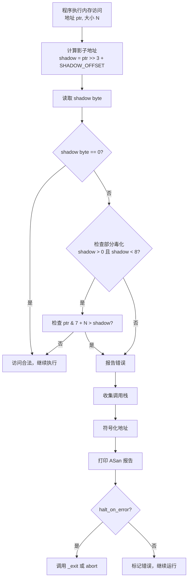

# 调试器原理与实战（14）· Sanitizer 调试（ASan/TSan/MSan/UBSan）

> [!abstract] TL;DR
> - **Sanitizer 是"主动调试工具"**：不等 BUG 自然崩溃，在错误发生的第一个时钟周期就插入检测代码并精确报警。
> - **ASan（AddressSanitizer）** 用 1:8 影子内存映射，给每块堆/栈/全局内存加 redzone，检测 buffer-overflow、use-after-free、use-after-return；速度约慢 2×，业界首选。
> - **UBSan** 在编译期插桩捕获未定义行为（有符号溢出、移位越界、空指针解引用、对齐错误），零运行期开销模型，开销极低。
> - **TSan** 用 happens-before 向量时钟检测数据竞争，影子状态机记录每次内存访问；开销约 5–20×，但是多线程程序的必备武器。
> - **MSan** 追踪未初始化内存读，需对所有依赖库全量插桩，是四者中部署成本最高的。
> - **工具链**：`-fsanitize=address -fno-omit-frame-pointer -g` 编译，`asan_symbolize` 符号化，GDB 断点 `__asan::ReportGenericError` 定格现场；与 Valgrind 的本质区别是"编译期插桩 vs 动态二进制翻译"。

Sanitizer 族群是过去十年最重要的调试基础设施革新之一。它们不依赖调试器主动介入，而是在程序自身的执行流里织入"探针"，把内存错误/数据竞争/未定义行为的第一个字节级症状变成即时崩溃和精确报告。本篇从原理到实战，逐一拆解每种 Sanitizer 的检测机制、报错阅读方法与调优选项。

---

## 概述与定位

### Sanitizer 作为"主动调试工具"

传统调试流程是被动的：程序在某处崩溃，调试器捕获信号，开发者从崩溃现场反向追溯根因。这条路在内存错误场景下极为痛苦——真正的写越界可能在崩溃前 10 万条指令就已发生，而崩溃时刻的现场与根因相距甚远。

Sanitizer 翻转了这个流程：编译器在编译阶段向每次内存访问、每个算术运算前后插入检测代码，运行期一旦触碰违规立刻终止并打印精确报告。这让"越界写发生的那条指令"直接成为崩溃点，而不是"越界写破坏了某个结构体、若干指令后才解引用损坏的指针"。

Sanitizer 与调试器的关系是**互补而非替代**：Sanitizer 告诉你"哪里出了问题"，调试器帮你"理解为什么"。典型工作流是：开启 ASan 复现 BUG → 拿到精确的崩溃位置和调用栈 → 用 GDB 在该位置打条件断点、检查上下文 → 定位根因。

### Sanitizer 家族一览

| 工具 | 检测目标 | 编译选项 | 速度开销 | 内存开销 |
|------|----------|----------|----------|----------|
| ASan | 内存越界/UAF/UAR | `-fsanitize=address` | 约 2× | 约 3× |
| UBSan | 未定义行为 | `-fsanitize=undefined` | 极低 | 极低 |
| TSan | 数据竞争 | `-fsanitize=thread` | 5–20× | 约 5–10× |
| MSan | 未初始化内存读 | `-fsanitize=memory` | 约 3× | 约 3× |
| LSan | 内存泄漏 | 内置于 ASan 或 `-fsanitize=leak` | 极低 | 极低 |

ASan 与 TSan 不能同时启用（影子内存布局互斥），其他组合一般可以叠加。

---

## 原理与机制

### ASan：影子内存与 redzone

ASan 的核心是**影子内存（shadow memory）**机制。它把整个应用地址空间以 1:8 的比例映射到一块"影子区"：应用里每 8 字节对应影子里 1 个字节（称为 shadow byte）。

shadow byte 的语义如下：
- `0x00`：8 字节全部可访问
- `0x01`–`0x07`：前 N 字节可访问，后面是 redzone
- `0xFA`–`0xFF`：各种毒化（poisoned）状态，访问即报错

```text
应用地址空间（64 位典型布局）：
  0x000000000000 – 0x00007fffffffffff  用户空间
                 ↓ 1:8 映射
影子内存区域（Shadow Memory）：
  0x7fff7000 开始的连续区域，每字节覆盖 8 字节应用内存
```

每次内存访问（读或写）之前，编译器插入如下检测代码（伪汇编）：

```asm
; 检测对地址 ptr 的 1 字节读
mov  rax, ptr
shr  rax, 3                ; 影子地址 = (ptr >> 3)
add  rax, ShadowOffset     ; 加影子基址偏移
movzx ecx, byte [rax]      ; 读影子字节
test ecx, ecx              ; 非零说明有毒化
jnz  __asan_report_load1   ; 跳转到报错
```

**redzone（红区）** 是 ASan 在每块分配内存前后额外分配的毒化区域。堆分配时，`malloc` 被替换为 ASan 的 `__asan_malloc`，它在返回给用户的内存块两侧各加 32–128 字节 redzone，并将 redzone 的 shadow byte 标记为 `0xFD`（heap redzone）。任何越界访问都会碰到 redzone 并立即触发报告。

**quarantine（隔离队列）** 用于检测 use-after-free：`free` 并不立即归还内存给操作系统，而是把该内存块放入一个 FIFO 隔离队列，同时将其 shadow byte 标记为 `0xFD`（heap freed）。队列满（由 `quarantine_size_mb` 控制）才真正释放最老的块。在隔离期间，任何对该内存的读写都触发 use-after-free 报告。

### ASan 检测的错误类型

| 错误类型 | 触发条件 | shadow byte 值 |
|----------|----------|----------------|
| heap-buffer-overflow | 访问堆块的 redzone | `0xFA`/`0xFD` |
| stack-buffer-overflow | 访问栈局部变量的 redzone | `0xF1`–`0xF4` |
| global-buffer-overflow | 访问全局变量的 redzone | `0xF9` |
| use-after-free | 访问已 free 的隔离内存 | `0xFD` |
| use-after-return | 访问已返回函数的栈帧 | `0xF5` |
| use-after-scope | 访问已超出作用域的栈变量 | `0xF8` |
| double-free | 对已 free 的内存再次调用 free | 检测到 `0xFD` 重入 |

**use-after-return** 需要额外启用（`ASAN_OPTIONS=detect_stack_use_after_return=1`），因为它需要把栈帧分配改为堆分配，开销更大。

### ASan 报错信息解读

```text
==12345==ERROR: AddressSanitizer: heap-buffer-overflow on address 0x602000000050
  at pc 0x000000401234 bp 0x7ffc12340000 sp 0x7ffc1233fff8
READ of size 4 at 0x602000000050 thread T0
    #0 0x401234 in read_oob /home/user/test.c:15
    #1 0x401290 in main /home/user/test.c:30
    #2 0x7f... in __libc_start_main
SUMMARY: AddressSanitizer: heap-buffer-overflow /home/user/test.c:15 in read_oob
Shadow bytes around the buggy address:
  0x0c047fff7ff0: 00 00 00 00 00 00 00 00 00 00 fa fa fa fa fa fa
  0x0c047fff8000: 00 00 fd fd fd fd fd fd fd fd fa fa fa fa fa fa
                                ^^
Heap block at 0x602000000020 of size 32 bytes:
  allocated by thread T0 here:
    #0 0x7f... in malloc
    #1 0x401200 in read_oob /home/user/test.c:12
```

逐行要点：
1. **第 1 行**：错误类型（heap-buffer-overflow）+ 触发地址
2. **READ of size 4**：读操作、访问了 4 字节
3. **调用栈**：`#0` 是直接触发点，向上是调用链；符号化后直接指向源码行
4. **Shadow bytes**：`00` 可访问，`fa` 是 redzone，`fd` 是 heap left redzone；`^^` 标注触发的 shadow byte
5. **Heap block**：所属堆块的分配位置，帮助判断越界了多少字节

### ASAN_OPTIONS 常用选项

```bash
# 最常用组合
ASAN_OPTIONS=detect_leaks=1:halt_on_error=0:quarantine_size_mb=256 ./my_program

# 选项说明
detect_leaks=1            # 同时启用 LeakSanitizer（默认已启用）
halt_on_error=0           # 报错后不立即退出，继续运行发现更多问题
quarantine_size_mb=256    # 隔离队列大小（越大，UAF 检测窗口越长）
detect_stack_use_after_return=1  # 检测 use-after-return（开销较高）
symbolize=1               # 在运行时符号化（需要 llvm-symbolizer 在 PATH）
log_path=/tmp/asan.log    # 把报告写到文件而非 stderr
abort_on_error=1          # 触发 SIGABRT 而非 _exit，方便 GDB 捕获
```

### UBSan：未定义行为的编译期插桩

UBSan（UndefinedBehaviorSanitizer）针对 C/C++ 中大量"技术上未定义"的行为，在每个可能触发未定义行为的操作前插入运行期检查。与 ASan 不同，UBSan 的检查开销极低（通常 < 10%），因为大多数检查只是一条比较指令。

主要检测类别：

```bash
# 有符号整数溢出（-signed-integer-overflow）
int a = INT_MAX; int b = a + 1;  # 触发 UB，UBSan 报错

# 移位越界（-shift）
int x = 1; int y = x << 33;     # 32 位 int 移位超过 31，UB

# 空指针解引用（-null）
int *p = nullptr; *p = 1;        # 明确检测，区别于段错误

# 对齐错误（-alignment）
char buf[8]; int *p = (int*)&buf[1]; *p = 1;  # 未对齐访问

# 类型混淆（-vptr）
Base *b = new Derived; static_cast<Other*>(b);  # 非法向下转型
```

UBSan 报错格式：

```text
test.c:15:12: runtime error: signed integer overflow: 2147483647 + 1
  cannot be represented in type 'int'
    #0 0x401234 in overflow_func test.c:15
```

启用全套未定义行为检查：`-fsanitize=undefined`；仅启用子集：`-fsanitize=signed-integer-overflow,null,alignment`。

### TSan：数据竞争与 happens-before

TSan（ThreadSanitizer）检测数据竞争——即两个线程在没有同步原语保护的情况下，至少有一个写操作地并发访问同一内存位置。

TSan 的核心数据结构是**影子状态机（shadow state）**：对每个内存单元（8 字节对齐的槽），维护 4 个影子槽，每个记录：
- 线程 ID（TID）
- 矢量时钟的时间戳（epoch）
- 访问大小（1/2/4/8 字节）
- 访问类型（读/写）

每次内存访问时，TSan 检查当前访问与已记录的历史访问之间是否满足 **happens-before 关系**。happens-before 通过向量时钟（vector clock）推进：
- 同一线程的操作按程序顺序 happens-before
- 线程 A 解锁互斥量，线程 B 加锁，则 A 的解锁 happens-before B 的加锁

若两个访问之间不存在 happens-before 关系，且至少一个是写，则报数据竞争：

```text
WARNING: ThreadSanitizer: data race (pid=12345)
  Write of size 4 at 0x7f8b00001020 by thread T2:
    #0 increment /tmp/race.c:8
    #1 thread_func /tmp/race.c:12

  Previous read of size 4 at 0x7f8b00001020 by thread T1:
    #0 read_val /tmp/race.c:15
    #1 thread_func /tmp/race.c:19

  Mutex M1 (0x7f8b00001030) is not held.
  Thread T2 ... created by main thread at:
    #0 pthread_create ...
```

TSan 的开销来源是维护向量时钟和影子内存，约 5–20 倍慢、5–10 倍内存增长。但对于多线程程序，它是唯一系统性检测数据竞争的工具——数据竞争往往无法稳定复现，而 TSan 在大多数情况下能在首次运行就捕获。

### MSan：未初始化内存读

MSan（MemorySanitizer）追踪堆/栈/全局内存的每一位是否被初始化，并在读取未初始化内存时报错。它使用类似 ASan 的影子内存（1:1 比例，每字节对应一位 uninitialized 标记）。

MSan 的最大挑战：**必须对所有依赖库全量插桩**。如果某个系统库（如 libc）没有用 MSan 编译，其内部初始化的内存在 MSan 眼中仍是"未初始化"，导致大量误报。因此 MSan 通常需要配合 MSan 编译的 libc/libc++ 使用，部署成本最高。

### LeakSanitizer

LSan 在进程退出时扫描所有堆分配，找出没有被任何指针引用的内存块。它内置于 ASan（`detect_leaks=1`）中，也可以单独使用（`-fsanitize=leak`）。

```text
==12345==ERROR: LeakSanitizer: detected memory leaks

Direct leak of 128 byte(s) in 1 object(s) allocated from:
    #0 0x7f... in malloc
    #1 0x401200 in allocate_buffer /tmp/leak.c:10
    #2 0x401250 in main /tmp/leak.c:20

SUMMARY: LeakSanitizer: 128 byte(s) leaked
```

---

## 结构/算法/伪代码详解

### ASan 影子内存映射与访问检测流程



### redzone 与 quarantine 内存布局

```text
堆分配内存布局（ASan 模式）：

  [...左 redzone (32B, 毒化 0xFA)...][用户数据 (N B, 可访问 0x00)][...右 redzone (32B, 毒化 0xFA)...]

  堆块头部（内部元数据）：
    ┌────────────────────────────────────────────────┐
    │  chunk size │  flags │  alloc stack trace offset │
    └────────────────────────────────────────────────┘
  左 redzone (shadow = 0xFA..0xFD)
    ┌──────────────────────────────┐
    │  xxxxxxxxxxxxxxxxxxxxxxxx    │  32 字节毒化区
    └──────────────────────────────┘
  用户内存 (shadow = 0x00, 末尾 1-7 字节可能 0x01-0x07)
    ┌──────────────────────────────┐
    │  AAAAAAAAAA... (N 字节)      │  用户可访问区
    └──────────────────────────────┘
  右 redzone (shadow = 0xFA..0xFD)
    ┌──────────────────────────────┐
    │  xxxxxxxxxxxxxxxxxxxxxxxx    │  32 字节毒化区
    └──────────────────────────────┘

free 后进入 quarantine：
  整块 shadow 标记为 0xFD（heap freed），
  加入 FIFO 队列，等待 quarantine_size_mb 满后才真正回收
```

### TSan happens-before 向量时钟推进伪代码

```python
# 每个线程维护一个向量时钟 VC[thread_count]
# 每个内存位置维护最近 4 次访问的影子记录

def thread_write(tid, addr, size):
    shadow_slots = get_shadow(addr)
    for slot in shadow_slots:
        if slot.is_write or current_tid_not_sync:
            # 检查 happens-before
            if not happens_before(slot.vc[slot.tid], current_vc[slot.tid]):
                report_race(slot, current_access)
    # 更新影子槽
    shadow_slots[LRU] = ShadowSlot(tid, current_vc[tid], WRITE, size)
    # 推进本线程时钟
    current_vc[tid] += 1

def mutex_unlock(tid, mutex_id):
    # 解锁时，将本线程时钟写入 mutex 的时钟
    mutex_clock[mutex_id] = current_vc.copy()

def mutex_lock(tid, mutex_id):
    # 加锁时，合并 mutex 时钟到本线程（happens-before 传递）
    for t in range(thread_count):
        current_vc[t] = max(current_vc[t], mutex_clock[mutex_id][t])
    current_vc[tid] += 1
```

---

## 工具视角与实战

### 编译选项

```bash
# ASan 标准编译（必须加 -fno-omit-frame-pointer 保证调用栈完整）
clang++ -fsanitize=address -fno-omit-frame-pointer -g -O1 -o test test.cpp
# GCC 同样支持
g++ -fsanitize=address -fno-omit-frame-pointer -g -O1 -o test test.cpp

# UBSan（可与 ASan 叠加）
clang++ -fsanitize=address,undefined -fno-omit-frame-pointer -g -O1 -o test test.cpp

# TSan（与 ASan 互斥）
clang++ -fsanitize=thread -fno-omit-frame-pointer -g -O1 -o test test.cpp

# MSan（仅 Clang 支持）
clang++ -fsanitize=memory -fno-omit-frame-pointer -g -O1 -o test test.cpp

# CMake 项目一键开启 ASan
cmake -DCMAKE_CXX_FLAGS="-fsanitize=address -fno-omit-frame-pointer -g" ..
```

> [!tip] `-O1` 而非 `-O0`
> 推荐 `-O1` 而非 `-O0`：`-O1` 消除部分编译器噪声，让调用栈更接近真实代码，同时不会因优化导致调试信息丢失。ASan 在 `-O2` 下也能工作，但某些栈变量可能被优化消失。

### asan_symbolize 符号化

当程序不带 `llvm-symbolizer` 或地址符号化失败时，ASan 输出的是裸地址。用 `asan_symbolize` 后处理：

```bash
# 方法 1：运行时设置 symbolizer
ASAN_OPTIONS=symbolize=1 ASAN_SYMBOLIZER_PATH=$(which llvm-symbolizer) ./test 2>&1

# 方法 2：把裸地址报告管道给 asan_symbolize
./test 2>&1 | asan_symbolize

# 方法 3：保存报告后符号化
./test 2>/tmp/asan.log; asan_symbolize < /tmp/asan.log
```

### 与 GDB 结合

ASan 在报错时会调用 `__asan::ReportGenericError`，可以在 GDB 里设置断点在这个函数，在报告打印之前定格现场，检查完整的内存状态：

```gdb
# 在 GDB 中运行 ASan 程序
(gdb) set environment ASAN_OPTIONS=abort_on_error=1
(gdb) run

# 或直接打断点
(gdb) break __asan::ReportGenericError
(gdb) run

# ASan 报错后 GDB 停住，可以检查调用栈和内存
(gdb) bt
(gdb) info registers
(gdb) x/32xb $rdi    # 查看触发地址周围的内存
```

> [!note]
> 使用 `abort_on_error=1` 让 ASan 触发 `SIGABRT` 而非 `_exit`，这样 GDB 能捕获信号并让你检查现场。默认的 `_exit` 会绕过 GDB 的信号捕获。

### CMake/CI 集成实践

```cmake
# CMakeLists.txt：添加 Sanitizer 编译目标
option(ENABLE_ASAN "Enable AddressSanitizer" OFF)
option(ENABLE_TSAN "Enable ThreadSanitizer" OFF)
option(ENABLE_UBSAN "Enable UBSan" OFF)

if(ENABLE_ASAN)
    target_compile_options(my_target PRIVATE
        -fsanitize=address -fno-omit-frame-pointer -g)
    target_link_options(my_target PRIVATE -fsanitize=address)
endif()
```

```yaml
# GitHub Actions CI 示例
- name: Build with ASan
  run: |
    cmake -B build-asan -DENABLE_ASAN=ON
    cmake --build build-asan
- name: Run tests with ASan
  run: |
    cd build-asan
    ASAN_OPTIONS=detect_leaks=1:halt_on_error=1 ctest --output-on-failure
```

---

## 安全性与正确使用

### 陷阱 1：ASan 与 jemalloc/tcmalloc 冲突

ASan 替换了 `malloc`/`free`；如果程序同时链接了 jemalloc 或 tcmalloc，这两套 allocator 会产生冲突，导致误报或崩溃。需要在开启 ASan 时禁用自定义 allocator：

```bash
# 对于 jemalloc
./configure --disable-jemalloc && make

# 对于 LD_PRELOAD 方式的 tcmalloc
# 去掉 LD_PRELOAD=libtcmalloc.so 再运行 ASan 程序
```

### 陷阱 2：TSan 的误报（false positive）

TSan 在以下情况可能误报：
- **原子操作未用标准原语**：用 `__attribute__((aligned))` + volatile 实现的"手工原子"不被 TSan 识别
- **信号处理函数中的内存访问**：异步信号处理器与主线程访问共享变量，TSan 无法正确建模 happens-before
- **自定义同步原语**：非 POSIX 的锁/条件变量需要用 `__tsan_acquire`/`__tsan_release` 注解

```cpp
// 对自定义同步原语添加 TSan 注解
#include <sanitizer/tsan_interface.h>
void my_lock_acquire(void *lock) {
    // ... 实际加锁逻辑 ...
    __tsan_acquire(lock);  // 告知 TSan：此处是 acquire 语义
}
void my_lock_release(void *lock) {
    __tsan_release(lock);  // 告知 TSan：此处是 release 语义
    // ... 实际解锁逻辑 ...
}
```

### 陷阱 3：MSan 的全量插桩要求

MSan 对未插桩的库调用会产生大量误报。实际使用时需要：
1. 使用 MSan 编译版本的 libc++（`clang++ -stdlib=libc++ -fsanitize=memory`）
2. 或使用 `__msan_unpoison` 手动标记来自未插桩库的"干净"内存

```cpp
#include <sanitizer/msan_interface.h>
// 告知 MSan：从第三方库拿到的 buf 是干净的
__msan_unpoison(buf, len);
```

### 陷阱 4：生产环境风险

**绝对不要在生产环境部署 ASan 或 TSan**。原因：
- ASan 的影子内存和 quarantine 大幅增加内存使用
- TSan 的 5–20 倍性能开销不可接受
- Sanitizer 在发现错误时会终止进程（除非 `halt_on_error=0`），等价于主动崩溃

Sanitizer 属于**开发/测试/CI 工具**，不是监控工具。生产环境的内存安全监控应使用 Valgrind 的 massif、GWP-ASan（采样式 ASan，开销极低）或 HWASAN（ARMv8 硬件标签，约 2% 开销）。

### 与 Valgrind Memcheck 的对比

| 维度 | Sanitizer (ASan) | Valgrind Memcheck |
|------|-----------------|-------------------|
| 工作原理 | 编译期插桩，原生执行 | 动态二进制翻译（DBT）|
| 速度开销 | 约 2× | 约 20–50× |
| 内存开销 | 约 3× | 约 3–4× |
| 需要重新编译 | 是 | 否 |
| 未初始化内存检测 | MSan（需重编） | 内置，无需重编 |
| 检测 use-after-free | 是（依赖 quarantine 窗口）| 是（更精确，无窗口限制）|
| 未插桩二进制 | 无法检测（ASan 仅检测插桩代码）| 可以检测任意二进制 |
| 适用场景 | 有源码、CI 流程 | 无源码或需分析第三方库 |

核心区别：Valgrind 不依赖源码，可以对任意二进制做细粒度内存追踪；代价是速度极慢，不适合大型程序的日常 CI。ASan 速度快，与 CI 流水线友好，但只能检测到被插桩代码路径上的错误。

---

## 小结

1. **Sanitizer 是主动调试工具**：把内存错误的第一字节级症状变成即时精确报告，而不是等待程序自然崩溃后再反向追溯。
2. **ASan 是首选**：1:8 影子内存 + redzone + quarantine 三件套，以约 2× 速度开销覆盖绝大多数内存安全问题，是 C/C++ 项目 CI 的标配。
3. **报错解读关键**：看错误类型 → 找触发点（`#0`）→ 看 shadow bytes 确认越界方向 → 找分配/释放位置确认上下文。
4. **UBSan 低成本高价值**：可与 ASan 叠加，几乎零额外开销地捕获有符号溢出、移位越界等难以察觉的 UB。
5. **TSan 是多线程必备**：数据竞争往往不可稳定复现，TSan 的 happens-before 分析在首次运行即可捕获，节省大量排查时间。
6. **MSan 部署成本最高**：需要全量插桩依赖，适合在受控的全栈自构建环境中使用。
7. **与 GDB 的组合**：`abort_on_error=1` + `break __asan::ReportGenericError` 让 Sanitizer 在触发错误的精确现场停住，可用 GDB 检查完整上下文，是深度分析复杂 BUG 的利器。

---

## 相关阅读

- **调试信息与符号化（符号化 ASan 报告的基础）**：[[05.调试信息DWARF]]、[[06.PDB与Windows符号]]
- **GDB 深度调试技术（与 ASan 结合的调试器端）**：[[03.GDB深度使用]]
- **远程与内核调试（上篇）**：[[13.远程与内核调试]]
- **eBPF 动态调试（下篇）**：[[15.eBPF动态调试]]
- **栈回溯（ASan 调用栈的生成机制）**：[[07.栈回溯unwind]]
- **ELF 与内存布局（影子内存的地址空间背景）**：[[11.ELF文件详解/01.ELF概述.md]]

---

⬅️ 上一篇 [[13.远程与内核调试]] ｜ 🏠 [[00.调试器原理与实战总览]] ｜ 下一篇 [[15.eBPF动态调试]] ➡️
