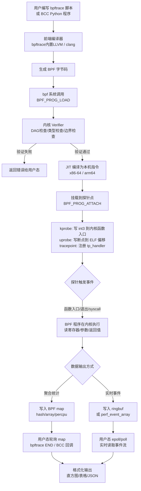

# 调试器原理与实战（15）· eBPF 动态调试（bpftrace/bcc/uprobe）

> [!abstract] TL;DR
> - **eBPF 是"生产环境安全窥镜"**：把可验证的字节码注入内核，在不停机、不修改代码的前提下，低开销地观测内核与用户态程序的行为——与断点式调试器的"暂停-检查-恢复"模型根本不同。
> - **bpftrace** 提供类 awk 的单行脚本语言（`probe/filter{}/action`），覆盖 `kprobe`/`uprobe`/`tracepoint`/`usdt` 四类探针，内建 `comm`/`pid`/`args`/`retval`、map `@[]`、直方图 `hist()`，适合快速诊断。
> - **BCC 工具集** 提供 execsnoop/opensnoop/funclatency/biolatency/tcptop/profile 等即用型工具，背后是 Python + LLVM 动态编译的 BPF 程序。
> - **uprobe** 可按符号名或偏移动态挂载到任意用户态函数，无需修改目标进程，配合 `uretprobe` 同时捕获参数与返回值。
> - **BTF + CO-RE** 让同一个 BPF 程序跨内核版本运行，无需为每个内核重编译。
> - **权限要求**：生产环境通常需要 `CAP_BPF`（Linux 5.8+）或 root；eBPF 程序在内核 verifier 通过后安全执行，不会崩溃内核。

eBPF 代表了一种全新的调试哲学：**观测而不介入**。传统调试器用断点暂停程序，而 eBPF 让你在程序全速运行时静默收集数据，把问题的痕迹汇聚到用户态再分析。本篇从 bpftrace 语法入门到 uprobe 实战，再到 BCC 工具集与 BTF/CO-RE 的跨内核可移植性，完整覆盖 eBPF 动态调试的核心技术链路。

---

## 概述与定位

### eBPF 作为生产环境观测工具

传统断点式调试（GDB/lldb）在生产环境面临根本性障碍：暂停进程意味着服务中断；调试符号通常被裁剪；问题往往在引入调试器后消失（Heisenbug）。这些障碍催生了两类非侵入式工具：

1. **Sanitizer（上篇 [[14.Sanitizer调试]]）**：主动插桩，开发/测试期使用，生产环境不可用
2. **eBPF**：内核内可编程探针，生产环境低开销，无需修改目标程序

eBPF 的工作模型：用户编写 BPF 字节码程序，经内核 **verifier** 静态验证（无无限循环、无非法内存访问、有界栈），然后 **JIT 编译**为本机指令注入内核。程序挂载到探针点（函数入口/退出、tracepoint、PMU 事件），在探针触发时执行——全程在内核上下文中，但被 verifier 保证不会崩溃内核。

eBPF 与调试器的本质区别：

| 维度 | 断点式调试器（GDB）| eBPF（bpftrace/BCC）|
|------|------------------|---------------------|
| 对目标程序的影响 | 暂停执行 | 极低延迟，全速运行 |
| 需要源码/符号 | 理想情况需要 | 可按偏移工作，符号可选 |
| 适用环境 | 开发/测试 | 开发/测试/生产 |
| 数据收集方式 | 交互式，手动 | 自动聚合，结构化输出 |
| 覆盖面 | 单进程 | 系统全局（所有进程/内核）|
| 钩子粒度 | 指令级断点 | 函数边界/tracepoint/perf |

关于 Linux hook 机制的更广泛背景，参见 [[32.hooks/03-linux-hook.md]]。

### 探针类型全览

```text
探针类型层次：

  内核空间：
    kprobe    → 动态挂载到任意内核函数入口（软件断点，kprobes 框架）
    kretprobe → 挂载到内核函数返回，捕获返回值
    tracepoint → 内核源码预埋的静态探针（稳定 ABI）
    perf_event → 硬件 PMU 事件（CPU 周期/缓存缺失等）

  用户空间：
    uprobe    → 动态挂载到用户态函数入口（按符号或偏移）
    uretprobe → 挂载到用户态函数返回
    usdt      → 用户态静态定义的 tracepoint（SystemTap 兼容格式）

  网络：
    XDP       → 网卡驱动层数据包处理
    tc        → Traffic Control 钩子（入站/出站）
    socket    → 套接字层过滤器（BPF 的原始起源）
```

---

## 原理与机制

### eBPF 程序的生命周期

```text
用户态编写 BPF 程序
        ↓
   编译为 BPF 字节码（LLVM/Clang 或 bpftrace 内置编译器）
        ↓
   bpf() 系统调用提交给内核
        ↓
   内核 Verifier 静态验证：
     - 控制流图无环检查（DAG 验证）
     - 每条指令类型合法性
     - 内存访问在已知边界内
     - 无越界指针解引用
        ↓
   JIT 编译器生成本机指令（x86_64/arm64）
        ↓
   挂载到探针点（kprobe/uprobe/tracepoint）
        ↓
   探针触发 → BPF 程序执行 → 数据写入 map/ringbuf
        ↓
   用户态程序读取 map，展示分析结果
        ↓
   卸载探针，清理 map
```

### kprobe 与 uprobe 的实现差异

**kprobe**：在目标内核函数入口处替换指令为 `int3`（x86）或 `brk`（ARM），触发异常后进入 kprobe 处理函数，执行 BPF 程序，然后单步执行原始指令，恢复执行。函数通过 `/proc/kallsyms` 或 BTF 定位地址。

**uprobe**：类似 kprobe，但作用于用户态 ELF 文件。内核在目标进程的地址空间里，把 ELF 的目标偏移处的指令替换为断点，触发缺页异常进入内核 uprobe 处理路径。uprobe 按（ELF 文件路径 + 偏移）标识探针，不依赖进程 PID，一个 uprobe 定义同时覆盖运行该二进制的所有进程。

### BPF map 数据结构

BPF 程序与用户态之间通过 **map** 通信，map 是驻留内核的键值存储，主要类型：

| map 类型 | 语义 | 典型用途 |
|---------|------|---------|
| `BPF_MAP_TYPE_HASH` | 哈希表 | 按 PID/函数名统计 |
| `BPF_MAP_TYPE_ARRAY` | 数组（定长，按 index 访问）| 全局计数器 |
| `BPF_MAP_TYPE_PERCPU_HASH` | 每 CPU 哈希表 | 高频计数，避免锁竞争 |
| `BPF_MAP_TYPE_PERF_EVENT_ARRAY` | perf 环形缓冲区 | 实时流式传递事件 |
| `BPF_MAP_TYPE_RINGBUF` | 无锁环形缓冲区（Linux 5.8+）| 推荐的高效事件传递 |
| `BPF_MAP_TYPE_STACK_TRACE` | 调用栈 ID → 调用栈映射 | profiling |

---

## 结构/算法/伪代码详解

### bpftrace 语法详解

bpftrace 脚本的基本结构是：`探针规范 / 过滤条件 / { 动作体 }`

```bash
# 完整语法骨架
probe_type:target[:func[:extra]]
/ filter_expression /
{
    action_statements;
}
```

**探针规范**示例：

```bash
kprobe:do_sys_openat2          # 内核函数 do_sys_openat2 入口
kretprobe:do_sys_openat2       # 内核函数 do_sys_openat2 返回
tracepoint:syscalls:sys_enter_read  # syscall tracepoint（稳定 ABI）
uprobe:/lib/x86_64-linux-gnu/libc.so.6:malloc  # libc malloc 入口
uretprobe:/usr/bin/python3:PyObject_Call  # Python 解释器函数返回
usdt:/usr/bin/node:http:server-request    # Node.js USDT 探针
profile:hz:99                  # 99 Hz 采样（CPU profiling）
interval:s:1                   # 每秒触发一次（汇总输出）
END                            # 程序退出时执行
```

**内建变量**：

| 变量 | 类型 | 含义 |
|------|------|------|
| `pid` | int | 当前进程 PID |
| `tid` | int | 当前线程 TID |
| `comm` | string | 进程名（`/proc/PID/comm`）|
| `uid` / `gid` | int | 用户/组 ID |
| `args` | 结构体 | 探针参数（tracepoint 专有）|
| `arg0`..`argN` | uint64 | 函数第 N 个参数（kprobe/uprobe）|
| `retval` | int64 | 函数返回值（kretprobe/uretprobe）|
| `func` | string | 当前探针函数名 |
| `probe` | string | 完整探针名 |
| `curtask` | uint64 | 当前 task_struct 指针 |
| `nsecs` | uint64 | 纳秒时间戳 |
| `cpu` | int | 当前 CPU 编号 |
| `kstack` | string | 内核调用栈 |
| `ustack` | string | 用户态调用栈 |

**map 操作**：

```bash
@calls[comm] ++               # 按进程名计数
@latency = hist(elapsed)      # 指数直方图（2 的幂次分桶）
@latency = lhist(elapsed, 0, 10000, 100)  # 线性直方图（0-10000μs，步长 100）
@start[tid] = nsecs           # 保存时间戳（用 tid 做 key）
delete(@start[tid])           # 删除 map 条目
print(@calls, 10)             # 打印 top 10
clear(@latency)               # 清空 map
```

### bpftrace 一行命令实战

```bash
# 1. 追踪所有进程的 open 系统调用，打印进程名和文件路径
bpftrace -e 'tracepoint:syscalls:sys_enter_openat { printf("%s %s\n", comm, str(args->filename)); }'

# 2. 追踪 execve，看谁在执行新程序（等价于 execsnoop）
bpftrace -e 'tracepoint:syscalls:sys_enter_execve { printf("%d %s %s\n", pid, comm, str(args->filename)); }'

# 3. 统计各进程的 read 系统调用次数（每 5 秒输出一次）
bpftrace -e '
  tracepoint:syscalls:sys_enter_read { @[comm] ++; }
  interval:s:5 { print(@); clear(@); }'

# 4. 追踪 read 系统调用的延迟分布（指数直方图，μs 单位）
bpftrace -e '
  tracepoint:syscalls:sys_enter_read { @start[tid] = nsecs; }
  tracepoint:syscalls:sys_exit_read  /@start[tid]/
  {
    @latency_us = hist((nsecs - @start[tid]) / 1000);
    delete(@start[tid]);
  }'

# 5. uprobe 追踪 malloc 的参数（分配大小）分布
bpftrace -e '
  uprobe:/lib/x86_64-linux-gnu/libc.so.6:malloc
  { @alloc_size = hist(arg0); }'

# 6. 追踪用户态函数的返回值（uretprobe）
bpftrace -e '
  uretprobe:/usr/bin/python3:PyEval_EvalFrameDefault
  { @retvals[retval] ++; }'

# 7. CPU 火焰图采样（99 Hz，30 秒）
bpftrace -e 'profile:hz:99 { @[kstack, ustack, comm] = count(); }' > /tmp/bpftrace.out

# 8. 按进程统计网络 socket 发送字节数
bpftrace -e '
  kretprobe:tcp_sendmsg
  { @bytes[comm, pid] = sum(retval); }'

# 9. 追踪某个特定 PID 的函数调用（过滤器）
bpftrace -e '
  uprobe:/usr/bin/myapp:process_request
  /pid == 12345/
  { printf("request: arg0=%d\n", arg0); }'

# 10. 统计系统调用频次并排序输出
bpftrace -e '
  tracepoint:raw_syscalls:sys_enter { @syscalls[args->id] ++; }
  END { print(@syscalls, 20); }'
```

### eBPF 探针附加与数据回传流程图



---

## 工具视角与实战

### BCC 工具集实战

BCC（BPF Compiler Collection）提供一套即用型命令行工具，底层是 Python + LLVM 动态编译的 BPF 程序。

```bash
# execsnoop：追踪所有新进程执行（等价于持续 strace execve）
execsnoop-bpfcc

# opensnoop：追踪文件打开操作，带文件名和 PID
opensnoop-bpfcc -T    # -T 显示时间戳

# funclatency：测量任意内核/用户态函数的延迟分布
funclatency-bpfcc 'ext4_file_read_iter'           # 内核函数
funclatency-bpfcc -p 1234 '/usr/bin/myapp:process' # 用户态函数

# biolatency：块设备 I/O 延迟直方图
biolatency-bpfcc -D    # -D 按磁盘分类

# tcptop：实时显示 TCP 发送/接收 top N 进程
tcptop-bpfcc

# profile：CPU 火焰图采样（基于 99 Hz timer）
profile-bpfcc -F 99 10     # 采样 10 秒，99 Hz

# memleak：追踪未释放的内存分配（用于定位内存泄漏）
memleak-bpfcc -p 1234

# mysqld_qslower：MySQL 慢查询追踪（USDT 探针）
mysqld_qslower-bpfcc 1     # 打印超过 1ms 的查询

# cachetop：页缓存命中率实时监控
cachetop-bpfcc

# stackcount：统计某个内核/用户态函数的调用栈频次
stackcount-bpfcc 'ip_output'
```

### uprobe 精确追踪用户态函数

uprobe 是 eBPF 调试用户态程序的核心机制，可以按符号名或二进制偏移挂载。

```bash
# 按符号名追踪（需要二进制有符号表或 .debug_info）
bpftrace -e '
  uprobe:/usr/bin/curl:Curl_http_done
  { printf("curl done: pid=%d retval at next\n", pid); }'

# 同时追踪参数（入口）和返回值（uretprobe）
bpftrace -e '
  uprobe:/usr/lib/x86_64-linux-gnu/libssl.so:SSL_write
  {
    printf("SSL_write: pid=%d, len=%d\n", pid, arg2);
    @start[tid] = nsecs;
  }
  uretprobe:/usr/lib/x86_64-linux-gnu/libssl.so:SSL_write
  {
    printf("  returned %d in %d ns\n", retval, nsecs - @start[tid]);
    delete(@start[tid]);
  }'

# 按偏移挂载（无符号时）
# 先用 readelf/nm 确认偏移
nm /usr/bin/myapp | grep process_request
# 假设偏移 0x12340
bpftrace -e '
  uprobe:/usr/bin/myapp:0x12340
  { printf("process_request called: arg0=%d\n", arg0); }'

# 追踪 C++ 名称修饰（mangled name）
bpftrace -e '
  uprobe:/usr/bin/myapp:_ZN7Handler7processEv
  { printf("Handler::process called\n"); }'
```

### USDT（用户态静态追踪点）

USDT（User Statically-Defined Tracepoints）是应用程序预埋的稳定 ABI 探针，类似内核 tracepoint。常见于数据库（MySQL/PostgreSQL）、运行时（Node.js/Python/JVM）。

```bash
# 列出某二进制的所有 USDT 探针
tplist-bpfcc -l /usr/bin/node

# 追踪 Node.js HTTP 请求
bpftrace -e '
  usdt:/usr/bin/node:http:server-request
  {
    printf("HTTP request: url=%s\n", str(arg0));
  }'

# 追踪 PostgreSQL 查询（需要 pg 带 --enable-dtrace 编译）
bpftrace -e '
  usdt:/usr/lib/postgresql/14/bin/postgres:query__start
  { printf("PG query: %s\n", str(arg0)); }'
```

### 与 perf 的协同

eBPF 与 perf 可以协同工作：

```bash
# perf + BPF filter：只采样特定函数的调用栈
perf record -e 'probe_myapp:process_request' -aR -- sleep 10

# bpftrace 生成 perf script 格式的火焰图数据
bpftrace -e '
  profile:hz:99 { @[kstack] = count(); }
  END { print(@); }' | flamegraph.pl > flame.svg

# 使用 bcc 的 offcputime 工具测量 off-CPU 时间（等待 I/O、锁等）
offcputime-bpfcc 5   # 采样 5 秒
```

### BTF/CO-RE：跨内核可移植性

BTF（BPF Type Format）是与内核二进制一同发布的类型信息，类似 DWARF 但针对 BPF 精简优化。CO-RE（Compile Once, Run Everywhere）利用 BTF 在加载时重定位 BPF 程序里的结构体字段偏移，使同一份 BPF 程序跨不同内核版本运行。

```bash
# 检查内核是否支持 BTF
ls /sys/kernel/btf/vmlinux

# CO-RE 程序使用 BPF_CORE_READ 宏访问结构体（自动重定位）
# 传统做法（硬编码偏移，不可移植）：
pid_t pid = *(pid_t *)((char *)task + TASK_PID_OFFSET);

# CO-RE 做法（运行时按 BTF 重定位）：
pid_t pid = BPF_CORE_READ(task, pid);

# bpftrace 在内核有 BTF 时自动利用 CO-RE，脚本跨内核透明运行
```

### 权限与安全

```bash
# Linux 5.8+ 细粒度能力：不需要完整 root
# 仅需 CAP_BPF（加载 BPF 程序）+ CAP_PERFMON（perf 相关）
sudo setcap cap_bpf,cap_perfmon+eip /usr/bin/bpftrace

# 检查当前系统 BPF 权限模式
cat /proc/sys/kernel/unprivileged_bpf_disabled
# 0: 允许非特权 BPF（受限功能）
# 1: 完全禁止非特权 BPF
# 2: 允许有 CAP_BPF 的用户

# 生产环境建议：
# - 通过 sudoers 或特定工具账号运行 bpftrace/BCC
# - 避免在容器中直接运行（需要 --privileged 或 SYS_ADMIN，权限过大）
# - 使用 seccomp/AppArmor 限制 BPF 程序的 helper 调用
```

---

## 安全性与正确使用

### 陷阱 1：uprobe 对进程性能的影响

虽然 eBPF 开销极低，但在高频调用路径上挂载 uprobe 仍有可见影响。`malloc` 每秒可能被调用数百万次，每次 uprobe 触发都有内核陷入开销（约 1–3μs）。在 `malloc` 上挂载 uprobe 可能使程序性能下降 10–50%。

**原则**：在追踪目标上先用 `funccount` 测量调用频率，高频函数（>10 万次/秒）考虑用采样（`profile:hz:99`）替代全量追踪。

```bash
# 测量函数调用频率再决定是否挂载
funccount-bpfcc 'malloc' -d 5   # 测量 5 秒内 malloc 调用次数
```

### 陷阱 2：BPF verifier 限制

BPF verifier 的某些限制会让初学者困惑：
- **循环**：Linux 5.3 前完全禁止；5.3+ 允许有界循环（需要循环次数有静态上界）
- **程序大小**：指令数上限历史上是 4096，5.2+ 扩展到 100 万
- **栈大小**：BPF 栈固定 512 字节，不能溢出
- **map 访问需要边界检查**：必须在使用 map 指针前验证非 NULL

```bash
# bpftrace 脚本报 verifier 错误时，加 -d 看 BPF 字节码
bpftrace -d -e 'kprobe:do_sys_openat2 { ...; }'
```

### 陷阱 3：符号解析的时机

bpftrace 在**加载时**（而非触发时）解析符号，如果目标二进制在加载后被替换（热升级），探针可能挂在旧偏移上。对于动态链接的共享库，地址随每次进程启动的 ASLR 而变化，但 uprobe 按 ELF 文件偏移挂载，不受 ASLR 影响。

```bash
# 验证 uprobe 挂载的实际偏移
cat /sys/kernel/debug/tracing/uprobe_events
```

### 陷阱 4：数据丢失（ringbuf overflow）

BPF ringbuf 容量有限，高频事件可能导致数据丢失。bpftrace 会在输出中报告 `Lost X events on CPU Y`。解决方法：
- 增大 ringbuf 大小（bpftrace 可用 `BPFTRACE_MAP_KEYS_MAX` 环境变量）
- 改用聚合 map（在内核端汇总，减少传输量）
- 降低追踪频率（加 filter 条件）

### 与 Sanitizer 的互补定位

| 场景 | 推荐工具 |
|------|---------|
| 开发期内存安全问题 | ASan/MSan（精确，有重建） |
| 开发期数据竞争 | TSan（精确 happens-before）|
| 生产环境性能分析 | bpftrace profile / BCC funclatency |
| 生产环境 I/O 延迟 | biolatency / opensnoop |
| 生产环境内存增长 | BCC memleak |
| 生产环境调用链追踪 | bpftrace 调用栈 + 直方图 |
| 跨进程/全系统行为 | eBPF tracepoint/kprobe |

---

## 小结

1. **eBPF 是"观测而不介入"的调试哲学**：在程序全速运行时收集精确数据，无需停机、无需重编译、无需修改目标程序——这是断点式调试器做不到的。
2. **bpftrace 是快速诊断的瑞士军刀**：`probe/filter{}/action` 三段式脚本覆盖 kprobe/uprobe/tracepoint/usdt 四类探针，内建 map、直方图、调用栈，一行命令解决大多数生产问题。
3. **uprobe 是用户态动态调试的核心**：按符号或偏移挂载，不依赖 PID，覆盖所有运行该二进制的进程；uretprobe 同时捕获参数和返回值，实现函数级追踪。
4. **BCC 工具集提供即用型解决方案**：execsnoop/opensnoop/funclatency/biolatency/profile 等工具是系统性能分析的标准工具箱，背后是完整的 Python + BPF 程序。
5. **BTF/CO-RE 解决可移植性**：一次编译的 BPF 程序可跨不同内核版本运行，无需为每个内核重编译，是现代 BPF 工具的标配。
6. **权限模型的平衡**：生产环境用 `CAP_BPF` + `CAP_PERFMON` 替代 root，既满足安全策略又能使用 eBPF 调试能力。
7. **与 Sanitizer 互补**：Sanitizer 在开发期精确定位错误，eBPF 在生产环境低开销观测行为——两者覆盖调试生命周期的不同阶段，不是替代关系。

---

## 相关阅读

- **Linux 钩子机制背景**：[[32.hooks/03-linux-hook.md]]
- **Sanitizer 主动调试（上篇）**：[[14.Sanitizer调试]]
- **rr 时间旅行调试（下篇）**：[[16.rr时间旅行调试]]
- **GDB 与断点调试（对比参照）**：[[03.GDB深度使用]]
- **栈回溯（bpftrace kstack/ustack 的基础）**：[[07.栈回溯unwind]]
- **ELF 符号表（uprobe 符号解析依赖）**：[[11.ELF文件详解/14.符号表节.md]]
- **系统调用机制（tracepoint 的底层入口）**：[[02.系统调用与陷阱]]

---

⬅️ 上一篇 [[14.Sanitizer调试]] ｜ 🏠 [[00.调试器原理与实战总览]] ｜ 下一篇 [[16.rr时间旅行调试]] ➡️
