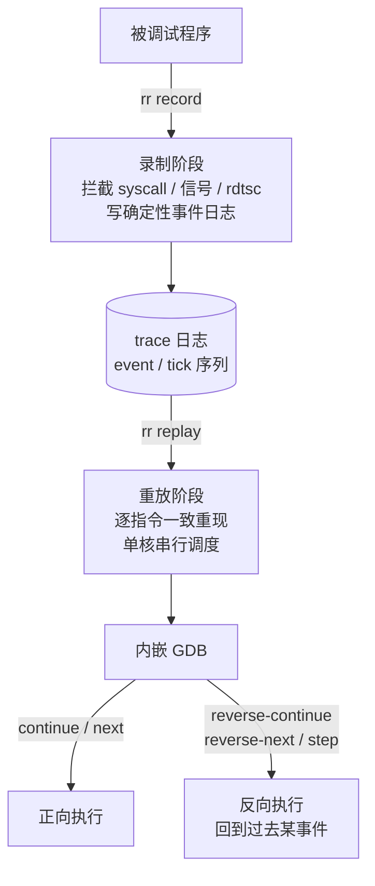

# 调试器原理与实战（16）· rr 时间旅行调试

> [!abstract] TL;DR
> - **rr 是什么**：Mozilla 开发的 Linux 确定性录制-重放调试器。`rr record` 阶段把程序执行的一切非确定性来源（syscall 结果、信号时机、硬件性能计数器 tick）录进日志；`rr replay` 阶段用日志重放出逐指令一致的执行，让 GDB 在其中自由前进或**反向**执行。
> - **反向执行的核心价值**：普通调试只能向前，看到"变量已被改坏"时，已经不知道是哪条语句改的。rr 可以在此刻打 `reverse-continue`（或反向 watchpoint），直接停在"最后一次写那个变量"的那条指令上——找根因从小时缩短为秒级。
> - **事件计数 + tick**：rr 用内核性能计数器（PMU）的"已退役指令数"作为 tick，配合 event number 精确定位任意执行点，实现双向任意跳转。
> - **chaos 模式**：`rr record -h` 随机化线程调度，专门用来复现多线程竞态缺陷，把偶发 bug 变成可重复录制的 bug。
> - **对比 TTD/UDB**：Windows 有 WinDbg TTD、Linux 商业侧有 Undo UDB、云端有 Pernosco；rr 是开源免费的 Linux 方案，录制开销通常在 1.5–2×，适用于大多数 CPU 密集型场景。

时间旅行调试（Time-Travel Debugging，TTD）改变了调试的基本范式：从"反复复现 + 猜测路径"变成"一次录制 + 任意方向探索"。本篇以 rr 为主线，讲透录制-重放的原理、事件计数体系、GDB 集成用法，以及反向执行的正确姿势。

---

## 概述与定位

### 经典调试的固有缺陷

传统调试器（GDB、LLDB）工作在**实时进程**上：你在第 N 步打了断点，程序跑到那里停下，你观察状态；但如果发现问题是在第 N-20 步已经埋下的，只能重新运行、再次等待。对于满足以下任一条件的 bug，这种方式代价极高：

- **非确定性**：多线程竞态、随机化地址空间（ASLR）、依赖外部时间，下一次运行不一定重现。
- **出现时机滞后**：内存越界写入可能在几千次循环后才触发崩溃，"第一次错误写入"与"崩溃"之间相距数百万条指令。
- **副作用不可撤销**：I/O 已写出、网络包已发送，不能倒带。

时间旅行调试的思路：**先录制，后调试**。录制阶段完整保存所有运行信息；回放阶段构造一个"计算机程序的沙盒电影"，调试器可以随时暂停并向任意方向步进。

### rr 的设计目标与生态位

rr（Record and Replay）由 Mozilla 的 Robert O'Callahan 等人开发，最初服务于 Firefox/Gecko 的调试需求（几百万行 C++，竞态崩溃极难复现）。它的设计目标：

1. **开销可接受**：录制时开销约 1.5–2× 原生执行，不依赖虚拟机或全系统仿真。
2. **逐指令确定**：重放时程序执行的每一条指令序列、每一次内存读写，与录制时完全一致。
3. **GDB 原生集成**：重放时内嵌一个扩展过的 GDB stub，现有 GDB 脚本、Python 扩展无需修改即可使用。
4. **支持反向执行**：GDB 的 `reverse-*` 命令族在 rr 上完整可用。

rr 目前仅支持 Linux（x86-64、ARM64 实验性支持），需要 CPU 具备 PMU（性能监控单元）并允许用户态读取性能计数器（`/proc/sys/kernel/perf_event_paranoid ≤ 1`）。

---

## 原理与机制



### 非确定性的来源分类

程序执行之所以不确定，是因为以下来源每次运行可能返回不同值：

| 来源 | 典型例子 | rr 的处理方式 |
|------|----------|--------------|
| 系统调用返回值 | `read()`、`gettimeofday()`、`getpid()` | 录制时记录返回值+输出缓冲区；回放时直接返回录制值 |
| 信号投递时机 | `SIGALRM` 在第几条指令后到来 | 记录信号到来时的 tick 计数；回放时在同一 tick 注入 |
| 内存映射随机化 | ASLR 每次不同的 mmap 地址 | 录制时固定 ASLR（`personality(ADDR_NO_RANDOMIZE)`） |
| 线程调度顺序 | 多线程乱序执行 | 录制时强制单核串行（见下文） |
| `rdtsc`/`rdtscp` | 读取 CPU 时间戳计数器 | 用 vDSO 拦截或 CPUID 陷阱；回放时返回录制值 |
| 共享内存/原子操作 | 多线程共享状态 | 单核化后自然消除 |

### 单核串行化：消除线程非确定性

rr 的多线程处理策略非常激进：**录制阶段强制所有线程运行在单个物理核上，并由 rr 控制线程切换时机**。具体实现：

1. 录制进程通过 `ptrace` 控制所有子线程，每次只放行一个线程运行。
2. 线程运行一定数量的 tick（由内核性能计数器测量）后，rr 发送信号中断它，记录此时的 tick 数，然后切换到下一个线程。
3. 日志中记录每次线程切换的 tick 位置，回放时在相同的 tick 复现切换，保证线程交错顺序完全一致。

代价：多核并行变成单核串行，多核程序录制时性能接近单线程速度，开销可能达 3–5×；但对于调试目的，这完全可以接受。

### 性能计数器 tick 的工作原理

rr 依赖 CPU 的 **已退役指令数（retired instruction counter）** 作为执行进度的精确度量，这是 PMU（Performance Monitoring Unit）的一个基本计数器事件，在 Linux 上通过 `perf_event_open` 系统调用访问。

```
录制阶段：
  线程 T 开始运行
  ├── PMU 开始计数 (PERF_COUNT_HW_INSTRUCTIONS_RETIRED)
  ├── 运行 N 条指令
  ├── rr 用 perf_event 的 sample_period 在第 N 条指令触发中断
  └── 记录 (event_id, tick_N, thread_id) 到日志

回放阶段：
  线程 T 开始回放
  ├── PMU 再次开始计数
  ├── 在第 N 条指令触发中断（与录制一致）
  └── 切换到下一个线程（与录制相同的线程 ID）
```

PMU 计数器是硬件层面的，精度到单条指令，不依赖操作系统的时间片调度，这是 rr 能实现逐指令确定回放的关键。

### syscall 录制-回放详解

rr 通过 `ptrace(PTRACE_SYSCALL)` 拦截每一次系统调用，在系统调用**返回后**：

1. 记录系统调用号、参数、返回值。
2. 如果系统调用将数据写入用户空间缓冲区（如 `read` 填充 buffer），则把整个缓冲区的内容也保存到录制日志。
3. 回放时，当程序执行到相同的系统调用序号时，rr 不让系统调用真正执行，而是直接把录制的返回值和缓冲区数据注入——从程序的视角看，系统调用正常返回了，且返回了完全相同的数据。

这套机制对程序完全透明。`time()`、`clock_gettime()`、`getpid()`、`read()`、`mmap()` 等所有与外部状态有关的调用，都被录制并在回放时"欺骗"程序。

---

## 结构/算法/伪代码详解

### 录制日志的结构

rr 的录制日志保存在 `~/.local/share/rr/<程序名>-<时间戳>/` 目录下（可用 `RR_LOG` 环境变量重定向）。核心文件：

```
~/.local/share/rr/prog-2024-01-15T10:30:00/
├── version              # rr 格式版本号
├── data                 # 所有进程/线程的内存快照与 syscall 数据
├── data.mmaps           # mmap 操作日志（文件、匿名段）
├── events               # 事件日志（二进制序列化）
└── tasks/               # 各任务（线程）的状态
```

**事件（event）** 是 rr 的核心抽象单元。每条事件记录：

```
struct Event {
    EventType  type;      // SYSCALL / SIGNAL / SCHED_HALT / PATCH_SYSCALL / ...
    uint64_t   tick;      // 此事件发生时的全局 tick 计数
    pid_t      tid;       // 哪个线程
    union {
        SyscallEvent  syscall;   // 系统调用号、返回值、参数
        SignalEvent   signal;    // 信号号、si_code、发送时 tick
        SchedEvent    sched;     // 调度切换，记录被切出线程的 tick
    };
};
```

事件序列就是整个程序执行的完整"剧本"，回放时严格按照这个剧本执行。

### event number 与 tick 定位系统

rr 暴露给用户（GDB）的定位坐标由两个维度构成：

- **event number**：录制日志中的事件序号（从 1 开始递增），粒度较粗（每次系统调用或调度切换是一个 event）。
- **tick**：在某个 event 内部，以 PMU 已退役指令数计的细粒度偏移。

用法示例：
```
# 在 GDB/rr 中，跳转到 event 1234 的 tick 5000
(rr) run 1234 5000

# 查询当前位置
(rr) when            # 输出: Current event: 1234 at tick 5000
(rr) when-ticks      # 仅输出 tick
```

这套坐标系让你可以在调试会话中记录"感兴趣的时间点"，随时跳回去，非常类似在电影中记录时间戳。

### 反向执行的实现机制

GDB 原生的 `reverse-continue`/`reverse-step` 在普通调试中几乎不可用（开销巨大），但在 rr 中是一等公民。rr 的实现策略：

**检查点（Checkpoint）机制**：rr 在回放过程中周期性地创建检查点（保存完整进程状态）。反向执行时：

```
当前位置: event=500, tick=8000
用户执行: reverse-continue

rr 内部流程:
1. 找到最近的检查点，例如 event=450, tick=0
2. 从检查点重新向前回放，直到接近目标（event=499, tick=7999）
3. 在这个"接近点"再次单步，找到满足条件的最后一个位置
4. 停在 event=499, tick=7000（最后一次触发断点条件的位置）
```

这本质上是**通过"快速向前重放"实现的伪反向执行**：每次反向操作都需要从某个检查点重新向前播放一段。检查点越密集，反向执行越快；rr 会自动维护检查点间隔（通常每隔数万 tick 一个），也可手动 `checkpoint` 命令创建。

### 伪代码：反向 watchpoint 查找变量修改者

```python
# rr 内部反向 watchpoint 的逻辑（概念级伪代码）
def reverse_watch(addr, current_event, current_tick):
    # 找到最近的检查点
    cp = find_nearest_checkpoint_before(current_event, current_tick)
    
    last_write = None
    # 从检查点向前重放，监控对 addr 的写入
    restore_checkpoint(cp)
    while (event, tick) < (current_event, current_tick):
        step_one_instruction()
        if wrote_to_address(addr):
            last_write = (current_event(), current_tick())
    
    if last_write:
        restore_to(last_write)
        return last_write
    else:
        # 需要更早的检查点，继续往前找
        return reverse_watch(addr, cp.event, cp.tick)
```

实际使用中，用户只需：
```
(rr) watch -l some_variable   # 设置 watchpoint
(rr) reverse-continue         # 向后找最后一次写入
# rr 自动执行上述过程并停在那条写指令上
```

---

## 工具视角与实战

### 基础工作流

```bash
# 1. 录制
rr record ./my_program arg1 arg2

# 录制时的常用选项
rr record -h ./my_program          # chaos 模式（随机化线程调度）
rr record --chaos ./my_program     # 同上（长选项形式）
rr record -n ./my_program          # 不捕获子进程（仅录制主进程）
rr record -o /tmp/my_trace ./prog  # 指定输出目录

# 2. 查看录制的会话列表
rr ps                              # 列出最近录制的所有进程

# 3. 重放（进入 GDB）
rr replay                          # 重放最近一次录制
rr replay ~/.local/share/rr/prog-20240115/  # 重放指定目录

# 4. 打包（用于传输给他人调试）
rr pack ~/.local/share/rr/prog-20240115/    # 将所有依赖库内联，可移动到其他机器

# 5. 转储事件日志（诊断用）
rr dump ~/.local/share/rr/prog-20240115/ | head -100
```

### GDB 内的 rr 常用命令

进入 `rr replay` 后，提示符是 `(rr)`，但本质上是扩展版 GDB：

```
# 基本导航（与普通 GDB 相同）
(rr) run              # 开始回放（rr 会自动在 main 入口停下）
(rr) continue  / c    # 向前继续执行
(rr) next      / n    # 向前步进（源码行）
(rr) step      / s    # 向前步入
(rr) finish           # 向前执行到函数返回

# 反向执行（rr 特有）
(rr) reverse-continue  / rc    # 向后继续（直到上一个断点/watchpoint）
(rr) reverse-next      / rn    # 向后步进一行（跨函数调用）
(rr) reverse-step      / rs    # 向后步入一条指令
(rr) reverse-finish           # 向后执行到函数调用处

# 时间点查询与跳转
(rr) when               # 显示当前 event 和 tick
(rr) when-ticks         # 仅显示当前 tick
(rr) run 1234           # 跳转到 event 1234
(rr) run 1234 5000      # 跳转到 event 1234, tick 5000

# 检查点管理
(rr) checkpoint         # 在当前位置创建检查点（返回检查点 ID）
(rr) restart 3          # 恢复到检查点 3
(rr) delete checkpoint 3

# 进程树（rr 录制 fork 的程序时有多个进程）
(rr) info inferiors     # 列出所有录制的进程
(rr) inferior 2         # 切换到第 2 个进程
```

### 实战：用反向 watchpoint 找内存踩踏

```bash
# 场景：全局数组 buf[64] 的第 0 字节被写成了错误值，但不知道在哪里
rr record ./buggy_program

rr replay
(rr) run
# 程序崩溃 / 断言失败
(rr) p &buf[0]
$1 = (char *) 0x601060
(rr) watch *(char*)0x601060    # 设置内存写 watchpoint
(rr) reverse-continue          # 反向执行，找最后一次写入
# Hardware watchpoint 1: *(char*)0x601060
# Old value = 0 '\000'
# New value = 0xff
# write_to_buf (dst=0x601060, val=255) at buggy.c:42
(rr) backtrace                 # 完整调用栈
```

### chaos 模式：消灭偶现竞态

```bash
# 普通录制：竞态可能不触发（线程调度顺序碰巧正常）
rr record ./threaded_program   # 可能录到"正常"的执行

# chaos 模式：rr 随机化每次线程切换的时机，大幅提升竞态触发概率
rr record -h ./threaded_program
# 多跑几次，通常很快录到有问题的执行
rr record -h ./threaded_program
rr record -h ./threaded_program

# 找到有问题的录制后，正常 replay
rr ps
# PID 12345: threaded_program (recording failed/crashed)
rr replay ~/.local/share/rr/threaded_program-20240115T10:30:05/
```

### rr dump 与事件日志分析

```bash
# 转储所有事件（人类可读格式）
rr dump ~/.local/share/rr/prog-XXXX/ | grep SYSCALL | head -50

# 示例输出：
# { event:15, ... SYSCALL write(1, "hello\n", 6) = 6 }
# { event:16, ... SYSCALL read(0, buf, 1024) = 42 }
# { event:17, ... SCHED tid:12346 ticks:8200 }

# 统计系统调用分布
rr dump ~/.local/share/rr/prog-XXXX/ | grep SYSCALL | awk '{print $3}' | sort | uniq -c | sort -rn
```

### Python API 与自动化

rr replay 内嵌的 GDB 支持 Python API，可以编写自动化脚本：

```python
# rr_script.py：自动找到所有对某地址的写入
import gdb

class FindAllWrites(gdb.Command):
    def __init__(self):
        super().__init__("find-all-writes", gdb.COMMAND_USER)
    
    def invoke(self, arg, from_tty):
        addr = int(gdb.parse_and_eval(arg))
        writes = []
        
        # 设置 watchpoint
        wp = gdb.Breakpoint(f"*(char*){addr}", gdb.BP_WATCHPOINT, gdb.WP_WRITE)
        
        # 从程序开始反向搜索（从当前位置向前）
        while True:
            gdb.execute("reverse-continue", to_string=True)
            frame = gdb.selected_frame()
            event_str = gdb.execute("when", to_string=True).strip()
            sal = frame.find_sal()
            writes.append(f"{event_str} at {sal.symtab}:{sal.line}")
            
            # 检查是否到达程序开始
            # （实际需要更复杂的终止条件）
            break
        
        wp.delete()
        for w in writes:
            print(w)

FindAllWrites()
```

```bash
# 在 rr replay 中加载并使用
(rr) source rr_script.py
(rr) find-all-writes buf[0]
```

---

## 安全性与正确使用

### 录制开销与适用场景

rr 的录制开销取决于程序特性：

| 程序类型 | 典型录制开销 | 原因 |
|----------|-------------|------|
| CPU 密集型（无大量 syscall）| 1.2–1.5× | syscall 拦截少，开销主要来自 PMU 中断 |
| I/O 密集型（高频 syscall）| 2–5× | 每次 syscall 都需 ptrace 拦截和记录 |
| 高并发多线程 | 3–8× | 单核化后失去并行，调度切换记录开销大 |
| GUI 程序（X11/Wayland）| 不稳定 | 共享内存图形协议难以完整录制 |

**不适合 rr 的场景**：
- 依赖 GPU 计算（CUDA/OpenCL/Vulkan compute）：GPU 执行不在 rr 的录制范围内
- 依赖内核驱动共享内存（DPDK、RDMA 零拷贝）：绕过了 syscall 层，rr 无法录制
- 实时系统（RTOS）：单核化串行化会破坏时序约束

### 常见陷阱与排错

**陷阱 1：perf_event_paranoid 权限**

```bash
# 错误：rr record 失败，提示 "Can't run rr"
cat /proc/sys/kernel/perf_event_paranoid
# 输出: 3   （Debian/Ubuntu 的默认值，过于严格）

# 修复（临时）
sudo sysctl kernel.perf_event_paranoid=1

# 修复（永久）
echo 'kernel.perf_event_paranoid=1' | sudo tee /etc/sysctl.d/10-rr.conf
```

**陷阱 2：Docker/容器环境**

rr 需要直接访问 PMU，在大多数容器中默认不可用：

```bash
# Docker 运行时需要特权或特定 capability
docker run --cap-add=SYS_PTRACE --security-opt seccomp=unconfined my_image
# 或者更宽松（生产环境勿用）
docker run --privileged my_image
```

**陷阱 3：不支持的 CPU 指令**

部分较新的 AVX-512 指令、某些虚拟化环境下的指令在 rr 中会报错：

```bash
# 错误示例
# rr: Unhandled RDMSR in ...
# 解决：降低优化级别，或排查哪条指令触发
rr record --disable-cpuid-features-ext=0x... ./prog
```

**陷阱 4：录制时间过长导致日志过大**

```bash
# rr 日志可能非常大（几 GB 到几十 GB）
du -sh ~/.local/share/rr/prog-*/

# 减少录制范围的技巧：
# 1. 在接近 bug 的地方才开始录制（程序内部调用 rr API）
#include <rr/rr.h>
// 代码中标记开始录制点
rr_start_diversion();

# 2. 使用 rr record -n 只录制主进程
# 3. 录制完毕后尽快 pack 并删除原始日志
```

**陷阱 5：回放时"程序行为不同"**

在极少数情况下，rr 回放可能与录制不完全一致，常见原因：

- 程序用了 `VDSO` 中未被 rr 正确拦截的时间函数
- 程序直接读取了 `/proc/self/maps` 等内核暴露的变化信息
- 使用了不支持的硬件加速指令

排查时用 `rr dump` 对比录制与回放的事件序列，找到第一个分叉点。

### 与 Valgrind/ASan 的关系

rr 与内存错误检测工具是互补关系：

- **先 rr record，再在 replay 中加载 Valgrind 插件**（rr 本身不检测内存错误）
- 更常见的工作流：先用 ASan/UBSan 找到崩溃位置，再用 rr 追溯"是哪条路径走到这里的"
- `rr record` 兼容 ASan 编译的二进制（`-fsanitize=address`），录制开销略有增加

---

## 小结

1. **确定性录制的核心**：拦截所有非确定性来源（syscall 结果、信号时机、rdtsc），单核串行化多线程，用 PMU tick 精确记录执行进度；回放时严格按事件日志"欺骗"程序，重现逐指令一致的执行。
2. **event number + tick 坐标系**：提供了在时间轴上精确导航的能力，`when` 命令随时报告位置，`run N T` 跳转到任意时间点。
3. **反向执行的本质是"从检查点重放"**：每次 `reverse-continue` 都需要从上一个检查点向前播放，找到满足条件的最后一个位置；密集检查点 = 快速反向执行。
4. **反向 watchpoint 是杀手锏**：对于"变量被踩"类 bug，正向调试需要大量猜测；反向 watchpoint 直接停在最后一次写入，把排查时间从小时缩短为分钟。
5. **chaos 模式扩大竞态覆盖**：`rr record -h` 随机化线程调度，把低概率偶现的竞态 bug 变成高概率可录制的 bug，再结合反向执行找根因。
6. **对比商业方案**：WinDbg TTD（Windows）、Undo UDB（Linux 商业）、Pernosco（云端协作调试）各有适用场景；rr 是 Linux 上免费、成熟、GDB 原生集成的首选。
7. **局限要清醒**：rr 需要 PMU 访问权限，单核化导致多核程序开销倍增，GPU/DPDK 等绕过 syscall 的子系统无法录制；在这些场景需要考虑替代方案（UDB、eBPF 跟踪等，见 [[15.eBPF动态调试]]）。

---

## 相关阅读

- **前篇（eBPF 动态调试）**：[[15.eBPF动态调试]]
- **Windows TTD 对比参考**：[[10.WinDbg与x64dbg]]
- **ptrace 机制（rr 的底层支撑）**：[[02.ptrace与调试接口]]
- **硬件断点/watchpoint 原理**：[[03.断点实现原理]]
- **下篇（JTAG 硬件调试）**：[[17.JTAG与OpenOCD硬件调试]]

---

⬅️ 上一篇 [[15.eBPF动态调试]] ｜ 🏠 [[00.调试器原理与实战总览]] ｜ 下一篇 [[17.JTAG与OpenOCD硬件调试]] ➡️
