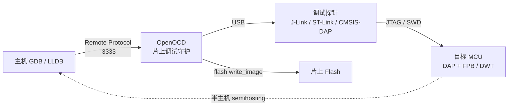

# 调试器原理与实战（17）· JTAG 与 OpenOCD 硬件调试

> [!abstract] TL;DR
> - **JTAG 是什么**：IEEE 1149.1 边界扫描标准，四线（TDI/TDO/TCK/TMS）串行协议，通过 TAP（测试访问端口）状态机访问芯片内部的调试寄存器和边界扫描单元，是片上调试（On-Chip Debug，OCD）的基础协议。
> - **SWD vs JTAG**：ARM Cortex-M 系列推广的 SWD（Serial Wire Debug）仅用两根线（SWDIO/SWCLK），功能等同 JTAG 的调试子集，在引脚紧缺的小封装 MCU 上几乎全面替代 JTAG。
> - **OpenOCD 的角色**：开源的片上调试守护进程，运行在主机上，与调试探针通信，向上为 GDB 提供 Remote Protocol（`:3333`），向下适配数十种探针和数百种目标芯片——是嵌入式调试链路的枢纽。
> - **硬件断点的稀缺性**：Cortex-M 的 FPB（Flash Patch and Breakpoint）单元通常只有 4–8 个硬件断点，DWT（Data Watchpoint and Trace）提供少量 watchpoint；超出限额时调试器必须回退到软件断点（向 Flash 写 `BKPT` 指令），这在某些场景有副作用。
> - **semihosting + SWO**：semihosting 让嵌入式程序的 `printf` 通过调试链路输出到主机终端，无需 UART 硬件；SWO/ITM 提供低开销的实时 trace 输出，是嵌入式"printk"的高效替代。

嵌入式系统调试与桌面软件调试的根本差异在于：目标程序运行在**没有操作系统支持的裸金属环境**，没有 ptrace、没有信号、没有进程隔离。调试器要进入目标，必须绕过软件层，直接通过**硬件调试接口**接管 CPU 的控制权。JTAG/SWD 就是这条硬件通道的协议规范，OpenOCD 是打通这条通道的开源软件栈。

---

## 概述与定位

### 为什么需要硬件调试接口

在裸机（Bare-Metal）环境中，不存在操作系统提供的调试基础设施：

- 无法使用 `ptrace`：没有进程上下文，没有内核监控机制。
- 无法修改代码段写软件断点：Flash 存储器通常不能随意写入单字节，且写操作需要擦除周期，耗时数十毫秒。
- 无法使用信号：MCU 上没有 POSIX 信号机制。
- 外设资源极为有限：可能没有 UART、没有显示器，"printf 调试"需要专门配置。

**片上调试（On-Chip Debug，OCD）** 是芯片厂商对这些需求的回应：在芯片内部集成一个专用的调试子系统（ARM 称之为 CoreSight，RISC-V 称之为 RISC-V Debug），并通过标准接口（JTAG 或 SWD）暴露给外部调试器。调试器通过这个接口可以：

1. 在任意时刻暂停 CPU 执行（halt）
2. 读/写所有通用寄存器和特殊寄存器
3. 读/写任意内存地址（包括 Flash、RAM、外设寄存器）
4. 设置/清除硬件断点和 watchpoint
5. 单步执行（step by step）
6. 复位芯片并在复位后立即 halt

### JTAG 协议的历史背景

JTAG 最初是为 **板级测试** 设计的：验证 PCB 上芯片引脚的连通性（边界扫描，Boundary Scan），不需要物理探针就能检测焊点虚焊。芯片厂商后来将这套低速串行接口重用为调试通道——毕竟引脚已经存在，复用成本极低。

IEEE 1149.1 标准定义了 JTAG 协议的基础；ARM 在此基础上扩展了 CoreSight 调试架构，利用 JTAG 的 TAP 状态机访问 DAP（Debug Access Port），再通过 DAP 访问 MEM-AP（Memory Access Port）和 JTAG-AP，从而实现对 CPU 寄存器和存储器的完整访问。

---

## 原理与机制



### JTAG 四线协议与 TAP 状态机

JTAG 接口的四根必需信号线：

| 信号 | 方向（从调试探针看）| 作用 |
|------|-------------------|------|
| **TCK**（Test Clock）| 输出 | 串行时钟，所有数据在时钟沿上采样/驱动 |
| **TMS**（Test Mode Select）| 输出 | 控制 TAP 状态机的跳转 |
| **TDI**（Test Data In）| 输出 | 向目标芯片串行发送数据（指令/数据） |
| **TDO**（Test Data Out）| 输入 | 从目标芯片串行接收数据 |
| TRST（Test Reset，可选）| 输出 | 异步复位 TAP 状态机，不强制要求 |

TAP 状态机（TAP State Machine）是 JTAG 的核心，它是一个 16 态的有限状态机，每个 TCK 上升沿采样一次 TMS，据此跳转状态。调试器通过精确控制 TMS 序列，引导 TAP 进入特定状态（如 Shift-IR 装入指令码，Shift-DR 传输数据），完成一次调试访问。

```
TAP 状态机主要路径（简化）：

Test-Logic-Reset
      │ (TMS=0)
      ▼
  Run-Test/Idle
   ┌──┤ (TMS=1)
   │  ▼
   │ Select-DR-Scan ──(TMS=1)──► Select-IR-Scan
   │      │(TMS=0)                    │(TMS=0)
   │      ▼                           ▼
   │  Capture-DR                 Capture-IR
   │      │(TMS=0)                    │(TMS=0)
   │      ▼                           ▼
   │   Shift-DR  ◄──(TMS=0, 循环)  Shift-IR  ◄──(TMS=0, 循环)
   │      │(TMS=1)                    │(TMS=1)
   │      ▼                           ▼
   │   Exit1-DR                   Exit1-IR
   │      │(TMS=0)                    │(TMS=0)
   │      ▼                           ▼
   │   Pause-DR                   Pause-IR
   │      │(TMS=1)                    │(TMS=1)
   │      ▼                           ▼
   │   Exit2-DR                   Exit2-IR
   │      │(TMS=1)                    │(TMS=1)
   │      ▼                           ▼
   │   Update-DR                  Update-IR
   └──────┘ (TMS=0, 回到 Idle)
```

ARM CoreSight 的 DAP（Debug Access Port）挂在 JTAG 链上，通过 JTAG 的 IR/DR 寄存器访问两类 AP：
- **MEM-AP**：提供对目标地址空间的读写访问（访问 RAM、Flash、外设寄存器、调试组件寄存器）
- **JTAG-AP / SWJ-DP**：提供对 CPU 调试寄存器的直接访问（读写通用寄存器、控制暂停/单步/恢复）

### SWD 协议：两线版 JTAG

ARM 为 Cortex-M 系列推出的 SWD（Serial Wire Debug）协议，将 JTAG 四线简化为两线：

| 信号 | 作用 |
|------|------|
| **SWDIO**（Serial Wire Data I/O）| 双向数据线，分时复用输入和输出 |
| **SWCLK**（Serial Wire Clock）| 时钟线 |

SWD 的协议层是一个基于包（packet）的请求-响应模型，每个包包含：地址、读/写方向、数据、奇偶校验。SWD 仍然访问同一个 DAP，功能与 JTAG 调试子集等同，但：

- **引脚更少**：Cortex-M0 最小系统通常只能引出 2 根调试线
- **速度更快**：SWD 协议开销更低，实际数据吞吐率更高（同等时钟下）
- **不支持 JTAG 的边界扫描**：SWD 纯调试用途，没有 JTAG 的 PCB 测试功能

许多 Cortex-M 芯片的引脚支持 **SWJ-DP**（Serial Wire / JTAG Debug Port）——同一组引脚，通过特定的切换序列可以在 JTAG 和 SWD 模式间切换，调试探针在上电时自动完成协商。

### ARM CoreSight 调试组件

Cortex-M 系列的调试子系统由多个 CoreSight 组件构成，这些组件都映射在 CPU 地址空间中（通常在 `0xE000_0000`–`0xE00F_FFFF` 的系统控制区域）：

```
CoreSight 组件布局（Cortex-M4 为例）：

0xE000EDF0  DCB（Debug Control Block）
              ├── DHCSR - 调试暂停/恢复/单步控制
              ├── DCRSR - 调试寄存器选择（选择读/写哪个 CPU 寄存器）
              ├── DCRDR - 调试寄存器数据（传输值）
              └── DEMCR - 调试事件控制和监控（使能 DebugMon、trace）

0xE0001000  DWT（Data Watchpoint and Trace）
              ├── CTRL  - 使能 cycle counter、exception trace
              ├── CYCCNT - 32 位 CPU 周期计数器
              ├── COMPn - watchpoint 比较地址（n=0..3）
              ├── MASKn - watchpoint 地址掩码
              └── FUNCTIONn - watchpoint 功能（读/写/读写，触发调试/DWT事件/PC采样）

0xE0002000  FPB（Flash Patch and Breakpoint）
              ├── CTRL  - 使能 FPB，显示断点数量（KEY 位解锁）
              ├── REMAP - Flash patch 重映射基地址
              └── COMPn - 断点/patch 比较地址（n=0..N-1）

0xE0000000  ITM（Instrumentation Trace Macrocell）
              └── PORT[0..31] - stimulus port，写入即输出 trace 数据

0xE00FE000  TPIU（Trace Port Interface Unit）
              └── 配置 trace 输出格式和引脚
```

**FPB 的两种模式**：
1. **断点模式（Breakpoint）**：将某个 Flash 地址（通常是代码地址）与 FPB 比较地址关联；CPU 取指时如果地址匹配，FPB 产生 breakpoint 异常，调试器接管。这是真正的**硬件断点**，不修改 Flash 内容。
2. **Flash patch 模式**：将某个 Flash 地址的取指重定向到 REMAP 指定的 SRAM 中的替代指令——可以在运行时"修改" Flash 内容而不实际擦写。

---

## 结构/算法/伪代码详解

### OpenOCD 架构

OpenOCD（Open On-Chip Debugger）是连接主机调试工具（GDB）与目标硬件的软件层：

```
主机侧                          目标侧
┌──────────────────────────────────────────────────────┐
│                       主机                            │
│                                                      │
│  GDB                                                 │
│   │ Remote Serial Protocol (RSP) over TCP :3333      │
│   ▼                                                  │
│  OpenOCD                                             │
│   ├── GDB server（RSP 协议解析）                      │
│   ├── Telnet server（TCL 命令行 :4444）               │
│   ├── Target 抽象层（cortex_m, riscv, mips, ...）    │
│   ├── Transport 层（jtag, swd, swd-only）            │
│   └── Interface/Adapter 驱动                         │
│         ├── ftdi（FT2232H/FT232H 芯片）              │
│         ├── hla（ST-Link, J-Link via HLA）           │
│         ├── jlink（J-Link 原生协议）                  │
│         ├── cmsis-dap（USB HID/WinUSB 协议）         │
│         └── remote-bitbang（通过 TCP/Unix socket）  │
└────────────────────────┬─────────────────────────────┘
                         │ USB / 网络
              ┌──────────▼──────────┐
              │      调试探针        │
              │  (J-Link / ST-Link  │
              │   / CMSIS-DAP / ...) │
              └──────────┬──────────┘
                         │ JTAG / SWD（4线或2线）
              ┌──────────▼──────────┐
              │     目标 MCU         │
              │  (STM32/nRF52/ESP32)│
              │  DAP → DCB/FPB/DWT  │
              └─────────────────────┘
```

### OpenOCD 配置文件体系

OpenOCD 启动时必须提供两类配置文件：

```tcl
# 启动 OpenOCD 的典型命令
openocd \
    -f interface/stlink.cfg \        # 探针 interface 配置
    -f target/stm32f4x.cfg           # 目标芯片配置

# 或者合并写到一个 .cfg 文件
openocd -f my_board.cfg
```

**interface 配置**（探针）：

```tcl
# interface/stlink.cfg（ST-Link 探针）
adapter driver hla
hla_layout stlink
hla_device_desc "ST-Link"
hla_vid_pid 0x0483 0x374b    # STLink/V2-1 的 USB VID/PID
```

```tcl
# interface/jlink.cfg（SEGGER J-Link）
adapter driver jlink
jlink_serial 12345678         # 可选：指定特定序列号的探针
```

```tcl
# interface/cmsis-dap.cfg（CMSIS-DAP 兼容探针，包括 DAPLink、Black Magic Probe 等）
adapter driver cmsis-dap
adapter speed 1000            # SWD/JTAG 时钟频率 1 MHz
```

**target 配置**（目标芯片）：

```tcl
# target/stm32f4x.cfg（节选关键部分）
set _CHIPNAME stm32f4x
set _ENDIAN little

# 创建 JTAG TAP（或 SWD DP）
if { [using_jtag] } {
    jtag newtap $_CHIPNAME cpu -irlen 4 -ircapture 0x1 -irmask 0xf \
        -expected-id 0x4ba00477
} else {
    swd newdap $_CHIPNAME cpu -irlen 4 -enable
}

# 创建 DAP 访问对象
dap create $_CHIPNAME.dap -chain-position $_CHIPNAME.cpu

# 创建 target 对象
target create $_CHIPNAME.cpu cortex_m -endian $_ENDIAN \
    -dap $_CHIPNAME.dap

# Flash 配置（STM32F4 内部 Flash）
flash bank $_CHIPNAME.flash stm32f2x 0 0 0 0 $_CHIPNAME.cpu

# 复位配置
reset_config srst_gates_jtag
adapter speed 2000
```

### GDB + OpenOCD 完整调试流程

```
┌─────────────────────── 调试链路流程 ──────────────────────┐
│                                                          │
│  1. openocd -f interface/stlink.cfg -f target/stm32f4x.cfg │
│     → OpenOCD 连接探针 → 连接目标 → 启动 GDB server(:3333) │
│                                                          │
│  2. arm-none-eabi-gdb firmware.elf                       │
│     (gdb) target remote :3333                            │
│     → GDB 通过 RSP 与 OpenOCD 建立连接                   │
│     → OpenOCD 通过探针读取目标当前状态                    │
│                                                          │
│  3. (gdb) monitor reset halt                             │
│     → GDB 发送 "monitor" 命令给 OpenOCD 的 TCL 引擎      │
│     → OpenOCD 触发目标芯片复位，在复位向量处 halt         │
│                                                          │
│  4. (gdb) load                                           │
│     → GDB 读取 ELF 文件中的 LOAD segment                 │
│     → 通过 RSP 的 'X' 命令传输数据给 OpenOCD             │
│     → OpenOCD 调用 flash bank 驱动，擦除+烧录 Flash       │
│                                                          │
│  5. (gdb) break main                                     │
│     → GDB 在 main 的地址设置断点                         │
│     → OpenOCD 判断：Flash 地址 → 用 FPB 硬件断点         │
│     → 写入 FPBn.COMPn = main_addr | 1（使能）            │
│                                                          │
│  6. (gdb) continue                                       │
│     → CPU 开始执行，取指到 main 时 FPB 触发断点异常      │
│     → CPU 进入 DebugMon 或 Halt 状态                     │
│     → OpenOCD 读取 DHCSR.S_HALT 位，通知 GDB             │
│                                                          │
│  7. (gdb) print my_var                                   │
│     → GDB 从 DWARF 解析 my_var 的地址                    │
│     → OpenOCD 通过 MEM-AP 读取对应内存                   │
│     → 返回值显示给用户                                    │
└──────────────────────────────────────────────────────────┘
```

### Flash 烧录流程详解

OpenOCD 的 Flash 烧录通过 Flash driver 实现，不同厂商 Flash 有不同的驱动（`stm32f2x`、`nrf51`、`esp32`、`at91samd` 等），但流程结构一致：

```
Flash 烧录伪代码：

procedure flash_write(base_addr, data, length):
    1. 检查目标 halt 状态（必须 halt 才能烧录）
    2. 上传 Flash loader（一段小程序）到目标 RAM
       - loader 是编译好的二进制，知道如何操作该 Flash 控制器
       - 通过 MEM-AP 写入 SRAM
    3. 计算需要擦除的扇区范围
    4. for each sector in sectors_to_erase:
         a. 通过 MEM-AP 写入擦除命令到 Flash 控制器寄存器
         b. 等待 FLASH_SR.BSY 位清零（轮询或 DWT 超时）
         c. 验证擦除结果（全 0xFF）
    5. 分块传输数据：
         for chunk in chunks(data, chunk_size):
             a. 将 chunk 写入 SRAM 的 write buffer
             b. 设置 loader 的参数（源地址、目标地址、长度）
             c. 启动 loader（设置 PC = loader_entry，恢复 CPU 执行）
             d. 等待 loader 完成（轮询约定的完成标志地址）
             e. 验证写入的数据（可选，`verify_image`）
    6. 校验 CRC/hash（可选，`verify_image` 命令）
```

### 硬件断点资源管理

Cortex-M 的 FPB 断点资源极为有限。OpenOCD 和 GDB 协同管理这些有限资源：

```
FPB 资源表（以 Cortex-M4 为例）：
- FPB_CTRL.NUM_CODE  : 6（6 个代码断点比较器，用于硬件断点）
- FPB_CTRL.NUM_LIT   : 2（2 个字面量比较器，用于 Flash Patch）
- DWT_CTRL.NUMCOMP   : 4（4 个 watchpoint 比较器）

断点分配策略：
┌───────────────────────────────────────────────┐
│ 用户请求 N 个断点                              │
│                                               │
│ if N ≤ FPB.NUM_CODE:                          │
│     全部用 FPB 硬件断点（不修改 Flash）        │
│ else:                                         │
│     前 NUM_CODE 个用 FPB                      │
│     剩余的用软件断点：                         │
│       - RAM 中的代码：写 BKPT 0xAB 指令(2字节) │
│       - Flash 中的代码：WARNING! 需要擦写      │
│         某些 Flash 不支持单次写（需整扇区擦）  │
│         且写入次数有限（10K~100K 次）          │
└───────────────────────────────────────────────┘
```

> [!warning] Flash 软件断点的副作用
> 当 Flash 中的代码需要软件断点时，调试器必须：1）擦除整个扇区，2）烧录修改后的页面（含 BKPT 指令），3）调试结束后再次擦除并恢复原始内容。这不仅耗时，还消耗 Flash 写入寿命，对于寿命敏感（如 NOR Flash 10K 次擦除）的应用需特别注意。

---

## 工具视角与实战

### 调试探针选型

| 探针 | 协议支持 | 目标适用 | 特点 |
|------|---------|---------|------|
| **SEGGER J-Link** | JTAG + SWD | 几乎所有 ARM/RISC-V/Renesas | 速度最快（支持无限速），商业授权；EDU 版免费用于非商业 |
| **ST-Link V2/V3** | SWD (+ JTAG on V3) | STM32、STM8 | 低成本（ST官方板载），速度一般，通用性有限 |
| **CMSIS-DAP / DAPLink** | JTAG + SWD | ARM Cortex-M/A | 开放标准，无需厂商驱动，支持 USB 拖拽烧录 |
| **Black Magic Probe** | JTAG + SWD | ARM Cortex-M/A | 探针内置 GDB server，无需 OpenOCD！直接 `target extended-remote /dev/ttyACM0` |
| **FT2232H / FT4232H** | JTAG + SWD（bitbang） | 通用 | FTDI USB-UART/FIFO 芯片改装，灵活但速度慢；常用于低成本开发板 |

### 基础操作命令速查

**OpenOCD telnet 接口（:4444）**：

```tcl
# 连接后可以直接执行 TCL/OpenOCD 命令
$ telnet localhost 4444

# 复位与暂停
reset halt             # 触发复位并立即 halt（在复位向量处停住）
reset run              # 触发复位后让程序运行
halt                   # 暂停当前执行
resume                 # 从当前 PC 恢复执行
resume 0x08000100      # 从指定地址恢复执行

# 寄存器操作
reg                    # 显示所有寄存器
reg pc                 # 读取 PC 寄存器
reg r0 0xdeadbeef      # 写入 r0

# 内存读写
mdw 0x20000000 16      # 从地址 0x20000000 读 16 个 32 位字（mdw=memory display word）
mww 0x20000000 0x1234  # 向地址 0x20000000 写 32 位值
mdb 0x20000000 32      # 读 32 个字节（mdb=memory display byte）

# Flash 操作
flash banks            # 列出所有配置的 Flash bank
flash info 0           # 显示 bank 0 的详细信息（扇区列表、大小）
flash erase_sector 0 0 0     # 擦除 bank 0 的扇区 0~0
flash write_image erase firmware.bin 0x08000000  # 擦除并烧录
program firmware.hex verify reset  # 烧录 HEX 文件、校验、然后复位运行
```

**GDB 调试常用命令**：

```bash
# 连接到 OpenOCD（target remote 或 extended-remote）
(gdb) target extended-remote :3333

# 加载固件（烧录到 Flash）
(gdb) load
# Loading section .text, size 0x4abc lma 0x8000000
# Loading section .data, size 0x1c0 lma 0x8004abc
# Start address 0x080006d8, load size 19324
# Transfer rate: 4 KB/sec, 2415 bytes/write.

# 通过 GDB 向 OpenOCD 发送 TCL 命令
(gdb) monitor reset halt
(gdb) monitor adapter speed 4000    # 将 SWD/JTAG 速度提高到 4 MHz

# 断点与单步（与普通 GDB 完全相同）
(gdb) break main
(gdb) continue
(gdb) next
(gdb) step
(gdb) finish

# 内存检查（嵌入式常用）
(gdb) x/16xw 0x20000000    # 以 hex word 格式显示 16 个字
(gdb) info registers        # 显示所有 ARM 寄存器

# 硬件 watchpoint（消耗 DWT 比较器资源）
(gdb) watch my_global_var   # 写 watchpoint
(gdb) rwatch my_var         # 读 watchpoint
(gdb) awatch my_var         # 读写 watchpoint
```

### semihosting：嵌入式 printf 通道

semihosting 是 ARM 定义的一种机制，让目标程序的标准 I/O 调用（`printf`、`fopen`、`fread` 等）通过调试接口转发到主机执行：

```c
// 目标程序中：正常使用 printf
#include <stdio.h>
int main(void) {
    printf("Hello from MCU! tick=%u\n", SysTick->VAL);
    // 这条 printf 会在主机的 OpenOCD 终端输出
    return 0;
}
```

实现原理：目标程序执行 `BKPT 0xAB` 指令（ARM semihosting 约定的断点值），CPU 进入 debug halt，OpenOCD 检测到这是 semihosting 请求（通过 `r0` 中的操作码），在主机端执行对应的 I/O 操作（写到 stdout、读取输入文件等），然后向目标程序注入返回值并恢复执行。

```tcl
# OpenOCD 中启用 semihosting
arm semihosting enable         # 全局启用
arm semihosting_fileio enable  # 启用文件 I/O（open/read/write/close）
arm semihosting_cmdline argv0 arg1 arg2  # 模拟 argc/argv
```

### SWO/ITM trace：非侵入式实时输出

semihosting 每次 printf 都需要暂停 CPU，吞吐率低、侵入性强。对于高频率的调试输出，ARM 提供了 ITM（Instrumentation Trace Macrocell）+ SWO（Serial Wire Output）方案：

- **ITM**：CPU 内部的 trace 单元，程序向 ITM stimulus port 寄存器写入数据，数据进入 trace 管道，CPU 继续执行（几乎零开销）
- **SWO**：从 MCU 引出的单线 trace 输出信号（UART 格式或 Manchester 编码），探针捕获后传到主机

```c
// ITM_SendChar：向 ITM port 0 写入一个字节（低开销 trace）
// 通常通过 retargeting 接管 _write() 系统调用
int32_t ITM_SendChar(uint32_t ch) {
    // 等待 ITM stimulus port 就绪
    while (ITM->PORT[0].u32 == 0);
    ITM->PORT[0].u8 = (uint8_t)ch;  // 写入数据，触发 trace 输出
    return (int32_t)ch;
}
```

```tcl
# OpenOCD 启用 SWO trace（需要探针和目标都支持）
tpiu config internal swo.log uart false 168000000  # 168 MHz CPU，内部文件捕获
itm port 0 on                                       # 使能 ITM port 0
```

---

## 安全性与正确使用

### 调试接口暴露的安全风险

JTAG/SWD 接口拥有对芯片的完全控制权，在产品设计阶段必须认真考虑其安全影响：

**风险一：固件提取**
攻击者通过物理接入 JTAG/SWD 引脚，可以读取整个 Flash 内容，提取固件进行逆向分析。

**风险二：安全启动绕过**
通过 JTAG 暂停 CPU，修改内存中的安全检查标志，然后恢复执行，可以绕过软件层的安全验证。

**防护措施**：

```
产品安全配置（以 STM32 为例）：

1. 读保护（RDP - Read Protection）
   RDP 级别 0：无保护（出厂默认）
   RDP 级别 1：禁止通过调试器读取 Flash，但仍可 halt/step
   RDP 级别 2：完全锁定（不可逆！），JTAG/SWD 完全失效
   
   设置方法：
   (gdb) monitor stm32f4x unlock 0    # 危险操作，会触发全片擦除
   // 或通过 Option Bytes 编程

2. 限制 JTAG 引脚（重映射为 GPIO）
   // 不需要调试时，将 PA13/PA14（SWDIO/SWCLK）重映射为普通 GPIO
   // 使攻击者无法通过正常引脚接入
   
3. 选项字节中的 nBOOT0 / BOOT0 配置
   // 防止通过 BOOT0 引脚进入 DFU 模式绕过用户 Flash
```

### 生产环境调试接口管理

```
开发阶段  ──► JTAG/SWD 完全开启，全速调试
     │
     ▼
测试阶段  ──► 部分启用（如开启 semihosting 输出日志，关闭写保护）
     │
     ▼
量产阶段  ──► 关闭调试访问（RDP1 或 RDP2），重映射 JTAG 引脚，
             写保护关键 Flash 扇区，熔断 JTAG 熔丝（One-Time Programmable）
```

### Flash 断点的陷阱与最佳实践

当硬件断点（FPB）耗尽后，调试器会自动退化到软件断点：向 Flash 中写 `BKPT 0xBE` 指令（Cortex-M 的 16 位 Thumb 断点指令）。这在以下情况会导致问题：

1. **Boot ROM / 只读 Flash**：某些区域不允许调试写入，尝试写软件断点会失败
2. **XIP Flash（外挂 QSPI Flash）**：外挂 Flash 烧录需要特殊 Flash 驱动，OpenOCD 可能未配置
3. **闪存寿命**：每次设置和清除软件断点都消耗一次写周期
4. **代码运行在 RAM 中**：RAM 中的软件断点不消耗 Flash 寿命，是可接受的

最佳实践：
```
- 将最常设断点的代码链接到 SRAM（--section-start .hotcode=0x20000000）
- 使用 J-Link 等支持 Flash 断点优化的探针（内部缓存避免每次擦写）
- Keil MDK 的 Flash 断点：探针侧缓存整个扇区，软件断点只触发一次擦写
- 如只调试 RAM 中的代码（bootloader 下载到 RAM 执行），断点数量不受 FPB 限制
```

### OpenOCD 配置常见问题排查

```bash
# 问题 1：探针未找到
Error: no device found
# 排查：检查 USB 连接；Linux 下需要 udev 规则
# /etc/udev/rules.d/99-openocd.rules:
# SUBSYSTEM=="usb", ATTR{idVendor}=="0483", ATTR{idProduct}=="374b", MODE="0666"

# 问题 2：目标未响应
Error: JTAG scan chain interrogation failed: all zeros
# 排查：检查信号线连接（TDI/TDO/TCK/TMS 是否颠倒）
#       检查目标供电（JTAG 需要目标有电）
#       尝试降低时钟速度：adapter speed 500

# 问题 3：Flash 烧录失败
Error: flash sector 0 is protected
# 排查：芯片处于写保护状态，需先解除保护
# 注意：某些保护级别解除时会触发全片擦除！
(gdb) monitor stm32f4x options_load 0   # 小心使用

# 问题 4：semihosting 输出乱码
# 排查：确认使用的是 ARM Cortex-M（semihosting 是 ARM 标准，非 RISC-V 通用）
#       检查链接脚本是否正确链接 semihosting 库（--specs=rdimon.specs）
```

---

## 小结

1. **JTAG/SWD 是硬件调试的入口**：通过片上 DAP（Debug Access Port）提供对 CPU 寄存器、内存、Flash 的完整访问，是没有操作系统支持时唯一可行的调试通道；SWD 用两根线替代 JTAG 四根线，是 ARM Cortex-M 的事实标准。
2. **TAP 状态机是协议核心**：16 态 FSM 由 TMS 序列驱动，通过 Shift-IR 装载指令、Shift-DR 传输数据，所有对 DAP 的访问都通过这个状态机路由。
3. **OpenOCD 是枢纽软件**：向上实现 GDB Remote Protocol（:3333）、telnet TCL 接口（:4444），向下适配数十种探针驱动和数百种目标 Flash 驱动，是开源嵌入式调试链路的核心。
4. **硬件断点资源极为有限**：FPB 通常只有 4–8 个断点槽，DWT 提供少量 watchpoint；超出后退化到软件断点（写 Flash 有寿命和速度代价，写 RAM 无副作用），生产实践中应提前规划。
5. **semihosting 和 ITM/SWO 是嵌入式 I/O 的两条路**：semihosting 每次 printf 需 halt CPU（开销大但用起来像正常 printf）；ITM/SWO 是硬件 trace 管道，几乎零开销，是量产日志采集的首选。
6. **调试接口是安全边界**：JTAG/SWD 访问权等于物理内存访问权；产品量产前必须根据安全需求配置读保护级别，防止固件提取和安全绕过。

---

## 相关阅读

- **前篇（rr 时间旅行调试）**：[[16.rr时间旅行调试]]
- **硬件断点原理（与 FPB 对应的软件调试断点）**：[[03.断点实现原理]]
- **调试接口底层（ptrace 在 Linux 侧的类比）**：[[02.ptrace与调试接口]]
- **后篇（崩溃转储分析）**：[[18.崩溃转储分析]]
- **系列总览**：[[00.调试器原理与实战总览]]

---

⬅️ 上一篇 [[16.rr时间旅行调试]] ｜ 🏠 [[00.调试器原理与实战总览]] ｜ 下一篇 [[18.崩溃转储分析]] ➡️
