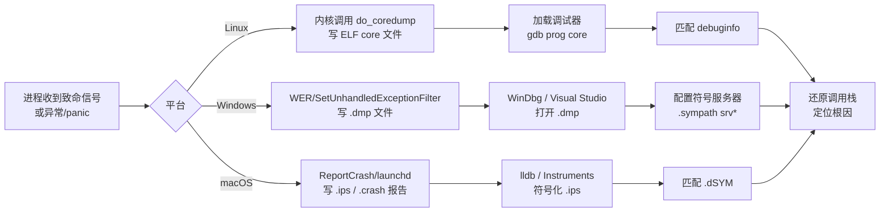

# 调试器原理与实战（18）· 崩溃转储分析（coredump/minidump/panic）

> [!abstract] TL;DR
> - **崩溃转储是快照**：进程（或内核）崩溃的瞬间，操作系统把内存、寄存器、线程状态序列化到磁盘——这张快照就是事后还原现场的唯一原始证据。
> - **三平台三格式**：Linux 用 ELF coredump（内含 `NT_PRSTATUS`/`NT_FILE` 等 note 段）；Windows 用 Minidump/Full dump（`.dmp`，PE-like 结构）；macOS 用 `.ips`/`.crash` 崩溃报告（JSON-ish，需配合 KDK dSYM 符号化）。
> - **工作流固定**：加载 dump → 匹配符号（`debuginfo`/PDB/dSYM）→ 读寄存器/调用栈 → 定位根因。符号错位，一切白搭。
> - **核心命令对照**：Linux `gdb prog core` + `bt`；Windows `windbg !analyze -v` + `.ecxr`；macOS `lldb` attach dump + `atos` 符号化栈帧。
> - **堆/锁状态也可读**：dump 保留堆头、arena 链、互斥量状态，配合 `!heap`（WinDbg）或 gdb `heap` 扩展可在事后诊断堆损坏与死锁。

---

## 概述与定位

### 崩溃转储解决什么问题

生产环境里的崩溃几乎不可能在调试器附加时复现——用户遇到崩溃，进程已消失，你只剩一份日志和一个返回码。**崩溃转储（crash dump）把"进程死亡时刻的内存快照"持久化到磁盘**，让工程师在离线、异机、甚至数月后重建崩溃现场：恢复调用栈、读取局部变量、检查堆状态。

与实时调试的关系：

| 维度 | 实时调试 | 崩溃转储分析 |
|------|---------|------------|
| 时机 | 进程运行中 | 进程已死亡，事后 |
| 交互性 | 可单步、修改内存 | 只读快照，无法执行 |
| 完整性 | 100% 内存可访问 | 取决于 dump 类型（mini/full） |
| 适用场景 | 开发期、可复现 bug | 生产崩溃、偶发 bug、客户现场 |

崩溃转储分析是 **事后取证（post-mortem debugging）**，是生产稳定性体系的核心环节。

### 三平台的产生路径



---

## 原理与机制

### Linux coredump 的产生机制

Linux 内核在进程收到 `SIGSEGV`、`SIGABRT`、`SIGBUS`、`SIGFPE`、`SIGILL` 等"核心转储信号"（`SA_CORE` 动作）时，调用 `do_coredump()`（`fs/coredump.c`），把进程的内存段、寄存器状态、信号信息序列化为 **ELF 格式**的 core 文件。

关键控制点：

1. **`ulimit -c`**：控制 core 文件的最大字节数。`ulimit -c 0` 禁用（默认），`ulimit -c unlimited` 不限大小。需要在进程启动前设置（通常写进 systemd unit 的 `LimitCORE=infinity`）。

2. **`/proc/sys/kernel/core_pattern`**：控制 core 文件的命名与路径。
   ```text
   # 默认
   core
   # 推荐：含 PID、程序名、时间戳，写到 /var/core/
   /var/core/core.%e.%p.%t
   # 管道到外部程序（systemd-coredump 的做法）
   |/usr/lib/systemd/systemd-coredump %P %u %g %s %t %c %h
   ```
   `%e`=可执行文件名，`%p`=PID，`%t`=Unix 时间，`%s`=信号编号。**当 core_pattern 以 `|` 开头时，内核把 core 数据通过 pipe 传给外部程序**，不直接写文件。

3. **`/proc/sys/kernel/core_uses_pid`**：为 1 时在文件名末尾追加 PID（已被 `%p` 格式化字符串替代，通常保持 0）。

4. **`/proc/sys/kernel/coredump_filter`**：按 bit 控制哪些内存映射写入 core（私有匿名映射、共享匿名映射、私有文件映射、共享文件映射、ELF 头、hugetlb、DAX 映射）。默认 `0x33`=匿名+ELF。

### systemd-coredump 与 coredumpctl

现代 Linux 发行版（Fedora/RHEL/Debian/Arch 等）默认通过 **systemd-coredump** 接管 core 文件：内核通过 pipe 把 core 数据发给 `systemd-coredump`，后者压缩存储到 `/var/lib/systemd/coredump/`，并记录元数据（PID、UID、信号、时间、可执行文件路径）到 journald。

```bash
# 列出所有已捕获的 core
coredumpctl list

# 查看某次崩溃详情（含进程信息、信号、堆栈）
coredumpctl info PID
coredumpctl info -1          # 最近一次

# 用 gdb 分析最近一次
coredumpctl gdb -1
coredumpctl gdb PID          # 指定 PID

# 导出 core 文件到当前目录（给其他工具用）
coredumpctl dump -1 -o /tmp/myapp.core
```

### ELF core 文件的内部结构

Linux coredump 是合法的 ELF 文件（`e_type = ET_CORE`），但它不包含 `.text`/`.data` 这样的 section，而是用 **PT_LOAD 段**承载内存内容、用 **PT_NOTE 段**承载元数据。

PT_NOTE 段包含一组 **note**，每个 note 格式为：
```c
struct elf_note {
    uint32_t namesz;   /* name 字符串长度（含 \0）*/
    uint32_t descsz;   /* desc 数据字节数 */
    uint32_t type;     /* note 类型 */
    char     name[];   /* "CORE" 或 "LINUX" 等 */
    char     desc[];   /* 实际数据，按 4 字节对齐 */
};
```

关键 note 类型（`name="CORE"`）：

| 类型常量 | 十六进制 | 内容 |
|---------|---------|------|
| `NT_PRSTATUS` | 0x1 | **每个线程一个**，含 `siginfo`（信号编号/原因）、通用寄存器快照（`struct user_regs_struct`）、线程 PID/PPID |
| `NT_PRPSINFO` | 0x3 | 进程摘要：可执行文件名（截断至 16 字符）、命令行参数（前 80 字节）、UID/GID、状态 |
| `NT_SIGINFO` | 0x53494749 | `siginfo_t` 完整结构（比 NT_PRSTATUS 里的更完整） |
| `NT_FILE` | 0x46494c45 | **文件映射表**：每个内存映射对应的文件路径+offset，调试器用它找 DSO |
| `NT_FPREGSET` | 0x2 | 浮点寄存器快照 |
| `NT_X86_XSTATE` | 0x202 | AVX/AVX-512 等扩展状态（XSAVE 区域） |

`NT_FILE` 是现代 GDB 恢复共享库符号的关键：它记录了每个内存映射（[start, end)）对应磁盘上哪个文件的哪个 offset，GDB 据此找到每个 `.so` 并加载其 DWARF。

### Windows Minidump 的产生机制

Windows 的崩溃转储生成有两条路径：

**路径 1：Windows 错误报告（WER）**  
进程异常未处理时，`kernel32!UnhandledExceptionFilter` 最终调用 WER，生成 `.wer` 报告并可选生成 minidump，存放于 `%LOCALAPPDATA%\CrashDumps\`。通过注册表 `HKLM\SOFTWARE\Microsoft\Windows\Windows Error Reporting\LocalDumps` 可配置 dump 类型和路径。

**路径 2：程序内嵌 MiniDumpWriteDump**  
应用程序在自己的异常处理器里调用 `dbghelp!MiniDumpWriteDump(hProcess, pid, hFile, dumpType, ...)` 主动写 dump，可精确控制内容：
```c
MiniDumpWriteDump(
    GetCurrentProcess(),
    GetCurrentProcessId(),
    hDumpFile,
    MiniDumpWithFullMemory |       // full dump
    MiniDumpWithHandleData |       // 句柄表
    MiniDumpWithThreadInfo,        // 线程详情
    &exceptionInfo,
    NULL, NULL
);
```

**Dump 类型**（`MINIDUMP_TYPE` 枚举关键值）：

| 类型 | 内容 | 大小 |
|------|------|------|
| `MiniDumpNormal` | 线程栈、模块列表 | 极小（几百 KB） |
| `MiniDumpWithPrivateReadWriteMemory` | 栈+堆 | 中（几十 MB） |
| `MiniDumpWithFullMemory` | 全部用户态内存 | 大（等于进程 RSS） |
| `MiniDumpWithHandleData` | 句柄表（文件、互斥量等） | +少量 |

`.dmp` 文件内部是 **MINIDUMP_HEADER + MINIDUMP_DIRECTORY + Stream 数组**，每个 Stream 有类型（`ThreadListStream`、`ModuleListStream`、`ExceptionStream`、`MemoryListStream` 等），WinDbg 按需解析各 Stream。

### macOS 崩溃报告机制

macOS 使用 **ReportCrash**（launchd 管理的 XPC 服务）监控进程异常，崩溃时生成 `.ips`（iOS Problem Syntax，JSON 超集）或旧格式 `.crash`（纯文本）报告，存放于：
- 用户崩溃：`~/Library/Logs/DiagnosticReports/`
- 系统进程崩溃：`/Library/Logs/DiagnosticReports/`
- iOS 设备（通过 Xcode）：`Window > Devices and Simulators > View Device Logs`

`.ips` 文件内含：
- 进程信息（名称、PID、父 PID、Bundle ID、版本）
- 异常类型（`EXC_BAD_ACCESS`/`SIGABRT` 等）
- 虚拟地址异常信息（`EXC_BAD_ACCESS` 时的访问地址）
- 二进制镜像表（每个动态库的 UUID + 加载地址范围）
- 各线程的**未符号化**调用栈（原始地址偏移）

未符号化的栈看起来：
```
Thread 0 Crashed:
0   libsystem_kernel.dylib   0x00007ff80001a6be __pthread_kill + 10
1   libsystem_pthread.dylib  0x00007ff8000a9e20 pthread_kill + 263
2   MyApp                    0x0000000100003a7c 0x100000000 + 15004
```
地址 `0x0000000100003a7c` 需要配合 dSYM 才能变成 `MyClass::crashMethod() at MyClass.mm:42`。

---

## 结构/算法/伪代码详解

### gdb 分析 Linux coredump 的完整流程

```bash
# 1. 确保 core 文件存在且完整
file /var/core/myapp.core.1234
# 输出：ELF 64-bit LSB core file, x86-64, ...

# 2. 加载（prog 必须与 core 版本匹配，否则符号错位）
gdb /path/to/myapp /var/core/myapp.core.1234

# 3. GDB 内部：读 NT_PRPSINFO 获得进程名，
#    读 NT_FILE 获得 .so 映射，从系统路径加载 DWARF

# 4. 查看崩溃线程的调用栈
(gdb) bt
#0  0x00007f3a4b2c1a2b in raise () from /lib/x86_64-linux-gnu/libc.so.6
#1  0x00007f3a4b2a94e5 in abort () from /lib/x86_64-linux-gnu/libc.so.6
#2  0x0000000000401987 in MyClass::process (this=0x0) at myclass.cpp:42

# 5. 所有线程的调用栈（排查多线程崩溃）
(gdb) thread apply all bt

# 6. 查看崩溃帧的局部变量
(gdb) frame 2
(gdb) info locals
(gdb) print *this         # this=0x0 → 空指针解引用

# 7. 查看寄存器（来自 NT_PRSTATUS）
(gdb) info registers
(gdb) info registers rip rsp rbp

# 8. 查看信号信息
(gdb) info signal
(gdb) print $_siginfo     # GDB 内置变量，展开 siginfo_t

# 9. 跨线程检查（死锁 / 数据竞争）
(gdb) info threads
(gdb) thread 3
(gdb) bt
```

### 解析 NT_PRSTATUS 寄存器快照（伪代码）

```text
// NT_PRSTATUS desc 结构（x86-64，glibc elf/core.h）
struct elf_prstatus {
    struct elf_siginfo pr_info;   // 信号编号+代码+errno
    short  pr_cursig;             // 当前信号
    ulong  pr_sigpend;            // 待处理信号集
    ulong  pr_sighold;            // 阻塞信号集
    pid_t  pr_pid, pr_ppid, pr_pgrp, pr_sid;
    struct timeval pr_utime, pr_stime, pr_cutime, pr_cstime;
    elf_gregset_t pr_reg;         // 通用寄存器数组（user_regs_struct）
    int    pr_fpvalid;            // 浮点寄存器是否有效
};

// user_regs_struct（x86-64）中寄存器顺序
// [r15, r14, r13, r12, rbp, rbx, r11, r10,
//  r9, r8, rax, rcx, rdx, rsi, rdi,
//  orig_rax, rip, cs, eflags, rsp, ss,
//  fs_base, gs_base, ds, es, fs, gs]

// GDB 读流程（伪码）
for each PT_NOTE_segment in core.ELF:
    for each note in segment:
        if note.type == NT_PRSTATUS and note.name == "CORE":
            prstatus = parse(note.desc)
            register_snapshot[prstatus.pr_pid] = prstatus.pr_reg
            signal_info[prstatus.pr_pid] = prstatus.pr_info
        if note.type == NT_FILE and note.name == "CORE":
            mappings = parse_nt_file(note.desc)
            // 每条记录：[start, end, file_offset, filename]
            for m in mappings:
                load_dso_debuginfo(m.filename, m.start)
```

### WinDbg 分析 minidump

```windbg
; 1. 打开 dump（命令行或 File > Open Crash Dump）
windbg -z C:\CrashDumps\myapp.dmp

; 2. 配置符号服务器（关键！不配置 !analyze 无意义）
.sympath srv*C:\Symbols*https://msdl.microsoft.com/download/symbols
.sympath+ C:\MyAppSymbols    ; 追加本地私有符号路径
.reload                      ; 重新加载所有模块符号

; 3. 自动根因分析（最常用的起点）
!analyze -v
; 输出：异常类型、崩溃地址、模块、调用栈、可能根因

; 4. 切换到异常上下文（!analyze 已做，显式控制时用）
.ecxr                        ; 设置寄存器上下文为异常记录
k                            ; 查看当前上下文调用栈
kp                           ; 带参数的调用栈

; 5. 查看所有线程
~* k                         ; 所有线程的调用栈
~0 s                         ; 切换到线程 0

; 6. 堆分析（检查堆损坏、泄漏、Use-After-Free）
!heap -s                     ; 摘要：所有堆段
!heap -p -a <address>        ; 某地址所属堆块详情
!heap -x <address>           ; 找包含此地址的堆块

; 7. 句柄与锁分析（需 MiniDumpWithHandleData）
!locks                       ; 死锁检测
!handle                      ; 句柄表
!cs -l                       ; Critical Section 列表

; 8. 漏洞可利用性评估
!exploitable                 ; 需安装 MSEC 扩展
; 输出：EXPLOITABLE / PROBABLY_EXPLOITABLE / PROBABLY_NOT_EXPLOITABLE / UNKNOWN
```

#### .ecxr 的原理

WinDbg 打开 dump 时，默认寄存器上下文是**进程保存的最后上下文**（不一定是崩溃帧）。`.ecxr` 命令从 `ExceptionStream` 里读取 `EXCEPTION_RECORD` + `CONTEXT` 结构，把寄存器上下文切换到**异常发生那一刻**——这才是真正的崩溃现场：

```c
// MINIDUMP_EXCEPTION_STREAM（ExceptionStream 中）
typedef struct {
    ULONG32 ThreadId;
    ULONG32 __alignment;
    MINIDUMP_EXCEPTION ExceptionRecord;   // EXCEPTION_RECORD 快照
    MINIDUMP_LOCATION_DESCRIPTOR ThreadContext; // CONTEXT 结构位置
} MINIDUMP_EXCEPTION_STREAM;
```

### macOS 崩溃报告符号化

**工具 1：atos（address-to-symbol）**

`atos` 把二进制加载地址 + 偏移转换为符号：

```bash
# 语法：atos -arch <arch> -o <dSYM或二进制> -l <加载基址> <崩溃地址>...
atos -arch x86_64 \
     -o MyApp.app.dSYM/Contents/Resources/DWARF/MyApp \
     -l 0x100000000 \
     0x0000000100003a7c 0x0000000100004b10

# 输出：
# MyClass::crashMethod() (MyClass.mm:42)
# MyApp::runLoop() (main.mm:127)
```

**工具 2：symbolicatecrash**

苹果提供的脚本，批量符号化整个 `.crash` 报告：
```bash
# 需要 DEVELOPER_DIR 环境变量
export DEVELOPER_DIR=$(xcode-select -p)
/usr/bin/symbolicatecrash MyApp_2026-07-02.crash MyApp.app.dSYM > symbolicated.crash
```
`symbolicatecrash` 内部对每个栈帧调用 `atos`，并利用 `.ips` 里的 `uuid` 字段匹配 dSYM（**UUID 必须完全一致**，否则跳过该帧）。

**工具 3：lldb 直接加载**

```bash
lldb MyApp.app.dSYM/Contents/Resources/DWARF/MyApp
(lldb) image load --file MyApp --slide 0  # ASLR slide=0 时
(lldb) image lookup --address 0x0000000100003a7c
# Address: MyApp[0x0000000100003a7c] (MyApp.__TEXT.__text + 15004)
# Summary: MyClass::crashMethod() at MyClass.mm:42
```

### 从 dump 提取堆状态——三平台对比

**Linux（gdb + heap 扩展 / gef / pwndbg）**

```gdb
# 使用 gef 插件
(gdb) heap bins        # fastbin / tcache / smallbin / largebin
(gdb) heap chunks      # 所有堆块，含 size/prev_size/inuse bit
(gdb) heap arenas      # glibc malloc arena 链
```

标准 gdb 无内建 heap 命令，但 `malloc_info` 函数地址有时可在 core 里调用（需要实时调试）。对 core 文件，通常直接读 `mp_` 全局（`main_arena` 指针）手动遍历 chunk 链表：
```gdb
(gdb) p main_arena
(gdb) p main_arena->bins[0]   # smallbin 0
```

**Windows（WinDbg !heap）**

```windbg
!heap -s                      ; 所有段摘要
!heap -a 0x00C80000           ; 堆 0x00C80000 的全部 chunk
!heap -p -a 0x00C81234        ; 地址 0x00C81234 所属 chunk 详情
!heap -l                      ; 泄漏检测（需 full dump）
```

**macOS（lldb + malloc 扩展）**

```lldb
(lldb) command script import lldb.macosx.heap
(lldb) malloc_info --stack 0x600003a1c060   # 某地址的分配调用栈
(lldb) ptr_refs 0x600003a1c060              # 谁持有此指针
```

---

## 工具视角与实战

### 实战：Linux coredump 诊断空指针解引用

**场景**：生产服务器上的 C++ 守护进程在高负载下偶发 `SIGSEGV`，core 文件由 systemd-coredump 捕获。

```bash
# 1. 确认有 core
coredumpctl list
# Wed 2026-07-02 03:21:07 UTC  myserver  11  SIGSEGV

# 2. 快速查看摘要（无需 gdb）
coredumpctl info -1
# Signal: 11 (SEGV)
# Reason: Memory not mapped
# Address: 0x0000000000000018

# 3. 进 gdb
coredumpctl gdb -1

# 4. 立即 bt
(gdb) bt
#0  0x000000000040a1b3 in RequestHandler::handle (this=0x7f8c40002680,
#       req=0x0) at handler.cpp:88

# 5. 检查 req
(gdb) frame 0
(gdb) p req
$1 = (Request *) 0x0
(gdb) l handler.cpp:88
# 88: req->parse_headers();  ← req 是空指针

# 6. 查 handle 的调用者
(gdb) frame 1
(gdb) info locals
# ...找到 req 从哪里来
```

偏移 `0x18`（24 字节）通常对应结构体某个字段——结合 `offsetof` 计算，可精确定位是哪个字段被写。

### 实战：WinDbg 诊断 Access Violation

```windbg
0:000> !analyze -v
EXCEPTION_RECORD: ffffffffffffffff -- (.exr 0xffffffffffffffff)
ExceptionAddress: 00007ff600413b2a (MyApp!CWorker::ProcessItem+0x0000000000000132)
ExceptionCode: c0000005 (Access violation)
ExceptionFlags: 00000000
Faulting Read Address: 0000000000000000

STACK_TEXT:
Child-SP   RetAddr       Call Site
...
MyApp!CWorker::ProcessItem+0x132  [worker.cpp @ 201]
MyApp!CThreadPool::RunWorker+0x4a [threadpool.cpp @ 88]
...

FAULTING_IP:
MyApp!CWorker::ProcessItem+132:
00007ff600413b2a 488b4118    mov rax,qword ptr [rcx+18h]  ; rcx=0 → SEGV

0:000> .ecxr
0:000> r rcx
rcx=0000000000000000   ; this 指针为 NULL
```

根因：`CWorker` 对象指针为 NULL，通常是线程池归还对象后继续使用（Use-After-Free 或逻辑错误）。

### 三平台 coredump 能力对照表

| 特性 | Linux (gdb + core) | Windows (WinDbg + .dmp) | macOS (.ips + lldb) |
|------|-------------------|------------------------|---------------------|
| 调用栈 | `bt` / `thread apply all bt` | `k` / `~* k` | `thread backtrace all` |
| 寄存器 | `info registers` | `r` / `rM` | `register read` |
| 切换到崩溃帧 | 自动（崩溃帧在栈顶） | `.ecxr` | `thread select` |
| 堆分析 | `!heap` (pwndbg/gef) | `!heap` (原生) | `malloc_info` (需脚本) |
| 符号化质量 | 依赖 DWARF / debuginfod | 依赖 PDB + 符号服务器 | 依赖 dSYM + UUID 匹配 |
| 自动根因 | 无（需手工） | `!analyze -v` | 无（需手工） |
| 多线程 | `thread apply all bt` | `~* k` | `thread backtrace all` |
| 泄漏检测 | heap 扩展（有限） | `!heap -l`（full dump）| malloc_history（有限）|

---

## 安全性与正确使用

### 陷阱 1：符号不匹配导致栈帧错位

**问题**：用错版本的可执行文件（或 PDB/dSYM）打开 dump，`bt` 输出看似合理但完全错误——函数名/行号与实际代码对不上。

**正确做法**：
- Linux：用 **build-id** 匹配。ELF 二进制和 core 都含 `NT_GNU_BUILD_ID`；debuginfod 服务器按 build-id 自动分发 debuginfo，彻底消除版本混淆。`file core` 可看到 build-id。
- Windows：PDB 内嵌 **GUID + Age** 签名，WinDbg 自动拒绝不匹配的 PDB 并报 `DBGHELP: PDB not matching`。
- macOS：dSYM 按 **Mach-O UUID** 匹配（每次构建唯一），`dwarfdump --uuid MyApp.dSYM` 核对与 `.ips` 里的 UUID 是否一致。

### 陷阱 2：minidump 缺少堆内容

**问题**：`MiniDumpNormal` 只含线程栈，没有堆数据——`!heap` 工作，但无法检查堆对象内容（读到全 0 或 `???`）。

**正确做法**：配置 WER 写 `MiniDumpWithPrivateReadWriteMemory` 或 `MiniDumpWithFullMemory`。磁盘空间有限时，折中选 `MiniDumpWithPrivateReadWriteMemory`（只含私有读写内存，排除共享文件映射，体积通常是 full dump 的 20–40%）。

### 陷阱 3：core 文件权限与路径问题

- `core_pattern` 指向的目录必须对 root（内核写 core 时以 root 权限）可写，且对目标 UID 可读。
- setuid/setgid 程序默认**不生成 core**（防止权限提升泄漏内存）。可通过 `prctl(PR_SET_DUMPABLE, 1)` 在代码里显式允许，或 `fs.suid_dumpable=2`（危险，生产慎用）。
- Docker/容器：`ulimit` 需在 `docker run --ulimit core=-1` 层设置，容器内设置无效（受宿主 cgroup 限制）。

### 陷阱 4：dump 文件包含敏感数据

full dump 包含进程全部内存——密码、私钥、用户数据、数据库连接字符串一览无余。处置原则：
- dump 文件应视为**高度敏感**，存储时加密，传输时走内部通道。
- 生产环境优先用 mini dump（只含栈），把堆内容分析留给复现测试环境。
- 发给第三方（如操作系统厂商）前，先用工具（`minidump-2-core`、`dump_syms`）提取符号摘要，而非发原始 dump。

### 陷阱 5：ASLR 导致 macOS 地址计算错误

`atos -l` 的 `load_address` 必须是**该次运行的实际加载基址**，不是可执行文件的链接基址。从 `.ips` 文件的 `usedImages` 数组里找对应模块的 `base` 字段，不要硬编码 `0x100000000`（Mach-O 默认链接地址，开启 PIE/ASLR 后每次运行不同）。

---

## 小结

崩溃转储分析是把进程死亡那一刻的状态"冻结"起来供事后解剖的技术。三大平台的实现路径各异——Linux 的 ELF core（`NT_PRSTATUS`/`NT_FILE` 驱动寄存器与符号恢复）、Windows 的 Minidump（`ExceptionStream`/`MiniDumpType` 控制内容深度）、macOS 的 `.ips`（UUID 驱动的 dSYM 符号化）——但核心工作流高度统一：**加载 dump → 匹配符号 → 读寄存器/调用栈 → 检查堆/锁 → 定位根因**。

掌握这套工作流的关键在于：理解 dump 格式的内部结构（知道数据从哪里来）、保证符号精确匹配（build-id/PDB GUID/Mach-O UUID）、根据根因类型选择正确的分析角度（空指针看 `this`，堆损坏看 `!heap`，死锁看 `!locks`/`thread apply all bt`）。

---

## 相关阅读

- **调试信息与符号基础**：[[05.调试信息DWARF]] · [[06.PDB与Windows符号]]
- **栈回溯原理**：[[07.栈回溯unwind]]（调用栈重建依赖 `.eh_frame`/CFI）
- **远程与内核调试**：[[13.远程与内核调试]]
- **macOS 内核崩溃（kernel panic）**：[[19.macOS内核调试]]（`.panic` 文件与 KDK 符号化）
- **Linux 内核调试**：[[13.远程与内核调试]]（kgdb/kdb）
- **JTAG 与嵌入式崩溃分析**：[[17.JTAG与OpenOCD硬件调试]]

---

⬅️ 上一篇 [[17.JTAG与OpenOCD硬件调试]] ｜ 🏠 [[00.调试器原理与实战总览]] ｜ 下一篇 [[19.macOS内核调试]] ➡️
