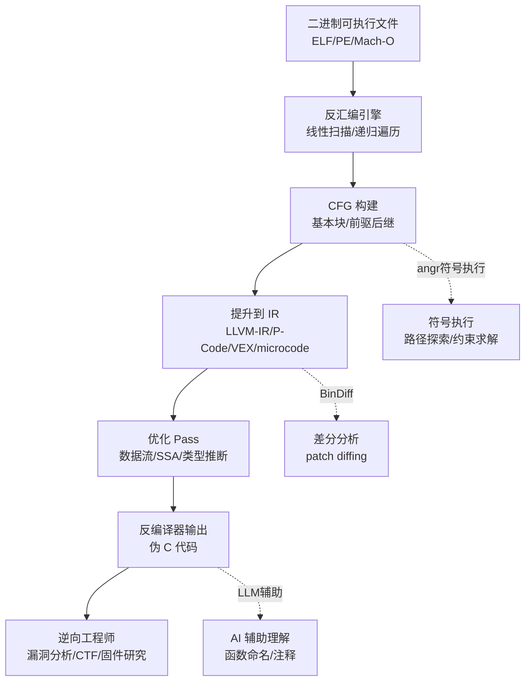

# 反编译器与反汇编引擎原理 · 系列总览

> 作者原创系列，共 **25** 篇（16–25 为扩展专题）。系统拆解 **反汇编引擎与反编译器的内部原理**：从 **线性扫描与递归遍历反汇编算法**、**控制流图（CFG）构建**、**数据流分析与 SSA 形式**、**类型推断**、**中间表示（IR）设计**，到 **Hex-Rays 反编译器内部机制**、**IDA Pro 插件开发**、**Ghidra 脚本与 P-Code**、**反混淆对抗**、**符号执行（angr/Z3）**、**BinDiff 差分算法**、**AI 辅助逆向**，最后落到 **反编译器实战综合应用**。基准工具：IDA Pro / Ghidra / Binary Ninja / angr / radare2。本系列与 [[39.固件与IoT嵌入式逆向/00.固件与IoT嵌入式逆向总览|固件逆向]]、[[38.Windows内核与驱动逆向/00.Windows内核与驱动逆向总览|Windows内核逆向]]、[[33.二进制漏洞与利用基础/00.二进制漏洞与利用基础总览|二进制漏洞]]、[[44.调试器原理与实战/00.调试器原理与实战总览|调试器原理]] 深度互补。

> [!caution] 安全与合规
> 本系列反混淆与对抗技术章节（09、10）一律取 **防御与分析视角**：讲清技术原理、检测方法、如何在自有程序或 CTF 题目上复现；**不提供针对他人软件的武器化破解步骤或绕过商业 DRM 的完整方法**。反编译技术用于安全研究、漏洞分析、CTF 竞赛与自有代码理解。

## 一、反汇编基础

| # | 章节 | 说明 |
| --- | --- | --- |
| 01 | [[01.反汇编算法：线性扫描与递归遍历]] | 线性扫描 vs 递归遍历，间接跳转处理，反汇编准确性边界 |
| 02 | [[02.控制流图CFG构建与基本块]] | 基本块定义，前驱/后继，CFG 算法，不可达代码，IDA/Ghidra CFG 视图 |
| 03 | [[03.数据流分析与活跃变量]] | 活跃变量分析，到达定义，数据流方程（前向/后向），格理论 |

## 二、中间表示与 SSA

| # | 章节 | 说明 |
| --- | --- | --- |
| 04 | [[04.SSA形式与Phi函数]] | SSA（静态单赋值），Phi 函数，支配树，SSA 构建算法 |
| 05 | [[05.中间表示IR设计：LLVM-IR与VEX与P-Code]] | LLVM IR（三地址码），Valgrind VEX，Ghidra P-Code，Binary Ninja MLIL/HLIL |

## 三、类型与结构恢复

| # | 章节 | 说明 |
| --- | --- | --- |
| 06 | [[06.类型推断与结构恢复]] | 类型传播，结构体恢复，指针分析，DWARF 信息利用 |

## 四、主流反编译器内部

| # | 章节 | 说明 |
| --- | --- | --- |
| 07 | [[07.Hex-Rays反编译器内部机制]] | microcode 层次（micro→optimized→final），伪代码生成，IDA Pro 反编译流水线 |
| 08 | [[08.Ghidra反编译器与P-Code分析]] | Sleigh 语言，P-Code 操作语义，DecompInterface API，Ghidra 分析流水线 |

## 五、对抗与反混淆

| # | 章节 | 说明 |
| --- | --- | --- |
| 09 | [[09.反混淆技术与对抗]] | 控制流平坦化（OLLVM）、不透明谓词、指令替换，反混淆策略（防御/研究） |
| 10 | [[10.虚拟化保护逆向原理]] | 基于虚拟机的保护（VMProtect/Themida原理），字节码 handler 分析，与 WASM 壳对比 |

## 六、符号执行与自动化

| # | 章节 | 说明 |
| --- | --- | --- |
| 11 | [[11.符号执行与angr框架]] | 符号执行原理，路径爆炸，angr（项目加载/SimState/Explorer），Z3 约束求解 |

## 七、差分与相似性

| # | 章节 | 说明 |
| --- | --- | --- |
| 12 | [[12.BinDiff与代码相似性分析]] | BinDiff 算法（函数哈希/CFG 相似度/调用图传播），Diaphora，patch diffing 实战 |

## 八、插件开发

| # | 章节 | 说明 |
| --- | --- | --- |
| 13 | [[13.IDA Pro插件开发]] | IDAPython API（idc/idaapi/idautils），自动化分析脚本，自定义伪代码插件 |
| 14 | [[14.Ghidra脚本与插件开发]] | GhidraScript（Java/Python），FlatProgramAPI，Analyzer 接口，自动化逆向 |

## 九、AI 辅助与实战

| # | 章节 | 说明 |
| --- | --- | --- |
| 15 | [[15.AI辅助逆向与反编译器实战综合]] | LLM 辅助反编译理解，函数命名，Gepetto/WPeChatGPT 插件，综合案例 |

## 十、对抗与工具进阶（扩展）

| # | 章节 | 说明 |
| --- | --- | --- |
| 16 | [[16.反汇编对抗技术与工具检测]] | 花指令/不透明谓词/重叠指令、SMC、恢复手段（防御）|
| 17 | [[17.BinaryNinja架构与BNIL]] | LLIL/MLIL/HLIL 多层 IR、SSA、API、与 P-Code/microcode 对比 |
| 18 | [[18.MBA混淆原理与自动化反混淆]] | 混合布尔算术、Z3 失效、SiMBA/GAMBA 程序合成 |

## 十一、AI 与相似性（扩展）

| # | 章节 | 说明 |
| --- | --- | --- |
| 19 | [[19.神经反编译]] | Seq2Seq/Transformer、LLM4Decompile、评估指标、局限 |
| 20 | [[20.深度学习二进制相似性]] | Asm2Vec/SAFE/jTrans/GNN、漏洞搜索、Ghidra BSim |

## 十二、程序分析进阶（扩展）

| # | 章节 | 说明 |
| --- | --- | --- |
| 21 | [[21.污点分析引擎]] | source/sink/传播、静态/动态 DTA、Triton/libdft、shadow memory |
| 22 | [[22.调试信息解析DWARF与PDB]] | DWARF DIE 树、PDB MSF/CodeView、BTF、符号恢复 |
| 23 | [[23.变量恢复与栈帧分析]] | 栈帧重建、栈/寄存器变量、合并拆分、DIRTY |
| 24 | [[24.SMT约束求解器在逆向]] | 位向量理论、Z3/CVC5、DPLL(T)、路径/MBA/等价求解 |
| 25 | [[25.反编译正确性验证]] | 语义等价、重编译对比、差分测试、误译案例（收尾）|

## 反编译器工作流程

> 一句话：反编译器 = **反汇编**（二进制→汇编）+ **提升**（汇编→IR）+ **优化**（数据流/类型推断）+ **输出**（IR→伪C）。理解每一层的算法和数据结构，才能有效利用、扩展、乃至编写自己的反编译插件。
