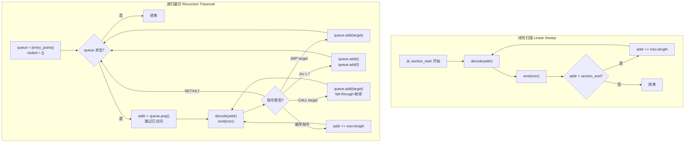

# 反汇编算法：线性扫描与递归遍历

## 概述与定位

反汇编器（Disassembler）是逆向工程工具链的第一道关口：它将二进制机器码字节流翻译为人类可读的汇编助记符，为后续的控制流分析、数据流分析和反编译奠定基础。

> [!abstract] TL;DR
> 反汇编面临的核心挑战是"代码与数据混合"问题——x86/x64 使用变长指令，静态分析时无法总是确定每个字节属于代码还是数据。工业界形成了两种主流算法：**线性扫描**（Linear Sweep）从起始地址顺序解码，简单快速但会把内联数据误解为指令；**递归遍历**（Recursive Traversal）从已知入口点追踪控制流，能避开内联数据，但间接跳转目标静态不可知，依赖启发式分析。IDA Pro 和 Ghidra 均采用递归遍历配合启发式增强；`objdump -d` 默认使用线性扫描。理解这两种算法是掌握反汇编引擎内部机制的第一步。

反汇编与调试器密切配合：调试器动态执行提供实际跳转目标，弥补静态分析的间接跳转盲区（详见 [[44.调试器原理与实战/00.调试器原理与实战总览]]）。

---

## 原理与机制

### 为什么反汇编很难

在深入算法之前，必须理解反汇编困难的根源：

**变长指令集**：x86/x64 的单条指令长度从 1 字节到 15 字节不等。反汇编器不能像 ARM（固定 4 字节）那样简单地按固定步长切片——它必须先解码当前指令，才知道下一条指令从哪里开始。这意味着"从哪里开始解码"至关重要，一旦起点错误，后续所有指令都会错位。

**代码与数据混合**：编译器经常在 `.text` 段内嵌入内联数据：
- **跳转表**（Switch Table）：`switch-case` 语句生成的地址数组，紧跟在代码段中
- **对齐填充**：函数间的 `int3`（`0xCC`）或 `nop`（`0x90`）字节用于内存对齐
- **嵌入式常量**：某些 ARM/x86 代码通过 PC 相对寻址读取位于代码流中的常量

**间接跳转**：`JMP EAX`、`JMP [EAX*4+0x408000]` 的目标在静态时依赖寄存器值，而寄存器值只有在运行时才确定。

**停机问题的影子**：精确判断所有可达代码位置等价于解决停机问题的变体——理论上不可判定。工程实现必须接受"近似正确"并依赖启发式。

### 线性扫描 vs 递归遍历的对比流程



---

## 结构/算法/伪代码详解

### 线性扫描算法

#### 核心思路

线性扫描将代码段视为单纯的指令字节流：从段起始地址开始，解码当前指令，输出，然后将地址推进 `insn.length` 字节，继续解码下一条——如此反复直至段末尾。

**伪代码**：

```python
def linear_sweep(section_start, section_end, decoder):
    addr = section_start
    while addr < section_end:
        insn = decoder.decode(addr)
        if insn is None:
            # 无法解码：作为数据字节输出，步进 1
            emit_data_byte(addr)
            addr += 1
        else:
            emit(insn)
            addr += insn.length
```

#### 数据结构

线性扫描不需要复杂的数据结构：

| 变量 | 含义 |
|------|------|
| `addr` | 当前解码位置（绝对虚拟地址） |
| `insn` | 解码后的指令对象（助记符 + 操作数 + 长度） |
| `section_start/end` | 当前段的起止虚拟地址，来自 PE/ELF 段头 |

#### 优缺点分析

**优点**：
- 实现极为简单，代码量少
- 解码速度快，时间复杂度 O(n)（n = 段字节数）
- 保证 100% 字节覆盖——不会遗漏任何字节（虽然解释不一定正确）

**缺点与失效场景**：

**场景一：内联跳转表**

```nasm
; 编译器为 switch(n) 生成：
CMP EAX, 5
JA  default_case
JMP [EAX*4 + 0x402000]    ; 间接跳转，EAX 为 case 索引

; 0x402000 处存放跳转表（数据！）：
dd offset case0
dd offset case1
dd offset case2
dd offset case3
dd offset case4
dd offset case5
```

线性扫描到达 `0x402000` 时会把这 24 个字节当作指令解码，产生完全错误的反汇编输出。

**场景二：`jmp short +2` 后的隐藏字节**

```nasm
; 混淆技术：
EB 01       ; JMP SHORT +1（跳过下一字节）
E8          ; 这个字节是数据，但线性扫描会把它当 CALL 指令的开头！
5B          ; 真正的指令：POP EBX
```

线性扫描会把 `E8 5B` 解码为 `CALL 0x...`（错误），而实际代码流是跳过 `E8` 直接执行 `5B`（`POP EBX`）。

**场景三：对齐填充**

函数之间的 `int3`（`0xCC`）填充字节：在 x86 中 `CC` 是单字节的 `INT3` 指令（调试断点），线性扫描会把它当作合法指令输出——技术上可解码，但从语义上它不是可执行路径的一部分。

---

### 递归遍历算法

#### 核心思路

递归遍历只解码控制流可达的地址。从已知入口点（程序入口 `entrypoint`、导出函数、已知代码引用）出发，分析每条指令如何影响控制流，并将控制流后继加入工作队列：

- **顺序指令**（`MOV`/`ADD`/`PUSH` 等）：fall-through，继续解码下一字节
- **无条件跳转** `JMP target`：将 `target` 加入队列，当前路径在此终止
- **条件跳转** `Jcc true, false`：将 `true`（跳转目标）和 `false`（fall-through）均加入队列，当前路径在此分叉终止
- **函数调用** `CALL target`：将 `target`（被调函数入口）加入队列；同时假设调用会返回，继续 fall-through 解码 call 之后的指令
- **返回指令** `RET`/`RETN`：当前路径结束，不再 fall-through

**伪代码**：

```python
def recursive_traversal(entry_points, decoder):
    queue = set(entry_points)
    visited = set()     # 已开始处理的地址
    decoded = {}        # addr -> insn

    while queue:
        addr = queue.pop()
        if addr in visited:
            continue
        visited.add(addr)

        # 沿顺序路径向下解码，直到遇到分支/返回
        while True:
            if addr in decoded:
                # 已解码，共享结果
                insn = decoded[addr]
            else:
                insn = decoder.decode(addr)
                if insn is None:
                    break   # 无法解码（可能是数据）
                decoded[addr] = insn
                emit(insn)

            if insn.is_ret() or insn.is_hlt():
                break

            elif insn.is_unconditional_jump():
                target = insn.get_target()
                if target is not None:          # 直接跳转
                    queue.add(target)
                # else: 间接跳转，目标未知，需启发式（见下节）
                break

            elif insn.is_conditional_jump():
                true_target  = insn.get_true_target()
                false_target = addr + insn.length
                if true_target is not None:
                    queue.add(true_target)
                queue.add(false_target)
                break

            elif insn.is_call():
                call_target = insn.get_target()
                if call_target is not None:
                    queue.add(call_target)
                # fall-through：继续解码 call 后的指令
                addr += insn.length

            else:
                # 顺序指令，fall-through
                addr += insn.length
```

#### 数据结构

| 数据结构 | 作用 |
|----------|------|
| `queue` | 待处理地址集合（通常用 set 或 deque，避免重复入队） |
| `visited` | 已处理地址集合，防止无限循环 |
| `decoded` | 地址到指令的映射，共享解码结果，避免重复解码 |
| `entry_points` | 初始种子集合（程序入口/导出符号/已知函数指针） |

#### 优缺点分析

**优点**：
- 不会把内联数据误解为代码——只解码控制流可达的地址
- 产生语义正确的控制流图（CFG）
- 是 IDA Pro、Ghidra、Binary Ninja 等专业工具的核心算法

**缺点**：
- **间接跳转**：`JMP EAX`、`JMP [EAX*4+table]` 的目标静态不可知，需启发式分析（见下节）
- **未发现的入口点**：回调函数、虚函数指针表、函数指针数组等在静态分析时可能无法覆盖
- **混淆代码**：故意使控制流不透明（Opaque Predicate）的代码可能导致遍历提前终止

---

### 两种算法的适用场景对比

| 维度 | 线性扫描 | 递归遍历 |
|------|----------|----------|
| 实现复杂度 | 低 | 中高 |
| 速度 | 极快 | 较慢（有回溯/队列） |
| 内联数据处理 | 差（会误解） | 好（只解码可达代码） |
| 代码覆盖率 | 100% 字节 | 可达代码（可能遗漏入口） |
| 间接跳转 | 无影响（顺序走） | 需启发式 |
| 混淆耐受 | 部分（不被混淆的控制流影响） | 弱（混淆控制流可能欺骗） |
| 代表工具 | `objdump -d`、NDISASM | IDA Pro、Ghidra、Binary Ninja |

---

## 间接跳转处理专节：Switch Table 分析

### 模式识别

Switch-case 语句在 x86 上常见的编译输出模式：

```nasm
; 典型 switch table 模式（32位）
CMP     EAX, 5               ; 检查 case 范围
JA      default_label        ; 超范围跳默认分支
MOV     ECX, [EAX*4 + 0x402000]  ; 从跳转表读取目标地址
JMP     ECX                  ; 间接跳转——目标静态未知！

; 0x402000（跳转表数据区）：
; dd case0_addr, case1_addr, case2_addr, case3_addr, case4_addr, case5_addr
```

64 位模式下常见 RIP 相对寻址：

```nasm
LEA     RCX, [RIP + 0x3A20]  ; 跳转表基址（RIP 相对）
MOVSXD  RAX, DWORD [RCX + RAX*4]  ; 读取偏移（有符号扩展）
ADD     RAX, RCX             ; 计算绝对地址
JMP     RAX                  ; 间接跳转
```

### IDA Pro 的跳转表识别

IDA 维护一个 `switch_info_ex_t` 结构描述每个识别到的跳转表：

```
switch_info_ex_t {
    jumps:      0x402000    ; 跳转表数组基址
    ncases:     6           ; case 数量
    startea:    0x401000    ; switch 指令地址
    elbase:     0           ; 元素基值（用于计算实际目标）
    lowcase:    0           ; case 最小值
    ...
}
```

IDA 自动识别后，所有 case 目标都会被加入反汇编队列，相关字节标记为数据（而非代码）。

**手动添加缺失的跳转表引用（IDAPython）**：

```python
import idc
import ida_xref
import ida_bytes

# 假设跳转表在 0x402000，共 6 个 DWORD 条目
table_ea = 0x402000
ncases   = 6

for i in range(ncases):
    entry_ea = table_ea + i * 4
    # 读取目标地址
    target = ida_bytes.get_dword(entry_ea)
    # 将目标地址标记为代码引用（跳转）
    ida_xref.add_coderef(entry_ea, target, ida_xref.fl_JN)
    # 强制反汇编目标地址
    idc.MakeCode(target)
```

### Ghidra 的 Switch Analyzer

Ghidra 内置 Switch Analyzer（`SwitchAnalyzer` 插件），在自动分析阶段识别跳转表模式。对于未自动识别的间接跳转，可在脚本中手动触发：

```java
// GhidraScript 示例
Address tableBase = toAddr(0x402000L);
for (int i = 0; i < 6; i++) {
    Address entryAddr = tableBase.add(i * 4);
    int targetOffset = getInt(entryAddr);
    Address target = toAddr(targetOffset & 0xFFFFFFFFL);
    // 标记目标为代码
    disassemble(target);
    // 添加引用
    createMemoryReference(entryAddr, target, RefType.COMPUTED_JUMP, SourceType.USER_DEFINED);
}
```

---

## 工具视角/实战

### objdump：线性扫描实战

`objdump -d` 是线性扫描最典型的代表。观察它在内联数据面前的表现：

```bash
# 反汇编 ELF 二进制
objdump -d -M intel /path/to/binary

# 指定解码起始地址（十六进制）
objdump -d --start-address=0x401000 --stop-address=0x402000 binary

# 同时显示原始字节（方便对比）
objdump -d -M intel --show-raw-insn binary
```

当遇到内联跳转表时，`objdump` 会把跳转表数据字节当作指令解码，输出类似：

```
402000:  e8 10 40 00 00       call   406015 <...>  ; 实际上这是跳转表数据！
402005:  20 10                and    [rax], dl
```

这些"指令"是误读——原始字节是四个 DWORD 地址值。

### IDA Pro：递归遍历与分析控制

**查看未分析字节**（代码段中的 gap）：

```
菜单 → View → Open Subviews → Segments
找到 .text 段，查看 gap（橙色标记的未分析区域）
```

**强制将地址解码为代码**（IDAPython）：

```python
import idc
import ida_auto

ea = 0x401234  # 目标地址

# 先取消原有定义（避免冲突）
idc.del_items(ea, idc.DELIT_EXPAND, 16)

# 强制解码为代码
idc.create_insn(ea)

# 等待 IDA 自动分析完成（重要：批量操作后必须等待）
ida_auto.auto_wait()
```

**检测并标记函数**（当 IDA 未识别时）：

```python
import idc
import idaapi

ea = 0x401000
# 强制标记为函数起始
idaapi.add_func(ea)
ida_auto.auto_wait()
```

**遍历所有已识别函数检查分析质量**：

```python
import idautils
import idc

for func_ea in idautils.Functions():
    func_name = idc.get_func_name(func_ea)
    # 检查函数内是否有未分析的 chunk
    func = idaapi.get_func(func_ea)
    if func:
        # 函数的尾部地址
        end_ea = func.end_ea
        # 在函数范围内查找未定义字节
        curr = func_ea
        while curr < end_ea:
            flags = idc.get_full_flags(curr)
            if not idc.is_code(flags) and not idc.is_data(flags):
                print(f"未分析字节: 0x{curr:08X} in {func_name}")
            curr = idc.next_head(curr, end_ea)
```

### Ghidra：递归遍历脚本控制

**从 GhidraScript 触发反汇编**：

```java
import ghidra.app.cmd.disassemble.DisassembleCommand;
import ghidra.program.model.address.Address;

// 对指定地址触发递归遍历反汇编
Address target = toAddr(0x401000L);
DisassembleCommand cmd = new DisassembleCommand(target, null, true);
cmd.applyTo(currentProgram, monitor);
```

**检查地址是否已反汇编**：

```java
import ghidra.program.model.listing.Listing;
import ghidra.program.model.listing.Instruction;

Listing listing = currentProgram.getListing();
Address addr = toAddr(0x401234L);
Instruction insn = listing.getInstructionAt(addr);
if (insn == null) {
    println("0x401234 未被反汇编，尝试强制解码...");
    disassemble(addr);
} else {
    println("已有指令: " + insn.getMnemonicString());
}
```

**批量为未分析代码创建函数**：

```java
import ghidra.program.model.symbol.*;

// 查找所有名为 "FUN_..." 的自动命名函数（可能是遗漏的入口）
SymbolTable symTable = currentProgram.getSymbolTable();
SymbolIterator it = symTable.getSymbols(currentProgram.getMinAddress(), 
                                         currentProgram.getMaxAddress(), true);
while (it.hasNext()) {
    Symbol sym = it.next();
    if (sym.getName().startsWith("FUN_") && 
        sym.getSymbolType() == SymbolType.FUNCTION) {
        println("自动函数: " + sym.getName() + " @ " + sym.getAddress());
    }
}
```

### radare2：两种算法均可选

```bash
# 线性扫描（pd 命令：print disassembly）
r2 binary
[0x00401000]> pd 50      # 从当前地址线性扫描 50 条指令

# 递归遍历（aaa 命令：analyze all and autoname）
r2 binary
[0x00000000]> aaa        # 完整自动分析（递归遍历 + 函数识别）
[0x00000000]> afl        # 列出所有识别到的函数
[0x00000000]> pdf @ sym.main  # 打印 main 函数反汇编
```

---

## 安全性与正确使用

> [!caution] 合规边界
> 本章介绍的反汇编技术用于：CTF 题目分析、自有程序调试、恶意软件样本分析（研究目的）、安全漏洞研究。不应将这些技术用于破解商业软件的授权保护、规避数字版权管理（DRM），或在未经授权的情况下分析他人代码——此类行为在大多数地区违反《计算机欺诈与滥用法》（CFAA）等法律。

### 常见陷阱与误判

**陷阱一：误把填充字节当指令**

`int3`（`0xCC`）是调试断点指令，也常作为函数间填充。线性扫描会把它当作合法指令报出：

```
; objdump 输出的"幽灵指令"
401023: cc    int3
401024: cc    int3
401025: cc    int3
; 实际上这三个字节是对齐填充，下面 0x401026 才是新函数
```

**处置方案**：参考函数序言模式（`55 89 E5` = `push ebp; mov ebp, esp`）识别真正的函数起始。

**陷阱二：混淆跳转迷惑递归遍历**

恶意代码常使用"不透明谓词"（Opaque Predicate）构造永远不执行的分支：

```nasm
XOR EAX, EAX         ; EAX 永远是 0
JNZ fake_target      ; 永远不跳（但反汇编器会把 fake_target 加入队列）
; 真正的代码在这里
```

递归遍历会把 `fake_target` 处的字节也解码（哪怕是数据），产生混淆输出。IDA 和 Ghidra 通过数据流分析（常量折叠）识别此类情况。

**陷阱三：跨节引用**

一些 PE 文件将跳转表存放在 `.rdata` 节而非 `.text` 节中。线性扫描如果只扫 `.text`，会在遇到 `JMP [table]` 时因目标地址不在扫描范围内而产生空引用。递归遍历则能正确追踪到 `.rdata` 中的目标。

### 防御性反汇编实践

在恶意样本分析中，建议：

1. **始终以递归遍历为主，线性扫描作辅助验证**——若两者结果相差过大，说明可能有内联数据或混淆
2. **在 IDA 中对可疑地址执行 `del_items` 后重新 `create_insn`**——清除错误解码，重新从正确起点分析
3. **对间接跳转手动验证目标**——动态调试（在 IDA 的调试器模式或独立调试器中运行一步）获取实际跳转目标
4. **使用 Ghidra 的 `Mark As Code`**——在 GUI 中右键未识别字节，强制标记并触发反汇编

---

## 小结

本章系统介绍了反汇编的两大核心算法：

- **线性扫描**：从段起始顺序解码，实现简单、速度快、100% 字节覆盖，但会将内联数据误解为指令。适用于快速粗扫、已知代码布局简单的场景（如 `objdump -d`）。

- **递归遍历**：从已知入口点追踪控制流，只解码可达地址，语义正确，是 IDA Pro、Ghidra 等专业工具的核心。主要挑战是间接跳转（Switch Table 等），需要启发式分析配合。

- **间接跳转专节**揭示了 Switch Table 的典型模式，以及 IDA `switch_info_ex_t`、Ghidra Switch Analyzer 的处理机制。

- 两种算法各有盲区，实践中往往结合使用：递归遍历为主体，线性扫描检查未被遍历覆盖的字节区域。

掌握这两种算法是理解后续章节（CFG 构建、数据流分析、SSA）的基础，因为它们的输入正是反汇编的输出——一组带有控制流关系的指令序列。

---

## 相关阅读

- [[44.调试器原理与实战/00.调试器原理与实战总览]] — 调试器提供动态跳转目标，弥补静态反汇编的间接跳转盲区
- [[02.控制流图CFG构建与基本块]] — 反汇编完成后，如何将指令序列组织为基本块和 CFG
- [[03.数据流分析与活跃变量]] — 在 CFG 上进行数据流分析，识别不透明谓词和死代码
- Kris Kaspersky, *Hacker Disassembling Uncovered*（2003）— 深入讲解 x86 反汇编的各类边界情况
- Chris Eagle, *The IDA Pro Book*（2nd ed.）— IDA 反汇编引擎工作原理与 IDAPython 实战
- Ghidra 官方文档：Disassembly Overview（`Help → Contents → Disassembly`）

---

🏠 [[00.反编译器与反汇编引擎原理总览]] ｜ 下一篇 [[02.控制流图CFG构建与基本块]] ➡️
