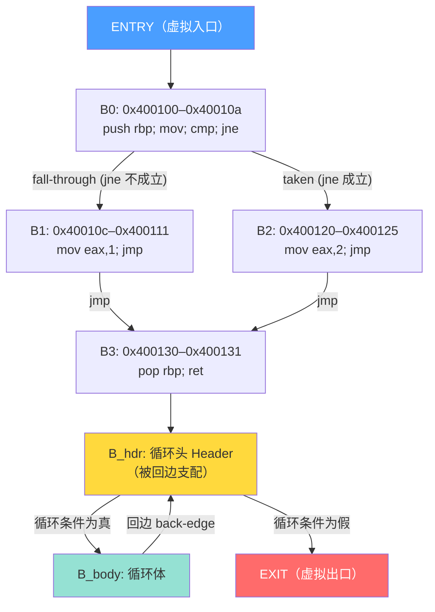

# 反编译器（02）· 控制流图CFG构建与基本块

## 概述与定位

> [!abstract] TL;DR
> 控制流图（CFG）是反编译器流水线的枢纽数据结构。反汇编完成后，下一步并非直接翻译伪代码，而是先将指令序列切分为**基本块**，再通过控制流边把基本块织成有向图。后续所有分析——数据流（第03章）、SSA（第04章）、类型推断（第06章）——都在 CFG 上运行。理解 CFG 的构建算法、支配关系与自然循环识别，是读懂 IDA Pro / Ghidra 反编译器内部机制的前提。

上一章（[[01.反汇编算法：线性扫描与递归遍历]]）解决了"如何从二进制字节序列还原出汇编指令"。但一旦拿到指令列表，逆向工程师面对的往往是几百条 `cmp`、`jne`、`mov` 混在一起的平坦序列——根本看不出 `if`/`while` 在哪里。

**控制流图（Control Flow Graph，CFG）** 正是解决这个问题的第一把钥匙：

- 它把"平坦的指令序列"组织成**有向图**，节点是基本块，边是控制流转移；
- 支配关系在 CFG 上计算，揭示程序的**层次嵌套结构**（if/loop）；
- 反编译器最终输出的 `if-else`/`while` 都是通过**结构化算法**把 CFG 模式匹配回来的。

本章依次覆盖：基本块定义与 Leader 规则 → CFG 边类型 → CFG 构建算法（伪代码）→ 支配树与 Cooper 算法 → 自然循环识别 → CFG 结构化（if/while 恢复）→ IDA Pro / Ghidra 实战 API。

---

## 原理与机制

### 2.1 基本块（Basic Block）

**基本块**是满足以下条件的最大指令序列：

1. **单入口**：只能从第一条指令（Leader）进入，不存在从中间进入的控制流；
2. **单出口**：控制流只能从最后一条指令（Terminator）离开，中间没有分支。

"最大"意味着能并入就并入——只要一段顺序执行的指令满足上述约束，就归入同一个基本块，不拆开。

#### 2.1.1 Leader（领导者）规则

确定基本块边界的核心是找到所有 **Leader 指令**。Leader 规则共三条：

| 编号 | 规则 | 说明 |
|------|------|------|
| R1 | 程序/函数入口点 | 第一条可执行指令天然是 Leader |
| R2 | 任意跳转/分支指令的**目标地址** | 跳转落点是新块的开始 |
| R3 | 任意跳转/分支指令**后紧跟的地址**（fall-through） | 条件跳转不成立时自然流向的下一条指令 |

> [!note] 关于 CALL 指令
> 普通函数调用（`call foo`）**通常不触发 Leader 规则 R3**，因为反编译器在**过程内 CFG** 中把 `call` 视为普通指令——它会返回，下一条指令属于同一块。
>
> 例外情形：`noreturn` 函数（如 `abort()`、`exit()`、`__stack_chk_fail()`）标注后，其后的地址**不产生 fall-through**，当前块在 `call` 处终止。

**示例**：以如下 x86 汇编为例，逐步找 Leader：

```asm
0x400100  push  rbp           ; R1: 函数入口 → Leader
0x400101  mov   rbp, rsp
0x400104  mov   eax, [rbp-4]
0x400107  cmp   eax, 0
0x40010a  jne   0x400120      ; 跳转指令 → 目标 0x400120 是 Leader (R2)
0x40010c  mov   eax, 1        ; fall-through → 0x40010c 是 Leader (R3)
0x400111  jmp   0x400130      ; 目标 0x400130 是 Leader (R2)
0x400116  nop                 ; (不可达，但如果可达则 0x400116 是 Leader via R3)
0x400120  mov   eax, 2        ; Leader (R2)
0x400125  jmp   0x400130      ; 目标 0x400130 已是 Leader
0x40012a  nop
0x400130  pop   rbp           ; Leader (R2)
0x400131  ret
```

Leader 集合：`{0x400100, 0x40010c, 0x400120, 0x400130}`。

---

### 2.2 CFG 边类型

确定基本块后，通过分析每个块的最后一条指令（Terminator）建立**控制流边**：

| 边类型 | 产生时机 | 说明 |
|--------|---------|------|
| **Fall-through 边** | 条件跳转（`jne`/`je`/`jl`...）不成立 | 自然流向下一个 Leader |
| **Taken 边** | 条件跳转成立 / 无条件跳转 | 指向目标地址对应的块 |
| **无条件跳转** | `jmp target` | 只有一条 Taken 边，无 fall-through |
| **返回边** | `ret`/`retn` | 过程内 CFG 通常不建边；过程间 CFG 连回调用点 |
| **间接跳转** | `jmp [rax]`、switch 跳转表 | 目标不定，需跳转表分析或值分析 |

> [!warning] 间接跳转是 CFG 构建的难点
> `switch` 语句编译后常产生形如 `jmp [rax*8 + table_base]` 的间接跳转。反编译器需先通过模式匹配或数据流分析还原跳转表，才能建出完整 CFG。IDA Pro 的"跳转表分析"（`idc.create_switch_info()`）和 Ghidra 的 `GhidraScriptUtil` 里的跳转表识别正是为此服务。

---

### 2.3 CFG 图示

下面是包含条件分支与循环回边的典型 CFG 示意：



图中 `LOOP_HDR → LOOP_BODY → LOOP_HDR` 这条回边正是识别自然循环的关键。Entry/Exit 是虚拟节点，保证"每条从入口出发的路径都经过 Entry，每条到达出口的路径都经过 Exit"，便于后续支配树计算。

---

## 结构/算法/伪代码详解

### 3.1 CFG 构建算法

完整的三步构建流程如下：

```python
def build_cfg(func_start):
    """
    从函数起始地址构建过程内 CFG。
    返回值：(blocks: dict[addr -> BasicBlock], cfg: CFG)
    """

    # ── Step 1：找到所有 Leader ──────────────────────────────────────
    leaders = {func_start}                     # R1：函数入口

    for ea in all_instructions(func_start):    # 线性扫描函数范围内的指令
        insn = decode(ea)

        if insn.is_branch():                   # 条件/无条件跳转
            if insn.target is not None:
                leaders.add(insn.target)       # R2：跳转目标
            leaders.add(ea + insn.length)      # R3：fall-through（jne/je 后）

        elif insn.is_unconditional_jump():     # jmp target
            leaders.add(insn.target)           # R2：目标
            # R3：jmp 后地址虽为 Leader，但通常不可达（除非有其他跳转到此）
            leaders.add(ea + insn.length)

        elif insn.is_call() and insn.is_noreturn():
            # noreturn：不产生 fall-through，后续地址不是 Leader
            pass

    leaders = sorted(leaders)

    # ── Step 2：构建基本块 ────────────────────────────────────────────
    blocks = {}

    for i, leader in enumerate(leaders):
        next_leader = leaders[i + 1] if i + 1 < len(leaders) else INFINITY
        block = BasicBlock(start=leader)
        ea = leader

        while ea < next_leader:
            insn = decode(ea)
            block.add_insn(insn)

            # 遇到 Terminator：当前块结束
            if insn.is_terminator():           # ret / jmp / call-noreturn
                break

            ea += insn.length

        block.end = ea + decode(ea).length     # 块的结束地址（exclusive）
        blocks[leader] = block

    # ── Step 3：建立 CFG 边 ───────────────────────────────────────────
    cfg = CFG()
    cfg.entry = BasicBlock.VIRTUAL_ENTRY
    cfg.exit  = BasicBlock.VIRTUAL_EXIT

    cfg.add_edge(cfg.entry, blocks[func_start])   # 虚拟入口边

    for block in blocks.values():
        last = block.last_insn()

        if last.is_conditional_jump():
            cfg.add_edge(block, blocks[last.target],      label="taken")
            cfg.add_edge(block, blocks[last.fallthrough], label="fall-through")

        elif last.is_unconditional_jump():
            cfg.add_edge(block, blocks[last.target],      label="taken")

        elif last.is_ret():
            cfg.add_edge(block, cfg.exit)                 # 连虚拟出口

        elif last.is_call() and last.is_noreturn():
            cfg.add_edge(block, cfg.exit)

        # 普通块（最后一条既非跳转也非 ret）：fall-through 到下一块
        else:
            next_addr = block.end
            if next_addr in blocks:
                cfg.add_edge(block, blocks[next_addr], label="fall-through")

    return blocks, cfg
```

算法复杂度：Step 1/2 均为 O(N)（N 为指令数），Step 3 为 O(B)（B 为基本块数，B ≤ N）。整体 O(N)。

---

### 3.2 支配关系（Dominance）

#### 概念

给定 CFG 中节点 A 和 B，若**从 Entry 到 B 的所有路径都经过 A**，则称 **A 支配 B**，记 `A dom B`。

性质：
- 自反性：`A dom A`（每个节点支配自身）；
- 传递性：若 `A dom B` 且 `B dom C`，则 `A dom C`；
- 反对称性：若 `A dom B` 且 `B dom A`，则 `A = B`。

**直接支配者（Immediate Dominator，idom）**：A 的直接支配者是最近的支配者，即满足 `A_idom dom A` 且不存在 `X` 使得 `A_idom dom X dom A`（X ≠ A）。

**支配树（Dominator Tree）**：以 Entry 为根，每个节点的父节点 = 其 idom。支配树直接揭示了程序的**控制层次**——if 体的节点在 if 头的子树下，while 体在 while 头的子树下。

#### Cooper 2001 简化算法

Keith Cooper 等人在 2001 年发表的论文 *A Simple, Fast Dominance Algorithm* 提供了一个工程上广泛使用的迭代算法，比经典的 Lengauer-Tarjan 算法更容易实现：

```python
def compute_dominators(cfg):
    """
    Cooper 2001 简化支配算法。
    post_order：CFG 的逆后序（Reverse Post-Order）遍历顺序。
    idom[b]：节点 b 的直接支配者。
    """
    # RPO 编号：RPO 编号越小 = 越靠近入口
    rpo = reverse_post_order(cfg)                  # List[Block]，Entry 在最前
    rpo_index = {b: i for i, b in enumerate(rpo)}

    idom = {cfg.entry: cfg.entry}                  # Entry 的 idom 是自身

    changed = True
    while changed:
        changed = False
        for b in rpo:
            if b is cfg.entry:
                continue

            # 取所有"已处理过"的前驱（idom 已确定）
            processed_preds = [p for p in cfg.predecessors(b) if p in idom]
            if not processed_preds:
                continue

            # 新 idom 候选 = 多条前驱路径的"公共支配者"
            new_idom = processed_preds[0]
            for pred in processed_preds[1:]:
                new_idom = intersect(pred, new_idom, idom, rpo_index)

            if idom.get(b) != new_idom:
                idom[b] = new_idom
                changed = True

    return idom


def intersect(b1, b2, idom, rpo_index):
    """沿支配树向上爬，找两个节点的公共支配者。"""
    while b1 != b2:
        while rpo_index[b1] > rpo_index[b2]:
            b1 = idom[b1]
        while rpo_index[b2] > rpo_index[b1]:
            b2 = idom[b2]
    return b1
```

**收敛性**：每次迭代至少有一个节点的 idom 更新（或收敛），迭代次数在实践中极小（通常 2~4 次）。

---

### 3.2.1 Lengauer-Tarjan 支配树算法

Cooper 算法以简洁著称，但其迭代不动点的理论复杂度为 O(V²)（最坏情况下迭代次数与节点数成正比）。对超大函数或过程间 CFG，Lengauer & Tarjan 在 1979 年发表的经典算法是更优选择，理论复杂度为 **O(E · α(E, V))**——其中 α 是阿克曼函数的反函数，实践中近乎常数，从而整体接近 O(E)，显著优于迭代不动点法。

#### 半支配点（Semidominator）

Lengauer-Tarjan 算法的核心概念是**半支配点（semidominator）**，它弱于支配但更容易在 DFS 树上计算。

> 给定 DFS 树，节点 v 的半支配点 `sdom(v)` 定义为：满足以下条件的、DFS 编号（dfnum）最小的节点 u——存在从 u 到 v 的路径，路径上除端点外所有中间节点的 dfnum **均大于** dfnum(v)。

直觉上：`sdom(v)` 是"绕过树路径、沿非树边迂回到达 v 的最高祖先"。半支配点的重要性在于：**idom(v) 在 `sdom(v)` 到 v 的树路径上**，从而将 idom 的计算范围缩小到一条路径。

#### DFS 预处理与数据结构

```
# 全局变量
dfnum[v]   : 节点 v 的 DFS 访问序号（0-indexed，Entry = 0）
vertex[i]  : dfnum 为 i 的节点
parent[v]  : v 在 DFS 树中的父节点
semi[v]    : v 的半支配点（最终值）
idom[v]    : v 的直接支配者（待计算）
ancestor[v]: 并查集的"祖先"指针（用于路径压缩 EVAL）
best[v]    : 路径压缩过程中 semi 最小的节点（LINK/EVAL 辅助）
bucket[v]  : semi[w] = v 的所有节点 w 的集合
```

**Step 1：DFS 标号**

```python
timer = 0
def dfs(v, p):
    global timer
    dfnum[v] = timer
    vertex[timer] = v
    parent[v] = p
    timer += 1
    for w in cfg.successors(v):
        if dfnum[w] == -1:      # 未访问
            dfs(w, v)
```

#### LINK / EVAL（带路径压缩的并查集）

并查集用于在半支配点计算过程中高效查询"从 v 沿 DFS 树向上走、semi 值最小的节点"。

```python
def LINK(parent_node, child_node):
    """将 child_node 挂到 parent_node 之下（按 DFS 树边）"""
    ancestor[child_node] = parent_node
    best[child_node]     = child_node   # 初始 best 指向自身

def EVAL(v):
    """
    返回从 v 到根路径上、semi 最小的节点（路径压缩版）。
    副作用：路径压缩，使后续 EVAL 调用更快。
    """
    if ancestor[v] is None:
        return v                        # v 是根，直接返回
    compress(v)
    return best[v]

def compress(v):
    """路径压缩：将 v 的 ancestor 直接连到集合根"""
    a = ancestor[v]
    if ancestor[a] is not None:
        compress(a)
        if dfnum[semi[best[a]]] < dfnum[semi[best[v]]]:
            best[v] = best[a]
        ancestor[v] = ancestor[a]
```

#### 主算法伪代码（分步）

```python
def lengauer_tarjan(cfg):
    n = len(cfg.nodes)
    # 初始化
    for v in cfg.nodes:
        dfnum[v] = -1
        semi[v] = v
        idom[v] = None
        ancestor[v] = None
        best[v] = v
        bucket[v] = set()

    # Step 1：DFS 标号
    dfs(cfg.entry, None)

    # Step 2：按 dfnum 逆序处理每个节点（除 Entry）
    for i in range(n - 1, 0, -1):
        w = vertex[i]                   # dfnum = i 的节点

        # 2a. 计算 semi[w]
        for v in cfg.predecessors(w):
            if dfnum[v] != -1:          # v 在 DFS 树内（已访问）
                u = EVAL(v)
                if dfnum[semi[u]] < dfnum[semi[w]]:
                    semi[w] = semi[u]

        bucket[semi[w]].add(w)
        LINK(parent[w], w)              # 将 w 连入并查集

        # 2b. 处理 bucket[parent[w]] 中待定的 idom
        for v in list(bucket[parent[w]]):
            bucket[parent[w]].remove(v)
            u = EVAL(v)
            # 若 semi[u] == semi[v]，则 idom[v] = semi[v]
            # 否则 idom[v] 暂定为 u，后续 Step 3 修正
            if dfnum[semi[u]] < dfnum[semi[v]]:
                idom[v] = u
            else:
                idom[v] = parent[w]

    # Step 3：按 dfnum 正序修正 idom（处理 Step 2b 中的"暂定"情况）
    for i in range(1, n):
        w = vertex[i]
        if idom[w] != semi[w]:
            idom[w] = idom[idom[w]]

    idom[cfg.entry] = cfg.entry         # Entry 的 idom 是自身
    return idom
```

**复杂度分析**：
- LINK/EVAL 使用路径压缩后，每次 EVAL 的摊还代价为 O(α(E, V))。
- 总调用次数与边数 E 成正比。
- 整体复杂度：**O(E · α(E, V))**，实践中接近 O(E)，远优于迭代不动点的 O(V · E)。

#### 支配边界（Dominance Frontier）

支配边界（DF）是 Lengauer-Tarjan 算法的重要下游应用，尤其服务于第 04 章的 **SSA Φ 函数插入**。

> 节点 x 的**支配边界** DF(x) = { y | ∃ 前驱 p of y，使得 x dom p，但 x 不严格支配 y }

直觉：DF(x) 是"x 的支配势力范围刚好到达但又不完全覆盖"的边界节点集合——Φ 函数需要插在这些节点处，合并来自不同支配路径的变量定义。

```python
def compute_dominance_frontiers(cfg, idom):
    """计算所有节点的支配边界 DF（用于 SSA Φ 插入，详见第 04 章）。"""
    DF = {v: set() for v in cfg.nodes}
    for b in cfg.nodes:
        preds = list(cfg.predecessors(b))
        if len(preds) >= 2:         # join 节点（多前驱）才可能产生 DF
            for p in preds:
                runner = p
                while runner != idom[b]:
                    DF[runner].add(b)
                    runner = idom[runner]
    return DF
```

> [!note] 与 Cooper 算法的选择建议
> - **小/中型函数**（< 1000 基本块）：Cooper 2001 更简洁，工程中首选。
> - **超大函数或全程序支配树**（过程间分析）：Lengauer-Tarjan 的近线性复杂度优势显现，GCC/LLVM 的全局优化 Pass 均采用此算法。
> - LLVM 的 `llvm::DominatorTreeBase` 和 GCC 的 `dominance.cc` 均实现了 Lengauer-Tarjan，可作为参考实现。

---

### 3.3 自然循环（Natural Loop）

#### 回边（Back Edge）

CFG 中的边 `A → B`，若 `B dom A`（B 支配 A），则称该边为**回边**。回边是循环的充要标志。

**检测方法**：对 CFG 做 DFS，回边即 DFS 树中指向**祖先节点**（灰色节点）的边。

#### 自然循环定义

给定回边 `A → B`（B 为循环头 Header），对应的自然循环 = 所有"能在不经过 B 的情况下到达 A 的节点"的集合，再加上 B 本身。

```python
def natural_loop(back_edge_tail: Block, header: Block, cfg: CFG) -> set:
    """
    计算回边 (back_edge_tail → header) 对应的自然循环节点集合。
    算法：从 back_edge_tail 沿逆向 CFG 做 BFS/DFS，止步于 header。
    """
    loop_nodes = {header}
    worklist = [back_edge_tail]

    while worklist:
        node = worklist.pop()
        if node not in loop_nodes:
            loop_nodes.add(node)
            for pred in cfg.predecessors(node):
                worklist.append(pred)

    return loop_nodes
```

**多层嵌套循环**：若 CFG 有多条回边，每条回边对应一个自然循环，循环可嵌套（内层循环节点集 ⊂ 外层循环节点集）。

---

### 3.4 CFG 结构化（Structuring）

结构化是把 CFG 模式匹配为高级语言结构（`if`/`while`/`for`）的过程，是反编译器生成可读伪代码的核心步骤。

#### 常见模式

| CFG 结构 | 识别条件 | 输出 |
|----------|---------|------|
| **顺序块** | 节点只有一个后继，且后继只有一个前驱 | `stmt1; stmt2;` |
| **if-then** | 条件块有两条出边（T/F），其中一条直接到汇合点 | `if (cond) { then_body }` |
| **if-then-else** | 两条出边各指向不同块，最终汇合到同一后继 | `if (cond) { ... } else { ... }` |
| **while 循环** | 存在回边，循环头有两条出边（一进循环体，一出循环） | `while (cond) { body }` |
| **do-while** | 循环体末有条件跳转回循环头 | `do { body } while (cond)` |

#### 不可规约 CFG（Irreducible CFG）

若 CFG 存在**多入口循环**（两个或多个节点相互构成循环，但没有唯一的 Header 被所有路径支配），则该 CFG 是**不可规约的**。无法直接结构化为标准 `while`，反编译器只能输出 `goto` 语句。

IDA Pro 和 Ghidra 在遇到不可规约 CFG 时均会回退到 `goto` 输出模式，这也是为什么某些深度混淆后的函数会产生大量 `goto` 的原因。

---

## 工具视角/实战

### 4.1 IDA Pro

#### Graph View（CFG 可视化）

在 IDA Pro 反汇编视图中按 **空格键（Spacebar）** 可切换 Text View 和 **Graph View**（CFG 图形视图）。Graph View 中：
- 每个节点对应一个基本块；
- 绿色箭头 = fall-through（条件不成立）；
- 红色箭头 = taken（条件成立）；
- 蓝色箭头 = 无条件跳转。

#### IDAPython：遍历 CFG 基本块

```python
import idaapi
import ida_gdl
import idc

# 获取光标处函数
f = idaapi.get_func(here())
if f is None:
    print("Not inside a function")
else:
    # FlowChart 构建过程内 CFG
    fc = ida_gdl.FlowChart(f, flags=ida_gdl.FC_PREDS)

    for block in fc:
        print(f"[Block] {block.start_ea:#010x} – {block.end_ea:#010x}  "
              f"(type={ida_gdl.fc_block_type_t(block.type).name})")

        # 后继（successors）
        for succ in block.succs():
            print(f"    -> {succ.start_ea:#010x}")

        # 前驱（predecessors，需 FC_PREDS flag）
        for pred in block.preds():
            print(f"    <- {pred.start_ea:#010x}")
```

> [!tip] `FC_PREDS` 标志
> 默认 `FlowChart` 只构建后继边。传入 `flags=ida_gdl.FC_PREDS` 后才会同时计算前驱边，用于支配树分析或逆向数据流。

#### 支配树可视化

IDA Pro 菜单 **View → Graphs → Function calls** 可显示调用图；支配树可通过 `ida_gdl.FlowChart` + 自定义 IDAPython 脚本输出（IDA Pro 本体不内置独立支配树 View，Binary Ninja 的 MLIL 视图更直观）。

---

### 4.2 Ghidra

#### BasicBlockModel API（Java）

Ghidra 通过 `BasicBlockModel` 提供 CFG 基本块迭代接口：

```java
import ghidra.program.model.block.BasicBlockModel;
import ghidra.program.model.block.CodeBlock;
import ghidra.program.model.block.CodeBlockIterator;
import ghidra.program.model.block.CodeBlockReference;
import ghidra.program.model.block.CodeBlockReferenceIterator;
import ghidra.program.model.listing.Function;

// 在 GhidraScript 的 run() 方法内：
Function func = getFunctionContaining(currentAddress);
if (func == null) {
    println("No function at current address");
    return;
}

BasicBlockModel bbm = new BasicBlockModel(currentProgram);
CodeBlockIterator blockIter = bbm.getCodeBlocksContaining(
    func.getBody(), monitor);

while (blockIter.hasNext()) {
    CodeBlock block = blockIter.next();
    println(String.format("[Block] %s  size=%d",
        block.getMinAddress(), block.getNumAddresses()));

    // 遍历后继（Destination）
    CodeBlockReferenceIterator destIter = block.getDestinations(monitor);
    while (destIter.hasNext()) {
        CodeBlockReference ref = destIter.next();
        println("    -> " + ref.getDestinationBlock().getMinAddress()
            + "  flow=" + ref.getFlowType());
    }

    // 遍历前驱（Source）
    CodeBlockReferenceIterator srcIter = block.getSources(monitor);
    while (srcIter.hasNext()) {
        CodeBlockReference ref = srcIter.next();
        println("    <- " + ref.getSourceBlock().getMinAddress());
    }
}
```

`FlowType` 枚举包含 `CONDITIONAL_JUMP`、`UNCONDITIONAL_JUMP`、`FALL_THROUGH`、`CALL`、`CALL_TERMINATOR` 等，可据此区分 taken/fall-through 边。

#### Ghidra Python（Jython）等价写法

```python
# Ghidra Script (Jython / Python 3 via PyGhidra)
from ghidra.program.model.block import BasicBlockModel

func = getFunctionContaining(currentAddress)
bbm = BasicBlockModel(currentProgram)
blocks = bbm.getCodeBlocksContaining(func.getBody(), monitor)

for block in blocks:
    print(f"[Block] {block.minAddress} – {block.maxAddress}")
    for dest in block.getDestinations(monitor):
        print(f"    -> {dest.destinationBlock.minAddress}  ({dest.flowType})")
```

#### P-Code CFG（更高层）

Ghidra 的反编译引擎在 P-Code 层面维护独立的 CFG（`PCodeBlockBasic`），通过 `DecompInterface` 访问：

```java
DecompInterface decomp = new DecompInterface();
decomp.openProgram(currentProgram);
DecompileResults res = decomp.decompileFunction(func, 30, monitor);
HighFunction hf = res.getHighFunction();

// 获取 P-Code CFG 中的基本块（PCodeBlock 级别）
Iterator<PcodeBlockBasic> it = hf.getBasicBlocks().iterator();
while (it.hasNext()) {
    PcodeBlockBasic bb = it.next();
    println("PCode BB: " + bb.getStart() + " – " + bb.getStop());
}
```

P-Code CFG 经过 Ghidra 的 SSA 变换和优化，与汇编级 CFG 节点数可能不同，但边关系语义一致。

---

### 4.3 典型陷阱与边缘情况

| 场景 | 问题 | 应对方式 |
|------|------|---------|
| 间接跳转（switch） | 目标地址不定，CFG 边不完整 | 跳转表分析；IDA `create_switch_info()` |
| `noreturn` 函数 | fall-through 不应建边 | 检查函数属性 / `__attribute__((noreturn))` |
| 异常处理（SEH/C++ EH） | 异常路径产生隐式 CFG 边 | 需纳入 unwind 表分析 |
| 尾调用优化（tail call） | `jmp func` 替换 `call+ret` | 识别后在 CFG 中处理为出口 |
| 多入口函数（共享尾部） | 违反单入口假设 | 分割为独立函数或产生不可规约 CFG |
| 花指令（junk bytes） | 线性扫描产生错误 Leader | 需先进行反混淆（第09章） |

---

## 安全性与正确使用

> [!caution] CFG 分析的安全边界
> 本章技术适用于：CTF 逆向题目分析、自有程序安全审计、漏洞研究（POC 复现）、恶意软件分析（防御视角）、二进制兼容性研究。**不适用于**：未经授权的商业软件破解、绕过 DRM/授权检测、将分析结果武器化用于攻击他人系统。

### CFG 在安全分析中的典型用途

**1. 漏洞面识别**
通过 CFG 找到所有可能到达危险函数（`strcpy`、`memcpy`、`system`）的路径，快速缩小漏洞排查范围。IDA Pro 的 "Xref graph"（交叉引用图）本质上是 CFG + 调用图的组合视图。

**2. 代码覆盖率分析**
AFL/libFuzzer 等模糊测试工具正是以 CFG 边为粒度度量覆盖率（边覆盖 = bitmap 中对应 `(src_block, dst_block)` 的槽位）。理解 CFG 有助于设计更好的种子语料和 harness。

**3. 反混淆**
控制流平坦化（OLLVM CFF）的特征是：一个调度块（dispatcher）有大量出边指向多个 case 块，形成"星形" CFG，而正常程序是树状嵌套。识别这种异常 CFG 形态是反混淆的第一步（详见第09章）。

**4. 差分分析**
BinDiff（第12章）的函数匹配核心算法：计算两个二进制的 CFG 结构相似度（节点数、边数、基本块哈希），快速定位 patch 修改了哪些函数。

### CFG 完整性与反分析

在恶意软件分析中，样本可能故意破坏 CFG 完整性：
- **间接跳转滥用**：把所有分支都改写为 `jmp [rax]`，使静态 CFG 残缺；
- **自修改代码（SMC）**：运行时覆写跳转目标，静态 CFG 与动态 CFG 不一致；
- **异常驱动控制流**：用 SEH/VEH 异常触发隐式跳转，绕过静态分析。

应对策略：结合动态分析（Trace 日志导入 IDA 的 `Lumina`/`PIN` 插件）或用 angr 进行符号执行（第11章）补全 CFG。

---

## 小结

本章完整覆盖了 CFG 构建的理论基础与工程实现：

- **基本块**由三条 Leader 规则（入口点、跳转目标、fall-through）切分，是 CFG 的节点单元；
- **CFG 构建**三步走：找 Leader → 按 Leader 切块 → 按 Terminator 类型建边；时间复杂度 O(N)；
- **支配树**由 Cooper 2001 迭代算法在逆后序遍历上计算，揭示程序嵌套层次；
- **自然循环**由 CFG 中的回边（A→B，B dom A）定义，从回边尾向后 BFS 即可收集循环体；
- **CFG 结构化**将图模式匹配为 if/while，不可规约 CFG 退化为 goto；
- **IDA Pro** 用 `ida_gdl.FlowChart` + `FC_PREDS` 遍历基本块和前后继；**Ghidra** 用 `BasicBlockModel` 或 P-Code 层的 `PcodeBlockBasic`。

下一章（[[03.数据流分析与活跃变量]]）将在 CFG 上运行数据流方程，计算活跃变量和到达定义——这是 SSA 构建和寄存器-变量映射的前置步骤。

---

## 相关阅读

- [[01.反汇编算法：线性扫描与递归遍历]] — CFG 是递归遍历反汇编的直接产物，间接跳转问题在此已介绍
- [[03.数据流分析与活跃变量]] — 在 CFG 上运行前向/后向数据流方程
- [[04.SSA形式与Phi函数]] — SSA 的 Phi 函数插入依赖支配树的迭代优势边界（IDF）
- [[09.反混淆技术与对抗]] — 控制流平坦化的 CFG 特征与反混淆方法
- [[12.BinDiff与代码相似性分析]] — CFG 结构哈希是函数相似度计算的核心特征
- Keith D. Cooper, Timothy J. Harvey, Ken Kennedy. *A Simple, Fast Dominance Algorithm*. Software Practice & Experience, 2001.
- Cifuentes, C. *Reverse Compilation Techniques*. PhD Thesis, QUT, 1994.（结构化算法的早期系统论述）

---

⬅️ 上一篇 [[01.反汇编算法：线性扫描与递归遍历]] ｜ 🏠 [[00.反编译器与反汇编引擎原理总览]] ｜ 下一篇 [[03.数据流分析与活跃变量]] ➡️
