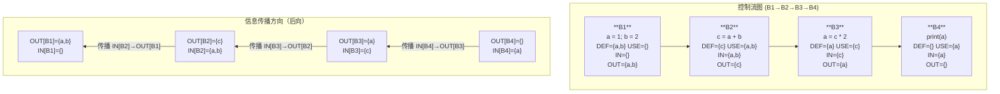

# 反编译器（03）· 数据流分析与活跃变量

## 概述与定位

> [!abstract] TL;DR
> 数据流分析（Data Flow Analysis）是反编译器的核心静态分析技术：在不执行程序的前提下，通过在控制流图（CFG）上迭代传播信息，推断每个程序点处变量的属性。活跃变量分析判断哪些变量"还有用"，到达定义追踪赋值来源，常量传播折叠已知常量——这三者共同支撑寄存器分配、死代码消除和 SSA 构建，是反编译器把机器码变成可读伪代码的关键步骤。

数据流分析的对象是 CFG（控制流图）而非原始字节序列。上一章我们已经把指令序列切割成基本块并连接成 CFG；本章在这张图上运行分析算法，为每个基本块的入口（IN）和出口（OUT）计算变量集合或格元素，进而驱动后续的去寄存器化、SSA 变换和类型恢复。

理解数据流分析需要三个层次的认识：

1. **理论框架**：半格与迭代不动点定理，保证算法终止并给出正确（保守）结果。
2. **具体分析实例**：活跃变量、到达定义、可用表达式、常量传播——各有不同方向、meet 算子和用途。
3. **工具实现**：IDA Hex-Rays microcode API 和 Binary Ninja MLIL SSA API 是反向工程师与这些分析打交道的实际接口。

---

## 原理与机制

### 数据流分析的通用框架

一个数据流分析由四元组 `(L, ∧, F, ι)` 确定：

| 元素 | 含义 |
|------|------|
| `L` | 半格（lattice），分析域；元素代表程序属性的抽象值 |
| `∧` | meet 算子（Greatest Lower Bound 或 Least Upper Bound） |
| `F` | 传递函数集合，每个基本块 B 对应一个 `f_B : L → L` |
| `ι` | 边界条件（入口/出口的初始值） |

**前向分析**（Forward Analysis）沿控制流方向传播信息：

```
IN[B]  = ∧ { OUT[P] | P ∈ pred(B) }   -- meet 所有前驱的 OUT
OUT[B] = f_B( IN[B] )                  -- 传递函数应用到 IN
```

**后向分析**（Backward Analysis）逆控制流方向传播：

```
OUT[B] = ∧ { IN[S] | S ∈ succ(B) }    -- meet 所有后继的 IN
IN[B]  = f_B( OUT[B] )                 -- 传递函数应用到 OUT
```

**迭代不动点算法**：

```
WorkList ← 所有基本块
while WorkList ≠ ∅:
    B ← WorkList.pop()
    重新计算 IN[B] 和 OUT[B]
    if OUT[B]（或 IN[B]）发生变化:
        将 B 的后继（或前驱）加入 WorkList
```

当半格满足有限上升链条件（无无限上升链），算法保证在有限步内收敛到不动点。

### 活跃变量与后向传播直觉

直觉上：**一个变量在某点"活跃"，意味着它当前持有的值在未来某条路径上还会被读取**。反编译器逆向时，寄存器里存的是什么？是否是一个真正的"变量"？活跃性分析回答这个问题——只有活跃的寄存器才对应有意义的变量，死寄存器可以被优化掉。

活跃性是后向分析，因为"未来是否被读"这个信息只能从出口往入口传播。

### Mermaid 示意图：活跃变量后向传播

下图展示四基本块 CFG 上的活跃变量分析，箭头方向为控制流方向，信息传播方向（后向）与之相反：



---

## 结构/算法/伪代码详解

### 1. 活跃变量分析（Liveness Analysis）

**定义**：变量 `v` 在程序点 `p` 是**活跃的（live）**，当且仅当存在一条从 `p` 出发的路径，沿该路径 `v` 在被重新赋值之前被读取（使用）。

**分析方向**：后向（Backward）

**局部量**：
- `USE[B]`：基本块 `B` 中，在任何本块内定义之前就被使用的变量集（先用）
- `DEF[B]`：基本块 `B` 中被定义（赋值）的变量集（包含所有赋值目标）

**数据流方程**：

```
IN[B]  = USE[B]  ∪  (OUT[B] - DEF[B])
OUT[B] = ∪ { IN[S] | S ∈ succ(B) }

初始化：
  IN[B]  = ∅  (对所有 B)
  OUT[B] = ∅  (对所有 B，出口块亦然)
```

**迭代算法伪代码**：

```python
# 假设已知 USE[B], DEF[B] 对所有基本块 B
for B in all_blocks:
    IN[B]  = set()
    OUT[B] = set()

changed = True
while changed:
    changed = False
    # 后向分析：按逆拓扑序遍历更好，但任意顺序也收敛
    for B in reversed(all_blocks):
        # 计算 OUT[B]
        new_out = set()
        for S in successors(B):
            new_out |= IN[S]

        # 计算 IN[B]
        new_in = USE[B] | (new_out - DEF[B])

        if new_out != OUT[B] or new_in != IN[B]:
            OUT[B] = new_out
            IN[B]  = new_in
            changed = True
```

**四基本块完整追踪示例**：

CFG 结构：`B1 → B2 → B3 → B4`（线性链）

| 块 | 指令 | DEF | USE |
|----|------|-----|-----|
| B1 | `a = 1; b = 2` | {a, b} | {} |
| B2 | `c = a + b` | {c} | {a, b} |
| B3 | `a = c * 2` | {a} | {c} |
| B4 | `print(a)` | {} | {a} |

初始状态：所有 IN = OUT = ∅

**第一轮迭代（后向，B4 → B3 → B2 → B1）**：

```
B4:
  OUT[B4] = ∪ succ(B4) IN[...] = {} (无后继)
  IN[B4]  = USE[B4] ∪ (OUT[B4] - DEF[B4])
           = {a} ∪ ({} - {})
           = {a}                        ← 变化

B3:
  OUT[B3] = IN[B4] = {a}
  IN[B3]  = USE[B3] ∪ (OUT[B3] - DEF[B3])
           = {c} ∪ ({a} - {a})
           = {c} ∪ {}
           = {c}                        ← 变化

B2:
  OUT[B2] = IN[B3] = {c}
  IN[B2]  = USE[B2] ∪ (OUT[B2] - DEF[B2])
           = {a,b} ∪ ({c} - {c})
           = {a,b} ∪ {}
           = {a,b}                      ← 变化

B1:
  OUT[B1] = IN[B2] = {a,b}
  IN[B1]  = USE[B1] ∪ (OUT[B1] - DEF[B1])
           = {} ∪ ({a,b} - {a,b})
           = {} ∪ {}
           = {}                         ← 不变（本就是空）
```

**第二轮迭代**：所有 IN/OUT 与第一轮结果相同，无变化 → **达到不动点，算法终止**。

最终结果：

| 块 | IN | OUT |
|----|----|-----|
| B1 | {} | {a, b} |
| B2 | {a, b} | {c} |
| B3 | {c} | {a} |
| B4 | {a} | {} |

**解读**：B1 对 a、b 的赋值均活跃（OUT[B1]={a,b}），说明这两个赋值不是死代码。B3 对 a 的重新赋值后，B2 对 c 的赋值（OUT[B3]={a}，c 不在其中）说明 c 在 B3 出口已死，c 的生命期只延伸到 B3 入口。

---

### 2. 到达定义（Reaching Definitions）

**定义**：程序中的一条定义 `d: x = expr`**到达**程序点 `p`，当且仅当存在一条从 `d` 到 `p` 的路径，该路径上不存在对变量 `x` 的其他定义（即 `d` 未被"杀死"）。

**分析方向**：前向（Forward）

**局部量**：
- `GEN[B]`：基本块 `B` 中产生的定义集（对每个变量取最后一条赋值）
- `KILL[B]`：基本块 `B` 中被杀死的定义集（程序中所有对同一变量 x 的其他定义，当 B 内赋值了 x 时）

**数据流方程**：

```
OUT[B] = GEN[B]  ∪  (IN[B] - KILL[B])
IN[B]  = ∪ { OUT[P] | P ∈ pred(B) }

初始化：
  IN[Entry] = ∅
  OUT[B]    = ∅  (对所有 B)
```

**迭代算法伪代码**：

```python
for B in all_blocks:
    IN[B]  = set()
    OUT[B] = set()
IN[entry] = set()   # 入口无到达定义

changed = True
while changed:
    changed = False
    for B in all_blocks:   # 前向分析：按拓扑序遍历
        # 计算 IN[B]
        new_in = set()
        for P in predecessors(B):
            new_in |= OUT[P]

        # 计算 OUT[B]
        new_out = GEN[B] | (new_in - KILL[B])

        if new_in != IN[B] or new_out != OUT[B]:
            IN[B]  = new_in
            OUT[B] = new_out
            changed = True
```

**用途**：
- 构建 **def-use 链**（Definition-Use Chain）：知道某个使用点 `u` 有哪些定义能到达，就能找出 `u` 的所有可能数据来源
- **SSA 构建**：当两条不同路径上的定义都能到达同一使用点时，需要在该点插入 Phi 函数（详见第 04 章）
- **类型传播**：通过 def-use 链把类型约束从赋值点传播到使用点

---

### 3. 可用表达式（Available Expressions）

**定义**：表达式 `x op y` 在程序点 `p` **可用（available）**，当且仅当从程序入口到 `p` 的**所有路径**上都计算过 `x op y`，且从最后一次计算到 `p` 之间 `x` 和 `y` 都未被重新赋值。

**分析方向**：前向（Forward）

**Meet 算子**：**交集**（∩）——只有所有路径都可用，才算真正可用（保守）

**局部量**：
- `e_gen[B]`：基本块 `B` 中计算且之后不被本块"杀死"的表达式集
- `e_kill[B]`：基本块 `B` 中被杀死的表达式集（B 对某变量赋值后，含该变量的所有表达式被杀死）

**数据流方程**：

```
OUT[B] = e_gen[B]  ∪  (IN[B] - e_kill[B])
IN[B]  = ∩ { OUT[P] | P ∈ pred(B) }

初始化：
  IN[Entry]  = ∅
  OUT[B]     = U  (全集，后续被交集缩小)  -- 注意：非 ∅
```

**用途**：
- **公共子表达式消除（CSE）**：若 `x op y` 在点 `p` 可用，则可以用前面计算的临时变量替代，无需重新计算
- **值编号（Value Numbering）**：全局值编号依赖可用表达式信息

> [!note] 与活跃变量的对称性
> 活跃变量（后向，∪ meet）是"存在一条路径未来会用"（存在量词）；可用表达式（前向，∩ meet）是"所有路径过去都算过"（全称量词）。meet 算子的选择（并集 vs 交集）直接对应量词的强弱。

---

### 4. 常量传播（Constant Propagation）

常量传播是比上述集合分析更精细的**格值（Lattice-value）分析**，追踪每个变量在每个程序点是否持有确定常量值。

**半格结构**：

```
      ⊤  （Top：未知，尚未分析到）
    / | \
   1  2  3  ...  （具体常量值）
    \ | /
      ⊥  （Bottom：不是常量，路径汇合导致值不确定）
```

**Meet 算子** `∧`（Greatest Lower Bound）：

```
⊤ ∧ x = x          -- Top 与任何值 meet，结果为那个值
k ∧ k = k           -- 相同常量 meet，结果不变
k₁ ∧ k₂ = ⊥        -- 不同常量 meet，退化为 Bottom（非常量）
⊥ ∧ x = ⊥          -- Bottom 吸收一切
```

**传递函数**（对变量 v 的赋值语句 `v = expr`）：

```python
def transfer_assign(state, var, expr):
    val = eval_expr(state, expr)   # 在当前格状态下求值
    new_state = state.copy()
    new_state[var] = val
    return new_state

def eval_expr(state, expr):
    if expr is Constant(k):
        return k
    elif expr is Var(v):
        return state[v]            # 可能是 ⊤、⊥ 或具体值
    elif expr is BinOp(op, e1, e2):
        v1, v2 = eval_expr(state, e1), eval_expr(state, e2)
        if v1 == BOTTOM or v2 == BOTTOM:
            return BOTTOM
        elif v1 == TOP or v2 == TOP:
            return TOP             # 操作数未知，结果未知
        else:
            return apply_op(op, v1, v2)   # 两个都是常量，折叠
```

**数据流方向**：前向（Forward）

**用途**：
- **死代码消除**：若条件表达式在某点的值为常量 `false`，则对应分支永不执行，反编译器可安全删除
- **表达式折叠**：将常量表达式替换为其值，简化伪代码输出
- **间接调用解析**：函数指针若为常量，可在反编译结果中直接显示目标函数名

> [!warning] 常量传播的局限
> 标准常量传播是**流敏感（flow-sensitive）**但**上下文不敏感（context-insensitive）**的。对于循环中变化的变量，算法会将其格值设为 ⊥。更强的**条件常量传播（Sparse Conditional Constant Propagation, SCCP）**结合了可达性分析，可以额外消除不可达分支，是 LLVM 等编译器的标配优化 pass。

---

## 工具视角/实战

### IDA Hex-Rays：微码 API

IDA 的 Hex-Rays 反编译器在内部使用多阶段微码（Microcode），数据流分析在微码层进行。

**访问反编译结果与 ctree**：

```python
import ida_hexrays
import ida_kernwin

def analyze_liveness():
    ea = ida_kernwin.get_screen_ea()
    # 反编译当前光标所在函数
    cfunc = ida_hexrays.decompile(ea)
    if cfunc is None:
        print("反编译失败")
        return

    # cfunc.body 是根 cinsn_t（ctree 根节点）
    # cfunc.lvars 包含所有局部变量（含已消除的寄存器变量）
    for lvar in cfunc.lvars:
        print(f"局部变量: {lvar.name}, 类型: {lvar.type()}, "
              f"是寄存器变量: {lvar.is_reg_var()}")

analyze_liveness()
```

**使用微码 API 访问活跃变量信息**：

```python
import ida_hexrays

def inspect_microcode():
    ea = ida_kernwin.get_screen_ea()
    # 获取微码函数（maturity 级别越高，分析越深）
    mba = ida_hexrays.gen_microcode(
        ea,
        flags=ida_hexrays.DECOMP_WARNINGS,
        maturity=ida_hexrays.MMAT_LVARS   # LVARS 阶段后活跃变量分析已完成
    )
    if mba is None:
        print("微码生成失败")
        return

    for i in range(mba.qty):
        mblock = mba.get_mblock(i)
        print(f"Block {i}: "
              f"start={hex(mblock.start)}, "
              f"end={hex(mblock.end)}")
        # mblock.dead_def: 死定义（赋值给非活跃变量）
        # mblock.dead_var: 死变量集合

inspect_microcode()
```

**Ctree Visitor 遍历使用/定义**：

```python
import ida_hexrays

class DefUseVisitor(ida_hexrays.ctree_visitor_t):
    def __init__(self):
        super().__init__(ida_hexrays.CV_FAST)
        self.defs  = []   # 赋值目标
        self.uses  = []   # 变量读取

    def visit_expr(self, expr):
        if expr.op == ida_hexrays.cot_asg:  # 赋值表达式
            if expr.x.op == ida_hexrays.cot_var:
                self.defs.append(expr.x.v.idx)
        elif expr.op == ida_hexrays.cot_var:
            self.uses.append(expr.v.idx)
        return 0  # 继续遍历

cfunc = ida_hexrays.decompile(ida_kernwin.get_screen_ea())
visitor = DefUseVisitor()
visitor.apply_to(cfunc.body, None)
print(f"定义: {visitor.defs}")
print(f"使用: {visitor.uses}")
```

---

### Binary Ninja：MLIL SSA 数据流

Binary Ninja 在 Medium Level IL（MLIL）的 SSA 形式中直接暴露 def-use 和 use-def 链，无需手动实现数据流方程。

**遍历 SSA 变量版本并查询活跃性**：

```python
import binaryninja as bn

def analyze_mlil_ssa(binary_path: str, func_addr: int):
    with bn.open_view(binary_path) as bv:
        func   = bv.get_function_at(func_addr)
        mlil   = func.mlil
        mlil_ssa = mlil.ssa_form

        # 遍历所有 SSA 变量（每个版本对应一个定义点）
        for ssa_var in mlil_ssa.ssa_vars:
            defn = mlil_ssa.get_ssa_var_definition(ssa_var)
            uses = mlil_ssa.get_ssa_var_uses(ssa_var)

            if defn is None:
                # 无定义点 → 函数参数或 Phi 函数本身
                print(f"SSA var {ssa_var} (参数或来自 Phi)")
            else:
                # def → use 链
                print(f"SSA var {ssa_var}:")
                print(f"  定义于: 地址={hex(defn.address)}, "
                      f"指令={defn}")
                if not uses:
                    print(f"  [死变量] 无使用点 → 可能为死赋值")
                else:
                    for u in uses:
                        print(f"  使用于: {hex(u.address)} → {u}")

analyze_mlil_ssa("/path/to/binary", 0x401000)
```

**通过到达定义识别需要 Phi 函数的汇合点**：

```python
def find_phi_candidates(func):
    """找出需要插入 Phi 函数的变量和基本块"""
    mlil_ssa = func.mlil.ssa_form
    phi_nodes = {}

    for block in mlil_ssa.basic_blocks:
        for insn in block:
            if insn.operation == bn.MediumLevelILOperation.MLIL_SET_VAR_SSA_FIELD:
                continue
            # Phi 函数：MLIL_SET_VAR_PHI
            if insn.operation == bn.MediumLevelILOperation.MLIL_VAR_PHI:
                var   = insn.dest.var
                srcs  = insn.src   # 来自不同前驱的 SSA 版本列表
                phi_nodes.setdefault(var.name, []).append({
                    'block': block.index,
                    'sources': [str(s) for s in srcs]
                })

    for var_name, phis in phi_nodes.items():
        print(f"变量 {var_name} 的 Phi 节点位置: {phis}")

find_phi_candidates(bv.get_function_at(0x401000))
```

> [!tip] 实战建议
> 在 Binary Ninja 中，`var_1#0`、`var_1#1` 这类带 `#N` 后缀的 SSA 变量名直接对应 liveness 区间：`#0` 和 `#1` 是两个独立的活跃区间，如果它们在某汇合点被 Phi 合并，说明该变量在对应基本块的两条前驱路径上有不同的活跃定义。检查 Phi 函数的存在即可快速定位数据流汇合点。

---

## 安全性与正确使用

### 反编译器中的数据流分析与安全分析

**污点分析（Taint Analysis）是数据流分析的扩展**：将"变量是否携带污点"作为格元素，用与活跃变量类似的方程传播。IDA 的 taint 插件和 Binary Ninja 的脚本化污点追踪均基于此。

> [!warning] 数据流分析的保守性陷阱
> 数据流分析给出的是**安全近似（Safe Approximation）**。活跃变量分析的结果包含所有"可能活跃"的变量——它可能把实际上不活跃的变量也包含进去（过估计）。这意味着：
> - 反编译器不会因为"误删活跃变量"而引入 bug（保守安全）
> - 但可能保留一些实际上没用的临时变量，导致伪代码稍显冗余

**混淆代码对数据流分析的对抗**：

1. **插入无用定义**：在每个基本块开头插入 `x = x + 0` 之类的无效赋值，人为增大 DEF 集合，干扰活跃变量计算
2. **不透明谓词（Opaque Predicates）**：条件跳转永远走某条分支，但静态分析无法判定，导致死分支被当作活跃代码处理
3. **别名（Aliasing）**：通过指针间接写内存，使分析无法确定 DEF 集合，导致必须保守地认为所有变量在指针写后仍活跃

**应对策略**：
- 先运行常量传播消除不透明谓词（如 SCCP）
- 使用点分析（Points-to Analysis）建模指针，精化别名信息
- 对混淆代码先去混淆（如 MBA 化简），再运行数据流分析

> [!danger] 不要依赖反编译伪代码做安全结论
> 数据流分析的结果依赖 CFG 的正确性。若目标程序使用了间接跳转（`jmp [rax]`）且分析器未能恢复完整的 CFG，活跃变量分析会漏掉某些路径，导致误删（在编译器优化场景）或误报（在安全分析场景）。始终结合动态分析交叉验证静态结果。

---

## 小结

本章围绕数据流分析框架展开，核心要点如下：

| 分析类型 | 方向 | Meet 算子 | 主要用途 |
|----------|------|-----------|----------|
| 活跃变量 | 后向 | 并集（∪） | 寄存器分配、死代码消除、变量生命期 |
| 到达定义 | 前向 | 并集（∪） | def-use 链、SSA 构建前置 |
| 可用表达式 | 前向 | 交集（∩） | CSE、值编号 |
| 常量传播 | 前向 | 格 meet（∧） | 常量折叠、死分支消除 |

四种分析构成了反编译器从机器码到结构化伪代码的核心管线：到达定义确定 Phi 函数插入位置（SSA 构建）→ 常量传播消除无用分支 → 活跃变量分析确定变量生命期 → 死代码消除清洁伪代码。

下一章将在到达定义的基础上，详细展开 SSA 形式的构建算法（包括支配树与 Phi 函数插入），以及 SSA 如何使数据流分析的实现更加高效和精确。

另见：[[04.SSA形式与Phi函数]]——到达定义直接驱动 Phi 函数的插入决策，两章知识紧密衔接。

---

## 相关阅读

- Aho, Lam, Sethi, Ullman，《编译器：原理、技术与工具》（Dragon Book）第 9 章：数据流分析
- Cytron et al., "Efficiently Computing Static Single Assignment Form and the Control Dependence Graph"，ACM TOPLAS 1991 — SSA 构建原始论文，依赖到达定义
- Cooper, Harvey, Kennedy，"A Simple, Fast Dominance Algorithm"，2001 — 高效支配树算法，用于 SSA 构建
- Kildall，"A Unified Approach to Global Program Optimization"，POPL 1973 — 数据流分析框架的奠基论文
- IDA Hex-Rays SDK 文档，`ida_hexrays` 模块 — microcode API 参考
- Binary Ninja 官方文档，Medium Level IL — MLIL SSA API 参考

---

⬅️ 上一篇 [[02.控制流图CFG构建与基本块]] ｜ 🏠 [[00.反编译器与反汇编引擎原理总览]] ｜ 下一篇 [[04.SSA形式与Phi函数]] ➡️
