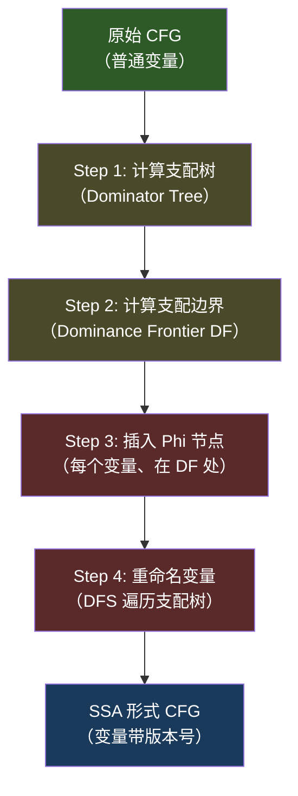

# SSA形式与Phi函数

## 概述与定位

> [!abstract] TL;DR
> SSA（Static Single Assignment，静态单赋值）是现代编译器与反编译器的核心中间表示形式。其核心约束为：**每个变量在整个程序中只被赋值一次**。当控制流在 CFG 汇合点合并时，引入 **Phi（φ）函数**来"选择"不同来源路径的值。SSA 使 def-use 关系完全显式，大幅简化了数据流分析、死代码消除、常量传播等优化。反编译器（Hex-Rays、Ghidra、Binary Ninja）均在内部使用 SSA 形式进行分析，最终再将其"消除"回普通变量以生成可读伪代码。

传统的机器码程序中，同一寄存器（如 `eax`）可以被反复写入——在不同基本块中代表完全不同的值。这给数据流分析带来极大困难：要判断"某处 `eax` 的值从哪里来"，需要跨越整个 CFG 求解不动点方程。

SSA 形式通过"重命名"解决这一问题：把原本的 `eax` 在不同定义点拆分为 `eax₁`、`eax₂`、`eax₃`……每个版本恰好对应一处赋值，每个使用点指向唯一的一处定义。结果是：

- **Use-Def 链天然显式**：无需任何分析，直接查看变量名即可追溯来源
- **数据流问题局部化**：许多全局问题退化为局部检查
- **优化算法大幅简化**：死代码、常量传播、值编号等算法在 SSA 上效率极高

本章涵盖 SSA 的定义与动机、Cytron 1991 构建算法（支配边界计算、Phi 插入、重命名三步）、SSA 上的优化、SSA 消除，以及 IDA Hex-Rays microcode、Binary Ninja MLIL SSA、Ghidra P-Code、angr VEX IR 中 SSA 的实际形态与访问方法。

---

## 原理与机制

### SSA 的核心约束

SSA 形式对程序施加两条约束：

1. **单赋值（Single Assignment）**：程序中每个变量（版本）恰好被赋值一次
2. **唯一到达定义**：程序中每个变量使用点，有且仅有一个定义能到达该使用点

当控制流存在分支汇合时，这两条约束产生矛盾——同一个变量在不同分支中被赋值，在汇合点后使用时无法区分来自哪一条路径。解决方案是引入 **Phi 函数**：

```
x₃ = φ(x₁, x₂)
```

其含义是"若控制流从前驱块 B1 到达，则 x₃ = x₁；若从前驱块 B2 到达，则 x₃ = x₂"。Phi 函数是伪指令，不对应任何实际机器指令，仅在 SSA 内部分析期间存在，最终须在代码生成前消除。

### SSA 构建总览（Cytron 1991 算法）

Cytron 等人在 1991 年提出了高效的 SSA 构建算法，分为三个步骤：



### Step 1：计算支配边界（Dominance Frontier）

**支配关系回顾**：节点 A "支配"节点 B（A dom B），当且仅当从 CFG 入口到 B 的所有路径都经过 A。每个节点的"直接支配者"（Immediate Dominator，idom）构成支配树。

**支配边界的直觉**：DF(A) 是所有"A 的定义能影响、但 A 的支配权刚好消失"的节点集合。更精确地：

> DF(A) = { B | ∃前驱 P of B，使得 A dom P，但 A 不严格支配 B }

直观理解：A 支配了通往 B 的某条路径（通过前驱 P），但 B 还有其他前驱不经过 A——说明 A 的定义在 B 处可能与其他路径的定义"汇合"，需要插入 Phi。

**计算算法**（基于支配树反向遍历）：

对每条 CFG 边 (P→B)，从 P 开始沿支配树向上遍历，直到 B 的直接支配者（idom(B)）为止，将 B 加入路径上每个节点的 DF 集合：

```
for each basic block B in CFG:
    for each predecessor P of B:
        runner = P
        while runner != idom(B):
            DF[runner].add(B)
            runner = idom(runner)
```

该算法时间复杂度为 O(|E| · depth(dominator_tree))，在实践中接近线性。

### Step 2：插入 Phi 函数

知道支配边界后，确定在哪些位置插入哪些变量的 Phi 函数：

**核心思想**：如果变量 v 在块 d 中有定义，则 d 的任何支配边界处都可能需要 Phi——因为从 d 流过来的 v 值可能在那里与另一条路径的 v 值汇合。而插入 Phi 本身也算一次"定义"，因此需要迭代传播：

```
for each variable v:
    # 找到所有对 v 赋值的基本块
    Defs_v = { B | B 中存在对 v 的赋值 }
    W = copy(Defs_v)          # 工作集（待处理队列）
    HasPhiFor_v = {}           # 已插入 phi 的块集合

    while W is not empty:
        d = W.pop_any()
        for each block b in DF[d]:
            if b not in HasPhiFor_v:
                # 在 b 的开头插入: v = φ(v, v, ..., v)
                # 参数个数 = b 的前驱块数量
                insert_phi(b, v, num_predecessors(b))
                HasPhiFor_v.add(b)
                # b 现在也"定义"了 v，继续传播
                if b not in Defs_v:
                    W.add(b)
```

**最小 SSA（Minimal SSA）vs 剪枝 SSA（Pruned SSA）**：上述算法产生"最小 SSA"——只要支配边界有需要就插入 Phi，但某些 Phi 的结果可能没有任何使用（死 Phi）。若在插入前先做活跃变量分析，只在变量活跃的位置插入 Phi，则产生更精简的"剪枝 SSA"，减少无效节点。

### Step 3：重命名变量

有了 Phi 节点骨架，最后一步是给所有变量打上版本号，使每个定义唯一：

**算法**：深度优先遍历支配树（DFS），为每个变量维护一个版本栈（counter + stack）：

```
Counter[v] = 0           # 版本计数器
Stack[v] = [0]           # 版本栈（底部是初始版本）

function Rename(block B):
    # 处理 B 开头的 Phi 函数左侧（定义新版本）
    for each phi node "v = φ(...)" in B:
        i = NewName(v)   # Counter[v]++；将新版本压栈
        重命名该 Phi 左侧为 v_i

    # 处理 B 中的普通指令
    for each instruction "x = op(y, z, ...)" in B (非 Phi):
        for each use y in instruction:
            替换 y 为 Stack[y].top()  # 使用当前栈顶版本
        i = NewName(x)   # 为定义创建新版本
        重命名定义为 x_i

    # 填写后继块 Phi 节点中对应本块的参数
    for each successor S of B:
        for each phi node "v = φ(..., slot_for_B, ...)" in S:
            将 slot_for_B 填为 Stack[v].top()

    # 递归处理支配树子节点
    for each child C of B in dominator tree:
        Rename(C)

    # 退出 B 时：弹出本块在 B 中创建的所有版本
    for each variable v 在 B 中被定义（含 Phi）:
        Stack[v].pop()
```

退出块时弹栈，保证了只有"支配当前点"的定义版本才在栈顶——这正是支配关系的语义。

---

## 结构/算法/伪代码详解

### SSA 代码示例一：if 分支

以最典型的 if-else 分支为例，展示 SSA 转换过程：

```c
// 原始代码（非 SSA）
x = 1
if (cond):
    x = 2
// 汇合点
y = x + 1
```

对应的 CFG 有三个基本块：入口块（`x=1, if(cond)`）、then 块（`x=2`）、汇合块（`y=x+1`）。汇合块有两个前驱，因此在其开头需要插入 Phi：

```
// SSA 形式
// 入口块 B1
x₁ = 1
if (cond) goto B2 else goto B3

// then 块 B2
x₂ = 2
goto B3

// 汇合块 B3（B1 和 B2 的共同后继）
x₃ = φ(x₁, x₂)    ← Phi 函数：从 B1 来则 x₃=x₁，从 B2 来则 x₃=x₂
y₁ = x₃ + 1
```

**Phi 参数的顺序**对应前驱块的顺序——`φ(x₁, x₂)` 第一个参数 `x₁` 对应前驱 B1，第二个参数 `x₂` 对应前驱 B2。

### SSA 代码示例二：循环

循环是 Phi 函数最经典的应用场景，因为循环头有两个前驱：初始入口和循环回边：

```c
// 原始代码
i = 0
while (i < 10):
    i = i + 1
// 循环后使用 i
```

```
// SSA 形式
// 前置块（循环前）
i₁ = 0
goto LOOP_HEADER

// 循环头 LOOP_HEADER（前驱：前置块 + 循环体末尾）
i₂ = φ(i₁, i₃)    ← 关键！初始值 i₁ 或循环递增后的 i₃
if (i₂ < 10) goto LOOP_BODY else goto LOOP_EXIT

// 循环体
i₃ = i₂ + 1
goto LOOP_HEADER    ← 回边，将 i₃ 传回 Phi

// 循环后（LOOP_EXIT）
// 使用 i₂（循环退出时的值，即 10）
```

循环 Phi `i₂ = φ(i₁, i₃)` 体现了归纳变量分析的起点：分析器可以识别 i₂ 是从 i₁=0 出发、每次加 1 递增的归纳变量，进而推导循环次数、范围等。

### 支配边界计算示例

考虑如下 CFG（六个块）：

```
Entry → B1 → B2
              ↓
        B1 → B3 → B4 → B2（回边）
                   ↓
                  B5 → Exit
```

简化后取一个有代表性的例子：

```
Entry
  ├→ A
  │   ├→ B
  │   └→ C
  └→ D → C
```

- C 有两个前驱：A 和 D
- idom(C) = Entry（Entry 支配 A、D，也支配 C）
- 计算 DF(A)：遍历 A 的后继 B 和 C
  - 边 A→C：runner=A，idom(C)=Entry；A≠Entry，所以 C ∈ DF(A)，runner=idom(A)=Entry，Entry=idom(C)，停止
  - 故 DF(A) = {C}
- 计算 DF(D)：类似，DF(D) = {C}
- 若变量 v 在 A 和 D 中定义，则需在 C 处插入 Phi

### SSA 上的优化

SSA 形式大幅简化了多种经典优化：

**1. 死代码消除（Dead Code Elimination, DCE）**

在 SSA 中，若变量 v_n 没有任何使用者，则定义 v_n 的指令是死代码，可以直接删除。无需构造 use-def 链——版本号保证了"是否有使用"一目了然。

```
x₂ = y₁ + z₁    # 若 x₂ 从未被使用 → 删除
```

**2. 稀疏条件常量传播（Sparse Conditional Constant Propagation, SCCP）**

SCCP 是比单纯常量折叠更强的分析。在 SSA 上，每个变量维护一个"格值"（lattice value）：

- `⊤`（Top）= 未知/未分析
- `常量 c` = 确定为常量 c
- `⊥`（Bottom）= 不是常量（值不定）

传播规则：
- `Phi(c, c) = c`（两条路径值相同 → 仍是常量）
- `Phi(c₁, c₂) = ⊥`（两条路径值不同 → 非常量）
- `Phi(⊤, c) = c`（一条路径未到达 → 另一条的值）

结合控制流可达性分析，SCCP 可发现编译后代码中"实际上永远不会执行"的分支并删除死分支。

**3. 全局值编号（Global Value Numbering, GVN）**

在 SSA 中，两个具有相同计算结构的表达式若产生相同的"值编号"，即可合并（消除公共子表达式）。由于 SSA 使每个 def 唯一，相同表达式一定对应相同的 SSA 值，无需担心别名赋值打破等价性。

**4. 归纳变量分析**

循环 Phi 节点 `i = φ(init, i + step)` 直接暴露了归纳变量的初始值和步长，为强度削减（Strength Reduction）、循环展开、边界检查消除提供基础。

### SSA 消除（Destruction）

反编译器最终需要将 SSA 形式转回"普通"变量（用于生成 C 伪代码或机器码）。Phi 函数须被消除：

**朴素方法：插入 copy**

在每个前驱块末尾为 Phi 参数插入赋值：

```
// 原 SSA
B1: x₁ = 1; goto B3
B2: x₂ = 2; goto B3
B3: x₃ = φ(x₁, x₂)

// 消除 Phi 后（朴素）
B1: x₁ = 1; x₃ = x₁; goto B3
B2: x₂ = 2; x₃ = x₂; goto B3
B3: （删去 Phi）
```

**问题：Lost Copy（丢失复制）与 Swap 问题**

当多个变量互相交换时，朴素插入 copy 会出现错误：

```
// SSA：a₂ = φ(b₁, a₁)，b₂ = φ(a₁, b₁)
// 若同时执行（语义上并行），朴素展开：
//   a₂ = b₁; b₂ = a₁;  ← 顺序执行会把 a₁ 覆盖
```

**Boissinot 2009 算法**：正确处理并发 Phi 语义，通过识别"交换集合"（swap sets）和"依赖链"（dependency chains），将并行赋值序列化为有序赋值序列（有时引入临时变量）。现代反编译器（包括 Hex-Rays）使用类似策略。

---

## 工具视角/实战

### IDA Pro：Hex-Rays Microcode 中的 SSA

Hex-Rays 反编译器内部维护多层 microcode（从低到高：mmat_t 枚举），在多个层次上隐含或显式使用 SSA。microcode 变量（`mop_t`）带有版本信息，可通过 `mba_t`（Microcode Block Array）访问：

```python
import ida_hexrays
import idaapi

# 获取当前光标处函数的微码
ea = idaapi.get_screen_ea()
cfunc = ida_hexrays.decompile(ea)
mba = cfunc.mba

print(f"函数起始: {mba.entry_ea:#x}")
print(f"基本块数量: {mba.qty}")

# 遍历所有基本块及其 microcode 指令
for i in range(mba.qty):
    blk = mba.get_mblock(i)
    print(f"\nBlock {i}: {blk.start:#x} - {blk.end:#x}")
    insn = blk.head
    while insn is not None:
        print(f"  [{insn.ea:#x}] {insn._print()}")
        insn = insn.next
```

**访问更高层次的 microcode（查看 SSA 形态）**：

```python
import ida_hexrays

class MbaMaturityHook(ida_hexrays.Hexrays_Hooks):
    """在特定 maturity 层次拦截 microcode 图"""
    def maturity(self, cfunc, new_maturity):
        if new_maturity == ida_hexrays.MMAT_GLBOPT2:
            mba = cfunc.mba
            print(f"=== GLBOPT2 阶段 microcode（含 SSA 版本信息）===")
            for i in range(mba.qty):
                blk = mba.get_mblock(i)
                insn = blk.head
                while insn is not None:
                    # 打印指令（含变量版本号）
                    print(f"  Block {i}: {insn._print()}")
                    insn = insn.next
        return 0

hook = MbaMaturityHook()
hook.hook()
# 触发反编译
ida_hexrays.decompile(here())
hook.unhook()
```

注意：Hex-Rays 的 SSA 版本号在 `mop_t` 内部以 `serial` 字段体现，但通过 `_print()` 方法输出时可以观察到带有编号的变量名。

### Binary Ninja：MLIL SSA 形式

Binary Ninja 提供了最用户友好的 SSA 访问接口，通过 `mlil.ssa_form` 属性直接获取 SSA 视图：

```python
import binaryninja as bn

bv = bn.open_view("/path/to/binary")
func = bv.get_function_at(0x401000)

# 获取 MLIL SSA 形式
mlil_ssa = func.mlil.ssa_form

# 遍历所有基本块中的 SSA 指令
for block in mlil_ssa:
    print(f"\n基本块 {block.start:#x}")
    for insn in block:
        print(f"  [{insn.address:#x}] {insn}")

# 查找某个 SSA 变量的定义
# SSA 变量格式：var#N（变量名#版本号）
for var in func.mlil.ssa_form.vars:
    defn = mlil_ssa.get_ssa_var_definition(var)
    uses = mlil_ssa.get_ssa_var_uses(var)
    print(f"变量 {var.var.name}#{var.version}: "
          f"定义于 {defn}, 使用 {len(list(uses))} 次")
```

Binary Ninja 的 Phi 节点以 `MLIL_VAR_PHI` 操作码表示，参数列表即为不同前驱路径的 SSA 版本：

```python
# 查找所有 Phi 指令
from binaryninja import MediumLevelILOperation
for block in mlil_ssa:
    for insn in block:
        if insn.operation == MediumLevelILOperation.MLIL_VAR_PHI:
            dest_var = insn.dest    # Phi 结果变量（带版本）
            src_vars = insn.src     # 来自各前驱的源版本列表
            print(f"Phi: {dest_var} = φ({', '.join(str(v) for v in src_vars)})")
```

### Ghidra：P-Code 中的 MULTIEQUAL（Phi）

Ghidra 的 High P-Code（反编译用的高层 P-Code）用 `MULTIEQUAL` 操作表示 Phi 函数，`VarnodeAST` 表示 SSA 变量节点：

```java
// GhidraScript（Java）访问 High P-Code 的 MULTIEQUAL
import ghidra.app.decompiler.*;
import ghidra.program.model.pcode.*;

DecompInterface ifc = new DecompInterface();
ifc.openProgram(currentProgram);

Function func = getFunctionContaining(currentAddress);
DecompileResults results = ifc.decompileFunction(func, 60, monitor);
HighFunction hfunc = results.getHighFunction();

// 遍历所有 P-Code 操作，寻找 MULTIEQUAL（即 Phi）
Iterator<PcodeOpAST> ops = hfunc.getPcodeOps();
while (ops.hasNext()) {
    PcodeOpAST op = ops.next();
    if (op.getOpcode() == PcodeOp.MULTIEQUAL) {
        VarnodeAST output = (VarnodeAST) op.getOutput();
        println("Phi 节点输出: " + output);
        for (int i = 0; i < op.getNumInputs(); i++) {
            VarnodeAST input = (VarnodeAST) op.getInput(i);
            println("  来自路径 " + i + ": " + input);
        }
    }
}
```

Ghidra 的 `VarnodeAST` 对象携带唯一的 `uniqueId`，可用于在 SSA 图中追踪 def-use 链：

```java
// 追踪某变量的 def-use 链
VarnodeAST v = /* 某个 varnode */;
PcodeOpAST defOp = v.getDef();           // 获取定义该变量的 PCode 操作
Iterator<PcodeOpAST> useOps = v.getDescendants(); // 获取所有使用该变量的操作
```

### angr / VEX IR 中的 SSA

angr 使用 Valgrind 的 VEX IR 作为底层 IR。VEX 在 SuperBlock（超级块）粒度内使用 SSA 形式：临时变量 `t0`、`t1`、`t2`……在每个 SuperBlock 内部满足单赋值约束：

```python
import angr

proj = angr.Project("/path/to/binary", auto_load_libs=False)

# 提升基本块到 VEX IR（即得到 SSA 形式的 IR）
block = proj.factory.block(0x401000)
irsb = block.vex
irsb.pp()  # 打印 VEX IR

# VEX IR 示例输出：
# t0 = GET:I64(offset=56)          ← 读取寄存器（rax）
# t1 = GET:I64(offset=64)          ← 读取寄存器（rcx）
# t2 = Add64(t0, t1)               ← 计算：t2 是 SSA 新版本
# PUT(offset=56) = t2              ← 写回寄存器

# 访问 VEX IR 语句列表
for stmt in irsb.statements:
    print(type(stmt).__name__, stmt)

# VEX 的 Phi 等价物：在跨 SuperBlock 时由 angr 的分析框架处理
# angr 的 SimState 维护符号值，CFG 汇合点通过 merge 操作融合
state1 = proj.factory.blank_state(addr=0x401000)
simgr = proj.factory.simulation_manager(state1)
simgr.explore(find=0x401100, avoid=0x401050)
```

VEX IR 内的单赋值保证了 angr 符号执行时临时变量不会被意外覆盖，跨基本块的 Phi 语义则由 `SimState.merge()` 处理（合并多条路径的符号约束）。

### 工具对比总览

| 工具 | SSA 形态 | Phi 节点名称 | 访问接口 |
|------|----------|--------------|----------|
| IDA Hex-Rays | microcode 内部 SSA | 内部版本号（serial） | `mba_t`、`mop_t`，需 maturity hook |
| Binary Ninja | MLIL SSA 形式 | `MLIL_VAR_PHI` | `func.mlil.ssa_form`，`get_ssa_var_*` |
| Ghidra | High P-Code SSA | `MULTIEQUAL` | `DecompInterface`，`VarnodeAST` |
| angr VEX | SuperBlock 内 SSA | 临时变量 `tN` | `proj.factory.block().vex` |

---

## 安全性与正确使用

> [!caution] 合规边界
> 本章介绍的 SSA 分析技术用于：CTF 逆向题分析、自有程序调试与优化研究、安全研究（漏洞分析、恶意软件逆向）。**不应将这些技术用于未经授权地破解第三方商业软件、绕过 DRM/版权保护机制，或在未获授权的系统上进行代码分析**。所有工具（IDA Pro、Binary Ninja、Ghidra）均有各自的使用条款，请确保在合法授权的环境下使用。

### 常见陷阱与注意事项

**1. Phi 函数参数顺序依赖实现**

不同工具对 Phi 参数的排列方式不同——有些按前驱块编号排列，有些按 CFG 遍历顺序。在编写分析脚本时，务必通过 API 查询"第 N 个参数对应哪个前驱块"，而不要依赖固定的参数位置。

**2. SSA 消除的正确性**

朴素的 Phi 消除（插入 copy）在存在"循环依赖"的 Phi 时会产生错误结果。若基于 SSA 实现代码生成或转换，需使用 Boissinot 2009 或类似的正确序列化算法，尤其是在处理互相依赖的 Phi（如寄存器交换场景）时。

**3. 剪枝 SSA vs 最小 SSA**

最小 SSA 中可能存在"死 Phi"（结果从不被使用的 Phi 函数）。在基于 SSA 做分析时，若未先做 DCE，这些死 Phi 可能导致误报（如误以为某变量有多个来源）。Binary Ninja 等工具提供的 SSA 通常已经过剪枝。

**4. angr 的路径爆炸**

VEX IR 的 SuperBlock 内 SSA 保证了局部正确性，但 angr 在进行跨块的符号执行时，路径数量随条件分支指数增长。对循环程序使用 `simgr.explore()` 时，务必设置 `step_func` 或 `find`/`avoid` 约束，或启用 veritesting（合并技术）避免路径爆炸。

**5. Hex-Rays microcode 层次选择**

在不同 maturity 层次钩入时，SSA 的完整性不同：过早钩入（如 `MMAT_PREOPTIMIZED`）时变量可能尚未完整 SSA 化；过晚钩入（如 `MMAT_GENERATED`）时 SSA 已部分被消除。建议在 `MMAT_GLBOPT1` 或 `MMAT_GLBOPT2` 层次进行 SSA 相关分析。

---

## 小结

SSA（Static Single Assignment）形式通过"每个变量只被赋值一次"的约束，将程序的 def-use 关系完全显式化，是现代编译器与反编译器内部 IR 的基石。

Cytron 1991 算法以三步完成 SSA 构建：(1) 计算支配边界 DF，确定 Phi 插入位置；(2) 对每个变量在其 DF 处迭代插入 Phi 节点；(3) DFS 遍历支配树，通过版本栈完成重命名。最终产生每个变量唯一定义、每个使用点唯一来源的 SSA CFG。

在 SSA 上，死代码消除、稀疏条件常量传播（SCCP）、全局值编号（GVN）、归纳变量分析等优化的实现都极大简化。反编译器完成分析后，通过 Phi 消除（含 Boissinot 序列化算法）将 SSA 还原为普通赋值形式，最终生成可读的 C 伪代码。

四大工具对 SSA 的暴露方式各异：IDA Hex-Rays 通过 microcode maturity hook 访问；Binary Ninja 通过 `mlil.ssa_form` 提供最友好的接口；Ghidra 以 `MULTIEQUAL` P-Code 操作表示 Phi；angr VEX IR 在 SuperBlock 内天然 SSA。掌握这些接口，是编写自定义反编译分析插件的前提。

---

## 相关阅读

- [[03.数据流分析与活跃变量]] — 到达定义分析为 Phi 插入提供活跃性信息（剪枝 SSA 的基础）
- [[05.中间表示IR设计：LLVM-IR与VEX与P-Code]] — SSA 是 LLVM IR 的设计基础；本章 Phi 与 LLVM `phi` 指令直接对应
- [[02.控制流图CFG构建与基本块]] — SSA 构建依赖 CFG 和支配树，与本章紧密衔接
- [[07.Hex-Rays反编译器内部机制]] — microcode SSA 的完整生命周期与优化流程
- [[08.Ghidra反编译器与P-Code分析]] — MULTIEQUAL 操作与 High P-Code 分析框架详解
- [[11.符号执行与angr框架]] — angr VEX IR SSA 与符号执行路径合并机制

**扩展资料**：
- Cytron et al., "Efficiently Computing Static Single Assignment Form and the Control Dependence Graph"（1991）— SSA 奠基论文
- Boissinot et al., "Revisiting Out-of-SSA Translation for Correctness, Code Quality, and Efficiency"（2009）— Phi 消除正确性
- Cooper & Torczon, *Engineering a Compiler*（第 2 版）第 9 章 — SSA 算法教科书讲解

---

⬅️ 上一篇 [[03.数据流分析与活跃变量]] ｜ 🏠 [[00.反编译器与反汇编引擎原理总览]] ｜ 下一篇 [[05.中间表示IR设计：LLVM-IR与VEX与P-Code]] ➡️
