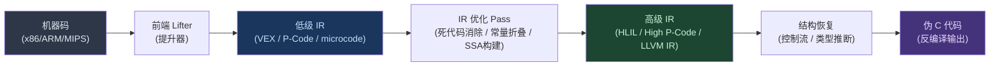

# 反编译器（05）· 中间表示IR设计：LLVM-IR与VEX与P-Code

## 概述与定位

> [!abstract] TL;DR
> IR（中间表示）是反编译器/反汇编器将机器码抽象为可分析结构的核心枢纽。LLVM IR 以 SSA 三地址码和强类型系统为基础，是编译器优化的黄金标准；VEX IR 是 Valgrind/angr 使用的轻量级精确语义 IR，天然适合符号执行；Ghidra P-Code 由 Sleigh 语言驱动，具备强可扩展性，专为逆向工程设计；Binary Ninja 的 MLIL/HLIL 则以分层抽象向用户暴露开放 API。理解这四种 IR 的设计哲学与结构差异，是深入掌握现代反编译器内核的必要前提。

反编译器的核心挑战在于：**如何从没有类型、没有变量名、没有控制结构的机器码中，恢复出人类可读的高级语言程序？** IR 是解决这一挑战的关键中间层。

### IR 的三大价值

**1. 架构无关性**

无论输入是 x86、ARM、MIPS 还是 RISC-V 的机器码，经过"提升"（Lift）之后，都转化为统一的 IR 表示。分析算法只需针对 IR 编写一次，即可复用于所有支持的架构。angr 支持数十种架构，其核心原因正是底层统一使用 VEX IR。

**2. 形式化语义（Formal Semantics）**

机器指令的语义往往依赖 CPU 手册中复杂的标志位规则（如 x86 的 EFLAGS）。IR 将这些隐式语义显式化：每个操作都有精确的数学定义，消除歧义，便于形式化验证和符号执行。

**3. Pass 流水线（Pass Pipeline）**

在 IR 层面可以应用一系列分析与变换 Pass，例如：
- 死代码消除（Dead Code Elimination）
- 常量折叠（Constant Folding）
- 内存到寄存器提升（mem2reg）
- 全局值编号（GVN）
- 类型推断（Type Inference）

这些 Pass 与底层架构完全解耦，可以任意组合和复用。

---

## 原理与机制

### IR 在反编译器流水线中的位置



反编译器流水线的四个关键层次：
- **机器码层**：原始字节序列，无类型，无结构
- **低级 IR 层**：精确语义表示，一条机器指令可能展开为多条 IR 语句（如 x86 `add eax, ebx` 会额外生成标志位更新语句）
- **高级 IR 层**：引入变量、类型、结构化控制流
- **伪代码层**：最终输出，接近 C 语言

### SSA 与 IR 的关系

SSA（静态单赋值）是现代 IR 的核心属性之一（详见 [[04.SSA形式与Phi函数]]）。在 IR 语境中：

- **LLVM IR**：原生 SSA，所有值（`%reg`）只赋值一次，`phi` 指令用于合并控制流
- **VEX IR**：临时变量（`tN`）天然 SSA，寄存器（`PUT/GET`）不是 SSA
- **P-Code（High P-Code）**：通过 `MULTIEQUAL` 操作实现 Phi 函数语义
- **MLIL SSA**：Binary Ninja 提供显式的 SSA 视图

---

## 结构/算法/伪代码详解

### LLVM IR：编译器黄金标准

LLVM IR 是目前设计最完善的编译器中间表示，也是理解其他 IR 的参照基准。

#### 三地址码形式

每条指令最多包含三个操作数（两个源 + 一个目的）：

```llvm
%res = add i32 %a, %b    ; %res = %a + %b
%cmp = icmp slt i32 %a, 0 ; %cmp = (%a < 0)
```

#### 完整指令集示例

```llvm
; ===== 内存操作 =====
%ptr = alloca i32                  ; 栈上分配 4 字节
store i32 42, ptr %ptr             ; 写内存：*ptr = 42
%val = load i32, ptr %ptr          ; 读内存：val = *ptr

; ===== 算术运算 =====
%sum  = add  i32 %a, %b            ; 加法
%diff = sub  i32 %a, %b            ; 减法
%prod = mul  i32 %a, %b            ; 乘法
%quot = sdiv i32 %a, %b            ; 有符号除法
%rem  = srem i32 %a, %b            ; 有符号取余

; ===== 位运算 =====
%and  = and  i32 %a, %b
%or   = or   i32 %a, %b
%xor  = xor  i32 %a, %b
%shl  = shl  i32 %a, 3             ; 左移 3 位
%lshr = lshr i32 %a, 3             ; 逻辑右移（无符号）
%ashr = ashr i32 %a, 3             ; 算术右移（符号扩展）

; ===== 比较与分支 =====
%cond = icmp slt i32 %a, %b        ; signed less than → i1
br i1 %cond, label %true_bb, label %false_bb

; ===== Phi 函数（SSA 合并） =====
; 在 %merge_bb 处合并来自两个前驱的值
%x = phi i32 [ %x_true, %true_bb ], [ %x_false, %false_bb ]

; ===== 函数调用 =====
%ret = call i32 @printf(ptr %fmt, i32 %val)
call void @free(ptr %mem)

; ===== 类型转换 =====
%ext   = sext  i32 %small to i64   ; 符号扩展 32→64
%zext  = zext  i32 %small to i64   ; 零扩展
%trunc = trunc i64 %big   to i32   ; 截断 64→32
%f2i   = fptosi double %f to i32   ; 浮点→整数

; ===== 向量类型（SIMD） =====
%v1    = insertelement <4 x i32> undef, i32 %a, i32 0
%vsum  = add <4 x i32> %v1, %v2
```

#### LLVM Pass 流水线

在反编译/逆向场景中，可通过 `opt` 工具对 IR 施加 Pass：

```bash
# 将 C 编译到 LLVM IR
clang -O0 -emit-llvm -S target.c -o target.ll

# 应用优化 Pass（内存提升 → 指令合并 → 全局值编号）
opt -passes=mem2reg,instcombine,gvn target.ll -S -o optimized.ll

# 查看某函数的 CFG（需安装 Graphviz）
opt -passes=dot-cfg target.ll && xdg-open .main.dot
```

`mem2reg` Pass 是反编译中最关键的变换之一：它将 `alloca`/`load`/`store` 三元组提升为 SSA 寄存器值，消除大量冗余内存操作，使后续分析更简洁。

#### 类型系统

LLVM IR 是强类型的，每个值都有明确类型：

| 类型 | 示例 | 说明 |
|------|------|------|
| 整数 | `i1`, `i8`, `i32`, `i64` | 任意位宽整数 |
| 浮点 | `float`, `double`, `fp128` | IEEE 754 |
| 指针 | `ptr` | 不透明指针（LLVM 15+） |
| 向量 | `<4 x i32>`, `<8 x float>` | SIMD 向量 |
| 数组 | `[10 x i32]` | 固定大小数组 |
| 结构体 | `{i32, double, ptr}` | 聚合类型 |

---

### Valgrind VEX IR：符号执行的基石

VEX IR 是 Valgrind 框架的核心 IR，也是 angr 二进制分析框架的底层 IR（通过 `pyvex` 绑定）。

#### 核心数据结构

**IRSB（IR Super Block）**

IRSB 是 VEX 的基本分析单元，对应一个"超级块"——从入口地址到第一个 side-exit 的连续指令序列：

```
IRSB {
    tyenv    : IRTypeEnv    # 临时变量类型表
    stmts    : IRStmt[]     # 语句列表（顺序执行）
    next     : IRExpr       # 块结束后的下一地址
    jumpkind : IRJumpKind   # 跳转类型（Boring/Call/Ret/...）
    offsIP   : Int          # 指令指针寄存器在 guest state 中的偏移
}
```

**IRStmt（语句类型）**

| 类型 | 语义 |
|------|------|
| `Ist_IMark` | 指令边界标记（记录原始地址和长度） |
| `Ist_WrTmp` | 写临时变量：`t0 = expr` |
| `Ist_Put` | 写 CPU 寄存器状态：`PUT(offset, expr)` |
| `Ist_Store` | 写内存：`ST(addr, data)` |
| `Ist_Exit` | 条件 side-exit：提前退出超级块 |
| `Ist_CAS` | Compare-And-Swap 原子操作 |
| `Ist_Dirty` | 调用 C 辅助函数（处理复杂指令） |

**IRExpr（表达式类型）**

| 类型 | 语义 |
|------|------|
| `Iex_Get` | 读 CPU 寄存器状态：`GET(offset, ty)` |
| `Iex_RdTmp` | 读临时变量：`t0` |
| `Iex_Load` | 读内存：`LD(end, ty, addr)` |
| `Iex_Const` | 常量：`0x1234:I32` |
| `Iex_Binop` | 二元运算：`Add32(e1, e2)` |
| `Iex_Unop` | 一元运算：`Not32(e)` |
| `Iex_ITE` | 三元选择：`ITE(cond, e_true, e_false)` |
| `Iex_CCall` | 调用 C 纯函数（无副作用） |

#### 具体示例：x86 `add eax, ebx`

一条 x86 `add eax, ebx` 指令在 VEX 中展开为多条语句（包含标志位更新）：

```
------ IMark(0x08048340, 2, 0) ------
t0 = GET:I32(offset=0)    # 读 EAX（offset=0 in x86 guest state）
t1 = GET:I32(offset=12)   # 读 EBX（offset=12）
t2 = Add32(t0, t1)        # 计算 EAX + EBX
PUT(offset=0, t2)         # 写回 EAX
PUT(offset=68, t2)        # 更新 CC_DEP1（进位标志计算用）
PUT(offset=72, t1)        # 更新 CC_DEP2
...                        # 其他 EFLAGS 相关更新
```

这种"展开"是 VEX 的核心设计：将 CPU 标志位的隐式语义显式化，使符号执行引擎能精确追踪每个标志位的值。

#### pyvex 实战

```python
import pyvex
import archinfo

# 提升 x86-64 字节码到 VEX IR
raw_bytes = b'\x48\x01\xd8'  # add rax, rbx
arch = archinfo.ArchAMD64()
irsb = pyvex.lift(raw_bytes, 0x400000, arch)

# 打印所有语句
irsb.pp()

# 遍历语句
for stmt in irsb.statements:
    print(f"[{type(stmt).__name__}] {stmt}")

# 获取超级块出口
print(f"next: {irsb.next}")
print(f"jumpkind: {irsb.jumpkind}")

# 在 angr 中使用
import angr
proj = angr.Project('/path/to/binary', auto_load_libs=False)
block = proj.factory.block(proj.entry)
block.vex.pp()  # 打印 VEX IR
```

---

### Ghidra P-Code：逆向专用的可扩展 IR

P-Code 是 Ghidra 反编译器的低级 IR，由 Sleigh 处理器描述语言自动生成，其设计目标是覆盖任意处理器架构（详见 [[08.Ghidra反编译器与P-Code分析]]）。

#### Varnode：P-Code 的操作数模型

P-Code 的所有操作数均为 **Varnode**，由三元组标识：

```
Varnode = (AddressSpace, Offset, Size)
```

| 地址空间 | 示例 | 说明 |
|----------|------|------|
| `register` | `(register, 0x0, 8)` → RAX | CPU 寄存器 |
| `unique` | `(unique, 0x1a00, 4)` | SSA 临时变量 |
| `const` | `(const, 0x42, 4)` | 立即数常量 |
| `ram` | `(ram, 0x404000, 8)` | 内存地址 |

#### P-Code 操作全集（常用）

```
# 数据传输
COPY    dst, src                  # dst = src
LOAD    dst, spaceId, ptr         # dst = mem[ptr]
STORE   spaceId, ptr, src         # mem[ptr] = src

# 整数算术
INT_ADD  dst, src1, src2          # dst = src1 + src2
INT_SUB  dst, src1, src2          # dst = src1 - src2
INT_MULT dst, src1, src2          # dst = src1 * src2
INT_DIV  dst, src1, src2          # dst = src1 / src2（无符号）
INT_SDIV dst, src1, src2          # dst = src1 / src2（有符号）
INT_REM  dst, src1, src2          # 无符号取余
INT_SREM dst, src1, src2          # 有符号取余

# 位操作
INT_AND  dst, src1, src2
INT_OR   dst, src1, src2
INT_XOR  dst, src1, src2
INT_LEFT  dst, src, amt           # 左移
INT_RIGHT dst, src, amt           # 逻辑右移
INT_SRIGHT dst, src, amt          # 算术右移

# 类型扩展/截断
INT_ZEXT dst, src                 # 零扩展
INT_SEXT dst, src                 # 符号扩展

# 比较（结果为 1-bit Varnode）
INT_EQUAL    dst, src1, src2      # dst = (src1 == src2)
INT_NOTEQUAL dst, src1, src2
INT_LESS     dst, src1, src2      # 无符号 <
INT_SLESS    dst, src1, src2      # 有符号 <
INT_LESSEQUAL dst, src1, src2

# 控制流
BRANCH  dest                      # 无条件跳转
CBRANCH dest, cond                # 条件跳转（cond 为 1-bit）
BRANCHIND src                     # 间接跳转（switch/虚函数表）
CALL    dest                      # 直接调用
CALLIND src                       # 间接调用
RETURN  (ret_addr)                # 函数返回

# High P-Code（反编译阶段，SSA 相关）
MULTIEQUAL dst, src1, src2, ...   # Phi 函数
INDIRECT   dst, src               # 调用副作用（CALL 后的隐式写）
```

#### x86-64 `add rax, rbx` → P-Code

```
# 原始指令：48 01 D8  add rax, rbx
# 地址：0x401234

(unique:0x1a00, 8) COPY  (register:RAX, 8)        # t0 = RAX
(unique:0x1a08, 8) COPY  (register:RBX, 8)        # t1 = RBX
(register:RAX, 8) INT_ADD (unique:0x1a00, 8), (unique:0x1a08, 8)  # RAX = t0 + t1
# 标志位更新（由 Sleigh 描述生成）
(register:CF, 1) INT_CARRY (unique:0x1a00, 8), (unique:0x1a08, 8)
(register:OF, 1) INT_SCARRY (unique:0x1a00, 8), (unique:0x1a08, 8)
...
```

#### GhidraScript 访问 P-Code

```java
import ghidra.app.decompiler.*;
import ghidra.program.model.listing.*;
import ghidra.program.model.pcode.*;
import java.util.Iterator;

public class PrintPCode extends GhidraScript {

    @Override
    public void run() throws Exception {
        // 获取当前光标处的函数
        Function func = getFunctionAt(currentAddress);
        if (func == null) {
            println("当前地址没有函数");
            return;
        }

        // 初始化反编译接口
        DecompInterface ifc = new DecompInterface();
        ifc.openProgram(currentProgram);

        // 反编译函数（超时 60 秒）
        DecompileResults res = ifc.decompileFunction(func, 60, monitor);
        if (!res.decompileCompleted()) {
            println("反编译失败: " + res.getErrorMessage());
            return;
        }

        // 获取 High-Level P-Code 函数
        HighFunction hf = res.getHighFunction();

        // 遍历所有 P-Code 操作（AST 节点）
        Iterator<PcodeOpAST> ops = hf.getPcodeOps();
        while (ops.hasNext()) {
            PcodeOpAST op = ops.next();
            String mnem = op.getMnemonic();
            Varnode output = op.getOutput();
            String outStr = (output != null) ? output.toString() : "(void)";

            // 收集输入操作数
            StringBuilder inputs = new StringBuilder();
            for (int i = 0; i < op.getNumInputs(); i++) {
                if (i > 0) inputs.append(", ");
                inputs.append(op.getInput(i));
            }

            println(String.format("%-16s %-20s <- %s", mnem, outStr, inputs));
        }

        ifc.dispose();
    }
}
```

**按基本块遍历 P-Code：**

```java
// 遍历函数的所有基本块（Low P-Code，不经过反编译）
AddressSetView body = func.getBody();
InstructionIterator instIter = currentProgram.getListing()
    .getInstructions(body, true);

while (instIter.hasNext()) {
    Instruction instr = instIter.next();
    PcodeOp[] pcodes = instr.getPcode();  // 获取该指令的 Raw P-Code
    for (PcodeOp op : pcodes) {
        println(instr.getAddress() + ": " + op.toString());
    }
}
```

---

### Binary Ninja MLIL / HLIL：分层抽象的开放 API

Binary Ninja 的 IL（Intermediate Language）体系采用分层设计，提供从低级到高级的多个抽象层次。

#### IL 层次结构

```
LLIL（Low Level IL）       ← 最接近机器码，精确语义
   ↓ 提升
MLIL（Medium Level IL）    ← 引入变量概念，抽象寄存器
   ↓ 提升  
HLIL（High Level IL）      ← 结构化控制流（if/while/for）
```

#### MLIL：变量驱动的中级 IR

MLIL 将寄存器抽象为"变量"（`var_1`, `arg1`, `arg2`），并将相关的加载/存储操作合并：

```
# LLIL（寄存器级别）
rax_2 = rax_1 + rdx_1
temp0.q = [rsp + 8].q

# 对应的 MLIL（变量级别）
result = arg1 + arg2
local_var = var_4
```

#### HLIL：结构化控制流

HLIL 在 MLIL 基础上恢复结构化控制流：

```python
# Binary Ninja Python API 示例
import binaryninja as bn

bv = bn.open_view('/path/to/binary')
func = bv.get_function_at(0x401234)

# 获取 HLIL
hlil = func.hlil
for block in hlil:
    for instr in block:
        print(instr)
        # 输出类似：
        # if (arg1 > 0) {
        #     result = arg1 + arg2
        # } else {
        #     result = arg2 - arg1
        # }

# 获取 MLIL SSA 形式
mlil_ssa = func.mlil.ssa_form
for block in mlil_ssa:
    for instr in block:
        print(f"{instr.address:#x}: {instr}")

# 搜索特定操作（例如所有调用）
for call in func.hlil.instructions:
    if call.operation == bn.HighLevelILOperation.HLIL_CALL:
        print(f"调用: {call.dest} 参数: {call.params}")
```

#### MLIL/HLIL 的 SSA 支持

```python
# 获取 SSA 形式的 MLIL
ssa = func.mlil.ssa_form

# 查找变量定义
for var in func.mlil.vars:
    print(f"变量 {var.name}: {var.type}")
    # 获取该变量的所有 SSA 版本的定义点
    for ssa_var in func.mlil.ssa_form.get_ssa_var_definitions(var):
        print(f"  定义于: {ssa_var}")
```

---

## 工具视角/实战

### 选型决策树

```
需要分析二进制？
├── 需要跨架构符号执行/污点分析？
│   └── → angr + VEX IR（pyvex）
├── 需要强大的反编译 + 脚本自动化？
│   ├── 开源免费？ → Ghidra + P-Code（Java/Python API）
│   └── 商业工具？ → IDA + Hex-Rays microcode（详见 [[07.Hex-Rays反编译器内部机制]]）
├── 需要开放 API + 分层 IR？
│   └── → Binary Ninja + MLIL/HLIL
└── 需要编译器级优化分析？
    └── → LLVM IR + opt Pass 流水线
```

### 快速上手：用 pyvex 分析函数入口

```python
import angr
import pyvex

# 加载二进制
proj = angr.Project('/bin/ls', auto_load_libs=False)
cfg = proj.analyses.CFGFast()  # 快速 CFG 分析

# 获取入口函数的 VEX IR
entry_func = proj.kb.functions[proj.entry]
for block_addr in entry_func.block_addrs:
    block = proj.factory.block(block_addr)
    print(f"\n=== Block @ {block_addr:#x} ===")
    block.vex.pp()
```

### 快速上手：Ghidra Headless P-Code 提取

```bash
# 以无头模式运行 Ghidra 分析（无需 GUI）
$GHIDRA_HOME/support/analyzeHeadless \
    /tmp/ghidra_projects MyProject \
    -import /path/to/binary \
    -postScript PrintPCode.java \
    -deleteProject
```

### 快速上手：Binary Ninja 批量分析

```python
import binaryninja as bn

def analyze_all_functions(binary_path):
    with bn.open_view(binary_path) as bv:
        bv.update_analysis_and_wait()
        for func in bv.functions:
            print(f"\n函数: {func.name} @ {func.start:#x}")
            # 遍历 HLIL 指令
            for block in func.hlil:
                for instr in block:
                    if instr.operation == bn.HighLevelILOperation.HLIL_CALL:
                        print(f"  调用 {instr.dest}")

analyze_all_functions('/path/to/binary')
```

---

## 安全性与正确使用

### IR 分析的精度陷阱

**间接跳转（Indirect Branch）** 是所有 IR 提升器的共同难题：

```c
// 源码
switch (x) {
    case 0: ...; break;
    case 1: ...; break;
    default: ...;
}
```

编译后通常生成跳转表（jump table），IR 层面看到的是 `BRANCHIND [rax]`（P-Code）或 `br %reg`（LLVM IR）。提升器需要额外的分析（值集分析 VSA）来恢复跳转目标集合，失败则导致 CFG 不完整。

**调用约定假设** 也可能引入误差：VEX 和 P-Code 均保守处理函数调用（假设所有寄存器可能被修改），除非配合调用约定分析（如 `angr` 的 `VariableRecovery` 分析）。

### 反混淆中的 IR 应用

将混淆代码 Lift 到 IR 后，部分混淆技术会失效：
- **不透明谓词**（Opaque Predicate）：常量折叠 Pass 可消除 `if (1 == 1)` 类死分支
- **控制流平坦化**：在 IR 层通过值集分析恢复真实 CFG
- **垃圾指令**：死代码消除 Pass 自动移除

> [!warning] 合规警告
> P-Code、VEX 等 IR 分析能力强大，可用于恶意软件分析、漏洞挖掘和安全研究。分析他人软件前，请确认拥有合法授权或在许可的法律框架（如学术研究、CTF、漏洞赏金）内进行。未授权反编译商业软件可能违反 EULA 和相关法律。

### IR 选型的安全考量

| 场景 | 推荐 IR | 理由 |
|------|---------|------|
| 恶意软件自动化分析 | VEX (angr) | 支持符号执行 + 污点分析 |
| 漏洞挖掘（Fuzzing 辅助） | P-Code (Ghidra) | 开源 + 脚本扩展性 |
| CTF 逆向 | MLIL/HLIL (Binary Ninja) | API 友好，快速上手 |
| 编译器安全分析 | LLVM IR | 直接集成编译工具链 |

---

## IR 对比总览

| 维度 | LLVM IR | VEX IR | P-Code | microcode (IDA) | MLIL/HLIL |
|------|---------|--------|--------|-----------------|-----------|
| **所属工具** | LLVM/Clang | angr/Valgrind | Ghidra | IDA/Hex-Rays | Binary Ninja |
| **SSA** | 原生 SSA | 临时变量SSA | High P-Code 有 Phi | 有（内部） | 显式 SSA 视图 |
| **类型系统** | 强类型 | 位宽类型 | 无类型（Varnode） | 弱类型 | 有（推断）|
| **架构覆盖** | 编译器目标 | 30+ | 几乎全部（Sleigh） | 700+ | 50+ |
| **开源** | 是 | 是 | 是 | 否 | 部分 |
| **设计目标** | 编译器优化 | 符号执行/污点 | 逆向工程 | 高质量反编译 | 开放逆向 API |
| **标志位处理** | 显式指令 | 展开为辅助调用 | Sleigh 生成 | 隐式 | 中间层处理 |
| **学习曲线** | 中 | 中 | 中高 | 高（闭源） | 低（文档好） |

---

## 小结

本章系统介绍了四种主流 IR 的设计哲学与实现细节：

1. **LLVM IR**：以 SSA + 强类型 + 三地址码为核心，是编译器优化领域的事实标准。理解 LLVM IR 是掌握编译器行为的基础，也是理解其他 IR 的参照系。

2. **VEX IR**：以"精确语义"为第一优先级，将 CPU 隐式行为（标志位、内存顺序）全部显式化。超级块（IRSB）设计使其天然适配符号执行引擎，是 angr 的技术基石。

3. **Ghidra P-Code**：以 Varnode 三元组统一表示所有操作数，通过 Sleigh 语言实现架构无关的精确提升。High P-Code 阶段引入 Phi 函数，与反编译器的类型推断和结构恢复深度集成。

4. **Binary Ninja MLIL/HLIL**：以分层抽象和开放 API 为差异化优势，MLIL 引入变量概念，HLIL 恢复结构化控制流，是脚本化逆向工程的生产力工具。

选型原则：**符号执行 → VEX；逆向自动化 → P-Code；快速原型 → MLIL/HLIL；编译器分析 → LLVM IR**。

---

## 相关阅读

- [[04.SSA形式与Phi函数]] — LLVM IR 与 High P-Code 的 SSA 理论基础
- [[06.类型推断与结构恢复]] — 在 IR 之上进行类型分析
- [[07.Hex-Rays反编译器内部机制]] — IDA microcode 详解
- [[08.Ghidra反编译器与P-Code分析]] — P-Code 深度剖析与 Sleigh 语言
- [[11.符号执行与angr框架]] — angr 如何在 VEX 之上构建符号执行

---

⬅️ 上一篇 [[04.SSA形式与Phi函数]] ｜ 🏠 [[00.反编译器与反汇编引擎原理总览]] ｜ 下一篇 [[06.类型推断与结构恢复]] ➡️
