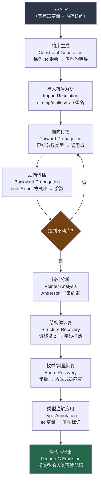

# 类型推断与结构恢复

## 概述与定位

反编译器的最终目标是将机器码转换为接近原始 C/C++ 风格的伪代码，让人类逆向工程师能够理解程序语义。在经历了反汇编、CFG 构建、数据流分析、SSA 变换、IR 提升等多道工序之后，反编译器面临一个关键障碍：**所有类型信息已在编译期被抹去**。二进制中只剩下位宽（8/16/32/64 bit 的寄存器和内存访问），没有 `int`、`char*`、`struct Node*` 这样的高级类型。

类型推断（Type Inference）与结构恢复（Structure Recovery）正是解决这一问题的核心技术。它们通过分析变量的使用方式、操作的语义约束、以及外部符号签名，为反编译出的变量赋予近似的高级类型，最终生成可读的伪 C 代码。

> [!abstract] TL;DR
> 编译后的二进制只有位宽，没有高级类型。反编译器通过**基于约束的类型推断**（Constraint-Based Type Inference）从 IR 指令的使用语义生成类型约束，通过**前向/后向传播**迭代求解，并借助**导入符号签名**（`strcmp`、`malloc` 等标准库函数）锚定关键类型。**结构体恢复**则通过聚类同一指针变量的所有内存访问偏移，推断字段布局与类型。IDA Pro 的 Hex-Rays 反编译器和 Ghidra 的 Decompiler 都内置了这套 pipeline；逆向工程师可以通过手动标注结构体字段、应用类型库（`.til`/`.gdt`）、运行 IDAPython 脚本来大幅提升推断质量。类型推断的准确性直接决定伪代码的可读性——指针误判为整数或结构体误判为字节数组，将导致伪代码充斥 `*((_DWORD*)v1 + 3)` 这样难以阅读的表达式。

本章内容承接 [[05.中间表示IR设计：LLVM-IR与VEX与P-Code]]（IR 变量和操作的语义），并为 [[07.Hex-Rays反编译器内部机制]] 中 Hex-Rays 内置类型推断 Pass 的理解奠定基础。结构体与 ABI 对齐规则请参阅 [[23.C_C++运行时与ABI/00.C_C++运行时与ABI总览]]。

---

## 原理与机制

### 为什么需要类型推断

编译器在生成机器码时会将类型信息完全丢弃。考察以下 C 代码：

```c
int  a    = 42;
char b    = 'X';
int *p    = &a;
```

在 x86-64 汇编层面，`a`、`b`、`p` 分别对应寄存器中的 64 位值，区别仅仅是后续的**使用方式**：`a` 参与算术运算，`b` 被截断为 8 位，`p` 被用作内存地址（解引用时变成 `[rax]`）。

如果反编译器不做类型推断，所有变量都会被推断为默认类型（通常是 `unsigned int` 或 `__int64`），产生如下劣质伪代码：

```c
// 没有类型推断的伪代码（可读性极差）
unsigned __int64 v1;
unsigned __int64 v2;
*(_DWORD *)(v1 + 8) = 0;
v2 = *(_QWORD *)(v1 + 16);
```

而有了准确的类型推断和结构体恢复之后，伪代码变为：

```c
// 有类型推断的伪代码（接近原始 C）
struct Node *node;
node->next = NULL;
node->data = malloc_result;
```

两者的阅读体验天壤之别。

### 类型推断的目标与约束

类型推断的输入是 SSA 形式的 IR（Intermediate Representation），其中每个变量只被赋值一次，已知若干变量的初始类型（函数参数、已知符号返回值）。类型推断需要：

1. **为每个 IR 变量分配一个最具体（most specific）的类型**
2. **区分整数与指针**——这是最关键的歧义点
3. **识别指针所指向的结构体字段布局**
4. **为常量赋予枚举含义**（可选但有价值）

类型系统通常采用一个有限格（Lattice）：
- 底元素 `⊥`（未知类型）
- 顶元素 `⊤`（类型冲突，无法确定）
- 中间层：`int8`/`int16`/`int32`/`int64`、`uint8`/`uint16`/`uint32`/`uint64`、`float`/`double`、`ptr<T>`（指向类型 T 的指针）、`struct { ... }`

类型传播在格上单调上升，直到达到不动点。

### 类型推断整体流程



---

## 结构/算法/伪代码详解

### 基于约束的类型推断

#### 约束生成（Constraint Generation）

对 IR 中的每条操作（P-Code Op 或 microcode 指令），类型推断引擎生成一组类型约束。以 Ghidra P-Code 语义为例：

| IR 操作 | 生成的类型约束 | 说明 |
|---------|--------------|------|
| `c = INT_ADD(a, b)` | `isInt(a) ∨ isPtr(a)`；若 `isPtr(a)` 则 `isInt(b)` 且 `isPtr(c)` | 指针 + 整数偏移 = 指针；整数 + 整数 = 整数 |
| `val = LOAD(ptr, 4)` | `isPtr(ptr)`；`sizeof(*ptr) ≥ 4`；`typeOf(val) = deref4(typeOf(ptr))` | LOAD 的操作数必须是指针；结果是被指向类型 |
| `STORE(ptr, val, 4)` | `isPtr(ptr)`；`typeOf(val) ≈ deref4(typeOf(ptr))` | STORE 同理 |
| `CALL func(a0, a1)` | 若签名已知：`typeOf(a0) = paramType(func, 0)`；`typeOf(a1) = paramType(func, 1)` | 已知签名直接绑定 |
| `INT_EQUAL(a, 0)` | `isInt(a) ∨ isPtr(a)`（NULL 检查歧义） | 零可以是 0 或 NULL |
| `INT_MULT(a, b)` | `isInt(a) ∧ isInt(b)` | 指针不参与乘法（乘法→整数） |
| `INT_AND(a, mask)` | `isInt(a)` 可能（掩码运算多为整数）；若 `mask == 0xFF` 则 `a` 为字节宽 | 位掩码暗示整数 |

**整数 vs 指针歧义处理**：
这是类型推断最棘手的问题。`mov rax, qword ptr [rsp+8]` 取出的 64 位值，既可能是 `int64`，也可能是 `char*`。判据在于后续使用：
- 若 `rax` 后续被用作 `LOAD/STORE` 的地址操作数 → 推断为指针
- 若 `rax` 后续参与 `INT_MULT`/`INT_DIV` → 推断为整数
- 若 `rax` 后续被传递给已知函数参数为 `char*` 的参数位置 → 推断为 `char*`
- 若两种用途都有 → 进入格的歧义节点，等待更多约束

#### 约束求解：不动点迭代

约束求解采用工作集（Worklist）算法，与数据流分析（参见 [[03.数据流分析与活跃变量]]）结构相似：

```python
def solve_type_constraints(constraints, initial_types):
    """
    约束求解：迭代传播到不动点
    constraints: List[(变量, 约束类型, 来源变量)]
    initial_types: Dict[变量 -> 类型]
    """
    types = dict(initial_types)  # 当前类型映射
    worklist = set(constraints)  # 待处理约束

    while worklist:
        c = worklist.pop()
        var, constraint_type, source = c

        # 在格上计算 join（最小上界）
        old_type = types.get(var, BOTTOM)
        new_type = lattice_join(old_type, constraint_type)

        if new_type != old_type:
            # 类型更新了，把依赖此变量的约束重新加入 worklist
            types[var] = new_type
            for dependent_constraint in get_dependents(var, constraints):
                worklist.add(dependent_constraint)

    return types
```

#### 导入符号解析（Import Resolution）

已知函数签名是类型推断最强的"锚点"。反编译器通过类型库（IDA 的 `.til` 文件、Ghidra 的 `.gdt` 文件）查找标准库和 Windows/Linux API 的函数原型：

```
// 已知签名（来自类型库）：
int strcmp(const char *s1, const char *s2);
void *malloc(size_t size);
FILE *fopen(const char *path, const char *mode);
```

当 IR 中出现 `CALL strcmp(v1, v2)` 时，类型推断立刻得知：
- `typeOf(v1) = const char*`
- `typeOf(v2) = const char*`
- 返回值 `typeOf(ret) = int`

这些约束会进一步向调用点的上下文传播，锚定更多变量的类型。

**动态链接函数识别**：对于通过 `LoadLibrary`/`GetProcAddress` 动态加载的函数，IDA 和 Ghidra 有专门的 pattern 识别逻辑：

```nasm
; 典型 GetProcAddress 调用模式：
push  offset aMessageboxa    ; "MessageBoxA"
push  [ebp+hModule]
call  GetProcAddress
mov   [ebp+pfnMsgBox], eax   ; 函数指针
...
call  [ebp+pfnMsgBox]        ; 间接调用
```

识别到 `"MessageBoxA"` 字符串参数后，IDA 可以将 `pfnMsgBox` 的类型推断为 `int(WINAPI*)(HWND, LPCSTR, LPCSTR, UINT)`。

### 类型传播（Type Propagation）

#### 前向传播

从已知类型出发（函数参数类型、已知符号返回值），沿数据流方向传播：

```
// 已知：a0 = char* (来自调用点 strcmp 的签名)
c0 = INT_ADD(a0, offset4)    // 推断：c0 也是 char*（指针+整数=指针）
val = LOAD(c0, 1)             // 推断：val 是 char（1字节 LOAD，来自 char* 指针）
```

#### 后向传播

从使用点的类型需求出发，反向推断操作数类型。典型例子是 `printf`：

```c
printf("%d %s\n", v1, v2);
```

格式字符串 `%d` 暗示第一个变长参数为 `int`，`%s` 暗示第二个为 `char*`。后向传播：
- `typeOf(v1) ← int`
- `typeOf(v2) ← char*`

IDA 的 Hex-Rays 会自动解析格式字符串，将对应参数的类型从 `__int64` 更正为 `int` 或 `char*`，显著提升伪代码可读性。

#### 迭代至不动点

前向传播更新了某些变量的类型后，这些变量可能又触发新的后向传播约束（或反之）。因此整个过程需要多轮迭代，直到所有变量类型不再改变——即达到**不动点**（Fixed Point）。

在实践中，大多数函数在 2～5 轮迭代内收敛。如果格设计合理（单调、有界），不动点的存在性有理论保证（Tarski 不动点定理）。

### 指针分析（Pointer Analysis）

#### 指针分析的两类问题

在类型推断确认某个变量是指针之后，还需要解决**别名分析**（Alias Analysis）问题：两个指针变量是否可能指向同一内存对象？以及**指向集**（Points-to Set）问题：一个指针变量可能指向哪些分配对象？

这两个问题对结构体恢复至关重要：若两个指针别名相同，则它们对同一内存的访问偏移应合并到同一结构体中。

#### Anderson 子集约束算法

Anderson 算法（1994）是最常用的流不敏感（Flow-Insensitive）指针分析方法。它将程序中的指针操作归结为四类约束，用**指向集**（`pts(x)` = x 可能指向的地址集合）描述：

| 语句 | 约束形式 | 语义 |
|------|---------|------|
| `x = &y` | `{y} ⊆ pts(x)` | x 的指向集包含 y 的地址 |
| `x = y` | `pts(y) ⊆ pts(x)` | 赋值传播指向集 |
| `*x = y` | `∀z ∈ pts(x)：pts(y) ⊆ pts(z)` | 间接写：x 所指的每个对象都可能被 y 的指向集写入 |
| `x = *y` | `∀z ∈ pts(y)：pts(z) ⊆ pts(x)` | 间接读：从 y 所指对象的指向集传播给 x |

**求解过程（伪代码）**：

```python
def anderson_analysis(statements):
    """
    Anderson 子集约束指针分析
    返回每个变量的指向集 pts
    """
    pts = defaultdict(set)   # pts[x] = x 可能指向的对象集合
    worklist = list(statements)

    while worklist:
        stmt = worklist.pop()

        if stmt.type == 'addr_of':    # x = &y
            x, y = stmt.lhs, stmt.rhs
            if y not in pts[x]:
                pts[x].add(y)
                worklist.append(('propagate', x))

        elif stmt.type == 'assign':   # x = y
            x, y = stmt.lhs, stmt.rhs
            added = pts[y] - pts[x]
            if added:
                pts[x] |= added
                worklist.append(('propagate', x))

        elif stmt.type == 'store':    # *x = y
            x, y = stmt.ptr, stmt.val
            for z in pts[x]:
                added = pts[y] - pts[z]
                if added:
                    pts[z] |= added
                    worklist.append(('propagate', z))

        elif stmt.type == 'load':     # x = *y
            x, y = stmt.lhs, stmt.ptr
            for z in pts[y]:
                added = pts[z] - pts[x]
                if added:
                    pts[x] |= added
                    worklist.append(('propagate', x))

    return pts
```

Anderson 算法的时间复杂度为 O(n³)（n = 程序中指针相关语句数），对大型二进制（百万行级别）需要剪枝优化（如 Steensgaard 算法的 O(n·α(n)) 近似版本）。

#### 基于偏移的指向关系

在反编译场景中，指针分析还需处理**偏移访问**：`ptr + 0x10`、`ptr + 0x18` 等。这些偏移访问暗示 `ptr` 指向一个结构体，各偏移对应不同字段。指针分析引擎需要维护**偏移敏感的指向集**（Offset-Sensitive Points-to），即 `pts_offset(x, δ)` 表示 x+δ 处可能指向的对象。

### 结构体恢复（Structure Recovery）

#### 偏移聚类算法

结构体恢复的核心思路是：跟踪同一指针变量的所有内存访问偏移，将这些偏移聚类为结构体字段。

**算法步骤**：

```
对每个指针变量 p：
  1. 收集所有访问偏移：访问集 A = {(offset, size, rw) | LOAD/STORE(p+offset, size)}
  2. 按 offset 排序：sorted_A
  3. 推断字段：
     - 对每个唯一 offset δ，确定 field_δ 的大小（max access size at δ）
     - 字段类型：由访问大小 + 上下文类型传播决定
     - 字段名：field_δ（字节偏移）
  4. 验证无重叠：若 field_0 size=4 且存在 offset=2 的访问 → 可能是联合体（union）
  5. 输出结构体定义
```

#### 具体示例：从访问模式推断结构体

假设反编译器在 IR 中看到如下访问（变量 `a1` 为指针参数）：

```c
// IR 层面的访问序列（伪P-Code风格）
v1 = LOAD(a1 + 0x00, 4)   // 读 int32，a1 偏移 0
v2 = LOAD(a1 + 0x04, 4)   // 读 int32，a1 偏移 4
v3 = LOAD(a1 + 0x08, 8)   // 读 int64（指针？），a1 偏移 8
STORE(a1 + 0x10, v4, 4)   // 写 int32，a1 偏移 0x10
v5 = LOAD(a1 + 0x18, 8)   // 读 int64（指针？），a1 偏移 0x18
```

后续分析发现：`v3` 被用作 `LOAD/STORE` 的地址（即 `v3` 是指针）；`v5` 被传入 `strcmp` 的第一参数位置（即 `v5` 是 `char*`）。

综合偏移聚类和类型传播，推断出结构体：

```c
typedef struct _my_struct {
    int   field_0;    // +0x00, 4 字节，整数
    int   field_4;    // +0x04, 4 字节，整数
    void *field_8;    // +0x08, 8 字节，指针（类型待细化）
    int   field_10;   // +0x10, 4 字节，整数（被写入）
    int   _pad_14;    // +0x14, 4 字节，填充（ABI 对齐）
    char *field_18;   // +0x18, 8 字节，char*（来自 strcmp 约束）
} my_struct;          // 总大小 >= 0x20（32字节）
```

> [!note] 对齐与填充
> 结构体字段在内存中需要满足 ABI 对齐要求（x86-64 System V ABI：指针对齐 8 字节，int 对齐 4 字节）。若偏移 0x10 有 `int` 字段但 0x14 没有访问，反编译器通常在 0x14 插入隐式填充 `_pad`，以保持 0x18 处 `char*` 字段的 8 字节对齐。

#### IDA 手动结构体恢复

当自动推断不准确时，逆向工程师可在 IDA 中手动创建和应用结构体：

**交互式操作**：
1. 打开 Structures 窗口（`Shift+F9`）→ 按 `Insert` 创建新结构体
2. 在结构体定义中添加字段（`D` 键选择数据类型、`A` 键添加字符串、`P` 键创建指针成员）
3. 在反汇编视图中，选中使用偏移的变量 → 右键 → `Convert to struct *`
4. 或使用 `Alt+Q`（Apply Structure Member）将偏移标注为结构体字段

**IDAPython 脚本创建结构体**：

```python
import idc
import idaapi
import ida_struct
import ida_bytes

def create_my_struct():
    """
    用 IDAPython 创建结构体 my_struct，并定义字段
    """
    struct_name = "my_struct"

    # 检查是否已存在同名结构体，若存在先删除（谨慎使用）
    existing_id = idc.get_struc_id(struct_name)
    if existing_id != idc.BADADDR:
        idc.del_struc(existing_id)

    # 创建新结构体（0 = 未排列，非 union）
    sid = idc.add_struc(0, struct_name, 0)
    if sid == idc.BADADDR:
        print(f"[!] 无法创建结构体 {struct_name}")
        return None

    # 添加字段：add_struc_member(sid, name, offset, flag, typeid, nbytes)
    # FF_DWORD = 4字节整数；FF_QWORD = 8字节整数；FF_DATA = 通用数据
    idc.add_struc_member(sid, "field_0",  0x00,
                         idc.FF_DWORD | idc.FF_DATA, -1, 4)
    idc.add_struc_member(sid, "field_4",  0x04,
                         idc.FF_DWORD | idc.FF_DATA, -1, 4)
    idc.add_struc_member(sid, "field_8",  0x08,
                         idc.FF_QWORD | idc.FF_DATA, -1, 8)   # 指针（先用 QWORD）
    idc.add_struc_member(sid, "field_10", 0x10,
                         idc.FF_DWORD | idc.FF_DATA, -1, 4)
    idc.add_struc_member(sid, "_pad_14",  0x14,
                         idc.FF_DWORD | idc.FF_DATA, -1, 4)   # 填充
    idc.add_struc_member(sid, "field_18", 0x18,
                         idc.FF_QWORD | idc.FF_DATA, -1, 8)   # char*（先用 QWORD）

    print(f"[+] 结构体 {struct_name} 创建成功，sid = 0x{sid:08X}")

    # 为指针字段设置精确类型（需要类型解析）
    # 将 field_8 设置为 void* 类型
    tinfo = idaapi.tinfo_t()
    idaapi.parse_decl(tinfo, None, "void *;", idaapi.PT_SIL)
    member = ida_struct.get_member_by_name(ida_struct.get_struc(sid), "field_8")
    if member:
        ida_struct.set_member_tinfo(ida_struct.get_struc(sid), member, 0, tinfo, 0)

    return sid

def apply_struct_to_var(func_ea, var_offset, struct_name):
    """
    将结构体类型应用到函数中的指针变量（通过 Hex-Rays cfunc_t）
    """
    cfunc = idaapi.decompile(func_ea)
    if cfunc is None:
        print(f"[!] 无法反编译 0x{func_ea:08X}")
        return

    sid = idc.get_struc_id(struct_name)
    if sid == idc.BADADDR:
        print(f"[!] 结构体 {struct_name} 不存在")
        return

    # 构造指向该结构体的指针类型
    tinfo = idaapi.tinfo_t()
    idaapi.parse_decl(tinfo, None, f"{struct_name} *;", idaapi.PT_SIL)

    # 在 cfunc 的局部变量列表中找到对应变量并应用类型
    for lvar in cfunc.get_lvars():
        if lvar.location.is_stkoff() and lvar.location.stkoff() == var_offset:
            lvar.set_lvar_type(tinfo)
            print(f"[+] 已将 {struct_name}* 应用到 lvar at stkoff={var_offset}")
            break

    # 刷新反编译视图
    cfunc.refresh_func_ctext()

# 使用示例
sid = create_my_struct()
```

#### Ghidra 结构体恢复与 Data Type Editor

Ghidra 提供图形化的 Data Type Editor（`Window → Data Type Manager`）来创建和应用结构体。在脚本中：

```java
// GhidraScript 示例：自动从偏移访问列表创建结构体
import ghidra.program.model.data.*;
import ghidra.program.model.listing.*;

DataTypeManager dtm = currentProgram.getDataTypeManager();
int txId = dtm.startTransaction("Create my_struct");
try {
    // 创建结构体
    StructureDataType myStruct = new StructureDataType("my_struct", 0);

    // 添加字段
    myStruct.add(IntegerDataType.dataType,  4, "field_0", "偏移 0x00：int");
    myStruct.add(IntegerDataType.dataType,  4, "field_4", "偏移 0x04：int");
    myStruct.add(PointerDataType.dataType,  8, "field_8", "偏移 0x08：void*");
    myStruct.add(IntegerDataType.dataType,  4, "field_10","偏移 0x10：int");
    myStruct.add(IntegerDataType.dataType,  4, "_pad_14", "填充（对齐）");
    myStruct.add(new PointerDataType(CharDataType.dataType), 8,
                 "field_18", "偏移 0x18：char*");

    // 注册到数据类型管理器
    dtm.addDataType(myStruct, DataTypeConflictHandler.REPLACE_HANDLER);

    // 在程序中找到指针变量并应用类型
    Address varAddr = toAddr(0x00401000L);
    Data existingData = currentProgram.getListing().getDataAt(varAddr);
    if (existingData != null) {
        currentProgram.getListing().clearCodeUnits(varAddr,
            varAddr.add(myStruct.getLength()), false);
    }
    currentProgram.getListing().createData(varAddr, myStruct);

} finally {
    dtm.endTransaction(txId, true);
}
```

### DWARF 调试信息利用

若目标二进制未经 `strip`（即保留了 DWARF 调试信息），类型推断可以直接从 `.debug_info` 段读取精确类型，无需启发式推断。

**查看 DWARF 类型信息**：

```bash
# 列出所有 DW_TAG_structure_type（结构体定义）
objdump --dwarf=info target | grep -A 20 "DW_TAG_structure_type"

# 精确模式，查看单个结构体的字段（DW_TAG_member）
readelf --debug-dump=info target | grep -A 5 "DW_AT_name\|DW_AT_byte_size\|DW_AT_data_member_location"

# 提取类型树（更友好的格式）
dwarfdump --type-names target
```

**IDA 自动解析 DWARF**：加载 ELF 文件时，若 IDA 检测到 `.debug_info` 节，会自动解析 DWARF 并创建对应的结构体定义（在 Structures 窗口可见）。可通过 `idc.parse_decl()` 后续再应用到变量。

**Ghidra DWARF Plugin**：Ghidra 内置 `DWARFPlugin`，自动处理 ELF/Mach-O 中的 DWARF 信息，在 Data Type Manager 中显示恢复的类型。

**strip 后的场景**：生产环境二进制通常已 strip，只能依赖类型推断启发式。DWARF 信息仅在以下情形存在：
- 调试版本（Debug Build）
- 带有独立 `.dSYM` 包（macOS）或 `.pdb` 文件（Windows）
- 某些静态链接的第三方库（未 strip 的 `.a`/`.lib`）

### 枚举与常量恢复

整数常量往往携带语义信息——错误码、标志位、ioctl 命令号等。将这些常量识别为枚举成员可显著提升伪代码可读性：

```c
// 未恢复枚举（难以理解）
if (GetLastError() == 0x5)
    return 0x80070005;

// 恢复枚举后（含义清晰）
if (GetLastError() == ERROR_ACCESS_DENIED)
    return E_ACCESSDENIED;
```

**IDA 枚举应用**：

```python
import idc
import idaapi

def apply_enum_to_operand(ea, operand_idx, enum_name):
    """
    将枚举类型应用到指令操作数
    ea: 指令地址
    operand_idx: 操作数序号（0 或 1）
    enum_name: 枚举名称（必须已在 IDA Enums 窗口中定义）
    """
    enum_id = idc.get_enum(enum_name)
    if enum_id == idc.BADADDR:
        print(f"[!] 枚举 {enum_name} 不存在")
        return False

    # serial=0 表示使用枚举的第一个成员集
    result = idc.op_enum(ea, operand_idx, enum_id, 0)
    if result:
        print(f"[+] 已将枚举 {enum_name} 应用到 0x{ea:08X} 操作数 {operand_idx}")
    return result

# 为已知的 Windows 错误码操作数应用枚举
# 假设已在 IDA 中加载了 WINERROR 枚举（来自 .til 库）
apply_enum_to_operand(0x401050, 1, "WINERROR")
```

**自动枚举匹配的挑战**：常量 `0x10` 可能是 `GENERIC_READ`（Windows 安全），也可能是 `SEEK_SET`（文件操作），还可能只是数字 16。反编译器需要结合上下文（`CreateFile` 调用旁边的 `0x10` 更可能是安全常量）才能正确匹配。IDA 通过上下文感知的枚举推荐（右键 → `Use enum member`）辅助人工决策。

---

## 工具视角/实战

### IDA Hex-Rays 中的类型推断控制

Hex-Rays 反编译器会在反编译阶段自动执行类型推断。逆向工程师可以通过以下方式干预：

**交互式类型更正**：
- 在伪代码视图中选中变量 → 按 `Y` 键 → 输入正确的 C 类型声明（如 `struct Node *`）
- Hex-Rays 会以此为新约束重新传播，可能更改多处相关变量的类型
- 按 `N` 重命名变量，配合类型更正效果最佳

**查看 microcode 层（内部调试）**：

```python
import ida_hexrays

# 获取函数 microcode（仅用于调试，了解类型推断中间状态）
ea = idc.get_screen_ea()   # 当前光标地址所在函数
mba = ida_hexrays.gen_microcode(
    idaapi.get_func(ea),
    None,
    None,
    ida_hexrays.DECOMP_NO_WAIT,
    ida_hexrays.MMAT_CALLS   # 类型推断后的层次（MMAT_CALLS 阶段已完成类型分析）
)
if mba:
    for i in range(mba.qty):
        blk = mba.get_mblock(i)
        insn = blk.head
        while insn:
            print(f"  [{i}] {insn._print()}")
            insn = insn.next
```

**批量更正函数参数类型（IDAPython）**：

```python
import idaapi
import idc

def retype_function_param(func_ea, param_idx, new_type_str):
    """
    修改函数的参数类型，触发 Hex-Rays 重新传播
    func_ea:      函数入口地址
    param_idx:    参数序号（0-based）
    new_type_str: 类型字符串，如 "struct Node *" 或 "const char *"
    """
    # 获取当前函数类型信息
    tinfo = idaapi.tinfo_t()
    idaapi.get_tinfo(tinfo, func_ea)

    func_data = idaapi.func_type_data_t()
    tinfo.get_func_details(func_data)

    if param_idx >= len(func_data):
        print(f"[!] 参数序号 {param_idx} 超出范围（共 {len(func_data)} 个参数）")
        return

    # 解析新类型
    new_tinfo = idaapi.tinfo_t()
    if not idaapi.parse_decl(new_tinfo, None, new_type_str + ";", idaapi.PT_SIL):
        print(f"[!] 无法解析类型：{new_type_str}")
        return

    # 修改参数类型
    func_data[param_idx].type = new_tinfo
    func_data[param_idx].name = func_data[param_idx].name or f"param_{param_idx}"

    # 重新打包并应用
    new_func_tinfo = idaapi.tinfo_t()
    new_func_tinfo.create_func(func_data)
    idaapi.apply_tinfo(func_ea, new_func_tinfo, idaapi.TINFO_DEFINITE)

    print(f"[+] 已修改函数 0x{func_ea:08X} 的第 {param_idx} 个参数类型为 {new_type_str}")

# 示例：将 sub_401000 的第一个参数类型从 __int64 改为 struct Node*
retype_function_param(0x401000, 0, "struct Node *")
```

### Ghidra 中的类型推断与结构体应用

**通过 Re-Type Variable 改善推断**：
1. 在 Decompiler 视图中右键变量 → `Retype Variable`
2. 输入精确类型（如 `Node *`），Ghidra 重新运行类型传播

**GhidraScript 批量应用结构体**：

```java
// 在所有函数中找到模式并应用 my_struct 类型
import ghidra.program.model.data.*;
import ghidra.program.model.listing.*;
import ghidra.program.model.symbol.*;

DataTypeManager dtm = currentProgram.getDataTypeManager();
DataType myStructPtrType = dtm.getDataType("/my_struct");
if (myStructPtrType == null) {
    println("未找到 my_struct，请先创建");
    return;
}

// 遍历所有函数
FunctionIterator funcIter = currentProgram.getListing().getFunctions(true);
while (funcIter.hasNext()) {
    Function func = funcIter.next();
    // 检查参数数量和名称模式
    Parameter[] params = func.getParameters();
    for (Parameter p : params) {
        // 若参数名为 "a1" 且类型为 undefined8（64位未知），尝试应用结构体指针
        if (p.getName().equals("a1") &&
            p.getDataType().getName().equals("undefined8")) {
            PointerDataType pdt = new PointerDataType(myStructPtrType, 8);
            p.setDataType(pdt, SourceType.USER_DEFINED);
            println("已更新函数 " + func.getName() + " 的参数 a1 类型");
        }
    }
}
```

### 实战案例：恢复 C++ 虚函数表（vtable）类型

C++ 虚函数机制在二进制层面留下可识别的模式：对象的前 8 字节（64 位）是指向虚函数表的指针（`vptr`）。

```python
import idaapi
import idc

def recover_vtable(obj_ptr_ea, vtable_ea, class_name):
    """
    恢复 C++ 虚函数表结构
    obj_ptr_ea: 对象指针变量所在地址
    vtable_ea:  虚函数表（vftable）起始地址
    class_name: 推断的类名
    """
    # 1. 确定虚函数表长度（扫描直到遇到不像函数指针的值）
    vtable_entries = []
    ea = vtable_ea
    while True:
        func_ptr = idc.get_qword(ea)
        if func_ptr == 0:
            break
        # 检查是否是已知函数地址
        if idc.get_func_name(func_ptr):
            vtable_entries.append(func_ptr)
            ea += 8
        else:
            break

    print(f"[+] vtable @ 0x{vtable_ea:X}，共 {len(vtable_entries)} 个虚函数")

    # 2. 创建虚函数表结构体
    vtable_struct_name = f"{class_name}_vftable"
    sid = idc.add_struc(0, vtable_struct_name, 0)
    for i, fp in enumerate(vtable_entries):
        fname = idc.get_func_name(fp)
        idc.add_struc_member(sid, f"vf_{i}_{fname[:20]}", i * 8,
                             idc.FF_QWORD | idc.FF_DATA, -1, 8)

    # 3. 创建对象类结构体（首字段为 vftable 指针）
    obj_sid = idc.add_struc(0, class_name, 0)
    # 首字段：vftable 指针
    idc.add_struc_member(obj_sid, "__vftable", 0,
                         idc.FF_QWORD | idc.FF_DATA, -1, 8)

    print(f"[+] 已创建结构体 {class_name}（sid=0x{obj_sid:X}）和 {vtable_struct_name}")

# 示例调用
recover_vtable(0, 0x405000, "CMyClass")
```

---

## 安全性与正确使用

> [!caution] 合规边界
> 本章介绍的类型推断与结构体恢复技术用于以下合法场景：**恶意软件样本分析**（研究与防御）、**CTF 逆向题目**、**漏洞挖掘研究**（自有程序或已获授权目标）、**二进制兼容性分析**（理解闭源库的数据布局）。严禁将这些技术用于：破解商业软件的授权保护、反向工程竞争对手的专有算法以牟利、或在未经授权的情况下逆向第三方软件——此类行为在大多数地区违反《计算机欺诈与滥用法》（CFAA）、DMCA 第 1201 条款以及类似的地区性法律。

### 常见类型推断陷阱

**陷阱一：整数与指针误判**

```c
// 误判示例（IDA 默认类型推断失误）
// 实际代码：
int *arr = (int *)mmap(NULL, 0x1000, PROT_READ|PROT_WRITE, ...);
arr[5] = 42;

// 反编译结果（类型推断失败时）：
__int64 v1;
v1 = mmap(0LL, 0x1000LL, 3LL, 34LL, -1, 0LL);
*(_DWORD *)(v1 + 20) = 42;   // arr[5] 被展开为原始地址计算
```

**修复方法**：在 IDA 中将 `v1` 的类型手动更正为 `int *`，Hex-Rays 会自动将 `*(_DWORD *)(v1 + 20)` 重写为 `v1[5]`。

**陷阱二：结构体偏移冲突**

当同一指针变量的访问模式不一致时（不同代码路径使用不同偏移），可能说明：
- 代码使用了 `union`（联合体）
- 同一指针变量在不同时刻指向不同类型的对象（多态）
- 类型推断的别名分析失误（两个不同指针被误认为同一个）

**处置方案**：在 Ghidra 的 VariableStorage 视图或 IDA 的局部变量列表中检查是否存在同名但不同偏移的变量；若是联合体，手动创建 `union` 类型并应用。

**陷阱三：DWARF 与推断结果冲突**

在分析半 strip 的二进制时（`.debug_line` 存在但 `.debug_info` 被删除），IDA 可能基于行号信息做出错误推断，与约束传播结果矛盾。

**处置方案**：在 IDA 中通过 `Options → Compiler → Do not use DWARF debug info` 禁用 DWARF 辅助，完全依赖类型传播；或反之，提供精确的 `.pdb`/`.dSYM` 文件让工具使用准确符号。

### 防御与分析最佳实践

1. **优先应用已知函数签名**：在开始分析前，确保 IDA 加载了目标平台的完整类型库（`.til`）——`File → Load File → Parse C Header File` 加载自定义头文件；Ghidra 则通过 `File → Parse C Source` 导入。

2. **从入口函数逐层向下标注**：先正确标注 `main`/`WinMain` 或 `DllMain` 的参数类型，再向调用链深处传播——顶层类型准确后，后续推断误差会显著减少。

3. **利用字符串辅助结构恢复**：包含结构体成员名称的字符串（如日志输出 `"node->next = NULL"`）是极好的交叉引用线索，可以帮助推测字段名和类型。

4. **脚本化批量恢复**：对于大型固件或库文件，手动逐函数标注效率太低，应优先编写 IDAPython 或 GhidraScript 脚本，批量识别模式并自动应用类型。

5. **验证对齐假设**：推断出的结构体字段大小之和应与该指针被传入 `sizeof` 或 `malloc` 时的大小参数吻合（若可观察到）。不吻合则说明字段推断有遗漏或误判。

---

## 小结

本章系统梳理了类型推断与结构体恢复的完整技术链：

- **为什么需要类型推断**：编译后二进制只有位宽，没有高级类型；准确的类型是伪代码可读性的核心决定因素。

- **基于约束的类型推断**：每条 IR 操作生成类型约束，约束在格上通过前向/后向传播迭代到不动点；导入符号签名（来自 `.til`/`.gdt` 类型库）是最强的类型锚点。

- **指针分析**：Anderson 子集约束算法用指向集（`pts(x)`）描述指针关系，支持四类基本约束（取地址、赋值、间接写、间接读），时间复杂度 O(n³)，是结构体恢复的基础。

- **结构体恢复**：通过聚类同一指针变量的所有访问偏移，推断字段大小与类型，并考虑 ABI 对齐填充；IDA 和 Ghidra 均提供交互式和脚本化两种操作路径。

- **DWARF 信息**：若未经 strip，DWARF 提供精确类型；strip 后只能依赖启发式推断。

- **枚举恢复**：常量可能是枚举成员，借助类型库和上下文感知匹配，可将 `0x5` 还原为 `ERROR_ACCESS_DENIED`。

掌握这套技术，能将反编译器输出的原始伪代码（充满 `*(_DWORD*)v1` 的"裸地址"表达式）提升为接近 C 源码风格的可读输出，是高效逆向工程的核心技能之一。

---

## 相关阅读

- [[05.中间表示IR设计：LLVM-IR与VEX与P-Code]] — 类型推断的输入：IR 指令集及其操作语义
- [[07.Hex-Rays反编译器内部机制]] — Hex-Rays 内置类型推断 Pass 的 microcode 层次实现细节
- [[04.SSA形式与Phi函数]] — SSA 形式是类型约束传播算法的运行基础
- [[03.数据流分析与活跃变量]] — 不动点迭代框架与格理论（类型约束求解复用同一框架）
- [[23.C_C++运行时与ABI/00.C_C++运行时与ABI总览]] — 结构体 ABI 对齐规则（字段偏移推断的理论依据）
- Emre Talha Çiçek et al., *TIE: Principled Reverse Engineering of Types in Binary Code*（NDSS 2011）— 基于约束的二进制类型推断奠基论文
- Gogul Balakrishnan & Thomas Reps, *WYSINWYX: What You See Is Not What You eXecute*（TOPLAS 2010）— 二进制分析精确性边界
- Chris Eagle, *The IDA Pro Book*（2nd ed.）— IDA 结构体操作与类型应用完整指南
- Ghidra 官方文档：Data Type Manager（`Help → Contents → Data Type Manager`）

---

⬅️ 上一篇 [[05.中间表示IR设计：LLVM-IR与VEX与P-Code]] ｜ 🏠 [[00.反编译器与反汇编引擎原理总览]] ｜ 下一篇 [[07.Hex-Rays反编译器内部机制]] ➡️
