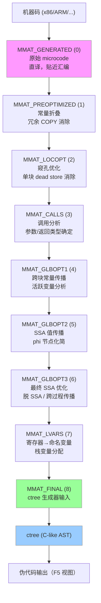

# 反编译器（07）· Hex-Rays反编译器内部机制

## 概述与定位

> [!abstract] TL;DR
> Hex-Rays Decompiler 是 IDA Pro 附带的商业级反编译插件，公认为当前质量最高的二进制反编译器。其核心架构围绕两套 IR 展开：从机器码到伪代码需要经过 **8 层 Microcode 成熟度（MMAT）** 的逐级提升管线，最终产出 **ctree**（C-like AST）再格式化为伪代码输出。理解 Microcode 架构与 ctree 结构，是编写高质量 Hex-Rays 插件、对抗混淆代码的前提。

Hex-Rays Decompiler 自 2007 年随 IDA Pro 5.0 发布以来，始终是逆向工程工具链中的标杆。与 Ghidra 的 P-Code（[[05.中间表示IR设计：LLVM-IR与VEX与P-Code]]）走开源路线不同，Hex-Rays 以闭源商业授权方式提供，但对外暴露了相当完整的 SDK（`hexrays.hpp`），允许第三方编写优化插件与分析脚本。

**本章定位**：

- **上游**：前置章节已讲解 CFG 构建（第02章）、数据流分析（第03章）、SSA（第04章）、类型推断（第06章）——这些算法均在 Hex-Rays 内部以 Microcode 为载体执行；
- **本章**：聚焦 Hex-Rays 专有架构细节——Microcode 8 层管线、minsn_t/mop_t 操作数体系、ctree 遍历、优化钩子接口；
- **下游**：第08章将对比 Ghidra 的 P-Code 路线；第13章（`[[13.IDA Pro插件开发]]`）基于本章 API 体系讲解完整插件开发实践。

---

## 原理与机制

### 7.1 Hex-Rays 总体架构

Hex-Rays Decompiler 作为 IDA Pro 的插件（`.dll` / `.so`）加载，通过 `ida_hexrays` 模块对外提供 Python/C++ SDK。按功能层次，可划分为三大部分：

| 层次 | 组件 | 职责 |
|------|------|------|
| 前端 | IDA 分析引擎 | 反汇编、函数边界、调用约定识别 |
| 中间 | Microcode 管线 | 8 阶段 IR 提升，所有分析/优化在此运行 |
| 后端 | ctree + 代码生成器 | AST 构建、类型推断、格式化输出 |

触发反编译的两种方式：

- **交互式**：光标停在函数内按 `F5`；
- **脚本式**：`cfunc = ida_hexrays.decompile(ea)`，返回 `cfuncptr_t` 对象。

### 7.2 Microcode 八层成熟度管线

Hex-Rays 没有一次性把机器码翻译成 C 伪代码，而是设计了一条**渐进式提升（progressive lifting）管线**。每通过一个优化 pass，Microcode 的"成熟度"（maturity）递增，直至准备好生成 ctree。

#### 7.2.1 成熟度枚举表

| 枚举常量 | 数值 | 阶段名称 | 核心动作 |
|---------|------|---------|---------|
| `MMAT_GENERATED` | 0 | 原始生成 | 机器指令到 microcode 的直接翻译，极接近汇编 |
| `MMAT_PREOPTIMIZED` | 1 | 预优化 | 常量折叠、冗余 `m_mov`/`m_copy` 消除 |
| `MMAT_LOCOPT` | 2 | 局部优化 | 单基本块内窥孔优化（peephole）；dead store 消除 |
| `MMAT_CALLS` | 3 | 调用分析 | 确定每个 `m_call` 的参数列表与返回类型；展开 IARG 信息 |
| `MMAT_GLBOPT1` | 4 | 全局优化轮1 | 跨块常量传播；活跃变量分析；部分 dead code 消除 |
| `MMAT_GLBOPT2` | 5 | 全局优化轮2 | SSA 形式下的值传播；phi 节点化简 |
| `MMAT_GLBOPT3` | 6 | 全局优化轮3 | 最终 SSA 优化；脱离 SSA 形式；跨过程常量传播 |
| `MMAT_LVARS` | 7 | 局部变量分配 | 寄存器映射为命名局部变量（`lvar_t`）；栈变量命名 |
| `MMAT_FINAL` | 8 | 最终 microcode | ctree 生成器的直接输入；不再有 microcode 级别优化 |

> [!note] 管线阶段与优化 pass 的关系
> 每个成熟度之间可能执行**多个** pass。例如 `MMAT_GLBOPT1` 到 `MMAT_GLBOPT2` 之间，Hex-Rays 可能对同一个基本块反复运行窥孔优化直到收敛。外部插件通过 `optinsn_t` 注入自定义规则，在 `MMAT_LOCOPT` 和 `MMAT_GLBOPT*` 阶段之间插入执行。

#### 7.2.2 管线推进的 Mermaid 图



### 7.3 Microcode 指令系统

Microcode 层的最小单元是 **`minsn_t`**（microcode instruction），形式为三地址码：

```
opcode  d, l, r      # destination, left operand, right operand
```

#### 7.3.1 常用操作码（`mcode_t`）

| 操作码 | 含义 | 示例 |
|--------|------|------|
| `m_mov` | 复制/移动 | `mov  eax, ebx` |
| `m_add` | 加法 | `add  eax, ebx, ecx` |
| `m_sub` | 减法 | `sub  eax, ebx, ecx` |
| `m_mul` | 有符号乘法 | `mul  eax, ebx, ecx` |
| `m_udiv` | 无符号除法 | `udiv eax, ebx, ecx` |
| `m_and` | 按位与 | `and  eax, ebx, ecx` |
| `m_or` | 按位或 | `or   eax, ebx, ecx` |
| `m_xor` | 按位异或 | `xor  eax, ebx, ecx` |
| `m_lnot` | 逻辑非 | `lnot eax, ebx` |
| `m_bnot` | 按位取反 | `bnot eax, ebx` |
| `m_shl` | 左移 | `shl  eax, ebx, n` |
| `m_shr` | 逻辑右移 | `shr  eax, ebx, n` |
| `m_sar` | 算术右移 | `sar  eax, ebx, n` |
| `m_goto` | 无条件跳转 | `goto L3` |
| `m_jnz` | 非零跳转 | `jnz  eax, 0, L5` |
| `m_jz` | 零跳转 | `jz   eax, 0, L7` |
| `m_jle` | 有符号 ≤ 跳转 | `jle  eax, ebx, L2` |
| `m_call` | 函数调用 | `call foo(args...)` |
| `m_ret` | 函数返回 | `ret  eax` |
| `m_ldx` | 加载内存 | `ldx  [eax], ebx` |
| `m_stx` | 存储内存 | `stx  eax, [ebx]` |
| `m_ext` | 符号扩展 | `ext  eax, ebx` |
| `m_low` | 截断低位 | `low  al, eax` |

#### 7.3.2 操作数类型（`mop_t` 的 `type` 字段）

| 类型枚举 | 数值 | 含义 | 示例 |
|---------|------|------|------|
| `mop_z` | 0 | 无效/空操作数 | 一元指令的空位 |
| `mop_r` | 1 | 寄存器 | `eax`、`xmm0` |
| `mop_n` | 2 | 数字常量 | `0x1234`、`-1` |
| `mop_str` | 3 | 字符串字面量 | `"hello"` |
| `mop_d` | 4 | 子指令（嵌套 minsn） | 复合表达式 |
| `mop_S` | 5 | 栈变量 | `[esp+8]` 对应的槽 |
| `mop_v` | 6 | 全局变量/内存地址 | 数据段变量 |
| `mop_b` | 7 | 基本块号 | 跳转目标 |
| `mop_f` | 8 | 调用信息（`mcallinfo_t`） | call 参数列表 |
| `mop_l` | 9 | 局部变量（`lvar_t`） | 分配后的命名变量 |
| `mop_a` | 10 | 变量地址 | 取局部变量地址 |
| `mop_h` | 11 | 辅助操作数 | 扩展指令专用 |
| `mop_c` | 12 | 条件码引用 | EFLAGS 细化 |
| `mop_fn` | 13 | 浮点数字常量 | `3.14f` |
| `mop_p` | 14 | 寄存器对（pair） | `edx:eax` 等 64 位对 |
| `mop_sc` | 15 | 散射操作数 | 多值聚合 |

> [!tip] `mop_d`（子指令）的意义
> Hex-Rays 允许 microcode 指令**嵌套**：一个操作数本身可以是另一条 microcode 指令的结果（类似 LLVM IR 的 `def-use` 链内联）。这种 `mop_d` 嵌套在 `MMAT_GLBOPT*` 阶段大量出现，表示优化后被内联的子表达式。

---

## 结构/算法/伪代码详解

### 7.4 Hex-Rays 分析流水线详述

下面按阶段逐步展开流水线的算法细节，补充第 7.2 节枚举表中省略的内部动作。

#### 阶段 0 → 1：指令提升与预优化

**提升（Lifting）**：IDA 分析引擎已识别函数边界和基本块。Hex-Rays 对每条机器指令调用架构专有的**提升例程**，产出 `MMAT_GENERATED` microcode。

常见提升模式（以 x86 为例）：

```
; 机器码
mov eax, [ebp-4]
add eax, 5
mov [ebp-4], eax

; → MMAT_GENERATED microcode
ldx  [ebp-4]{4}, eax.4         # 从栈加载 4 字节
add  eax.4, #5.4, eax.4        # 加常量
stx  eax.4, [ebp-4]{4}         # 存回栈
```

**预优化**中，常量折叠直接在 `mop_n` 类型操作数上进行；冗余 `m_mov` 的判断基于**简单的前向复制传播**，不跨越分支。

#### 阶段 2：局部优化（窥孔优化）

窥孔优化（peephole optimization）在**单个基本块**内滑动一个小窗口，匹配模式并替换：

| 输入模式 | 替换为 | 说明 |
|---------|--------|------|
| `add x, 0` | `mov x, x`（再消除） | 加零无效 |
| `xor x, x` | `mov x, 0` | 自身异或为零 |
| `mov a, b; mov b, a` | `mov a, b`（保留前者） | 互赋值冗余 |
| `and x, 0xFFFF` | `low{2} x` | 掩码变截断 |
| `shr x, 16; and x, 0xFFFF` | `high16 x` | 提取高16位 |

Hex-Rays 的窥孔规则有数百条，涵盖标志位模拟、有符号/无符号转换等复杂模式。

#### 阶段 3：调用分析

这是管线中**最复杂的单一阶段**。Hex-Rays 需要确定每个 `m_call` 节点：

1. **调用约定**（`cm_t`）：cdecl/stdcall/fastcall/thiscall 等——决定参数传递寄存器/栈顺序；
2. **参数个数与类型**：从 IDA 类型库（`.til` 文件）、FLIRT 签名或用户手动标注中取；
3. **返回类型与返回值寄存器**：影响后续 `m_ret` 的操作数。

对于**未知函数**（无类型信息），Hex-Rays 执行**调用约定推断**：
- 统计调用前后哪些寄存器被赋值（视为参数）；
- 统计调用后哪个寄存器被读取（视为返回值）；
- 产生 `__fastcall` / `__cdecl` 等初步猜测。

#### 阶段 4-6：全局优化（三轮 SSA 优化）

Hex-Rays 将 microcode 转换为 **SSA 形式**（Static Single Assignment）：
- 每个寄存器/变量在每个定义点获得唯一版本号（`v1`, `v2`, ...）；
- 控制流汇合点插入 **phi 节点**（`m_phi` 伪指令）；
- 在 SSA 上执行**稀疏条件常量传播**（SCCP）、**全局值编号**（GVN）等算法。

三轮全局优化（`GLBOPT1/2/3`）之间的主要区别：

| 轮次 | 重点算法 | 典型效果 |
|------|---------|---------|
| `GLBOPT1` | 活跃变量分析、跨块 dead code 消除 | 消除寄存器保存/恢复代码 |
| `GLBOPT2` | SSA 值传播、phi 化简、归纳变量识别 | 循环变量合并、冗余条件消除 |
| `GLBOPT3` | 脱 SSA（coalescing）、跨过程内联常量 | 最终变量合并、内联展开 |

#### 阶段 7：局部变量分配

SSA 脱离后，每个 microcode 操作数（`mop_r` 寄存器型）根据**干涉图着色**或**线性扫描**分配为**命名局部变量**（`lvar_t`）：

- `lvar_t` 携带：变量名（`v1`/`a1`/`result` 等）、类型（`tinfo_t`）、使用范围；
- 栈变量（`mop_S`）直接映射为偏移命名，如 `var_4`、`arg_0`；
- 类型推断（第06章）结果在此合并——如果推断出 `v1` 是 `DWORD *`，`lvar_t` 的 `type` 字段就是 `DWORD *`。

#### 阶段 8 → ctree

`MMAT_FINAL` 的 microcode 被 **ctree 生成器**遍历：
- 三地址指令重建为**二叉表达式树**（`cexpr_t`）；
- 线性控制流通过**结构化算法**重建为 `if/while/for/do-while`（`cinsn_t`）；
- 生成器输出 `cfunc_t::body`，类型为 `cinsn_t *`（代码块根节点）。

### 7.5 ctree 结构详解

ctree（C-like AST）是 Hex-Rays 的**最终输出 IR**，也是所有后处理插件（重命名、类型修复、反混淆）的操作对象。

#### 7.5.1 节点类型层次

```
citem_t  (基类，携带 ea、op)
├── cexpr_t  (表达式节点)
│   ├── 一元：cot_neg / cot_lnot / cot_bnot / cot_ref / cot_ptr
│   ├── 二元：cot_add / cot_sub / cot_mul / cot_div / cot_and / cot_or / cot_xor
│   │         cot_eq / cot_ne / cot_lt / cot_le / cot_sge / cot_sgt
│   │         cot_land / cot_lor / cot_idx / cot_memref / cot_memptr
│   ├── 三元：cot_ternary  (a ? b : c)
│   └── 叶子：cot_num / cot_fnum / cot_str / cot_obj / cot_var / cot_helper
└── cinsn_t  (语句节点)
    ├── cit_block  (代码块 {})
    ├── cit_expr   (表达式语句)
    ├── cit_if     (if/else)
    ├── cit_for    (for 循环)
    ├── cit_while  (while 循环)
    ├── cit_do     (do-while)
    ├── cit_switch (switch-case)
    ├── cit_return (return)
    ├── cit_goto   (goto，结构化失败时出现)
    └── cit_break / cit_continue
```

#### 7.5.2 关键字段速查

| 节点类型 | 关键字段 | 说明 |
|---------|---------|------|
| `cexpr_t`（二元） | `.x`、`.y` | 左操作数、右操作数（均为 `cexpr_t *`） |
| `cexpr_t`（调用） | `.x`（被调函数）、`.a`（参数列表） | `.a` 类型为 `carglist_t` |
| `cexpr_t`（变量） | `.v.idx`（变量索引）、`.type`（`tinfo_t`） | 用索引从 `cfunc_t::lvars` 取 `lvar_t` |
| `cexpr_t`（常量） | `.n`（`cnumber_t`），`.n->_value` | 64 位整数常量 |
| `cexpr_t`（全局） | `.obj_ea` | 全局变量/函数地址 |
| `cinsn_t`（if） | `.cif.expr`、`.cif.ithen`、`.cif.ielse` | 条件表达式、then块、else块 |
| `cinsn_t`（while） | `.cwhile.expr`、`.cwhile.body` | 条件、循环体 |
| `cinsn_t`（for） | `.cfor.init`、`.cfor.expr`、`.cfor.step`、`.cfor.body` | 四分量 |

### 7.6 访问 Microcode 的完整 IDAPython 示例

```python
import ida_hexrays
import ida_funcs
import idc

def dump_microcode_at_maturity(ea, target_maturity):
    """
    获取指定函数在指定成熟度的 microcode 并打印所有指令。
    
    参数:
        ea              - 函数内任意地址
        target_maturity - MMAT_* 常量，如 ida_hexrays.MMAT_CALLS
    """
    func = ida_funcs.get_func(ea)
    if not func:
        print(f"[!] 地址 {ea:#x} 不属于任何函数")
        return

    # 清除已缓存的反编译结果，确保重新分析
    ida_hexrays.mark_cfunc_dirty(ea)

    # gen_microcode 可以在任意成熟度截停
    hf = ida_hexrays.hexrays_failure_t()
    mba = ida_hexrays.gen_microcode(
        func,
        hf,
        None,                           # insn_ranges（None=整个函数）
        ida_hexrays.DECOMP_NO_WAIT,     # 标志位
        target_maturity                 # 期望的最终成熟度
    )

    if not mba:
        print(f"[!] gen_microcode 失败：{hf.desc()}")
        return

    print(f"[+] 函数 {idc.get_func_name(ea)} @ {ea:#x}")
    print(f"    成熟度: {mba.maturity}  基本块数: {mba.qty}")
    print()

    # 遍历所有基本块
    for blk_idx in range(mba.qty):
        blk = mba.get_mblock(blk_idx)
        print(f"  -- Block {blk_idx} (start={blk.start:#x}, end={blk.end:#x}) --")

        ins = blk.head
        while ins:
            # dstr() 返回人类可读的 microcode 指令字符串
            print(f"    {ins.ea:#010x}  {ins.dstr()}")
            ins = ins.next
        print()


def show_final_microcode(ea):
    """展示完整反编译流程——直接用 decompile() 得到最终 cfunc"""
    ida_hexrays.mark_cfunc_dirty(ea)
    cfunc = ida_hexrays.decompile(ea)
    if not cfunc:
        print("[!] 反编译失败")
        return

    mba = cfunc.mba
    print(f"[+] 最终 microcode（成熟度 {mba.maturity}={ida_hexrays.MMAT_FINAL}）")
    print(f"    局部变量数: {len(cfunc.lvars)}")

    for i, lv in enumerate(cfunc.lvars):
        print(f"    lvar[{i}]: {lv.name}  type={lv.type()}")

    # 打印伪代码文本
    lines = cfunc.get_pseudocode()
    print("\n[伪代码]")
    for line in lines:
        print(line.line)


# 使用示例：分析光标所在函数的 MMAT_CALLS 阶段 microcode
if __name__ == "__main__":
    ea = idc.here()
    dump_microcode_at_maturity(ea, ida_hexrays.MMAT_CALLS)
    print("=" * 60)
    show_final_microcode(ea)
```

---

## 工具视角/实战

### 7.7 ctree 访问与遍历实战

#### 7.7.1 使用 `ctree_visitor_t` 查找所有函数调用

```python
import ida_hexrays
import idc

class CallFinder(ida_hexrays.ctree_visitor_t):
    """遍历 ctree，找出所有函数调用及其目标。"""

    def __init__(self):
        # CV_FAST：前序遍历，子节点不重复访问
        # CV_PARENTS：填充 parents 栈（用于向上追溯）
        super().__init__(ida_hexrays.CV_FAST | ida_hexrays.CV_PARENTS)
        self.calls = []

    def visit_expr(self, expr):
        """每次访问表达式节点时被调用，返回 0 继续遍历。"""
        if expr.op != ida_hexrays.cot_call:
            return 0

        callee = expr.x  # 被调函数表达式
        call_ea = expr.ea

        if callee.op == ida_hexrays.cot_obj:
            # 直接调用：call 目标是全局对象（函数地址）
            target_ea = callee.obj_ea
            target_name = idc.get_name(target_ea) or f"sub_{target_ea:X}"
            self.calls.append((call_ea, target_name, target_ea))
        else:
            # 间接调用：通过函数指针或虚表
            self.calls.append((call_ea, "<indirect>", 0))

        return 0  # 继续向下遍历参数列表

    def visit_insn(self, insn):
        """每次访问语句节点时被调用。"""
        return 0  # 本示例只关注表达式，直接放行


def find_all_calls(ea):
    """分析函数内的所有调用点。"""
    cfunc = ida_hexrays.decompile(ea)
    if not cfunc:
        print("[!] 反编译失败")
        return []

    visitor = CallFinder()
    visitor.apply_to(cfunc.body, None)

    print(f"[+] 函数 {idc.get_func_name(ea)} 内发现 {len(visitor.calls)} 处调用：")
    for call_ea, name, target in visitor.calls:
        arrow = f"-> {target:#x}" if target else ""
        print(f"    {call_ea:#010x}  {name}  {arrow}")

    return visitor.calls


# 查找表达式中所有整数常量（用于搜索魔数）
class MagicNumberFinder(ida_hexrays.ctree_visitor_t):
    def __init__(self, magic):
        super().__init__(ida_hexrays.CV_FAST)
        self.magic = magic
        self.hits = []

    def visit_expr(self, expr):
        if expr.op == ida_hexrays.cot_num:
            val = expr.n._value
            if val == self.magic:
                self.hits.append(expr.ea)
        return 0


def find_magic(ea, magic_value):
    """在函数中查找特定常量。"""
    cfunc = ida_hexrays.decompile(ea)
    if not cfunc:
        return []
    finder = MagicNumberFinder(magic_value)
    finder.apply_to(cfunc.body, None)
    print(f"[+] 常量 {magic_value:#x} 出现在：")
    for hit_ea in finder.hits:
        print(f"    {hit_ea:#010x}")
    return finder.hits
```

#### 7.7.2 使用 `ctree_item_t` 与 `locate_item` 定位点击位置

在 IDA Pro 的交互式脚本中，可以获取用户当前光标位置对应的 ctree 节点：

```python
import ida_hexrays
import idc

def inspect_at_cursor():
    """检查当前光标位置的 ctree 节点类型和属性。"""
    ea = idc.here()
    cfunc = ida_hexrays.decompile(ea)
    if not cfunc:
        return

    # 获取伪代码视图中的当前位置
    vu = ida_hexrays.get_widget_vdui(ida_kernwin.find_widget("Pseudocode-A"))
    if not vu:
        print("[!] 未找到伪代码视图")
        return

    vu.get_current_item(ida_hexrays.USE_KEYBOARD)
    item = vu.item  # ctree_item_t

    if item.citype == ida_hexrays.VDI_EXPR:
        expr = item.e
        print(f"表达式节点: op={expr.op}  type={expr.type}")
    elif item.citype == ida_hexrays.VDI_LVAR:
        lv = item.l
        print(f"局部变量: name={lv.name}  type={lv.type()}")
```

### 7.8 Hex-Rays 优化钩子接口

#### 7.8.1 `optinsn_t`：microcode 指令级优化钩子

`optinsn_t` 允许在 Hex-Rays 执行局部和全局优化的**每一轮**中插入自定义规则，在指令匹配时替换或删除 microcode 指令。

```python
import ida_hexrays

class RemoveUselessAdd(ida_hexrays.optinsn_t):
    """
    优化规则：消除 add x, 0 这样的无意义加法。
    实际上 Hex-Rays 自身会处理这种情况，这里仅作演示。
    """

    def func(self, blk, ins, optflags):
        """
        参数:
            blk      - mblock_t，当前基本块
            ins      - minsn_t，当前待优化指令
            optflags - 标志位（OPTI_MINSN_CHANGED 等）
        返回:
            0  - 未作修改
            1  - 修改了 ins（但未改变块结构）
            >1 - 删除/替换了 ins（需要后续重分析）
        """
        # 匹配：m_add 且右操作数是常量 0
        if ins.opcode == ida_hexrays.m_add:
            if ins.r.t == ida_hexrays.mop_n and ins.r.nnn.value == 0:
                # 将 add x, 0 变为 mov x（左操作数原样保留）
                ins.opcode = ida_hexrays.m_mov
                ins.r.zero()   # 清空右操作数（mov 只用 l 和 d）
                return 1       # 通知 Hex-Rays 指令已修改
        return 0


class XorDecryptor(ida_hexrays.optinsn_t):
    """
    示例：将固定 XOR 加密的 call 参数在 microcode 层解密。
    适用于简单字符串混淆（每个字节 XOR 0xAB）。
    """

    KEY = 0xAB

    def func(self, blk, ins, optflags):
        if ins.opcode != ida_hexrays.m_xor:
            return 0
        # 检查右操作数是否是我们的 KEY 常量
        if ins.r.t == ida_hexrays.mop_n and ins.r.nnn.value == self.KEY:
            # 检查左操作数是否也是常量（即 plaintext XOR KEY）
            if ins.l.t == ida_hexrays.mop_n:
                original = ins.l.nnn.value ^ self.KEY
                # 将整个 xor 替换为 mov d, original
                ins.opcode = ida_hexrays.m_mov
                ins.l.make_number(original, ins.l.size)
                ins.r.zero()
                return 1
        return 0


# 安装/卸载钩子
remove_add_opt = RemoveUselessAdd()
remove_add_opt.install()

xor_opt = XorDecryptor()
xor_opt.install()

# 卸载（在插件退出时调用）
# remove_add_opt.remove()
# xor_opt.remove()
```

#### 7.8.2 `optblock_t`：基本块级优化钩子

```python
import ida_hexrays

class BlockPatternMatcher(ida_hexrays.optblock_t):
    """
    基本块级别的优化钩子。
    与 optinsn_t 的区别：可以看到整个块的上下文，
    适合匹配跨越两条以上 microcode 指令的模式。
    """

    def func(self, blk):
        """
        参数:
            blk - mblock_t，当前基本块
        返回:
            0     - 未修改
            非零  - 修改了块中的指令（Hex-Rays 将重新优化此块）
        """
        changed = 0
        ins = blk.head
        while ins and ins.next:
            nxt = ins.next
            # 匹配模式：mov tmp, x; mov y, tmp（链式赋值冗余）
            if (ins.opcode == ida_hexrays.m_mov and
                    nxt.opcode == ida_hexrays.m_mov and
                    ins.d.t == nxt.l.t and
                    ins.d.r == nxt.l.r):  # 目标与来源匹配
                # 将 mov y, tmp 改为 mov y, x，跳过临时变量
                nxt.l = ins.l
                # 删除第一条冗余 mov
                blk.remove_from_block(ins)
                changed += 1
                ins = nxt
            else:
                ins = ins.next
        return changed
```

#### 7.8.3 事件回调：`hexrays_cb_t`

除了优化钩子，Hex-Rays 还提供**事件驱动**的回调接口，监听反编译生命周期事件：

```python
import ida_hexrays

class HexRaysHook(ida_hexrays.Hexrays_Hooks):
    """
    监听 Hex-Rays 反编译事件。
    常用事件：
      - hxe_func_printed   : 伪代码已生成并显示
      - hxe_resolve_stkaddrs: 栈地址解析完成
      - hxe_maturity        : microcode 成熟度变化
    """

    def func_printed(self, cfunc):
        """每次伪代码视图刷新时触发。"""
        ea = cfunc.entry_ea
        print(f"[hook] 函数 {ea:#x} 伪代码已更新，"
              f"局部变量数={len(cfunc.lvars)}")
        return 0

    def maturity(self, cfunc, new_maturity):
        """microcode 成熟度每次提升时触发。"""
        # 仅在达到 MMAT_CALLS 时打印一次
        if new_maturity == ida_hexrays.MMAT_CALLS:
            print(f"[hook] {cfunc.entry_ea:#x} 已完成调用分析")
        return 0


hook = HexRaysHook()
hook.hook()   # 开始监听
# hook.unhook()  # 停止监听
```

---

## 安全性与正确使用

### 7.9 常见 Hex-Rays 输出问题与处理

Hex-Rays 反编译质量极高，但仍有若干已知局限。下表列出最常见问题及其根因与处理方法。

| 现象 | 根因 | 处理方法 |
|------|------|---------|
| `LOBYTE(v1)` / `HIBYTE(v1)` | 寄存器部分写入未能解析为字节变量 | 手动修改 `v1` 的类型为 `BYTE`，或添加正确的结构体/联合体 |
| `LODWORD(v1)` / `HIDWORD(v1)` | 64位变量被视为两个32位部分访问 | 将变量类型改为 `__int64` / `unsigned __int64` |
| `__PAIR64__(a, b)` | x86-32 的 `edx:eax` 128位操作 | 通常无需修改；必要时手动重写为 `(((__int64)a << 32) \| b)` |
| `v1 = v1` 冗余赋值 | 局部优化在特定路径未消除 | 无害，直接忽略；或用 `optinsn_t` 钩子消除 |
| `*((_BYTE *)v1 + n)` 重复出现 | 结构体成员未识别 | 在 IDA 中创建结构体并修改 `v1` 类型为结构体指针 |
| `goto` 语句 | 结构化算法对非自然循环/多入口块失败 | 手动修改 CFG（合并块或添加伪代码标注）；不可避免时接受 goto |
| "Too complex function" | 循环嵌套深度/指令数超出默认限制 | 设置 `ida_hexrays.cvar.cfapi.max_insns`（C++）或手动拆分函数 |
| 反编译挂起 | 极大函数或编译器生成的状态机 | 选中子范围后 `gen_microcode(insn_ranges=...)` 仅反编译片段 |
| 变量类型错误（如 int 被识别为 DWORD*）| 类型推断约束不充分 | 补充函数原型（`SetType`）或使用 FLIRT 签名 |
| 调用约定错误 | 非标准 ABI（如内联汇编 thunk）| 手动标注 `__usercall`、`__userpurge` 调用约定 |

> [!warning] 反编译输出不等于源码
> Hex-Rays 的伪代码是对原始汇编的**语义等价重建**，而非源码恢复。以下情况下伪代码可能误导分析：
> - **编译器优化**（循环展开、尾调用优化、SIMD 向量化）会产生反直觉的 microcode 结构；
> - **混淆代码**（不透明谓词、控制流平坦化）会让结构化算法产生大量 `goto`；
> - **手写汇编**可能违反调用约定假设，导致参数/返回值识别错误。
>
> 遇到可疑结果，应始终回到汇编视图交叉验证。

### 7.10 插件开发安全注意事项

在编写 `optinsn_t` / `optblock_t` 钩子时，几条关键规则：

1. **不要在钩子中调用 `decompile()`**：钩子在反编译执行中被调用，重入会导致死锁或崩溃；
2. **修改 microcode 后必须返回正确值**：返回 `0` 表示未修改，Hex-Rays 不会重新优化；返回非零才触发重分析；
3. **`mop_d` 子指令的内存管理**：通过 SDK 提供的工厂函数（如 `blk->make_nop(ins)`）修改指令，不要直接 `delete` microcode 对象；
4. **钩子生命周期管理**：在 IDA 插件的 `term()` 函数中务必调用 `optimizer.remove()`，否则 IDA 退出时会崩溃（钩子对象析构顺序问题）。

---

## 小结

本章系统拆解了 Hex-Rays Decompiler 的内部架构：

| 模块 | 核心概念 | 可操作接口 |
|------|---------|-----------|
| 提升管线 | 8 层 `MMAT_*` 成熟度；渐进式优化 | `gen_microcode(maturity=...)` |
| Microcode 指令 | `minsn_t`；21+ 操作码；`mop_t` 15 种操作数类型 | `blk.head`、`ins.dstr()` |
| 调用分析 | ABI 推断；`mcallinfo_t` 参数列表 | `MMAT_CALLS` 截停观察 |
| 全局优化 | 三轮 SSA 优化；稀疏常量传播；phi 化简 | `MMAT_GLBOPT1/2/3` 截停 |
| ctree | C-like AST；`cexpr_t`/`cinsn_t` 节点 | `ctree_visitor_t.apply_to()` |
| 优化钩子 | 注入自定义规则 | `optinsn_t`/`optblock_t` |
| 事件回调 | 监听反编译生命周期 | `Hexrays_Hooks` |

**关键结论**：

- Microcode 并非单一 IR，而是**同一套语法在 8 个不同优化成熟度**上的实例化；越高的成熟度越接近"干净的 C 语义"，越低的成熟度越接近机器码；
- ctree 是 Hex-Rays 对外暴露最完整的 API 层，绝大多数插件（反混淆、自动重命名、漏洞扫描）都在 ctree 层操作；
- `optinsn_t` 钩子是将**领域知识**（如特定混淆模式）注入 Hex-Rays 优化器的最直接途径，比在 ctree 层做后处理效果更彻底。

---

## 相关阅读

- `[[05.中间表示IR设计：LLVM-IR与VEX与P-Code]]` — Microcode 是 IDA 专有 IR，与 LLVM IR、VEX IR、P-Code 对比理解
- `[[02.控制流图CFG构建与基本块]]` — Hex-Rays 在 Microcode 层的 CFG 即本章分析的对象
- `[[03.数据流分析：活跃变量与到达定义]]` — `MMAT_GLBOPT*` 三轮优化的算法基础
- `[[04.SSA形式与Phi节点]]` — Hex-Rays 全局优化在 SSA 上运行的原理
- `[[06.类型推断与结构恢复]]` — 类型推断结果在 `MMAT_LVARS` 阶段并入 `lvar_t`
- `[[08.Ghidra反编译器与P-Code分析]]` — Ghidra 的 P-Code 路线与 Hex-Rays Microcode 的对比
- `[[13.IDA Pro插件开发]]` — 基于本章 Hex-Rays API 的完整插件开发实践

---

⬅️ 上一篇 [[06.类型推断与结构恢复]] ｜ 🏠 [[00.反编译器与反汇编引擎原理总览]] ｜ 下一篇 [[08.Ghidra反编译器与P-Code分析]] ➡️
