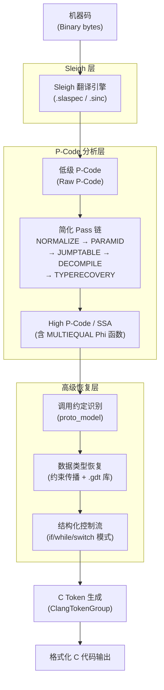

# 反编译器（08）· Ghidra反编译器与P-Code分析

## 概述与定位

> [!abstract] TL;DR
> Ghidra 是 NSA 开源的逆向工程框架，其反编译器核心以 C++ 实现，通过 **Sleigh** 处理器规范语言将机器码翻译为 **P-Code**（一种 RISC 风格的中间表示），再经多轮简化 Pass、SSA 变换、调用约定识别、数据类型恢复，最终输出可读 C 代码。P-Code 的完整操作集公开可查、可扩展，使 Ghidra 成为学术研究与安全工程最具透明度的反编译平台之一。

Ghidra 于 2019 年由美国国家安全局（NSA）在 RSA 大会上正式开源，代码托管于 GitHub（`NationalSecurityAgency/ghidra`）。其反编译器核心位于 `Ghidra/Features/Decompiler/src/decompile/cpp/`，是一个独立的 C++ 进程，通过 XML 协议与 Java 前端通信。

与市场主流工具 IDA Pro + Hex-Rays 相比，Ghidra 提供了：

- **完全开源的反编译算法**：从 Sleigh 翻译到 P-Code 简化 Pass，每一步均可阅读、修改和扩展
- **内建多用户协作**：Ghidra Server 支持团队共享工程、注释同步
- **无商业许可限制**：可在自动化管线、云端分析、CTF 平台中自由部署
- **丰富的脚本 API**：`GhidraScript`（Java/Python）可直接访问反编译结果、P-Code AST、Varnode 图

Ghidra 支持的处理器架构超过 50 种，包括 x86/x64、ARM/AArch64、MIPS（大小端）、RISC-V、PowerPC、68k、Sparc、AVR 等，每种架构通过独立的 Sleigh 规范文件描述。

---

## 原理与机制

### Ghidra 反编译管线总览

Ghidra 的反编译流程是一条严格分层的转换管线：机器码首先被 Sleigh 翻译引擎转换为低级 P-Code（raw P-Code），然后经过一系列简化 Pass 提升为 High P-Code（含 SSA/Phi 函数），最终结构化输出 C 代码。



### Sleigh 处理器规范语言

**Sleigh** 是 Ghidra 专为描述处理器指令集而设计的领域特定语言（DSL）。每条处理器指令的二进制格式与 P-Code 语义均由 Sleigh 文件精确定义。

**文件组织**：
- `.slaspec`：主规范文件（入口，定义寄存器布局、指令表、地址空间）
- `.sinc`：include 片段（按指令组拆分，减小单文件体积）
- 路径：`Ghidra/Processors/<arch>/data/languages/`

**Sleigh 基本结构**：

```sleigh
# ─── 地址空间 ───
define endian=little;
define alignment=1;
define space ram type=ram_space size=4 default;
define space register type=register_space size=4;

# ─── 寄存器定义 ───
define register offset=0x00 size=4
    [ EAX ECX EDX EBX ESP EBP ESI EDI ];
define register offset=0x20 size=4
    [ EIP ];
define register offset=0x30 size=1
    [ CF ZF SF OF ];

# ─── 标志位宏 ───
macro setResultFlags(result) {
    ZF = (result == 0);
    SF = (result s< 0);
}

# ─── ADD r/m32, imm8 指令定义 ───
:ADD Rmr32, Imm8s is opbyte=0x83 & reg_opcode=0 & Rmr32 & Imm8s {
    local tmp:4 = Rmr32 + sext(Imm8s:4);
    CF = carry(Rmr32, sext(Imm8s:4));
    OF = scarry(Rmr32, sext(Imm8s:4));
    setResultFlags(tmp);
    Rmr32 = tmp;
}

# ─── MOV r32, imm32 ───
:MOV Reg32, Imm32 is ... {
    Reg32 = Imm32;
}

# ─── JMP rel32（相对跳转） ───
:JMP rel32 is opbyte=0xE9 & rel32 {
    goto [inst_start + rel32 + 5];
}
```

关键概念：
- `local tmp`：声明一个 P-Code 临时 Varnode（不对应物理寄存器）
- `sext()`：符号扩展内建构造器，生成 `INT_SEXT` P-Code 操作
- `carry()` / `scarry()`：进位/有符号溢出检测构造器
- `macro`：Sleigh 宏，展开为一系列 P-Code 操作
- `s<`：有符号比较运算符（对应 `INT_SLESS`）

Sleigh 文件经过 `sleigh` 编译器（`Ghidra/Features/Sleigh/`）编译为二进制 `.sla` 格式，供反编译器运行时加载。

### P-Code 中间表示

P-Code（"Program Code"）是 Ghidra 的核心中间表示，设计为：

1. **RISC 风格**：每条 P-Code 操作最多两个输入、一个输出，操作语义明确
2. **Varnode 为基本单元**：每个操作数（输入/输出）均为 Varnode，由 `(address_space, offset, size)` 三元组唯一标识
3. **两级形式**：低级 P-Code（raw，直接对应机器指令）和 High P-Code（SSA 形式，含 Phi 函数）

**Varnode 的地址空间类型**：

| 地址空间 | 含义 | 示例 |
|---------|------|------|
| `ram` | 内存中的值 | `ram:0x1000:4`（地址 0x1000 处的 4 字节） |
| `register` | 物理寄存器 | `register:0x00:4`（EAX） |
| `unique` | 临时变量 | `unique:0x100:4`（Sleigh local） |
| `const` | 常量 | `const:42:4` |
| `stack` | 栈帧槽位 | `stack:0x-8:8` |

---

## 结构/算法/伪代码详解

### P-Code 完整操作集

下表列出 Ghidra P-Code 的所有主要操作，涵盖低级和 High P-Code：

| 操作 | 类别 | 语义描述 | 伪代码 |
|------|------|---------|--------|
| `COPY` | 数据移动 | 赋值 | `dst = src` |
| `LOAD` | 内存 | 从内存读取 | `dst = *[space]src` |
| `STORE` | 内存 | 写入内存 | `*[space]dst = src` |
| `INT_ADD` | 整数算术 | 无符号加法 | `dst = src0 + src1` |
| `INT_SUB` | 整数算术 | 无符号减法 | `dst = src0 - src1` |
| `INT_MULT` | 整数算术 | 乘法（低位） | `dst = src0 * src1` |
| `INT_DIV` | 整数算术 | 无符号除法 | `dst = src0 / src1` |
| `INT_SDIV` | 整数算术 | 有符号除法 | `dst = (signed)src0 / src1` |
| `INT_REM` | 整数算术 | 无符号取余 | `dst = src0 % src1` |
| `INT_SREM` | 整数算术 | 有符号取余 | `dst = (signed)src0 % src1` |
| `INT_AND` | 位运算 | 按位与 | `dst = src0 & src1` |
| `INT_OR` | 位运算 | 按位或 | `dst = src0 \| src1` |
| `INT_XOR` | 位运算 | 按位异或 | `dst = src0 ^ src1` |
| `INT_NEGATE` | 位运算 | 算术取反 | `dst = -src` |
| `INT_2COMP` | 位运算 | 二补数取反 | `dst = ~src + 1` |
| `INT_LEFT` | 移位 | 逻辑左移 | `dst = src0 << src1` |
| `INT_RIGHT` | 移位 | 逻辑右移 | `dst = src0 >> src1` |
| `INT_SRIGHT` | 移位 | 算术右移 | `dst = (signed)src0 >> src1` |
| `INT_ZEXT` | 扩展 | 零扩展 | `dst = zext(src)` |
| `INT_SEXT` | 扩展 | 符号扩展 | `dst = sext(src)` |
| `INT_EQUAL` | 比较 | 等于 | `dst = (src0 == src1) ? 1 : 0` |
| `INT_NOTEQUAL` | 比较 | 不等于 | `dst = (src0 != src1) ? 1 : 0` |
| `INT_LESS` | 比较 | 无符号小于 | `dst = (src0 < src1) ? 1 : 0` |
| `INT_LESSEQUAL` | 比较 | 无符号小于等于 | `dst = (src0 <= src1) ? 1 : 0` |
| `INT_SLESS` | 比较 | 有符号小于 | `dst = ((signed)src0 < src1) ? 1 : 0` |
| `INT_SLESSEQUAL` | 比较 | 有符号小于等于 | `dst = ((signed)src0 <= src1) ? 1 : 0` |
| `INT_CARRY` | 进位 | 无符号加进位 | `dst = carry(src0, src1)` |
| `INT_SCARRY` | 进位 | 有符号加溢出 | `dst = scarry(src0, src1)` |
| `INT_SBORROW` | 借位 | 有符号减溢出 | `dst = sborrow(src0, src1)` |
| `BOOL_AND` | 逻辑 | 逻辑与 | `dst = src0 && src1` |
| `BOOL_OR` | 逻辑 | 逻辑或 | `dst = src0 \|\| src1` |
| `BOOL_XOR` | 逻辑 | 逻辑异或 | `dst = src0 ^^ src1` |
| `BOOL_NEGATE` | 逻辑 | 逻辑非 | `dst = !src` |
| `FLOAT_ADD` | 浮点 | 浮点加 | `dst = src0 + src1` |
| `FLOAT_SUB` | 浮点 | 浮点减 | `dst = src0 - src1` |
| `FLOAT_MULT` | 浮点 | 浮点乘 | `dst = src0 * src1` |
| `FLOAT_DIV` | 浮点 | 浮点除 | `dst = src0 / src1` |
| `FLOAT_EQUAL` | 浮点 | 浮点等于 | `dst = (src0 == src1)` |
| `FLOAT_LESS` | 浮点 | 浮点小于 | `dst = (src0 < src1)` |
| `FLOAT_INT2FLOAT` | 浮点转换 | 整数转浮点 | `dst = (float)src` |
| `FLOAT_FLOAT2FLOAT` | 浮点转换 | 浮点精度转换 | `dst = (float)src` |
| `FLOAT_TRUNC` | 浮点转换 | 浮点截断为整数 | `dst = (int)trunc(src)` |
| `PIECE` | 拼接 | 高低位拼接 | `dst = concat(src0_hi, src1_lo)` |
| `SUBPIECE` | 截取 | 取子位域 | `dst = src[lo_byte..lo_byte+size]` |
| `POPCOUNT` | 位计数 | 置位位数 | `dst = popcount(src)` |
| `BRANCH` | 控制流 | 无条件跳转 | `goto dst` |
| `CBRANCH` | 控制流 | 条件跳转 | `if (cond) goto dst` |
| `BRANCHIND` | 控制流 | 间接跳转 | `goto *dst` |
| `CALL` | 控制流 | 直接调用 | `call dst` |
| `CALLIND` | 控制流 | 间接调用 | `call *dst` |
| `CALLOTHER` | 控制流 | 用户定义操作 | 处理器特殊指令 |
| `RETURN` | 控制流 | 函数返回 | `return [src]` |
| `MULTIEQUAL` | High P-Code | Phi 函数（SSA） | `dst = φ(src0, src1, ...)` |
| `INDIRECT` | High P-Code | 间接副作用 | 调用/跳转副作用标记 |
| `CAST` | High P-Code | 类型转换（无码改变） | `dst = (type)src` |
| `PTRADD` | High P-Code | 指针加法 | `dst = ptr + index * size` |
| `PTRSUB` | High P-Code | 结构体字段访问 | `dst = &ptr->field` |
| `SEGMENTOP` | 分段 | 段地址计算 | `dst = seg(src0, src1)` |
| `CPOOLREF` | 常量池 | JVM 常量池引用 | `dst = cpool[src]` |
| `NEW` | 对象 | 对象分配（JVM/DEX）| `dst = new type` |

### 简化 Pass 链详解

Ghidra 反编译器的简化 Pass 链由 `ActionGroup` 驱动，主要阶段包括：

**NORMALIZE 阶段**：
- 消除冗余 COPY 操作
- 常量折叠（`INT_ADD const, const → COPY result`）
- 死代码消除（无任何使用者的 Varnode 操作）
- 拆分多寄存器操作（`PIECE`/`SUBPIECE`）

**PARAMID 阶段**：
- 识别函数参数传递模式
- 根据 `proto_model`（调用约定模型）确定参数个数和类型
- 处理 vararg（可变参数）函数

**JUMPTABLE 阶段**：
- 识别 `switch` 跳转表模式
- 分析 `BRANCHIND` 操作，确定所有目标地址
- 生成跳转表注释和控制流边

**DECOMPILE 阶段**（核心）：
- 构建 SSA 形式（插入 `MULTIEQUAL` Phi 函数）
- 活跃变量分析（Liveness Analysis）
- 变量合并（Coalescing）：减少临时变量数量
- 符号范围推断（Value Set Analysis）

**TYPERECOVERY 阶段**：
- 类型约束传播（Type Constraint Propagation）
- 识别结构体成员访问（`PTRADD`/`PTRSUB`）
- 从函数签名库（`.gdt`）匹配已知类型

### x86 ADD 指令的完整 P-Code 展开

以 `ADD EAX, 5`（机器码 `83 C0 05`）为例，展示低级 P-Code：

```
// ADD EAX, 5  @ 0x401000
(unique:0x00:4)   INT_ADD   (register:EAX:4), (const:5:4)
(register:CF:1)   INT_CARRY (register:EAX:4), (const:5:4)
(register:OF:1)   INT_SCARRY (register:EAX:4), (const:5:4)
(register:ZF:1)   INT_EQUAL (unique:0x00:4), (const:0:4)
(register:SF:1)   INT_SLESS (unique:0x00:4), (const:0:4)
(register:EAX:4)  COPY      (unique:0x00:4)
```

经过 NORMALIZE 简化后，冗余 COPY 被消除：

```
// 简化后
(register:EAX:4)  INT_ADD   (register:EAX:4), (const:5:4)
(register:CF:1)   INT_CARRY (register:EAX_old:4), (const:5:4)
...
```

---

## 工具视角/实战

### DecompInterface：Java API 使用完整示例

`DecompInterface` 是 Ghidra Java API 中访问反编译结果的核心接口，适用于 GhidraScript 和 Analyzer 插件：

```java
import ghidra.app.decompiler.*;
import ghidra.program.model.listing.*;
import ghidra.program.model.pcode.*;
import java.util.Iterator;

// ── 在 GhidraScript 的 run() 方法中 ──
public class MyDecompScript extends GhidraScript {
    @Override
    public void run() throws Exception {
        // 1. 初始化反编译接口
        DecompInterface ifc = new DecompInterface();
        
        // 2. 绑定当前程序（必须在 decompileFunction 前调用）
        ifc.openProgram(currentProgram);
        
        // 3. 配置反编译选项
        DecompileOptions opts = new DecompileOptions();
        opts.setMaxPayloadMBytes(64);          // 最大 XML 负载
        opts.setDefaultTimeout(60);             // 超时秒数
        opts.setSimplificationStyle("decompile"); // 简化级别
        ifc.setOptions(opts);
        
        // 4. 获取目标函数（以 main 为例）
        Function func = null;
        for (Function f : currentProgram.getFunctionManager()
                                         .getFunctions(true)) {
            if ("main".equals(f.getName())) {
                func = f;
                break;
            }
        }
        if (func == null) {
            println("未找到 main 函数");
            return;
        }
        
        // 5. 执行反编译（60 秒超时）
        DecompileResults results = ifc.decompileFunction(func, 60, monitor);
        
        if (!results.decompileCompleted()) {
            println("反编译失败: " + results.getErrorMessage());
            return;
        }
        
        // 6. 获取 High P-Code 函数（含 SSA）
        HighFunction hf = results.getHighFunction();
        
        // 7. 遍历所有 P-Code 操作
        println("=== P-Code Operations ===");
        Iterator<PcodeOpAST> ops = hf.getPcodeOps();
        while (ops.hasNext()) {
            PcodeOpAST op = ops.next();
            StringBuilder sb = new StringBuilder();
            
            // 输出 Varnode
            Varnode out = op.getOutput();
            if (out != null) {
                sb.append(out.toString()).append(" = ");
            }
            
            // 操作码
            sb.append(op.getMnemonic()).append("  ");
            
            // 输入 Varnode 列表
            for (int i = 0; i < op.getNumInputs(); i++) {
                if (i > 0) sb.append(", ");
                sb.append(op.getInput(i).toString());
            }
            
            println(sb.toString());
        }
        
        // 8. 关闭接口（释放 C++ 子进程资源）
        ifc.dispose();
    }
}
```

### Varnode 查询与高级变量分析

```java
// ── 在获得 HighFunction hf 后 ──

// 查询局部变量符号表
println("=== 局部变量 ===");
LocalSymbolMap lsm = hf.getLocalSymbolMap();
Iterator<HighSymbol> syms = lsm.getSymbols();
while (syms.hasNext()) {
    HighSymbol sym = syms.next();
    HighVariable hv = sym.getHighVariable();
    if (hv == null) continue;
    
    String name     = sym.getName();
    String typeName = hv.getDataType().getName();
    int    size     = hv.getSize();
    
    println(String.format("  变量: %-20s 类型: %-16s 大小: %d", 
                          name, typeName, size));
    
    // 遍历该变量的所有 Varnode 实例（SSA 版本）
    for (Varnode vn : hv.getInstances()) {
        String loc;
        if (vn.isRegister()) {
            loc = "寄存器@" + vn.getAddress();
        } else if (vn.isUnique()) {
            loc = "临时@" + vn.getOffset();
        } else {
            loc = "栈@" + vn.getOffset();
        }
        println(String.format("    vn: %s  size=%d  %s",
                              vn.toString(), vn.getSize(), loc));
    }
}

// 查询函数参数
println("=== 函数参数 ===");
for (int i = 0; i < hf.getFunctionPrototype().getNumParams(); i++) {
    HighParam param = hf.getFunctionPrototype().getParam(i);
    println("  param[" + i + "]: " + param.getName() 
            + " : " + param.getDataType().getName());
}
```

### P-Code CFG 与基本块分析

```java
// 遍历 High P-Code 控制流图（PcodeBlockGraph）
println("=== 基本块 CFG ===");
BlockGraph bg = hf.getBasicBlocks();
int numBlocks = bg.getSize();

for (int i = 0; i < numBlocks; i++) {
    PcodeBlockBasic block = (PcodeBlockBasic) bg.getBlock(i);
    println("Block[" + i + "] 地址=" + block.getStart() 
            + "  前驱=" + block.getInSize() 
            + "  后继=" + block.getOutSize());
    
    // 遍历块内的 P-Code 操作
    Iterator<PcodeOp> it = block.getIterator();
    while (it.hasNext()) {
        PcodeOp op = it.next();
        // MULTIEQUAL 代表 Phi 函数（SSA 汇合点）
        if (op.getOpcode() == PcodeOp.MULTIEQUAL) {
            println("  Φ: " + op.getOutput() + " = φ(...)");
        }
    }
}
```

### 实战场景：批量识别危险函数调用

```java
// 识别所有间接调用（CALLIND）和直接调用（CALL）中调用 strcpy 的站点
import ghidra.program.model.symbol.*;

// 查找 strcpy 符号
Symbol strcpySym = null;
for (Symbol s : currentProgram.getSymbolTable()
                               .getSymbols("strcpy")) {
    strcpySym = s;
    break;
}
if (strcpySym == null) { println("strcpy 未找到"); return; }
Address strcpyAddr = strcpySym.getAddress();

// 遍历所有函数，查找调用 strcpy 的 P-Code CALL 操作
DecompInterface ifc = new DecompInterface();
ifc.openProgram(currentProgram);
ifc.setOptions(new DecompileOptions());

for (Function f : currentProgram.getFunctionManager()
                                 .getFunctions(true)) {
    DecompileResults dr = ifc.decompileFunction(f, 30, monitor);
    if (!dr.decompileCompleted()) continue;
    
    HighFunction hf = dr.getHighFunction();
    Iterator<PcodeOpAST> ops = hf.getPcodeOps();
    while (ops.hasNext()) {
        PcodeOpAST op = ops.next();
        if (op.getOpcode() == PcodeOp.CALL) {
            Varnode target = op.getInput(0);
            if (target.isAddress() 
                && target.getAddress().equals(strcpyAddr)) {
                println("[!] " + f.getName() 
                        + " @ " + op.getSeqnum().getTarget()
                        + " 调用了 strcpy");
            }
        }
    }
}
ifc.dispose();
```

### Ghidra vs IDA Pro 对比

| 维度 | Ghidra | IDA Pro + Hex-Rays |
|------|--------|-------------------|
| 开源性 | 完全开源（Apache 2.0）| 闭源商业软件 |
| 反编译算法 | 可阅读/修改（C++ 源码） | 黑盒，无法修改 |
| 许可费用 | 免费 | Hex-Rays 授权数千美元/座 |
| 处理器支持 | 50+ 架构（Sleigh 可扩展） | 50+ 架构（IDA Pro 插件/IDP） |
| P-Code/IL | P-Code（公开规范） | microcode（内部，受限访问） |
| 脚本 API | Java GhidraScript / Jython | IDAPython（成熟） |
| 多用户协作 | 内建 Ghidra Server | 需第三方方案 |
| 自动化部署 | GhidraHeadless 支持无头运行 | 批量授权复杂 |
| 反编译质量 | 良好，复杂结构有时不如 IDA | 通常被认为更成熟 |
| 插件生态 | 快速增长（BinExport、Pwndbg 集成等）| 成熟生态（数百插件） |
| 类型库 | `.gdt` 格式，可自定义导入 | `.til` 格式，大量官方类型库 |

> [!tip] 选择建议
> - 学术研究、算法实验、定制反编译逻辑 → **Ghidra**（源码可读）
> - 高复杂度二进制、需要成熟调试器集成 → **IDA Pro**
> - 大规模自动化安全扫描管线 → **Ghidra Headless**（无许可限制）

---

## 安全性与正确使用

### 法律与伦理边界

> [!warning] 使用须知
> 反编译工具的使用需遵守目标软件的许可协议（EULA）以及所在司法管辖区的法律。在未获授权的情况下反编译商业软件可能违反《计算机欺诈与滥用法案》（CFAA，美国）或类似法规。合法使用场景包括：安全研究（负责任披露）、互操作性分析、CTF 竞赛、自有软件逆向调试。

### Ghidra 开源带来的研究价值

Ghidra 开源反编译算法本身是一把双刃剑：

**正向价值**：
- 安全研究者可验证反编译结果的正确性（对照 Sleigh 规范检查 P-Code）
- 学术界可复现、对比、改进反编译算法
- 企业可审计 Ghidra 本身不含后门（尽管其来自 NSA，仍有学者审计代码）

**潜在风险**：
- 反编译算法可预测，恶意软件作者可针对性地混淆以绕过 Ghidra 分析
- Sleigh 规范错误会导致整批指令语义错误（静默误判，比工具崩溃更危险）

### Sleigh 规范错误的风险

> [!danger] 高风险：Sleigh 语义错误
> 若某条指令的 Sleigh 语义定义错误（如符号扩展方向错误、标志位逻辑取反），Ghidra 会生成语义上错误但语法上合法的 P-Code。这类错误极难发现，因为反编译输出"看起来合理"但逻辑含义与实际执行不符。验证方法：
> 1. 对比官方处理器手册与 Sleigh 文件
> 2. 使用 `pcode` 命令行工具（`Ghidra/Features/Decompiler/`）单独翻译指令并检查
> 3. 与动态执行结果（如 QEMU 插桩）交叉比对

### DecompInterface 资源管理

```java
// 错误示例：忘记 dispose，导致 C++ 子进程泄漏
DecompInterface ifc = new DecompInterface();
ifc.openProgram(currentProgram);
// ... 使用 ...
// 忘记 ifc.dispose()!  → ghidra_analyzeHeadless 进程积累

// 正确做法：try-with-resources 模式（Ghidra 5.x+ 支持）
DecompInterface ifc = new DecompInterface();
try {
    ifc.openProgram(currentProgram);
    // ... 使用 ...
} finally {
    ifc.dispose();  // 确保释放
}
```

---

## 小结

Ghidra 反编译器的核心架构建立在三个互相协作的层次之上：

1. **Sleigh 规范层**：用 DSL 精确描述每条机器指令的二进制格式和 P-Code 语义，使 Ghidra 的架构扩展变为"写规范"而非"改核心代码"
2. **P-Code 分析层**：以完整的 30+ 操作集构建统一的 RISC IR，从低级 P-Code 经多轮简化 Pass 提升为 High P-Code/SSA 形式，在此层完成调用约定识别、数据类型恢复等高级分析
3. **Java API 层**：`DecompInterface` 将 C++ 反编译核心的能力暴露为 Java 接口，使研究者和安全工程师无需修改核心代码即可访问 P-Code AST、Varnode 图和结构化 C 输出

相比 IDA Pro 的黑盒 microcode，P-Code 的公开规范使 Ghidra 在算法研究、批量自动化分析和平台扩展上具有结构性优势。其开源性也意味着每一步转换都可被审计、验证和改进，这正是现代安全工程所需要的透明度。

理解 Ghidra 的 P-Code 管线，是深入理解现代反编译器工作原理的最佳切入点之一。

---

## 相关阅读

- [[05.中间表示IR设计：LLVM-IR与VEX与P-Code]] — P-Code 操作语义与 VEX IR、LLVM IR 的横向对比
- [[07.Hex-Rays反编译器内部机制]] — IDA Pro Hex-Rays microcode 管线详解
- [[09.反混淆技术与对抗]] — 针对反编译器的混淆手法与对抗分析
- [[14.Ghidra脚本与插件开发]] — GhidraScript 完整开发指南与插件架构

---

⬅️ 上一篇 [[07.Hex-Rays反编译器内部机制]] ｜ 🏠 [[00.反编译器与反汇编引擎原理总览]] ｜ 下一篇 [[09.反混淆技术与对抗]] ➡️
