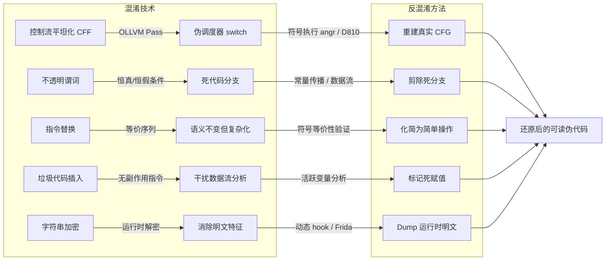

# 反编译器（09）· 反混淆技术与对抗

## 概述与定位

> [!abstract] TL;DR
> 代码混淆通过结构打乱、控制流伪装、语义等价替换等手段增加逆向分析难度。反混淆是安全研究人员、CTF 参赛者和恶意软件分析师的核心技能：理解每类混淆技术的实现原理，才能选择正确的工具和策略（静态简化、符号执行、动态追踪）逆转混淆效果，还原真实语义。

> [!caution] 合规声明与使用边界
> 本章内容仅面向**防御与分析视角**：讲清混淆原理有助于分析恶意软件、辅助 CTF 竞赛、研究自有程序的保护强度。**不提供、不支持针对他人商业软件的未授权破解、反编译及绕过许可证保护的操作**。在实施任何逆向分析前，请先确认您拥有合法授权（著作权、渗透测试合同、研究免责协议等）。非法破解他人软件在绝大多数司法管辖区属于违法行为。

混淆（Obfuscation）与反混淆（Deobfuscation）是逆向工程中攻防双方持续博弈的核心战场。随着 OLLVM、Tigress、VMProtect 等工具的成熟，现代软件混淆已不再是简单的名称改写，而是深入到 IR 层、控制流层乃至指令语义层。本章系统梳理五类主流混淆技术的实现原理、识别特征与反混淆策略，并给出对应的工具链和自动化脚本示例。

**混淆的三个层次**：

| 层次 | 典型工具 | 作用点 |
|------|----------|--------|
| 源码级 | Tigress、ProGuard（Java）、JavaScript Obfuscator | AST 改写、变量名混淆 |
| LLVM IR 级 | OLLVM、Hikari、Obfuscator-LLVM | 中间代码 Pass 改写 |
| 二进制级 | VMProtect、Themida、UPX | ELF/PE 后处理，字节码变换 |

**分析场景**：CTF 逆向题（学习理解）、自有软件混淆强度评估（安全研究）、恶意软件家族特征提取（威胁情报）。每种场景的分析深度和工具侧重各有不同。

---

## 原理与机制

混淆的本质是在**保持程序语义不变**的前提下，增加静态/动态分析的复杂度。从信息论角度看，混淆会降低代码结构的规律性，使得基于模式匹配的分析工具失效；同时，混淆也必须保证程序的可执行性，这就给动态分析留下了突破口——程序始终必须"正确地跑"。



上图展示了五类主流混淆技术及其对应的反混淆路径，最终目标都是产生人类可读的伪代码或干净的 CFG。下面逐一深入每类技术的机制。

---

## 结构/算法/伪代码详解

### 控制流平坦化（Control Flow Flattening，CFF）

控制流平坦化是 OLLVM 项目最著名的 Pass，也是工业界应用最广的二进制混淆手段之一。其核心思想是**消除 CFG 中的层次结构**：原本嵌套的 if/while/for 控制流被拆散成若干"平级"的基本块，通过一个中央调度器（Dispatcher）统一分发。

**OLLVM CFF 实现原理**：

1. **拆分基本块**：遍历函数的所有基本块，去除直接的后继边。
2. **引入 state_var**：在函数入口分配一个整型状态变量（通常是栈变量），每个原始基本块被分配一个唯一的 case 值。
3. **构建调度器**：创建一个 `switch(state_var)` 大循环，所有基本块从这里跳出，执行后再通过赋值 `state_var = next_case` 回到调度器。
4. **重定向跳转**：原始控制流中的条件跳转被转换为对 `state_var` 的条件赋值，条件自身不改变，但跳转目标被替换为对调度器的无条件回跳。

**代码示例：平坦化前后对比**

```c
// ========= 原始代码 =========
int compute(int a, int b) {
    int x;
    if (a > b) {
        x = a - b;       // 块 A
    } else {
        x = b - a;       // 块 B
    }
    x = x * 2;           // 块 C
    return x + 1;         // 块 D
}

// ========= CFF 平坦化后（简化示意）=========
int compute_flattened(int a, int b) {
    int x;
    int state = 0;        // 初始状态：进入调度器前先进分支判断块

    // 预分支块（pre-dispatcher）：确定第一个 case
    state = (a > b) ? 1 : 2;

    while (1) {
        switch (state) {
            case 1:          // 对应块 A
                x = a - b;
                state = 3;   // 下一个目标：块 C
                break;
            case 2:          // 对应块 B
                x = b - a;
                state = 3;
                break;
            case 3:          // 对应块 C
                x = x * 2;
                state = 4;
                break;
            case 4:          // 对应块 D（出口）
                return x + 1;
        }
    }
}
```

**在 IDA / Ghidra 中的识别特征**：

- CFG 视图中出现大量基本块**收敛到同一个节点**（调度器 switch），整体形似"太阳花"或"车轮"结构。
- 函数的环形复杂度（Cyclomatic Complexity）显著偏高，通常是原始代码的 3～10 倍。
- 存在一个被**几乎所有基本块**引用的栈变量（`state_var`），每个块末尾都有对它的赋值。
- `switch` 语句的 case 值可能是随机散列值（OLLVM 默认用哈希化 case 值防止简单识别）。

**反混淆策略**：

1. **符号执行（angr/S2E）**：对 `state_var` 建立约束，穷举所有可达路径，从执行路径序列重建真实 CFG。适合中等规模函数，大函数路径爆炸问题需配合路径剪枝。
2. **动态追踪（GDB + Frida trace）**：用覆盖率工具记录运行时真实跳转序列，再将多次执行的 trace 求并集，近似还原真实 CFG。
3. **D810 IDA 插件**：专门针对 OLLVM CFF 的自动化 IDA 插件，通过识别调度器结构、提取 state_var 赋值链，自动替换为 goto 式的直接跳转，恢复可读的伪代码。

---

### 不透明谓词（Opaque Predicates）

不透明谓词（Opaque Predicate）是一种利用**数学恒真式或恒假式**构造条件跳转的技术。从编译器视角看，这些条件在编译时已经是常量；但静态分析工具如果不做值域分析，就会把它当作"真实的条件分支"处理，导致分析结果分叉、产生大量不可达路径。

**分类**：

| 类型 | 描述 | 示例 |
|------|------|------|
| 恒真谓词（Always-True） | 条件永远为真，else 分支是死代码 | `(x*x + x) % 2 == 0` |
| 恒假谓词（Always-False） | 条件永远为假，if 分支是死代码 | `(x*x + x) % 2 != 0` |
| 不透明常量 | 对变量施加的运算结果恒为某值 | `(x ^ (x-1)) & x == 0`（x 为 2 的幂时恒真） |

**代码示例**：

```c
// 恒假谓词：x²+x 对任意整数 x 均为偶数，
// 因此 (x*x + x) % 2 != 0 永远为假，
// fake_code() 从不执行
void process(int x) {
    if ((x * x + x) % 2 != 0) {
        // 死代码：用于迷惑分析工具
        fake_decryption_routine();
        exit(-1);
    }
    // 真正的逻辑
    real_processing(x);
}

// 恒真谓词：De Morgan 展开
void check(unsigned int a) {
    // (a | ~a) 对任意 a 恒为 0xFFFFFFFF（全 1），非零即为真
    if ((a | (~a)) != 0) {
        do_work();        // 永远执行
    } else {
        red_herring();    // 永远不执行
    }
}
```

**识别与消除方法**：

1. **常量传播（Constant Propagation）**：反编译器在 IR 层做值域分析时，若能推导出条件表达式的值为编译期常量，则可直接折叠分支，消除不透明谓词。IDA 的 Hex-Rays 在简单情况下会自动完成此优化。
2. **符号执行验证**：angr 可以对条件表达式建立符号约束，若求解器返回"无解"（always-false）或"唯一解"（always-true），则识别为不透明谓词。
3. **模式匹配数据库**：针对已知的不透明谓词数学形式（`x*x+x`、`x|~x`、`a*a>=0`、`(y&z)+(y^z)==y+z` 等）建立签名库，扫描 IR 进行模式匹配。
4. **动态覆盖率分析**：运行程序并收集基本块覆盖率；从未执行过的基本块大概率是死代码（不透明谓词的恒假分支）。

消除操作：确认为恒真谓词后，将条件跳转替换为无条件跳转（或直接移除死分支）；在 IDA 中可手动 patch 跳转指令（`jne → jmp`），或用脚本批量处理。

---

### 指令替换（Instruction Substitution）

指令替换在语义等价的前提下，用更复杂的指令序列替换简单操作，主要目的是混淆数据流分析，使反编译器难以识别原始的算术/逻辑意图。

**常见替换规则（OLLVM 实现的部分）**：

```
// 加法替换（利用半加器展开）
原始: r = x + y
替换: r = (x ^ y) + 2 * (x & y)
     或: r = x - (-(y))
     或: r = x + y + (rand_const - rand_const)  // 加零干扰

// 减法替换
原始: r = x - y
替换: r = x + (~y) + 1          // 利用补码定义

// 与运算替换（De Morgan）
原始: r = x & y
替换: r = ~(~x | ~y)

// 或运算替换（De Morgan）
原始: r = x | y
替换: r = ~(~x & ~y)

// 异或替换
原始: r = x ^ y
替换: r = (x | y) - (x & y)
     或: r = (x & ~y) | (~x & y)
```

**识别策略**：

现代反编译器（Hex-Rays、Ghidra Decompiler）内置了较强的代数化简能力，对于单层指令替换通常能自动还原。难点在于**多层嵌套替换**——多个替换 Pass 叠加后形成复合表达式，超出反编译器简化引擎的能力边界。

识别手段：
- **符号等价性验证**：用 Z3 SMT 求解器对混淆表达式和已知简单形式进行等价性证明。若 `Z3.prove(expr_obf == expr_simple)` 返回 True，则确认等价，可用简单形式替换。
- **代数化简引擎**：Triton、miasm 的 IR 层均内置化简器，可对 IR 表达式做规范化（Canonicalization），将复杂表达式化简到 NF（Normal Form）后比较。

---

### MBA 混淆（详见第 18 章）

**混合布尔算术（Mixed Boolean-Arithmetic，MBA）** 是 VMProtect 3.x 和 OLLVM 的重要混淆手段：将算术运算与位运算混合为语义等价但极难化简的表达式（例如将 `a + b` 展开为含多项 `&`、`|`、`^`、`~` 的复合式）。由于 MBA 恒等式在整数环上合法，Z3 等 SMT 求解器**直接展开会因表达式爆炸而超时**，需要程序合成类工具（如 SiMBA、Arybo、loki）做模式重写或基于机器学习的化简。MBA 的原理、恒等式体系及自动化反混淆流程详见 [[18.MBA混淆原理与自动化反混淆]]。

---

### 垃圾代码插入（Junk Code Insertion）

垃圾代码（Junk Code / Dead Code）是指被插入程序中、对程序最终输出无任何影响的指令序列。其目的是增加代码体积，干扰数据流分析和模式识别，拉高分析人员的噪音比。

**典型垃圾代码模式（x86 汇编）**：

```asm
; --- 类型一：push/pop 对消 ---
push  eax
pop   eax          ; 状态恢复，无净效果

; --- 类型二：自异或清零再加 0 ---
xor   ebx, ebx    ; ebx = 0
add   ebx, 0      ; ebx 仍为 0，无意义

; --- 类型三：无效地址计算 ---
lea   ecx, [ecx+0]    ; ecx 不变

; --- 类型四：条件跳转绕过的死代码块 ---
jmp   real_code
garbage_block:         ; 下面的指令永远不执行
    mov eax, 0xdeadbeef
    int 3
real_code:
    ...

; --- 类型五：冗余标志操作 ---
cmp   eax, eax     ; ZF=1，但下面不使用 ZF
nop
```

**识别与剔除**：

1. **活跃变量分析（Liveness Analysis）**：在 IR 层计算每条赋值的 def-use 链；若某次赋值的结果从未被后续指令 use（死赋值，Dead Assignment），则为垃圾代码候选。
2. **副作用分析**：确认指令除修改目标寄存器/内存外，无其他副作用（不影响内存、不产生 I/O、不抛出异常），则可安全删除。
3. **覆盖率辅助**：动态执行时从未覆盖的基本块，结合静态分析确认为不可达后，可整体标记为垃圾代码。

---

### 字符串加密（String Encryption）

字符串是恶意软件分析中最重要的静态特征来源（API 名称、URL、注册表路径、C2 地址等）。字符串加密技术在程序入口之前或函数调用点动态解密字符串，避免明文出现在二进制中。

**常见加密方案**：

```c
// === 方案一：单字节 XOR ===
// 加密存储：每个字节与固定密钥 0x42 异或
unsigned char enc_url[] = { 0x29, 0x33, 0x22, 0x2A, ... };  // "http..."

const char* decrypt_xor(unsigned char* data, int len, unsigned char key) {
    char* buf = malloc(len + 1);
    for (int i = 0; i < len; i++) {
        buf[i] = data[i] ^ key;
    }
    buf[len] = 0;
    return buf;
}

// === 方案二：滚动 XOR（每字节密钥递增）===
const char* decrypt_rolling(unsigned char* data, int len, unsigned char seed) {
    char* buf = malloc(len + 1);
    unsigned char k = seed;
    for (int i = 0; i < len; i++) {
        buf[i] = data[i] ^ k;
        k = (k + 1) & 0xFF;   // 密钥滚动
    }
    buf[len] = 0;
    return buf;
}

// === 方案三：分块 RC4（恶意软件高级变体）===
// RC4 解密调用解密 payload 中的字符串表
```

**反混淆方法**：

1. **动态执行到解密点**：在调试器中在已知的解密函数处设断点，在返回时 dump `eax`/`rax`（返回值指向明文缓冲区）。
2. **Frida hook 脚本**：

```javascript
// Frida 脚本：hook 解密函数，自动打印每次解密的字符串
// 假设解密函数地址为 0x401234，返回值为 char*
var decryptFn = ptr("0x401234");

Interceptor.attach(decryptFn, {
    onLeave: function(retval) {
        var str = retval.readUtf8String();
        if (str && str.length > 0) {
            console.log("[String] " + str);
        }
    }
});
```

3. **IDA 脚本批量模拟解密**：对于简单的 XOR 加密，直接在 IDA 中写 Python 脚本，读取加密数组并计算明文：

```python
import idaapi, idc

# 假设已知加密数组起始地址和长度
enc_start = 0x404000
key = 0x42
length = 32

decrypted = []
for i in range(length):
    b = idc.get_wide_byte(enc_start + i)
    decrypted.append(chr(b ^ key))
print("Decrypted:", "".join(decrypted))
```

4. **emulation（unicorn/Triton）**：对解密函数做纯静态模拟执行，无需真实运行目标程序，适合恶意软件沙箱场景。

---

## 工具视角/实战

### 反混淆工具链总览

| 工具 | 类型 | 核心能力 | 适用混淆类型 |
|------|------|----------|-------------|
| **D810** (IDA 插件) | 静态 + 模式匹配 | 自动识别并还原 OLLVM CFF | CFF、不透明谓词 |
| **deflat.py** (angr) | 符号执行脚本 | angr 路径探索 + 二进制 patch | CFF |
| **miasm** | Python IR 框架 | 自定义 IR 化简 Pass | 指令替换、垃圾代码 |
| **Binary Ninja Workflow** | 静态分析平台 | 自定义分析 Pass（Python/C++） | 多类混淆 |
| **Triton** | 符号执行框架 | 表达式化简、污点分析 | 指令替换、不透明谓词 |
| **Frida** | 动态 instrumentation | 运行时 hook、trace 采集 | 字符串加密、动态行为 |
| **angr** | 符号执行框架 | 路径探索、约束求解 | CFF、不透明谓词 |
| **Z3** | SMT 求解器 | 等价性证明、约束求解 | 不透明谓词、指令替换 |

### IDA Python 辅助反混淆脚本

以下脚本演示如何在 IDA 中批量扫描可疑的垃圾代码块（仅含 nop/xchg 等无副作用指令的基本块），辅助人工研判：

```python
import idautils
import idc
import idaapi

# 无副作用指令集（可扩展）
JUNK_MNEMS = {
    'nop', 'xchg',
    # push/pop 同一寄存器（需进一步匹配）
}

def is_junk_block(block):
    """
    粗略判断一个基本块是否只含无副作用指令。
    实际分析中还需考虑 flags 修改、内存访问等副作用。
    """
    heads = list(idautils.Heads(block.start_ea, block.end_ea))
    if not heads:
        return False
    return all(idc.print_insn_mnem(h).lower() in JUNK_MNEMS for h in heads)

def find_opaque_cff_dispatchers():
    """
    扫描所有函数，找到扇入度(in-degree)异常高的基本块——CFF 调度器候选。
    """
    results = []
    for func_ea in idautils.Functions():
        f = idaapi.get_func(func_ea)
        if not f:
            continue
        flow = idaapi.FlowChart(f)
        block_list = list(flow)
        # 统计每个块的扇入度
        in_degree = {b.start_ea: 0 for b in block_list}
        for b in block_list:
            for succ in b.succs():
                if succ.start_ea in in_degree:
                    in_degree[succ.start_ea] += 1
        # 扇入度超过阈值的块是调度器候选
        threshold = max(3, len(block_list) // 3)
        for ea, deg in in_degree.items():
            if deg >= threshold:
                results.append((func_ea, ea, deg))
                print(f"[CFF Dispatcher?] func={func_ea:#x} block={ea:#x} in_degree={deg}")

    return results

def scan_junk_blocks():
    """扫描所有函数中的垃圾代码块候选"""
    for func_ea in idautils.Functions():
        f = idaapi.get_func(func_ea)
        if not f:
            continue
        for block in idaapi.FlowChart(f):
            if is_junk_block(block):
                print(f"[Junk Block?] func={func_ea:#x} block={block.start_ea:#x}-{block.end_ea:#x}")

# 运行扫描
print("=== 扫描 CFF 调度器候选 ===")
find_opaque_cff_dispatchers()

print("\n=== 扫描垃圾代码块候选 ===")
scan_junk_blocks()
```

### deflat.py 使用流程（OLLVM CFF 反混淆）

deflat.py 是社区广泛使用的 OLLVM CFF 反混淆脚本，基于 angr 符号执行：

```bash
# 安装依赖
pip install angr

# 基本用法：对目标二进制中的指定函数地址做 CFF 反混淆
# 输出 patch 后的二进制
python deflat.py -f target_binary --addr 0x401234

# 参数说明：
#   -f / --file    : 目标二进制文件路径
#   --addr         : 需要反混淆的函数起始地址（十六进制）
#   -o / --output  : 输出文件路径（默认：target_binary_recovered）
```

脚本内部流程：
1. 用 angr 加载二进制，定位函数入口。
2. 识别调度器块（扇入度最高的块）和 `state_var`（调度器 switch 的比较对象）。
3. 对每个 case 分支做符号执行，确定从每个块跳出时 `state_var` 的具体值，从而恢复边。
4. 将原始 `state_var` 赋值和无条件回跳指令替换为直接跳转（`jmp target`），将 patch 写回二进制。

### Frida 动态 trace CFF 真实路径

```javascript
// frida_cff_trace.js
// 用于收集运行时跳转序列，辅助还原 CFF 真实 CFG

var TARGET_FUNC_START = ptr("0x401234");
var TARGET_FUNC_END   = ptr("0x402000");

// 对函数内每个基本块入口处下 hook，记录执行顺序
// （需要预先从 IDA 导出基本块起始地址列表）
var block_entries = [
    ptr("0x401234"), ptr("0x401280"), ptr("0x4012c0"), // ...
];

var trace = [];

block_entries.forEach(function(addr) {
    Interceptor.attach(addr, {
        onEnter: function(args) {
            trace.push(addr.toString());
        }
    });
});

// 函数退出时打印 trace
Interceptor.attach(TARGET_FUNC_END, {
    onEnter: function() {
        console.log("[Trace] " + trace.join(" -> "));
        trace = [];
    }
});
```

---

## 安全性与正确使用

### 混淆的局限性

任何混淆方案都不能提供**完美的安全性**，原因在于：

1. **语义保持约束**：混淆必须保持程序语义不变，因此程序的真实行为总可以通过动态执行观察到。"混淆 = 安全"是一个常见误解；混淆只是提高分析成本，不能替代加密或硬件保护。
2. **动态分析突破静态混淆**：无论控制流如何被打乱，程序在运行时总要"做正确的事"。动态追踪（Frida、PIN、DynamoRIO）可以绕过几乎所有纯静态混淆手段。
3. **自动化工具进步**：D810、deflat.py 等工具已经使 OLLVM CFF 的反混淆几乎自动化。攻防之间的技术差距在不断缩小。

### 合理使用反混淆技术的场景

- **恶意软件分析**：对已知恶意家族（勒索软件、远控木马等）的样本进行分析，提取 IOC（网络特征、字符串、加密密钥），用于威胁情报生产。这是反混淆技术最重要的防御性应用场景。
- **CTF 竞赛**：参赛者对题目提供的二进制进行逆向，属于合法的学习和竞技活动。
- **自有软件安全评估**：开发者或安全团队对自己发布的产品评估混淆强度，确认保护效果是否达到预期。
- **漏洞研究（有授权）**：在 Bug Bounty 程序或渗透测试合同框架内，对目标系统进行授权的逆向分析。

### 实施反混淆时的注意事项

1. **确认授权**：反混淆操作本身可能触发 DMCA 第 1201 条款（反规避条款）或类似法律，在不确定的情况下咨询法律意见。
2. **隔离分析环境**：对不明来源的二进制（恶意软件样本）始终在隔离的虚拟机或沙箱中分析，避免感染分析机器。
3. **保留原始样本**：在对二进制 patch（如 deflat.py 输出）前保留原始文件的哈希和备份，确保分析可复现。
4. **结果验证**：反混淆后的伪代码可能不完全准确（符号执行的近似、patch 错误等），需要与动态调试结果交叉验证。

---

## 小结

本章系统介绍了代码混淆的五类核心技术及其对应的反混淆策略：

- **控制流平坦化（CFF）**：OLLVM 的核心 Pass，通过调度器 switch 隐藏真实 CFG。识别特征是大扇入调度器块和异常高的环形复杂度；反混淆工具有 D810 和 deflat.py（angr 符号执行）。
- **不透明谓词**：利用数学恒真/恒假式构造永不执行的死代码分支，欺骗静态分析。反混淆依靠常量传播、SMT 求解（Z3）和动态覆盖率分析来识别和消除。
- **指令替换**：用等价但更复杂的指令序列替换简单操作（如半加器展开、De Morgan 变换）。现代反编译器通常能处理单层替换，多层嵌套需要符号等价性验证（Z3/Triton）。
- **垃圾代码插入**：无语义影响的指令序列，通过活跃变量分析（死赋值检测）和副作用分析识别并剔除。
- **字符串加密**：运行时动态解密，消除明文特征。动态 hook（Frida）是最高效的反混淆手段，简单 XOR 加密也可以静态脚本批量还原。

关键认知：**混淆是抬高分析成本的手段，不是安全边界**。动态分析（Frida、动态追踪）是突破纯静态混淆的根本手段，而符号执行（angr）则是在两者之间寻求自动化平衡的技术路径。

---

## 相关阅读

- [[10.虚拟化保护逆向原理]]（VM 保护是比 CFF 更强的混淆形式：将指令翻译为私有字节码并用解释器执行）
- [[11.符号执行与angr框架]]（符号执行是本章最核心的反混淆工具，本章仅作应用介绍）
- [[07.Hex-Rays反编译器内部机制]]（理解 Hex-Rays 的化简引擎有助于判断哪些混淆能被自动处理）
- [[08.Ghidra反编译器与P-Code分析]]（Ghidra 的 P-Code IR 层是实现自定义反混淆 Pass 的基础）
- [[03.数据流分析与活跃变量]]（活跃变量分析是识别死代码/垃圾代码的理论基础）

---

⬅️ 上一篇 [[08.Ghidra反编译器与P-Code分析]] ｜ 🏠 [[00.反编译器与反汇编引擎原理总览]] ｜ 下一篇 [[10.虚拟化保护逆向原理]] ➡️
