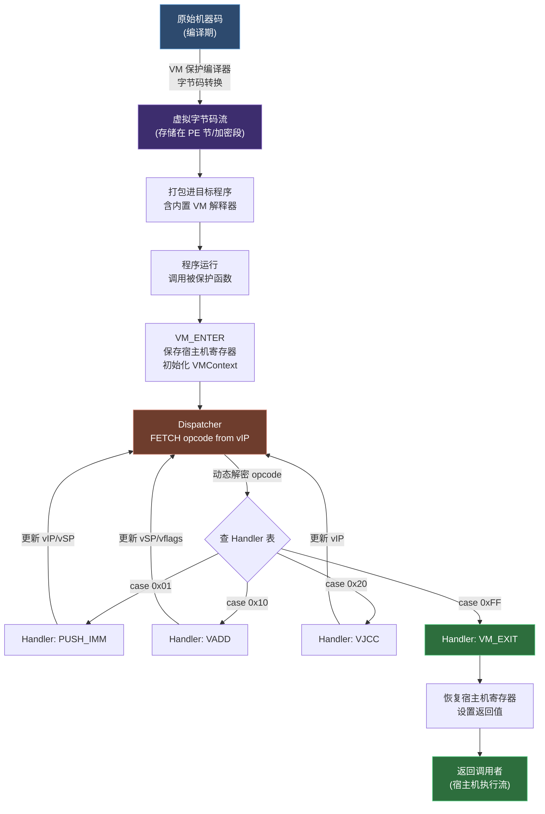

# 虚拟化保护逆向原理

## 概述与定位

> [!abstract] TL;DR
> VM 保护将原始机器码替换为私有字节码，由内置解释器（Dispatcher + Handler 表 + 虚拟寄存器组）在运行时执行，从而对标准反汇编器和反编译器形成屏蔽。逆向分析的核心流程是：识别 VM 入口 → 定位 Handler 表 → 逐 Handler 提取操作语义 → 字节码反汇编 → 提升至通用 IR（miasm / VTIL）→ 再应用常规数据流优化，最终恢复接近原始的伪代码。

虚拟化保护（VM Protection）是当前最强的软件混淆技术之一。与平坦化、间接跳转、垃圾代码等静态混淆不同，VM 保护将被保护函数的机器码在**编译期（或打包期）整体转换**为自定义的字节码格式，并嵌入一个定制解释器；原始机器码在磁盘上和内存中均不出现，标准反汇编引擎（IDA / Ghidra）只能看到 Dispatcher 和 Handler 的宿主机机器码，无法直接恢复原始逻辑。

> [!caution] 合规边界
> 本章仅以**防御与分析视角**讲解 VM 保护原理及学术/CTF 分析方法，所有示例均针对自有代码或公开 CTF 题目。**不提供针对任何商业软件、DRM 系统或授权保护机制的完整绕过利用链**。在实际工程中，分析他人商业软件保护可能违反《著作权法》及《计算机软件保护条例》，请务必在合法授权范围内操作。

### 典型商业 VM 保护产品（研究视角）

| 产品 | 平台 | 特点 |
|------|------|------|
| VMProtect | Windows/macOS/Linux | Handler 动态多态；多层嵌套 VM；支持 x86/x64/ARM |
| Themida / WinLicense | Windows | 内置 VM + 反调试 + 内存保护多合一 |
| Code Virtualizer | Windows | 面向开发者的轻量 VM 保护 SDK |
| StarForce | Windows | 游戏 DRM；含驱动级反作弊与 VM |

这些产品均有专门的学术分析论文和公开研究（如 SCAM 2011、EuroSec 会议论文），本章在研究引用层面描述其架构特征。

---

## 原理与机制

### VM 保护基本架构

VM 保护的本质是**将高级语言→机器码的编译链向下再延伸一层**：原始机器码被编译为"虚拟机字节码"（Virtual Bytecode），在运行时由一个内置的软件解释器逐条执行。

```
原始 C 代码
     │
     ▼  正常编译
原始机器码：mov eax,1 / add eax,2 / ret
     │
     ▼  VM 保护编译器
虚拟字节码：0x42 0x01 0x00 0x00 0x00
            0x43 0x02 0x00 0x00 0x00
            0xFF
     +  内置 VM 解释器（链接进程序）
```

**核心组件：**

- **VM_ENTER**：被保护函数开头的跳板，保存宿主机寄存器（建立 VMContext），跳入 Dispatcher
- **Dispatcher（分发器）**：解释循环的"主控"，从虚拟 IP 读取下一字节码操作码，通过跳转表派发到对应 Handler
- **Handler 表**：每个虚拟操作码（vOpcode）对应一段真实机器码 Handler；Handler 执行完成后跳回 Dispatcher 或"链式"跳入下一 Handler
- **VMContext（虚拟上下文）**：堆上或栈上分配的结构体，存储虚拟寄存器组、虚拟 IP（vIP）、虚拟栈指针（vSP）等
- **虚拟 IP（vIP）**：指向字节码流的当前位置，类比 CPU 的 RIP/EIP
- **虚拟栈（vStack）**：VM 操作的运算栈，许多 VM 实现采用栈式求值机（Stack Machine）而非寄存器机
- **VM_EXIT**：虚拟化代码执行完毕后，恢复宿主机寄存器，返回真实返回地址

### VM 执行循环（Interpreter Loop）

#### VMContext 数据结构

```c
typedef struct {
    uint64_t vregs[16];     // 虚拟寄存器 r0..r15
    uint8_t*  vip;          // 虚拟指令指针（字节码当前位置）
    uint64_t* vsp;          // 虚拟栈指针（向下增长）
    uint64_t  vflags;       // 虚拟标志寄存器
    uint64_t  key;          // 动态解密密钥（高级实现）
    // 宿主机保存区
    uint64_t  saved_rax, saved_rbx, saved_rcx, saved_rdx;
    uint64_t  saved_rsi, saved_rdi, saved_rbp, saved_rsp;
    uint64_t  saved_r8_r15[8];
    uint64_t  saved_rflags;
    void*     ret_addr;     // 原始返回地址
} VMContext;
```

#### 典型 Dispatcher 伪代码

```c
void vm_dispatcher(VMContext* ctx) {
    while (1) {
        /* FETCH：取下一字节码操作码 */
        uint8_t opcode = *ctx->vip++;

        /* 动态解密（高级实现：操作码经异或/滚动密钥加密）*/
        // opcode ^= (uint8_t)(ctx->key & 0xFF);
        // ctx->key = ror64(ctx->key, 7) + opcode;

        /* DECODE / DISPATCH：跳转到对应 Handler */
        switch (opcode) {
            case 0x01: handler_push_imm64(ctx); break;
            case 0x02: handler_pop_vreg(ctx);   break;
            case 0x10: handler_vadd(ctx);        break;
            case 0x11: handler_vsub(ctx);        break;
            case 0x12: handler_vmul(ctx);        break;
            case 0x20: handler_vjcc(ctx);        break;  // 条件跳转
            case 0x21: handler_vjmp(ctx);        break;  // 无条件跳转
            case 0x30: handler_vmread(ctx);      break;  // 读内存
            case 0x31: handler_vmwrite(ctx);     break;  // 写内存
            case 0x40: handler_vcall(ctx);       break;  // 调用宿主机函数
            case 0xFF: vm_exit(ctx); return;             // VM_EXIT
            default:   vm_panic(ctx, opcode); return;
        }
    }
}
```

实际商业 VM 保护的 Dispatcher 极少使用清晰的 `switch`——通常是间接跳转表：

```asm
; 典型 Dispatcher（x64 汇编）
dispatcher:
    movzx   rax, byte [r13]     ; r13 = vIP，取 opcode
    inc     r13                 ; vIP++
    lea     rcx, [handler_table]
    jmp     qword [rcx + rax*8] ; 跳到 handler_table[opcode]
```

#### Handler 示例：PUSH_IMM64

```c
void handler_push_imm64(VMContext* ctx) {
    /* 从字节码流读取 8 字节立即数 */
    uint64_t imm = *(uint64_t*)ctx->vip;
    ctx->vip += 8;
    /* 压入虚拟栈 */
    ctx->vsp--;
    *ctx->vsp = imm;
    /* 返回 Dispatcher */
}
```

#### Handler 示例：VADD（虚拟加法）

```c
void handler_vadd(VMContext* ctx) {
    uint64_t a = *ctx->vsp++;   // pop top
    uint64_t b = *ctx->vsp++;   // pop second
    uint64_t result = a + b;
    /* 更新虚拟标志：ZF CF SF OF */
    ctx->vflags = compute_flags_add(a, b, result);
    ctx->vsp--;
    *ctx->vsp = result;          // push result
}
```

### VM 保护执行流程图



---

## 结构/算法/伪代码详解

### Handler 动态多态（VMProtect 风格）

高级 VM 保护不使用固定的 opcode→Handler 映射，而是为每次保护生成**随机映射表**：

```
实例 A：opcode 0x37 → VADD
实例 B：opcode 0xC2 → VADD（不同实例操作码完全不同）
```

此外，同一语义的 Handler 可能有**多个等价变体**（多态 Handler），在生成时随机选择，以对抗基于 Handler 代码特征码的自动分析。

### 嵌套 VM（Multi-Layer VM）

部分实现将 VM 解释器本身也虚拟化，形成双层或三层嵌套。分析时必须从最外层 VM 开始逐层剥离。

### 字节码加密与动态解密

字节码流存储在加密段，Dispatcher 在 FETCH 时用滚动密钥实时解密：

```c
// 滚动 XOR 解密示例
uint8_t fetch_byte(VMContext* ctx) {
    uint8_t enc = *ctx->vip++;
    uint8_t dec = enc ^ (uint8_t)(ctx->rolling_key & 0xFF);
    ctx->rolling_key = (ctx->rolling_key >> 7) | (ctx->rolling_key << 57);
    ctx->rolling_key += dec;
    return dec;
}
```

这使得静态扫描字节码几乎无效——必须在动态执行环境中捕获解密后的字节码流。

### 虚拟寄存器到宿主机寄存器的映射

VM_EXIT 时需要将虚拟寄存器的计算结果写回宿主机寄存器。映射关系由 VM 编译器在保护期生成，且不同被保护函数可能使用不同映射，是分析时需要重建的关键信息之一。

```c
void vm_exit(VMContext* ctx) {
    // 将虚拟计算结果写回宿主寄存器
    // （映射关系因实例而异，需逆向分析确定）
    uint64_t result = ctx->vregs[0];  // 假设 vreg0 → rax
    // 恢复保存的宿主机寄存器
    __asm__ volatile (
        "mov %0, %%rax\n\t"
        "mov %1, %%rbx\n\t"
        // ...
        : : "m"(result), "m"(ctx->saved_rbx) : "rax", "rbx"
    );
}
```

---

## 逆向分析方法：五步流程

### Step 1：识别 VM_ENTER

**识别特征：**
- 被保护函数开头出现大量 `push` 指令（保存宿主机寄存器：`pushad` / `push r15` 序列）
- 紧接着初始化一个大型结构体（VMContext），通常在堆（`malloc`/`VirtualAlloc`）或栈帧上
- 跳转到 Dispatcher（间接跳转或直接调用）

**IDA 搜索技巧：**

```python
# IDAPython：搜索疑似 VM_ENTER（大量 push 后接间接跳转）
import idc, idautils, idaapi

for func_ea in idautils.Functions():
    push_count = 0
    for head in idautils.Heads(func_ea, func_ea + 0x100):
        mnem = idc.print_insn_mnem(head)
        if mnem in ('push', 'pushfd', 'pushfq'):
            push_count += 1
        elif mnem == 'jmp' and push_count >= 8:
            # 疑似 VM_ENTER：大量 push 后的跳转
            print(f"Possible VM_ENTER at {hex(func_ea)}, jmp at {hex(head)}")
            break
        elif mnem not in ('push', 'sub', 'mov', 'lea', 'xor'):
            push_count = 0
```

**动态识别：** 在调试器中设置硬件断点监控 `rsp` 变化，函数入口发生大量连续 `push` 即为 VM_ENTER。

### Step 2：定位 Handler 表

Dispatcher 的核心是跳转表（Jump Table）：

```asm
; 典型形式 1：scaled index
jmp  qword [rax*8 + handler_table]

; 典型形式 2：两步间接
movzx eax, byte [r13]     ; opcode
lea   rcx, [handler_base]
mov   rdx, [rcx + rax*8]
jmp   rdx
```

**定位步骤：**
1. 在调试器中找到 Dispatcher（通常是程序执行中命中次数最高的基本块）
2. 识别跳转表基址寄存器（`rcx`/`r12` 等）
3. 在 IDA 中对基址地址定义为指针数组：`Alt+D → Qword Array`，大小 = 256（假设 opcode 1 字节）
4. 枚举数组，得到所有有效 Handler 地址

**IDAPython 枚举 Handler：**

```python
import idc, idaapi

handler_table_ea = 0x14001A000  # 替换为实际地址
handlers = {}
for i in range(256):
    ptr = idc.get_qword(handler_table_ea + i * 8)
    if idc.is_code(idc.get_full_flags(ptr)):
        handlers[i] = ptr
        print(f"opcode 0x{i:02X} -> handler @ {hex(ptr)}")
```

### Step 3：分析 Handler 语义

对每个 Handler，手工或脚本化分析其对 VMContext 的读写效果：

**示例分析 Handler_0x10：**

```asm
; Handler_0x10 原始汇编（假设 r14 = vSP, r13 = vIP）
Handler_0x10:
    mov  rax, [r14]       ; load vstack[top]
    add  r14, 8           ; pop (vSP++)
    mov  rcx, [r14]       ; load vstack[top-1]
    add  r14, 8           ; pop
    add  rax, rcx         ; 加法
    sub  r14, 8           ; push（vSP--）
    mov  [r14], rax       ; store result
    ; 更新 vflags（可选）
    lahf
    mov  [r15 + offsetof(VMContext, vflags)], rax
    jmp  qword [r15 + offsetof(VMContext, dispatcher)]

; 提取语义：
;   POP  a
;   POP  b
;   PUSH (a + b)
;   UPDATE_FLAGS
;   → 语义标记：VADD_64
```

**Handler 语义记录表（示例）：**

| opcode | 标记语义 | 操作数 | 副作用 |
|--------|----------|--------|--------|
| 0x01 | PUSH_IMM64 | imm64（后跟 8 字节） | vSP--, vstack[top]=imm |
| 0x02 | POP_VREG | vreg_idx（后跟 1 字节） | vSP++, vreg[i]=val |
| 0x10 | VADD_64 | 无 | pop a,b; push a+b; update flags |
| 0x11 | VSUB_64 | 无 | pop a,b; push a-b; update flags |
| 0x12 | VMUL_64 | 无 | pop a,b; push a*b |
| 0x20 | VJCC | cond(1B)+offset(4B) | if flags满足cond: vIP+=offset |
| 0x30 | VMLOAD_64 | 无 | pop addr; push mem[addr] |
| 0x31 | VMSTORE_64 | 无 | pop val,addr; mem[addr]=val |
| 0x40 | VCALL | func_ptr(8B) | 调用宿主机函数 |
| 0xFF | VM_EXIT | 无 | 恢复寄存器，返回 |

### Step 4：字节码反汇编

收集完整 Handler 语义表后，解析字节码流输出虚拟汇编：

```python
# 简单字节码反汇编器（Python 示例）

HANDLER_TABLE = {
    0x01: ('PUSH_IMM64',  8),   # 操作码, 后跟字节数
    0x02: ('POP_VREG',    1),
    0x10: ('VADD_64',     0),
    0x11: ('VSUB_64',     0),
    0x12: ('VMUL_64',     0),
    0x20: ('VJCC',        5),   # 1B cond + 4B offset
    0x30: ('VMLOAD_64',   0),
    0x31: ('VMSTORE_64',  0),
    0x40: ('VCALL',       8),
    0xFF: ('VM_EXIT',     0),
}

def disasm_bytecode(bytecode: bytes, base_addr: int = 0):
    pos = 0
    result = []
    while pos < len(bytecode):
        opcode = bytecode[pos]
        pos += 1
        if opcode not in HANDLER_TABLE:
            result.append(f"{base_addr + pos - 1:#010x}: ??? 0x{opcode:02X}")
            continue
        mnemonic, operand_size = HANDLER_TABLE[opcode]
        operands_raw = bytecode[pos:pos + operand_size]
        pos += operand_size
        # 格式化操作数
        if operand_size == 8:
            imm = int.from_bytes(operands_raw, 'little')
            operands_str = f"0x{imm:016X}"
        elif operand_size == 1:
            operands_str = f"r{operands_raw[0]}"
        elif operand_size == 5:
            cond = operands_raw[0]
            offset = int.from_bytes(operands_raw[1:], 'little', signed=True)
            operands_str = f"cond={cond:#04x}, off={offset:+d}"
        else:
            operands_str = ""
        result.append(f"{base_addr + pos - operand_size - 1:#010x}: {mnemonic:<15} {operands_str}")
        if mnemonic == 'VM_EXIT':
            break
    return '\n'.join(result)
```

**输出示例：**

```
0x00000000: PUSH_IMM64      0x0000000000000001
0x00000009: PUSH_IMM64      0x0000000000000002
0x00000012: VADD_64
0x00000013: POP_VREG        r0
0x00000015: VM_EXIT
; 对应原始逻辑：r0 = 1 + 2
```

### Step 5：虚拟指令提升（Lifting to IR）

字节码反汇编仅是第一步。要恢复接近原始代码的逻辑，需要将虚拟指令提升到通用 IR 框架，再应用数据流分析和优化。

#### miasm 框架提升示例

```python
from miasm.analysis.machine import Machine
from miasm.expression.expression import *
from miasm.ir.translators.miasm_to_c import TranslatorC

# 模拟虚拟栈提升：手动构造 miasm IR
# 将 VADD_64 翻译为 miasm IR 表达式
a = ExprId("a", 64)
b = ExprId("b", 64)
result = ExprOp("+", a, b)  # a + b

# 后续通过 miasm 的 SSA + 常量折叠优化简化表达式树
```

#### VTIL 框架（Virtual Translatable Instruction Library）

VTIL 是专为 VM 保护逆向设计的开源 IR 库，其设计目标是将任意 VM 字节码（特别是 VMProtect 系）提升为统一 IR 并应用编译器优化：

```
virt_begin          ; 虚拟化边界开始标记
  push    imm:64 1
  push    imm:64 2
  add     sp[0], sp[8]
  pop     vreg:r0
virt_end            ; 虚拟化边界结束

优化 Pass 后：
  mov     r0, 3     ; 常量折叠
```

VTIL 的优化 Pass 包括：
- **死代码删除（DCE）**：清除 VM 实现中的无意义虚拟寄存器操作
- **常量折叠（Constant Folding）**：合并字节码中的立即数运算
- **冗余读写消除**：合并对同一虚拟寄存器的连续读写
- **vSP 规范化**：将虚拟栈操作恢复为明确的变量引用（去栈化）

---

## 工具视角/实战

### 动态跟踪：捕获字节码执行轨迹

直接静态分析字节码加密与多态 Handler 极为困难，动态跟踪是最可靠的方法。

**Intel PIN 插桩跟踪 Handler 序列：**

```cpp
// PIN Tool：记录 Dispatcher 处命中的 opcode 序列
#include "pin.H"
#include <fstream>

ADDRINT dispatcher_ea = 0x14001B200;  // 动态确定后填入
ADDRINT opcode_reg = REG_AL;          // opcode 在 AL 中

VOID RecordOpcode(CONTEXT* ctx, ADDRINT ip) {
    if (ip == dispatcher_ea) {
        ADDRINT al_val = PIN_GetContextReg(ctx, REG_AL);
        log_file << hex << ip << " opcode=" << (al_val & 0xFF) << "\n";
    }
}

VOID Trace(TRACE trace, VOID* v) {
    for (BBL bbl = TRACE_BblHead(trace); BBL_Valid(bbl); bbl = BBL_Next(bbl)) {
        for (INS ins = BBL_InsHead(bbl); INS_Valid(ins); ins = INS_Next(ins)) {
            if (INS_Address(ins) == dispatcher_ea) {
                INS_InsertCall(ins, IPOINT_BEFORE, (AFUNPTR)RecordOpcode,
                               IARG_CONTEXT, IARG_INST_PTR, IARG_END);
            }
        }
    }
}
```

**Frida 动态插桩（Python 控制器）：**

```javascript
// Frida script：Hook Dispatcher，记录每次 opcode
const dispatcher_addr = ptr("0x14001B200");
Interceptor.attach(dispatcher_addr, {
    onEnter: function(args) {
        const opcode = this.context.rax & 0xFF;
        const vip = this.context.r13;
        send({ type: 'opcode', op: opcode, vip: vip.toString() });
    }
});
```

**Unicorn 模拟执行（离线分析）：**

```python
from unicorn import *
from unicorn.x86_const import *

mu = Uc(UC_ARCH_X86, UC_MODE_64)
# 映射内存、设置寄存器（VMContext 指针）
mu.mem_map(0x400000, 0x100000)
mu.mem_write(0x400000, bytecode_bytes)

# 在 Dispatcher 地址设 hook，记录每次 opcode
def hook_code(uc, address, size, user_data):
    if address == DISPATCHER_EA:
        rax = uc.reg_read(UC_X86_REG_RAX)
        print(f"opcode: {rax & 0xFF:#04x}")

mu.hook_add(UC_HOOK_CODE, hook_code)
mu.emu_start(DISPATCHER_EA, 0xFFFFFFFF)
```

### IDA Pro 辅助分析

```python
# IDAPython：对所有 Handler 地址批量添加注释（已分析语义）
import idc

semantics = {
    0x14001A010: "Handler_0x01_PUSH_IMM64",
    0x14001A080: "Handler_0x10_VADD_64",
    0x14001A100: "Handler_0xFF_VM_EXIT",
    # ...
}

for ea, label in semantics.items():
    idc.set_name(ea, label, idc.SN_FORCE)
    idc.set_func_cmt(ea, f"VM Handler: {label}", 1)
```

### Ghidra 分析工具链

**P-Code 级 Handler 语义提取：**

```java
// GhidraScript：遍历 Handler 函数的 P-Code，提取 vStack 操作
DecompInterface ifc = new DecompInterface();
ifc.openProgram(currentProgram);

Function handler_func = getFunctionAt(toAddr(0x14001A080L));
DecompileResults res = ifc.decompileFunction(handler_func, 60, monitor);
HighFunction hf = res.getHighFunction();

Iterator<PcodeOpAST> ops = hf.getPcodeOps();
while (ops.hasNext()) {
    PcodeOpAST op = ops.next();
    println(op.getMnemonic() + " " + op.toString());
}
```

### 现有社区工具

| 工具 | 用途 | 地址 |
|------|------|------|
| VMP Disassembler | VMProtect 字节码反汇编 | GitHub（多个社区实现） |
| VTIL Library | VM IR 提升与优化框架 | github.com/can1357/VTIL-Core |
| vmctx / vmpattack | VMProtect 自动化分析 | CTF 社区开源 |
| miasm | 通用 IR 框架，支持自定义 lifter | github.com/cea-sec/miasm |
| Triton | 动态污点 + 符号执行，可分析 Handler 语义 | triton-library.github.io |

---

## VM 保护与 WASM 虚拟化壳对比

WASM 作为 Web 平台的"VM 保护"方案与本机 VM 保护共享核心思想，但在技术细节上存在显著差异。详见 `[[40.WASM与虚拟化壳逆向/00.WASM与虚拟化壳逆向总览]]`。

| 特性 | 本机 VM 保护（VMProtect 等）| WASM 作为壳 |
|------|------|------|
| 执行环境 | 自定义解释器（同进程内嵌）| 标准 WebAssembly 运行时（浏览器/Node.js）|
| 字节码格式 | **私有**（每实例随机化/加密）| **标准公开**（WAT/WASM 规范）|
| 操作码语义 | 由分析者手工逆向确定 | 公开规范直接查阅 |
| 反向工具 | 需要自定义分析脚本/VTIL/miasm | wasm2c / wasm-decompile / wabt |
| 静态分析难度 | **极高**（操作码混淆+多态 Handler）| **中等**（格式公开，但逻辑可混淆）|
| 主要场景 | Windows/macOS 软件保护、DRM、游戏反作弊 | Web 端加密、前端逻辑保护、Node.js 授权 |
| 调试对抗 | 强（反调试、反插桩、驱动保护）| 弱（浏览器调试器可直接介入）|
| 逆向成本 | 数天至数周（视混淆复杂度）| 数小时至数天 |

---

## 安全性与正确使用

> [!warning] 分析范围与法律边界
> 以下情境属于**合法且推荐**的 VM 保护分析用途：
> - 分析自己开发的被保护软件（验证保护强度）
> - CTF 竞赛中的 VM 逆向题目
> - 学术研究（发表于 NDSS/CCS/USENIX Security 等）
> - 安全审计（有书面授权的渗透测试）
>
> 以下情境**存在法律风险或明确违法**：
> - 未经授权分析商业软件 DRM 以绕过软件授权
> - 提取商业软件中的加密算法用于竞争目的
> - 在中国境内：可能触犯《著作权法》第四十八条、《计算机软件保护条例》第二十四条

### 防御视角：VM 保护的有效性评估

VM 保护**不是绝对安全**的，其有效性体现在提高攻击成本而非绝对防止分析：

**VM 保护的强项：**
- 使自动化反编译完全失效（IDA / Ghidra 无法直接输出伪代码）
- 动态混淆（操作码加密、多态 Handler）使基于特征码的自动分析难以规模化
- 结合反调试时，人工动态分析成本极高

**VM 保护的弱点：**
- **语义信息保留**：字节码执行的最终效果（内存读写、API 调用）仍可通过动态监控观察
- **硬件支持**：Intel PIN / DynamoRIO 等二进制插桩框架在 ring-3 层可完整跟踪指令流
- **时间/成本权衡**：足够的人力和时间总能逐 Handler 还原语义；VM 保护是时间税而非绝对屏障
- **实现质量参差**：Handler 代码本身是真实机器码，若 Handler 实现简单，语义分析极易

### 研究人员建议

1. **从动态追踪入手**：优先用 PIN/Frida/Unicorn 获取 opcode 序列，掌握"执行轨迹"先于"静态分析"
2. **建立 Handler 语义数据库**：分析每个 Handler 并记录，后续遇到相同保护实例可复用
3. **关注 VM_EXIT 与 API 调用**：`VCALL` Handler 调用宿主机函数是"语义泄漏点"，可直接推断上下文业务逻辑
4. **利用 Taint Analysis**：从输入到输出跟踪数据流，绕开字节码逐指令分析的繁琐工作
5. **关注学术进展**：SATURN（USENIX Security 2023）、VMAttack（NDSS）等研究提供了自动化分析框架

---

## 小结

VM 保护通过 Dispatcher + Handler 表 + VMContext 三件套将原始机器码完全隐藏在私有字节码层之后，是目前对抗标准反汇编/反编译工具最有效的保护形式。其逆向分析遵循固定的五步流程：**识别 VM_ENTER → 定位 Handler 表 → 提取 Handler 语义 → 字节码反汇编 → 提升至 IR 优化**。

关键工具方面：动态插桩（PIN/Frida/Unicorn）负责突破操作码加密屏障获取执行轨迹；VTIL 和 miasm 提供通用 IR 框架将虚拟指令规范化；IDA/Ghidra 脚本在静态辅助分析（批量注释 Handler、P-Code 语义提取）中发挥补充作用。

相较于 WASM 虚拟化壳（字节码格式公开，反向工具成熟），本机 VM 保护因其私有字节码和多态 Handler 机制，分析成本显著更高——但本质上是成本问题而非不可突破的技术壁垒。安全研究者应在合法授权范围内开展分析，遵守相关法律法规。

---

## 相关阅读

- `[[09.反混淆技术与对抗]]`——VM 保护是最强的动态混淆形式，本章是第09章混淆技术的延伸
- `[[11.符号执行与angr框架]]`——符号执行可辅助 Handler 语义分析，特别是 Concolic 模式
- `[[05.中间表示IR设计：LLVM-IR与VEX与P-Code]]`——VTIL 和 miasm 的 IR 设计与 LLVM IR / VEX IR 同源
- `[[40.WASM与虚拟化壳逆向/00.WASM与虚拟化壳逆向总览]]`——WASM 壳是 VM 保护思想在 Web 平台的映射
- `[[44.调试器原理与实战/00.调试器原理与实战总览]]`——调试器是动态 Handler 分析的基础平台
- `[[33.二进制漏洞与利用基础/00.二进制漏洞与利用基础总览]]`——VM 保护逆向结合漏洞分析的交叉领域
- 学术参考：*VMAttack: Deobfuscating Virtualization-Based Packed Binaries*（NDSS 2017）；*Deobfuscation of Virtualization-Obfuscated Software*（CCS 2011）；*SATURN: Software Deobfuscation Framework Based on LLVM*（USENIX Security 2023）

---

⬅️ 上一篇 [[09.反混淆技术与对抗]] ｜ 🏠 [[00.反编译器与反汇编引擎原理总览]] ｜ 下一篇 [[11.符号执行与angr框架]] ➡️
