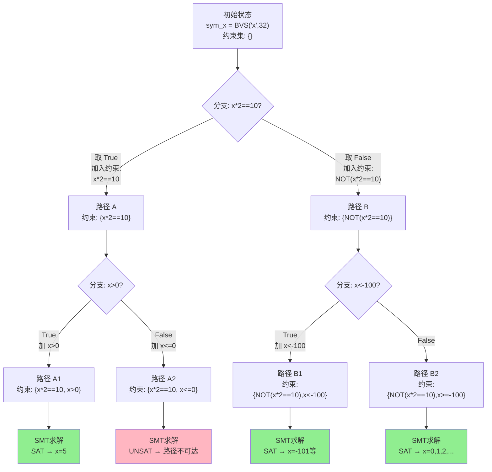

# 反编译器（11）· 符号执行与angr框架

## 概述与定位

> [!abstract] TL;DR
> 符号执行（Symbolic Execution）用"符号值"而非具体数值驱动程序执行，在每个分支点 Fork 路径并积累路径约束，最终借助 SMT 求解器（如 Z3）自动求出触达特定代码的具体输入。angr 是当前最主流的 Python 开源符号执行框架，支持 ELF/PE/Mach-O，广泛用于 CTF 破解、漏洞挖掘与反混淆。掌握 `Project`、`SimState`、`SimulationManager` 三层抽象，配合 `explore(find/avoid)` 策略与 Hook 机制，是进行自动化二进制分析的核心能力。

符号执行在逆向工程栈中处于"自动化分析"这一层级：比单纯反汇编更深入（可自动推断输入约束），比纯动态调试更全面（可覆盖所有可达路径，而不仅是一次执行轨迹）。它与本系列其他技术的关系如下：

- **上游依赖**：控制流图（[[02.控制流图CFG构建与基本块]]）和中间表示（[[05.中间表示IR设计：LLVM-IR与VEX与P-Code]]）是符号执行引擎的底层基础，angr 内部使用 VEX IR 完成提升。
- **横向联动**：[[09.反混淆技术与对抗]] 将符号执行作为去除不透明谓词（Opaque Predicate）的核心手段。
- **应用延伸**：`[[33.二进制漏洞与利用基础/00.二进制漏洞与利用基础总览]]` 中，符号执行被用于自动化漏洞发现（如自动生成溢出触发输入）。

本章聚焦：**符号执行的理论基础 → Z3 SMT 求解器的直接使用 → angr 框架全套 API → CTF 实战场景 → 路径爆炸的工程应对**。

---

## 原理与机制

### 具体执行 vs 符号执行

最直观的对比从一段 C 代码入手：

```c
// 目标程序
int check(int x) {
    if (x * 2 == 10) return 1;  // 分支 A：真
    return 0;                    // 分支 B：假
}
```

**具体执行**（Concrete Execution）——传统动态调试：

```
输入 x = 3
执行 3 * 2 = 6
6 == 10 → False
返回 0（仅覆盖分支 B）
```

一次执行只能遍历一条路径，无法自动发现哪个输入能进入分支 A。

**符号执行**（Symbolic Execution）：

```
输入 x = sym_x（符号变量，值未知）
执行 sym_x * 2

遇到分支 (sym_x * 2 == 10)：
  ┌─ 路径 A（取 True）：约束集 { sym_x * 2 == 10 }
  │   调用 SMT：SAT → 解 sym_x = 5
  │   → 找到使 check() 返回 1 的输入 x=5
  │
  └─ 路径 B（取 False）：约束集 { NOT(sym_x * 2 == 10) }
      调用 SMT：SAT → 无数个解（x≠5 均可）
```

符号执行在一次分析中**同时覆盖了所有可能的执行路径**，并通过求解器自动给出触发各路径的具体输入。

### 核心概念详解

**符号值（Symbolic Value）**：对程序输入（argv、stdin、文件内容、网络包等）创建带名称的抽象占位符，如 `sym_x: BitVec(32)`。后续所有对这些值的操作都以**符号表达式**形式保存，不立即求值。

**路径约束（Path Constraint）**：每次程序执行到条件分支时，走"真"分支就向约束集加入条件表达式，走"假"分支就加入其否定。随着路径深入，约束集逐渐积累，形成对该路径所需输入的完整描述。

**可满足性判断（SAT Check）**：将路径约束集交给 SMT 求解器，询问"是否存在一组符号变量的赋值使得所有约束同时成立"。若 SAT（可满足），求解器返回一组具体值；若 UNSAT（不可满足），该路径在现实中不可达。

**状态快照（State Snapshot）**：每条符号执行路径对应一个完整的机器状态快照，包含：寄存器的当前符号表达式、内存中每个位置的符号值或具体值、当前积累的路径约束集、执行到的 PC 地址。

### 路径爆炸问题

```
N 个独立条件分支 → 最多 2^N 条路径
包含循环时 → 每次循环展开新增路径 → 理论上无限多
```

路径爆炸（Path Explosion）是符号执行在实际工程中最大的瓶颈。举例：

```c
void process(char *buf, int len) {
    for (int i = 0; i < len; i++) {       // 每次迭代分叉
        if (buf[i] > 0x7f) { ... }        // 分叉点 1
        if (buf[i] == '\n') { break; }    // 分叉点 2
    }
}
// len=16 时：理论路径数达 2^32 以上
```

缓解策略（后文 angr 部分详述实现）：

| 策略 | 原理 | 代价 |
|------|------|------|
| 步数限制（`run(n=N)`） | 执行至多 N 步即停止 | 可能未探索完 |
| 循环上界设定 | 强制循环最多迭代 K 次 | 可能错过深层路径 |
| 路径合并（State Merging） | 将相似状态合并为一个带 ITE 表达式的状态 | 约束复杂度上升 |
| Concolic 执行 | 混合具体值+符号追踪，一次执行一条路径 | 覆盖率有限 |
| 深度/广度优先选择 | DFS/BFS 控制探索顺序 | 不同场景效率差异大 |
| 覆盖率引导 | 优先探索覆盖新基本块的路径 | 需覆盖反馈机制 |

### 符号执行路径树（Mermaid）



---

## 结构/算法/伪代码详解

### Z3 SMT 求解器直接使用

Z3 是 Microsoft Research 开发的 SMT（Satisfiability Modulo Theories）求解器，支持线性算术、位向量、数组、字符串等多种理论。angr 通过 Claripy 中间层封装 Z3，但理解 Z3 原生 API 有助于深入调试。

**安装**：
```bash
pip install z3-solver
```

**基础位向量求解**：

```python
import z3

# 创建 32 位符号变量
x = z3.BitVec('x', 32)
y = z3.BitVec('y', 32)

solver = z3.Solver()
# 添加约束
solver.add(x * 2 + y == 10)
solver.add(x > 0)
solver.add(y > 0)

result = solver.check()
if result == z3.sat:
    model = solver.model()
    # model[x] 返回 Z3 表达式，用 as_long() 转 Python int
    print(f"x = {model[x].as_long()}, y = {model[y].as_long()}")
    # 输出示例：x = 1, y = 8
elif result == z3.unsat:
    print("约束不可满足，路径不可达")
else:
    print("超时或未知")
```

**枚举多个解**（用于生成测试输入集合）：

```python
import z3

x = z3.BitVec('x', 8)  # 8 位（0-255）
solver = z3.Solver()
solver.add(x * x == 16)   # x^2 = 16 → x=4 或 x=252（无符号下 -4 mod 256）

solutions = []
while solver.check() == z3.sat:
    m = solver.model()
    val = m[x].as_long()
    solutions.append(val)
    # 排除当前解，继续寻找下一个
    solver.add(x != m[x])

print(f"所有解: {solutions}")  # [4, 252]
```

**使用 push/pop 管理约束作用域**：

```python
import z3

x = z3.BitVec('x', 32)
solver = z3.Solver()
solver.add(x > 0)

# 保存当前状态
solver.push()
solver.add(x < 10)
if solver.check() == z3.sat:
    print(f"在 (0,10) 有解: {solver.model()[x]}")

# 恢复到 push() 前的状态
solver.pop()

# 重新探索另一条路径
solver.push()
solver.add(x > 1000)
if solver.check() == z3.sat:
    print(f"在 (1000,∞) 有解: {solver.model()[x]}")
solver.pop()
```

`push()/pop()` 对应符号执行中 Fork 路径时的状态隔离——每条路径在独立的约束栈上工作。

### Claripy（angr 的约束层）

angr 不直接暴露 Z3，而是通过 Claripy 提供更友好的位向量接口：

```python
import claripy

# BVS：位向量符号（Bit-Vector Symbol）
x = claripy.BVS('x', 32)        # 32 位符号变量
buf = claripy.BVS('buf', 8*16)  # 16字节符号缓冲区

# BVV：位向量具体值（Bit-Vector Value）
five = claripy.BVV(5, 32)       # 32 位值 5

# 运算产生符号表达式（不立即求值）
expr = x * 2 + five

# 提取字节切片（大端，[高位:低位]）
byte0 = buf[127:120]  # 最高字节（byte 0）
byte1 = buf[119:112]  # byte 1

# 拼接
combined = claripy.Concat(byte0, byte1)   # 16 位
```

### 符号执行引擎核心伪代码

```python
def symbolic_execute(program, entry_pc):
    """符号执行核心循环（简化伪代码）"""
    initial_state = State(
        pc=entry_pc,
        regs={},
        memory={},
        constraints=[]
    )
    worklist = [initial_state]   # 待探索路径队列
    results = []

    while worklist:
        state = worklist.pop()   # 取出一个状态

        # 执行当前 PC 的指令（提升为 IR 后逐条解释）
        instr = program.fetch(state.pc)
        effects = lift_and_interpret(instr, state)

        if isinstance(effects, ConditionalBranch):
            cond = effects.condition    # 符号表达式
            true_constraint  = cond
            false_constraint = claripy.Not(cond)

            # Fork：复制状态，分别添加不同约束
            state_true  = state.copy()
            state_false = state.copy()

            state_true.constraints.append(true_constraint)
            state_false.constraints.append(false_constraint)

            state_true.pc  = effects.true_target
            state_false.pc = effects.false_target

            # 快速可满足性检查（避免死路继续探索）
            if is_satisfiable(state_true.constraints):
                worklist.append(state_true)
            if is_satisfiable(state_false.constraints):
                worklist.append(state_false)

        elif isinstance(effects, Return):
            results.append(state)
        else:
            state.pc = effects.next_pc
            worklist.append(state)

    return results

def is_satisfiable(constraints):
    """调用 SMT 求解器检查约束集"""
    solver = z3.Solver()
    for c in constraints:
        solver.add(translate_to_z3(c))
    return solver.check() == z3.sat
```

---

## 工具视角/实战

### angr 框架架构

angr 的核心分层架构：

```
┌─────────────────────────────────────────────┐
│              用户脚本 (Python)               │
├─────────────────────────────────────────────┤
│  SimulationManager (simgr)                  │
│  ├── Stash 管理: active/found/avoid/errored │
│  └── 探索技术: explore/step/run             │
├─────────────────────────────────────────────┤
│  SimState                                   │
│  ├── state.regs  (寄存器)                   │
│  ├── state.memory (内存)                    │
│  ├── state.solver (约束求解)                │
│  └── state.posix  (stdin/stdout/文件)       │
├─────────────────────────────────────────────┤
│  Project                                    │
│  ├── loader (CLE): 加载 ELF/PE/Mach-O      │
│  ├── factory: 创建 state/simgr             │
│  └── analyses: CFG/DDG/VFG                 │
├─────────────────────────────────────────────┤
│  SimEngine (VEX IR 解释器)                  │
│  Claripy (符号表达式 + Z3 后端)             │
└─────────────────────────────────────────────┘
```

### Project：加载二进制

```python
import angr

# 基础加载：auto_load_libs=False 避免自动加载系统库（加快速度）
proj = angr.Project('./crackme', auto_load_libs=False)

# 查看基本信息
print(proj.arch)                          # <Arch AMD64 (LE)>
print(proj.entry)                         # 入口点地址（int）
print(proj.loader.main_object.min_addr)   # 镜像基地址
print(proj.loader.main_object.max_addr)

# 查找符号（外部函数）地址
puts_sym = proj.loader.find_symbol('puts')
if puts_sym:
    print(f"puts @ {hex(puts_sym.rebased_addr)}")

# 加载 PE（Windows 二进制）
proj_pe = angr.Project('./target.exe', auto_load_libs=False)

# 指定基地址（ASLR 情况下分析 dump）
proj_rebased = angr.Project('./dump.bin',
    load_options={'main_opts': {'base_addr': 0x140000000}})
```

### SimState：机器状态快照

```python
import angr, claripy

proj = angr.Project('./crackme', auto_load_libs=False)

# ① 从程序入口创建初始状态
entry_state = proj.factory.entry_state()

# ② blank_state：从任意地址开始，寄存器/内存均未初始化
blank = proj.factory.blank_state(addr=0x401000)

# ③ full_init_state：执行完整初始化（加载器、libc init 等）
full = proj.factory.full_init_state()

# 读写寄存器（符号值或具体值）
print(hex(entry_state.regs.rip.concrete_value))   # 具体 PC 值
sym_rax = claripy.BVS('rax', 64)
entry_state.regs.rax = sym_rax   # 写入符号值

# 读写内存
entry_state.memory.store(0x404000, claripy.BVV(0xdeadbeef, 32))
val = entry_state.memory.load(0x404000, 4)   # 读 4 字节 → 符号表达式

# 约束求解
s = blank.copy()
x = claripy.BVS('x', 32)
s.regs.rdi = x
s.solver.add(x > 100)
s.solver.add(x < 200)
print(s.solver.eval(x))          # 求一个满足约束的值
print(s.solver.eval_upto(x, 5))  # 求至多 5 个满足约束的值
```

### SimulationManager 与 Stash

```python
import angr

proj = angr.Project('./crackme', auto_load_libs=False)
initial_state = proj.factory.entry_state()

# 创建 simgr，初始 active stash 包含 initial_state
simgr = proj.factory.simulation_manager(initial_state)

print(simgr)  # <SimulationManager with 1 active>

# step()：所有 active 状态向前执行一个基本块
simgr.step()
print(simgr)

# explore()：自动探索，直到找到 find 地址
# find: 目标地址（或地址列表，或 lambda 状态谓词）
# avoid: 需要规避的地址（错误处理、打印"Wrong"的地方）
simgr.explore(
    find=0x401200,           # 目标地址（如打印"Correct"处）
    avoid=[0x401100, 0x401050]  # 规避地址（如打印"Wrong"处）
)

# 检查结果
print(simgr)  # <SimulationManager with N found, M avoid, K active>

if simgr.found:
    found_state = simgr.found[0]
    # 提取标准输入（fd=0）的具体字节
    flag = found_state.posix.dumps(0)
    print(f"Flag: {flag}")

# 其他 stash
print(simgr.deadended)  # 正常退出的路径
print(simgr.errored)    # 报错路径（可检查原因）
print(simgr.avoid)      # 触发 avoid 条件的路径
```

### 符号输入的多种注入方式

```python
import angr, claripy

proj = angr.Project('./crackme', auto_load_libs=False)

# ─── 方式1：argv 参数（命令行输入）───
sym_arg = claripy.BVS('arg1', 8 * 32)   # 32 字节符号字符串
state_argv = proj.factory.entry_state(
    args=['./crackme', sym_arg],
    add_options={angr.options.LAZY_SOLVES}  # 延迟求解以提速
)

# ─── 方式2：标准输入（stdin）───
# angr 默认 stdin 为符号，自动追踪
state_stdin = proj.factory.entry_state(
    stdin=angr.SimFileStream(name='stdin', size=64)  # 64 字节符号 stdin
)

# ─── 方式3：直接写入符号内存 ───
state_mem = proj.factory.blank_state(addr=0x401000)
sym_buf = claripy.BVS('input_buf', 8 * 64)  # 64 字节
INPUT_ADDR = 0x404100
state_mem.memory.store(INPUT_ADDR, sym_buf)
state_mem.regs.rdi = INPUT_ADDR  # 传参：rdi → 指向符号缓冲区

# ─── 方式4：环境变量 ───
sym_env = claripy.BVS('env_val', 8 * 32)
state_env = proj.factory.entry_state(
    env={'SECRET': sym_env}
)
```

### Hook 机制：替换外部函数

Hook 是 angr 实战中最关键的技巧之一：很多二进制程序调用 `printf`、`strcmp`、`strlen` 等库函数，不 Hook 就必须跟进 SimProcedure，效率很低且容易出错。

```python
import angr, claripy

proj = angr.Project('./crackme', auto_load_libs=False)

# ─── 方式1：简单 Hook（lambda 函数替换指令序列）───
# length=5 表示替换原来 5 字节的 CALL 指令
@proj.hook(0x401050, length=5)
def skip_check(state):
    # 直接设置返回值，模拟函数返回 1（成功）
    state.regs.rax = 1

# ─── 方式2：SimProcedure（推荐，有完整调用约定处理）───
class MyStrncmp(angr.SimProcedure):
    def run(self, s1, s2, n):
        # s1, s2 是指针（符号或具体值）
        # self.state 是当前状态
        # 读取两个字符串并添加约束：s1 的内容等于 s2
        buf1 = self.state.memory.load(s1, n)
        buf2 = self.state.memory.load(s2, n)
        self.state.solver.add(buf1 == buf2)
        return claripy.BVV(0, 32)   # 返回 0（相等）

# 通过符号名 Hook（不需要知道具体地址）
proj.hook_symbol('strncmp', MyStrncmp())

# ─── 方式3：Hook 整个函数使其返回具体值 ───
class AlwaysZero(angr.SimProcedure):
    def run(self):
        return self.state.solver.BVV(0, 64)

proj.hook_symbol('puts', AlwaysZero())
proj.hook_symbol('printf', AlwaysZero())
proj.hook_symbol('__isoc99_scanf', AlwaysZero())
```

### CTF 实战：完整破解流程

以一个典型 CTF crackme 为例（程序从 stdin 读取 flag，与内部校验值比较，打印"Correct!"或"Wrong!"）：

```python
import angr
import sys

def solve_crackme(binary_path):
    """
    典型 CTF crackme 自动求解
    假设：程序从 stdin 读输入，
         找到 "Correct" 字符串 → 找到正确输入
    """
    proj = angr.Project(binary_path, auto_load_libs=False)

    # 在二进制中搜索目标字符串的地址
    main_obj = proj.loader.main_object

    # 搜索 "Correct" 字节序列
    correct_bytes = b'Correct'
    # find_all_bytes 返回所有出现地址的列表
    addrs = list(main_obj.memory.find(correct_bytes))
    if not addrs:
        print("[!] 未找到 'Correct' 字符串，请手动指定地址")
        return

    target_addr = main_obj.offset_to_addr(addrs[0])
    print(f"[*] 目标地址: {hex(target_addr)}")

    # 同理搜索错误分支
    wrong_addrs = list(main_obj.memory.find(b'Wrong'))
    avoid_addrs = [main_obj.offset_to_addr(a) for a in wrong_addrs]
    print(f"[*] 规避地址: {[hex(a) for a in avoid_addrs]}")

    # Hook 常见 I/O 函数加速分析
    class NopProcedure(angr.SimProcedure):
        def run(self, *args):
            return self.state.solver.BVV(0, 64)

    for sym in ['printf', 'puts', '__printf_chk']:
        if proj.loader.find_symbol(sym):
            proj.hook_symbol(sym, NopProcedure())

    # 创建初始状态
    initial_state = proj.factory.entry_state(
        add_options={
            angr.options.LAZY_SOLVES,        # 延迟约束求解
            angr.options.ZERO_FILL_UNCONSTRAINED_MEMORY,
            angr.options.ZERO_FILL_UNCONSTRAINED_REGISTERS,
        }
    )

    # 创建 simgr 并探索
    simgr = proj.factory.simulation_manager(initial_state)
    simgr.explore(find=target_addr, avoid=avoid_addrs)

    if simgr.found:
        found = simgr.found[0]
        # dumps(0) = 求解 stdin fd 的具体字节
        flag = found.posix.dumps(0)
        print(f"[+] Flag: {flag}")
        print(f"[+] Flag (hex): {flag.hex()}")
        return flag
    else:
        print("[-] 未找到满足条件的路径")
        return None

if __name__ == '__main__':
    path = sys.argv[1] if len(sys.argv) > 1 else './crackme'
    solve_crackme(path)
```

### 分步执行与状态检查

当 `explore()` 超时或路径爆炸时，分步调试更有用：

```python
import angr

proj = angr.Project('./target', auto_load_libs=False)
simgr = proj.factory.simulation_manager(proj.factory.entry_state())

# 手动步进，检查每步状态
for i in range(100):
    simgr.step()

    # 检查是否有 active 路径到达感兴趣的地址
    for state in simgr.active:
        pc = state.solver.eval(state.regs.rip)
        if pc == 0x401234:
            print(f"[+] 步骤 {i}: 到达目标 0x401234")
            print(f"    rdi = {state.solver.eval(state.regs.rdi):#x}")
            print(f"    约束数量: {len(state.solver.constraints)}")

    if not simgr.active:
        print(f"[*] 步骤 {i}: 无 active 路径，探索结束")
        break

print(f"deadended: {len(simgr.deadended)}")
print(f"found:     {len(simgr.found)}")
```

### 路径爆炸的工程应对

```python
import angr

proj = angr.Project('./target', auto_load_libs=False)
state = proj.factory.entry_state()

# ─── 技术1：步数限制 ───
simgr1 = proj.factory.simulation_manager(state.copy())
simgr1.run(n=500)   # 最多执行 500 个基本块步骤

# ─── 技术2：Veritesting（路径合并）───
# 在循环内自动合并相似路径，减少路径数量
simgr2 = proj.factory.simulation_manager(state.copy())
simgr2.use_technique(angr.exploration_techniques.Veritesting())
simgr2.run()

# ─── 技术3：DFS（深度优先）─── 
# 一次只探索一条路径到底，内存占用低
simgr3 = proj.factory.simulation_manager(state.copy())
simgr3.use_technique(angr.exploration_techniques.DFS())
simgr3.explore(find=0x401200)

# ─── 技术4：LengthLimiter（活跃状态数限制）───
simgr4 = proj.factory.simulation_manager(state.copy())
simgr4.use_technique(
    angr.exploration_techniques.LengthLimiter(max_length=200)
)
simgr4.run()

# ─── 技术5：LoopSeer（循环感知探索）───
# 检测循环并限制展开次数
simgr5 = proj.factory.simulation_manager(state.copy())
simgr5.use_technique(
    angr.exploration_techniques.LoopSeer(
        cfg=proj.analyses.CFGFast(),
        bound=5    # 每个循环最多迭代 5 次
    )
)
simgr5.run()

# ─── 技术6：Spiller（路径溢出到磁盘）───
# active 路径超过阈值时序列化到磁盘，减少内存占用
simgr6 = proj.factory.simulation_manager(state.copy())
simgr6.use_technique(
    angr.exploration_techniques.Spiller(
        active_threshold=20,    # active>20 时开始溢出
        pickle_callback=None
    )
)
simgr6.run()
```

### CFG 分析辅助符号执行

```python
import angr

proj = angr.Project('./target', auto_load_libs=False)

# 快速 CFG（不执行，基于反汇编）
cfg_fast = proj.analyses.CFGFast()

# 精确 CFG（基于符号执行，更准确但更慢）
cfg_emulated = proj.analyses.CFGEmulated(
    starts=[proj.entry],
    context_sensitivity_level=1
)

# 查找某函数的所有基本块
func_addr = 0x401000
if func_addr in cfg_fast.kb.functions:
    func = cfg_fast.kb.functions[func_addr]
    print(f"函数 {hex(func_addr)} 的基本块数: {len(func.blocks)}")
    for block in func.blocks:
        print(f"  BB @ {hex(block.addr)}, 大小: {block.size}")

# 利用 CFG 找目标地址（更精确的 explore）
# 例如：找所有包含 "Correct" 字符串引用的基本块
for node in cfg_fast.graph.nodes():
    block = proj.factory.block(node.addr)
    # 检查是否有对目标字符串的引用
```

---

## 安全性与正确使用

> [!warning] 约束过约束（Over-constrained）vs 欠约束（Under-constrained）
> 符号执行的结果质量直接取决于约束的精确性。**过约束**：添加了过多不必要的约束，导致 UNSAT——本来可达的路径被误判为不可达。**欠约束**：约束太少，求解器返回的"解"在真实程序中并不合法（幻象路径）。始终仔细检查 `state.solver.constraints` 列表，确认约束来源合理。

> [!warning] SMT 求解器的超时问题
> 复杂的非线性约束（如涉及乘法的位向量约束、密码算法约束）可能导致 Z3 求解时间呈指数增长。始终为求解设置超时：
> ```python
> state.solver.timeout = 10000  # 10 秒超时（毫秒）
> # 或在 claripy 层面
> import claripy
> claripy.backends.z3.solver_timeout = 10000
> ```

**混淆对抗**：现代保护壳（如 VMProtect、Themida 的虚拟化保护）会将指令替换为解释器字节码，符号执行需要处理巨量的"解码循环"，导致约束集爆炸。实际应对方案是先手动定位 Handler，用 Hook 将虚拟指令替换为语义等价的本地指令，再运行符号执行——参见 [[10.虚拟化保护逆向原理]]。

**环境建模的局限**：angr 的 SimProcedure 对系统调用和库函数进行了建模，但建模不总是完美的。如果程序依赖特定的内核行为（如 `mmap` 的地址对齐、`ptrace` 的反调试），需要自定义 SimProcedure 才能得到正确结果。

**符号执行的合法使用**：符号执行是强大的自动化分析工具，被广泛用于：

- CTF 竞赛中的 crackme/reversing 题目求解（合法比赛场景）
- 软件安全研究与漏洞挖掘（需遵守负责任披露原则）
- 企业内部对自有代码的安全审计
- 学术研究与工具开发

**不得将符号执行用于未经授权的软件破解、侵犯版权保护或非法访问受保护系统。**

**Concolic 执行（混合执行）**：纯符号执行面对路径爆炸时效率下降，Concolic（Concrete + Symbolic）执行是一种折中：先用具体值跑一次，记录真实路径约束；再对约束中某些关键变量翻转（Negate），强制求解器生成触达其他路径的输入。这种"深度优先+引导翻转"策略是模糊测试（Fuzzing）与符号执行结合的基础，代表工具有 KLEE（基于 LLVM IR）、Triton（x86 引脚级）。

---

## 小结

符号执行的核心价值在于**自动化**：不再需要人工猜测"什么输入能触达这段代码"，而是让数学（SMT 求解器）帮你算出来。其基本工作流是：

1. 将程序输入替换为符号变量（BVS）
2. 解释执行程序，遇到分支就 Fork 路径并积累约束
3. 用 Z3 对每条路径的约束集做 SAT 检查
4. 对 SAT 的路径，求解器给出一组满足约束的具体输入

angr 将这一流程封装为 `Project → SimState → SimulationManager` 三层抽象，通过 `explore(find, avoid)` 完成路径引导探索，通过 Hook/SimProcedure 处理外部函数，通过 Claripy/Z3 后端完成约束求解。

**关键局限与应对**：

| 问题 | 根因 | 应对 |
|------|------|------|
| 路径爆炸 | 分支指数级增长 | Veritesting / LoopSeer / DFS / 步数限制 |
| SMT 超时 | 非线性约束 / 密码算法 | 设置超时 / Concolic / 手动提示约束 |
| 环境建模不精确 | SimProcedure 覆盖不完整 | 自定义 SimProcedure / Hook |
| 虚拟化混淆 | 指令非标准，符号执行成本剧增 | 先逆向 Handler 再 Hook / 参见第10章 |

angr 作为学习和研究工具极为宝贵，但对于生产级大型二进制（如 10MB+ 的 PE），通常需要结合手动分析缩小目标范围，再用 angr 处理关键子函数，而非盲目全程符号执行。

---

## 相关阅读

- [[09.反混淆技术与对抗]] — 符号执行作为去除不透明谓词的核心手段
- [[10.虚拟化保护逆向原理]] — 虚拟化混淆如何对抗符号执行，以及应对策略
- [[12.BinDiff与代码相似性分析]] — 另一类自动化二进制分析技术
- [[05.中间表示IR设计：LLVM-IR与VEX与P-Code]] — angr 底层使用 VEX IR 的设计背景
- [[02.控制流图CFG构建与基本块]] — `CFGFast` 与 `CFGEmulated` 的基础理论
- `[[33.二进制漏洞与利用基础/00.二进制漏洞与利用基础总览]]` — 符号执行在漏洞挖掘中的应用

**延伸工具**：

- [angr 官方文档](https://docs.angr.io/) — API 参考与教程
- [angr-ctf](https://github.com/jakespringer/angr_ctf) — 从简到难的 angr 练习题集
- [Z3 Python API 文档](https://z3prover.github.io/api/html/namespacez3py.html) — Z3 完整 API
- [Triton](https://triton-library.github.io/) — 基于 Pin 的 x86 级 Concolic 执行框架
- [KLEE](https://klee-se.org/) — 基于 LLVM IR 的符号执行引擎（学术经典）

---

⬅️ 上一篇 [[10.虚拟化保护逆向原理]] ｜ 🏠 [[00.反编译器与反汇编引擎原理总览]] ｜ 下一篇 [[12.BinDiff与代码相似性分析]] ➡️
