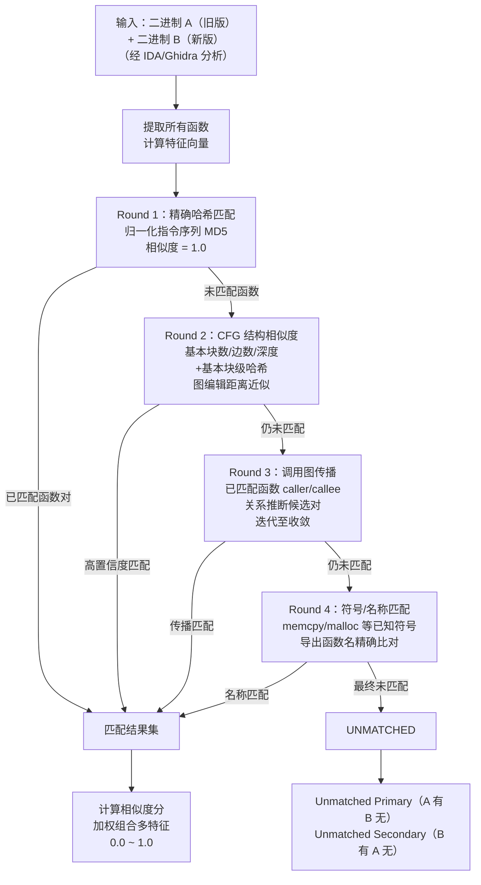

# 反编译器（12）· BinDiff与代码相似性分析

## 概述与定位

> [!abstract] TL;DR
> BinDiff 是二进制层面的"diff"工具，以函数为粒度，通过四轮渐进式匹配（精确哈希→CFG 结构→调用图传播→符号名称）计算两个二进制版本之间的函数相似度矩阵。其核心价值在于：安全研究员能在无源码的情况下，仅凭两份编译产物（新旧 patch 版本、同家族恶意软件变种、固件升级前后）快速定位改动函数、提取漏洞信息或追踪代码复用。

代码相似性分析（Code Similarity Analysis）是逆向工程的核心子领域，与[[02.控制流图CFG构建与基本块]]高度耦合——基本块和 CFG 结构是几乎所有主流工具计算"两段机器码有多相似"的基础度量单元。在 BinDiff 之外，Diaphora（开源）、radiff2（radare2 内置）和 bindiff CLI 构成了完整工具生态，而底层算法则统一围绕"归一化指令哈希"与"图匹配近似算法"两个支柱展开。

### 为什么需要代码相似性分析

逆向工程师在真实工作中频繁遇到以下场景，而这些场景都无法靠源码 diff 解决：

| 场景 | 典型问题 | 相似性分析的角色 |
|------|----------|-----------------|
| Patch Diffing | 厂商发布安全更新，如何在无 ChangeLog 时还原 CVE 细节？ | 对比 patch 前后二进制，定位相似度下降的函数 |
| 代码复用检测 | 嵌入式固件是否链接了存在漏洞的 OpenSSL 1.0.2 版本？ | 已知库哈希库 vs 固件函数哈希，命中率即版本识别 |
| 恶意软件家族追踪 | 新样本是否与已知 APT 工具集共享代码？ | 函数相似度矩阵统计复用率，聚类判定家族归属 |
| CTF 解题 | 题目二进制与参考实现的差异只有一个逻辑分支被修改 | 精确定位低相似度函数，快速锁定修改点 |

> [!note] Patch Diffing 的法律边界
> 使用 BinDiff 分析 CVE 补丁是安全研究的常见手段，但须注意：部分软件 EULA 禁止逆向工程。在法律允许的范围内（如研究授权版本、内部安全审计、开源软件合规扫描），本章内容合法且具有重要实践价值。

---

## 原理与机制

### 整体架构

BinDiff（由 Google/Zynamics 开发）的设计哲学是"粗到精"的多轮匹配：每轮匹配都比上一轮宽松，已匹配的函数对从候选池中移除，未匹配的进入下一轮再次尝试。最终未能在任何轮次匹配的函数被归类为"仅在一侧存在"（新增/删除）。



### Round 1：精确哈希匹配

第一轮是最高置信度的匹配，依赖**归一化指令序列哈希**。

所谓归一化，是指在对函数内指令序列生成哈希之前，先消除与"逻辑功能无关"的差异：
- **立即数（Immediate）** 替换为占位符 `IMM`（跳转目标地址、全局变量偏移等在重新编译时会变）
- **寄存器分配** 在某些实现中也归一化（因为寄存器分配策略可能随优化级别而异）
- **内存操作数** 中的基址/偏移替换为 `MEM`

归一化后的指令序列（仅保留操作码结构）进行 MD5/SHA-256 计算。两版本函数哈希一致，则匹配分为 1.0，直接入库，不再参与后续轮次。

> [!caution] 哈希碰撞与误匹配
> 精确哈希匹配存在极小概率的哈希碰撞风险，但在实践中几乎不构成问题（MD5 碰撞攻击需要主动构造）。更常见的"误匹配"来源是：两个在逻辑上完全不同的短函数（如"仅含 `xor eax, eax; ret` 的空函数"）在归一化后哈希相同，导致错误匹配。BinDiff 用函数长度（指令数量）作为过滤器缓解这一问题：过短的函数单独归类处理，不参与精确哈希轮次。

### Round 2：CFG 结构相似度

第二轮针对"归一化哈希不同但 CFG 结构相近"的函数对（典型情况：常量被修改，但控制流结构未变）。

**度量维度**：
1. **基本块数量**（BB count）：快速预筛，数量差异过大的函数对直接跳过
2. **CFG 边数**（Edge count）：与基本块数量共同描述"控制流密度"
3. **CFG 深度**（Cyclomatic Complexity）：衡量嵌套深度，即 `E - N + 2P`
4. **基本块级哈希列表**：每个基本块的归一化指令哈希，作为节点标签
5. **图编辑距离**（Graph Edit Distance，GED）近似：计算将 CFG_A 变换为 CFG_B 所需的最小编辑操作数

完整的 GED 计算是 NP-Hard 问题，BinDiff 使用启发式近似算法（类似匈牙利算法的二部图匹配），在可接受时间内获得近似解。

**基本块相似度矩阵**（简化示意）：

```
BB_A1  BB_A2  BB_A3       BB_B1  BB_B2  BB_B3
  ↓      ↓      ↓    →      ↓      ↓      ↓
hash1  hash2  hash3      hash1  hash4  hash3
         └────────── CFG_B 中 BB_B2 的 hash 不同（hash4）
                      → 此基本块在相似度计算中得分低
```

最终 CFG 结构相似度是节点匹配得分与边结构保持程度的加权组合。

### Round 3：调用图传播

本轮利用已确认匹配的函数对，通过**调用关系图**传播候选匹配。

**核心推断规则**：
- 若 `F_A` 已确认匹配 `F_B`
- 且 `F_A` 调用了函数 `G_A`，`F_B` 调用了函数 `G_B`
- 则 `(G_A, G_B)` 成为一个候选匹配对，置信度与 `(F_A, F_B)` 的相似度正相关

迭代过程类似图的 BFS 传播，每一轮可能新增已匹配对，新增的匹配对在下一轮继续作为传播源。迭代直到没有新的高置信度候选对产生为止。

> [!tip] 传播的局限
> 调用图传播对"高扇出"（一个函数调用很多子函数）或"高扇入"（一个函数被很多地方调用的工具函数）的情况效果有限。例如，`strlen` 被上百个函数调用，即使已知某父函数匹配，也无法从中唯一确定 `strlen` 的匹配对。BinDiff 在此情况下会降低置信度权重或放弃传播。

### Round 4：符号/名称匹配

最后一轮利用已知符号信息直接比对：
- **导入/导出符号**：`GetProcAddress`、`malloc`、`pthread_create` 等动态链接符号名
- **调试符号**（若存在 PDB/DWARF）：直接用函数名匹配
- **字符串引用**：函数内引用的特定字符串可作为锚点（不属于原始 BinDiff 但部分工具扩展了此维度）

名称匹配结果相似度默认为 1.0（如果两侧同名函数逻辑一致），但若名称相同而 CFG 差异显著，BinDiff 会降低置信度并标记为"相同名称但可能已修改"。

---

## 结构/算法/伪代码详解

### 归一化指令哈希（Python 伪代码）

```python
import hashlib

def normalize_insn(insn):
    """
    对单条反汇编指令进行归一化，消除与逻辑无关的常量差异。
    insn: 反汇编指令对象（假设有 .mnemonic 和 .operands 属性，如 capstone）
    """
    parts = [insn.mnemonic]  # 操作码保留
    for operand in insn.operands:
        if operand.type == 'imm':
            # 立即数：替换为占位符（跳转地址、整数常量等）
            parts.append('IMM')
        elif operand.type == 'reg':
            # 寄存器：保留（某些实现中也归一化为 REG，依具体策略）
            parts.append(operand.reg_name)
        elif operand.type == 'mem':
            # 内存操作数：替换为 MEM（基址偏移在重编译后可能变化）
            parts.append('MEM')
        else:
            parts.append('UNK')
    return ' '.join(parts)


def function_hash(func_instructions):
    """
    计算函数的归一化指令序列哈希（Round 1 精确匹配使用）。
    func_instructions: 函数内所有指令的有序列表
    """
    normalized_lines = [normalize_insn(insn) for insn in func_instructions]
    canonical = '\n'.join(normalized_lines)
    return hashlib.md5(canonical.encode('utf-8')).hexdigest()


# 示例：
# 原始指令序列（x86-64）
# mov eax, 0x401000   → normalize → "mov eax IMM"
# push rbp            → normalize → "push rbp"
# call 0x401234       → normalize → "call IMM"
# ret                 → normalize → "ret"
# 哈希输入: "mov eax IMM\npush rbp\ncall IMM\nret"
```

### CFG 基本块相似度计算（伪代码）

```python
def bb_similarity(bb_a_hash, bb_b_hash, insn_count_a, insn_count_b):
    """
    计算两个基本块的相似度（0.0 ~ 1.0）。
    精确哈希匹配则为 1.0；否则用长度比例估算最低相似度下界。
    """
    if bb_a_hash == bb_b_hash:
        return 1.0
    # 长度差异惩罚：两块指令数差异越大，相似度上限越低
    min_count = min(insn_count_a, insn_count_b)
    max_count = max(insn_count_a, insn_count_b)
    if max_count == 0:
        return 0.0
    length_ratio = min_count / max_count
    # 实际实现中还会进行更细粒度的指令逐条比对
    return length_ratio * 0.8  # 0.8 为经验衰减系数


def cfg_similarity(cfg_a, cfg_b, bb_match_matrix):
    """
    计算两个 CFG 的结构相似度（加权组合）。
    cfg_a, cfg_b: 包含节点(BB)和边的图结构
    bb_match_matrix: 基本块两两相似度矩阵（二部图权重）
    """
    # 节点数量特征
    node_ratio = min(len(cfg_a.nodes), len(cfg_b.nodes)) / \
                 max(len(cfg_a.nodes), len(cfg_b.nodes), 1)

    # 边数量特征
    edge_ratio = min(len(cfg_a.edges), len(cfg_b.edges)) / \
                 max(len(cfg_a.edges), len(cfg_b.edges), 1)

    # 使用匈牙利算法求最大权二部图匹配
    # （实际 BinDiff 用近似算法，此处简化示意）
    best_bb_matching_score = hungarian_max_matching(bb_match_matrix)
    normalized_bb_score = best_bb_matching_score / max(len(cfg_a.nodes), len(cfg_b.nodes), 1)

    # 加权组合
    return 0.4 * node_ratio + 0.2 * edge_ratio + 0.4 * normalized_bb_score
```

### 调用图传播算法（伪代码）

```python
def propagate_callgraph(matched_pairs, callgraph_a, callgraph_b):
    """
    Round 3 调用图传播：利用已匹配函数对推断新的候选匹配。
    matched_pairs: set of (func_a_id, func_b_id, similarity)
    callgraph_a/b: 调用关系图 {caller_id: [callee_id, ...]}
    返回：新增候选匹配对列表
    """
    new_candidates = {}  # (func_a_id, func_b_id) → confidence

    queue = list(matched_pairs)  # BFS 队列，从已匹配对出发
    visited = {(a, b) for a, b, _ in matched_pairs}

    while queue:
        func_a, func_b, parent_sim = queue.pop(0)

        callees_a = callgraph_a.get(func_a, [])
        callees_b = callgraph_b.get(func_b, [])

        if len(callees_a) == 1 and len(callees_b) == 1:
            # 唯一调用关系：高置信度推断
            ca, cb = callees_a[0], callees_b[0]
            if (ca, cb) not in visited:
                candidate_confidence = parent_sim * 0.9  # 置信度随传播衰减
                new_candidates[(ca, cb)] = max(
                    new_candidates.get((ca, cb), 0),
                    candidate_confidence
                )
                visited.add((ca, cb))
                queue.append((ca, cb, candidate_confidence))
        # 多对多调用：需要额外的消歧步骤（CFG 辅助过滤），此处省略

    return new_candidates
```

### 最终相似度分计算

```python
def compute_final_similarity(func_pair_features):
    """
    综合所有特征计算函数对的最终相似度分（0.0 ~ 1.0）。
    """
    weights = {
        'hash_exact':       1.00,   # 精确哈希匹配：直接返回 1.0
        'cfg_structure':    0.60,   # CFG 结构得分权重
        'callgraph_prop':   0.25,   # 调用图传播置信度权重
        'name_match':       0.15,   # 名称匹配加成
    }
    f = func_pair_features
    if f.get('hash_exact'):
        return 1.0
    score = (
        weights['cfg_structure']  * f.get('cfg_score', 0.0) +
        weights['callgraph_prop'] * f.get('cg_confidence', 0.0) +
        weights['name_match']     * f.get('name_match', 0.0)
    )
    # 归一化到 [0, 1]
    total_weight = weights['cfg_structure'] + weights['callgraph_prop'] + weights['name_match']
    return min(score / total_weight, 1.0)
```

---

## 工具视角/实战

### BinDiff + IDA Pro 操作流程

BinDiff 官方版本（由 Google 维护，免费下载）以 IDA Pro 插件形式提供，也有独立 CLI 和 Ghidra 插件版本。

**Step 1：分别用 IDA 分析两个版本**

```
# 以 Windows 可执行文件为例
# 旧版本：old_target.exe → 用 IDA Pro 打开，完成自动分析（等待进度条结束）
# 新版本：new_target.exe → 同上
# 分别保存：File → Save（生成 old_target.i64 / new_target.i64）
```

**Step 2：安装 BinDiff IDA 插件**

从 [https://github.com/google/bindiff](https://github.com/google/bindiff/releases) 下载安装包，运行安装程序后 BinDiff 插件（`bindiff8_ida.dll` 等）自动部署到 IDA 的 `plugins/` 目录。

**Step 3：执行差分**

在 IDA Pro 中打开旧版本数据库（`.i64`），然后：

```
菜单: Edit → BinDiff 8 → Diff Databases...
→ 弹出文件选择对话框
→ 选择新版本的 .i64 文件
→ 点击 OK，等待差分计算（大型二进制可能需要数分钟）
```

**Step 4：分析差分结果**

差分完成后，BinDiff 在 IDA 中打开三个视图窗口：

| 视图 | 内容 | 用途 |
|------|------|------|
| Matched Functions | 所有匹配函数对及相似度分 | 找低分函数（可能被修改的漏洞函数） |
| Unmatched Primary | 旧版有、新版没有的函数 | 被删除的功能 |
| Unmatched Secondary | 新版新增的函数 | 补丁新增的缓解代码或功能 |

**Step 5：聚焦低相似度函数**

在 Matched Functions 视图中按相似度升序排列：

```
双击相似度低（如 0.2 ~ 0.7）的函数行
→ 打开 Diff View（并排对比视图）
→ 左侧：旧版函数汇编/伪代码
→ 右侧：新版函数汇编/伪代码
→ 差异高亮显示（红色=删除，绿色=新增，黄色=修改）
```

> [!caution] 相似度分的误导性
> 相似度 0.95 的函数并不意味着"几乎没变"——单一字节的 off-by-one 修复（如 `<` 改为 `<=`）在编译后只改变一个比较指令，但可能修复了严重的缓冲区越界漏洞。**Patch Diffing 时必须手动审查所有相似度 < 1.0 的函数**，而不能仅关注低分项。

### BinExport 跨工具格式

BinExport 是 BinDiff 的"前置数据格式"，允许使用不同的反汇编器前端后统一进行差分：

```
IDA Pro    ─┐
             ├─ 导出 .BinExport 文件（Protocol Buffer 格式）─→ bindiff CLI 对比
Ghidra     ─┘

# Ghidra 导出 BinExport 需要安装插件
# 插件地址: https://github.com/google/binexport (Ghidra 扩展)
# 安装后: File → Export Program → 选择 BinExport 格式

# CLI 差分（不依赖 IDA GUI）
bindiff --primary old.BinExport --secondary new.BinExport --output_dir ./result/
```

BinExport 格式的优势：
- 一次导出，可重复对比不同版本组合
- 适合批量自动化（CI/CD 中嵌入 Patch Diffing 流程）
- Ghidra 用户可脱离 IDA Pro 使用 BinDiff 算法

### Diaphora：开源 BinDiff 替代方案

Diaphora（`https://github.com/joxeankoret/diaphora`）是功能最接近 BinDiff 的开源替代，基于 IDA Python 运行，将函数特征存入 SQLite 数据库，支持脚本化查询。

**安装与导出**：

```python
# 在 IDA Pro 中通过 Script → Run Script 执行 diaphora.py
# 或 File → Script File → 选择 diaphora.py（安装到 IDA plugins 目录后）

# 导出当前数据库到 SQLite
# Diaphora GUI 会自动弹出，选择 "Export"
# 输出文件: /path/to/binary.sqlite

# 导出完成后关闭旧版本 IDA，打开新版本二进制
# 再次运行 diaphora.py → 选择 "Diff" → 指定旧版 .sqlite 文件
```

**通过 SQLite 直接查询（自动化场景）**：

```python
import sqlite3

# 打开 Diaphora 导出的数据库
conn = sqlite3.connect('/path/to/binary.sqlite')
cursor = conn.cursor()

# 查询所有函数及其基本特征
cursor.execute("""
    SELECT name, address, nodes, edges, cyclomatic_complexity,
           md_index, kgh_hash, pseudocode_hash
    FROM functions
    ORDER BY nodes DESC
    LIMIT 20
""")
for row in cursor.fetchall():
    print(f"函数: {row[0]:<30} 地址: {hex(row[1])} 基本块: {row[2]}")

# 查询两库对比结果（diff 模式下生成 results 表）
cursor.execute("""
    SELECT f.name, f2.name, r.ratio, r.description
    FROM results r
    JOIN functions f ON r.id1 = f.id
    JOIN diff.functions f2 ON r.id2 = f2.id
    WHERE r.ratio < 0.9
    ORDER BY r.ratio ASC
""")
conn.close()
```

**Diaphora 相比 BinDiff 的额外特性**：

| 特性 | BinDiff | Diaphora |
|------|---------|----------|
| 开源/可扩展 | 否（Google 闭源） | 是（MIT 许可） |
| 数据格式 | 专有 .BinDiff | SQLite（可直接 SQL 查询） |
| 语义相似度 | 有限 | 支持伪代码文本相似度（md_index）|
| 机器学习特征 | 无 | 支持扩展插件 |
| 批量自动化 | bindiff CLI | Python 脚本直接操作 |

### radiff2：快速字节/指令差异查看

`radiff2` 是 radare2 框架内置的差分工具，适合快速查看两个二进制的字节级/指令级差异，无需 IDA 环境：

```bash
# 基本字节差异（类似 xxd diff）
radiff2 old_binary new_binary

# 指定架构（不依赖自动检测）
radiff2 -a x86 -b 64 old_binary new_binary

# 显示差异指令（反汇编后对比）
radiff2 -d old_binary new_binary

# 函数级别图匹配（基于 CFG 比较，类似 BinDiff Round 2）
radiff2 -C old_binary new_binary

# 仅显示差异区域（跳过相同字节块）
radiff2 -s old_binary new_binary

# 输出 JSON 格式（便于脚本处理）
radiff2 -j old_binary new_binary > diff.json

# 指定对比偏移范围（适用于固件 blob）
radiff2 -O 0x1000 -N 0x2000 old_firmware.bin new_firmware.bin
```

**radiff2 输出示例**：

```
0x00401050 mov eax, 0x10    <->  mov eax, 0x11    # 常量被修改
0x00401058 jl  0x401080     <->  jle 0x401080     # 比较符号变更（off-by-one 修复）
0x00401062 [deleted]        <->  nop              # 新版插入 nop（可能为对齐或安全检查）
```

> [!tip] radiff2 vs BinDiff 的选择
> - 快速查看补丁字节差异、无 IDA 许可证时 → 选 `radiff2`
> - 需要函数级相似度矩阵、大型二进制的系统性分析 → 选 BinDiff 或 Diaphora
> - 需要脚本化批量分析、自定义特征 → 选 Diaphora（SQLite 后端）

---

## 安全性与正确使用

### Patch Diffing 工作流（CVE 分析场景）

以一个典型场景为例：某厂商发布安全公告，声称修复了产品中的"堆缓冲区溢出"漏洞（CVE-XXXX-YYYY），但未公布技术细节。

**分析流程**：

```
1. 获取两个版本：
   - 补丁前版本（从官方历史发布页或 wayback machine 获取）
   - 补丁后版本（当前最新版）

2. 分别用 IDA/Ghidra 分析，导出 BinExport 或 Diaphora SQLite

3. 运行差分，筛选 Matched Functions 中相似度 < 1.0 的函数：
   - 重点关注相似度在 0.5 ~ 0.95 之间的函数（太低可能是重构，太高是小改动）

4. 在 Diff View 中对比低分函数：
   - 查找新增的边界检查（if size > MAX_SIZE return ERROR）
   - 查找修改的比较操作（< 改为 <=，或 unsigned 类型强转）
   - 查找新增的长度参数传递

5. 结合 Unmatched Secondary（新增函数），确认是否引入新的验证函数

6. 在旧版本中针对差异点构造 PoC（概念验证）
```

> [!caution] 法律与道德边界
> 1. **Patch Diffing 本身是合法的安全研究手段**，但将分析结果用于攻击未打补丁的生产系统属于犯罪行为。
> 2. 仅在**授权的测试环境**中验证 PoC；将漏洞信息提交给相关厂商（负责任披露）。
> 3. 某些国家/地区对反向工程有特定法律限制，操作前须了解本地法规（中国《网络安全法》第 22 条、美国 DMCA Section 1201 豁免条款等）。
> 4. **不要在未授权系统上运行 BinDiff 或 Diaphora 导出的差分结果作为攻击指导**。

### 恶意软件家族分析场景

在恶意软件分析中，BinDiff 用于判断新样本是否与已知 APT 工具集属于同一家族：

```python
# 批量相似度分析（伪代码，基于 Diaphora SQLite）
import sqlite3
import os

def batch_similarity_analysis(known_malware_dbs: list, target_db: str):
    """
    将目标样本与已知恶意软件家族数据库逐一对比，
    输出相似度最高的家族及关键共享函数。
    """
    results = {}
    target_conn = sqlite3.connect(target_db)
    target_funcs = {
        row[0]: row[1]  # name → kgh_hash
        for row in target_conn.execute(
            "SELECT name, kgh_hash FROM functions WHERE nodes > 5"
        )
    }

    for known_db in known_malware_dbs:
        family_name = os.path.basename(known_db).replace('.sqlite', '')
        known_conn = sqlite3.connect(known_db)
        known_funcs = {
            row[0]: row[1]
            for row in known_conn.execute(
                "SELECT name, kgh_hash FROM functions WHERE nodes > 5"
            )
        }

        # 精确哈希匹配统计
        shared_hashes = set(target_funcs.values()) & set(known_funcs.values())
        reuse_rate = len(shared_hashes) / max(len(target_funcs), 1)

        results[family_name] = {
            'reuse_rate': reuse_rate,
            'shared_func_count': len(shared_hashes),
        }
        known_conn.close()

    target_conn.close()
    # 按复用率排序
    return sorted(results.items(), key=lambda x: x[1]['reuse_rate'], reverse=True)
```

### 开源合规：GPL 代码检测

在嵌入式固件逆向或商业软件审计中，可以利用代码相似性分析检测 GPL 代码是否被违规使用：

```bash
# 步骤 1：建立已知 GPL 库的函数哈希数据库
# （对 OpenSSL、zlib、libpng 等已知版本编译后进行 BinExport 导出）

# 步骤 2：对目标固件进行 BinExport 导出
# （使用 Ghidra + BinExport 插件，免 IDA 许可证）

# 步骤 3：批量对比
for lib_export in known_gpl_libs/*.BinExport; do
    bindiff --primary "$lib_export" --secondary target_firmware.BinExport \
            --output_dir "./results/$(basename $lib_export .BinExport)/"
done

# 步骤 4：汇总匹配率
# 若某 GPL 库相似度 > 80%，可认为固件嵌入了该库（需进一步法律确认）
```

---

## 小结

本章系统介绍了二进制代码相似性分析的理论基础与实践工具链：

**算法层面**，BinDiff 的四轮渐进式匹配设计是理解所有代码相似性工具的基础：

1. **Round 1 精确哈希**：最高精度，捕获完全未修改的函数
2. **Round 2 CFG 结构**：捕获常量改动但逻辑不变的函数（最常见的 patch 场景）
3. **Round 3 调用图传播**：利用上下文关系扩大匹配覆盖率
4. **Round 4 符号名称**：利用已知信息锚定匹配

**工具层面**，三大工具各有定位：

- **BinDiff（IDA 插件）**：最成熟、可视化最好，适合深入手工分析
- **Diaphora（开源）**：SQLite 后端支持脚本化，适合批量自动化和自定义特征扩展
- **radiff2**：轻量快速，无需 IDA，适合快速预览字节/指令差异

**实践层面**，代码相似性分析的核心工作流是：
- Patch Diffing → 快速定位补丁引入的漏洞修复点
- 恶意软件分析 → 函数复用率判断家族归属
- 合规审计 → GPL 代码检测

与 [[02.控制流图CFG构建与基本块]] 紧密关联——CFG 结构是 Round 2 的核心度量单元，理解基本块构建机制有助于深入理解相似度分数的含义。固件层面的 Patch Diffing 实战见 [[39.固件与IoT嵌入式逆向/14.固件差分与补丁分析]]。

---

## 相关阅读

- [[02.控制流图CFG构建与基本块]] — CFG 相似度是 BinDiff Round 2 的核心，理解 CFG 构建有助于解读相似度分数
- [[11.符号执行与angr框架]] — 符号执行可与 BinDiff 结合：先定位差异函数，再用符号执行求触发条件
- [[39.固件与IoT嵌入式逆向/14.固件差分与补丁分析]] — 固件 Patch Diffing 实战，BinDiff 在嵌入式场景的具体应用
- [[00.反编译器与反汇编引擎原理总览]] — 系列总览与章节导航
- BinDiff 官方文档：https://www.zynamics.com/bindiff/manual/
- Diaphora 项目：https://github.com/joxeankoret/diaphora
- "Patch Diffing with Diaphora"（joxeankoret blog，2015）

---

⬅️ 上一篇 [[11.符号执行与angr框架]] ｜ 🏠 [[00.反编译器与反汇编引擎原理总览]] ｜ 下一篇 [[13.IDA Pro插件开发]] ➡️
