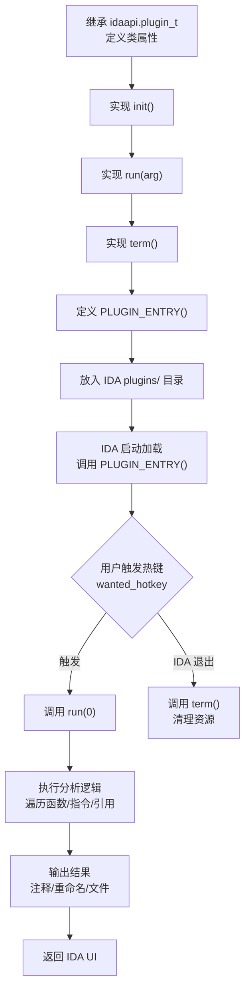

# 反编译器（13）· IDA Pro插件开发

## 概述与定位

> [!abstract] TL;DR
> IDA Pro 提供三层可编程接口：**IDAPython 脚本**（快速自动化）、**IDAPython 插件**（继承 `plugin_t`，热键驱动）、**C++ SDK 插件**（性能与底层控制）。掌握 `idc`/`idaapi`/`idautils`/`ida_hexrays` 等核心模块体系，可实现函数遍历、交叉引用分析、批量注释重命名、伪代码 ctree 访问等高价值自动化任务，大幅压缩逆向分析工时。

IDA Pro（Interactive Disassembler Professional）早在 20 世纪 90 年代即确立了现代交互式反汇编器的范式。时至今日，它仍是大多数专业逆向工程师的主要工作平台——不仅因为其反汇编精度，更因为其丰富的可编程接口。从 IDA 4.9 引入 IDC 脚本，到 IDA 5.x 引入 Python 绑定，再到 IDA 7.x 将 IDAPython 接口重构为细粒度子模块，IDA 的插件生态已演化为当今最完善的逆向工程自动化平台之一。

**本章在系列中的定位**：

- **上游**：`[[07.Hex-Rays反编译器内部机制]]` 详细讲解了 Microcode 八层管线与 ctree 数据结构——本章所有 `ida_hexrays` 调用均建立在这套概念体系之上；
- **本章**：聚焦 IDAPython 模块体系、常用操作模式、插件骨架设计、ctree 访问器编写，以及批量自动化任务的工程实现；
- **下游**：`[[14.Ghidra脚本与插件开发]]` 将在 Ghidra 生态下实现平行功能，形成对比视角。

---

## 原理与机制

### 13.1 IDAPython 架构层次

IDAPython 并不是一个简单的 Python 绑定，而是 IDA Pro 内核（`ida.dll`/`ida64.dll`）向 Python 解释器的完整投影。IDA 7.0 之后，原先集中在 `idaapi` 中的大量 API 被拆分到以 `ida_` 前缀命名的子模块中，形成更清晰的模块边界。

**模块调用链**：

```
用户 Python 脚本
       │
       ├── idc          ← 高级包装层（IDC 兼容语义）
       ├── idautils     ← 实用迭代器层
       ├── idaapi       ← 底层 C++ 类型直接绑定
       │
       └── ida_* 子模块 ← IDA 7.x 细粒度 API
              ├── ida_bytes / ida_funcs / ida_gdl
              ├── ida_hexrays / ida_ua / ida_xref
              └── ida_name / ida_nalt / ida_segment
                          │
                          ▼
                    IDA 内核 (ida.dll)
                          │
                          ▼
                    反汇编数据库 (.idb/.i64)
```

### 13.2 IDAPython 核心模块体系

| 模块 | 定位 | 典型用途 |
|------|------|---------|
| `idc` | 高级 API（历史 IDC 兼容层） | `GetDisasm`、`set_name`、`find_binary`、`get_func_name` |
| `idaapi` | 底层 API（数据结构/分析器/UI） | `plugin_t`、`action_handler_t`、`UI_Hooks`、`netnode` |
| `idautils` | 实用工具（迭代器/交叉引用/搜索） | `Functions()`、`Heads()`、`CodeRefsTo()`、`DataRefsTo()` |
| `ida_bytes` | 字节读写 | `get_bytes(ea, n)`、`patch_bytes(ea, data)`、`get_wide_dword` |
| `ida_funcs` | 函数管理 | `get_func(ea)` → `func_t`、`add_func(start, end)` |
| `ida_gdl` | 图形/CFG | `FlowChart(func_t)`、`BasicBlock`、块的前驱/后继迭代 |
| `ida_hexrays` | Hex-Rays 反编译 API | `decompile(ea)`、`cfunc_t`、`ctree_visitor_t`、微码访问 |
| `ida_name` | 名称管理 | `get_name(ea)`、`set_name(ea, name, flags)` |
| `ida_nalt` | 附加信息 | 注释读写、操作数类型覆盖（`op_t` 信息） |
| `ida_xref` | 交叉引用 | `CodeRefsTo(ea)`、`DataRefsTo(ea)`、`add_cref`、`add_dref` |
| `ida_search` | 搜索 | `find_bytes(ea, size, pattern)`、`find_text` |
| `ida_ua` | 反汇编单条指令 | `decode_insn(insn, ea)` → `insn_t`；`insn.ops[]` |
| `ida_segment` | 段管理 | `getseg(ea)`、`Segments()`、`segment_t`（名称/权限/类型） |
| `ida_lines` | 反汇编行生成 | `generate_disasm_line(ea)`、颜色标记 |
| `ida_entry` | 入口点 | `get_entry(idx)`、`get_entry_qty()` |

### 13.3 IDA 插件类型与加载机制

IDA 支持三种插件形态，各有适用场景：

| 类型 | 实现语言 | 入口点 | 加载时机 | 性能 | 适用场景 |
|------|---------|-------|---------|------|---------|
| IDAPython 脚本 | Python | 直接执行 | 手动运行 / `Alt+F7` | 低 | 快速一次性分析 |
| IDAPython 插件 | Python | `PLUGIN_ENTRY()` | IDA 启动时加载 | 中 | 热键驱动的分析工具 |
| C++ SDK 插件 | C++ | `PLUGIN_ENTRY()` | IDA 启动时加载 | 高 | 高频操作/新架构处理器 |

IDAPython 插件放置在 IDA 安装目录的 `plugins/` 子目录下；IDA 启动时扫描该目录，对每个 `.py` 文件调用 `PLUGIN_ENTRY()` 获取 `plugin_t` 实例并完成注册。

### 13.4 插件开发流程 Mermaid 图



---

## 结构/算法/伪代码详解

### 13.5 地址空间与基础概念

IDA 中一切操作以**有效地址（Effective Address，ea）**为基准，类型为 `int`（32 位库）或 `long`（64 位库）。`idc.BADADDR`（值 `0xFFFFFFFF...`）用于表示"无效地址"或"未找到"。

核心常量与函数：

```python
import idc, idaapi, idautils, ida_funcs, ida_bytes, ida_gdl

# 地址边界
min_ea = idc.get_inf_attr(idc.INF_MIN_EA)  # 可执行文件映射起始
max_ea = idc.get_inf_attr(idc.INF_MAX_EA)  # 映射结束

# 当前光标地址（交互脚本中使用）
current = idc.here()

# 地址对齐/有效性检查
def is_valid_ea(ea):
    return ea != idc.BADADDR and min_ea <= ea < max_ea
```

### 13.6 函数遍历与属性读取

```python
import idautils, idc, ida_funcs

def enumerate_all_functions():
    """遍历所有函数，打印地址、名称、大小"""
    results = []
    for func_ea in idautils.Functions():
        func = ida_funcs.get_func(func_ea)
        if func is None:
            continue
        name = idc.get_func_name(func_ea)
        size = func.size()
        flags = func.flags
        
        # 函数标志解析
        is_lib  = bool(flags & ida_funcs.FUNC_LIB)   # 库函数
        is_thunk = bool(flags & ida_funcs.FUNC_THUNK)  # Thunk（蹦床）
        
        results.append({
            'ea':     func_ea,
            'name':   name,
            'size':   size,
            'is_lib': is_lib,
            'is_thunk': is_thunk,
        })
        print(f"{func_ea:#010x}: {name:40s} ({size:5d} bytes)"
              + (" [LIB]"   if is_lib   else "")
              + (" [THUNK]" if is_thunk else ""))
    return results
```

### 13.7 函数内指令遍历

```python
import idautils, idc, ida_ua

def disasm_function(func_ea):
    """遍历函数内所有指令，打印反汇编行"""
    start = idc.get_func_attr(func_ea, idc.FUNCATTR_START)
    end   = idc.get_func_attr(func_ea, idc.FUNCATTR_END)
    
    if start == idc.BADADDR:
        print(f"Not a function: {func_ea:#x}")
        return
    
    print(f"Function {idc.get_func_name(func_ea)} [{start:#x} – {end:#x}]:")
    for head in idautils.Heads(start, end):
        disasm = idc.GetDisasm(head)
        # 解码指令获取助记符与操作数
        insn = ida_ua.insn_t()
        ida_ua.decode_insn(insn, head)
        mnem = insn.get_canon_mnem()
        print(f"  {head:#010x}  {disasm:<40s}  [{mnem}]")
```

### 13.8 CFG 基本块遍历

```python
import ida_funcs, ida_gdl

def traverse_cfg(func_ea):
    """使用 FlowChart 遍历函数的控制流图基本块"""
    func = ida_funcs.get_func(func_ea)
    if func is None:
        return
    
    fc = ida_gdl.FlowChart(func)
    print(f"CFG of {idc.get_func_name(func_ea)}: {fc.size} basic blocks")
    
    for block in fc:
        # block: BasicBlock 对象
        # block.start_ea, block.end_ea, block.id
        succs = list(block.succs())  # 后继基本块列表
        preds = list(block.preds())  # 前驱基本块列表
        print(f"  BB#{block.id} [{block.start_ea:#x} – {block.end_ea:#x}]"
              f"  succs={[b.id for b in succs]}"
              f"  preds={[b.id for b in preds]}")
```

### 13.9 字节读写操作

```python
import ida_bytes

def read_and_patch(ea, size=16):
    """读取并演示字节补丁操作"""
    # 读取原始字节
    original = ida_bytes.get_bytes(ea, size)
    if original is None:
        print(f"Cannot read at {ea:#x}")
        return
    hex_str = ' '.join(f'{b:02X}' for b in original)
    print(f"Original bytes at {ea:#x}: {hex_str}")
    
    # NOP 填充示例（x86: 0x90）
    nop_bytes = bytes([0x90] * size)
    ida_bytes.patch_bytes(ea, nop_bytes)
    print(f"Patched {size} bytes with NOP at {ea:#x}")
    
    # 恢复原始字节
    ida_bytes.patch_bytes(ea, original)
    print("Restored original bytes")
```

### 13.10 搜索字节序列

```python
import idc

def find_jmp_indirect(start_ea=None):
    """搜索所有 JMP [reg] / JMP [mem] 间接跳转"""
    if start_ea is None:
        start_ea = idc.get_inf_attr(idc.INF_MIN_EA)
    
    # FF 25: JMP [rip+disp32] (x64 PLT stub)
    # FF E0: JMP rax  (FF /4 mod=11 reg=4 rm=0)
    patterns = {
        "FF 25": "JMP [RIP+disp32] (PLT)",
        "FF E0": "JMP RAX",
        "FF E1": "JMP RCX",
        "FF E2": "JMP RDX",
    }
    
    results = []
    for pattern, desc in patterns.items():
        addr = idc.find_binary(start_ea, idc.SEARCH_DOWN | idc.SEARCH_CASE, pattern)
        while addr != idc.BADADDR:
            results.append((addr, pattern, desc))
            addr = idc.find_binary(addr + 1, idc.SEARCH_DOWN | idc.SEARCH_CASE, pattern)
    
    results.sort(key=lambda x: x[0])
    for addr, pattern, desc in results:
        func = idc.get_func_name(addr)
        print(f"{addr:#x}: {pattern}  {desc}  (in {func})")
    return results
```

### 13.11 交叉引用分析

```python
import idautils, idc

def analyze_xrefs_to(target_name):
    """分析指定函数/符号的所有调用来源"""
    ea = idc.get_name_ea_simple(target_name)
    if ea == idc.BADADDR:
        print(f"Symbol not found: {target_name}")
        return []
    
    print(f"Cross-references TO {target_name} ({ea:#x}):")
    call_sites = []
    for xref in idautils.CodeRefsTo(ea, 0):
        caller_ea   = idc.get_func_attr(xref, idc.FUNCATTR_START)
        caller_name = idc.get_func_name(caller_ea) if caller_ea != idc.BADADDR else "<no func>"
        disasm      = idc.GetDisasm(xref)
        call_sites.append({'site': xref, 'caller': caller_name, 'disasm': disasm})
        print(f"  {xref:#010x}: {caller_name:40s}  {disasm}")
    
    return call_sites

def analyze_data_xrefs(global_ea):
    """分析数据地址的所有引用方"""
    print(f"Data refs TO {global_ea:#x} ({idc.get_name(global_ea)}):")
    for xref in idautils.DataRefsTo(global_ea):
        func_name = idc.get_func_name(xref)
        disasm    = idc.GetDisasm(xref)
        print(f"  {xref:#x}: {func_name}  {disasm}")

def build_dangerous_function_map():
    """构建危险函数调用图"""
    dangerous = [
        'strcpy', 'strcat', 'sprintf', 'vsprintf',
        'gets', 'scanf', 'system', 'popen', 'exec',
        'memcpy', 'memmove',  # 长度校验不当可溢出
    ]
    findings = {}
    for name in dangerous:
        ea = idc.get_name_ea_simple(name)
        if ea == idc.BADADDR:
            continue
        callers = list(idautils.CodeRefsTo(ea, 0))
        if callers:
            findings[name] = callers
            print(f"[!] {name}: {len(callers)} call site(s)")
            for site in callers:
                print(f"    {site:#x}: {idc.get_func_name(site)}")
    return findings
```

### 13.12 批量注释与重命名

```python
import idc, idautils

def rename_function_batch(rename_map: dict):
    """
    批量重命名函数。
    rename_map: { old_name_or_ea: new_name }
    """
    SN_NOCHECK = idc.SN_CHECK  # 合法性检查，名称重复时失败
    for key, new_name in rename_map.items():
        # key 可以是名称字符串或整数地址
        if isinstance(key, str):
            ea = idc.get_name_ea_simple(key)
        else:
            ea = key
        if ea == idc.BADADDR:
            print(f"  [SKIP] Cannot locate: {key}")
            continue
        ret = idc.set_name(ea, new_name, SN_NOCHECK)
        status = "OK" if ret else "FAIL"
        print(f"  [{status}] {ea:#x}: {key!r} → {new_name!r}")

def annotate_call_sites(target_name, comment_template):
    """在所有调用点添加 EOL 注释"""
    ea = idc.get_name_ea_simple(target_name)
    if ea == idc.BADADDR:
        return
    for xref in idautils.CodeRefsTo(ea, 0):
        existing = idc.get_cmt(xref, 0)  # 读取现有 EOL 注释
        if existing:
            new_cmt = existing + "; " + comment_template.format(target=target_name)
        else:
            new_cmt = comment_template.format(target=target_name)
        idc.set_cmt(xref, new_cmt, 0)     # 0 = EOL 注释，1 = 可重复注释
        # 可重复注释会在所有引用该地址的位置显示
        idc.set_cmt(xref, f"Calls {target_name}", 1)
```

---

## 工具视角/实战

### 13.13 最小 IDAPython 插件骨架

下面是一个完整的、可直接放入 `plugins/` 目录运行的 IDAPython 插件，功能是扫描危险函数调用并在调用位置添加警告注释：

```python
"""
dangerous_func_scanner.py
放入 IDA plugins/ 目录。热键 Ctrl+Shift+M 触发。
"""

import idaapi
import idautils
import idc

DANGEROUS = [
    'strcpy', 'strncpy', 'strcat', 'strncat',
    'sprintf', 'vsprintf', 'snprintf',
    'gets', 'scanf', 'fscanf', 'sscanf',
    'system', 'popen', 'execve', 'execl',
    'memcpy', 'memmove', 'memset',
]


class DangerousFuncScanner(idaapi.plugin_t):
    """扫描危险 C 标准库函数的调用位置并批量标注"""

    flags       = idaapi.PLUGIN_UNL   # 运行完毕后卸载，下次热键重新加载
    comment     = "Scan & annotate dangerous C library calls"
    help        = "Ctrl+Shift+M: scan dangerous functions and add EOL comments"
    wanted_name = "DangerousFuncScanner"
    wanted_hotkey = "Ctrl+Shift+M"

    def init(self):
        # 仅在 IDA 有打开数据库时才激活
        if not idaapi.get_imagebase():
            return idaapi.PLUGIN_SKIP
        print("[DangerousFuncScanner] Plugin loaded. Press Ctrl+Shift+M to scan.")
        return idaapi.PLUGIN_OK

    def run(self, arg):
        print("[DangerousFuncScanner] Starting scan...")
        total_findings = 0

        for func_name in DANGEROUS:
            ea = idc.get_name_ea_simple(func_name)
            if ea == idc.BADADDR:
                continue  # 该函数不存在于此二进制中

            sites = list(idautils.CodeRefsTo(ea, 0))
            if not sites:
                continue

            print(f"  [!] {func_name}: {len(sites)} call site(s)")
            for site in sites:
                caller = idc.get_func_name(
                    idc.get_func_attr(site, idc.FUNCATTR_START)
                )
                comment = f"[DANGER] calls {func_name} — audit buffer handling"
                idc.set_cmt(site, comment, 0)
                print(f"      {site:#010x}  caller={caller}")
                total_findings += 1

        print(f"[DangerousFuncScanner] Done. {total_findings} call site(s) annotated.")
        idaapi.info(f"DangerousFuncScanner: {total_findings} dangerous call(s) annotated.")

    def term(self):
        pass


def PLUGIN_ENTRY():
    return DangerousFuncScanner()
```

> [!tip] 插件开发要点
> - `flags = PLUGIN_UNL`：每次 `run()` 后插件卸载，适合分析型工具；改为 `PLUGIN_KEEP` 可持久驻留（适合需要维护状态的插件）。
> - `PLUGIN_SKIP` 表示条件不满足（如无数据库），IDA 会忽略该插件。
> - `idaapi.info()` 弹出 IDA 原生消息框；`print()` 输出到 Output 窗口。

### 13.14 Hex-Rays ctree 访问器

ctree 是 Hex-Rays 反编译器输出的 C-like AST，节点类型由 `ctype_t` 枚举描述（`cot_*` 表示表达式，`cit_*` 表示语句）。通过继承 `ctree_visitor_t` 可以深度优先遍历 AST。

```python
"""
printf_format_extractor.py
提取所有 printf-family 调用的格式字符串参数。
"""
import ida_hexrays
import idautils
import idc


class PrintfFormatExtractor(ida_hexrays.ctree_visitor_t):
    """
    遍历 cfunc 的 ctree，找到 printf/fprintf/sprintf 等调用，
    提取第一个字符串参数（格式字符串）。
    """
    PRINTF_FAMILY = {'printf', 'fprintf', 'sprintf', 'snprintf',
                     'dprintf', 'vprintf', 'vfprintf', 'vsprintf'}

    def __init__(self):
        # CV_FAST: 快速模式（不维护父节点链）；CV_INSNS: 遍历语句节点
        super().__init__(ida_hexrays.CV_FAST | ida_hexrays.CV_INSNS)
        self.results = []   # (call_ea, func_name, fmt_string)

    def visit_expr(self, expr):
        """每访问一个表达式节点时调用"""
        # 检查是否为函数调用（cot_call）
        if expr.op != ida_hexrays.cot_call:
            return 0  # 返回 0 继续遍历，非 0 停止

        # 被调用方必须是直接函数对象（cot_obj）
        callee = expr.x
        if callee.op != ida_hexrays.cot_obj:
            return 0

        func_name = idc.get_name(callee.obj_ea)
        # 去掉 PLT 前缀等修饰（如 _printf、printf@plt）
        base_name = func_name.lstrip('_').split('@')[0]

        if base_name not in self.PRINTF_FAMILY:
            return 0

        # 提取第一个参数（格式字符串）
        args = expr.a  # carglist_t（参数列表）
        if args.size() == 0:
            return 0

        # 对于 fprintf/dprintf，第一个参数是 FILE*/fd，格式字符串是第二个
        fmt_idx = 1 if base_name in {'fprintf', 'dprintf'} else 0
        if args.size() <= fmt_idx:
            return 0

        fmt_arg = args[fmt_idx]

        # 格式字符串通常是 cot_obj（指向 .rodata 中的字符串）
        if fmt_arg.op == ida_hexrays.cot_obj:
            raw = idc.get_strlit_contents(fmt_arg.obj_ea, -1, idc.STRTYPE_C)
            fmt_str = raw.decode('utf-8', errors='replace') if raw else '<non-string>'
        elif fmt_arg.op == ida_hexrays.cot_cast:
            # 带强制转换：(const char*)...
            inner = fmt_arg.x
            if inner.op == ida_hexrays.cot_obj:
                raw = idc.get_strlit_contents(inner.obj_ea, -1, idc.STRTYPE_C)
                fmt_str = raw.decode('utf-8', errors='replace') if raw else '<cast-non-str>'
            else:
                fmt_str = '<dynamic-fmt>'
        else:
            fmt_str = '<dynamic-fmt>'

        self.results.append((expr.ea, func_name, fmt_str))
        return 0

    def visit_insn(self, insn):
        return 0  # 语句节点不处理，只处理表达式


def extract_printf_formats(func_ea):
    """对单个函数运行格式字符串提取"""
    try:
        cfunc = ida_hexrays.decompile(func_ea)
    except ida_hexrays.DecompilationFailure as e:
        print(f"  Decompilation failed at {func_ea:#x}: {e}")
        return []

    if cfunc is None:
        return []

    visitor = PrintfFormatExtractor()
    visitor.apply_to(cfunc.body, None)
    return visitor.results


def scan_all_functions_for_printf():
    """全库扫描所有函数中的 printf 调用"""
    if not ida_hexrays.init_hexrays_plugin():
        print("Hex-Rays not available")
        return

    all_results = []
    for func_ea in idautils.Functions():
        results = extract_printf_formats(func_ea)
        for call_ea, func_name, fmt_str in results:
            caller = idc.get_func_name(func_ea)
            print(f"{call_ea:#010x}  {caller:35s}  {func_name:12s}  {fmt_str!r}")
            all_results.append((call_ea, caller, func_name, fmt_str))

    print(f"\nTotal printf-family calls: {len(all_results)}")
    return all_results
```

### 13.15 批量导出所有函数伪代码

逆向大型二进制时，批量导出伪代码供 grep/LLM 分析是常见工作流：

```python
"""
export_pseudocode.py
将二进制中所有函数的 Hex-Rays 伪代码导出为独立 .c 文件。
"""
import os
import ida_hexrays
import idautils
import idc

def export_all_pseudocode(output_dir: str, skip_lib: bool = True):
    """
    output_dir: 本地导出目录（若不存在则自动创建）
    skip_lib:   True = 跳过被标记为库函数的函数
    """
    import ida_funcs

    if not ida_hexrays.init_hexrays_plugin():
        print("[ERROR] Hex-Rays decompiler not available")
        return

    os.makedirs(output_dir, exist_ok=True)

    success = 0
    failed  = 0
    skipped = 0

    for func_ea in idautils.Functions():
        func = ida_funcs.get_func(func_ea)
        if func is None:
            continue

        # 可选：跳过库函数（FUNC_LIB 标志）
        if skip_lib and (func.flags & ida_funcs.FUNC_LIB):
            skipped += 1
            continue

        name = idc.get_func_name(func_ea)
        # 净化文件名：替换非法字符
        safe_name = ''.join(c if c.isalnum() or c in '_.' else '_' for c in name)
        out_path = os.path.join(output_dir, f"{safe_name}__{func_ea:#010x}.c")

        try:
            cfunc = ida_hexrays.decompile(func_ea)
            if cfunc is None:
                failed += 1
                continue
            with open(out_path, 'w', encoding='utf-8') as f:
                # 写入文件头注释
                f.write(f"// Function: {name}\n")
                f.write(f"// Address:  {func_ea:#010x}\n")
                f.write(f"// Size:     {func.size()} bytes\n\n")
                f.write(str(cfunc))
            success += 1
        except ida_hexrays.DecompilationFailure as e:
            print(f"  [FAIL] {func_ea:#010x} {name}: {e}")
            failed += 1
        except OSError as e:
            print(f"  [IO ERROR] {out_path}: {e}")
            failed += 1

    print(f"\nExport complete:")
    print(f"  Success: {success}")
    print(f"  Failed:  {failed}")
    print(f"  Skipped: {skipped}")
    print(f"  Output:  {output_dir}")
    return success, failed, skipped
```

### 13.16 段遍历与内存布局分析

```python
import ida_segment, idc

def dump_segment_layout():
    """打印二进制的所有段信息"""
    print(f"{'Name':15s} {'Start':12s} {'End':12s} {'Size':10s} {'Perm':6s} {'Class':8s}")
    print("-" * 70)

    for seg_ea in idautils.Segments():
        seg = ida_segment.getseg(seg_ea)
        if seg is None:
            continue
        name  = idc.get_segm_name(seg_ea)
        start = seg.start_ea
        end   = seg.end_ea
        size  = end - start

        # 权限位
        perm_r = 'r' if seg.perm & ida_segment.SEGPERM_READ  else '-'
        perm_w = 'w' if seg.perm & ida_segment.SEGPERM_WRITE else '-'
        perm_x = 'x' if seg.perm & ida_segment.SEGPERM_EXEC  else '-'
        perm   = perm_r + perm_w + perm_x

        cls = idc.get_segm_attr(seg_ea, idc.SEGATTR_TYPE)

        print(f"{name:15s} {start:#012x} {end:#012x} {size:#010x} {perm:6s} {cls!r:8}")
```

### 13.17 注册自定义 IDA Action（菜单/右键集成）

对于需要集成到右键菜单的高级场景，可以使用 `action_handler_t` + `register_action`：

```python
import idaapi

class RenameActionHandler(idaapi.action_handler_t):
    """右键菜单 → Rename to convention"""

    def activate(self, ctx):
        ea = idc.here()
        current = idc.get_func_name(ea)
        # 弹出输入框
        new_name = idaapi.ask_str(current, 0, "Enter new function name:")
        if new_name:
            idc.set_name(ea, new_name, idc.SN_CHECK)
            print(f"Renamed {ea:#x}: {current!r} → {new_name!r}")
        return 1

    def update(self, ctx):
        # 仅在光标在函数内时启用
        if idaapi.get_func(idc.here()):
            return idaapi.AST_ENABLE_ALWAYS
        return idaapi.AST_DISABLE


ACTION_NAME = "my_plugin:rename_convention"
ACTION_DESC = idaapi.action_desc_t(
    ACTION_NAME,
    "Rename to convention",
    RenameActionHandler(),
    "Ctrl+Shift+R",
    "Rename function following naming convention",
    -1  # 无图标
)

def register_custom_actions():
    idaapi.register_action(ACTION_DESC)
    # 附加到右键菜单
    idaapi.attach_action_to_menu(
        "Edit/Other/",
        ACTION_NAME,
        idaapi.SETMENU_APP
    )
```

---

## 安全性与正确使用

> [!caution] 合规边界
> IDAPython 脚本与插件是强大的自动化工具，但其应用场景有明确边界：
> - **合法场景**：对自有程序/固件进行安全审计、漏洞研究、CTF 题目分析、恶意软件分析（样本来自正规威胁情报渠道）。
> - **边界外场景**：使用自动化脚本绕过商业软件授权检查、批量破解 DRM 保护、对未授权目标实施逆向工程——上述行为在多数司法管辖区违反《计算机欺诈与滥用法》（CFAA）、《数字千年版权法》（DMCA）或等效法律。
> - 本章所有代码示例仅供技术学习与合法安全研究使用。

### 13.18 常见陷阱与最佳实践

**陷阱 1：`idc` 与 `ida_*` 子模块混用导致语义冲突**

IDA 7.x 之后，部分 `idc` 函数是对 `ida_*` 子模块的封装，某些参数语义略有差异。建议在新代码中优先使用细粒度子模块（`ida_funcs.get_func(ea)` 而非 `idc.get_func(ea)`），保留 `idc` 用于快速原型。

**陷阱 2：Hex-Rays 反编译失败未处理**

`ida_hexrays.decompile(ea)` 在遇到无法处理的函数时会抛出 `DecompilationFailure`，必须用 `try/except` 包裹：

```python
try:
    cfunc = ida_hexrays.decompile(func_ea)
except ida_hexrays.DecompilationFailure:
    cfunc = None

if cfunc is None:
    # 回退到汇编级别分析
    pass
```

**陷阱 3：ctree_visitor_t 中修改 AST 导致迭代器失效**

在 `visit_expr` 中不要直接修改 cfunc 的 ctree 结构；应收集目标节点信息，遍历结束后统一处理。

**陷阱 4：`patch_bytes` 与"撤销"**

`patch_bytes` 直接修改 IDA 数据库，在交互模式下可用 `Edit → Undo` 撤销；但在脚本中调用时，务必先备份原始字节（`get_bytes`）。

**陷阱 5：`idc.BADADDR` 判断遗漏**

`get_name_ea_simple`、`find_binary` 等搜索函数在未找到时均返回 `idc.BADADDR`（`0xFFFFFFFF` 或 `0xFFFFFFFFFFFFFFFF`），必须显式检查，否则后续操作会崩溃或产生静默错误。

### 13.19 性能考量

| 操作 | 性能特征 | 优化建议 |
|------|---------|---------|
| `idautils.Functions()` 迭代 | O(N) 函数数量 | 无需优化，迭代器懒加载 |
| `ida_hexrays.decompile()` | 每次 10–500ms | 批量场景先检测是否为 thunk/lib 跳过 |
| `idautils.CodeRefsTo()` | O(引用数量) | 对热点函数（如 `malloc`）引用可能极多，加分页逻辑 |
| `ida_bytes.patch_bytes()` | 较快 | 大量补丁建议批量收集后一次提交 |
| `idc.find_binary()` 全局搜索 | O(数据库大小) | 指定搜索范围（从 `min_ea` 到 `max_ea`），避免冗余扫描 |

---

## 小结

本章系统梳理了 IDA Pro 插件开发的全貌：

1. **模块体系**：`idc`（高级兼容层）→ `idautils`（迭代工具）→ `ida_*` 子模块（IDA 7.x 细粒度 API）→ `idaapi`（底层数据结构与 UI）四层架构；每个子模块职责清晰，`ida_hexrays` 提供反编译 ctree 访问能力。

2. **常用操作模式**：函数/指令/CFG 遍历（`idautils.Functions()`、`Heads()`、`FlowChart`）、字节读写（`ida_bytes`）、字节搜索（`idc.find_binary`）、交叉引用（`CodeRefsTo`/`DataRefsTo`）、注释重命名——这六类操作覆盖 80% 的分析自动化需求。

3. **插件骨架**：继承 `plugin_t`，实现 `init`/`run`/`term` 三个方法，定义 `wanted_name`/`wanted_hotkey`，暴露 `PLUGIN_ENTRY()`——最小插件不足 30 行，即可实现热键驱动的完整分析工具。

4. **ctree 访问器**：继承 `ctree_visitor_t`，在 `visit_expr` 中通过 `expr.op`（`cot_call`/`cot_obj` 等）识别 AST 节点，提取调用信息、格式字符串、变量用途等高价值语义——是 Hex-Rays 插件最核心的技术模式。

5. **批量伪代码导出**：`ida_hexrays.decompile()` + `str(cfunc)` + `try/except DecompilationFailure` 的三要素组合，可将全库伪代码导出为文本供后续 grep、静态分析或 LLM 辅助审计使用。

6. **合规边界**：强大的自动化能力必须配合法律意识——逆向工程工具的合法应用场景是安全研究、漏洞挖掘与 CTF，而非破解商业软件或绕过授权机制。

掌握本章技能，可将人工逐函数审计的工时从数天压缩到数分钟；结合第07章的 Microcode 原理知识，还可以编写更高级的优化插件（如自定义去混淆 pass）。

---

## 相关阅读

- `[[07.Hex-Rays反编译器内部机制]]` — 本章 `ida_hexrays` API 的理论基础：Microcode 八层管线、ctree 数据结构
- `[[14.Ghidra脚本与插件开发]]` — Ghidra 生态的对应开发方式：GhidraScript、P-Code API、Java/Python 插件
- `[[12.BinDiff与代码相似性分析]]` — 本章批量导出伪代码的一个下游应用：将伪代码供 BinDiff/Diaphora 比对
- `[[08.Ghidra反编译器与P-Code分析]]` — Ghidra 反编译器原理，与 Hex-Rays 的架构对比
- `[[11.符号执行与angr框架]]` — IDAPython 与 angr 联动：用 IDA 提取函数边界后交给 angr 符号执行
- `[[44.调试器原理与实战/00.调试器原理与实战总览]]` — IDA 调试器（GDB Remote/Win32 调试器）与插件的联动

---

⬅️ 上一篇 [[12.BinDiff与代码相似性分析]] ｜ 🏠 [[00.反编译器与反汇编引擎原理总览]] ｜ 下一篇 [[14.Ghidra脚本与插件开发]] ➡️
