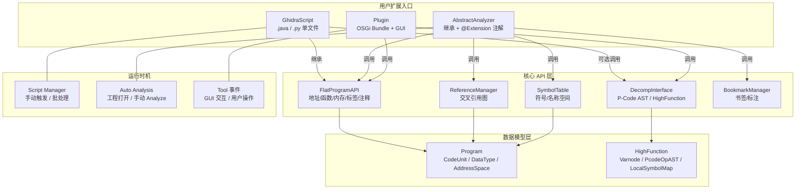

# 反编译器（14）· Ghidra脚本与插件开发

## 概述与定位

> [!abstract] TL;DR
> Ghidra 提供三条扩展路径：**GhidraScript**（单文件、快速迭代）、**Analyzer**（集成到自动分析流水线）、**Plugin/Provider**（带 GUI 的持久化工具）。Java 是核心语言，`FlatProgramAPI` 封装了 90% 的常用操作；`DecompInterface` 打通脚本层与反编译核心，可直接读取 P-Code AST、Varnode 图和反编译后的 C 代码。

Ghidra 的可扩展性是其区别于 IDA Pro 的重要竞争力之一。IDA 依赖封闭的 SDK，而 Ghidra 把整个反编译内核和分析框架都以 Java 类库的形式公开——这意味着你能用脚本做到的事，与 Ghidra 自身的内置功能处于同等地位，没有"二等公民"的 API 层次之分。

Ghidra 的扩展生态分为四个层次：

| 层次 | 技术形式 | 生命周期 | 典型用途 |
|---|---|---|---|
| GhidraScript | 单 `.java` / `.py` 文件 | 一次性运行 | 批量注释、导出数据、快速 PoC |
| AbstractAnalyzer | 继承并注册到扩展点 | 随自动分析运行 | 危险函数标记、自定义调用约定 |
| Plugin | OSGi Bundle，有 GUI | 随工程持久存在 | 自定义视图、交互式工具 |
| Extension（Gradle 工程） | 打包为 `.zip` 安装 | 跨版本分发 | 商业插件、公开发布的工具 |

本章聚焦前两个层次（脚本与 Analyzer），它们覆盖了逆向工程师日常 95% 的自动化需求，且无需配置复杂的 OSGi 工程环境。

---

## 原理与机制

### Ghidra 扩展点体系

Ghidra 使用 **Eclipse OSGi** 框架管理模块，但对外暴露的扩展点被刻意设计为简单的继承+注册模型。脚本系统（`GhidraScriptUtil`）在运行时扫描 `ghidra_scripts` 目录，把每个 `.java` 文件当作独立的编译单元，实时编译并在后台 JVM 中执行。Analyzer 则通过 `@Extension`/`@PluginInfo` 注解自动注册到服务定位器（`ClassSearcher`），在工程打开时被自动发现。



### 脚本语言选择

**Java（推荐）**：类型安全，IDE 支持完善（Eclipse Ghidra 开发环境官方提供），能访问所有内部 API，编译错误在运行前即可发现。

**Jython（Python 2.x）**：Ghidra 10 之前的 Python 支持，依赖 Jython 2.7。API 与 Java 版完全一致，但 Python 2 生命周期已结束，不推荐用于新开发。

**Python 3（PyGhidra / Ghidra 11.1+）**：Ghidra 11.1 正式内置 `jpype`-based Python 3 支持（`PyGhidra` 项目整合进主干），可用现代 Python 工具链（类型提示、async、第三方库）编写脚本。API 名称与 Java 版一致，只是调用语法变为 Python 风格。

> [!tip] 选型建议
> - 一次性分析、CTF 快速脚本：Java GhidraScript（直接在 Script Manager 中新建）
> - 长期维护的工具：Java Extension 工程（可用 GhidraDevEnv Eclipse 项目模板）
> - 数据科学/ML 管线：PyGhidra（Ghidra 11.1+），可与 numpy/pandas 等库无缝集成

---

## 结构/算法/伪代码详解

### GhidraScript 基类结构

所有 Java 脚本继承 `ghidra.app.script.GhidraScript`，该类同时继承 `FlatProgramAPI`，因此 API 方法直接以非限定名调用。框架在脚本执行前自动注入五个核心字段：

```java
import ghidra.app.script.GhidraScript;
import ghidra.program.model.listing.*;
import ghidra.program.model.address.*;
import ghidra.program.model.symbol.*;
import ghidra.app.decompiler.*;

public class MyAnalysisScript extends GhidraScript {

    @Override
    public void run() throws Exception {
        // ────────────────────────────────────────────
        // 框架注入的五个基础变量（无需声明，直接使用）：
        //   currentProgram   – 当前加载的程序对象（Program 接口）
        //   currentAddress   – CodeBrowser 中光标所在地址
        //   currentLocation  – 更详细的位置信息（含字段/操作数偏移）
        //   currentSelection – 用户在列表中选中的地址集合（AddressSetView）
        //   monitor          – TaskMonitor，提供进度报告与取消检测
        // ────────────────────────────────────────────

        println("程序名称：" + currentProgram.getName());
        println("镜像基址：" + currentProgram.getImageBase());
        println("处理器：  " + currentProgram.getLanguage().getProcessor());

        // 遍历所有已识别函数
        FunctionManager fm = currentProgram.getFunctionManager();
        FunctionIterator funcs = fm.getFunctions(true);  // true = 按地址正序

        int count = 0;
        while (funcs.hasNext()) {
            monitor.checkCancelled();   // 允许用户点击 Cancel 中断

            Function f = funcs.next();
            println(String.format("  %s  %-40s  params=%d  size=%d bytes",
                    f.getEntryPoint(),
                    f.getName(),
                    f.getParameterCount(),
                    f.getBody().getNumAddresses()));
            count++;
        }
        println("共 " + count + " 个函数");
    }
}
```

### FlatProgramAPI 常用方法速查

`FlatProgramAPI` 是 Ghidra 为脚本设计的"便捷外观"（Facade），把底层多个管理器（`FunctionManager`、`MemoryAccess`、`SymbolTable` 等）的常用操作包装成简短的顶层方法：

```java
// ── 地址操作 ──────────────────────────────────────────────────
Address addr   = toAddr(0x401000);           // long → Address
Address addr2  = toAddr("401000");           // 十六进制字符串 → Address
Address moved  = currentAddress.add(0x10);  // 偏移计算
Address moved2 = currentAddress.subtract(4);

// ── 函数 CRUD ─────────────────────────────────────────────────
Function func    = getFunctionAt(addr);                    // 精确匹配入口点
Function byName  = getGlobalFunctions("main").get(0);     // 按名称查找（返回列表）
Function containing = getFunctionContaining(addr);        // 包含某地址的函数
createFunction(addr, "my_exported_func");                  // 创建函数
removeFunction(func);                                      // 删除函数（慎用）

// ── 数据定义 ──────────────────────────────────────────────────
createByte(addr);          // 在 addr 定义 db
createWord(addr);          // 定义 dw
createDword(addr);         // 定义 dd
createQword(addr);         // 定义 dq
createAsciiString(addr);   // 定义 ASCII 字符串（自动寻找 \0 边界）
createLabel(addr, "MY_LABEL", true);  // 最后一个参数：true=覆盖已有同名标签

// ── 内存读取 ──────────────────────────────────────────────────
byte  b = getByte(addr);
short s = getShort(addr);
int   i = getInt(addr);
long  l = getLong(addr);
byte[] buf = getBytes(addr, 16);  // 读取 16 字节数组

// ── 注释 ──────────────────────────────────────────────────────
setPlateComment(addr, "=== 函数序言 ===");           // 函数上方的"板状"注释
setEOLComment(addr, "此处为关键校验点");               // 行尾注释
setPreComment(addr, "/* Phase 2: 密钥验证 */");      // 指令前注释
setPostComment(addr, "// 返回值：0=成功，-1=失败");   // 指令后注释

// ── 书签 ──────────────────────────────────────────────────────
createBookmark(addr, "Analysis", "疑似加密入口");
createBookmark(addr, BookmarkType.WARNING, "Dangerous", "调用了 strcpy");

// ── 字节序列搜索 ──────────────────────────────────────────────
byte[] pattern = { (byte)0xFF, (byte)0x25 };   // JMP [ptr]（间接跳转）
Address[] matches = findBytes(null, pattern, 1000);  // null=全程序，最多1000个

// ── 程序结构查询 ──────────────────────────────────────────────
Memory mem      = currentProgram.getMemory();
MemoryBlock[] blocks = mem.getBlocks();          // 所有内存段
DataTypeManager dtm  = currentProgram.getDataTypeManager();  // 数据类型库
```

### 自定义 Analyzer：深度集成到分析流水线

Analyzer 比脚本更进一步：它在 Ghidra 自动分析时自动运行，可以针对特定类型的新发现（函数、数据、引用）触发分析逻辑。下例实现一个"危险函数调用标记器"：

```java
import ghidra.app.services.AbstractAnalyzer;
import ghidra.app.services.AnalysisPriority;
import ghidra.app.services.AnalyzerType;
import ghidra.app.util.importer.MessageLog;
import ghidra.framework.options.Options;
import ghidra.program.model.address.AddressSetView;
import ghidra.program.model.listing.*;
import ghidra.program.model.symbol.*;
import ghidra.util.exception.CancelledException;
import ghidra.util.task.TaskMonitor;

public class DangerousFunctionAnalyzer extends AbstractAnalyzer {

    private static final String NAME = "Dangerous Function Finder";
    private static final String DESC =
        "在所有调用 strcpy/sprintf/gets/system 等危险函数的地址打 WARNING 书签";

    // 目标函数列表（可通过 Options 让用户自定义）
    private static final String[] DANGEROUS = {
        "strcpy", "strcat", "sprintf", "vsprintf",
        "gets",   "scanf",  "system",  "popen",
        "memcpy", "memmove"
    };

    public DangerousFunctionAnalyzer() {
        super(NAME, DESC, AnalyzerType.FUNCTION_ANALYZER);
        // 在数据类型传播之后运行，此时符号表已稳定
        setPriority(AnalysisPriority.DATA_TYPE_PROPOGATION.after());
        // 默认启用，用户可在 Analysis Options 中关闭
        setDefaultEnablement(true);
        setSupportsOneTimeAnalysis(false);
    }

    // ── 过滤：只处理 x86/x64 ────────────────────────────────
    @Override
    public boolean canAnalyze(Program program) {
        String proc = program.getLanguage().getProcessor().toString();
        return proc.contains("x86");
    }

    // ── 可选：Options 注册 ────────────────────────────────────
    @Override
    public void registerOptions(Options options, Program program) {
        options.registerOption("危险函数列表（逗号分隔）",
            String.join(",", DANGEROUS), null,
            "输入要标记的函数名，多个用英文逗号分隔");
    }

    // ── 核心逻辑 ─────────────────────────────────────────────
    @Override
    public boolean added(Program program, AddressSetView set,
                         TaskMonitor monitor, MessageLog log)
            throws CancelledException {

        SymbolTable symTable = program.getSymbolTable();
        BookmarkManager bm   = program.getBookmarkManager();
        ReferenceManager rm  = program.getReferenceManager();

        for (String name : DANGEROUS) {
            monitor.checkCancelled();
            monitor.setMessage("扫描 " + name + " 的调用者……");

            SymbolIterator syms = symTable.getSymbols(name);
            while (syms.hasNext()) {
                Symbol sym = syms.next();

                // 枚举所有引用到该符号的地址
                for (Reference ref : rm.getReferencesTo(sym.getAddress())) {
                    if (ref.getReferenceType().isCall()) {
                        Address callSite = ref.getFromAddress();
                        bm.setBookmark(callSite,
                            BookmarkType.WARNING,
                            "Dangerous Call",
                            "调用了危险函数 " + name);
                        log.appendMsg(NAME,
                            "  [WARN] " + callSite + " → " + name);
                    }
                }
            }
        }
        return true;   // 返回 true 表示本次分析对程序有所修改
    }
}
```

> [!note] Analyzer 的关键设计点
> - `AnalyzerType` 决定触发时机：`FUNCTION_ANALYZER` 在每次识别到新函数时触发，`INSTRUCTION_ANALYZER` 在指令定义时触发，`DATA_ANALYZER` 在数据定义时触发
> - `setPriority` 控制在自动分析队列中的相对顺序
> - `added(Program, AddressSetView, ...)` 中的 `set` 参数是本次触发涉及的地址集合，做增量分析时只处理 `set` 内的地址可大幅提升速度

### 交叉引用分析

交叉引用（XRef）是逆向分析最核心的能力之一。`ReferenceManager` 提供完整的引用图查询：

```java
// 场景：找出所有直接或间接调用 malloc 的函数
import ghidra.program.model.symbol.*;
import ghidra.program.model.listing.*;
import java.util.*;

public class MallocCallerFinder extends GhidraScript {

    @Override
    public void run() throws Exception {
        // 1. 定位目标函数
        List<Function> mallocList = getGlobalFunctions("malloc");
        if (mallocList.isEmpty()) {
            println("[!] 未找到 malloc 符号");
            return;
        }
        Function malloc = mallocList.get(0);
        Address mallocAddr = malloc.getEntryPoint();

        // 2. 获取引用管理器
        ReferenceManager refMgr = currentProgram.getReferenceManager();

        // 3. 枚举所有指向 malloc 的引用
        Set<String> callerNames = new LinkedHashSet<>();
        ReferenceIterator refs = refMgr.getReferencesTo(mallocAddr);

        while (refs.hasNext()) {
            monitor.checkCancelled();
            Reference ref = refs.next();

            if (ref.getReferenceType().isCall()) {
                Address caller = ref.getFromAddress();
                Function callerFunc = getFunctionContaining(caller);

                String callerName = (callerFunc != null)
                        ? callerFunc.getName()
                        : "<未知@" + caller + ">";
                callerNames.add(callerName);

                println(String.format("  malloc 被 %-40s 调用，位于 %s",
                        callerName, caller));

                // 可选：在调用点打注释
                setEOLComment(caller, "heap alloc via malloc");
            }
        }

        println("共 " + callerNames.size() + " 个不同函数调用了 malloc");
    }
}
```

**反向引用也可查询数据引用**：

```java
// 找到所有读取某全局变量的指令
Address globalVar = toAddr(0x404080);
ReferenceIterator dataRefs = refMgr.getReferencesTo(globalVar);
while (dataRefs.hasNext()) {
    Reference ref = dataRefs.next();
    RefType rt = ref.getReferenceType();
    if (rt.isRead() || rt.isData()) {
        println("  " + ref.getFromAddress() + "  " + rt.getName());
    }
}
```

### 结合 DecompInterface 访问反编译结果

`DecompInterface` 是脚本与 Ghidra 反编译核心之间的桥梁，通过它可以获取函数的 C 代码文本、High P-Code AST、Varnode 图和局部变量映射：

```java
import ghidra.app.decompiler.*;
import ghidra.program.model.pcode.*;
import java.util.Iterator;

public class DecompAnalysisScript extends GhidraScript {

    @Override
    public void run() throws Exception {
        // ── 初始化 DecompInterface ──────────────────────────
        DecompInterface ifc = new DecompInterface();
        // 可选选项配置（影响反编译质量与细节）
        DecompileOptions opts = new DecompileOptions();
        opts.setMaxWidth(120);          // 单行最大字符数
        opts.setMaxInstructions(50000); // 单函数最大指令数
        ifc.setOptions(opts);
        ifc.openProgram(currentProgram);

        try {
            Function func = getFunctionAt(toAddr(0x401000));
            if (func == null) {
                println("[!] 未找到目标函数");
                return;
            }

            // ── 触发反编译（超时60秒）────────────────────────
            DecompileResults results = ifc.decompileFunction(func, 60, monitor);

            if (!results.decompileCompleted()) {
                println("[!] 反编译失败：" + results.getErrorMessage());
                return;
            }

            // ── 获取 C 代码文本 ───────────────────────────────
            DecompiledFunction decomp = results.getDecompiledFunction();
            println("=== 反编译 C 代码 ===");
            println(decomp.getC());

            // ── 分析 High P-Code AST ─────────────────────────
            HighFunction hf = results.getHighFunction();

            // 局部变量映射
            LocalSymbolMap lsm = hf.getLocalSymbolMap();
            Iterator<HighSymbol> symIt = lsm.getSymbols();
            println("\n=== 局部变量 ===");
            while (symIt.hasNext()) {
                HighSymbol hs = symIt.next();
                println(String.format("  %-20s  type=%-16s  storage=%s",
                        hs.getName(),
                        hs.getDataType().getDisplayName(),
                        hs.getStorage()));
            }

            // 枚举所有 P-Code 操作并找出 CALL 指令
            println("\n=== 调用点（P-Code CALL ops）===");
            Iterator<PcodeOpAST> ops = hf.getPcodeOps();
            while (ops.hasNext()) {
                PcodeOpAST op = ops.next();
                if (op.getOpcode() == PcodeOp.CALL) {
                    Varnode calleeVn = op.getInput(0);
                    println("  " + op.getSeqnum().getTarget()
                            + " → CALL " + calleeVn.getAddress());
                }
                // 检测 CALLIND（间接调用，通常是函数指针）
                if (op.getOpcode() == PcodeOp.CALLIND) {
                    Varnode target = op.getInput(0);
                    println("  " + op.getSeqnum().getTarget()
                            + " → CALLIND (指针 " + target + ")");
                }
            }

        } finally {
            // 必须释放：DecompInterface 持有 C++ 侧资源
            ifc.dispose();
        }
    }
}
```

> [!warning] 资源管理
> `DecompInterface` 内部维护一个与 Ghidra 反编译进程的连接，**必须**在 `finally` 块中调用 `dispose()`，否则会产生进程泄漏。在循环中批量反编译时，同一个 `ifc` 实例可复用，不要每次都 `new` 再 `dispose`。

---

## 工具视角/实战

### 批量导出所有函数的反编译结果（JSON）

此脚本演示生产级用法：批量反编译整个程序，将结果导出为 JSON，供外部 ML 模型或漏洞扫描器消费：

```java
import ghidra.app.script.GhidraScript;
import ghidra.app.decompiler.*;
import ghidra.program.model.listing.*;
import java.io.*;

// 注意：Ghidra 脚本运行环境已内置 Gson（随 Ghidra 发行）
import com.google.gson.*;

public class BulkDecompileToJson extends GhidraScript {

    @Override
    public void run() throws Exception {
        // 让用户选择输出文件
        File outFile = askFile("选择输出文件", "保存");

        DecompInterface ifc = new DecompInterface();
        ifc.openProgram(currentProgram);

        JsonArray results = new JsonArray();
        FunctionIterator funcs =
                currentProgram.getFunctionManager().getFunctions(true);

        int total = 0, failed = 0;
        try {
            while (funcs.hasNext()) {
                monitor.checkCancelled();
                Function f = funcs.next();

                // 跳过 thunk（包装函数，反编译意义不大）
                if (f.isThunk()) continue;

                monitor.setMessage("反编译 " + f.getName() + "…");

                DecompileResults dr = ifc.decompileFunction(f, 30, monitor);

                JsonObject obj = new JsonObject();
                obj.addProperty("name",    f.getName());
                obj.addProperty("address", f.getEntryPoint().toString());
                obj.addProperty("size",    f.getBody().getNumAddresses());

                if (dr.decompileCompleted()) {
                    obj.addProperty("code", dr.getDecompiledFunction().getC());
                    obj.addProperty("status", "ok");
                } else {
                    obj.addProperty("code", "");
                    obj.addProperty("status", "failed:" + dr.getErrorMessage());
                    failed++;
                }

                results.add(obj);
                total++;
            }
        } finally {
            ifc.dispose();
        }

        // 写 JSON
        try (PrintWriter pw = new PrintWriter(
                new OutputStreamWriter(new FileOutputStream(outFile), "UTF-8"))) {
            pw.println(new GsonBuilder()
                    .setPrettyPrinting()
                    .create()
                    .toJson(results));
        }

        println(String.format("完成：共 %d 个函数，失败 %d 个，输出到 %s",
                total, failed, outFile.getAbsolutePath()));
    }
}
```

### 实战场景：自动识别加密函数

```java
// 启发式：函数体中大量 XOR + ROTATE + 常量乘法 → 可能是加密/哈希
public class CryptoHeuristicScript extends GhidraScript {

    @Override
    public void run() throws Exception {
        DecompInterface ifc = new DecompInterface();
        ifc.openProgram(currentProgram);
        BookmarkManager bm = currentProgram.getBookmarkManager();

        FunctionIterator funcs =
                currentProgram.getFunctionManager().getFunctions(true);

        try {
            while (funcs.hasNext()) {
                monitor.checkCancelled();
                Function f = funcs.next();
                if (f.isThunk() || f.getBody().getNumAddresses() < 32) continue;

                DecompileResults dr = ifc.decompileFunction(f, 20, monitor);
                if (!dr.decompileCompleted()) continue;

                HighFunction hf = dr.getHighFunction();
                int xorCount  = 0, rotCount = 0, constMulCount = 0;

                java.util.Iterator<PcodeOpAST> ops = hf.getPcodeOps();
                while (ops.hasNext()) {
                    int opc = ops.next().getOpcode();
                    if (opc == PcodeOp.INT_XOR)   xorCount++;
                    if (opc == PcodeOp.INT_LEFT || opc == PcodeOp.INT_RIGHT) rotCount++;
                    if (opc == PcodeOp.INT_MULT)   constMulCount++;
                }

                int score = xorCount * 2 + rotCount * 3 + constMulCount;
                if (score >= 20) {
                    bm.setBookmark(f.getEntryPoint(),
                        BookmarkType.NOTE,
                        "Crypto Heuristic",
                        String.format("xor=%d rot=%d mul=%d score=%d",
                                xorCount, rotCount, constMulCount, score));
                    println("[CRYPTO] " + f.getName() + "  score=" + score);
                }
            }
        } finally {
            ifc.dispose();
        }
    }
}
```

### Headless 分析（命令行批处理）

Ghidra 提供 `analyzeHeadless` 工具，可在无 GUI 环境中批量运行脚本，适合 CI/CD 管线：

```bash
# 基本用法
$GHIDRA_HOME/support/analyzeHeadless \
    /tmp/ghidra_project MyProject \
    -import /path/to/binary.exe \
    -postScript BulkDecompileToJson.java /tmp/output.json \
    -deleteProject

# 批量处理目录
$GHIDRA_HOME/support/analyzeHeadless \
    /tmp/ghidra_project BatchProject \
    -import /malware/samples/*.exe \
    -postScript DangerousFunctionAnalyzer.java \
    -postScript CryptoHeuristicScript.java \
    -log /tmp/analysis.log \
    -deleteProject
```

`analyzeHeadless` 脚本参数通过 `getScriptArgs()` 方法在脚本内读取：

```java
// 脚本内读取命令行参数
String[] args = getScriptArgs();
String outputPath = (args.length > 0) ? args[0] : "/tmp/default_output.json";
```

### 脚本调试技巧

| 技巧 | 方法 |
|---|---|
| 打印输出 | `println("...")` 输出到 Ghidra Console 窗口 |
| 弹出对话框 | `popup("找到 " + n + " 个目标")` |
| 询问用户 | `askString("提示", "默认值")` / `askInt(...)` / `askFile(...)` |
| 询问地址 | `askAddress("请输入目标地址", currentAddress)` |
| 进度报告 | `monitor.setMessage("...")` / `monitor.setProgress(i)` |
| 取消检测 | `monitor.checkCancelled()` 在循环中定期调用 |
| 调试模式运行 | Script Manager → 右键脚本 → Run in Debug 模式（需 Eclipse 远程调试配置） |

---

## 安全性与正确使用

### 事务管理：修改程序必须在事务中

Ghidra 的 `Program` 对象采用事务模型，所有写操作（创建函数、添加注释、定义数据）必须在事务中执行。`GhidraScript` 框架会在 `run()` 方法外自动开启事务，因此脚本内的写操作无需手动管理事务。但在 Analyzer 的 `added()` 方法和独立工具类中，必须显式管理：

```java
// Analyzer / Plugin 内的正确写法
int txId = program.startTransaction("My Analysis Modifications");
boolean success = false;
try {
    // 写操作……
    bookmarkManager.setBookmark(addr, BookmarkType.NOTE, "cat", "msg");
    success = true;
} finally {
    program.endTransaction(txId, success);
}
```

> [!warning] 破坏性操作的防护
> - `removeFunction()`、`clearListing()` 等删除类操作会立即修改程序数据库，且 GhidraScript 框架不会自动 rollback。删除前务必确认地址正确，或在 Headless 模式中始终保留原始 `.gzf` 工程的备份。
> - 在 `getFunctions("main")` 返回列表时，标准库 shim 可能会返回多个同名符号（如 `_main`、`__main`、`main`），访问 `get(0)` 前要检查列表是否为空。

### 脚本权限与沙箱

Ghidra 脚本运行在与 Ghidra GUI 相同的 JVM 进程中，**没有沙箱隔离**。恶意脚本可以：

- 读写本地文件系统（`java.io.File` 不受限制）
- 发起网络连接
- 执行系统命令（`Runtime.exec`）

因此：

> [!danger] 从网络来源、CTF 附件或不可信仓库获取的 `.java`/`.py` 脚本，**在运行前务必审查代码**。Ghidra 的 Script Manager 对脚本来源没有验证机制。

### 性能注意事项

- `DecompInterface` 每次调用 `decompileFunction` 涉及跨进程 IPC，对数千个函数批量运行时耗时明显。可通过 `monitor.setMaximum()` 结合进度条告知用户预期等待时间。
- 大型程序（>100K 函数）中避免在 `FunctionIterator` 的每次迭代内调用 `getGlobalFunctions(name)`（O(n) 全表扫描），应在迭代前建立 `Map<String, Function>` 缓存。
- Headless 模式关闭 GUI 渲染，整体分析速度约为交互模式的 2–3 倍。

---

## 小结

本章系统介绍了 Ghidra 的三层扩展机制，核心要点如下：

1. **GhidraScript 基类** 提供五个自动注入变量（`currentProgram`、`currentAddress`、`currentLocation`、`currentSelection`、`monitor`）以及从 `FlatProgramAPI` 继承的全套便捷方法，是 80% 脚本任务的起点。

2. **FlatProgramAPI** 把地址操作、函数 CRUD、内存读写、注释、书签、字节搜索等高频操作封装为短方法，降低了访问多层嵌套 API 的认知负担。

3. **AbstractAnalyzer** 通过注册到 Ghidra 扩展点，在自动分析流水线的特定阶段自动运行，适合构建持久化的启发式规则引擎（如危险函数标记、调用约定推断）。

4. **DecompInterface** 是脚本层与 Ghidra 反编译核心之间的唯一桥梁，提供 C 代码文本、High P-Code AST、Varnode 图和局部变量映射，必须在 `finally` 中 `dispose()`。

5. **交叉引用分析** 通过 `ReferenceManager.getReferencesTo()` 构建调用图和数据访问图，是漏洞溯源、API 使用审计的基础操作。

6. **Headless 模式** 配合 `analyzeHeadless` 工具可将所有脚本集成到自动化管线，实现大规模二进制分析。

与 IDA Pro 的 IDAPython 相比，Ghidra 脚本的学习曲线略陡（Java 样板代码较多），但换来了完整的内核可访问性和无许可证限制的自动化部署能力。

---

## 相关阅读

- [[08.Ghidra反编译器与P-Code分析]]——P-Code 操作集与 Varnode 图的底层原理，是本章 `DecompInterface` 用法的理论基础
- [[13.IDA Pro插件开发]]——IDA Pro 对应的 IDAPython/IDC/SDK 方案，与本章横向对比
- [[02.控制流图CFG构建与基本块]]——CFG 的底层数据结构，理解 `HighFunction.getPcodeOps()` 遍历顺序的背景
- [[05.中间表示IR设计：LLVM-IR与VEX与P-Code]]——P-Code 在 IR 谱系中的定位与设计取舍

---

⬅️ 上一篇 [[13.IDA Pro插件开发]] ｜ 🏠 [[00.反编译器与反汇编引擎原理总览]] ｜ 下一篇 [[15.AI辅助逆向与反编译器实战综合]] ➡️
