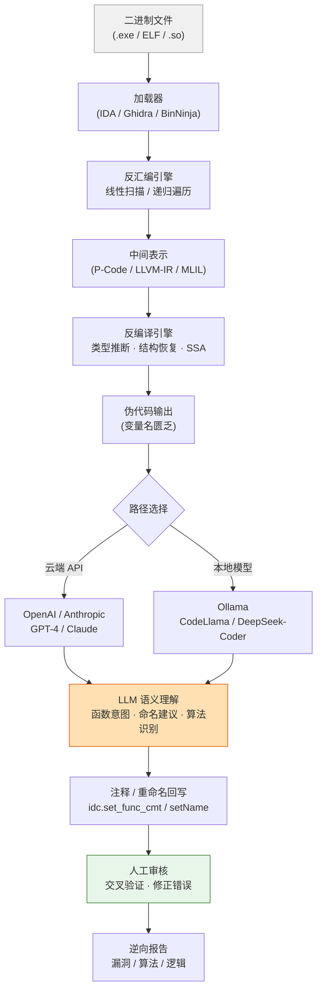

# 反编译器（15）· AI辅助逆向与反编译器实战综合

## 概述与定位

> [!abstract] TL;DR
> AI 大语言模型（LLM）正在成为逆向工程师的第四件利器——与 IDA、Ghidra、angr 并列。它不替代反编译器，而是补足反编译器最薄弱的一环：把 `v1`/`sub_401000` 这样的匿名符号翻译成人类可读的语义。本章是本系列终章，以"AI辅助逆向"为主轴，串联前14章的所有核心工具，给出从零到出flag的完整七步实战流程，并提供工具选型决策表。

### 为什么 AI 在这个时间节点爆发

反编译器的核心工作——将机器码还原为伪代码——在工程层面已相当成熟（详见 [[07.Hex-Rays反编译器内部机制]] 与 [[08.Ghidra反编译器与P-Code分析]]）。然而成熟的伪代码仍有两个顽固缺陷：

1. **命名贫乏**：编译器去掉了所有调试符号，变量名只剩 `v1`/`v2`/`a1`，函数名只剩 `sub_XXXXXXXX`。人工逐一重命名费时费力。
2. **语义不透明**：即使伪代码结构正确，数十行循环嵌套的语义意图仍需分析师反复阅读才能归纳出"这是在做 RC4 密钥扩展"。

2023—2025 年，GPT-4/Claude/CodeLlama 等 LLM 在代码理解任务上的能力突破了工程应用门槛，诞生了一批 **AI 辅助逆向插件**：
- IDA 侧：**Gepetto**（开源）、**WPeChatGPT**、**idat.ai**
- Ghidra 侧：**GhidrAssist**、**Ghidra-ChatGPT**
- Binary Ninja 侧：**BinAssist**、官方 Sidekick

这些工具统一思路：**抓取反编译伪代码 → 发送 LLM → 将响应注入注释/重命名**。

> [!tip] 本章定位
> 本章不重复前14章的原理，而是站在**实战整合**视角：如何把 AI 工具嵌入逆向流程，如何在保密场景下用本地模型，以及 CTF 二进制题完整七步实战演示。

---

## 原理与机制

### AI 辅助逆向的数据流

从信息流角度看，AI 辅助逆向在反编译管线的最末端注入了一个额外的语义理解层：



### 核心机制：从伪代码到语义

LLM 处理逆向任务时依赖以下知识：

1. **模式匹配**：训练数据中包含大量开源代码，LLM 见过 RC4/AES/MD5 的各种实现，能从伪代码特征（如固定常量 `0x61C88647`、S-Box 形状）识别算法族。
2. **代码推理**：现代 LLM 可以追踪数据流——"这个变量从参数传入，经过异或循环，最后和固定数组比较，这是在验证密钥"。
3. **命名生成**：基于函数行为建议描述性名字，例如把 `sub_401A20(a1, a2, 16)` 重命名为 `aes_cbc_encrypt_128`。

### 局限性（不可忽视）

> [!warning] AI 幻觉风险
> LLM 可能自信地给出**错误的算法识别或函数解释**，尤其当代码是高度混淆（见 [[09.反混淆技术与对抗]]）或自定义算法时。AI 输出必须视为"初步假设"，须经人工交叉验证。

- 上下文长度限制：复杂函数超过 4K token 时需要截断
- 无法访问内存运行时状态（静态局限）
- 对深度混淆/虚拟机保护代码效果有限

---

## 结构/算法/伪代码详解

### IDA Pro + LLM 集成：Gepetto 插件

**Gepetto**（作者：JusticeRage）是目前最成熟的 IDA 开源 AI 插件。

**安装流程：**
```bash
pip install gepetto
# 将 gepetto.py 复制到 IDA plugins 目录
# Windows: %APPDATA%\Hex-Rays\IDA Pro\plugins\
# Linux: ~/.ida/plugins/
```

**配置：**
```ini
# gepetto.cfg（与 gepetto.py 同目录）
[OPENAI]
api_key = YOUR_OPENAI_API_KEY
model = gpt-4-turbo
```

Gepetto 运行时，在 IDA 的 Functions 窗口或 Pseudocode 视图中右键，出现 `Ask ChatGPT to explain this function` 和 `Ask ChatGPT to rename variables` 两个菜单项。

**等价自写 IDAPython 脚本（完整可运行版）：**

以下脚本实现与 Gepetto 相同的核心功能，适合深度定制：

```python
"""
ida_llm_assist.py
IDAPython 脚本：抓取当前函数伪代码 → 发送 OpenAI API → 打印分析结果并写入注释
运行方式：IDA 菜单 File → Script file → 选择本脚本
"""
import ida_hexrays
import ida_kernwin
import idc
import idaapi

try:
    import openai
except ImportError:
    print("[ERROR] 请先 pip install openai")
    raise

# ──────────────────────────── 配置区 ────────────────────────────
OPENAI_API_KEY  = "sk-YOUR_KEY_HERE"   # 或从环境变量读取
MODEL           = "gpt-4-turbo"
MAX_TOKENS      = 1500
TEMPERATURE     = 0.2
WRITE_COMMENT   = True      # True = 自动将 AI 解释写入 plate comment
MAX_CODE_CHARS  = 8000      # 截断保护：避免超出 token 限制
# ────────────────────────────────────────────────────────────────

openai.api_key = OPENAI_API_KEY

SYSTEM_PROMPT = """You are an expert reverse engineer analyzing decompiled C code from IDA Pro.
Your task:
1. Briefly explain what this function does (2-3 sentences)
2. Suggest a descriptive snake_case function name
3. List the key operations and any recognizable algorithms
4. Note any security concerns (buffer overflows, format strings, etc.)
Reply in JSON format: {"explanation": "...", "suggested_name": "...", "operations": [...], "security": "..."}"""

def explain_function_at(ea: int) -> None:
    """反编译 ea 处函数并请求 LLM 分析"""
    # 1. 反编译
    try:
        cfunc = ida_hexrays.decompile(ea)
    except ida_hexrays.DecompilationFailure as exc:
        print(f"[WARN] 反编译失败：{exc}")
        return
    if cfunc is None:
        print("[WARN] decompile() 返回 None，可能不是代码区")
        return

    pseudocode = str(cfunc)
    if len(pseudocode) > MAX_CODE_CHARS:
        pseudocode = pseudocode[:MAX_CODE_CHARS] + "\n// ... [truncated] ..."
        print(f"[INFO] 伪代码已截断至 {MAX_CODE_CHARS} 字符")

    func_name = idc.get_func_name(ea)
    print(f"\n[LLM] 正在分析函数 {func_name} (0x{ea:X}) ...")

    # 2. 调用 OpenAI API
    try:
        client = openai.OpenAI(api_key=OPENAI_API_KEY)
        response = client.chat.completions.create(
            model=MODEL,
            messages=[
                {"role": "system", "content": SYSTEM_PROMPT},
                {"role": "user",   "content": f"```c\n{pseudocode}\n```"}
            ],
            temperature=TEMPERATURE,
            max_tokens=MAX_TOKENS,
            response_format={"type": "json_object"},
        )
        result_json = response.choices[0].message.content
    except openai.AuthenticationError:
        print("[ERROR] API Key 无效")
        return
    except openai.RateLimitError:
        print("[ERROR] 超出速率限制，稍后重试")
        return

    # 3. 解析并输出
    import json
    try:
        data = json.loads(result_json)
    except json.JSONDecodeError:
        print(f"[WARN] JSON 解析失败，原始输出：\n{result_json}")
        return

    print(f"\n{'='*60}")
    print(f"函数：{func_name}")
    print(f"建议命名：{data.get('suggested_name', 'N/A')}")
    print(f"功能说明：{data.get('explanation', 'N/A')}")
    print(f"关键操作：{', '.join(data.get('operations', []))}")
    sec = data.get('security', '')
    if sec and sec.lower() not in ('none', 'n/a', ''):
        print(f"[!] 安全关注：{sec}")
    print('='*60)

    # 4. 可选：写入 plate comment
    if WRITE_COMMENT:
        comment = (
            f"[AI Analysis]\n"
            f"Name: {data.get('suggested_name','?')}\n"
            f"{data.get('explanation','')}\n"
            f"Ops: {', '.join(data.get('operations',[]))}"
        )
        idc.set_func_cmt(ea, comment[:2000], 0)
        print("[INFO] 注释已写入 IDA 数据库")


# 入口：分析当前光标处函数
if __name__ == "__main__" or True:
    ea = ida_kernwin.get_screen_ea()
    explain_function_at(ea)
```

### WPeChatGPT 插件

WPeChatGPT 是 Gepetto 的竞品，核心差异：
- 支持 **Azure OpenAI** 端点（企业合规场景）
- 支持 **多轮对话**：可在同一函数上继续追问
- UI 更完整（独立侧边栏而非控制台输出）

配置方式与 Gepetto 类似，将 `api_base` 改为 Azure 端点即可：
```python
openai.api_base = "https://YOUR-RESOURCE.openai.azure.com/"
openai.api_type = "azure"
openai.api_version = "2024-02-01"
```

### Ghidra + AI 集成：GhidrAssist

**GhidrAssist**（Gepetto 的 Ghidra 对应物）通过 Ghidra 的 `DecompInterface` 获取伪代码：

```java
// GhidrAssist 核心调用（Java，简化版）
DecompInterface ifc = new DecompInterface();
ifc.openProgram(currentProgram);
DecompileResults results = ifc.decompileFunction(func, 60, monitor);
ClangTokenGroup tokens = results.getCCodeMarkup();
// 将 tokens 序列化为字符串 → 发送 HTTP 请求 → 接收 LLM 响应
// → 调用 func.setName() / func.setComment()
```

**等价 Ghidra Python 脚本（PyGhidra 兼容）：**

```python
"""
ghidra_ai_comment.py
Ghidra Script Runner 脚本：为所有未命名函数自动生成 AI 注释
使用：Window → Script Manager → 运行本脚本
本地 Ollama 模式（不联网，适合商业代码分析）
"""
import requests
import json

# ──────────────── 配置区 ────────────────
OLLAMA_URL   = "http://localhost:11434/api/generate"
OLLAMA_MODEL = "codellama:13b-instruct"
MAX_CODE_LEN = 6000
# ────────────────────────────────────────

def call_ollama(code: str) -> str:
    """调用本地 Ollama API"""
    prompt = (
        "You are a reverse engineering expert. "
        "Analyze the following decompiled C function and provide:\n"
        "1. One-sentence summary of what it does\n"
        "2. Suggested function name (snake_case)\n"
        "3. Any notable algorithms or security issues\n\n"
        f"```c\n{code[:MAX_CODE_LEN]}\n```\n\n"
        "Reply concisely."
    )
    try:
        resp = requests.post(OLLAMA_URL, json={
            "model":  OLLAMA_MODEL,
            "prompt": prompt,
            "stream": False,
            "options": {"temperature": 0.1, "num_predict": 512}
        }, timeout=120)
        resp.raise_for_status()
        return resp.json().get("response", "").strip()
    except requests.exceptions.ConnectionError:
        return "[ERROR] 无法连接 Ollama，请确认服务已启动（ollama serve）"
    except Exception as exc:
        return f"[ERROR] {exc}"


def is_unnamed(func_name: str) -> bool:
    """判断是否为自动生成的匿名函数名"""
    return func_name.startswith("FUN_") or func_name.startswith("thunk_FUN_")


# ──────────── Ghidra Script 入口 ────────────
# （以下代码在 Ghidra Script Runner 中直接可用）
fm       = currentProgram.getFunctionManager()
ifc      = ghidra.app.decompiler.DecompInterface()
ifc.openProgram(currentProgram)

funcs    = list(fm.getFunctions(True))
unnamed  = [f for f in funcs if is_unnamed(f.getName())]
print(f"[INFO] 共 {len(funcs)} 个函数，其中 {len(unnamed)} 个未命名")

for i, func in enumerate(unnamed[:20]):   # 限制首次运行最多处理 20 个
    ea      = func.getEntryPoint()
    results = ifc.decompileFunction(func, 60, monitor)
    if not results.decompileCompleted():
        print(f"[SKIP] {func.getName()} @ {ea} 反编译失败")
        continue

    code        = results.getDecompiledFunction().getC()
    explanation = call_ollama(code)

    # 写入 Plate Comment（函数头部注释块）
    listing = currentProgram.getListing()
    listing.setComment(ea,
        ghidra.program.model.listing.CodeUnit.PLATE_COMMENT,
        f"[AI] {explanation}")

    print(f"[{i+1}/{len(unnamed[:20])}] {func.getName()} → 注释已写入")

print("[DONE] AI 注释写入完毕")
```

### 本地模型：Ollama + CodeLlama（隐私保护模式）

当逆向对象为**商业软件、机密固件或受 NDA 约束的代码**时，将伪代码上传云端 API 存在法律风险。本地模型是必要选择。

**环境搭建：**

```bash
# 1. 安装 Ollama（Linux/macOS/Windows WSL2）
curl -fsSL https://ollama.ai/install.sh | sh

# Windows 原生：从 https://ollama.ai/download 下载安装包

# 2. 拉取模型（选一）
ollama pull codellama:7b-instruct     # 4GB RAM，速度快，适合快速注释
ollama pull codellama:13b-instruct    # 8GB RAM，理解力更强
ollama pull deepseek-coder:6.7b       # 替代选项，中文更友好

# 3. 启动服务（默认监听 localhost:11434）
ollama serve

# 4. 命令行快速测试
curl http://localhost:11434/api/generate -d '{
  "model": "codellama:7b-instruct",
  "prompt": "What does this function do?\n```c\nvoid func(char* dst, char* src) { strcpy(dst, src); }\n```",
  "stream": false
}'
```

**性能对比（RTX 3060 / 12GB VRAM 实测）：**

| 模型 | RAM/VRAM | 单函数响应时间 | 算法识别准确率（非正式） |
|------|----------|-------------|------------------------|
| codellama:7b | 6GB | ~3s | 约 70% |
| codellama:13b | 10GB | ~8s | 约 80% |
| deepseek-coder:6.7b | 6GB | ~4s | 约 75% |
| GPT-4 (API) | — | ~5s (网络) | ~90% |

> [!info] 选型建议
> 日常 CTF 用 `codellama:7b-instruct` 即可；分析闭源商业软件或固件时，用 `codellama:13b` 或 `deepseek-coder:33b`（需 24GB VRAM）以保证准确率。

---

## 工具视角/实战

### 综合实战：CTF 二进制逆向七步全流程

以一个典型 CTF 逆向题（`crackme`，Linux ELF，x86-64，带简单加密校验）为例，整合本系列全部工具链。

#### Step 1：初始侦察

```bash
# 文件类型 + 基本信息
file crackme
# crackme: ELF 64-bit LSB executable, x86-64, dynamically linked

# 安全特性检查
checksec --file=crackme
# RELRO: Partial  Stack: No canary  NX: enabled  PIE: disabled

# 字符串侦察
strings crackme | grep -iE "flag|correct|wrong|key|pass"
# Wrong password!
# Correct! Flag is: CTF{%s}

# 快速汇编概览（线性扫描，参见 [[01.反汇编算法：线性扫描与递归遍历]]）
objdump -d crackme | grep -A3 "call.*plt"
```

> [!tip] 侦察目的
> 找到"出口字符串"（`Correct`/`Wrong`），用交叉引用快速定位核心校验逻辑——避免从 `main` 开始漫无目的地阅读代码。

#### Step 2：IDA 载入与自动分析

```python
# IDA 自动化脚本（批处理模式启动后等待分析完成）
import idc, idaapi

idaapi.auto_wait()   # 等待 IDA 自动分析完成

# 搜索 "Wrong" 字符串的地址
for s in idautils.Strings():
    if "Wrong" in str(s):
        print(f"字符串地址: 0x{s.ea:X}")
        for ref in idautils.CodeRefsTo(s.ea, False):
            print(f"  引用自: 0x{ref:X}  函数: {idc.get_func_name(ref)}")
```

F5 反编译 `check_password` 函数后，初始伪代码大致如下（变量名为 IDA 自动生成）：

```c
// 初始反编译输出（变量名贫乏）
int __fastcall sub_401200(char *a1)
{
    int v1;
    unsigned int v2;
    char v3[32];

    v2 = strlen(a1);
    if ( v2 != 16 )
        return 0;
    v1 = 0;
    while ( v1 < 16 )
    {
        v3[v1] = a1[v1] ^ byte_404020[v1 % 8];
        ++v1;
    }
    return memcmp(v3, byte_404040, 16) == 0;
}
```

#### Step 3：AI 辅助语义理解

将上面的伪代码发送给 LLM（使用 Step "结构详解" 中的 `ida_llm_assist.py`），得到：

```
建议命名：xor_key_validate_password
功能说明：该函数验证输入密码长度为16字节，对其进行XOR变换（使用8字节循环密钥），
         将结果与固定字节数组比较，返回是否匹配。
关键操作：strlen校验, XOR流加密（密钥周期=8）, memcmp比较
安全关注：XOR流加密可逆，攻击者可直接从 byte_404040 和 byte_404020 推导明文密码
```

AI 输出后立即得知：这是一个**已知密文 + 已知密钥的 XOR**，可直接逆算：

```python
# 逆算脚本（IDA Python）
import idc

key    = bytes(idc.get_bytes(0x404020, 8))
cipher = bytes(idc.get_bytes(0x404040, 16))
plain  = bytes(c ^ key[i % 8] for i, c in enumerate(cipher))
print(f"Flag: CTF{{{plain.decode()}}}")
```

#### Step 4：算法识别（加密场景）

若 Step 3 识别出算法非 XOR 而是 AES，需要更细致的特征匹配：

```python
# IDA Python：搜索 AES S-Box 特征常量
AES_SBOX_FIRST4 = bytes([0x63, 0x7c, 0x77, 0x7b])

seg = idaapi.getseg(here())
start = seg.start_ea
end   = seg.end_ea

addr = start
while addr < end:
    if idc.get_bytes(addr, 4) == AES_SBOX_FIRST4:
        print(f"疑似 AES S-Box @ 0x{addr:X}")
    addr += 1
```

其他算法特征常量：
- **MD5**：`0x67452301, 0xEFCDAB89, 0x98BADCFE, 0x10325476`
- **RC4**：S 数组初始化循环（256 次 swap）
- **TEA/XTEA**：固定 Delta `0x9E3779B9`（黄金比例倒数）

#### Step 5：符号执行（复杂约束求解）

当手动逆算困难时，引入 angr（详见 [[11.符号执行与angr框架]]）：

```python
"""
solve_crackme.py
用 angr 符号执行求解 crackme 的正确密码
"""
import angr
import claripy

BINARY      = "./crackme"
FIND_ADDR   = 0x401300   # "Correct" 分支地址（来自 IDA 分析）
AVOID_ADDR  = 0x401280   # "Wrong" 分支地址

proj    = angr.Project(BINARY, auto_load_libs=False)

# 构造符号输入：16 字节未知密码
password = claripy.BVS("password", 8 * 16)
state    = proj.factory.full_init_state(
    args=[BINARY],
    stdin=claripy.Concat(password, claripy.BVV(b"\n"))
)

# 约束：密码为可打印 ASCII
for byte in password.chop(8):
    state.solver.add(byte >= 0x20)
    state.solver.add(byte <= 0x7e)

simgr = proj.factory.simulation_manager(state)
simgr.explore(find=FIND_ADDR, avoid=AVOID_ADDR)

if simgr.found:
    sol = simgr.found[0]
    result = sol.solver.eval(password, cast_to=bytes)
    print(f"[+] 找到密码：{result}")
else:
    print("[-] 未找到满足条件的路径")
```

#### Step 6：Patch 验证

```python
"""
patch_crackme.py
IDA Python 脚本：patch 掉校验跳转，使程序无论输入什么都走 Correct 分支
注意：此方法仅用于 CTF 验证，不能提取真正密码
"""
import idc, idaapi

# 场景：0x401260 处有 jne 0x401280（wrong分支）
# 将 jne 改为 nop + nop（或改为 jmp）
PATCH_ADDR = 0x401260

# 读取原始字节（备份）
orig = bytes(idc.get_bytes(PATCH_ADDR, 6))
print(f"原始字节：{orig.hex()}")

# 写入 NOP（0x90 * 6，覆盖 jne rel32）
for i in range(6):
    idc.patch_byte(PATCH_ADDR + i, 0x90)

print("[+] Patch 完成，重新运行程序验证")

# 验证：用 IDA Debugger 运行，观察是否走向 Correct 分支
# 或导出 patched binary：Edit → Patch Program → Apply Patches to Input File
```

#### Step 7：总结报告

> [!example] CTF 逆向报告模板
> **题目**：crackme_v1
> **保护**：NX，无 PIE，无 canary
> **核心逻辑**：16 字节输入经 XOR（8 字节循环密钥，位于 `0x404020`）与密文（位于 `0x404040`）比较
> **求解方法**：直接逆算 XOR（O(1) 复杂度），无需符号执行
> **Flag**：`CTF{r3v3rs3_xor_e4sy}`
> **工具链**：`file`/`checksec` → IDA F5 → Gepetto AI 分析 → 逆算脚本

### 反编译器选择指南

| 场景 | 推荐工具 | 核心理由 |
|------|----------|----------|
| 最高质量伪代码 | IDA Pro + Hex-Rays | 业界标杆，类型推断/结构恢复最优（详见 [[07.Hex-Rays反编译器内部机制]]） |
| 开源/免费/多人协作 | Ghidra | 开源可定制，Team Server 支持多人同时分析，P-Code 便于扩展 |
| 脚本化/自动化流程 | Binary Ninja | Python API 最友好，Workflow 体系，适合大批量分析 |
| 符号执行/漏洞挖掘 | angr | 专为符号执行设计，内置约束求解，详见 [[11.符号执行与angr框架]] |
| 快速命令行/管道 | radare2 / rizin | 轻量，grep 友好，适合 CI 管道中的自动化检测 |
| AI 注释（云端） | IDA + Gepetto / WPeChatGPT | 质量高，接近 GPT-4 水平，但代码上传云端 |
| AI 注释（本地） | Ghidra + Ollama 脚本 | 保密性强，适合商业代码/固件，但准确率略低 |
| Android 逆向 | jadx + frida | APK 反编译首选，详见相关系列 |

---

## 安全性与正确使用

### 法律与伦理边界

> [!warning] 重要声明
> 本系列所有技术均用于**合法目的**：安全研究、漏洞挖掘（授权范围内）、CTF 竞赛、兼容性分析（如 DMCA §1201(f) 例外条款）、恶意软件分析。**对他人系统进行未授权逆向工程可能违反 CFAA（美国）/刑法第 285 条（中国）等法律**。

### AI 工具使用的安全注意事项

**代码隐私风险：**
- 使用 OpenAI API 时，发送的伪代码会经过 OpenAI 服务器。对于商业软件、NDA 覆盖的代码，**必须使用本地模型**（Ollama 方案）
- 即使是"匿名"伪代码，若包含独特的算法结构，理论上可被识别

**AI 输出验证流程：**
1. 将 AI 识别的算法（如"这是 AES-CBC"）与 [[05.中间表示IR设计：LLVM-IR与VEX与P-Code]] 中介绍的常量特征进行交叉核对
2. 对 AI 建议的函数名进行语义一致性验证（追踪调用者/被调用者语境）
3. 安全漏洞结论（如"存在缓冲区溢出"）**必须手动确认**，不能仅凭 AI 输出

**提示词工程建议：**
```
# 好的提示词结构（减少幻觉）
"Analyze this decompiled code. If you are NOT confident about something, 
say 'uncertain'. Do NOT fabricate algorithm names. 
Only claim an algorithm match if you see at least 2 distinguishing features."
```

### 反检测与对抗

商业保护系统（如 VMProtect、Themida）会识别并破坏 AI 分析的前提条件（详见 [[09.反混淆技术与对抗]]）：
- 指令变形使 LLM 无法识别标准算法模式
- 代码膨胀使单函数超出 LLM 上下文窗口
- 虚拟机保护让"伪代码"变成虚拟指令调度循环，语义完全不透明

在这种情况下，AI 辅助效果有限，需要先执行反混淆（动态解包、符号执行化简），再喂给 LLM。

---

## 小结

本章从 AI 辅助逆向的核心原理出发，完整覆盖了以下内容：

1. **工具链全景**：Gepetto（IDA）、GhidrAssist（Ghidra）、本地 Ollama 三条路径各有适用场景
2. **完整 Python 代码**：`ida_llm_assist.py` 和 `ghidra_ai_comment.py` 均为可直接运行的脚本
3. **本地模型方案**：Ollama + CodeLlama 提供零数据泄露的 AI 辅助，保护商业代码隐私
4. **CTF 七步全流程**：从 `file`/`checksec` 初始侦察，到 IDA F5，到 AI 语义分析，到算法特征匹配，到 angr 符号执行，到 patch 验证，到最终报告
5. **工具选型表**：7 种场景对应 7 种推荐工具组合

**AI 辅助逆向的本质**：LLM 不是万能的神谕，而是一个**有偏见、会幻觉、需要验证的初级分析员**。它的价值在于把"命名/注释"这两件最耗时间却最机械的工作从分析师肩上卸下，让人专注于真正需要创造力的部分——算法发现、漏洞挖掘、利用链构造。

> [!quote] 系列终章寄语
> 反汇编算法、CFG、SSA、类型推断、Hex-Rays、P-Code、符号执行、混淆对抗……这十五章的每一块积木，在真实的逆向工程中都会被用到。工具在进化，AI 在介入，但核心始终不变：**理解机器语言是如何映射到人类意图的**。这种能力，是任何 LLM 都无法完全替代的。

---

## 相关阅读

- [[01.反汇编算法：线性扫描与递归遍历]] — 本系列起点，理解反汇编的基础两种策略
- [[07.Hex-Rays反编译器内部机制]] — IDA 核心反编译引擎深度解析
- [[08.Ghidra反编译器与P-Code分析]] — Ghidra P-Code 体系与 Sleigh 语言
- [[09.反混淆技术与对抗]] — AI 辅助在混淆代码上的局限性背景
- [[11.符号执行与angr框架]] — Step 5 中 angr 脚本的理论基础
- [[14.Ghidra脚本与插件开发]] — Ghidra 侧 AI 脚本的开发环境搭建
- [[33.二进制漏洞与利用基础/00.二进制漏洞与利用基础总览]] — AI 识别漏洞后的下一步：利用链构造

---

⬅️ 上一篇 [[14.Ghidra脚本与插件开发]] ｜ 🏠 [[00.反编译器与反汇编引擎原理总览]]
