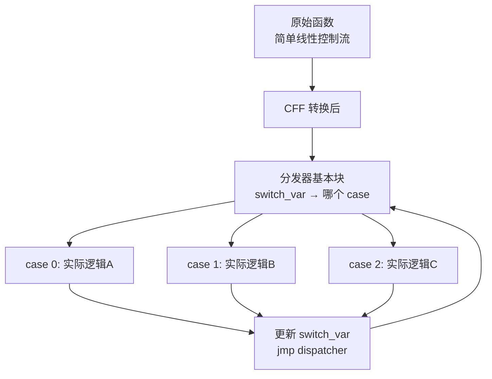
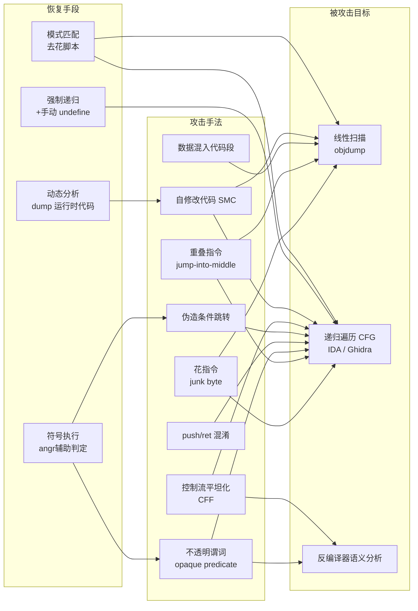

---
tags:
  - 反编译器
  - 反汇编
  - tier3
  - 反混淆
  - 对抗
---
# 反汇编对抗技术与工具检测

> [!abstract] TL;DR
> 反汇编对抗（anti-disassembly）是保护者有意破坏静态反汇编器解析逻辑的一族技术，核心利用了线性扫描无法区分代码与数据、递归遍历依赖静态目标解析两大弱点。主要手段涵盖花指令、不透明谓词、重叠指令、push/ret 伪调用、jmp-into-middle、数据混入代码段、伪造条件跳转、控制流平坦化以及自修改代码（SMC）。IDA Pro 和 Ghidra 均会被上述手法欺骗，分析师须掌握强制递归分析、模式匹配去花、符号执行辅助、动态验证四种恢复路径，才能在恶意软件、壳程序和商业保护场景下还原真实控制流。

## 概述与定位

反汇编是一切静态逆向工程的起点。第 01 章已经完整阐述了线性扫描（linear sweep）和递归遍历（recursive traversal）两种算法的实现逻辑，本章则站在攻防对立面：假设你是一个分析师，面对的二进制已经被有意设计成让反汇编器产生错误输出，你该如何识别欺骗手法，以及如何逐步恢复真实代码。

从产业分工来看，反汇编对抗技术出现在以下场景：

1. **恶意软件作者**：希望拖慢分析师的静态分析效率，让自动化沙箱难以提取 CFG 特征。
2. **壳程序（packer/protector）**：Themida、VMProtect、Obsidium、ASProtect 均在解包 stub 中大量使用花指令和自修改代码。
3. **商业软件版权保护**：某些 DRM 软件在授权校验逻辑附近插入对抗指令，增加 cracker 的分析成本。
4. **CTF 逆向题目**：竞赛出题人常用花指令、跳转到指令中部等手法作为考点，是竞技逆向的高频出题方向。

区分反汇编对抗与第 09 章所讲的反混淆（anti-obfuscation）非常重要：

| 维度 | 反混淆（09 章） | 反汇编对抗（本章） |
|---|---|---|
| 作用层次 | 破坏语义理解（如控制流平坦化、不透明谓词影响数据流分析） | 破坏静态解析本身（让工具看不到正确指令边界） |
| 主要攻击目标 | 反编译器的类型推断、SSA 化简、CFG 重建 | 反汇编器的指令解码器、CFG builder、线性扫描 |
| 典型手段 | OLLVM、MBA、指令替换、控制流平坦化 | 花指令、跳转到中部、自修改代码 |
| 检测难度 | 需要语义级分析 | 部分可通过模式匹配检测 |

两者的交集在于：控制流平坦化和不透明谓词既影响反汇编器的 CFG 构建，也影响反编译器的语义理解，因此本章对这两种手法也会从反汇编视角重新审视。

---

## 原理与机制

### 线性扫描的固有弱点

线性扫描算法（`objdump -d`、早期的 ndisasm）从代码段起始地址顺序解码字节流，每成功解码一条指令就推进程序计数器，直到段末。这种方式的根本假设是：**代码段中所有字节都是指令**。

攻击者只需在代码流中插入一个非指令字节（垃圾字节，junk byte），线性扫描就会从该字节开始解码，产生错误的指令序列。更严重的是，x86 的可变长度指令编码使得一旦偏差，后续解码结果会与真实指令完全不重叠，形成级联错误（cascading decode error）。

**关键漏洞**：线性扫描无法区分代码和数据——任何嵌入代码段的字节都会被当作指令解码。

### 递归遍历的固有弱点

递归遍历（IDA Pro、Ghidra、Binary Ninja 的默认模式）从已知入口点出发，跟踪控制流边，只反汇编可达路径上的字节。相比线性扫描，它天然跳过不可达数据，但暴露了另一个弱点：**必须能静态解析跳转目标**。

对于无条件直接跳转（`jmp 0x401234`），工具可以直接加入队列。但一旦跳转目标是动态计算的（如 `jmp [eax+0x18]`、`jmp eax`、`call [ebp-4]`），工具只能放弃跟踪或猜测，导致控制流图（CFG）出现缺口。

攻击者可以利用这个弱点制造"虚假的不可达代码"，把真实代码藏在工具认为不可达的位置。

### x86 变长编码对对抗技术的放大效应

ARM 等定长指令集（每条指令固定 4 字节）对大多数反汇编对抗技术有天然免疫力——即使跳转到"中间"，也只能落在 4 字节对齐边界，不存在 x86 的"跳到指令第 2 字节"。

x86/x86-64 的指令长度从 1 到 15 字节不等，前缀字节（`REX`、`0x66`、`0x67`）可自由叠加，这使得反汇编对抗技术几乎都只在 x86 上有效。ARM 上的反汇编对抗主要依赖 Thumb/Thumb-2 模式切换（A32 与 T32 的切换点仅靠跳转目标的最低位区分）以及自修改代码，技术手法相对有限。

---

## 结构/算法/伪代码详解

### 花指令（Junk Byte / Dead Code Insertion）

花指令是最基础的反汇编对抗技术，本质是在真实指令序列中插入永远不会执行的垃圾字节，让线性扫描产生错误边界。

**经典变体 1：无条件跳转后插入垃圾字节**

```asm
; 真实代码流
    jmp  short label_real        ; EB 01 — 跳过 1 个字节
    db   0xE8                    ; 垃圾字节，jmp 跳过不执行
label_real:
    mov  eax, 1                  ; 真实指令
```

线性扫描会尝试从 `0xE8` 开始解码，把它当作 `call` 指令的第一个字节，读后续 4 字节作为偏移，产生完全错误的伪指令序列。递归遍历则因为 `jmp` 目标明确，会正确跳到 `label_real`，但在 `0xE8` 处可能留下"数据"标记或产生重叠分析。

**经典变体 2：条件跳转总成立的花指令（基于恒真谓词）**

```asm
    xor  eax, eax                ; eax = 0，ZF = 1
    jz   short label_real        ; 恒为真，跳转总发生
    db   0xFF, 0x15              ; 垃圾字节（CALL [mem] 的开头）
label_real:
    mov  ecx, [ebp+8]
```

工具若不能判断 `jz` 恒真（需要数据流分析），会对两条分支都尝试解码，在假分支产生错误指令序列，污染 CFG。

**经典变体 3：多层嵌套花指令**

```asm
    jmp  short L1               ; EB 03
    db   0xE8, 0x00, 0x00       ; 3 字节垃圾
L1:
    jmp  short L2               ; EB 03
    db   0xE8, 0x00, 0x00       ; 3 字节垃圾
L2:
    ; 真实代码
```

多层嵌套使手动 patch 工作量倍增，自动化检测器必须处理任意深度。

**检测花指令的模式匹配逻辑（伪代码）**

```python
def detect_junk_after_unconditional_jump(insns):
    """
    insns: 线性扫描或反汇编器输出的指令列表
    返回: 疑似花指令的地址集合
    """
    junk_candidates = set()
    for i, insn in enumerate(insns):
        # 检测模式：无条件跳转 + 跳转目标在跳过的字节之后
        if insn.mnemonic in ('jmp', 'jz', 'jnz') and insn.is_short_jump():
            target = insn.jump_target()
            gap_start = insn.end_addr
            gap_end = target
            if gap_end > gap_start:
                # [gap_start, gap_end) 之间的字节是候选花指令
                for addr in range(gap_start, gap_end):
                    junk_candidates.add(addr)
    return junk_candidates
```

实际工具（如 IDA 的 `idc.del_items()` + `idc.create_insn()`）需要先 undefine 错误分析结果，再从正确起始地址重新分析。

---

### 不透明谓词（Opaque Predicate）

不透明谓词是一种条件表达式，其真值对构造者（保护者）已知，但对分析工具来说难以静态确定。

**数学构造**：
- `x*(x+1)` 恒为偶数，因此 `x*(x+1) & 1 == 0` 恒真
- `x^2 >= 0`（无符号语义下对整数恒真）
- 基于全局共享计数器的谓词：`global_counter % 2 == 0`（只有在特定运行状态下才为真）

**对反汇编的影响**：

不透明谓词本身不破坏指令边界，但与花指令结合后威力倍增：

```asm
; 构造不透明谓词：eax = 0，eax*(eax+1) & 1 = 0，恒真
    mov  eax, [ebp-4]          ; eax = 某局部变量（保护者确保此时为 0）
    imul eax, eax              ; eax = eax^2 >= 0
    test eax, 1                ; eax & 1 = 0，ZF = 1（恒真）
    jz   label_real            ; 恒真分支
    ; 假分支：插入垃圾字节或诱导工具走入错误路径
    db   0xE8, 0x12, 0x34, 0x56, 0x78
label_real:
    ; 真实代码
```

IDA 默认不执行约束传播，会对 `jz` 的两条边都分析，并在假分支上错误解码垃圾字节，将其标记为"可能的代码"加入 CFG。

**对工具欺骗的量化效果**：

对递归遍历工具，不透明谓词 + 花指令组合可以使一个函数的 CFG 节点数虚增 2～10 倍。在 Themida 保护样本中，分析人员常观察到 IDA 为一个实际只有 30 条指令的函数生成数百个伪基本块。

**符号执行辅助判定不透明谓词**：

```python
from angr import Project
from claripy import BVS

def check_opaque(binary, pred_addr, branch_type='jz'):
    """
    对 pred_addr 处的条件跳转，用符号执行判断是否为不透明谓词
    返回: ('always_true' | 'always_false' | 'conditional')
    """
    proj = Project(binary, auto_load_libs=False)
    state = proj.factory.blank_state(addr=pred_addr)
    simgr = proj.factory.simulation_manager(state)
    simgr.explore(n=10)  # 限制步数
    
    taken = len(simgr.active) > 0
    not_taken = len(simgr.deadended) > 0
    
    if taken and not not_taken:
        return 'always_true'
    elif not_taken and not taken:
        return 'always_false'
    else:
        return 'conditional'
```

---

### 重叠指令（Overlapping Instructions / Jump-into-Middle）

这是 x86 特有的最强力对抗手法之一。攻击者精心构造字节序列，使得：
- 从地址 A 解码得到指令序列 S1
- 从地址 A+k（k > 0）解码得到完全不同的指令序列 S2

运行时跳转到 A+k，实际执行 S2，但工具从 A 开始解码，输出 S1，完全错误。

**示意图**：

```
地址:   00  01  02  03  04  05  06  07
字节:   E8  01  00  00  00  B8  01  00

从 00 解码: CALL $+5 (call 到 00+5=05) — 5字节指令
从 05 解码: MOV eax, 1               — 5字节指令

若代码实际跳转到 01:
从 01 解码: ADD [eax], al (01 00)    — 2字节
从 03 解码: ADD [eax], al (00 B8)    — 错误...
```

**经典构造 `jmp $+2`（跳到下一条指令中间）**：

```asm
; 实际字节: EB 01 E8 B8 01 00 00 00
    jmp  short $+2           ; EB 01 — 跳过1个字节
    db   0xE8                ; 垃圾字节
    ; 从此处 (jmp之后+2) 开始才是真实代码
    mov  eax, 0x00000001     ; B8 01 00 00 00
```

工具从 `jmp` 之后顺序解码，把 `0xE8 B8 01 00 00 00` 解码为 `CALL 0x1B8`（一个错误的 CALL），完全掩盖了真实的 `MOV eax, 1`。

**`jmp` 到 `call` 指令中部（利用 E8 前缀）**：

```asm
    call some_func           ; E8 XX XX XX XX — 5字节
    ; 某跳转跳到 call 指令的第 2 个字节 (E8 之后 1 字节)
    ; 从 XX 开始解码会得到完全不同的指令序列
```

`CALL rel32` 的操作码 `0xE8` 加上 4 字节偏移，如果跳转目标是这 4 字节偏移的第一个字节，它本身可能是一条合法指令的开头（如 `0x90` NOP、`0x89` MOV 等）。

**检测重叠指令的方法**：

```python
def find_overlapping_instructions(disasm_output, binary_bytes):
    """
    检测疑似重叠指令：扫描所有跳转目标，
    判断目标地址是否落在某条已解码指令内部
    """
    decoded_ranges = {}  # addr -> (start, end)
    for insn in disasm_output:
        for b in range(insn.address, insn.address + insn.size):
            decoded_ranges[b] = insn
    
    overlaps = []
    for insn in disasm_output:
        if insn.is_jump() and not insn.is_indirect():
            target = insn.jump_target()
            if target in decoded_ranges:
                owning_insn = decoded_ranges[target]
                if owning_insn.address != target:
                    overlaps.append({
                        'jump_at': insn.address,
                        'target': target,
                        'overlaps_with': owning_insn.address
                    })
    return overlaps
```

---

### push/ret 混淆（伪 Call-Return）

`push/ret` 混淆通过将目标地址压栈后执行 `ret` 来模拟无条件跳转，同时欺骗工具的控制流分析。

```asm
    push 0x00401234          ; 将真实跳转目标压栈
    ret                      ; 弹出并跳转到 0x00401234
```

对工具的影响：
- **线性扫描**：在 `ret` 之后继续解码紧邻字节，完全丢失真实跳转目标。
- **递归遍历**：多数工具将 `ret` 视为函数返回，终止该分支的分析，不追踪真实目标。
- **IDA 的识别**：IDA 7.x 对某些简单的 `push imm / ret` 模式能识别为尾调用（tail call），但一旦 `push` 的立即数是通过计算得来（`push eax`，eax = 0x401234），静态分析就无能为力。

**变体：`call $+5 / pop reg` 利用 call 压返回地址的副作用**：

```asm
    call  $+5                ; 压入下一条指令地址 (此call的next_addr)，跳到 $+5
    ; 以上 call 到达的地址就是 pop 指令本身:
    pop   ebx                ; ebx = 之前 call 压入的地址
    add   ebx, 0x1A          ; 计算真实目标
    jmp   ebx                ; 跳转到动态计算目标
```

这个模式在 x86 shellcode 和 PIC（位置无关代码）中极为常见，可以在不知道加载地址的情况下获取当前 IP 值，同时彻底破坏工具的静态跳转目标解析。

---

### 数据混入代码段（Data-in-Code）

正常二进制将代码和数据分段存储，但攻击者可以把数据（跳转表、字符串、常量）内嵌到 `.text` 段，让工具在数据区域错误解码指令。

**典型场景：跳转表内嵌于代码段**

```asm
    ; switch 语句的跳转表
    jmp   dword ptr [eax*4 + table_start]
table_start:
    dd    case_0             ; 4字节地址，但工具可能把它解码为指令
    dd    case_1
    dd    case_2
case_0:
    ; ...
```

工具若无法推断 `eax` 的范围和 `table_start` 是数据，会把跳转表地址当成指令解码，产生垃圾伪指令覆盖真实的 `case_0` 前几条指令。

**IDA 对 `jmp [reg*4+table]` 的处理**：

IDA 的 `seg.hpp` 中有专门的跳转表识别逻辑（`create_insn` + `add_dref`），但这个逻辑依赖 `eax` 的值域分析，若保护者在跳转前故意增加 `eax` 的来源复杂度，IDA 就会放弃跳转表识别，将整个数据区误标为代码。

**Ghidra 的处理**：Ghidra 的 `TableSwitchAnalyzer` 在 `AnalysisMode.NORMAL` 下会对 `jmp [base+reg*scale]` 模式尝试枚举目标，但同样受限于值域分析的精度。

---

### 伪造条件跳转（Fake Conditional Branch）

这是不透明谓词与花指令的结合形式。攻击者构造一个运行时恒为真（或恒为假）的条件，使条件跳转的一条边在运行时永远不会被执行，但工具会分析两条边。

**核心区别于不透明谓词章节**：本处重点在于对**反汇编 CFG 形状**的破坏，而非语义分析的干扰。

```asm
; 恒真条件：利用数学恒等式
    push eax
    mov  eax, [esp]          ; eax = 栈顶值（不确定）
    imul eax, eax            ; eax = eax^2（符号位可能被设置）
    or   eax, 1              ; 强制 eax 为奇数，OF=0, ZF=0
    jno  label_real          ; 无溢出时跳（OF = 0，恒真）
    ; 假分支：垃圾字节序列
    db   0xCC, 0x00, 0x01, 0x02
label_real:
    pop  eax
    ; 真实代码
```

工具会构建一个有两条出边的基本块，其中一条指向垃圾字节区域。垃圾字节可能被解码为更多伪指令，形成假 CFG 节点，最终使函数的 CFG 膨胀。

---

### 控制流平坦化对反汇编的影响

控制流平坦化（CFF，Control Flow Flattening）主要以混淆语义著称（第 09 章），但它对反汇编工具同样构成特定挑战。

**对反汇编的具体影响**：



在 CFF 中，核心的分发跳转（`jmp [table + switch_var * 4]`）是通过间接跳转实现的。问题来自：
1. 若 `switch_var` 通过加密运算从状态机更新，工具无法静态枚举跳转目标。
2. 部分 CFF 实现（如 OLLVM 的 `bogus control flow`）在 case 块之间插入永远不执行的虚假路径，让 CFG 边数虚增。
3. 反汇编器不报错（指令边界都正确），但 CFG 形状与真实逻辑完全不对应，给后续的数据流分析和人工阅读造成极大障碍。

**CFF 与普通反汇编对抗的关键区别**：CFF 不破坏指令边界（工具仍能正确解码所有指令），破坏的是语义层的"哪些指令在语义上是相邻的"。因此 CFF 是**跨层**的对抗技术，同时需要反汇编层和反混淆层的对策。

---

### 自修改代码（Self-Modifying Code，SMC）

SMC 是指程序在运行时修改自身代码段，使得运行时实际执行的代码与磁盘上的字节完全不同。这对所有静态分析工具构成根本性挑战。

**SMC 的实现机制**：

```asm
; 初始化时，0x401100 处存放加密的代码
setup_smc:
    mov  esi, 0x401100       ; 加密代码起始地址
    mov  ecx, 0x50           ; 80 字节
    xor  edx, edx
decrypt_loop:
    xor  byte ptr [esi + edx], 0xAA   ; XOR 解密
    inc  edx
    cmp  edx, ecx
    jb   decrypt_loop
    ; 解密完成，跳到解密后的代码
    jmp  0x401100
```

工具静态分析时看到的 0x401100 处是加密字节，完全无法正确反汇编。运行时该位置才变为有效代码。

**SMC 的静态检测方法**：

静态分析无法直接"看到"解密后的代码，但可以识别 SMC 模式的特征：

1. **内存写入到可执行段**：扫描所有 `MOV [addr], reg`、`XCHG`、`STOSB/STOSW/STOSD` 指令，判断目标地址是否落在可执行 segment 内。
2. **XOR/ADD/ROL 循环作用于代码段**：检测对代码段地址范围的算术循环操作。
3. **`VirtualProtect` / `mprotect` 调用**：如果保护者调用 `VirtualProtect(addr, size, PAGE_EXECUTE_READWRITE, ...)` 后紧跟对该地址的写操作，强烈提示 SMC。

```python
# IDA Python: 检测对代码段的写引用
import idaapi, idc, idautils

def find_smc_patterns():
    text_seg = idaapi.get_segm_by_name('.text')
    if not text_seg:
        return
    
    smc_candidates = []
    for func_addr in idautils.Functions():
        for insn_addr in idautils.FuncItems(func_addr):
            insn = idautils.DecodeInstruction(insn_addr)
            if insn is None:
                continue
            # 检查是否有写内存操作
            for op in insn.ops:
                if op.type in (idaapi.o_mem, idaapi.o_phrase, idaapi.o_displ):
                    # 尝试解析写目标地址
                    write_target = idc.get_operand_value(insn_addr, op.n)
                    if text_seg.start_ea <= write_target < text_seg.end_ea:
                        smc_candidates.append((insn_addr, write_target))
    
    return smc_candidates
```

**SMC 的动态确认**：真正理解 SMC 解密后的代码只能通过动态分析（调试器在写操作后下硬件断点，或直接 dump 运行时内存），这是静态分析无法替代的场景。

---

### 下一级攻防 Mermaid 全局视图



---

## 工具视角与实战

### IDA Pro 如何被欺骗与如何纠正

**IDA 的自动分析缺陷**：

IDA 的核心反汇编引擎（`idp.hpp` 中的 `ana()` 函数，各架构独立实现）采用递归遍历，并辅以线性扫描作为补充（`auto_make_code()`）。IDA 会对"感觉像代码"的未分析区域尝试线性扫描填充，这在花指令场景下会产生大量错误分析。

**IDA 被花指令欺骗后的典型症状**：
1. 函数边界框（function frame）出现 `BLK`（block）断层，提示某些基本块无法被合并。
2. `disassembly` 视图中出现 `db` 数据定义夹杂在指令序列中间。
3. 函数的 xrefs 显示为 `DATA XREF` 而非 `CODE XREF`，说明某个真实代码地址被识别为数据。
4. `Strings` 窗口中出现位于代码段、长度极短的奇怪"字符串"——这通常是花指令字节的误识别。

**IDA 纠正步骤（手工去花流程）**：

```
1. 定位错误分析区域：
   - 使用 Edit > Other > Manual instruction 或快捷键 [Alt+G] 查看当前偏移
   - 通过 Xrefs 找到从真实代码跳入的目标地址

2. 清除错误分析：
   - 在错误起始地址按 [U] (undefine) 将该区域还原为原始字节
   - 如果是一大块区域，使用 IDAPython: idc.del_items(start, idc.DELIT_EXPAND, size)

3. 从正确地址重新分析：
   - 将光标移到正确的指令起始地址
   - 按 [C] 键（Create code）强制从此地址解码

4. 手动修正跳转目标（针对 push/ret 模式）：
   - 在 push 的立即数处定义交叉引用：
     idc.add_cref(push_addr, 0x401234, idc.fl_JN)
   - 这会引导 IDA 将 0x401234 加入分析队列
```

**IDA Python 自动化去花脚本**：

```python
import idc
import idautils
import idaapi

def remove_junk_after_unconditional_jumps(func_start, func_end):
    """
    在函数范围内，对所有 jmp/jz/jnz short 之后的字节
    检测是否为花指令（目标地址已在 jmp 目标之后）
    """
    ea = func_start
    patched = 0
    while ea < func_end:
        insn = idautils.DecodeInstruction(ea)
        if insn is None:
            ea += 1
            continue
        
        mnem = idc.print_insn_mnem(ea)
        if mnem in ('jmp', 'jz', 'jnz', 'je', 'jne'):
            target = idc.get_operand_value(ea, 0)
            next_ea = ea + insn.size
            
            # 检测 short jump 跳过少量字节的模式
            gap = target - next_ea
            if 0 < gap <= 8:
                # 将 [next_ea, target) 的字节 NOP 掉（或标记为数据）
                for byte_ea in range(next_ea, target):
                    idc.patch_byte(byte_ea, 0x90)  # NOP
                    patched += 1
        
        ea += insn.size
    
    print(f"[*] NOP'd {patched} junk bytes in function {hex(func_start)}")
    # 重新分析整个函数
    idaapi.auto_make_code(func_start)
    idc.create_func(func_start)
```

**注意**：NOP 填充会修改磁盘文件（如果接着保存），通常更安全的做法是只修改 IDA 数据库（`.idb`），不 patch 原始二进制。实际逆向中可以用 `idc.del_items()` + `idc.create_insn()` 代替 NOP。

---

### Ghidra 如何被欺骗与如何纠正

Ghidra 的 `Disassembler` 类（`ghidra.app.plugin.core.disassembler`）实现递归遍历，`Byte Viewer` 插件实现线性字节查看。Ghidra 的行为与 IDA 类似，但在某些对抗场景下有不同表现：

**Ghidra 特有的脆弱点**：
1. **P-Code 层的传播**：Ghidra 先从机器码生成原始 P-Code，如果机器码错误，P-Code 的污染会向上传播到反编译器输出，且错误形式与 IDA 不同，可能导致 Ghidra 和 IDA 在同一函数上产生不同的错误输出（因此建议双工具交叉验证）。
2. **自动函数定义算法**：Ghidra 的 `AggressiveInstructionFinder` 分析器（`Analysis > Aggressive Instruction Finder`）会更激进地将未分析字节解码为代码，在花指令密集区域产生更多错误代码定义。

**Ghidra 纠正步骤**：

```
1. 清除错误定义：
   右键 > Clear Code Bytes（清除错误指令）
   或通过 Listing 视图：光标定位 > [C] 清除

2. 手动标记花指令为数据：
   右键 > Data > byte（将垃圾字节定义为 db）

3. 从正确地址反汇编：
   光标到正确起始地址 > [D] Disassemble

4. 使用 Ghidra Script 批量处理：
```

```java
// GhidraScript: 检测并处理 jmp-into-middle 模式
import ghidra.app.script.GhidraScript;
import ghidra.program.model.listing.*;
import ghidra.program.model.address.*;

public class DetectOverlapScript extends GhidraScript {
    @Override
    public void run() throws Exception {
        Listing listing = currentProgram.getListing();
        InstructionIterator iter = listing.getInstructions(currentProgram.getMemory(), true);
        
        while (iter.hasNext() && !monitor.isCancelled()) {
            Instruction insn = iter.next();
            // 检查是否为跳转指令
            if (insn.getFlowType().isJump()) {
                Address[] flows = insn.getFlows();
                for (Address target : flows) {
                    Instruction targetInsn = listing.getInstructionContaining(target);
                    if (targetInsn != null && !targetInsn.getAddress().equals(target)) {
                        // 跳转目标在某条指令内部——重叠指令！
                        printf("OVERLAP: jmp at %s → %s (inside insn at %s)\n",
                            insn.getAddress(), target, targetInsn.getAddress());
                        // 清除并重新反汇编
                        clearListing(targetInsn.getAddress(), 
                                    targetInsn.getAddress().add(targetInsn.getLength()-1));
                        disassemble(target);
                    }
                }
            }
        }
    }
}
```

---

### 动态分析与静态分析的协作

在对抗手法最密集的场景（如 VMProtect 保护的二进制），单纯静态分析往往走不通，必须引入动态分析。

**动态分析的关键价值**：
1. **执行路径记录（trace）**：使用 Intel Pin、DynamoRIO 或 Frida 记录所有实际执行的指令地址，与静态 CFG 对比，找出"静态工具认为不可达但实际执行了"的代码。
2. **SMC 解密后的 dump**：在动态分析工具中设置对代码段的**写入断点**（WPM），当解密循环结束后立即 dump 内存，获取明文代码。
3. **push/ret 目标追踪**：通过 Frida 的 `Interceptor.attach()` 拦截每个 `ret` 指令，记录弹出的地址，构建动态调用图。

**Frida 脚本：追踪 push/ret 混淆**：

```javascript
// Frida script：在目标模块范围内拦截所有 ret 并记录跳转目标
const target_module = Process.getModuleByName("target.exe");
const base = target_module.base;
const size = target_module.size;

Interceptor.attach(ptr("0x" + (base.add(0x1000)).toString(16)), {
    // 这里需要更精确的插桩，用 Stalker API 更合适
});

// 更实用：使用 Stalker 跟踪执行流
Stalker.follow(Process.getCurrentThreadId(), {
    events: {
        call: false,
        ret: true,  // 拦截所有 ret
        exec: false
    },
    onReceive: function(events) {
        const reader = new StalkerRetIterator(events);
        for (const event of reader) {
            const ret_target = event.target;
            if (ret_target >= base && ret_target < base.add(size)) {
                console.log(`[RET] → ${ret_target}`);
            }
        }
    }
});
```

---

### 反汇编对抗强度横向对比

| 技术 | 静态检测难度 | 对 IDA 的欺骗效果 | 对 Ghidra 的欺骗效果 | 恢复成本 |
|---|---|---|---|---|
| 花指令（基础） | 低（模式固定） | 中（依赖自动分析积极度） | 中 | 低（脚本可批量去花） |
| 不透明谓词 | 中（需值域分析） | 中（CFG 分支虚增） | 中 | 中（需符号执行辅助） |
| 重叠指令 | 高（逐字节检测） | 高（必须手动纠正） | 高 | 高（需逐处手动修复） |
| push/ret 混淆 | 中 | 高（打断调用图） | 高 | 中（可用动态追踪） |
| 数据混入代码段 | 中 | 中（依赖跳转表识别） | 中 | 中（手动标记数据类型） |
| SMC | 极高（原理上不可静态解决） | 极高 | 极高 | 极高（必须动态 dump） |
| CFF + 间接跳转 | 高 | 高（CFG 形状严重失真） | 高 | 高（需专用反 CFF 分析） |

---

## 安全性与正确使用

### 分析恶意样本的安全规范

在实际逆向恶意软件（搭载反汇编对抗技术的样本）时，必须遵守以下安全规范：

**沙箱隔离环境**：
1. 所有动态分析必须在**隔离网络的虚拟机**中执行，虚拟机快照在分析前创建，分析后恢复。建议使用专用分析平台（Cuckoo Sandbox、CAPE、ANY.RUN 私有实例）而非个人工作机。
2. 即使是 SMC 解密的 dump 操作，也需要让恶意代码实际运行一段时间，存在被感染虚拟机内核的风险——务必使用 VirtualBox/VMware 的**快照**机制，绝不在生产机器上执行。

**防御视角的应用价值**：

理解反汇编对抗技术的防御侧价值同样重要：

1. **恶意软件检测规则改进**：了解花指令的字节模式（`EB 01 E8`、`EB 03 E8 ?? ??` 等）有助于编写更精准的 YARA 规则，在样本反汇编失败时仍能匹配。
2. **EDR/AV 产品评估**：评估 EDR 产品时，使用包含反汇编对抗技术的 PoC 载荷测试其静态检测能力，可以衡量产品是否依赖反汇编质量。
3. **漏洞分析可信度评估**：当对保护二进制进行漏洞分析时，反汇编对抗技术的存在意味着静态分析结论可能基于错误的 CFG——必须用动态验证补充，避免产生假阴性（漏报漏洞）。

**CTF 环境的合法使用**：

CTF 题目中的反汇编对抗技术是完全合法的学习场景。建议的训练路径是：
1. 从 CTF Archive（如 CTFtime.org、GitHub CTF WriteUps）收集包含花指令的题目。
2. 先尝试纯静态分析，记录工具报错位置。
3. 再用 IDAPython/Ghidra Script 实现自动去花，验证自动化脚本的正确性。
4. 最后用动态分析（x64dbg 单步跟踪）验证修复后的 CFG 是否与运行时行为一致。

**自主开发测试样本**：

安全研究人员可以在隔离实验室中自主编写包含反汇编对抗技术的测试二进制，用于评估反汇编工具的鲁棒性和测试自动化去混淆脚本的效果。这属于合法的安全研究活动，但发布此类样本时需注意：
- 不应发布能直接用作恶意载荷的完整保护壳。
- 测试样本应具有明显的"测试用途"标记，并在安全研究公开平台（VirusTotal、MalwareBazaar）上提交前与反病毒厂商沟通。

---

## 小结

反汇编对抗技术从根本上利用了两个不可消除的弱点：线性扫描无法区分代码与数据、递归遍历依赖静态目标解析。从花指令到 SMC，每种技术的核心逻辑都是同一条：**让工具解码错误的字节，或让工具无法找到正确的字节**。

关键认知框架：
- **层次对应**：花指令/重叠指令攻击解码层，不透明谓词/CFF 攻击 CFG 层，SMC 攻击整个静态分析前提。
- **工具差异**：IDA 和 Ghidra 被欺骗的方式不同，交叉验证能暴露单工具盲点。
- **恢复路径四步**：强制递归分析 → 模式匹配去花 → 符号执行判定谓词真值 → 动态 dump 验证，这四步构成完整的恢复工作流。
- **动态不可替代**：SMC 和部分间接跳转混淆在原理上无法仅靠静态分析解决，动态分析是补全手段而非"退路"。

掌握本章技术后，逆向工程师面对壳保护和恶意样本时，能够识别工具输出的可信度，选择合适的去花策略，而不会盲目信任 IDA/Ghidra 的自动分析结果。

---

## 相关阅读

- [[01.反汇编算法：线性扫描与递归遍历|01.反汇编算法]] — 本章对抗技术的攻击目标：线性扫描与递归遍历算法原理
- [[02.控制流图CFG构建与基本块|02.CFG 构建]] — CFG 被反汇编对抗破坏后的重建基础
- [[09.反混淆技术与对抗|09.反混淆]] — 语义层的混淆对抗（CFF、不透明谓词对反编译器的影响）
- [[11.符号执行与angr框架|11.符号执行]] — 用符号执行辅助判定不透明谓词真值
- [[13.IDA Pro插件开发|13.IDA 插件开发]] — 用 IDAPython 编写自动去花脚本的 API 参考
- [[14.Ghidra脚本与插件开发|14.Ghidra 脚本开发]] — 用 GhidraScript/Java API 批量修复错误反汇编

---

[[00.反编译器与反汇编引擎原理总览|⬆ 系列总览]] | [[15.AI辅助逆向与反编译器实战综合|← 上一章]] | [[17.BinaryNinja架构与BNIL|→ 下一章]]
