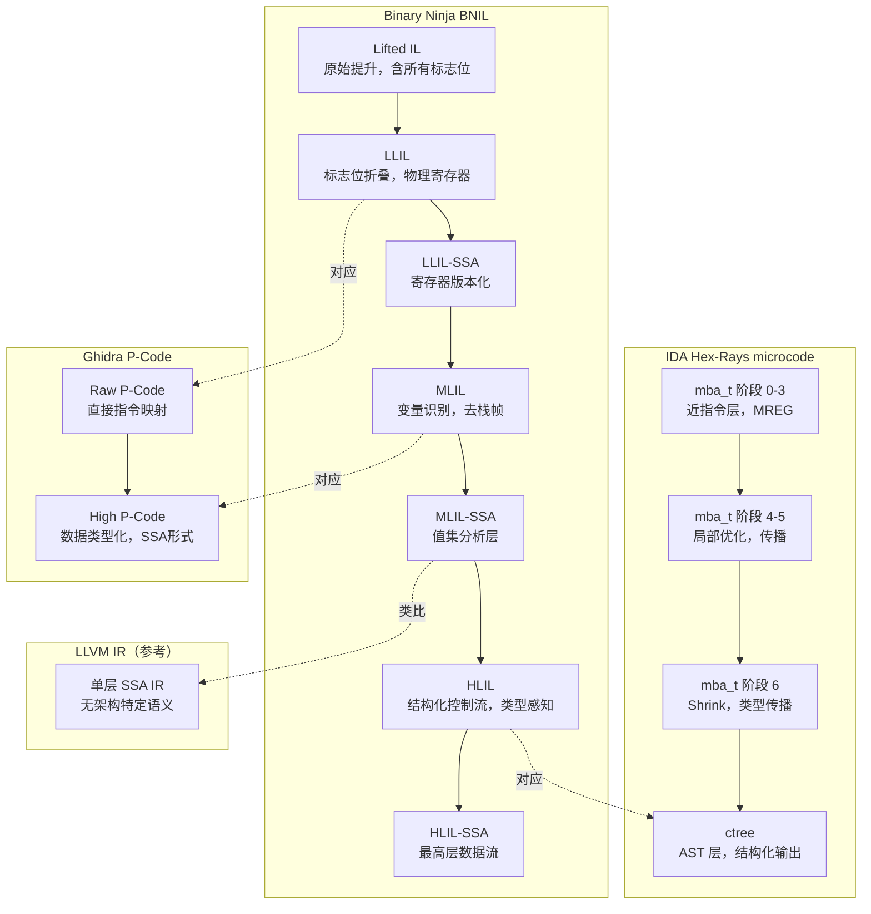

---
tags:
  - 反编译器
  - 反汇编
  - tier3
  - binaryninja
  - BNIL
---
# Binary Ninja 架构与 BNIL 多层 IR

> [!abstract] TL;DR
> Binary Ninja 是 Vector35 开发的商业逆向工程平台，以"可编程性优先"为核心设计哲学，其独特之处在于四层递进式中间表示（BNIL）栈：Lifted IL → LLIL → MLIL → HLIL，每层均附带 SSA 变体，覆盖从裸机器码到接近源码的完整语义梯度。相比 IDA Hex-Rays 的封闭 microcode 和 Ghidra 的 P-Code，BNIL 拥有完整文档化的 Python/C++/Rust API 和可钩入的 Workflow 系统，使学术界和工程界均可在任意 IR 层插入自定义分析。本章系统讲解 BNIL 每层的语义定位、数据流分析引擎、类型系统传播机制、Architecture/Platform 插件体系，以及 headless 模式的自动化应用。

## 概述与定位

### Binary Ninja 的诞生背景

Binary Ninja（以下简称 BN）于 2016 年由 Vector35（Josh Watson、Jordan Wiens 等）正式发布 1.0，其诞生直接源于 IDA Pro 高昂授权费用和封闭 API 体系所带来的逆向工程生态壁垒。BN 的早期用户群体以 CTF 竞赛选手和安全研究人员为主，但其在 API 可编程性上的设计决策很快吸引了大量学术研究者——Binary Ninja 成为 angr、BINSEC、Triton 等程序分析框架选择接入的主流 IR 来源之一。

与 IDA Pro（以脱机分析和庞大插件市场见长）和 Ghidra（NSA 开源、以大规模代码库适配见长）相比，BN 的定位可概括为三点：

1. **可编程性优先**：所有分析结果（IR 树、类型信息、控制流图、注释）均通过同一套 API 读写，不区分"UI 专用功能"和"脚本专用功能"。
2. **多层 IR 作为一等公民**：BNIL 的四层 IR 并非内部实现细节，而是向外暴露的核心数据结构，文档化程度接近编译器前端标准。
3. **跨平台原生支持**：BN 从第一天起就支持 Windows/macOS/Linux，且通过 Architecture 插件体系支持任意指令集的解码与提升，不依赖平台原生 SDK。

### 商业模式与学术访问

BN 的授权分为三个层级：个人版（Personal，约 299 USD/年）、商业版（Commercial，约 499 USD/年）和企业版（Enterprise）。学术界尤其受益于两点：一是 BN 提供"headless"（无头）模式，通过 Python 或 C++ API 在命令行直接分析二进制文件而无需启动 GUI；二是 Vector35 维护了 `binaryninja-api` 开源仓库（C++ 头文件 + Python 绑定），使研究者可以在没有完整授权的情况下阅读 API 签名、测试有限功能。

学术论文中使用 BN 的代表性工作包括：USENIX Security 2020 的《KARONTE》（固件静态污点分析）、NDSS 2021 的《DIANE》（IoT 模糊测试辅助分析）以及多项基于 BNIL 的自动化漏洞挖掘研究。相比之下，angr 虽然使用 VEX IR（来自 Valgrind），但部分研究也会将 BN 的 MLIL 作为更高语义层的分析起点。

---

## 原理与机制

### BNIL 多层 IR 栈总览

BNIL（Binary Ninja Intermediate Language）是一套同构但语义递进的 IR 家族。其设计哲学是"每一层只做一件事，做到彻底"，与 LLVM 的单一 IR 风格截然不同，也不同于 Hex-Rays microcode 的八层管线（后者层次更密，但对外不透明）。

```
机器指令（x86/ARM/MIPS/...）
        │
        ▼
  Lifted IL（LLIL 的原始未优化形态）
        │
        ▼
  LLIL（Low Level IL）      ← 贴近指令，标志位显式
  LLIL-SSA                  ← LLIL 的 SSA 变体
        │
        ▼
  MLIL（Medium Level IL）   ← 变量识别，去栈帧，去标志位
  MLIL-SSA                  ← MLIL 的 SSA 变体
        │
        ▼
  HLIL（High Level IL）     ← 类源码，结构化控制流，类型感知
  HLIL-SSA                  ← HLIL 的 SSA 变体
```

每一层都是独立完整的 IR——不是上层到下层的"转换输出"而是"精炼输出"，上层的 IR 在分析数据库（BNDB 文件）中持久化保存，可独立查询。

### Lifted IL：提升的起点

Lifted IL 是指令语义的直接、机械映射。每条机器指令被展开为若干条 Lifted IL 语句，保留所有副作用（包括标志位写入、隐式操作数、条件码更新）。Lifted IL 不进行任何优化，目的是作为"语义保真的最低层基础"。

以 x86 `add eax, ecx` 为例，Lifted IL 展开约为：
```
temp0 = eax + ecx      // 运算结果
CF = carry(eax, ecx)   // 进位标志
OF = overflow(eax, ecx)// 溢出标志
SF = temp0 s< 0        // 符号标志
ZF = temp0 == 0        // 零标志
PF = parity(temp0)     // 奇偶标志
eax = temp0            // 写目标寄存器
```

这七条语句完整描述了指令的所有语义副作用，是后续 LLIL 优化的输入。Lifted IL 对外暴露但通常不直接使用，分析代码一般从 LLIL 开始。

### LLIL（Low Level IL）：指令级语义

LLIL 在 Lifted IL 的基础上完成以下精炼：

- **标志位折叠**：条件跳转前的标志位更新序列被合并为单一条件表达式（`CF == 1` → `LLIL_CMP_E(eax, ecx)`）
- **常量折叠**：编译期可确定的常量表达式被折叠
- **死代码消除**：从未被读取的标志位写入被删除
- **临时变量消除**：Lifted IL 引入的 `temp` 变量在可能时被内联

LLIL 仍然使用物理寄存器名称（`eax`、`rsp`、`x0` 等），仍然包含显式的栈指针操作，适合需要精确跟踪寄存器状态的分析（如 ROP gadget 分析、shellcode 分析）。

LLIL 表达式树的节点类型（部分）：
| 操作码 | 含义 |
|--------|------|
| `LLIL_SET_REG` | 寄存器赋值 |
| `LLIL_LOAD` | 内存读 |
| `LLIL_STORE` | 内存写 |
| `LLIL_CALL` | 函数调用 |
| `LLIL_IF` | 条件分支 |
| `LLIL_CMP_E/NE/SLT/ULT` | 有符号/无符号比较 |
| `LLIL_ZX/SX` | 零扩展/符号扩展 |
| `LLIL_PUSH/POP` | 栈操作（x86专有） |

#### LLIL-SSA

LLIL-SSA 是 LLIL 的静态单赋值形式。BN 使用半剪枝 SSA（semi-pruned SSA），在支配边界插入 Phi 函数，寄存器引用变为版本化符号（`eax#0`、`eax#1`）。LLIL-SSA 是数据流分析和 value set analysis 的首选层次。

### MLIL（Medium Level IL）：变量与去栈帧

MLIL 是 BNIL 栈中语义跃升最大的一步，完成以下转换：

**1. 栈变量识别与命名**

分析引擎扫描函数内所有 `[rsp + offset]`、`[rbp - offset]` 形式的内存访问，将具有稳定偏移和一致访问大小的内存槽识别为局部变量（`var_10`、`arg1` 等）。这一步的核心是"栈帧布局分析"（stack frame layout analysis）：

- 追踪 `rsp`/`rbp` 的值集（value set）以确定偏移常量
- 对具有别名关系的槽（如 `int32` 和 `uint16` 共享同一地址）进行分裂或合并
- 识别被取地址（`lea rax, [rbp-8]`）后传入调用的局部变量，标记为"地址已逃逸"

**2. 标志位消除**

MLIL 完全消除了物理标志位，`CF`/`ZF`/`OF`/`SF` 不再出现。条件判断直接以比较表达式形式出现（`var_8 < 10`），使分析代码无需理解目标架构的标志位语义。

**3. 调用约定恢复**

结合 Platform 插件提供的调用约定信息（SysV ABI、Windows x64 ABI、ARM AAPCS 等），MLIL 将参数传递寄存器（`rdi`、`rsi`、`rcx`、`rdx`）绑定到具名参数（`arg1`、`arg2`），将返回值寄存器（`rax`、`xmm0`）绑定到调用结果。

**4. 去掉伪操作**

`LLIL_PUSH`/`LLIL_POP` 被消解为直接的内存操作，`LLIL_CALL` 附带显式的参数列表和返回值捕获语义。

MLIL 适合大多数静态分析场景：污点分析、切片、常量传播、路径可达性分析。大量 BN 插件（如 Findrefs、`bnpluginkit` 中的污点追踪）在此层工作。

#### MLIL-SSA

MLIL-SSA 在 MLIL 变量上构建 SSA，每个局部变量获得版本号（`var_8#0`、`var_8#1`）。BN 的值集分析（Value Set Analysis，VSA）就在 MLIL-SSA 上运行，计算每个变量在各程序点可能持有的值域（常量、偏移量、范围集合）。

### HLIL（High Level IL）：类源码表示

HLIL 是面向人类读者设计的层次，其设计目标是使输出尽量接近 C 代码，同时保留足够的精确语义供程序分析使用。HLIL 在 MLIL 基础上完成：

**1. 结构化控制流恢复**

将 MLIL 中的条件跳转图（仍然是扁平的 `MLIL_IF` + 跳转目标）恢复为嵌套的 `if/else`、`while`、`do-while`、`for` 结构。BN 使用基于支配树的结构化算法（类似 Hex-Rays 的区间分析，但 BN 文档公开了算法概述）。

**2. 复合条件合并**

`a < 10 && b != 0` 两个独立条件跳转被合并为单一复合条件表达式。

**3. 数组索引识别**

`*(ptr + idx * sizeof(T))` 形式的访问被提升为 `ptr[idx]` 形式，前提是类型系统已解析出指针类型和元素类型。

**4. 成员访问展开**

已知结构体类型（来自 PDB、DWARF 或手动定义）的偏移访问被展开为 `obj.field` 形式。

HLIL 节点类型举例：
| HLIL 操作码 | 对应 C 语义 |
|-------------|-------------|
| `HLIL_WHILE` | `while(cond) { ... }` |
| `HLIL_FOR` | `for(init; cond; update)` |
| `HLIL_SWITCH` | `switch(val) { case ... }` |
| `HLIL_STRUCT_FIELD` | `obj.field` |
| `HLIL_ARRAY_INDEX` | `arr[idx]` |
| `HLIL_CALL` | 带类型的函数调用 |
| `HLIL_TAILCALL` | 尾调用优化识别 |

HLIL 同样有 SSA 变体（HLIL-SSA），用于在最高语义层做数据流分析，例如检测 UAF（Use-After-Free）模式：若某个指针变量的某个版本在 `free()` 之后再次被解引用，则 HLIL-SSA 定义-使用链可直接检出。

---

## 结构/算法/伪代码详解

### 值集分析（Value Set Analysis）

BN 的 VSA 引擎在 MLIL-SSA 上运行，为每个变量在每个程序点维护一个抽象值（Abstract Value）。BN 的抽象值域是一个有界格，支持以下类型：

```
AbstractValue ::=
  | Undetermined          -- 分析未到达
  | ConstantData(v, size) -- 精确常量
  | ConstantPointerData(v)-- 精确指针常量
  | SignedRangeValue(lo,hi,step) -- 步长化区间 [lo, hi, step]
  | UnsignedRangeValue(lo,hi,step)
  | LookupTableValue([v1,v2,...])  -- 有限值集（jump table）
  | InSetValue({v1,v2,...})        -- 任意离散集合
  | EntryValue(reg)       -- 函数入口时的寄存器值
  | ExternalPointerValue  -- 外部符号指针
  | TopValue              -- 无法确定（最大不动点）
```

分析以函数为单位，按 SSA 的 def-use 链进行前向传播，在循环处迭代至不动点（widening 操作防止无穷循环）。VSA 结果通过 `mlil_insn.value` 属性暴露给 Python API：

```python
bv = binaryninja.open_view("/path/to/binary")
func = bv.get_functions_by_name("target_func")[0]
mlil = func.mlil_instructions
for insn in mlil:
    if insn.operation == MediumLevelILOperation.MLIL_CALL:
        # 获取被调用目标的值集
        dest_value = insn.dest.value
        if dest_value.type == RegisterValueType.ConstantPointerValue:
            print(f"Direct call to {hex(dest_value.value)}")
        elif dest_value.type == RegisterValueType.LookupTableValue:
            print(f"Indirect call, candidates: {dest_value.values}")
```

VSA 对间接跳转表分析尤为有效：`switch` 语句编译后产生 `jmp [rax*8 + table]` 形式，BN 通过 VSA 确定 `rax` 的值范围，从而枚举所有 case 目标并正确构建 CFG。

### Phi 函数与 SSA 构建

BN 在 LLIL、MLIL、HLIL 三层均独立构建 SSA，使用标准的 Cytron 1991 算法（基于支配边界）。以 MLIL-SSA 为例，Phi 函数的插入位置为变量定义点的支配边界处：

```
设 D = {所有对变量 v 有定义的基本块}
对每个 b ∈ D：
    对每个 y ∈ DF(b)（b 的支配边界）：
        在 y 的起始处插入 Phi(v) 节点（若尚未插入）
        将 y 加入 D（Phi 本身也是定义）
        重复直到 D 不再变化
```

在 Python API 中访问 SSA 定义：

```python
ssa_func = func.mlil.ssa_form
for bb in ssa_func:
    for insn in bb:
        if insn.operation == MediumLevelILOperation.MLIL_SET_VAR_SSA:
            var_ssa = insn.dest  # SSAVariable(var, version)
            print(f"{var_ssa.var.name}#{var_ssa.version} = ...")
            # 查找所有使用点
            uses = ssa_func.get_ssa_var_uses(var_ssa)
```

### 控制流结构化算法

HLIL 的结构化算法将 CFG 从基本块有向图恢复为嵌套结构树（Structured Control Flow Tree）。BN 实现了基于"区域"（Region）的算法：

1. **自然循环识别**：通过支配树找到回边（back edge），每条回边 `(n, h)` 定义一个自然循环，循环头为 `h`，循环体为从 `h` 可达且以 `h` 为支配者的节点集合。

2. **异常处理整合**：BN 处理 `try/catch/__try/__except` 等异常控制流，将 `EH_UNWIND` 边在 HLIL 层统一表示为 `try { ... } catch(...)` 结构。

3. **irreducible CFG 处理**：对无法完美结构化的 CFG（含多个入口的循环、computed goto），BN 引入 `goto` 语句作为退化表示，保证 HLIL 输出的完整性。

### 定义-使用链与切片

BN 在 MLIL-SSA 和 HLIL-SSA 上均支持精确的 def-use / use-def 链查询，是实现程序切片的基础设施：

```python
# 向后切片：从某个 SSA 变量出发，找所有到达该变量定义的指令
def backward_slice(ssa_func, target_var_ssa, visited=None):
    if visited is None:
        visited = set()
    if target_var_ssa in visited:
        return []
    visited.add(target_var_ssa)
    
    result = []
    def_insn = ssa_func.get_ssa_var_definition(target_var_ssa)
    if def_insn is None:
        return result  # 函数参数，无定义
    
    result.append(def_insn)
    # 递归到操作数
    for operand in def_insn.ssa_operands:
        result.extend(backward_slice(ssa_func, operand, visited))
    return result
```

这种切片能力使 BN 成为漏洞分析的有力平台：从危险函数（`memcpy`、`sprintf`）的长度参数出发，向后切片可快速定位是否存在外部可控输入直接到达。

---

## 工具视角与实战

### Python API 体系概览

BN 的 Python API（`binaryninja` 包）是其与 IDA Python API 和 Ghidra Java API 竞争的核心资产。API 设计遵循"平坦但一致"原则——几乎所有数据通过 `BinaryView` 对象访问：

```python
import binaryninja as bn

# 打开二进制（headless 模式）
with bn.open_view("/bin/ls") as bv:
    bv.update_analysis_and_wait()   # 等待分析完成
    
    for func in bv.functions:
        print(f"Function: {func.name} @ {hex(func.start)}")
        
        # 遍历 HLIL
        for block in func.hlil:
            for insn in block:
                print(f"  HLIL: {insn}")
        
        # 遍历 MLIL-SSA
        for block in func.mlil.ssa_form:
            for insn in block:
                if insn.operation == bn.MediumLevelILOperation.MLIL_CALL:
                    print(f"  Call: {insn}")
```

关键 API 层次结构：

```
BinaryView（bv）
  ├── bv.functions → List[Function]
  ├── bv.segments / bv.sections
  ├── bv.symbols → Dict[str, Symbol]
  ├── bv.types → TypeLibrary
  └── bv.arch / bv.platform

Function（func）
  ├── func.llil → LowLevelILFunction
  ├── func.mlil → MediumLevelILFunction
  ├── func.hlil → HighLevelILFunction
  ├── func.llil.ssa_form → SSA 变体
  ├── func.mlil.ssa_form
  ├── func.hlil.ssa_form
  ├── func.parameter_vars → List[Variable]
  └── func.return_type → Type
```

### C++ API 与性能关键路径

对于需要处理百万级指令的大规模分析，Python API 的解释开销不可接受。BN 提供完整的 C++ API（头文件位于 `api/` 目录），可直接调用核心引擎：

```cpp
#include "binaryninjaapi.h"
using namespace BinaryNinja;

Ref<BinaryView> bv = OpenView("/bin/ls");
bv->UpdateAnalysisAndWait();

for (auto& func : bv->GetAnalysisFunctionList()) {
    Ref<MediumLevelILFunction> mlil = func->GetMediumLevelIL();
    if (!mlil) continue;
    
    Ref<MediumLevelILFunction> mlil_ssa = mlil->GetSSAForm();
    for (size_t i = 0; i < mlil_ssa->GetInstructionCount(); i++) {
        MediumLevelILInstruction insn = mlil_ssa->GetInstruction(i);
        if (insn.operation == MLIL_CALL_SSA) {
            // 处理 SSA 形式的调用指令
        }
    }
}
```

Rust API（`binaryninja` crate）是 Vector35 近年推出的第三选项，提供内存安全保证，适合开发需要长期运行的后台分析服务。

### Workflow 系统：分析管线的钩子

BN 的 Workflow 系统是其区别于 IDA/Ghidra 最具独特性的架构特性。Workflow 将分析过程表示为有向无环图（Activity Graph），每个节点是一个 Activity（分析活动），边表示执行依赖。用户可以克隆内置 Workflow 并在任意位置插入自定义 Activity：

```python
import binaryninja as bn
from binaryninja import Workflow, Activity

def my_custom_analysis(ctx):
    """自定义分析活动：在 MLIL 分析完成后运行"""
    func = ctx.function
    mlil = func.mlil
    if mlil is None:
        return
    # 自定义分析逻辑
    for block in mlil:
        for insn in block:
            if insn.operation == bn.MediumLevelILOperation.MLIL_CALL:
                # 标记危险调用
                func.set_comment_at(
                    insn.address,
                    f"[CALL] dest={insn.dest}"
                )

# 注册自定义活动
activity = Activity(
    "custom.analysis.callTracker",
    handler=my_custom_analysis
)

# 克隆默认 Workflow 并插入自定义活动
wf = Workflow.instance("core.function.baseAnalysis").clone("myWorkflow")
wf.register_activity(activity)
wf.insert("core.analysis.mlil.generateSSAForm", ["custom.analysis.callTracker"])
Workflow.register(wf)
```

Workflow 的执行是事件驱动的：当某个 Activity 完成时，依赖它的后续 Activity 才被调度，且自动感知函数分析的增量更新（当函数的某个属性改变时，只重新执行受影响的 Activity 子图）。这使得 BN 的插件可以实现真正的增量分析，而 IDA 的分析钩子通常是全量重跑。

### Architecture 与 Platform 插件

BN 支持通过插件添加任意新架构，这是其在嵌入式/固件逆向领域广泛应用的基础。Architecture 插件需要实现以下核心接口：

```python
class MyArch(Architecture):
    name = "myarch"
    address_size = 4
    default_int_size = 4
    max_instr_length = 8
    
    # 必须实现：指令解码
    def get_instruction_info(self, data, addr):
        info = InstructionInfo()
        # 解析 data[0:4]，填充分支信息
        opcode = struct.unpack_from('<I', data)[0]
        info.length = 4
        if opcode & 0xFF == 0x10:  # 条件跳转
            target = addr + (opcode >> 8) * 4
            info.add_branch(BranchType.TrueBranch, target)
            info.add_branch(BranchType.FalseBranch, addr + 4)
        return info
    
    # 必须实现：LLIL 提升（核心）
    def get_instruction_low_level_il(self, data, addr, il):
        opcode = struct.unpack_from('<I', data)[0]
        op = opcode & 0xFF
        rd = (opcode >> 8) & 0xF
        rs = (opcode >> 12) & 0xF
        imm = (opcode >> 16) & 0xFFFF
        
        if op == 0x01:  # ADD rd, rs, imm
            il.append(il.set_reg(4, f"r{rd}",
                il.add(4, il.reg(4, f"r{rs}"), il.const(4, imm))))
        elif op == 0x10:  # BEQ rs, imm, target
            target = addr + imm * 4
            cond = il.compare_equal(4, il.reg(4, f"r{rs}"), il.const(4, 0))
            t_label = il.get_label_for_address(Architecture['myarch'], target)
            f_label = il.get_label_for_address(Architecture['myarch'], addr + 4)
            il.append(il.if_expr(cond, t_label, f_label))
        return 4  # 返回指令长度

MyArch.register()
```

Platform 插件（继承自 `Platform` 类）在 Architecture 之上定义操作系统相关的信息：调用约定、系统调用号映射、标准库函数签名（通过 Type Library）。例如 `linux-x86_64` Platform 知道 `SysV AMD64 ABI` 调用约定和 Linux 系统调用表，`windows-x86_64` Platform 知道 `Microsoft x64 ABI` 和 Win32 API 类型。

### 类型系统与类型传播

BN 的类型系统是 C 类型系统的超集，支持：
- 基本类型（`int8_t` 到 `uint64_t`，浮点）
- 指针类型（含 `const` 限定符）
- 数组类型（定长和未知长度）
- 结构体/联合体（含位域）
- 函数指针类型（完整原型）
- 枚举类型

类型传播通过以下路径发生：

**1. 调用约定绑定**：识别 `malloc`/`calloc` 等已知函数后，其返回值类型（`void *`）传播到调用结果，使用点的隐式类型强制转换触发向下传播。

**2. 类型库（Type Library）**：BN 内置对多种平台的 API 类型库（`.bntl` 文件），包含系统调用原型、C 运行时函数签名。类型库可通过 Python API 查询：

```python
tl = bv.platform.type_libraries[0]
func_type = tl.get_named_type("memcpy")
# 返回：void* (void* dest, const void* src, size_t n)
```

**3. 结构体传播**：若函数参数被类型化为结构体指针，所有对该指针的偏移访问自动解析为成员访问并传播成员类型。

**4. 手动标注**：用户或插件通过 `func.set_type()`、`func.parameter_vars[0].set_type()` 手动设置类型，触发全局重新分析。

### headless 模式与自动化流水线

headless 模式是 BN 在批量分析和 CI/CD 集成中的核心优势。商业授权下，headless 分析与 GUI 分析使用完全相同的引擎：

```python
#!/usr/bin/env python3
"""批量分析二进制文件，提取所有函数的 MLIL-SSA 调用图"""
import binaryninja as bn
import json
import sys
from pathlib import Path

def analyze_binary(path: str) -> dict:
    with bn.open_view(path) as bv:
        bv.update_analysis_and_wait()
        
        call_graph = {}
        for func in bv.functions:
            callers = []
            for xref in bv.get_code_refs(func.start):
                caller = bv.get_function_at(xref.function.start)
                if caller:
                    callers.append({
                        "name": caller.name,
                        "addr": hex(caller.start)
                    })
            
            # 获取 VSA 值集（被调用目标）
            callees = []
            mlil_ssa = func.mlil.ssa_form
            for bb in mlil_ssa:
                for insn in bb:
                    if insn.operation == bn.MediumLevelILOperation.MLIL_CALL_SSA:
                        v = insn.dest.value
                        if v.type == bn.RegisterValueType.ConstantPointerValue:
                            callee = bv.get_function_at(v.value)
                            if callee:
                                callees.append(callee.name)
            
            call_graph[func.name] = {
                "addr": hex(func.start),
                "callers": callers,
                "callees": callees
            }
        
        return call_graph

if __name__ == "__main__":
    result = analyze_binary(sys.argv[1])
    print(json.dumps(result, indent=2))
```

这类 headless 脚本可以直接集成到 CI 管线中，对每次编译产物做自动漏洞模式扫描，无需人工介入。

### 与其他框架的集成

**angr + BN**：angr 原生使用 VEX IR，但 `binaryninja-angr` 桥接库允许将 BN 的 MLIL 作为 angr 的提升后端，保留 BN 已完成的类型信息和变量命名。

**Triton + BN**：Triton 的符号执行可以在 BN 提供 CFG 和 LLIL 的基础上进行，减少 Triton 自己处理控制流的负担。

**Binary Ninja Cloud（BNC）**：Vector35 提供的 SaaS 分析服务，通过 REST API 访问 BN 分析引擎，无需本地安装授权，适合轻量级协作场景和 CTF 快速分析。

---

## 多层 IR 横向对比



### 与 Ghidra P-Code 的详细对比

Ghidra 的 P-Code 仅有两层：Raw P-Code（对应 BN 的 Lifted IL/LLIL）和 High P-Code（对应 BN 的 MLIL，包含 SSA 和数据类型）。Ghidra 没有对应 BN HLIL 的独立 IR 层——结构化控制流直接在反编译器输出（C 代码 AST）中体现，不作为 API 暴露的独立数据结构。

这一差异导致：
- BN 用户可以在 HLIL 层编写遍历 `if/while/for` 树的分析，直接操作结构化控制流节点。
- Ghidra 用户若要做同等操作，必须解析反编译器输出的 `ClangAST` 或操作 `HighFunction` 的 PcodeOp 序列，缺少一层中间的结构化抽象。

P-Code 的 CALLIND（间接调用）操作与 BN 的 `MLIL_CALL` 在语义上等价，但 P-Code 的寻址是基于虚拟地址空间的全局唯一空间（"unique space" + "register space"），而 BN 的 MLIL 使用具名变量对象，在 API 层更易于理解和操作。

### 与 Hex-Rays microcode 的详细对比

IDA Hex-Rays 的 microcode 有 9 个优化阶段（MMAT_GENERATED 到 MMAT_FINAL），每阶段的 `mba_t` 对象可通过 `optinsn_t`/`optblock_t` 钩子拦截（第 07 章有详细论述）。

关键差异：

| 维度 | BN BNIL | IDA microcode |
|------|---------|---------------|
| 文档化程度 | 完整 API 文档，含类型签名 | 部分文档，需阅读 SDK 头文件推断 |
| IR 层数 | 4 层（+ 各层 SSA） | 9 个阶段（连续管线） |
| 最高层 | HLIL（结构化 IR 对象） | ctree（AST，C 代码树） |
| 分支条件表示 | 一致（MLIL/HLIL 均用表达式） | 阶段 6+ 才清晰 |
| 插件钩子粒度 | Activity（Workflow 节点） | 分析回调 + microcode 钩子 |
| 开放性 | API 随产品版本更新 | 部分 API 版本间不稳定 |
| 跨平台 | Windows/macOS/Linux 一致 | Windows 主要，macOS/Linux 有限 |

从学术研究角度，BN 的优势在于"可观测性"——研究者可以在任意 IR 层插入断言、输出可视化、修改 IR 节点，并在下一层看到效果。这使得"IR 级别的程序变换实验"在 BN 上远比在 IDA 上容易实现。

---

## 安全性与正确使用

### 商业授权与合规使用

Binary Ninja 是商业软件，使用需遵循 Vector35 的最终用户许可协议（EULA）。以下场景的使用需特别注意：

**插件分发**：向他人分发包含 BN API 调用的插件时，接受者需要持有有效的 BN 授权才能运行该插件。纯 Python 插件代码本身不受版权保护，但依赖 `binaryninja` 包的执行需要授权。

**headless API 授权**：headless 模式（无 GUI）需要 Commercial 或 Enterprise 授权，Personal 授权不支持无 GUI 批量分析。在 CI/CD 流水线中使用 headless BN 前，确认团队持有相应授权。

**逆向工程合规**：使用 BN 分析软件时，同样受目标软件的 EULA 约束。分析竞争对手产品（竞争情报）、绕过 DRM 保护、研究闭源协议（互操作性研究）在不同司法管辖区有不同的法律地位，应咨询法律意见。

### 插件安全

BN 的插件以 Python 代码形式执行，拥有与 BN 进程相同的操作系统权限。从 Binary Ninja Plugin Manager 安装插件时应评估插件来源：

- 优先选择 Vector35 官方收录的插件（经过基本审查）
- 开源插件在安装前审查代码，特别关注网络请求、文件系统写入和子进程调用
- 不在分析高度敏感目标（如已发现漏洞的 0day 样本）时加载来源不明的插件

### 分析结果的可信度

BN 的自动分析（函数识别、类型推断、调用图构建）基于启发式规则和统计模型，在以下情况下可能产生误报：

- **手工汇编代码**：不遵循标准调用约定的汇编代码可能导致参数识别错误
- **混淆代码**：花指令（anti-disassembly，参见第 16 章）可能导致 BN 错误识别函数边界
- **虚拟化保护**：VM 字节码解释器（参见第 10 章）在 BN 层面仅分析解释器外壳，无法穿透保护

对于上述场景，应将 BN 的自动分析结果与手工验证结合使用，不应无条件信任自动化输出的类型标注和函数签名。

---

## 小结

Binary Ninja 以"可编程性优先"的设计哲学在三大主流反编译器中独树一帜。其 BNIL 四层 IR 栈（Lifted IL → LLIL → MLIL → HLIL，每层附 SSA 变体）为程序分析提供了覆盖完整语义梯度的统一框架：

- **LLIL** 适合需要精确机器语义的分析（ROP 分析、shellcode 追踪、寄存器级污点）
- **MLIL / MLIL-SSA** 是大多数静态分析的最佳工作层（切片、VSA 值集分析、调用图构建）
- **HLIL / HLIL-SSA** 适合面向人类理解和漏洞模式识别的高语义分析（UAF 模式、整数溢出、类型混淆）

相比 Ghidra 的两层 P-Code（缺少 HLIL 层的结构化 IR）和 IDA Hex-Rays 的 microcode（文档不完整、跨平台受限），BN 的 API 体系在学术研究的可复现性和工程集成的灵活性上具有明显优势。Workflow 系统使分析管线的定制化从"修改 IR 字节"提升到"声明式活动图编排"，是当前反编译器架构设计的前沿实践。

对于希望在反编译器 IR 层开展研究的从业者，Binary Ninja 是目前最容易入手且文档最完整的商业平台选择。掌握 BNIL 多层 IR 的语义边界，结合 Python/C++ API 和 Workflow 系统，可以构建从漏洞挖掘自动化到固件安全审计的完整分析流水线。

---

## 相关阅读

- [[05.中间表示IR设计|← 05. 中间表示 IR 设计（BNIL 在 IR 家族中的定位）]]
- [[07.HexRays反编译器内部机制|← 07. Hex-Rays 反编译器内部机制（microcode 对比参考）]]
- [[08.Ghidra反编译器与PCode分析|← 08. Ghidra 反编译器与 P-Code 分析（P-Code 对比参考）]]
- [[11.符号执行与angr框架|← 11. 符号执行与 angr 框架（BN 作为 angr IR 来源）]]
- [[16.反汇编对抗技术与工具检测|← 16. 反汇编对抗技术（BN 面对花指令的局限性）]]
- [[18.MBA混淆原理与自动化反混淆|→ 18. MBA 混淆原理与自动化反混淆]]
- Vector35 官方文档：[Binary Ninja API Reference](https://api.binary.ninja/)
- Vector35 官方博客：《Binary Ninja Internals》系列
- USENIX WOOT 2020：《Binary Ninja as a Research Platform》

---

[[00.反编译器与反汇编引擎原理总览|⬆ 系列总览]] | [[16.反汇编对抗技术与工具检测|← 上一章]] | [[18.MBA混淆原理与自动化反混淆|→ 下一章]]
