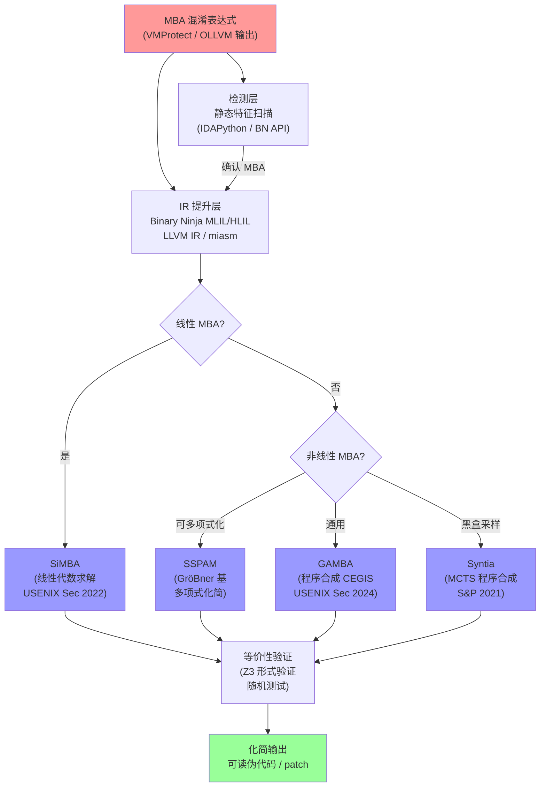

# MBA 混淆原理与自动化反混淆

> [!abstract] TL;DR
> MBA（Mixed Boolean-Arithmetic，混合布尔算术）混淆是当前商业保护（VMProtect 3.x、Tigress、OLLVM）的核心技术之一：通过将简单的算术/逻辑表达式替换为跨越布尔域和算术域的复杂等价式，使得传统代数化简和 Z3 等通用 SMT 求解器直接失效。反混淆的正确路径是：基于线性代数的真值表分析（SiMBA、MBA-Blast）、程序合成（GAMBA）、位爆破（bit-blasting）以及 SSA + 规范化简化。本章从 MBA 的数学根基出发，穷尽展开生成算法、工具链原理和实战脚本。

---

## 概述与定位

### 什么是 MBA，它在混淆体系中处于哪个层次

代码混淆按照作用层次大致可分为三类：结构级（控制流平坦化 CFF、不透明谓词）、数据级（字符串加密、常量折叠）和**表达式级**。MBA 混淆属于表达式级，专门针对算术和位运算，是近年最难被自动化工具处理的一类混淆。

第 09 章已经系统介绍了 CFF 和不透明谓词，本章聚焦 MBA 这一截然不同的技术分支：

- **CFF** 混淆的是**控制流拓扑**，不改变单个表达式的语义，反混淆依靠调度器识别和路径合并。
- **不透明谓词**混淆的是**条件分支的必要性**，利用恒真/恒假式，反混淆依靠常量传播和 SMT 可满足性查询。
- **MBA** 混淆的是**表达式本身**，把一个简单的算术/位运算替换为语义等价但跨越两个代数域的复杂表达式，既不改变控制流，也不引入死代码，因此前两类的反混淆工具对它完全失效。

### 为何 MBA 近年成为主流

VMProtect 3.x（2019+）在其 mutation 引擎中大量使用 MBA 变换，Themida、Code Virtualizer 和若干自研壳也采用类似技术。其成为主流的原因有三：

1. **生成成本低**：编译时只需查表或随机展开，几乎零运行时开销（部分变体会引入少量额外运算）。
2. **对抗效果强**：IDA Hex-Rays 的代数化简引擎（基于有限的规则集）无法处理跨域表达式；Z3 直接对 64 位变量建立约束时会遭遇位向量理论的组合爆炸。
3. **变体空间巨大**：同一个简单表达式可以生成指数级数量的等价 MBA 式，静态签名匹配不现实。

---

## 原理与机制

### 两个代数域：布尔域与算术域

理解 MBA 的前提是区分两个运算域：

| 域 | 运算 | 封闭性 | 代数结构 |
|---|---|---|---|
| 布尔域（Boolean domain） | AND（&）、OR（\|）、XOR（^）、NOT（~） | 封闭在 {0,1} 的逐位运算 | 布尔环 / GF(2)^n |
| 算术域（Arithmetic domain） | +、-、\*、/ | 封闭在 Z/(2^n)Z 上的模算术 | 环 Z_{2^n} |

两个域之间没有简单的同态关系：布尔运算对加法不满足分配律，加法对 XOR 也不满足分配律。正是这种"域间不分配律"使得跨域化简异常困难。

**一个关键数学事实**：在 n 位字（Z_{2^n} 上），下面这个等式成立：

```
x + y  =  (x XOR y) + 2*(x AND y)
```

这个等式将算术加法用 XOR（布尔域）和乘以 2 再加（算术域）混合表达。IDA 的代数化简引擎是针对单个代数域设计的——它可以化简纯算术表达式，也可以化简纯布尔表达式，但面对这种**显式跨域组合**的式子时，引擎不知道如何下手，只能原样输出。

### 线性 MBA（Linear MBA）

线性 MBA 是最基础的形式。设 e1, e2, ... ek 是若干布尔基向量（如 x&y、x\|y、x^y、~x&y 等），线性 MBA 的一般形式为：

```
目标表达式 = Σ_i  c_i * e_i   (mod 2^n)
```

其中 c_i 是整数系数。例如：

```
x + y  =  1*(x XOR y)  +  2*(x AND y)
x - y  =  1*(x XOR y)  -  2*(~x AND y)
x AND y  =  (1/2) * (x + y - (x XOR y))     [当 x XOR y 为偶数时有效]
x OR y   =  (x XOR y) + (x AND y)
           = x + y - (x AND y)               [等价形式]
x XOR y  =  (x OR y) - (x AND y)
           = x + y - 2*(x AND y)
```

线性 MBA 的生成算法（Eyrolles 2017 提出的系统方法）：

1. **枚举布尔基**：对 k 个输入变量，枚举所有可能的布尔函数（对 2 个变量有 16 种，实用中取其中非退化的 8 种：`x`、`y`、`x&y`、`x\|y`、`x^y`、`~x`、`~y`、`~(x&y)` 等）。
2. **构造真值表矩阵**：把 k 个变量的所有 2^k 种取值代入每个布尔基，得到一个 2^k × m 的矩阵 B（行是输入向量，列是各布尔基）。
3. **建立线性方程**：将目标表达式的真值表向量 t 表示为 B 的线性组合：`t = B * c (mod 2^n)`，其中 c 是待求系数向量。
4. **求解系数**：用高斯消元法（在 Z_{2^n} 上）求解线性方程组，得到系数 c。
5. **验证等价性**：将所有 2^k 种输入代入生成的 MBA 式，逐位验证输出与目标表达式一致。

线性 MBA 是可以精确反混淆的，因为它本质上是一个线性代数问题。

### 非线性 MBA（Nonlinear MBA）

非线性 MBA 在基向量上引入乘法（表达式之间相乘），使得化简问题从线性代数提升到多项式方程求解：

```
目标表达式 = Σ_i Σ_j  c_{ij} * e_i * e_j  +  Σ_i c_i * e_i + ...
```

示例（非线性 MBA 展开，VMProtect 3.x 常见变体）：

```
x * y  ≡  ((x^y) + (x&y)) * ((x^y) - (x&y)) + ((x&y) << 1)^2
          （将 x*y 展开为乘积项的 MBA 组合）
```

非线性 MBA 难度远高于线性 MBA：
- 布尔基的乘积不再是布尔基（e.g., `(x&y) * (x|y)` 不再是纯布尔函数）
- 真值表矩阵变成非方阵或非满秩，简单高斯消元不再奏效
- Z3 面对 64 位非线性位向量约束时，内部使用位爆破（bit-blasting）将每个变量展开为 64 个布尔变量，约束数量指数级增长，求解时间难以接受

### 为何 Z3 直接失效：深入分析

以最简单的 MBA 等价性验证为例：

```python
from z3 import *
x, y = BitVecs('x y', 64)
# 验证：x + y == (x ^ y) + 2*(x & y)
lhs = x + y
rhs = (x ^ y) + 2 * (x & y)
s = Solver()
s.add(lhs != rhs)
# 预期：unsat（即两者恒等）
print(s.check())  # 输出 unsat，速度较快
```

上面这个例子 Z3 可以快速处理，因为它是线性的。但面对 VMProtect 级别的多层嵌套非线性 MBA 时：

```python
# 4 层嵌套非线性 MBA（简化示意）
expr = (((x ^ y) + 2*(x&y)) * ((x | y) - (x & y))) - \
       ((x ^ y) * (~x & y) + (x & ~y) * (x | y))
# Z3 需要将 64-bit * 64-bit 展开为 4096 个布尔子句
# 再叠加 4 层嵌套，CNF 子句数量指数爆炸
s = Solver()
s.add(expr != x * y)  # 验证等价性
# 结果：可能需要数小时，甚至超时
```

Z3 失效的本质原因：

1. **位爆破（bit-blasting）**：Z3 的位向量理论求解器将 64 位变量的每一位编码为独立的布尔变量，将乘法展开为约 64^2 个 AND/OR 子句，再叠加多层嵌套，子句总数呈指数增长。
2. **非线性理论的不完备性**：位向量乘法在 Z3 内部属于量化位向量（QF_BV）的非线性片段，缺少完备的多项式归约算法，求解器依赖 SAT 后端的暴力搜索。
3. **实践验证**：SiMBA 论文（USENIX Security 2022）测试表明，对于 4 变量的 VMProtect MBA 表达式，Z3 平均求解时间超过 10 分钟，而 SiMBA 在毫秒级别完成。

### VMProtect 3.x / OLLVM / Tigress 如何生成 MBA

**VMProtect 3.x（Mutation Engine）**：

VMProtect 的 mutation 引擎在将指令翻译为虚拟字节码（参见第 10 章）的同时，还对操作数表达式进行 MBA 变换。其内部维护一张等价式替换表，对每个算术/位运算操作随机选取一种 MBA 等价形式，并且可以多次迭代叠加（每次叠加使表达式深度加一），最终在 VM handler 中执行的是若干层 MBA 嵌套后的复杂表达式。

**OLLVM（指令替换 Pass）**：

OLLVM 的 `-sub` Pass（Instruction Substitution）实现了表 09.2 中的指令替换规则，其中部分规则本质上是线性 MBA：

```
// OLLVM sub Pass 的部分替换（C++ 实现中的规则，可在 lib/Transforms/Obfuscation/Substitution.cpp 查看）
// ADD → NEG + NOT 变体
a = x + y   →   a = -(~x) - 1 + y   (等价，利用补码 ~x = -x-1)
// AND → OR/NOT 变体（De Morgan）
a = x & y   →   a = ~(~x | ~y)
```

OLLVM 的替换深度可配置（默认 1 层），层数越高越难化简。

**Tigress（C 源码混淆器）**：

Tigress 的 `--Transform=EncodeArithmetic` 选项在 C AST 层面实施 MBA 替换，生成包含复杂 MBA 式的等价 C 源码。由于在源码层操作，Tigress 支持更灵活的 MBA 变体，包括引入中间变量和循环展开。

```c
// Tigress EncodeArithmetic 示例输出（原始：result = a + b）
int tmp1 = (a ^ b);
int tmp2 = (a & b);
int tmp3 = tmp1 + (tmp2 << 1);
// 可继续嵌套 MBA 展开 tmp3...
int result = tmp3;
```

---

## 结构/算法/伪代码详解

### SiMBA 算法：基于线性代数的 MBA 化简

SiMBA（Simplification of Mixed Boolean-Arithmetic Expressions）是 USENIX Security 2022 的工作，是目前最系统的线性 MBA 反混淆算法。

**算法核心思路**：将 MBA 表达式视为"布尔基向量空间中的一个向量"，通过真值表采样和线性回归找到其在标准基向量上的分解，再化简到等价的最简形式。

**算法步骤**（以 2 变量线性 MBA 为例）：

```
输入：MBA 表达式 E(x, y)（可能是任意复杂的线性/非线性 MBA）
输出：语义等价的最简表达式 S(x, y)

Step 1：构造真值表采样矩阵
  - 选取 k = 2 个变量，枚举 2^2 = 4 种 0/1 赋值：(0,0),(0,1),(1,0),(1,1)
  - 但在 n = 64 位字长下，(0,0) 这样的输入不够，需要随机采样 m 组 n 位值
  - 实际 SiMBA 使用"位对齐采样"：采样点为 (2^0, 2^1, ..., 2^{n-1}) 的组合，
    保证线性独立性

Step 2：枚举布尔基函数
  对 2 变量，有 4 种原子：x, y, x&y, ~(x&y), x|y, x^y, ~x, ~y, 常数 -1
  实际取 8 个线性无关的布尔基 e_1,...,e_8

Step 3：计算每个布尔基在采样点的真值表列向量
  B = [e_1(x_i, y_i)]_{i,j}   // m × 8 矩阵

Step 4：计算目标表达式的真值表向量
  t = [E(x_i, y_i)]_i          // m × 1 向量

Step 5：求解线性方程组（在 Z_{2^n} 上）
  求系数向量 c: B * c ≡ t (mod 2^n)
  → 使用 Z_{2^n} 上的高斯消元法求解

Step 6：重建简化表达式
  S = Σ_j  c_j * e_j
  → 删去系数为 0 的项
  → 用规则库对剩余项做进一步化简（如 c_j==1 时去掉乘以 1）

Step 7：等价性验证
  随机抽取若干测试点验证 E(p) == S(p)（可结合 Z3 做形式验证）
```

**时间复杂度**：主要是高斯消元，为 O(m^2 * k) 其中 m 为采样点数（通常 8~64），k 为布尔基数量（通常 ≤ 16），即 O(1) 常数级——这就是 SiMBA 比 Z3 快数千倍的原因。

**SiMBA 的局限**：对**非线性** MBA（引入乘积项）的化简效果有限，需要先将非线性项归约为线性项（通过替换或展开）再调用 SiMBA。

### MBA-Blast：位爆破与真值表方法

MBA-Blast 采用"位爆破（bit-blasting）+ 真值表化简"策略，与 Z3 的 bit-blasting 不同之处在于它是**分析性**的而非**求解器**的：

```
对 n 位表达式 E(x_1, ..., x_k)：

Step 1：位投影
  对每一位 i (0 ≤ i < n)，将 E 投影到第 i 位：
  E_i(x_1[i], ..., x_k[i])  其中 x_j[i] 是 x_j 的第 i 位（单比特）

Step 2：真值表压缩
  在单比特域 {0,1} 上，E_i 是一个 k 变量的布尔函数
  枚举 2^k 种输入，计算 E_i 的完整真值表（2^k 个值）

Step 3：识别布尔基
  检查真值表是否对应标准的布尔基函数（如 AND、OR、XOR、常数）
  如果所有位 i 的 E_i 都对应同一个布尔基 f：
    E(x_1,...,x_k) = f(x_1,...,x_k)   [纯布尔表达式，可直接输出]

Step 4：处理位不均匀情况（线性 MBA 检测）
  不同位 i 的 E_i 可能对应不同的布尔基，说明 E 是布尔基的加权线性组合
  → 此时等价于 SiMBA 的 Step 5 输出（线性 MBA 情形）

Step 5：非线性检测
  若某位 E_i 不能表示为上述标准形式，标记为"非线性 MBA"，
  转交给程序合成引擎（GAMBA）处理
```

MBA-Blast 的优势：它能在分析阶段**区分**线性 MBA 和非线性 MBA，并给出对应的化简或转交策略，避免把所有表达式都推给 SMT 求解器。

### GAMBA：程序合成驱动的 MBA 反混淆

GAMBA（USENIX Security 2024 工作）将 MBA 反混淆转化为**程序合成（Program Synthesis）**问题：

```
问题形式化：
  给定：目标函数 F（以混淆 MBA 表达式表示）
  求解：一个属于给定"语法模板"的表达式 S，使得 S 与 F 语义等价

语法模板（Grammar）定义示例：
  S ::= x | y | z            [变量]
     |  c                    [常数 c ∈ {-1, 0, 1, 2, ...}]
     |  S + S | S - S | S*c  [算术运算（其中 *c 是乘常数）]
     |  S & S | S | S | S ^ S | ~S  [布尔运算]
     |  S << c | S >> c      [移位]

合成算法（CEGIS 反例驱动归纳合成）：
  1. 初始化候选表达式 S_0（从语法模板中随机或有序选取）
  2. 验证 S_0 是否与 F 语义等价（调用 SMT 求解器做等价性验证）
  3. 若等价：输出 S_0
     若不等价：SMT 求解器返回一个反例输入 v（使 S_0(v) ≠ F(v)）
  4. 用反例 v 更新合成约束，生成新候选 S_1 并重复 Step 2

GAMBA 加速策略：
  - 先用 SiMBA 处理线性部分，将结果作为合成的初始候选
  - 限制语法深度（如最多 3 层嵌套），显著减少搜索空间
  - 多个反例并行验证，减少 CEGIS 迭代轮数
  - 结果缓存：对相同真值表的表达式复用已合成的结果
```

GAMBA 能处理 SiMBA 无法处理的非线性 MBA，代价是合成时间较长（毫秒到秒级，但远优于 Z3 直接求解的分钟到小时级）。

### SSA + 代数化简流水线

对于中等复杂度的 MBA（VMProtect 实际样本的常见情况），结合 SSA 和代数化简是实践中最常用的工程化路径：

```
阶段 1：提升到 SSA IR
  - 用 Binary Ninja / LLVM / miasm 将二进制函数提升为 SSA 形式
  - SSA 保证每个变量只定义一次，使数据依赖关系明确

阶段 2：常量折叠与传播（Constant Folding/Propagation）
  - 传播已知常量，折叠 compile-time 可求值的子表达式
  - 消除部分 MBA 中引入的虚假中间变量

阶段 3：规范化（Canonicalization）
  - 对表达式树做规则归一化：
    * 将减法转换为加负数：a - b → a + (-b)
    * 将 NOT 下推到叶节点：~(a + b) → 无法下推，保持
    * 对交换律操作排序（a&b == b&a，选固定顺序）
  - 目标：使结构等价的不同写法产生相同的 IR 树

阶段 4：SiMBA / MBA-Blast 应用
  - 对识别为"叶节点表达式"（没有控制流依赖的纯算术/位运算子树）
    调用 SiMBA 做线性 MBA 化简

阶段 5：死代码消除（Dead Code Elimination，DCE）
  - MBA 化简后，部分中间变量变为死变量，一并消除

阶段 6：反降低（Raising）
  - 将化简后的 SSA IR 反降低为人类可读的伪代码（类 C 代码）
```

这个流水线的实现示例（使用 Binary Ninja Python API）：

```python
from binaryninja import *
import simba  # 假设已安装 SiMBA Python 绑定

def deobfuscate_mba_in_function(bv: BinaryView, func: Function):
    """
    对指定函数内的 MBA 混淆表达式进行自动化反混淆。
    此处使用 Binary Ninja HLIL 层作为操作对象。
    """
    mlil = func.medium_level_il
    if mlil is None:
        return

    for block in mlil:
        for insn in block:
            # 识别赋值指令（SET_VAR 类型）
            if insn.operation == MediumLevelILOperation.MLIL_SET_VAR:
                src_expr = insn.src
                # 尝试用 SiMBA 化简 src_expr
                simplified = try_simba_simplify(src_expr)
                if simplified and simplified != src_expr:
                    print(f"  [MBA Simplified] @ {insn.address:#x}")
                    print(f"    原始: {src_expr}")
                    print(f"    化简: {simplified}")

def try_simba_simplify(expr):
    """
    将 MLIL 表达式转换为 SiMBA 的输入格式，
    调用 SiMBA 进行化简，再将结果转换回 MLIL 表达式。
    此函数为示意性伪代码。
    """
    # Step 1: 检查表达式是否可能是 MBA（包含混合的算术和位运算）
    if not contains_mixed_ops(expr):
        return None  # 不是 MBA，跳过

    # Step 2: 提取自由变量列表
    free_vars = extract_free_variables(expr)
    if len(free_vars) > 4:
        return None  # 变量过多，SiMBA 开销过大

    # Step 3: 构造 SiMBA 可处理的表达式字符串
    expr_str = mlil_to_simba_format(expr)

    # Step 4: 调用 SiMBA 化简
    try:
        result_str = simba.simplify(expr_str, variables=free_vars, word_size=64)
        return simba_format_to_mlil(result_str)
    except simba.SimplificationFailed:
        return None

def contains_mixed_ops(expr) -> bool:
    """
    检测表达式是否同时包含算术运算（+/-/*）和布尔运算（&/|/^/~）。
    这是 MBA 的必要条件。
    """
    has_arith = False
    has_bool  = False
    arith_ops = {
        MediumLevelILOperation.MLIL_ADD,
        MediumLevelILOperation.MLIL_SUB,
        MediumLevelILOperation.MLIL_MUL,
    }
    bool_ops = {
        MediumLevelILOperation.MLIL_AND,
        MediumLevelILOperation.MLIL_OR,
        MediumLevelILOperation.MLIL_XOR,
        MediumLevelILOperation.MLIL_NOT,
    }
    def visit(e):
        nonlocal has_arith, has_bool
        if e.operation in arith_ops:
            has_arith = True
        if e.operation in bool_ops:
            has_bool = True
        for operand in e.operands:
            if isinstance(operand, MediumLevelILInstruction):
                visit(operand)
    visit(expr)
    return has_arith and has_bool
```

### 栈上 MBA（Stack-Based MBA）

VMProtect 3.x 的一种特殊变体在栈上构建 MBA：操作数被 push 到一个模拟栈上，MBA 运算以 pop-operate-push 的方式执行，最终 pop 出结果。这增加了一层间接性，使得基于表达式树的化简工具需要先"模拟执行"这段栈操作，重建表达式树，再进行 MBA 化简。

```
示例：计算 x + y 的栈式 MBA（简化版 VMProtect 风格）

; 将 x 和 y 以 MBA 形式入栈
push  x XOR y          ; stack: [x^y]
push  x AND y          ; stack: [x^y, x&y]
push  2                ; stack: [x^y, x&y, 2]
; 执行：top * 2 + next_top（即 2*(x&y) + (x^y) = x+y）
call  vm_mul           ; stack: [x^y, 2*(x&y)]
call  vm_add           ; stack: [x^y + 2*(x&y)] = [x+y]
pop   result           ; result = x + y
```

反混淆策略：
1. 对 VM 的 push/pop/操作指令做**抽象解释**（Abstract Interpretation），模拟栈状态为符号表达式。
2. 在模拟执行结束时，栈上的符号表达式就是"展开的 MBA 表达式树"。
3. 对这个表达式树应用 SiMBA/MBA-Blast 进行化简。

这与第 10 章（VM 逆向原理）的 VTIL 路径类似，但增加了 MBA 化简阶段。

### 机器学习辅助：Syntia 和 SSPAM

**Syntia（S&P 2021 工作）**：

Syntia 使用蒙特卡洛树搜索（MCTS）驱动的程序合成，以 oracle 方式（黑盒采样目标表达式）合成等价的简单表达式。它不需要知道 MBA 的内部结构，只需要：

- 一个"函数 oracle"：给定输入，返回 MBA 表达式的输出值
- 一个语法规范（与 GAMBA 类似）：定义合法的简单表达式语法

Syntia 的采样策略：
```
1. 随机生成 m 组输入-输出对 {(v_i, E(v_i))}
2. 在语法模板上做 MCTS 搜索，每次扩展节点后评估当前候选
3. 评估方式：计算候选表达式与所有采样输出的误差（0/1 匹配率）
4. 收敛后得到候选简单表达式，再用 SMT 做等价性形式验证
```

**SSPAM（Symbolic Simplification of Polynomial Arithmetic Mixed expressions）**：

SSPAM 结合了多项式算术（GröBner 基）和布尔化简，适合非线性 MBA：
- 将 MBA 表达式转换为多项式环 Z_{2^n}[x_1,...,x_k] 中的多项式
- 用 GröBner 基算法化简多项式
- 对剩余的布尔项做布尔代数化简
- 迭代直到不动点

SSPAM 对 GröBner 基计算开销敏感（高次多项式会爆炸），在实践中通常限制为 2-3 个变量。

### MBA 检测与识别

在开始反混淆之前，需要先识别目标二进制中是否存在 MBA 混淆。识别特征：

**静态识别特征**：

| 特征 | 描述 | IDA/BN 中的查找方法 |
|---|---|---|
| 混合算术位运算深度 ≥ 3 | 表达式树中算术运算和布尔运算交替出现 ≥ 3 层 | 遍历 MLIL 表达式树，统计混合深度 |
| 操作数类型多样 | 单个表达式中同时出现 ADD、XOR、AND 等 | 遍历 MLIL/IL 统计每个赋值的操作符集合 |
| 中间变量爆增 | 短函数中有大量只被赋值一次的中间变量 | SSA 形式中单定义变量数量远超正常比例 |
| 常数值特殊 | 大量 -1（0xFFFF...）、2、-2 等常数出现 | 扫描立即数特征 |
| 无控制流分支 | MBA 混淆通常在顺序代码块内，无额外条件跳转 | CFG 中直线型基本块长度异常 |

**动态识别特征**：

- 程序执行路径中，短函数消耗大量指令（每个"逻辑操作"对应几十到几百条实际指令）
- 使用 Frida trace 记录执行指令序列，对执行密度（指令数/输出字节数）异常高的函数标记

---

## 工具视角与实战

### 工具生态总览



### SiMBA 实战：从安装到使用

SiMBA 的 Python 实现（simpba 或 simba-py，社区版本）可直接处理字符串形式的 MBA 表达式：

```python
# 安装：pip install simba-solver（社区实现）
# 或从源码安装：git clone https://github.com/nicowillis/simba && pip install -e .

from simba import Simplifier

# 初始化化简器，指定字长（8/16/32/64）
simplifier = Simplifier(word_size=64)

# 示例 1：化简线性 MBA（加法的 MBA 展开）
expr1 = "(x ^ y) + 2*(x & y)"
result1 = simplifier.simplify(expr1, variables=['x', 'y'])
print(f"化简结果: {result1}")   # 期望输出: x + y

# 示例 2：化简异或的 MBA 表达式
expr2 = "(x | y) - (x & y)"
result2 = simplifier.simplify(expr2, variables=['x', 'y'])
print(f"化简结果: {result2}")   # 期望输出: x ^ y

# 示例 3：较复杂的线性 MBA（VMProtect 常见变体）
expr3 = "(2*(x & y)) + (x ^ y) - (x | y) + (x | y)"
result3 = simplifier.simplify(expr3, variables=['x', 'y'])
print(f"化简结果: {result3}")   # 期望输出: x + y

# 示例 4：对 IDA Hex-Rays 的 ctree 表达式调用 SiMBA
# （需要先将 ctree 表达式序列化为字符串形式）
import idaapi

def simplify_ctree_expr(cexpr):
    """
    将 IDA ctree 表达式转化为 SiMBA 可处理的字符串形式并化简。
    这里仅展示核心逻辑，实际实现需递归遍历 cexpr 树。
    """
    expr_str = ctree_to_string(cexpr)          # 自定义转换函数
    free_vars = extract_vars(cexpr)             # 提取自由变量名
    try:
        simplified_str = simplifier.simplify(expr_str, variables=free_vars)
        return string_to_ctree(simplified_str)  # 自定义转换函数
    except Exception as e:
        return cexpr  # 化简失败，返回原始表达式
```

### MBA-Solver / MBA-Blast 脚本（Ghidra 实现）

```python
# Ghidra Python 脚本：扫描函数中的 MBA 混淆表达式
# 文件名：scan_mba.py，放在 Ghidra scripts 目录

from ghidra.app.decompiler import DecompInterface
from ghidra.util.task import ConsoleTaskMonitor

def scan_function_for_mba(func):
    """
    对 Ghidra 中一个函数的反编译 PCode 表达式进行 MBA 扫描。
    """
    decompiler = DecompInterface()
    decompiler.openProgram(currentProgram)
    
    result = decompiler.decompileFunction(func, 30, ConsoleTaskMonitor())
    if not result.decompileCompleted():
        return
    
    high_func = result.getHighFunction()
    pcode_ops = high_func.getPcodeOps()
    
    mba_candidates = []
    while pcode_ops.hasNext():
        op = pcode_ops.next()
        # 检查是否混合了布尔和算术操作
        if is_mixed_op(op, high_func):
            mba_candidates.append(op)
    
    return mba_candidates

def is_mixed_op(pcode_op, high_func):
    """
    简单启发式：检查 PCode 操作是否属于算术类，
    且其操作数是布尔运算的输出。
    """
    from ghidra.program.model.pcode import PcodeOp
    ARITH_OPS = {PcodeOp.INT_ADD, PcodeOp.INT_SUB, PcodeOp.INT_MULT}
    BOOL_OPS  = {PcodeOp.INT_AND, PcodeOp.INT_OR, PcodeOp.INT_XOR, PcodeOp.INT_NEGATE}
    
    if pcode_op.getOpcode() not in ARITH_OPS:
        return False
    
    for i in range(pcode_op.getNumInputs()):
        inp = pcode_op.getInput(i)
        if inp.getDef() is not None:
            def_op = inp.getDef()
            if def_op.getOpcode() in BOOL_OPS:
                return True
    return False

# 主函数
fm = currentProgram.getFunctionManager()
for func in fm.getFunctions(True):
    candidates = scan_function_for_mba(func)
    if candidates:
        print(f"[MBA 候选] 函数: {func.getName()} @ {func.getEntryPoint()}")
        for op in candidates:
            print(f"  操作: {op.getMnemonic()} @ {op.getSeqnum().getTarget()}")
```

### LLVM 层实施 MBA 反混淆 Pass

对于使用 OLLVM 混淆的二进制，可以通过恢复 LLVM IR（使用 Remill、McSema 等工具提升）后，编写自定义 LLVM Pass 进行 MBA 化简：

```cpp
// MBASimplifyPass.cpp：LLVM Pass 实现 MBA 化简
#include "llvm/IR/Function.h"
#include "llvm/IR/Instructions.h"
#include "llvm/IR/IRBuilder.h"
#include "llvm/IR/PatternMatch.h"
#include "llvm/Pass.h"
#include "llvm/Support/raw_ostream.h"

using namespace llvm;
using namespace PatternMatch;

namespace {

struct MBASimplifyPass : public FunctionPass {
    static char ID;
    MBASimplifyPass() : FunctionPass(ID) {}

    bool runOnFunction(Function &F) override {
        bool Changed = false;
        for (auto &BB : F) {
            for (auto &I : BB) {
                if (auto *BO = dyn_cast<BinaryOperator>(&I)) {
                    if (trySimplifyMBA(BO)) {
                        Changed = true;
                    }
                }
            }
        }
        return Changed;
    }

    bool trySimplifyMBA(BinaryOperator *BO) {
        // 模式匹配：(x ^ y) + 2*(x & y) → x + y
        Value *X, *Y, *A, *B;
        const APInt *C;

        // 匹配 (X ^ Y) + 2 * (X & Y)
        if (match(BO, m_Add(
                m_Xor(m_Value(X), m_Value(Y)),
                m_Mul(m_APInt(C), m_And(m_Value(A), m_Value(B)))
            )) && C->isIntN(2) && X == A && Y == B) {
            
            IRBuilder<> Builder(BO);
            Value *Simplified = Builder.CreateAdd(X, Y, "mba.simplified");
            BO->replaceAllUsesWith(Simplified);
            BO->eraseFromParent();
            errs() << "[MBA] 化简 (x^y)+2*(x&y) → x+y\n";
            return true;
        }

        // 匹配 (X | Y) - (X & Y) → X ^ Y
        if (match(BO, m_Sub(
                m_Or(m_Value(X), m_Value(Y)),
                m_And(m_Value(A), m_Value(B))
            )) && X == A && Y == B) {
            
            IRBuilder<> Builder(BO);
            Value *Simplified = Builder.CreateXor(X, Y, "mba.simplified");
            BO->replaceAllUsesWith(Simplified);
            BO->eraseFromParent();
            errs() << "[MBA] 化简 (x|y)-(x&y) → x^y\n";
            return true;
        }

        // 更多模式可以继续添加...
        return false;
    }
};

char MBASimplifyPass::ID = 0;

} // anonymous namespace

static RegisterPass<MBASimplifyPass> X(
    "mba-simplify",
    "MBA Mixed Boolean-Arithmetic Simplification Pass",
    false, false
);
```

编译和使用：
```bash
# 编译 Pass
clang++ -shared -fPIC -o MBASimplifyPass.so MBASimplifyPass.cpp \
    $(llvm-config --cxxflags --ldflags)

# 应用到已提升的 LLVM IR
opt -load ./MBASimplifyPass.so -mba-simplify -S input.ll -o output.ll
```

### 经典 MBA 恒等式速查表

以下是 VMProtect / OLLVM 中最常见的 MBA 恒等式，可作为模式匹配数据库的基础：

| 目标表达式 | MBA 等价形式 | 类型 |
|---|---|---|
| `x + y` | `(x ^ y) + 2*(x & y)` | 线性 |
| `x + y` | `(x \| y) + (x & y)` | 线性 |
| `x - y` | `(x ^ ~y) + 2*(x \| ~y) - 2^n + 1` | 线性（补码） |
| `x - y` | `x + (~y) + 1` | 线性（补码定义） |
| `x & y` | `(x + y - (x ^ y)) / 2` | 线性（除 2 需整除） |
| `x & y` | `(x + y - (x \| y) - (x ^ y) + (x \| y)) / 2` | 线性（展开变体） |
| `x \| y` | `(x ^ y) + (x & y)` | 线性 |
| `x \| y` | `x + y - (x & y)` | 线性 |
| `x ^ y` | `(x \| y) - (x & y)` | 线性 |
| `x ^ y` | `x + y - 2*(x & y)` | 线性 |
| `~x` | `-x - 1` | 线性（补码定义） |
| `~x` | `x XOR (-1)` | 恒等式 |
| `-x` | `~x + 1` | 线性（补码） |
| `x * y` | 无简单线性 MBA，需非线性展开 | 非线性 |

---

## 安全性与正确使用

### 合规场景

MBA 反混淆技术的合法应用场景明确且重要：

**恶意软件分析**：现代勒索软件（如 BlackCat/ALPHV、LockBit 3.0）和 APT 工具包大量使用 VMProtect + MBA 混淆隐藏 C2 通信密钥、加密算法和注入 shellcode。安全研究员对这些样本进行反混淆是威胁情报生产的必要工作，属于完全合法的防御性安全操作。执行环境建议使用隔离的沙箱（FlareVM、REMnux），避免样本逃逸。

**商业软件安全研究（合规框架内）**：
- Bug Bounty 程序：若目标程序的 Bug Bounty 规则允许逆向分析，则可在授权范围内使用反混淆工具辅助漏洞挖掘。
- 漏洞研究合同（VEP/CVD 框架）：与软件厂商签署协议，在约定范围内进行安全研究。
- 学术研究：针对混淆技术本身的学术研究（如评估 SiMBA 的有效性）通常在研究机构的 IRB 框架下进行，使用公开样本集或自行构造的测试样本。

**自有软件评估**：开发者对自己的产品评估混淆保护强度，使用反混淆工具检验保护效果，完全合法。

**CTF 竞赛**：CTF 题目通常专门设计为 MBA 混淆场景，参赛者解题属于合法学习和竞技行为。

### 工具使用注意事项

1. **反混淆结果的不完备性**：SiMBA/GAMBA 的输出是语义等价的简化表达式，但可能不是"原始"代码。原始代码的恢复需要结合上下文语义和动态验证。
2. **假阳性风险**：MBA 检测的启发式规则可能将正常的位操作（如哈希函数、密码算法）误判为 MBA 混淆。建议结合人工研判。
3. **采样点数量**：SiMBA 的采样点数量决定了化简质量。对 64 位变量使用 64 个采样点是经验上的下限，对高变量数目标需要更多采样点。
4. **等价性验证必要性**：任何自动化反混淆工具的输出都应通过随机测试（fuzzing 等价性）或 Z3 形式验证进行确认，避免分析基于错误的化简结果。

---

## 小结

本章系统介绍了 MBA 混淆的数学原理、生成机制、工具实现和反混淆方法：

- **数学根基**：MBA 的力量来源于布尔域和算术域之间的代数不相容性。`x + y = (x^y) + 2*(x&y)` 是线性 MBA 的原型恒等式，跨域混合使传统代数化简和 Z3 直接失效。

- **Z3 失效机制**：Z3 对位向量非线性约束采用 bit-blasting 策略，在 64 位多层嵌套 MBA 下子句数量指数爆炸，实际求解时间不可接受。

- **线性 vs 非线性 MBA**：线性 MBA 可通过真值表采样 + 线性方程求解（SiMBA 路径）在毫秒级处理；非线性 MBA 需要程序合成（GAMBA/Syntia）或 GröBner 基（SSPAM），代价是合成时间略长但仍远优于 Z3。

- **工具链层次**：MBA-Blast 负责分类和位爆破检测；SiMBA 处理线性 MBA；GAMBA/Syntia 处理非线性 MBA；LLVM Pattern Match Pass 处理已知模式；整体流水线使用 SSA IR + 代数规范化 + DCE 包裹。

- **实践要点**：识别 MBA 的静态特征（混合操作深度、中间变量爆增、特殊常数），优先用 SiMBA 处理，结合 Z3 做等价性形式验证，对栈式 MBA 先做抽象解释再应用化简。

MBA 混淆与反混淆的军备竞赛仍在继续：VMProtect 4.x 已在测试中加入更高阶的非线性 MBA 变体，而 GAMBA、神经网络引导（第 19 章）等方向也在快速演进。理解 MBA 的数学本质，是跟上这场演进的基础。

---

## 相关阅读

- [[09.反混淆技术与对抗]]（CFF、不透明谓词、垃圾代码——MBA 混淆所在的更大反混淆图谱）
- [[10.虚拟化保护逆向原理]]（VMProtect 的 VM 层是 MBA 混淆的常见宿主，两层分析需要结合）
- [[11.符号执行与angr框架]]（符号执行是验证 MBA 化简结果等价性的工具之一，但不是主要的反混淆引擎）
- [[17.BinaryNinja架构与BNIL|Binary Ninja 架构与 BNIL]]（MLIL/HLIL 是实施 MBA 反混淆 Pass 的 IR 层，本章脚本基于 BN API）
- [[19.神经反编译|→ 神经反编译]]（神经网络辅助方法在某些场景可以绕过 MBA 混淆直接恢复语义，代表下一代反混淆方向）

---

[[00.反编译器与反汇编引擎原理总览|⬆ 系列总览]] | [[17.BinaryNinja架构与BNIL|← 上一章]] | [[19.神经反编译|→ 下一章]]
