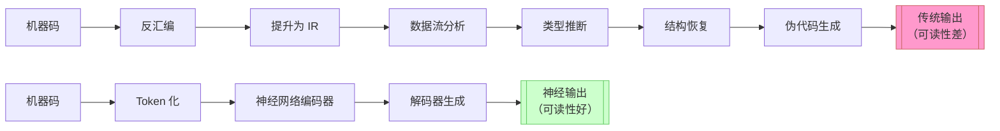
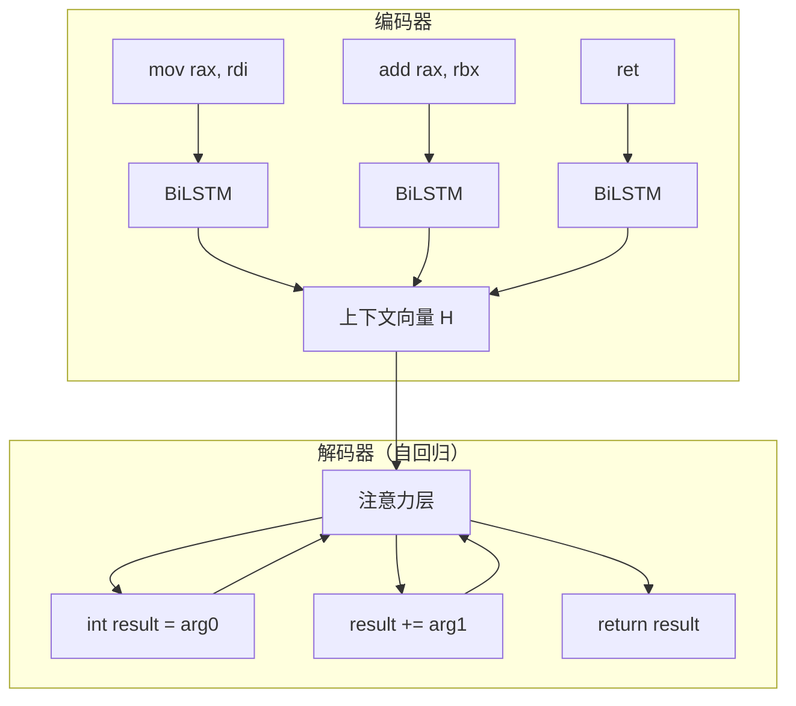
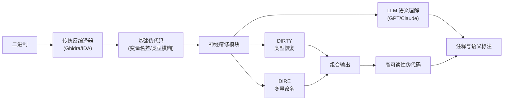

---
tags:
  - 反编译器
  - 反汇编
  - tier3
  - 神经反编译
  - AI逆向
---
# 神经反编译：从 Seq2Seq 到 LLM

> [!abstract] TL;DR
> 神经反编译（Neural Decompilation）是将机器码或汇编序列直接翻译为高质量源代码的机器学习方法，代表着反编译器研究从"基于规则的 IR 提升"向"数据驱动的端到端翻译"的范式转移。核心路线分三代：早期 Seq2Seq 模型（Coda、N-Bref）证明可行性；Transformer 时代（DIRTY、DIRE、Nova、SLaDe）在变量命名/类型恢复等子问题上超越传统工具；大模型时代（LLM4Decompile、GPT/Claude 提示链）通过微调或提示工程实现混合增强管线。与第 15 章（LLM 辅助逆向实战）的核心区别在于：本章关注的是"神经网络如何替代或增强传统反编译管线"的**原理与研究**，而非"如何用 ChatGPT 帮你理解代码"的**应用技巧**。

## 概述与定位

### 为什么需要神经反编译

传统反编译器（IDA Hex-Rays、Ghidra、Binary Ninja）经过数十年工程积累，在控制流恢复、类型推断、结构恢复等方面已相当成熟，但它们产出的伪代码有几个长期痛点难以根治：

**可读性差**：变量名形如 `v3`、`v_28`、`a1`，局部变量类型大量标注为 `__int64` 或 `BYTE *`，函数名为 `sub_140001A20`。逆向工程师在理解一个函数的语义前，往往需要花大量时间手动重命名、标注类型、推断用途。

**语义损失**：编译器在优化过程中销毁了大量高级语义——循环归纳变量被展开、内联函数消失、原始变量名和类型信息全部被剥离。传统反编译器通过启发式规则和约束传播恢复这些信息，准确率有天花板。

**跨优化级别退化**：O0 编译产物的反编译质量远优于 O3，因为 O3 引入了大量代码变换（LICM、向量化、尾调用优化），破坏了传统模式匹配的前提假设。

**架构特化**：传统工具需要为每个目标架构（x86、ARM、MIPS、RISC-V）分别维护语义提升规则，移植代价高。

神经反编译的出发点是：这些高级语义信息并非真正消失，而是以某种方式编码在二进制序列的统计规律中——编译同一类代码模式的汇编总有相似的结构特征。如果积累足够多的"源代码↔汇编"对，神经网络是否可以学到这种隐式映射？

### 与传统反编译管线的对比



传统管线是一条**确定性的规则管线**，每一步都有明确的语义保证（在管线正确工作时）；神经管线是一条**概率生成管线**，输出是对训练分布的最优猜测，不附带形式化保证。

### 与第 15 章的边界

第 15 章（AI 辅助逆向与反编译器实战综合）讨论的是：如何将 ChatGPT、Claude 等通用 LLM 作为分析助手——给它 IDA 产出的伪代码，让它解释语义、重命名变量、识别算法。这是**应用层的工具使用**，LLM 在其中扮演"聪明的读者"角色。

本章讨论的是：如何训练专用模型，让模型**直接从汇编/机器码生成**比传统反编译器质量更高的 C 代码——这是**原理层的系统研究**，模型在其中扮演"反编译器替代品或增强器"角色。两者的输入不同（后者输入的是汇编/机器码，前者输入的是已有伪代码）、训练范式不同、评估指标不同。

---

## 原理与机制

### 问题形式化

神经反编译可以被形式化为**序列到序列翻译**（Sequence-to-Sequence Translation）问题：

- **输入**：汇编指令序列 $A = (a_1, a_2, \ldots, a_n)$，其中每个 $a_i$ 是一条汇编指令的 token 序列
- **输出**：源代码 token 序列 $C = (c_1, c_2, \ldots, c_m)$，通常是 C 语言函数体
- **目标**：学习条件概率分布 $P(C \mid A)$，在训练数据上最大化对数似然

这个框架与机器翻译（英语→法语）在技术层面高度相似，因此早期工作直接借用了 NMT（Neural Machine Translation）的工具箱。

### 输入表示方式

汇编代码的输入表示是影响模型质量的关键因素，不同工作采用了不同的粒度：

**汇编 Token 级表示**：最直观的方式——将每条汇编指令拆分为操作码（`mov`、`add`、`call`）和操作数（`rax`、`[rsp-8]`、`0x14`）的 token 序列，在词汇表上做 embedding。优点是直接，缺点是操作数中的立即数和地址极为稀疏（每个地址都是一个 OOV token）。

**字节级表示（Byte-Level）**：以原始字节序列作为输入，完全绕过反汇编步骤。SLaDe 等工作采用此方案，理论上消除了反汇编错误的影响；实践中需要更长的序列（x86 指令平均 3.5 字节），注意力开销成倍上升。

**微码/中间表示（IR）级**：在反汇编之后、进入神经网络之前，先用传统工具将汇编提升为 LLVM-IR、VEX-IR 或 P-Code，再对 IR token 做嵌入。好处是 IR 已经消除了大量架构特异性（寄存器别名、变长指令），让模型更容易泛化到多架构；Nova 框架采用了这条路线。

**规范化处理**：无论哪种表示，都需要将立即数地址替换为占位符（`ADDR_0`、`ADDR_1`），将字符串字面量替换为 `STR_TOKEN`，以缓解数据稀疏问题。有些工作还对寄存器做重命名规范化，使函数入参总是以 `%arg0`、`%arg1` 的形式出现。

### Seq2Seq 架构的工作原理

早期神经反编译使用经典的编码器-解码器（Encoder-Decoder）架构：

**编码器**：通常是双向 LSTM 或 Transformer 编码器，将输入 token 序列 $A$ 映射为一个上下文向量序列 $H = (h_1, h_2, \ldots, h_n)$，每个 $h_i$ 捕捉了该位置的局部语义以及对整个序列的全局理解。

**解码器**：自回归地生成输出 token——在每个步骤 $t$，基于已生成的 token $(c_1, \ldots, c_{t-1})$ 和编码器输出 $H$，通过注意力机制选择最相关的编码器状态，预测下一个 token $c_t$。

**注意力机制**：让解码器在生成每个输出 token 时"关注"输入序列的不同位置。在反编译任务中，生成变量声明时关注参数传递指令、生成循环体时关注分支跳转指令——这种对齐关系是模型隐式学习的。



### Transformer 架构的优势

自 2017 年 Transformer（Attention is All You Need）问世后，大多数神经反编译工作迁移到了 Transformer 架构。关键优势：

**并行训练**：LSTM 必须顺序处理序列，Transformer 通过自注意力机制同时处理所有位置，大幅加速训练。

**长程依赖**：汇编函数中跨数百条指令的依赖关系（如函数开头的参数初始化和结尾的返回值生成）对 LSTM 来说超出了有效捕捉范围，Transformer 的 $O(1)$ 路径长度解决了这个问题。

**预训练可迁移性**：Transformer 预训练（CodeBERT、StarCoder、DeepSeek-Coder）提供了丰富的代码语义先验，在汇编-C 翻译任务上微调时，相比随机初始化收敛更快、质量更高。

---

## 结构/算法/伪代码详解

### 训练数据集构建

神经反编译的数据集核心是**（汇编函数, 源代码函数）对**。构建流程：

```
1. 收集大规模 C/C++ 开源代码库
   （GNU coreutils, LLVM, OpenSSL, Linux kernel, GitHub Top-100k C repos）

2. 用多个编译器 × 多个优化级别交叉编译
   GCC 9/10/11/12 × {-O0, -O1, -O2, -O3, -Os}
   Clang 12/13/14/15 × {-O0, -O1, -O2, -O3, -Os}
   → 每个源函数产生 ~40 个汇编变体

3. 对齐：通过 DWARF 调试信息 (.debug_info/.debug_line) 将
   汇编函数地址映射回源函数，获取精确的行级对应关系

4. 去重：
   (a) 源代码级去重：用 LSH (Locality-Sensitive Hashing) 排除
       近似重复的函数（编辑距离阈值 < 5%）
   (b) 汇编级去重：避免同一汇编序列对应多个语义不同的源函数
       导致训练混乱

5. 过滤：
   - 移除过短函数（< 5 条汇编指令或 < 3 行源代码）
   - 移除含编译器内联的函数（源代码行数与汇编条数比例异常）
   - 移除包含敏感/非标准扩展的函数

6. 划分：按函数名哈希划分训练/验证/测试（防止数据泄露）
   - 同一函数的不同优化级别版本必须在同一分区
```

LLM4Decompile 使用的数据集规模约 4 亿 token 的汇编-C 对；DIRTY 用的是约 78.3 万对训练样本。

### 评估指标体系

神经反编译的评估远比机器翻译复杂，因为"正确"的标准是多维度的：

**编辑距离（Edit Distance / BLEU）**：衡量生成的 C 代码与原始源代码的 token 级相似度。BLEU-4 是早期工作的主要指标，但已被证明与实际可用性关联弱——一个函数可以有多种等价写法，编辑距离全不同但语义完全相同。

**可编译率（Compilability Rate）**：将生成的代码交给 GCC/Clang 编译，统计编译成功率。这是基线质量门槛——不能编译的代码对逆向工程师没有直接价值。LLM4Decompile 在 HumanEval-Decompile 基准上报告可编译率接近 100%（经过格式后处理）。

**语义等价（Semantic Equivalence）**：
- **测试通过率**：如果有函数的测试用例，检查生成代码是否通过全部测试。HumanEval-Decompile 使用 HumanEval 数据集的测试用例评估反编译结果是否能通过原始编程问题的测试。
- **SMT 等价验证**：将生成的 C 函数和原始二进制编译为 LLVM-IR，用 Alive2 风格的等价验证器（或 KLEE 符号执行）检查所有输入路径上的语义是否一致。这是最严格的指标，但计算代价高。
- **再编译-再反汇编一致性（Re-decompile Consistency）**：将生成的 C 代码重新编译为二进制，与原始二进制做 BinDiff 比较——如果差异极小，说明生成代码在功能上近似等价。

**CodeBLEU**：在标准 BLEU 基础上加入语法树（AST）结构匹配和数据流匹配权重，对代码场景更敏感。DIRTY 和 Nova 使用了这个指标。

**变量命名准确率（Token-level Variable Name Accuracy）**：针对变量命名子任务（DIRE/DIRTY），统计生成变量名与原始变量名匹配的比例（精确匹配、词根匹配）。

### 代表算法：DIRTY 的类型恢复机制

DIRTY（USENIX Security 2022）专注于**变量类型恢复**子问题，而非端到端生成。其架构设计精巧：

**问题定义**：给定 Hex-Rays 已经生成的伪代码（已有变量存在，但类型标注为 `__int64` 等模糊类型），预测每个变量的精确类型（`int32_t`、`struct sockaddr *`、`char[32]` 等）。

**输入特征**：
```
对于每个待预测变量 v：
  - v 的使用上下文：以 v 为中心，取前后 k 个 token 的窗口
  - v 的数据流邻居：通过 SSA 分析得到的 def-use 链中的相关变量
  - v 的内存访问模式：是否被解引用、解引用深度、偏移访问模式
```

**模型结构**：双向 Transformer 编码器（类似 BERT），对整个函数伪代码编码后，在每个变量 token 位置做分类预测（多分类到预定义类型词汇表，含约 10,000 个类型）。

**训练目标**：在变量名/类型已知的编译二进制上（通过 DWARF 恢复），最小化类型预测的交叉熵损失。DIRTY 在 x86-64 上的精确类型匹配准确率达到 **52.1%**，相比 Hex-Rays 原生输出提升显著。

### 代表算法：Nova 的架构抽象

Nova 的设计哲学是"先做传统提升，再做神经精修"：

```
传统反编译层：
  机器码 → Ghidra P-Code → 基本块 CFG → 函数体 IR

神经精修层：
  IR 表示 → 图神经网络（GNN）编码 → Transformer 解码 → C 代码

图编码关键设计：
  节点：每个 IR 语句为一个节点
  边类型：
    - 数据流边（def → use）
    - 控制流边（基本块跳转）
    - 支配关系边（支配树父子）
  
  多关系 GNN 对每种边类型使用独立权重矩阵：
  h_v^{(l+1)} = σ( Σ_{r∈R} Σ_{u∈N_r(v)} W_r^{(l)} h_u^{(l)} + W_0^{(l)} h_v^{(l)} )
```

图结构编码的优势：Transformer 对线性序列建模，而汇编函数本质上是一个图（CFG）。Nova 通过 GNN 先对图结构建模，再让 Transformer 处理 GNN 编码后的线性化序列，结合了两者的优势。

### LLM 微调方案：LLM4Decompile

LLM4Decompile（arXiv 2024）是目前规模最大的专用神经反编译模型，有 1.3B、6B、9B 三个尺寸：

**基座选择**：以 DeepSeek-Coder（代码专用 LLM）为基座，而非通用 LLM。代码专用基座在代码语法、语义表示上已有强先验，微调收敛更快。

**微调数据格式**：
```
<系统提示> 将以下汇编代码反编译为 C 源代码。
<汇编输入>
  push rbp
  mov rbp, rsp
  mov [rbp-4], edi
  mov eax, [rbp-4]
  pop rbp
  ret
</汇编结束>
<期望输出>
  int identity(int x) {
      return x;
  }
</期望结束>
```

**两阶段训练**：
- 阶段一：在全量（汇编, C）对上做监督微调（SFT），让模型学习基本的翻译能力
- 阶段二：在通过语义等价验证的高质量子集上做 DPO（Direct Preference Optimization），让模型偏好语义正确的输出而非字面相似的输出

**HumanEval-Decompile 基准结果**：LLM4Decompile-9B 在重编译后测试通过率上超过 Ghidra 和 Hex-Rays 在相同基准上的性能（Hex-Rays 在 O3 上测试通过率约 21%，LLM4Decompile-9B 约 47%）。

### 混合管线设计

实践中最实用的架构不是"纯神经反编译"，而是**传统反编译 + 神经精修**的混合管线：



这种架构的优势：
- 传统反编译器提供结构骨架（CFG、基本块、控制流），神经模块补充可读性
- 传统管线的确定性保证了输出不会无中生有代码块
- 神经模块只需处理局部精修问题（每个变量的类型/名称），而非生成整个函数，幻觉风险大幅降低

---

## 工具视角与实战

### 主流工具与研究系统总览

| 系统 | 年份/来源 | 核心贡献 | 输入形式 | 评估指标 |
|------|-----------|----------|----------|----------|
| Coda | ASPLOS 2019 | 首个端到端神经反编译器 | x86 汇编 token | BLEU、编辑距离 |
| N-Bref | ASE 2020 | 多架构神经反编译 | 汇编 token | BLEU、可编译率 |
| DIRE | CCS 2019 | 变量名称恢复 | 伪代码 + 数据流图 | token 级准确率 |
| DIRTY | USENIX Sec 2022 | 变量类型恢复 | 伪代码 token | 类型精确匹配率 |
| Nova | S&P 2023 | GNN + Transformer 混合架构 | P-Code IR | CodeBLEU、测试通过率 |
| SLaDe | PLDI 2023 | 字节级输入、多架构 | 原始字节序列 | 可编译率、BLEU |
| LLM4Decompile | arXiv 2024 | 9B 参数专用 LLM，开源 | x86 汇编 | 测试通过率 |

### LLM4Decompile 实战使用

LLM4Decompile 的开源模型（`LLM4Decompile-9B-V2`）已上传 HuggingFace，可本地部署：

```python
from transformers import AutoTokenizer, AutoModelForCausalLM
import torch

MODEL_NAME = "LLM4Binary/llm4decompile-9b-v2"

tokenizer = AutoTokenizer.from_pretrained(MODEL_NAME)
model = AutoModelForCausalLM.from_pretrained(
    MODEL_NAME,
    torch_dtype=torch.bfloat16,
    device_map="auto"
)

# 汇编输入需要先用 objdump 提取
asm_code = """
push   rbp
mov    rbp,rsp
mov    DWORD PTR [rbp-0x4],edi
mov    eax,DWORD PTR [rbp-0x4]
imul   eax,eax
pop    rbp
ret
"""

prompt = f"# This is the assembly code:\n{asm_code}\n# What is the source code?\n"
inputs = tokenizer(prompt, return_tensors="pt").to(model.device)

with torch.no_grad():
    outputs = model.generate(
        **inputs,
        max_new_tokens=512,
        temperature=0.1,      # 低温度减少幻觉
        do_sample=True,
        pad_token_id=tokenizer.eos_token_id
    )

result = tokenizer.decode(outputs[0][inputs['input_ids'].shape[1]:], skip_special_tokens=True)
print(result)
# 期望输出: int square(int x) { return x * x; }
```

### GPT/Claude 提示链用于混合精修

当本地无条件运行 9B 模型时，可用 GPT-4o 或 Claude 3.5 Sonnet 做伪代码精修：

```python
import anthropic

client = anthropic.Anthropic()

IDA_PSEUDOCODE = """
__int64 __fastcall sub_140001A20(__int64 a1, int a2)
{
  __int64 v3;
  int v4;
  
  v3 = *(_QWORD *)(a1 + 8);
  v4 = *(int *)(a1 + 0x10);
  if ( v4 >= a2 )
    return -1LL;
  *(int *)(a1 + 0x10) = v4 + 1;
  return v3 + 4LL * v4;
}
"""

message = client.messages.create(
    model="claude-opus-4-5",
    max_tokens=1024,
    messages=[
        {
            "role": "user",
            "content": f"""你是逆向工程专家。以下是 IDA Pro 反编译的伪代码，
请推断变量语义并重写为可读的 C 代码，添加合理的变量名、类型和注释：

{IDA_PSEUDOCODE}

要求：
1. 保持语义等价，不要改变逻辑
2. 根据偏移量推断结构体字段含义
3. 给出你的推断依据"""
        }
    ]
)
print(message.content[0].text)
```

这里 Claude 的作用是"语义理解增强"，而非"端到端反编译"——它接收已有伪代码，而非原始汇编。这正是第 15 章与本章的分工边界。

### 评估基准：HumanEval-Decompile

HumanEval-Decompile 是目前最广泛使用的神经反编译评估基准：

**构建方法**：
1. 取 HumanEval 中 164 道编程题的参考 C 实现
2. 用 GCC 以 {O0, O1, O2, O3} 四个优化级别编译
3. 用 objdump 提取汇编代码
4. 将汇编代码喂给待评估系统（神经反编译器或传统反编译器）
5. 将生成的 C 代码提交给 HumanEval 评测器，统计通过率

**结果解读**：通过率反映的是"反编译输出的代码能否正确解决原始编程问题"，比纯文本相似度更能反映实际可用性。但该基准的局限是函数普遍较短（平均 15 行），对长函数（数百行）的泛化性仍是开放问题。

---

## 安全性与正确使用

### 幻觉风险与正确性保证

神经反编译最核心的安全风险是**幻觉（Hallucination）**：模型可能生成语法正确、看起来合理，但与原始二进制语义不同的代码。这种错误的危险性在于：

**无提示的静默错误**：传统反编译器在无法确定语义时，通常会生成明显的占位符（`UNKNOWN`、`??`）或保留 IR 形式。神经模型则会以高置信度生成错误内容，没有警告信号。

**局部正确全局错误**：模型可能生成的函数在单元测试上通过（局部行为正确），但在特定边界条件或调用上下文中语义错误。特别是对于带副作用的函数（修改全局变量、操作文件描述符），这种错误极难在 HumanEval 风格的基准上被发现。

**优化级别退化**：所有神经反编译系统在 O3 优化级别上的性能都显著低于 O0。O3 引入的循环向量化（SIMD 指令序列）、尾调用优化、内联扩展极难被神经模型正确还原。

**必要的验证措施**：在逆向工程实践中使用神经反编译输出时，应始终执行以下核验步骤：

1. **功能测试**：如果能构造测试向量（例如知道函数的输入/输出语义），对生成的 C 代码重新编译并测试
2. **动态比对**：在同一输入集上运行原始二进制和重编译后的神经反编译输出，比较行为
3. **关键路径手工核查**：安全相关的代码路径（密码算法、权限检查、内存分配）必须人工核验，不可盲信神经输出
4. **传统工具交叉验证**：对神经反编译结果，用 Ghidra/IDA 的传统输出做 diff，标注差异点并逐一分析

### 长函数的局限性

目前所有神经反编译系统对长函数（>100 条汇编指令、>50 行代码）的处理质量都显著下降，原因是：

- Transformer 的注意力开销是 $O(n^2)$（序列长度的平方），长函数超出了实践中能承受的上下文窗口
- 长函数包含更复杂的控制流（多重嵌套循环、异常处理），统计规律的复杂度超过了训练数据的覆盖密度
- 训练数据中长函数样本稀少（大多数开源函数较短），导致长尾覆盖不足

工程上通常的解决方案是按基本块分段处理，但这丢失了跨块的上下文依赖，严重影响类型推断和变量追踪的质量。

### 知识产权风险

神经反编译用于恢复受版权保护的软件源代码时，面临与传统反编译相同的法律风险——在大多数司法管辖区，反编译受保护软件需要满足"为实现互操作性"等特定豁免条件。神经反编译不因使用了机器学习技术而获得额外的豁免；如果使用神经模型分析专有软件，需遵循与传统反编译工具相同的合规原则。

---

## 小结

神经反编译在过去五年经历了从"实验性可行性论证"到"部分场景超越传统工具"的跨越。技术演进脉络清晰：

- **2019-2020（Seq2Seq 时代）**：Coda、N-Bref 证明神经网络可以执行汇编→C 翻译，BLEU 指标可观，但可编译率和语义正确率较低
- **2021-2023（子问题攻坚时代）**：DIRE、DIRTY、Nova 放弃端到端幻想，专注于变量命名、类型恢复等可量化的子问题，在这些子问题上系统性超越传统工具
- **2024-（大模型时代）**：LLM4Decompile 将大规模预训练与专用微调结合，在 HumanEval-Decompile 上实现端到端质量的新高水位

然而，关键局限依然存在：语义正确性无形式化保证、长函数性能退化、O3 优化代码处理困难。这些局限决定了神经反编译在可预见的将来仍是对传统工具的**增强**而非**替代**——最佳实践是传统反编译器提供结构骨架，神经模块补充可读性，人工分析师做最终验证。

对逆向工程研究者而言，神经反编译是目前最活跃的研究方向之一，评估指标、训练数据构建方法和模型架构仍在快速迭代；对逆向工程师而言，它是一个有价值的辅助工具，但任何输出都需要保持合理的怀疑态度。

---

## 相关阅读

- **Coda**（ASPLOS 2019）：Katz et al.，「Beyond the C: Retargetable Decompilation using Neural Machine Translation」——神经反编译奠基之作
- **DIRE**（CCS 2019）：Lacomis et al.，「DIRE: A Neural Approach to Decompiled Identifier Renaming」——变量命名恢复开山论文
- **DIRTY**（USENIX Security 2022）：Chen et al.，「DIRTY: Augmenting Decompiler Output with Learned Variable Names and Types」——类型恢复最佳参考
- **Nova**（IEEE S&P 2023）：Jiang et al.，「Nova: Generative Language Models for Assembly Code with Hierarchical Attention and Contrastive Learning」
- **SLaDe**（PLDI 2023）：Armengol-Estapé et al.，「SLaDe: A Portable Small Language Model Decompiler for Optimized Assembly」——字节级输入设计参考
- **LLM4Decompile**（arXiv 2024）：Tan et al.，「LLM4Decompile: Decompiling Binary Code with Large Language Models」——HuggingFace 开源模型
- **HumanEval-Decompile 基准**：附于 LLM4Decompile 论文，GitHub 可下载评估脚本
- **第 15 章**（AI 辅助逆向与反编译器实战综合）：本系列，LLM 应用层辅助的实战技巧
- **第 6 章**（类型推断与结构恢复）：本系列，传统类型推断的约束传播原理
- **第 4 章**（SSA 形式与 Phi 函数）：本系列，DIRTY/DIRE 依赖的数据流分析基础

[[00.反编译器与反汇编引擎原理总览|⬆ 系列总览]] | [[18.MBA混淆原理与自动化反混淆|← 上一章]] | [[20.深度学习二进制相似性|→ 下一章]]
