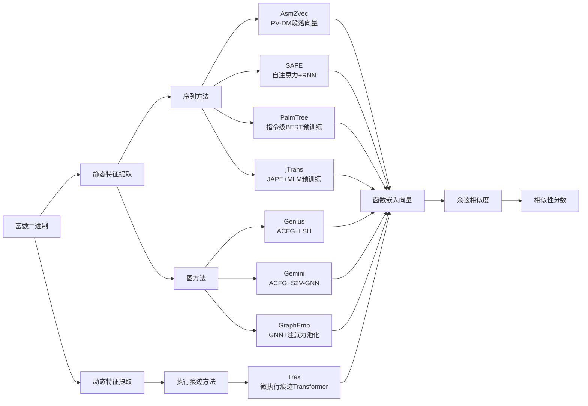
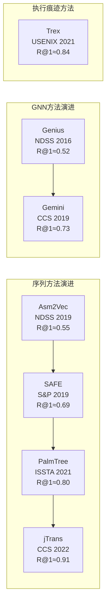

---
tags:
  - 反编译器
  - 反汇编
  - tier3
  - 二进制相似性
  - 深度学习
---
# 深度学习二进制代码相似性

> [!abstract] TL;DR
> 二进制代码相似性检测（Binary Code Similarity Detection，BCSD）要解决的核心问题是：**给定两个从未见过彼此源码的二进制函数，判断它们在语义上是否等价或近似等价**。传统方法（BinDiff/Diaphora，见第12章）依赖图同构和语法特征，跨架构、跨优化级别时精度骤降。深度学习方法通过将函数映射为固定维度的向量（嵌入/embedding），把相似性问题转化为向量空间中的距离计算，从根本上绕开了架构差异。本章系统讲解从 Asm2Vec、SAFE、Gemini/GNN，到 jTrans、PalmTree、Trex 的完整技术演进，覆盖 Ghidra BSim 的工程实现，以及漏洞搜索、补丁比对、供应链组件识别等工业应用场景。

## 概述与定位

### 为什么传统方法不够用

第12章介绍的 BinDiff 采用"四轮匹配"流程：哈希匹配 → 函数名匹配 → CFG拓扑匹配 → 邻居传播。这套方法在以下场景面临根本性局限：

**跨架构比对**：x86-64 编译的 OpenSSL `RSA_verify` 和 ARM64 编译的同名函数，CFG 结构在寄存器分配、指令编码、调用约定上差异巨大，基于语法的图匹配几乎失效。

**跨编译器/优化级别**：同一份 C 源码在 `gcc -O0` 和 `clang -O3` 下生成的函数体积、基本块数量、内联展开程度差异可能超过5倍。BinDiff 的图编辑距离算法无法应对如此剧烈的结构变形。

**大规模1-day漏洞搜索**：CVE-2021-44228（Log4Shell）爆发后，安全团队需要在数万个固件镜像中批量扫描是否含有受影响的 `log4j` 版本。逐对图匹配的时间复杂度为 O(n²)，面对海量二进制根本不可行。

深度学习方法将每个函数预先编码为一个固定维度向量，查询时只需计算余弦相似度，可支持 ANN（近似最近邻）索引加速，将 O(n²) 问题转化为 O(n) 索引构建 + O(log n) 近似查询。

### 与第12章的技术分野

| 维度 | 传统方法（第12章） | 深度学习方法（本章） |
|------|-------------------|---------------------|
| 核心思路 | 图同构/图编辑距离 | 函数→向量嵌入 |
| 跨架构能力 | 弱（依赖指令语法） | 强（学习语义不变量） |
| 比对速度 | O(n²) 逐对比对 | O(n) 预计算 + ANN 查询 |
| 代表工具 | BinDiff、Diaphora | BSim、Asm2Vec、jTrans |
| 可解释性 | 高（能看到匹配的基本块） | 低（嵌入向量难以解释） |
| 训练数据需求 | 无需训练 | 需要配对数据集 |

### 与系列其他章节的关联

- **第2章（CFG构建）**：ACFG（属性控制流图）是 Gemini 等 GNN 方法的输入，需要扎实的 CFG 构建基础。
- **第11章（符号执行）**：Trex 用微执行（micro-execution）生成执行痕迹作为训练信号，借鉴了符号执行的思路。
- **第12章（BinDiff）**：本章是其深度学习升级版，两者在评估数据集和应用场景上有大量交叉。
- **第39章（固件系列）**：固件中的开源组件识别（OSC-Detect）是 BCSD 最重要的工业应用场景之一，本章方法是其技术基础。

---

## 原理与机制

### 问题形式化

设函数集合为 $\mathcal{F} = \{f_1, f_2, \ldots, f_n\}$，BCSD 的目标是学习一个嵌入函数 $\phi: \mathcal{F} \rightarrow \mathbb{R}^d$，使得：

$$\text{sim}(\phi(f_i), \phi(f_j)) \approx \begin{cases} 1 & \text{if } f_i \text{ 与 } f_j \text{ 语义相似} \\ 0 & \text{otherwise} \end{cases}$$

其中 $\text{sim}$ 通常取余弦相似度：$\text{cos}(\mathbf{u}, \mathbf{v}) = \frac{\mathbf{u} \cdot \mathbf{v}}{\|\mathbf{u}\| \|\mathbf{v}\|}$。

**训练信号来源**：同一 C 源码用不同编译器/架构/优化级别编译生成的函数对构成正样本（语义相同但语法不同），不同函数对构成负样本。

### 对比学习框架

绝大多数 BCSD 方法采用对比学习（Contrastive Learning）训练框架：

**Triplet Loss**：对每个锚点函数 $f_a$，选一个正样本 $f_p$（语义相似）和一个负样本 $f_n$（语义不同），最小化：
$$\mathcal{L}_{\text{triplet}} = \max(0, \|\phi(f_a) - \phi(f_p)\|_2 - \|\phi(f_a) - \phi(f_n)\|_2 + \alpha)$$

其中 $\alpha$ 为边距超参数（margin），通常取 0.3~0.5。

**对比损失（InfoNCE/NT-Xent）**：jTrans 等新方法使用温度参数化的 Softmax 对比损失，效果优于 triplet loss：
$$\mathcal{L}_{\text{InfoNCE}} = -\log \frac{\exp(\phi(f_i)^\top \phi(f_j^+) / \tau)}{\sum_{k=1}^{N} \exp(\phi(f_i)^\top \phi(f_k) / \tau)}$$

### 函数表示的三种范式

**序列表示**：将函数的汇编指令序列（或基本块序列）直接作为输入，用 NLP 模型（RNN、Transformer）处理。优点是简单直接，缺点是忽略了控制流结构。代表：Asm2Vec（PV-DM 段落向量）、SAFE（自注意力）、PalmTree（BERT预训练）、jTrans（Jump-aware Transformer）。

**图表示**：将函数的控制流图（CFG）作为输入，用图神经网络（GNN）处理。优点是保留了控制流拓扑，缺点是 GNN 表达能力受 Weisfeiler-Lehman 定理限制。代表：Gemini（ACFG + Siamese 网络）、Genius、GraphEmb。

**执行痕迹表示**：通过符号执行或微执行获取函数的动态行为特征，作为训练信号或输入特征。代表：Trex（微执行痕迹 Transformer）。

---

## 结构/算法/伪代码详解

### Asm2Vec：段落向量嵌入（NDSS 2019）

Asm2Vec 是首批将 Word2Vec 范式引入二进制相似性的方法之一，由香港大学在 NDSS 2019 发表。其核心思想是借用 PV-DM（Distributed Memory Model of Paragraph Vectors）——NLP 中学习文档向量的算法——将函数视为"段落"，汇编指令视为"词"。

**ACFG 随机游走**：Asm2Vec 并不是简单地将指令序列化处理，而是先在函数的 CFG 上做随机游走生成多条路径，每条路径对应一个"上下文序列"，再在所有路径上联合训练。

**指令分词**：每条汇编指令被拆分为操作符（opcode）和操作数（operand）两类词元。操作数按类型规范化：立即数统一替换为 `imm`，内存地址替换为 `mem`，寄存器保留原名（因为寄存器选择反映了编译器的分配策略，有区分价值）。

**PV-DM 训练目标**：给定当前函数的段落向量 $\mathbf{p}_f$ 和上下文指令的词向量，预测中心指令的概率：
$$P(t_c | t_{c-k}, \ldots, t_{c+k}, \mathbf{p}_f) = \text{Softmax}(W \cdot \text{concat}(\mathbf{p}_f, \mathbf{t}_{ctx}))$$

**跨架构归一化的局限**：由于 Asm2Vec 保留了寄存器名，跨架构时 x86 的 `rax` 和 ARM 的 `x0` 在词汇表中是完全不同的词，导致跨架构场景下性能下降显著。后续工作普遍在这一点上做了改进。

```
算法：Asm2Vec 训练（伪代码）
输入：函数集合 F = {f_1, ..., f_n}，CFG 图
输出：函数嵌入向量 P ∈ R^(n×d)

1. for each f_i in F:
2.     walks = random_walk(CFG(f_i), num_walks=K, walk_len=L)
3.     for each walk in walks:
4.         instrs = normalize_operands(walk)  # 规范化操作数
5.         tokens = split_to_op_tokens(instrs)  # opcode + operand 分词
6.         # PV-DM 滑动窗口更新
7.         for each center_token t_c in tokens:
8.             context = tokens[c-k:c+k]
9.             loss = -log P(t_c | context, p_{f_i})
10.            SGD_update(p_{f_i}, word_vectors)
11. return P
```

**评估结果**：在 x86 跨优化级别（O0 vs O3）场景，Asm2Vec 的 Recall@1 约为 0.71，显著优于 BinDiff 的 0.43。但在 x86 vs ARM 的跨架构场景，性能下降至约 0.55。

### SAFE：自注意力函数嵌入（S&P 2019）

SAFE（Self-Attentive Function Embeddings）由 IEEE S&P 2019 提出，用自注意力机制替代了 Asm2Vec 的段落向量模型，并引入了更彻底的操作数归一化策略。

**指令归一化策略**：SAFE 将所有指令的操作数按语义类别统一为 12 个符号：`[REG]`（寄存器）、`[MEM]`（内存引用）、`[IMM]`（立即数）、`[STR]`（字符串地址）等。这种激进的归一化牺牲了部分精度，但大幅提升了跨架构泛化能力。

**RNN + 自注意力架构**：

```
函数 → 规范化指令序列
      → 双向 LSTM（捕获局部上下文）
      → 自注意力层（加权聚合全序列信息）
      → 全局平均池化
      → 函数嵌入向量 ∈ R^100
```

自注意力权重矩阵：
$$\mathbf{A} = \text{Softmax}(W_2 \cdot \tanh(W_1 \cdot H^\top))$$
$$\mathbf{M} = \mathbf{A} \cdot H$$

其中 $H \in \mathbb{R}^{T \times d}$ 为 LSTM 的所有时刻隐状态，$\mathbf{A} \in \mathbb{R}^{r \times T}$ 为多头注意力权重（$r$ 为注意力头数），$\mathbf{M} \in \mathbb{R}^{r \times d}$ 为加权表示，最终 flatten 为函数嵌入。

**Siamese 网络训练**：SAFE 用 Siamese（孪生）网络结构训练，两个权重共享的编码器分别处理函数对 $(f_i, f_j)$，用余弦相似度和 margin-based loss 拉近正样本、推开负样本。

### Gemini 与 GNN 方法：ACFG 图嵌入

Gemini（CCS 2019，华中科技大学）是首个将图神经网络系统应用于 BCSD 的工作，引入了 ACFG（Attributed Control Flow Graph，属性控制流图）概念，后来成为该领域的标准输入格式。

**ACFG 定义**：在普通 CFG 基础上，为每个基本块节点附加一个属性向量，包含：
- 基本块中的指令数（长度特征）
- 数值常量（立即数）的统计量（均值、最大值）
- 字符串常量的数量
- 转移指令（call/jmp/ret）的数量
- 算术指令的数量
- 逻辑指令的数量

这些手工特征刻画了基本块的"语义密度"，且相对架构无关（x86 的 `add eax, 1` 和 ARM 的 `add x0, x0, #1` 都会增加算术指令计数）。

**Structure2Vec 图嵌入**：Gemini 使用 Structure2Vec（S2V）聚合 ACFG 节点特征：

```
# 节点特征初始化
h_v^(0) = MLP(x_v)  # x_v 为节点属性向量

# 消息传递（T 轮迭代）
for t in range(T):
    for each node v:
        # 聚合邻居特征
        agg = sum(h_u^(t-1) for u in neighbors(v))
        h_v^(t) = F(x_v, agg)  # F 为参数化函数

# 图级别嵌入（全局求和池化）
h_G = sum(h_v^(T) for v in nodes)
```

**Genius（NDSS 2016）的先驱工作**：Genius 是 Gemini 的前驱方法，同样基于 ACFG，但使用 LSH（局部敏感哈希）和 K 近邻图代替 GNN，是将图表示引入 BCSD 的开创性工作。

**GNN 方法的天花板问题**：GNN 的表达能力受 1-WL（Weisfeiler-Lehman 图同构测试）限制——两个结构上不可区分的子图会得到相同的嵌入。对于 CFG 中常见的菱形控制流模式（if-then-else），GNN 可能无法区分条件成立和不成立两条路径。后续工作（如 OrderedGNN、GraphTrans）通过引入位置编码或 Transformer 来突破这一限制。

### jTrans：Jump-Aware Transformer（CCS 2022）

jTrans（清华大学，CCS 2022）是目前在跨架构 BCSD 基准上综合性能最强的方法之一，其核心创新是将控制流跳转信息编码进 Transformer 的位置嵌入，同时引入 MLM（掩码语言模型）预训练。

**跳转感知位置编码（Jump-Aware Positional Embedding, JAPE）**：

传统 Transformer 用绝对或相对位置编码处理序列。jTrans 观察到：汇编指令的线性顺序与控制流顺序不一定一致（跳转指令会改变执行顺序），因此设计了 JAPE，将跳转目标和跳转来源信息编码进位置嵌入：

```
对于指令 i，位置嵌入为：
PE(i) = Embedding(linear_pos(i))
      + Embedding(jump_target_of(i))   # 若 i 是跳转指令
      + Embedding(jump_source_of(i))   # 若 i 是跳转目标

若某项不存在，对应 Embedding 输出为 0 向量
```

这样 Transformer 的注意力机制不仅能看到指令的线性顺序，也能感知控制流的跳转结构，相当于将 CFG 信息隐式编码进了序列模型。

**两阶段训练**：

第一阶段（预训练）：在大规模未标注的二进制函数上做 MLM 预训练，随机遮盖 15% 的 token（指令或操作数），让模型学习预测被遮盖的内容。这赋予了模型对汇编指令语义的深层理解，不依赖配对标注数据。

第二阶段（微调）：在正负样本对上用对比损失（NT-Xent）微调，学习相似性判断能力。

```
jTrans 完整架构（伪代码）：

# 预处理
function_tokens = []
for bb in cfg(f).topological_sort():
    for instr in bb:
        opcode_tok = vocab[normalize_opcode(instr.mnemonic)]
        for operand in instr.operands:
            operand_tok = vocab[normalize_operand(operand)]
        jump_pe = compute_jape(instr, cfg(f))
        function_tokens.append((opcode_tok, operand_tok, jump_pe))

# 编码
hidden = Transformer(function_tokens, JAPE)  # 12层, d=768

# 池化（CLS token 策略）
embedding = hidden[CLS_token]  # 取 [CLS] 位置的隐状态

# 对比损失（NT-Xent）
loss = -log(exp(sim(e_a, e_p)/τ) / Σ_k exp(sim(e_a, e_k)/τ))
```

**评估**：在 XO-Bench 数据集（跨架构：x86/x64/ARM/MIPS）上，jTrans 的 Recall@1 达到约 0.91，比 Gemini 的 0.73 和 SAFE 的 0.69 有显著提升。

### PalmTree：跨平台预训练（ISSTA 2021）

PalmTree（浙江大学，ISSTA 2021）专注于**指令级别**的预训练，先学习好每条汇编指令的向量表示，再用于函数级别的下游任务。

**三种预训练任务**：

1. **MLM（掩码指令预测）**：同 jTrans，随机遮盖指令预测。
2. **Context-aware Instruction Embedding（CIE）**：给定一条指令的上文和下文，预测该指令的嵌入向量，使得上下文相似的指令（执行相同操作的不同写法）嵌入相近。
3. **Def-Use Prediction（DUP）**：对于一对具有定义-使用关系的指令（前一条指令定义了一个变量，后一条指令使用了它），预测它们之间存在此关系。DUP 将数据流信息注入预训练，使模型对指令语义的理解更准确。

PalmTree 的核心贡献是证明了**指令级别的预训练可以迁移到函数级别的相似性任务**，且泛化性更好，因为指令表示是在所有函数的所有指令上联合训练的，比函数级别的监督数据量大几个数量级。

### Trex：微执行痕迹 Transformer（USENIX Security 2021）

Trex（CMU，USENIX Security 2021）提出了与上述所有方法截然不同的思路：不用静态特征（指令序列/CFG），而是用**微执行（micro-execution）生成动态执行痕迹**作为训练信号。

**微执行（Micro-Execution）**：Trex 借鉴了微执行技术（类似轻量级符号执行），对每个函数在随机初始化的寄存器状态下执行若干步，记录每一步的：
- 执行的指令（opcode）
- 各寄存器的值（或值的类型：整数/指针/浮点）
- 内存访问模式（读/写地址的偏移量）

这种"执行痕迹"捕获了函数的**动态行为语义**，而非静态语法结构。两个来自不同架构的函数，如果执行相似的计算步骤（例如都在循环中累加数组元素），它们的执行痕迹在语义上会高度相似，即使汇编语法完全不同。

**Transformer 处理痕迹**：执行痕迹被格式化为 token 序列，输入标准 Transformer 进行预训练（MLM）和对比微调。

**局限性**：微执行需要实际运行代码，对于依赖外部库调用或特定输入才能执行的函数（如网络请求处理函数），执行痕迹可能不完整或不具代表性。Trex 对这类函数的性能有所下降，且执行痕迹生成本身有计算开销。

### 方法对比总览



---

## 工具视角与实战

### Ghidra BSim：工业级 BCSD 引擎

BSim（Binary Similarity）是 Ghidra 自带的函数相似性搜索模块，是深度学习 BCSD 方法在主流商业级逆向工具中最成熟的工业实现。

**BSim 的技术架构**：

BSim 并不直接使用汇编序列，而是基于 Ghidra 的 P-Code 中间表示（见第8章）计算函数的规范化哈希。具体流程：

1. **P-Code 规范化**：Ghidra 将函数反编译为 P-Code，BSim 对 P-Code 进行规范化处理，消除架构相关性（寄存器名、调用约定差异）。
2. **LSH 特征哈希（SimHash）**：BSim 对规范化 P-Code 应用局部敏感哈希（SimHash），生成函数指纹。SimHash 保留了相近函数指纹相近的性质，且生成极快。
3. **分层索引**：BSim 维护一个 PostgreSQL 数据库，函数指纹按二进制文件组织，支持高效的近似最近邻查询。

**BSim 数据库操作**：

```python
# BSim Python API（Ghidra 脚本环境中使用）
from ghidra.features.bsim.query import BSimClientFactory, BSimQuery

# 连接 BSim 数据库
factory = BSimClientFactory.newClient(
    "postgresql://localhost/bsimdb", "user", "password"
)
database = factory.connect()

# 将当前程序的函数插入数据库（建立索引）
program = getCurrentProgram()
query_with_callgraph = database.generateSignatures(program, monitor)
database.commitSignatures(query_with_callgraph, monitor)

# 查询相似函数
function = getFunctionContaining(currentAddress)
result = database.querySimilarFunctions(
    function,
    similarity_threshold=0.7,
    significance_threshold=0.05,
    max_results=100,
    monitor=monitor
)

for match in result:
    print(f"匹配函数: {match.getFunctionName()}")
    print(f"  所在二进制: {match.getExecutableName()}")
    print(f"  相似度: {match.getSimilarity():.3f}")
    print(f"  置信度: {match.getSignificance():.3f}")
```

**headless 批量索引**（固件批量扫描场景）：

```bash
# 批量将固件镜像中的函数索引到 BSim 数据库
analyzeHeadless /ghidra_projects batch_proj \
  -import /firmware/*.bin \
  -postScript BSimAnalyzeHeadless.java \
      "postgresql://bsim-server/firmware_db" \
      "auto" \
      "X86:LE:64:default:gcc" \
  -scriptPath /ghidra_scripts \
  -noanalysis  # 若已预先分析

# 批量查询：在所有已索引函数中搜索目标函数的相似函数
analyzeHeadless /ghidra_projects query_proj \
  -process target_binary.bin \
  -postScript BSimQueryHeadless.java \
      "postgresql://bsim-server/firmware_db" \
      "0.8"  # 相似度阈值
```

### 1-Day 漏洞搜索实战流程

以 CVE-2023-28252（Windows CLFS 驱动内核提权漏洞）为例，说明 DL-BCSD 的完整漏洞搜索流程：

```
步骤 1：获取补丁前后的 clfs.sys
├── 补丁前：Windows 10 21H2 累积更新 KB5025221 发布前的版本
└── 补丁后：KB5025221 安装后的 clfs.sys

步骤 2：定位补丁修改的函数（BinDiff 初筛）
├── BinDiff 对比两个版本，找出相似度 < 1.0 的函数（约 3~8 个）
└── 人工审查确认漏洞函数：CClfsBaseFilePersisted::WriteMetadataBlock

步骤 3：提取漏洞函数嵌入
├── 用 jTrans/BSim 对漏洞函数（补丁前版本）生成嵌入向量
└── 同时生成 x86、ARM（Windows on ARM）、x64 版本的嵌入

步骤 4：大规模相似性搜索
├── 在固件库（工控系统驱动、IoT 驱动）中搜索语义相似函数
├── 使用 Faiss ANN 索引（IVF + PQ 量化）支持百万级函数搜索
└── 阈值过滤：余弦相似度 > 0.85 的函数进入下一步

步骤 5：人工验证与漏洞确认
├── 检查匹配函数是否有类似的边界检查缺失
└── 用 Ghidra/IDA 反编译对比，确认是否为同源代码
```

**Faiss 索引集成示例**：

```python
import faiss
import numpy as np

# 假设已用 jTrans 模型生成了函数嵌入
# embeddings: np.array, shape (N, 768)，N 为函数总数
# function_metadata: list of (binary_name, func_name, func_addr)

# 构建 IVF+PQ 索引（适合百万量级）
d = 768  # 嵌入维度
nlist = 1000  # 聚类数
m = 32   # PQ 子量化器数
quantizer = faiss.IndexFlatIP(d)  # 内积（等价于 L2 归一化后的余弦）
index = faiss.IndexIVFPQ(quantizer, d, nlist, m, 8)

# 归一化嵌入（为了使内积等于余弦相似度）
faiss.normalize_L2(embeddings)

# 训练并添加
index.train(embeddings)
index.add(embeddings)

# 查询：搜索与目标函数最相似的 top-K 函数
query_embedding = np.array([target_func_embedding])
faiss.normalize_L2(query_embedding)
index.nprobe = 50  # 搜索 50 个最近聚类
D, I = index.search(query_embedding, k=100)

# D[0]: 相似度分数，I[0]: 函数在全局列表中的索引
for score, idx in zip(D[0], I[0]):
    if score > 0.85:
        binary, func, addr = function_metadata[idx]
        print(f"候选: {binary}!{func}@{hex(addr)}, 相似度={score:.3f}")
```

### BinDiff 8 的 ML 增强

BinDiff 8（2023年发布）在传统四轮图匹配之上集成了 ML 辅助匹配层。Google 将函数语义嵌入作为辅助特征，在图匹配失败时用嵌入相似度进行后备匹配，尤其对高度优化或混淆的代码改善明显。具体实现未完全开源，但 BinDiff 8 发布文档确认了其集成了基于 Transformer 的函数表示模型。

### 恶意软件家族聚类

BCSD 不仅用于查找相似函数，还可用于**无监督聚类**：将一批未知恶意软件样本的所有函数嵌入，用 HDBSCAN 或 K-means 聚类，相同家族/变种的样本中来自相同功能模块的函数会聚集在一起，从而自动识别恶意软件家族关系。

```python
from sklearn.cluster import HDBSCAN
import numpy as np

# 假设 all_embeddings: (M, 768) 为所有恶意软件样本的函数嵌入
# all_labels: 每个嵌入对应的样本来源（用于事后分析）

faiss.normalize_L2(all_embeddings)

# HDBSCAN 聚类（不需要预设 K 值，能自动发现噪声点）
clusterer = HDBSCAN(
    min_cluster_size=5,
    metric='euclidean',  # L2 归一化后 L2 ≈ 余弦距离
    cluster_selection_epsilon=0.1
)
cluster_labels = clusterer.fit_predict(all_embeddings)

# 分析每个簇的样本来源分布，识别家族
from collections import Counter
for cluster_id in set(cluster_labels):
    if cluster_id == -1:
        continue  # 噪声点
    cluster_mask = cluster_labels == cluster_id
    sample_dist = Counter(all_labels[cluster_mask])
    print(f"簇 {cluster_id}: {dict(sample_dist.most_common(5))}")
```

### 供应链组件识别（与第39章的衔接）

在固件分析（第39章）场景中，BCSD 用于识别固件中内嵌的开源库版本。例如，某路由器固件中内嵌了一个未公开版本的 OpenSSL，通过将固件中所有函数与 OpenSSL 各历史版本的函数嵌入库比对，可以精确识别出具体版本号（甚至 commit hash 级别）。

代表工具：
- **OSSPolice**（CCS 2017）：早期基于代码特征的开源组件识别，未用 DL 嵌入。
- **B2SFinder**（ISSTA 2020）：首次将 DL 嵌入引入固件开源组件识别。
- **LibAM**（USENIX Security 2022）：基于 ACFG-GNN 的大规模开源库匹配，支持跨架构。
- **Ghidra BSim 工作流**：实践中最常用的方案，见上节 headless 批量索引示例。

---

## 安全性与正确使用

### 误报风险与阈值校准

深度学习 BCSD 方法在实际部署时面临严峻的**误报（False Positive）控制**问题：

**结构性误报**：短小函数（指令数 < 10）在语义空间中距离普遍偏近，因为它们的特征向量信息量少。`memset`、`strlen` 类的标准库函数在不同编译器下生成的汇编形态差异也小，导致大量无关函数被相互匹配。缓解策略：设置函数规模过滤（基本块数 ≥ 5），或对短函数降低相似度权重。

**编译器内置函数干扰**：`__stack_chk_fail`、`__cxa_throw` 等编译器插入函数在所有二进制中几乎完全相同，会造成大量噪声匹配。在索引阶段应过滤这类函数（通过名称黑名单或函数体哈希排除）。

**阈值的精度-召回权衡**：

| 相似度阈值 | 召回率（漏洞搜索） | 误报率 | 适用场景 |
|-----------|-------------------|--------|---------|
| 0.6 | ~0.95 | 高（~30%） | 广撒网，人工复核 |
| 0.75 | ~0.85 | 中（~10%） | 常规漏洞搜索 |
| 0.85 | ~0.70 | 低（~3%） | 精准匹配，低误报优先 |
| 0.90 | ~0.55 | 极低（<1%） | 补丁比对（期望高精度） |

实践建议：在漏洞搜索场景（宁可多报，不能漏报），阈值设为 0.7~0.75；在供应链组件识别（误报成本高），阈值设为 0.85 以上，并结合函数名、文件路径等辅助信息做二次验证。

### 对抗鲁棒性问题

如果攻击者知道防御方使用了特定的 BCSD 模型（如 BSim），可以对二进制进行**对抗性混淆**以躲避检测：

**语义保持的对抗扰动**：通过在函数中插入无语义影响的"垃圾指令"（如 `nop`、`xor eax, eax` 后立即恢复）、交换等价指令（`mov` ↔ `push/pop`）、重排独立基本块的顺序，在不改变函数功能的前提下使嵌入向量漂移。

**研究现状**：CCS 2022 的论文《Adversarial Robustness of Binary Code Similarity Detection」系统测量了主流 BCSD 方法在对抗性混淆下的性能下降，发现 Asm2Vec 的 Recall@1 可从 0.71 降至 0.31，jTrans 的鲁棒性略好（0.85→0.59）。提升对抗鲁棒性是当前 BCSD 领域的活跃研究方向，目前没有成熟的工业级防御方案。

**实用建议**：在高价值目标分析（如 APT 样本分析）时，不应完全依赖 BCSD 结果，必须辅以人工逆向验证，避免被针对性混淆欺骗。

### 法律与合规边界

**漏洞挖掘的授权边界**：BCSD 工具本身是中立的，但用 BSim 在第三方固件中搜索 1-day 漏洞，如果未获得设备厂商授权，在多数司法管辖区属于违法的未经授权计算机访问。安全研究人员应通过漏洞赏金计划（Bug Bounty）或负责任披露（Responsible Disclosure）流程操作。

**供应链组件识别的合规用途**：在本公司产品、客户委托的固件审计、开源合规审计（SCA, Software Composition Analysis）中使用 BCSD 完全合规，也是 SBOM（软件物料清单）生成的重要技术手段。

---

## 评估体系

### 标准评估指标

**Recall@K（前K召回率）**：给定一个查询函数，在数据集中的所有函数中找到最近的 K 个，查看其中是否包含真正的正样本：
$$\text{Recall@K} = \frac{|\{q : \text{真正正样本在前 K 个结果中}\}|}{|\text{查询集}|}$$

Recall@1 是最严格的指标（第一名必须是正样本），实际应用常报 Recall@1、Recall@5、Recall@10。

**MRR（Mean Reciprocal Rank）**：每个查询的第一个正样本排名的倒数，平均值：
$$\text{MRR} = \frac{1}{|Q|} \sum_{q \in Q} \frac{1}{\text{rank}(q)}$$

MRR 对排名靠前的匹配质量更敏感，适合评估"最相关结果放在第几位"。

**ROC-AUC**：将相似性判断视为二分类问题（阈值以上为正，以下为负），绘制不同阈值下的 ROC 曲线，AUC 值衡量整体排序质量。

### 主要评估数据集

**XO-Bench**：跨架构（X = 架构，O = 优化级别）基准，包含 x86、x64、ARM32、MIPS32 四种架构，O0~O3 四种优化级别，从 GNU coreutils、OpenSSL 等开源软件编译生成。共约 2 万个函数，每个函数有最多 16 个跨架构跨优化版本。

**Trex 数据集（PolyFuzz）**：CMU 发布的跨架构跨编译器数据集，包含 GCC、Clang、ICC 三种编译器，x86/x64/ARM/MIPS 四种架构，约 50 万个函数对。

**BCB（Binary Code Dataset）**：面向漏洞搜索评估，包含 CVE 漏洞函数的多个编译版本，评估在真实漏洞搜索场景下的召回率。

**各方法 Recall@1 性能对比（XO-Bench，跨架构场景，数据来自各论文）**：



---

## 小结

深度学习二进制代码相似性检测（BCSD）在过去七年经历了三代技术跃迁：

**第一代（2016~2019）**：Genius、Asm2Vec 奠定基础范式——ACFG 属性控制流图表示和段落向量嵌入，证明了 DL 方法能在跨优化级别场景显著超越传统图匹配方法。核心局限是跨架构能力弱，依赖大量语法特征。

**第二代（2019~2021）**：SAFE、Gemini、Trex 在表示层面大幅改进——SAFE 引入彻底的操作数规范化提升架构无关性，Gemini/GNN 系方法在图结构建模上精细化，Trex 用动态执行痕迹捕获行为语义。这一代方法开始真正支持跨架构场景（Recall@1 达到 0.7~0.85）。

**第三代（2021~至今）**：PalmTree、jTrans 将 BERT 式预训练引入 BCSD，指令/汇编序列作为"语言"，控制流信息作为位置编码，大规模未标注二进制数据作为预训练语料，达到了目前最高的性能水平（Recall@1 > 0.90），同时降低了对标注数据的依赖。

工业落地方面，Ghidra BSim 是最成熟的工程实现，支持大规模固件批量索引和查询。BinDiff 8 开始集成 ML 辅助层，标志着 DL-BCSD 进入主流逆向工具链。

关键未解决问题：
1. **对抗鲁棒性**：面对有目的的混淆对抗，当前最强模型的 Recall@1 可下降 30~40 个百分点。
2. **可解释性**：嵌入向量无法直接告诉逆向工程师"哪里相似"，与 BinDiff 的基本块级别可视化相比仍有差距。
3. **极端优化下的泛化**：Link-Time Optimization（LTO）、全程序优化（WPO）会导致函数边界消失、函数内联融合，使任何基于函数级别嵌入的方法都面临根本性挑战。

---

## 相关阅读

- Xu X. 等，"Neural Network-based Graph Embedding for Cross-Platform Binary Code Similarity Detection"，**CCS 2017**（Gemini）— GNN + ACFG 范式奠基之作
- Ding S.H.H. 等，"Asm2Vec: Boosting Static Representation Robustness for Binary Clone Search against Code Obfuscation and Compiler Optimization"，**IEEE S&P 2019** — PV-DM 段落向量应用于 BCSD
- Massarelli L. 等，"SAFE: Self-Attentive Function Embeddings for Binary Similarity"，**DIMVA 2019** — 自注意力函数嵌入
- Wang H. 等，"jTrans: Jump-Aware Transformer for Binary Code Similarity Detection"，**ISSTA 2022**（含 CCS 2022 版本）— JAPE + MLM 预训练
- Pei K. 等，"Trex: Learning Execution Semantics from Micro-Traces for Binary Similarity"，**USENIX Security 2021** — 微执行痕迹语义建模
- Li Y. 等，"PalmTree: Learning an Assembly Language Model for Instruction Embedding"，**CCS 2021** — 指令级 BERT 预训练
- NSA Ghidra 团队，"BSim: Bulk Function Similarity"，**Ghidra 官方文档** — 工业级 P-Code 相似性实现
- Zuo F. 等，"Neural Machine Translation Inspired Binary Code Similarity Comparison beyond Function Pairs"，**NDSS 2019** — NMT 跨架构相似性
- Liu Y. 等，"Practical Binary Code Similarity Detection with BERT-based Transferable Similarity Learning"，**ACSAC 2022** — BERT 迁移学习 BCSD
- 第12章《BinDiff与代码相似性分析》— 本章的传统方法前驱，理解两者差异的必要背景
- 第39章《固件安全分析》— BCSD 在固件开源组件识别中的应用场景

---

[[00.反编译器与反汇编引擎原理总览|⬆ 系列总览]] | [[19.神经反编译|← 上一章]] | [[21.污点分析引擎|→ 下一章]]
