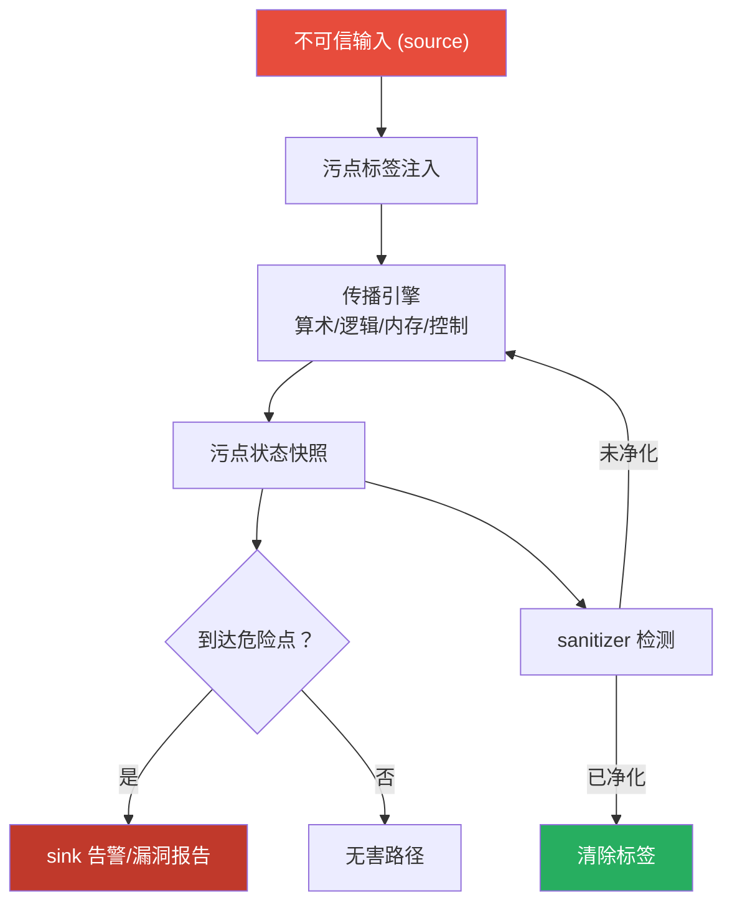
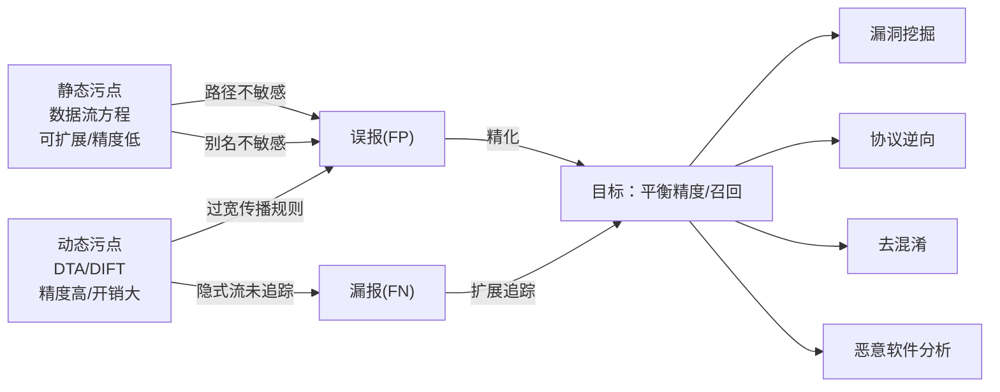

---
tags:
  - 反编译器
  - 反汇编
  - tier3
  - 污点分析
  - 程序分析
---
# 污点分析引擎：原理、实现与逆向应用

> [!abstract] TL;DR
> 污点分析（Taint Analysis）是一种追踪不可信数据在程序中传播路径的程序分析技术。静态污点分析基于数据流方程，无运行时开销但存在路径不敏感等精度损失；动态污点分析（DTA/DIFT）在执行时为每个值附加标签并实时传播，精度高但带来 2–10× 的性能开销。二者共同构成漏洞挖掘（source→危险 sink 的数据流可达性）、协议逆向（字段定位）、恶意软件去混淆的核心引擎。本章系统覆盖：四要素（source/sink/sanitizer/propagation）、传播规则（算术/逻辑/内存/控制依赖）、影子内存（shadow memory）实现、过污染与欠污染的根因、字节敏感精度、过程间扩展，以及 Triton、libdft、angr、PANDA 等工具的工程细节。

## 概述与定位

### 污点分析的历史脉络

污点分析的思想可追溯至 20 世纪 70 年代 Denning 的信息流安全格（lattice model）。在安全研究领域，早期影响最大的工作是 2006 年 Newsome 和 Song 在 S&P 提出的 TaintCheck——基于 Valgrind 的动态污点追踪系统，用于自动生成针对缓冲区溢出的漏洞签名。2010 年 NDSS 的综述论文《All You Ever Wanted to Know About Dynamic Taint Analysis and Forward Symbolic Evaluation》（Schwartz、Avgerinos、Brumley）首次系统梳理了动态污点分析的设计空间，成为该领域最重要的参考文献之一。此后，随着 Intel Pin、Valgrind、QEMU 等二进制插桩框架的成熟，污点分析工具链快速工程化，形成了 libdft（2012，VEE）、Triton（2015）、DECAF、PANDA 等主流实现。

### 在逆向工程工具链中的位置

在系列的知识图谱中，污点分析处于分析层的核心地位：

- 与第 11 章（符号执行）的关系：符号执行维护的是路径约束（path constraints），而污点分析维护的是数据依赖标签（taint tags）。二者互补——concolic 执行将污点分析用于确定哪些输入影响哪些约束（Directed Greybox Fuzzing 的理论基础）。
- 与第 03 章（数据流分析）的关系：静态污点分析本质上是特殊化的数据流分析——将污点集合作为格（lattice）元素，沿 CFG 传播。
- 与第 09 章（反混淆）的关系：动态污点追踪可以识别混淆代码中哪些寄存器/内存位置承载真正的语义值，是 VM 保护逆向的重要辅助手段。



## 原理与机制

### 四要素：source、sink、sanitizer、propagation

**Source（污染源）** 是不可信数据进入程序的入口点。典型的 source 包括：
- 网络套接字读取：`recv()`、`read()` 对网络描述符
- 文件读取：`fread()`、`getenv()`
- 命令行参数：`argv[]`、`envp[]`
- 用户界面输入：Android 的 `getIntent().getStringExtra()`、iOS 的 `URLComponents.query`

在动态污点分析中，source 的实现方式是在对应函数的返回点（或写内存点）向返回值或目标内存区域注入污点标签。在静态分析中，source 是数据流方程的初始值——通常将 source 函数的返回节点标记为 "tainted"。

**Sink（危险汇聚点）** 是程序中对污染数据敏感的操作点。到达 sink 的污染数据意味着潜在的安全风险：
- 格式字符串 sink：`printf(tainted_buf)` → 格式字符串注入
- 内存操作 sink：`memcpy(dst, tainted_src, tainted_len)` → 缓冲区溢出
- 代码执行 sink：`system(tainted_cmd)`、`exec*(tainted_path)` → 命令注入
- SQL sink：`sqlite3_exec(db, tainted_query, ...)` → SQL 注入
- 跳转目标 sink：`call [tainted_reg]`、`jmp [tainted_mem]` → 控制流劫持

**Sanitizer（净化器）** 是程序中对污染数据进行检验或转换的操作，经过 sanitizer 后数据可以视为无害：
- 长度检查：`if (len < MAXBUF) { ... }` — 对后续使用 len 的操作去污
- 格式验证：正则表达式匹配、白名单过滤
- 编码转换：HTML 实体编码、SQL 参数化查询绑定

sanitizer 的精确建模是污点分析最难的部分之一。过于保守（不承认 sanitizer 的去污能力）导致过污染（false positive）；过于激进（错误地将非充分净化视为完全净化）导致欠污染（false negative）。

**Propagation（传播规则）** 定义污点标签如何随数据流动。这是污点分析的核心算法，下一节展开。

### 传播规则的分类与设计

传播规则分为四类：

**算术运算传播（Arithmetic Propagation）**

对于二元运算 `result = op(a, b)`，最常见的策略是并集传播（union propagation）：

```
taint(result) = taint(a) ∪ taint(b)
```

但这会导致过污染。例如 `x = tainted * 0`，结果恒为 0，实际不携带任何输入信息，但并集规则仍然将 result 标记为污染。更精确的做法是对特定模式做常量折叠检测：若能证明某操作数为常量，则去除其对结果的污染贡献。Triton 框架采用基于 AST（抽象语法树）的符号化污点，能够处理部分这类情形。

**逻辑运算传播（Logical/Bitwise Propagation）**

逻辑运算需要字节敏感甚至位敏感的传播策略：

```
taint(a AND b) = taint(a) ∩ active_bits(b) ∪ taint(b) ∩ active_bits(a)
```

例如 `x = tainted_byte & 0xFF00`，只有高字节的污点应当传播到结果，低字节掩码为 0，不贡献污染。libdft 采用字节粒度的标签，对 AND/OR/XOR 有专门的传播实现。

**内存操作传播（Memory Load/Store Propagation）**

内存传播是动态污点分析的核心难点：

- **Store**：`mem[tainted_addr] = tainted_val`
  - 值污点：目标内存位置的污点 = `taint(val)`
  - 地址污点（间接污点）：若写入地址本身被污染，则可能写到"意外"位置——这是更严重的安全问题，但标准污点分析通常不追踪地址污染对目标的影响（需要显式建模）

- **Load**：`reg = mem[tainted_addr]`
  - 若地址被污染：标准策略是将 reg 也标记为污染（因为攻击者控制了读取哪个位置）
  - 若地址确定但目标内存被污染：将 reg 的污点设为目标内存位置的污点

**控制流依赖（Implicit Flow / Control Dependence）**

显式流（explicit flow）是直接的数据流：`b = a + 1`，a 的值直接决定 b 的值。隐式流（implicit flow）是通过控制流的间接传播：

```c
if (secret_bit == 1) {
    public_var = 1;
} else {
    public_var = 0;
}
```

这里 `public_var` 的值依赖于 `secret_bit`，即存在隐式流，但标准数据流污点分析无法捕获这一依赖。捕获隐式流需要在程序依赖图（PDG）上进行分析，或者在动态分析中维护 **污点影子程序计数器**（taint-aware shadow PC）：当执行进入受污染条件分支时，对分支体内所有写操作的结果也附加污点标签。

隐式流处理是精度与性能的重大权衡点：处理隐式流会显著增加过污染，因为大量操作都在某种程度上受到输入的"控制"。大多数实用系统默认不追踪隐式流，但在高安全性信息流分析场景（如密码协议分析）中必须启用。

### 过污染与欠污染

**过污染（Over-tainting）** 是指系统将不应被标记为污染的值标记为污染，导致误报（false positive）。常见成因：

1. **过于宽松的传播规则**：`x = tainted * 0` 仍被标记为污染
2. **指针别名（Pointer Aliasing）**：若分析无法区分不同指针指向的内存区域，倾向于保守地认为"可能别名"的区域都受污染
3. **库函数传播建模过于宽松**：`strcpy(dst, src)` 的标准建模会将 dst 每个字节都设为 src 对应字节的污点，但 `strlen(src)` 本身是否传播污点到返回值（字符串长度）存在争议
4. **隐式流的激进捕获**：追踪隐式流会大幅增加污染传播范围

**欠污染（Under-tainting）** 是指系统遗漏了真正存在的污染，导致漏报（false negative）。常见成因：

1. **传播规则过于保守**：某些数据转换操作（如 `itoa()`、`sprintf()`）未被识别为传播节点
2. **库函数传播建模缺失**：若分析没有对某个函数的传播语义进行建模，则函数内部的污点传播会断裂
3. **间接传播未追踪**：通过查表（lookup table）、数组索引等间接方式传播的污点
4. **隐式流未追踪**：如前述

## 结构/算法/伪代码详解

### 静态污点分析：基于数据流方程

静态污点分析将污点状态抽象为一个格（lattice）上的数据流问题。最简单的形式：

- **格**：`L = 2^Vars`（每个变量的污点标签集合是"可能污染该变量的源"的幂集）
- **传递函数** `F_n`（对于基本块节点 n）：
  - `OUT[n] = gen[n] ∪ (IN[n] - kill[n])`
- **汇合算子**：`IN[n] = ∪ OUT[pred]`（对所有前驱节点取并集）

对于赋值语句 `v = expr`：
- `gen[stmt] = {污点源} ∪ {expr 中引用的被污染变量}`
- `kill[stmt] = {v}` 当 `expr` 不含任何被污染变量时

#### 过程间静态污点分析

过程间传播需要建模函数调用的污点效果。主要有两种方式：

1. **摘要（Summary）方法**：预先为每个函数计算一个"污点摘要"，描述哪些参数被污染时哪些返回值/全局变量会被污染。这种方式可扩展（summary 只计算一次），但需要处理递归和间接调用。

2. **内联（Inlining）方法**：在调用点将被调用函数展开，直接在调用者的 CFG 中传播污点。精度高，但对于大型程序会造成组合爆炸。

Joern（代码分析框架）采用的 CPG（Code Property Graph）天然支持过程间污点分析——通过在程序依赖图（PDG）的过程间边（调用边、返回边、参数边）上传播污点标签。

### 动态污点分析：影子内存架构

动态污点分析（DTA）在程序运行时为每个内存字节和寄存器维护一个污点标签，并在每条指令执行时根据指令语义更新标签。

#### 影子内存（Shadow Memory）

影子内存是存储污点标签的核心数据结构。设程序地址空间为 `[0, 2^64)`，则影子内存需要为每个地址 `addr` 维护一个标签 `shadow[addr]`。

主要实现方案：

**1. 直接映射（Direct Map）**

通过固定偏移将应用内存地址映射到影子内存地址：

```
shadow_addr = app_addr + SHADOW_OFFSET
```

优点：访问速度极快（单次加法）。缺点：消耗与应用地址空间等量的物理/虚拟内存（对 64 位系统实际不可行）。

libdft 在 32 位系统采用此方案（每字节应用内存对应 1 字节影子）；对 64 位系统，现代实现通常仅覆盖实际使用的内存区域。

**2. 多级映射（Multi-level Table）**

类似操作系统页表的多级索引：

```
shadow_addr = Level1Table[addr >> L1_SHIFT]
                         [（addr >> L2_SHIFT) & L2_MASK]
                         [addr & PAGE_MASK]
```

ShadowVM（Valgrind 的影子内存机制）采用三级映射。内存效率高，但每次影子内存访问需要多次间接寻址。

**3. 哈希表**

稀疏影子内存，适合实际污染范围很小的分析（如仅追踪少量 source 的传播）。访问开销为 O(1) 期望，但哈希冲突会影响最坏情况性能。

#### 寄存器标签

x86-64 有 16 个通用寄存器，每个 64 位。污点分析需要维护每个字节的污点状态（字节敏感分析）。以 libdft 为例，其寄存器标签维护在一个与线程绑定的上下文结构中：

```c
typedef struct thread_ctx {
    uint8_t  vcpu.gpr[GRP_NUM][8]; // 每个 GPR 的每字节污点标签
    uint16_t vcpu.flags;            // EFLAGS 污点标签
    // ...
} thread_ctx_t;
```

#### 指令级传播的伪代码

以 x86-64 MOV 指令为例展示传播逻辑：

```
// MOV reg_dst, reg_src
procedure handle_MOV_rr(reg_dst, reg_src):
    for byte_idx in range(size_bytes(reg_src)):
        shadow_reg[reg_dst][byte_idx] = shadow_reg[reg_src][byte_idx]

// MOV reg_dst, mem[base + index*scale + disp]
procedure handle_MOV_rm(reg_dst, mem_addr, size):
    for byte_idx in range(size):
        shadow_reg[reg_dst][byte_idx] = shadow_mem[mem_addr + byte_idx]
    // 若 base 或 index 寄存器本身被污染（地址污点），可选择处理

// MOV mem[addr], reg_src
procedure handle_MOV_mr(mem_addr, reg_src, size):
    for byte_idx in range(size):
        shadow_mem[mem_addr + byte_idx] = shadow_reg[reg_src][byte_idx]

// ADD reg_dst, reg_src
procedure handle_ADD(reg_dst, reg_src):
    for byte_idx in range(size_bytes(reg_dst)):
        shadow_reg[reg_dst][byte_idx] = shadow_reg[reg_dst][byte_idx]
                                         | shadow_reg[reg_src][byte_idx]
    // EFLAGS 也继承污点（受两个操作数影响）
    shadow_flags = reduce_OR(shadow_reg[reg_dst]) | reduce_OR(shadow_reg[reg_src])
```

#### 控制流传播的伪代码（隐式流）

```
// Jcc 条件跳转（带隐式流追踪）
procedure handle_JCC(condition_reg, branch_target):
    if is_tainted(shadow_flags):
        // 进入影子 PC 追踪模式
        taint_context.push(condition_taint = shadow_flags,
                           convergence_point = compute_post_dominator(PC, CFG))
        taint_context.implicit_taint = shadow_flags
    // 正常执行跳转

// 进入控制依赖区域内的写操作
procedure handle_WRITE_in_control_dependence(dst, value_taint):
    if not taint_context.empty():
        // 合并显式污点和隐式污点
        effective_taint = value_taint | taint_context.implicit_taint
    else:
        effective_taint = value_taint
    write_shadow(dst, effective_taint)

// 到达汇聚点（控制流重新合并）
procedure handle_CONVERGENCE_POINT():
    if taint_context.peek().convergence_point == PC:
        taint_context.pop()
```

### 多标签污点分析

标准污点分析使用单比特标签（污染/未污染）。多标签分析（multi-label taint）为每个字节维护一个标签集合，记录"哪些 source 污染了这个字节"：

```
// 例：标签是 source 编号的位集合
shadow_mem[addr] = (1 << source_A_id) | (1 << source_C_id)
// 表示这个字节同时受 source A 和 source C 的污染
```

多标签污点支持精确的依赖追踪，可用于：
- 协议字段定位（识别网络输入的哪个字段影响了哪个程序行为）
- 切片分析（给定 sink，回溯哪些输入字段贡献了污染）
- 信息流安全审计（证明特定输入不影响特定输出）

代价是标签存储从 1 位膨胀到 N 位（N 为 source 数量），影子内存开销相应增加。

### 过程间动态污点传播

跨函数的污点传播需要处理调用约定：

1. **参数传递**：在 call 指令前，分析函数参数寄存器（RDI/RSI/RDX/.../RCX，x86-64 System V ABI）的污点状态，将其传播到被调函数的对应形参。

2. **返回值**：函数返回时，RAX/RDX 的污点状态继承到调用者。

3. **栈帧**：局部变量在栈上的污点标签通过影子内存自动维护，不需要额外处理。

4. **外部函数（库函数）**：若被插桩工具无法进入函数内部（如闭源动态库），需要使用手写的"污点传播存根"（taint propagation stub）。以 `memcpy(dst, src, n)` 为例：

```python
# Triton 风格的库函数 hook
@hook("memcpy")
def taint_memcpy(ctx, dst, src, n):
    for i in range(n):
        src_taint = ctx.getTaintMemory(src + i)
        if src_taint:
            ctx.taintMemory(dst + i)
        else:
            ctx.untaintMemory(dst + i)
```

## 工具视角与实战

### libdft：字节粒度动态污点的基准实现

libdft（Lattice of data-flows in taint tracking）是基于 Intel Pin 的动态污点库，在 VEE 2012 提出，是学术研究中引用最广泛的 DTA 实现之一。

**架构特点**：
- 采用字节粒度的影子内存，每字节应用内存对应 1 字节污点标签
- 通过 Pin 的 INS_InsertCall 在每条 x86 指令前后插入分析函数
- 为 x86 的约 150 种语义类指令维护独立的传播函数（MOV/ALU/SHIFT/FP/SSE 分类）
- 支持多线程（通过线程本地影子寄存器上下文）

**使用模式**：

```cpp
#include "libdft_api.h"
#include "tagmap.h"

// 在 main() 函数入参处注入污点
void taint_argv(int argc, char *argv[]) {
    for (int i = 0; i < argc; i++) {
        for (size_t j = 0; j < strlen(argv[i]); j++) {
            tagmap_setb((uintptr_t)argv[i] + j, TAG_ALL);
        }
    }
}

// 在 execve 调用处检查污点
void check_execve_taint(char *filename) {
    for (size_t i = 0; i < strlen(filename); i++) {
        if (tagmap_getb((uintptr_t)filename + i) != 0) {
            LOG("TAINT ALERT: execve filename tainted at byte %zu\n", i);
        }
    }
}
```

**性能特征**：libdft 的开销约为原始执行的 2–4×（取决于内存访问密度），在插桩框架中属于较低开销。

### Triton：符号化污点引擎

Triton 是 Quarkslab 开发的开源动态二进制分析框架，同时提供符号执行和动态污点分析，且两者共享同一个 AST（抽象语法树）引擎。

**Triton 污点的独特性**：Triton 的污点标签是符号化的——每个被污染的值不只是一个"污染/未污染"的比特，而是一棵完整的 AST，记录该值与输入之间的精确代数关系。这使得 Triton 能够处理大量导致过污染的"常量折叠"情形：

```python
from triton import TritonContext, ARCH, OPERAND

ctx = TritonContext(ARCH.X86_64)

# 启用污点分析
ctx.enableTaint()

# 将特定内存区域标记为 source（网络输入缓冲区）
for i in range(len(network_input)):
    ctx.taintMemory(buffer_addr + i)

# 处理一条指令（模拟执行）
ctx.processing(insn)

# 检查某寄存器是否被污染
if ctx.isRegisterTainted(ctx.registers.rax):
    print("RAX is tainted")
    # 同时可以获取 RAX 的符号表达式，看它与输入的代数关系
    symexpr = ctx.getSymbolicRegister(ctx.registers.rax)
    print("AST:", ctx.getAstContext().unroll(symexpr.getAst()))
```

Triton 最典型的逆向工程应用是去混淆：通过符号化污点追踪，找到 VM 保护的字节码解释器中"取指"和"分派"的关键内存访问，从而定位 handler 的操作数。

### angr 中的污点传播

angr 的污点分析位于 angr-taint 插件（或 Taint 分析通道），基于 SimState 的插件机制实现。与 Triton 不同，angr 的污点是在符号执行引擎（SimEngine）内部同步维护的：

```python
import angr
from angr.analyses.taint import TaintTracker

project = angr.Project("/path/to/binary", auto_load_libs=False)

# 设置初始状态，stdin 作为 source
state = project.factory.entry_state()
state.taint.taint(state.posix.stdin)

# 使用模拟管理器探索路径
simgr = project.factory.simulation_manager(state)
simgr.explore(find=dangerous_sink_addr)

# 在找到的状态中检查污点
for found in simgr.found:
    if found.taint.is_tainted(found.regs.rdi):
        print("Tainted argument reaches sink!")
```

angr 污点分析的独特优势在于与路径探索的自然整合——可以在路径约束条件下精确判断哪些路径导致污点数据到达 sink。

### Intel Pin 框架：直接构建 DTA

不使用 libdft，直接使用 Intel Pin API 也可以实现定制化的污点分析工具：

```cpp
#include "pin.H"

// 每字节影子内存
static std::unordered_map<ADDRINT, uint8_t> shadow_mem;
static uint8_t shadow_gpr[REG_LAST][8] = {0};

// 分析函数：在 MOV 指令执行后传播污点
VOID after_mov_reg_mem(REG reg_dst, ADDRINT mem_src, UINT32 size) {
    for (UINT32 i = 0; i < size; i++) {
        auto it = shadow_mem.find(mem_src + i);
        shadow_gpr[reg_dst][i] = (it != shadow_mem.end()) ? it->second : 0;
    }
}

// 插桩回调
VOID Instruction(INS ins, VOID *v) {
    if (INS_IsMemoryRead(ins) && INS_Opcode(ins) == XED_ICLASS_MOV) {
        INS_InsertCall(ins, IPOINT_AFTER,
                       (AFUNPTR)after_mov_reg_mem,
                       IARG_REG_VALUE, INS_OperandReg(ins, 0),
                       IARG_MEMORYREAD_EA,
                       IARG_MEMORYREAD_SIZE,
                       IARG_END);
    }
}
```

### PANDA/DECAF：全系统动态污点

libdft 和 Triton 运行在用户空间，无法跨越系统调用边界追踪污点。全系统动态污点分析框架基于 QEMU 修改版，在硬件模拟层面追踪污点传播：

**PANDA（Platform for Architecture-Neutral Dynamic Analysis）** 在 QEMU 的 TCG（Tiny Code Generator）层面插桩，能够追踪污点跨越系统调用、驱动程序、内核代码的传播。典型应用：

```python
# PANDA Python API 示例
from panda import Panda, blocking

panda = Panda(generic="x86_64")

@panda.ppp("taint2", "on_branch2")
def on_branch(cpu, tb, tid, on_branch):
    # 检查条件分支的控制条件是否被污染
    pass

# 在特定位置注入污点
@blocking
def run_guest():
    panda.revert_sync("clean_snapshot")
    panda.taint_label_reg(panda.arch.registers["RDI"], 1)  # 标记 RDI 寄存器
    panda.run_until(sink_address)
    if panda.taint_query_reg(panda.arch.registers["RIP"]) != 0:
        print("Control flow tainted!")
    panda.end_analysis()

panda.queue_blocking(run_guest)
panda.run()
```

**DECAF（Dynamic Executable Code Analysis Framework）** 同样基于 QEMU，专注于 Android 恶意软件分析，提供了 `taintcheck` 模块。

### Dr.Taint 与 DynamoRIO 平台

DynamoRIO 是与 Intel Pin 并列的主流二进制插桩框架。Dr.Taint 在 DynamoRIO 上构建，采用了"影子值"（shadow value）设计，以 `drutil` 和 `drmgr` 的 API 提供字节级污点传播：

```c
// DynamoRIO + Dr.Taint 的 instrumentation callback
dr_emit_flags_t event_bb_analysis(void *drcontext, void *tag,
                                   instrlist_t *bb, bool for_trace) {
    for (instr_t *instr = instrlist_first(bb); instr; 
         instr = instr_get_next(instr)) {
        if (instr_reads_memory(instr)) {
            // 插入影子值读取分析
            drutil_insert_get_mem_addr(drcontext, bb, instr, 
                                        instr_get_src(instr, 0), ...);
        }
    }
    return DR_EMIT_DEFAULT;
}
```

### 实战场景一：格式字符串漏洞自动溯源

```
目标二进制：将网络输入解析后传递给 printf()
Goal：确认 printf 的第一个参数（格式字符串）是否受网络输入污染
```

使用 libdft 的分析流程：

1. 在 `recv()` 返回时将缓冲区标记为污染（source hook）
2. 运行被分析程序，libdft 自动传播污点
3. 在 `printf()` 的入口检查第一个参数（RDI）的污点状态
4. 若 `shadow_reg[RDI]` 非零，报告"格式字符串参数被污染"

这个分析在数分钟内就能覆盖测试输入所触发的所有路径，比手动代码审计效率高几个数量级。

### 实战场景二：协议逆向——网络字段定位

对于未知协议的二进制分析，多标签污点可以精确识别协议字段的语义：

1. 将网络包的每个字节标记为独立污点标签（标签 = 字节偏移）
2. 执行协议解析代码
3. 观察哪些标签出现在哪些程序状态（条件分支、内存分配大小、数组下标）中
4. 标签 `i` 出现在 `malloc(size)` 的 `size` 参数中 → 协议第 `i` 字节是长度字段
5. 标签 `i` 出现在条件跳转的 EFLAGS 中 → 协议第 `i` 字节是类型/命令字段

这是逆向分析专有协议时最强力的辅助手段之一，也是 Polyglot（CCS 2007）和 AutoFormat 等协议逆向工具的核心技术。

### 实战场景三：恶意软件行为分析

对恶意样本在沙箱中动态分析时，污点分析可以：
- 追踪键盘记录器：将键盘输入标记为污点，追踪其传播路径（最终到达网络 send 或文件写入）
- 分析 C2 通信：将 C2 响应数据标记为污点，追踪执行路径（command dispatch），识别支持的命令集
- 检测数据泄露：将敏感内存区域（浏览器 cookie 存储、密码管理器内存）标记为污点，监控是否被外泄

## 安全性与正确使用

### 使用场景的合法性与防御导向

污点分析本质上是一种程序理解和分析技术，在以下场景中被广泛且合法地应用：

**漏洞研究与安全审计**：安全研究人员使用污点分析工具在开发或测试阶段发现代码缺陷，是软件质量提升的重要手段。ASAN（Address Sanitizer）、DataFlowSanitizer（DFSan，LLVM 内置的静态污点插桩框架）已被主流软件厂商集成到 CI/CD 管线中，用于持续性安全测试。

**恶意样本分析**：在隔离的沙箱环境中对恶意软件进行动态污点分析，是 CIRT（计算机事件响应团队）的标准技术手段。分析目的是理解恶意软件的行为机制，以便制定检测规则和应对措施。

**协议兼容性与互操作性研究**：通过污点分析理解专有协议的字段语义，是构建互操作实现的技术路径，在历史上有大量合法的工程实践（如对 SMB 协议的逆向分析导致了 Samba 的诞生）。

**防御性系统构建**：数据流完整性（Data Flow Integrity，DFI）、控制流完整性（CFI）、信息流追踪（IFT）等防御机制本身都基于污点分析的思想，在操作系统和运行时安全组件中被广泛部署。

### LLVM DFSan：生产级静态污点插桩

LLVM 内置的 DataFlowSanitizer（DFSan）是将污点分析集成到编译器的工业级实现，可以在源码编译阶段插入污点传播代码，性能开销远低于运行时二进制插桩（通常 2× 以内）：

```c
// 使用 DFSan 标记函数参数
#include <sanitizer/dfsan_interface.h>

void process_network_input(char *buf, size_t len) {
    dfsan_label net_label = dfsan_create_label("network", NULL);
    dfsan_set_label(net_label, buf, len);  // 标记整个缓冲区
    
    // 后续代码正常编写，DFSan 自动传播标签
    process(buf);
}

void dangerous_function(char *fmt) {
    dfsan_label fmt_label = dfsan_read_label(fmt, strlen(fmt));
    if (dfsan_has_label(fmt_label, get_label("network"))) {
        fprintf(stderr, "SECURITY: network-tainted format string!\n");
        return;
    }
    printf(fmt);  // 只在确认安全后执行
}
```

### 精度增强：指针分析与别名分析的结合

污点分析的精度受到别名分析（alias analysis）的直接影响。若无法确定两个指针是否指向同一内存区域，保守的做法是认为"可能别名"——这导致过污染。

Andersen 算法（流不敏感、上下文不敏感）和 Steensgaard 算法是静态别名分析的两种主流方法，可作为静态污点分析的前置步骤：

```
若 Andersen 分析证明 ptr_a ≠ ptr_b（不可能别名），
则 store(ptr_a, tainted_val) 不影响 load(ptr_b) 的污点状态
→ 避免了由保守别名假设造成的过污染
```

### 性能优化策略

动态污点分析的性能开销是其工业化部署的主要障碍。主要优化方向：

**1. 延迟传播（Lazy Propagation）**：只在污点状态实际查询时计算传播结果，而不是在每条指令执行时立即更新。适合查询频率低、指令密度高的场景。

**2. 批量传播（Bulk Propagation）**：对 `memcpy()`、`memset()` 等批量操作，直接在影子内存层面进行批量拷贝或清零，避免逐字节处理。

**3. 冷热路径分离（Hot-Cold Split）**：对频繁执行的代码路径（循环体、字符串处理函数），预先分析是否会涉及污点操作，若不涉及则跳过污点传播代码（基于覆盖信息的自适应优化）。

**4. 硬件辅助（Hardware-Assisted Taint）**：利用 Intel MPX（内存保护扩展，已废弃）或 SPARC ADI（应用数据完整性）等硬件标签机制实现低开销污点追踪。ARM 的 MTE（内存标签扩展，ARMv8.5-A）提供 16 个标签 ID 的硬件级内存标签，可用于轻量级污点追踪。

**5. 源码级插桩（Compile-time Instrumentation）**：相比运行时二进制插桩，编译时插桩（LLVM DFSan、GCC TSAN）可以利用编译器的类型和控制流信息，生成更高效的传播代码，开销通常低于二进制插桩 2–5×。

**6. 精确性收紧（Scope Narrowing）**：仅追踪特定 source 到特定 sink 的有界传播，而非全局追踪所有污点。在已知分析目标（例如只关心命令行参数是否到达 `system()`）的情况下，可大幅减少追踪范围。

### 字段敏感与字节敏感

**字段敏感（Field Sensitivity）** 是指在静态分析中区分结构体的不同字段的污点状态。字段不敏感的分析将整个结构体视为单一污点单元：若任意字段被污染，则整个结构体被标记为污染。这在有大型结构体且只有少数字段是 source 时会导致严重的过污染。

字段敏感分析为每个访问路径（access path，如 `ptr->field_a.sub_field_b`）维护独立的污点状态，精度更高但计算开销更大，实现复杂度也显著增加（需要处理指针运算、类型转换等）。

**字节敏感（Byte Sensitivity）** 是动态污点分析的对应概念——为每个内存字节维护独立标签，而非以字（word）或页（page）为粒度。libdft 是字节敏感的代表实现。字节敏感对于协议分析（需要精确知道哪个字节是哪个字段）和格式字符串分析（需要知道格式字符串的哪些字节被污染）至关重要。

## 小结

污点分析是程序分析领域与安全研究深度融合的产物，其核心价值在于将"数据从哪里来、到哪里去"的问题形式化为可计算的框架。

**技术维度的核心结论**：
- 静态污点基于数据流方程，可扩展但精度受别名分析和路径敏感性制约；动态污点精度高但运行时开销不可忽视（2–10×）
- 四要素（source/sink/sanitizer/propagation）的精确建模决定分析质量，其中 sanitizer 建模最容易出错
- 影子内存是动态污点的核心基础设施，直接映射/多级映射/哈希表三种架构各有适用场景
- 隐式流是精度与开销的核心权衡点，大多数实用系统默认不追踪
- 字节敏感是协议分析和格式字符串分析的必要条件

**工具生态现状**：
- 学术研究首选 Triton（符号化污点+精确）或 angr（路径感知污点）
- 工程部署首选 LLVM DFSan（编译时，低开销）或 libdft（运行时，成熟稳定）
- 全系统分析选 PANDA/DECAF（跨越内核边界）
- 自定义需求直接使用 Intel Pin 或 DynamoRIO 框架搭建

**逆向工程视角**：污点分析将原本需要人工追溯的"数据依赖链"自动化，使得在数十万行汇编代码中定位关键数据流成为可行的工程任务。与符号执行相比，污点分析不需要维护完整的路径约束，运行时更高效，更适合快速扫描大型二进制的潜在漏洞路径。



## 相关阅读

- **系列内部**
  - [[11.符号执行与angr框架|第11章 符号执行与 angr 框架]] — 污点分析与符号执行的协同（Concolic Execution）
  - [[03.数据流分析与活跃变量|第03章 数据流分析与活跃变量]] — 污点分析的数学基础（格理论、单调框架）
  - [[09.反混淆技术与对抗|第09章 反混淆技术与对抗]] — 污点分析在去混淆中的应用
  - [[22.调试信息解析DWARF与PDB|第22章 调试信息解析 DWARF 与 PDB]] — 符号信息辅助污点分析的 source/sink 标注

- **基础文献**
  - Schwartz, E. J., Avgerinos, T., & Brumley, D. (2010). *All You Ever Wanted to Know About Dynamic Taint Analysis and Forward Symbolic Evaluation*. IEEE S&P 2010. — 动态污点分析的系统性综述，设计空间定义的奠基文献
  - Newsome, J., & Song, D. (2005). *Dynamic Taint Analysis for Automatic Detection, Analysis, and Signature Generation of Exploits on Commodity Software*. NDSS 2005. — DTA 领域的奠基工作，TaintCheck 系统
  - Kemerlis, V. P., Portokalidis, G., Jee, K., & Keromytis, A. D. (2012). *libdft: Practical Dynamic Data Flow Tracking for Commodity Systems*. VEE 2012. — libdft 原始论文

- **工具与框架**
  - [Triton 框架](https://triton.quarkslab.com/)：Quarkslab 开发，符号化动态污点 + 符号执行
  - [libdft64](https://github.com/AngoraFuzzer/libdft64)：libdft 的 64 位移植版本
  - [angr 项目](https://angr.io/)：包含污点分析插件的二进制分析平台
  - [PANDA](https://github.com/panda-re/panda)：全系统动态分析平台，含 `taint2` 插件
  - [LLVM DataFlowSanitizer](https://clang.llvm.org/docs/DataFlowSanitizer.html)：编译器级污点分析，生产可用

- **深度研究方向**
  - Enck, W. et al. (2010). *TaintDroid: An Information-Flow Tracking System for Realtime Privacy Monitoring on Smartphones*. OSDI 2010. — Android 系统级信息流追踪
  - Clause, J., Li, W., & Orso, A. (2007). *Dytan: A Generic Dynamic Taint Analysis Framework*. ISSTA 2007. — 可配置污点分析框架的设计
  - Denning, D. E. (1976). *A Lattice Model of Secure Information Flow*. CACM 1976. — 信息流安全的理论基础

[[00.反编译器与反汇编引擎原理总览|⬆ 系列总览]] | [[20.深度学习二进制相似性|← 上一章]] | [[22.调试信息解析DWARF与PDB|→ 下一章]]
