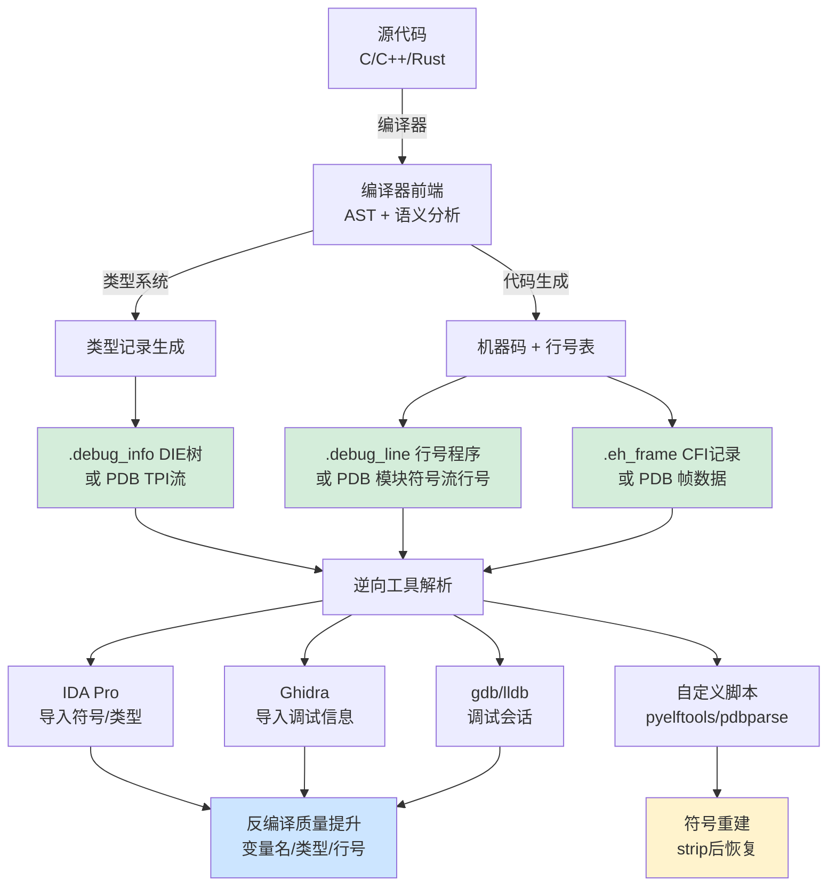

---
tags:
  - 反编译器
  - 反汇编
  - tier3
  - DWARF
  - PDB
---
# 调试信息解析：DWARF、PDB 与符号恢复

> [!abstract] TL;DR
> 调试信息（DWARF、PDB、BTF）是连接二进制机器码与源代码语义的黄金桥梁。逆向工程师可利用它直接恢复变量名、类型定义、行号映射和调用栈展开表，大幅压缩反编译工作量；发布构建若未 strip 则将完整源码结构暴露给攻击者。本章系统剖析 DWARF v5 的 DIE 树与六大 debug 节、PDB 的 MSF 多流格式与 CodeView 记录、BTF 在内核逆向中的新兴价值，以及 pyelftools/libdwarf/DIA SDK/pdbparse 的工程解析路径，最终呈现符号服务器机制与 strip 后符号重建策略。

## 概述与定位

### 调试信息在软件开发与逆向工程中的双重地位

调试信息（Debug Information）诞生于编译器的"记忆外包"需求：编译器将高级语言代码翻译成机器码时，源代码中的变量名、类型定义、行号位置等语义信息会被彻底抹去——机器码层面只有寄存器、内存地址和操作数。调试器（gdb、lldb、WinDbg）在断点命中时能打印出局部变量名和源代码行，全靠二进制文件中随附的调试信息节（section）来反向映射。

从逆向工程视角看，调试信息是信息量最密集的"免费礼物"。一个带调试符号的 ELF 二进制，反编译质量可以从"猜测性描述"直接跃升到接近源码级别：

- **函数名与参数名**：直接从符号表或 PDB 符号流读出，消除 `sub_140001A20` 类占位符
- **类型信息**：结构体字段偏移、枚举值含义、类层次（C++ vtable 的 vptr 链）——这正是第 06 章类型推断需要花费大量约束传播才能猜测的东西
- **行号映射**：每条指令对应的源文件行号，让反汇编视图和源码视图可以双向跳转
- **调用栈展开（CFI）**：每个指令点如何恢复上层帧的寄存器，是崩溃分析和 ROP 链构造的基础

调试信息存在的形式因操作系统和编译器生态而不同：

| 生态系统 | 格式 | 存储位置 |
|----------|------|----------|
| Linux/macOS/FreeBSD（GCC/Clang） | DWARF（v2–v5） | ELF/Mach-O 的 `.debug_*` 节 |
| Windows（MSVC/Clang-cl） | PDB（Program Database） | 独立 `.pdb` 文件，PE 头内含路径 |
| Linux 内核 BPF 子系统 | BTF（BPF Type Format） | ELF 的 `.BTF`/`.BTF.ext` 节或内核 `/sys/kernel/btf/vmlinux` |
| macOS（旧版/部分工具链） | STABS | ELF/Mach-O 符号表（已罕见） |

本章以 DWARF 和 PDB 为核心，BTF 作为补充，详细讲解每种格式的内部结构、解析工具链与逆向工程利用路径。

### 调试信息的逆向价值层次

在实际逆向场景中，调试信息的价值随可用性呈现明显梯度：

**第一梯度——完整 DWARF/PDB 可用**：通常出现在开源软件的发行包（未 strip 的 ELF）、Windows 系统 DLL 通过微软公共符号服务器拉取的 PDB、或者内核驱动在开发环境下的调试构建。此时 IDA/Ghidra 可以直接导入符号，函数名、局部变量、参数类型全部已知，逆向工作主要集中在理解业务逻辑而非低层语义。

**第二梯度——仅有公共符号（Public Symbols）**：微软为 Windows 系统组件提供了"公共符号"的精简 PDB，包含函数名和全局变量名，但不含局部变量、类型信息（私有成员）。这对 Windows 内核逆向（ntoskrnl.exe、hal.dll）已经极具价值——至少可以消除函数名猜测。

**第三梯度——已 strip，但有外部符号源**：通过符号服务器重新关联、或者利用同版本的调试包（debuginfo 包）恢复。Linux 发行版通常提供单独的 `*-dbgsym` 包。

**第四梯度——完全无符号**：商业软件、恶意软件、经过保护的二进制，此时才需要第 06 章的类型推断和第 23 章的变量恢复技术穷举推导。

---

## 原理与机制

### DWARF：层次化的调试元信息标准

DWARF（Debugging With Attributed Record Formats）是 UNIX/Linux 生态最主流的调试信息标准，由 PLSIG（Programming Language Special Interest Group）维护，当前最新版本为 v5（2017 年发布）。DWARF 的设计哲学是"语言无关、工具链中立"——同样的格式可以描述 C、C++、Rust、Go、Fortran 的类型系统，只需扩展 `DW_LANG_*` 标签。

#### DIE 树：DWARF 的核心数据模型

DWARF 的核心数据结构是 **DIE（Debug Information Entry，调试信息条目）树**。整个程序的调试信息被组织成一棵或多棵树，每个节点是一个 DIE，包含：

- **Tag（标签）**：描述该 DIE 代表什么语义实体，如 `DW_TAG_compile_unit`（编译单元）、`DW_TAG_subprogram`（函数/方法）、`DW_TAG_variable`（变量）、`DW_TAG_base_type`（基本类型）、`DW_TAG_structure_type`（结构体）、`DW_TAG_pointer_type`（指针类型）等
- **Attribute 列表**：键值对集合，每个 Attribute 由 `DW_AT_*` 键名和对应的值组成，如 `DW_AT_name = "main"`、`DW_AT_low_pc = 0x400100`、`DW_AT_type = <DIE ref>`

子节点表达层次关系：`DW_TAG_compile_unit` 的子节点包含该编译单元里的所有顶层函数、全局变量和类型定义；`DW_TAG_subprogram` 的子节点包含该函数的参数（`DW_TAG_formal_parameter`）和局部变量（`DW_TAG_variable`）；`DW_TAG_structure_type` 的子节点包含每个成员字段（`DW_TAG_member`）。

典型的 DIE 树片段（描述一个 `int add(int a, int b)` 函数）：

```
DW_TAG_compile_unit
  DW_AT_name: "main.c"
  DW_AT_language: DW_LANG_C99
  DW_AT_comp_dir: "/home/user/project"

  DW_TAG_base_type
    DW_AT_name: "int"
    DW_AT_encoding: DW_ATE_signed
    DW_AT_byte_size: 4

  DW_TAG_subprogram
    DW_AT_name: "add"
    DW_AT_low_pc: 0x400100      # 函数起始地址
    DW_AT_high_pc: 0x400120     # 函数结束地址（或大小）
    DW_AT_type: <ref to int DIE>  # 返回类型
    DW_AT_decl_file: 1
    DW_AT_decl_line: 5

    DW_TAG_formal_parameter
      DW_AT_name: "a"
      DW_AT_type: <ref to int DIE>
      DW_AT_location: DW_OP_reg0  # 在 RDI 寄存器中

    DW_TAG_formal_parameter
      DW_AT_name: "b"
      DW_AT_type: <ref to int DIE>
      DW_AT_location: DW_OP_reg3  # 在 RSI 寄存器中
```

#### DWARF 的六大核心 Section

DWARF 数据分散在 ELF 文件的多个 section 中，各有分工：

**`.debug_info`**：存储所有 DIE 的主体内容，是 DWARF 数据的核心。每个编译单元（CU，Compilation Unit）对应一个 CU header，后接该 CU 的 DIE 树序列化字节流。读取时需要配合 `.debug_abbrev` 解析 DIE 格式。

**`.debug_abbrev`**（缩写表）：DWARF 为节省空间使用了缩写编码——每个 DIE 在 `.debug_info` 中只存储一个"缩写码"（Abbreviation Code），指向 `.debug_abbrev` 中对应的缩写表项。缩写表项定义了该 DIE 有哪些 Attribute、每个 Attribute 的值采用何种编码形式（`DW_FORM_*`）。解析 `.debug_info` 必须先读取 `.debug_abbrev`。

**`.debug_line`**（行号程序）：存储地址到源文件行号的映射。DWARF 使用了一种紧凑的"行号状态机"表示法——不直接存储每条指令对应的行号表，而是存储一个操作码序列（line number program），执行这些操作码即可重建出完整的行号矩阵（地址 → 文件:行号:列号 三元组表）。这使得行号数据的压缩率极高。

**`.debug_str`** 和 **`.debug_str_offsets`**：存储 DWARF 中引用的字符串（变量名、类型名、文件路径等）。字符串通过偏移量引用以避免重复存储，DWARF v5 引入 `.debug_str_offsets` 进一步支持间接引用（便于链接器重定位）。

**`.debug_loc` / `.debug_loclists`**（位置列表）：描述变量在不同代码区间的物理位置。由于编译器优化，一个变量在程序生命周期中可能在不同时刻位于不同寄存器或内存地址，甚至暂时不可访问（被优化消除）。位置列表存储 `(地址范围, 位置表达式)` 对，表达"在 [0x400100, 0x400108) 区间内变量在 RAX 寄存器，在 [0x400108, 0x400120) 区间内变量在 [RSP+8] 处"这类复杂映射。DWARF v5 用 `.debug_loclists` 替代 v4 的 `.debug_loc`，引入更紧凑的编码。

**`.debug_ranges` / `.debug_rnglists`**（地址范围）：函数或词法块的代码范围并不一定连续（内联展开后）。`.debug_ranges` 存储地址范围列表，让 `DW_AT_ranges` 属性可以引用不连续的地址集合。

此外还有若干辅助 section：
- **`.debug_types`**：DWARF v4 独立类型单元（v5 已合并回 `.debug_info`）
- **`.debug_aranges`**：加速地址查询的索引（已被 v5 的 `.debug_addr` + `.debug_aranges` 替代）
- **`.debug_pubnames` / `.debug_pubtypes`**：公共名称索引（已被 v5 的 `.debug_names` 替代）
- **`.debug_frame` / `.eh_frame`**：调用帧信息（CFI），见下文

#### DWARF 表达式与位置列表详解

DWARF 位置表达式（DWARF Expression）是一种基于栈的虚拟机字节码，用于描述变量的运行时位置。这个微型虚拟机的操作码（`DW_OP_*`）包括：

- **寄存器操作**：`DW_OP_reg0`–`DW_OP_reg31` 直接指定寄存器（x86-64 中 reg0=RAX, reg3=RBX, reg5=RDI 等按 DWARF 寄存器映射）；`DW_OP_regx N` 指定扩展寄存器编号
- **内存操作**：`DW_OP_fbreg offset` 相对于当前帧基指针的偏移（最常见的栈变量表示）；`DW_OP_breg5 offset` 相对于 RDI 的偏移
- **算术操作**：`DW_OP_plus`、`DW_OP_minus`、`DW_OP_and`、`DW_OP_shr` 等，允许计算复杂地址
- **间接引用**：`DW_OP_deref` 把栈顶地址替换为该地址处读取的值（指针解引用）
- **片段（Piece）**：`DW_OP_piece N` 表示变量由当前位置的 N 字节组成；`DW_OP_reg_piece` 表示变量的某个片段在寄存器中——用于描述被拆分到多处的大型结构体

一个典型例子：C 代码 `int x = a + b;`，x 在编译优化后只存在于 RAX 寄存器而非栈上，其位置表达式为 `DW_OP_reg0`（RAX 即 DWARF 寄存器 0）。

#### CFI 与 `.eh_frame`：调用栈展开的数学基础

DWARF CFI（Call Frame Information）描述在每个程序计数器（PC）值处如何"展开"当前栈帧——即如何从当前函数恢复调用者的寄存器状态。这与第 11 章的符号执行和第 6 章的类型推断都有间接联系：正确的栈帧解析是确定函数边界、参数寄存器保存约定的重要依据。

CFI 同样使用状态机模型，以 CIE（Common Information Entry，公共信息条目）和 FDE（Frame Description Entry，帧描述条目）两种结构组织：

- **CIE**：定义一组函数共享的公共参数，包括：代码对齐因子（指令长度的最小单位）、数据对齐因子（栈帧槽大小）、返回地址寄存器编号、初始指令序列
- **FDE**：描述单个函数的 CFI，引用所属 CIE，并包含该函数地址范围内的 CFI 指令序列

CFI 指令（`DW_CFA_*`）描述如何在每个 PC 处规则地恢复寄存器：
- `DW_CFA_def_cfa rN, offset`：定义 CFA（Canonical Frame Address，规范帧地址）= 寄存器 N 的值加上偏移
- `DW_CFA_offset rN, factored_offset`：寄存器 N 保存在 `CFA + factored_offset * data_align` 处
- `DW_CFA_advance_loc delta`：PC 前进 delta 个代码单位，之前定义的规则继续有效
- `DW_CFA_same_value rN`：寄存器 N 的值与调用者相同（未被修改）

ELF 文件中 CFI 有两个存放位置：`.debug_frame`（DWARF 标准定义，仅供调试器使用）和 `.eh_frame`（GNU 扩展，在运行时被 C++ 异常处理机制 `libgcc`/`libunwind` 使用）。逆向工程师可通过解析 `.eh_frame` 确定函数边界——因为 C++ 程序中几乎每个函数都有 FDE，即使 strip 后 `.eh_frame` 仍保留（它是程序正常运行所必需的）。

---

## 结构/算法/伪代码详解

### DWARF 解析流程

```
┌───────────────────────────────────────────────────────────────┐
│                     DWARF 解析总流程                           │
└───────────────────────────────────────────────────────────────┘

输入：ELF 文件

1. 读取 ELF section 表，定位所有 .debug_* section
2. 读取 .debug_abbrev：构建 (abbrev_code → [tag, attrs]) 哈希表
3. 遍历 .debug_info 中的各 CU：
   a. 读取 CU header：
      - unit_length (4或12字节，判断32/64位DWARF)
      - version (u16，目标为4或5)
      - unit_type (v5新增：DW_UT_compile/DW_UT_type等)
      - debug_abbrev_offset (该CU使用的缩写表起始位置)
      - address_size (4或8字节)
   b. 递归解析 DIE 树：
      while not end_of_CU:
          abbrev_code = read_uleb128()
          if abbrev_code == 0:
              栈弹出（返回父节点）
          else:
              entry = abbrev_table[abbrev_code]
              tag = entry.tag
              has_children = entry.has_children
              attrs = parse_attrs(entry.attr_specs)
              yield DIE(tag, attrs)
              if has_children:
                  栈压入当前DIE（进入子层级）

4. 解析 .debug_line（行号程序）：
   for each CU:
       读取 line_number_program_header：
           - 文件名表（file_names[]）
           - 目录表（include_dirs[]）
           - 操作码长度表
       执行行号状态机，生成 (address, file_idx, line, col) 表

5. 解析 .debug_loc / .debug_loclists（位置列表）：
   for each 引用了 DW_AT_location 且值为位置列表引用的 DIE：
       读取对应 location list entry 序列
       每个 entry 包含 (start_addr, end_addr, location_expr)
       解释 DWARF 表达式字节码 → 位置描述

6. 构建查询索引：
   addr_to_line = {}   # 地址 → (文件, 行号)
   addr_to_func = {}   # 地址 → 函数名
   name_to_type = {}   # 类型名 → 类型DIE
```

### .debug_abbrev 解析算法

```python
def parse_abbrev_table(data: bytes, offset: int) -> dict:
    """解析 .debug_abbrev section，返回 {code: AbbrevEntry} 字典"""
    table = {}
    while offset < len(data):
        code = read_uleb128(data, offset)
        if code == 0:
            break  # 当前 abbrev 子表结束（多CU时继续下一个）
        tag = read_uleb128(data, offset)
        has_children = data[offset] == DW_CHILDREN_yes
        offset += 1
        attrs = []
        while True:
            attr_name = read_uleb128(data, offset)
            attr_form = read_uleb128(data, offset)
            if attr_name == 0 and attr_form == 0:
                break  # 属性列表结束
            implicit_const = None
            if attr_form == DW_FORM_implicit_const:  # DWARF v5新增
                implicit_const = read_sleb128(data, offset)
            attrs.append(AttrSpec(attr_name, attr_form, implicit_const))
        table[code] = AbbrevEntry(tag, has_children, attrs)
    return table
```

### 行号状态机核心逻辑

DWARF 行号状态机维护以下寄存器：`address`（当前PC）、`file`（文件索引）、`line`（当前行号，初始为1）、`column`（列号）、`is_stmt`（是否语句起始）、`basic_block`（是否基本块起始）、`end_sequence`（是否序列结束）。

特殊操作码（Special Opcode）是行号程序最紧凑的编码形式，单字节同时编码地址增量和行号增量：

```python
def decode_special_opcode(opcode, header):
    adjusted = opcode - header.opcode_base
    addr_delta = (adjusted // header.line_range) * header.minimum_instruction_length
    line_delta = header.line_base + (adjusted % header.line_range)
    return addr_delta, line_delta
```

其中 `opcode_base` 通常为 13（标准操作码数量+1），`line_range` 通常为 15，`line_base` 通常为 -5，使得单字节可表达 -5 到 +9 的行号变化和若干字节的地址增量。

### PDB 格式：微软的 MSF 多流文件系统

PDB（Program Database）是微软 MSVC 工具链的调试信息格式，本质上是一个**多流文件系统（MSF，Multi-Stream File）**，类似于一个小型文件系统嵌入在单个文件中。理解 PDB 必须先理解 MSF。

#### MSF（Multi-Stream File）文件系统

MSF 将 PDB 文件分成固定大小的**页（Page）**（通常 4KB 或 8KB），多个页组成一个**流（Stream）**，每个流相当于 MSF 文件系统中的一个独立"文件"。MSF 的核心结构：

```
MSF 文件布局：
┌─────────────────────────────────────────────────────┐
│  超级块（Super Block / MSF Header），页0              │
│  - 魔数："Microsoft C/C++ MSF 7.00\r\n\x1aDS\0\0\0" │
│  - BlockSize: 4096 或 8192                           │
│  - FreeBlockMapBlock: 1 或 2（空闲页位图所在页号）    │
│  - NumBlocks: 总页数                                 │
│  - NumDirectoryBytes: 目录大小（字节）                │
│  - BlockMapAddr: 目录的块映射数组所在页号             │
├─────────────────────────────────────────────────────┤
│  页 1：空闲页位图1（Free Page Map）                   │
│  页 2：空闲页位图2                                    │
├─────────────────────────────────────────────────────┤
│  Stream Directory（流目录）                          │
│  - NumStreams: 流数量                                │
│  - StreamSizes[]: 每个流的字节大小                   │
│  - StreamBlocks[][]: 每个流使用的页号列表            │
├─────────────────────────────────────────────────────┤
│  数据页（Stream 内容分散其中）                       │
└─────────────────────────────────────────────────────┘
```

#### PDB 固定流布局

PDB 文件内的流按固定编号分配功能：

| 流编号 | 流名称 | 内容 |
|--------|--------|------|
| Stream 0 | Old MSF Directory | 旧版目录（通常忽略） |
| Stream 1 | PDB Info Stream | PDB 版本、GUID、epoch、命名流目录 |
| Stream 2 | TPI（Type Info Stream） | 全类型记录（`LF_*` CodeView 记录） |
| Stream 3 | DBI（Debug Info Stream） | 模块列表、Section Contributions、行号信息 |
| Stream 4 | IPI（ID Info Stream，PDB 7.0+） | 函数 ID、字符串 ID 等标识符记录 |
| 动态编号 | 全局符号流 | 全局符号（`S_PUB32`、`S_GDATA32` 等） |
| 动态编号 | 公共符号流 | 按名称排序的公共符号哈希表 |
| 动态编号 | 符号记录流 | 所有 CodeView 符号记录的字节池 |
| 每模块一个 | 模块符号流 | 各 .obj 的局部符号和行号 |

#### DBI 流（Debug Info Stream）详解

DBI 流是 PDB 的骨干，其结构由多个子流（Sub-stream）串联构成：

```
DBI Stream 布局：
┌────────────────────────────────────────────────┐
│ DBI Header                                      │
│   - VersionSignature: -1 (0xFFFFFFFF)           │
│   - VersionHeader: 19990903 (v7格式)            │
│   - Age: 年龄计数（与 PDB Info Stream 匹配）    │
│   - GlobalSymStream: 全局符号流编号              │
│   - PublicSymStream: 公共符号流编号              │
│   - SymRecordStream: 符号记录流编号              │
├────────────────────────────────────────────────┤
│ Module Info Sub-stream（模块信息子流）           │
│   每个模块（.obj 文件）的 ModInfo 记录：         │
│   - Mod: 模块流编号（模块的局部符号所在流）      │
│   - SC: 段贡献（代码/数据范围）                 │
│   - ModuleName: 模块路径字符串                  │
│   - ObjFileName: 对应 .obj 文件路径             │
├────────────────────────────────────────────────┤
│ Section Contribution Sub-stream（段贡献子流）   │
│   每个 .text/.data 区段范围 → 对应模块的映射   │
├────────────────────────────────────────────────┤
│ Section Map Sub-stream（段映射子流）            │
│   PE 节与逻辑段编号的映射关系                   │
├────────────────────────────────────────────────┤
│ File Info Sub-stream（文件信息子流）            │
│   源文件名列表及每模块对应哪些源文件            │
└────────────────────────────────────────────────┘
```

#### TPI 流（Type Info Stream）与 CodeView 类型记录

TPI 流存储所有类型定义，使用 CodeView 格式的 **`LF_*`（Leaf，叶记录）** 编码。每条类型记录以 2 字节的记录类型开始：

| LF 类型 | 含义 | 关键字段 |
|---------|------|----------|
| `LF_CLASS` / `LF_STRUCTURE` | C++ 类/结构体 | 成员数量、属性、字段列表引用 |
| `LF_FIELDLIST` | 字段列表 | 包含 `LF_MEMBER`（数据成员）、`LF_METHOD`（方法） |
| `LF_MEMBER` | 数据成员 | 名称、类型索引、偏移 |
| `LF_POINTER` | 指针类型 | 目标类型索引、指针类型（普通/引用/成员指针） |
| `LF_PROCEDURE` | 函数原型 | 返回类型、参数数量、参数类型列表引用 |
| `LF_ARRAY` | 数组类型 | 元素类型、下标类型、字节大小 |
| `LF_ENUM` | 枚举类型 | 枚举成员列表引用 |
| `LF_VTSHAPE` | 虚表形状 | 描述 vtable 中方法指针的格式 |

类型记录之间通过类型索引（Type Index，简称 TI）相互引用，TI 在 0x1000 以下为预定义简单类型（如 T_INT4=0x74 表示 4 字节有符号整数），0x1000 及以上为 TPI 流中的用户定义类型。

#### 符号流（Symbol Stream）与 CodeView 符号记录

全局符号流和各模块的局部符号流使用 **`S_*`（Symbol Record）** 格式：

| S_ 类型 | 含义 | 关键用途 |
|---------|------|---------|
| `S_PUB32` | 公共符号（地址级别） | 函数/全局变量的 VA 和名称，不含类型 |
| `S_GDATA32` | 全局数据符号 | 全局变量名、类型索引、地址 |
| `S_GPROC32` | 全局过程（函数） | 函数名、类型索引（函数原型）、起始/结束地址 |
| `S_LDATA32` / `S_LPROC32` | 局部数据/过程 | 模块私有的局部符号 |
| `S_REGREL32` | 寄存器相对变量 | 相对于某寄存器偏移的局部变量（栈变量） |
| `S_REGISTER` | 寄存器变量 | 存储在寄存器中的局部变量 |
| `S_BLOCK32` | 词法块 | `{}`  块的起始/结束地址 |
| `S_COMPILE3` | 编译器信息 | 编译器版本、目标机器、前端版本 |
| `S_INLINESITE` | 内联站点 | 内联展开的位置信息 |

### 数据流图：DWARF 与 PDB 的信息流向



### BTF：Linux 内核的精简类型信息

BTF（BPF Type Format）是随 Linux 内核 BPF 子系统（4.18+）引入的轻量级类型信息格式，设计目标是"最小体积、支持 CO-RE（Compile Once, Run Everywhere）"。

#### BTF 格式结构

BTF 存储在 ELF 的 `.BTF` section 中，结构非常精简：

```
BTF Header:
  magic: 0xEB9F
  version: 1
  flags: 0
  hdr_len: 24
  type_off: 偏移到类型区域
  type_len: 类型区域长度
  str_off: 偏移到字符串区域
  str_len: 字符串区域长度

类型区域：连续的 btf_type 结构体序列
  struct btf_type {
      __u32 name_off;  // 字符串偏移
      __u32 info;      // 低16位=vlen(可变长度)，高8位=kind
      union { __u32 size; __u32 type; };  // 大小或引用类型ID
  };
  // 后跟 kind 相关的附加数据（struct成员、enum值等）
```

BTF 的 kind（类型种类）包括：`BTF_KIND_INT`、`BTF_KIND_PTR`、`BTF_KIND_ARRAY`、`BTF_KIND_STRUCT`、`BTF_KIND_UNION`、`BTF_KIND_ENUM`、`BTF_KIND_FUNC`、`BTF_KIND_FUNC_PROTO`、`BTF_KIND_VAR`、`BTF_KIND_DATASEC`、`BTF_KIND_FLOAT`（v5+）等。

#### CO-RE 与 `.BTF.ext`

BTF 的杀手级特性是 **CO-RE（Compile Once, Run Everywhere）**：BPF 程序编译时记录对内核结构体字段的访问，运行时 BPF 加载器根据目标内核的 BTF 动态调整字段偏移——这意味着同一个 BPF 程序二进制可以在不同内核版本上运行，即使结构体布局发生变化。

`.BTF.ext` section 存储函数和行号信息，以及 CO-RE 重定位记录（`bpf_core_relo`），描述哪些 BPF 指令需要根据目标 BTF 进行偏移重定位。

对逆向工程师而言，`/sys/kernel/btf/vmlinux`（运行中内核的全量 BTF）提供了整个内核的类型信息，可用 `bpftool btf dump file /sys/kernel/btf/vmlinux format c` 导出近似的内核头文件（`vmlinux.h`），包含数千个内核数据结构的完整定义——这是内核驱动逆向的巨大助力。

---

## 工具视角与实战

### pyelftools：Python 解析 DWARF

`pyelftools` 是纯 Python 实现的 ELF/DWARF 解析库，无需安装 libdwarf，适合快速脚本开发。

#### 提取函数符号与地址范围

```python
from elftools.elf.elffile import ELFFile
from elftools.dwarf.descriptions import describe_form_class

def extract_functions(elf_path):
    with open(elf_path, 'rb') as f:
        elf = ELFFile(f)
        if not elf.has_dwarf_info():
            print("无 DWARF 信息")
            return

        dwarfinfo = elf.get_dwarf_info()
        for CU in dwarfinfo.iter_CUs():
            for DIE in CU.iter_DIEs():
                if DIE.tag != 'DW_TAG_subprogram':
                    continue
                name = DIE.attributes.get('DW_AT_name')
                low_pc = DIE.attributes.get('DW_AT_low_pc')
                high_pc = DIE.attributes.get('DW_AT_high_pc')
                if not (name and low_pc):
                    continue

                func_name = name.value.decode('utf-8', errors='replace')
                start = low_pc.value
                # DW_AT_high_pc 可能是绝对地址或相对偏移（取决于 form）
                if high_pc:
                    hpc_form = high_pc.form
                    if describe_form_class(hpc_form) == 'address':
                        end = high_pc.value
                    else:  # DW_FORM_data*，相对偏移
                        end = start + high_pc.value
                    print(f"  {func_name}: [{start:#x}, {end:#x})")
```

#### 重建类型信息

```python
def extract_struct_types(elf_path):
    """提取所有结构体类型的字段偏移信息"""
    with open(elf_path, 'rb') as f:
        elf = ELFFile(f)
        dwarfinfo = elf.get_dwarf_info()
        for CU in dwarfinfo.iter_CUs():
            for DIE in CU.iter_DIEs():
                if DIE.tag not in ('DW_TAG_structure_type', 'DW_TAG_class_type'):
                    continue
                name_attr = DIE.attributes.get('DW_AT_name')
                if not name_attr:
                    continue
                struct_name = name_attr.value.decode('utf-8', errors='replace')
                size_attr = DIE.attributes.get('DW_AT_byte_size')
                struct_size = size_attr.value if size_attr else '?'
                print(f"struct {struct_name} (size={struct_size}B):")
                for child in DIE.iter_children():
                    if child.tag != 'DW_TAG_member':
                        continue
                    fname = child.attributes.get('DW_AT_name')
                    member_loc = child.attributes.get('DW_AT_data_member_location')
                    if fname and member_loc:
                        offset = member_loc.value
                        print(f"  +0x{offset:04x}  {fname.value.decode()}")
```

#### 解析行号映射（addr2line 实现核心）

```python
def addr_to_line(elf_path, target_addr):
    with open(elf_path, 'rb') as f:
        elf = ELFFile(f)
        dwarfinfo = elf.get_dwarf_info()
        for CU in dwarfinfo.iter_CUs():
            lineprog = dwarfinfo.line_program_for_CU(CU)
            if lineprog is None:
                continue
            prevstate = None
            for entry in lineprog.get_entries():
                state = entry.state
                if state is None:
                    continue
                if prevstate and prevstate.address <= target_addr < state.address:
                    # 目标地址在上一个状态记录的范围内
                    file_entry = lineprog['file_entry'][prevstate.file - 1]
                    filename = file_entry.name.decode()
                    return filename, prevstate.line
                if state.end_sequence:
                    prevstate = None
                else:
                    prevstate = state
    return None, None
```

### pdbparse：Python 解析 PDB

`pdbparse` 是开源 Python 库，支持解析 PDB 格式，常用于从公共符号提取函数地址。

```python
import pdbparse
from pdbparse.symlookup import Lookup

def load_pdb_symbols(pdb_path):
    """加载 PDB 文件，返回 (地址, 名称) 列表"""
    pdb = pdbparse.parse(pdb_path)
    symbols = []
    try:
        sects = pdb.STREAM_SECT_HDR_ORIG.sections
        omap = pdb.STREAM_OMAP_FROM_SRC
        # 公共符号流
        gsym = pdb.STREAM_GSYM
        for sym in gsym.globals:
            if hasattr(sym, 'offset') and hasattr(sym, 'segment'):
                # 将段:偏移转换为 RVA（相对虚拟地址）
                seg = sym.segment - 1
                if seg < len(sects):
                    rva = sects[seg].VirtualAddress + sym.offset
                    symbols.append((rva, sym.name))
    except AttributeError:
        pass
    return sorted(symbols, key=lambda x: x[0])

def apply_pdb_to_ida():
    """IDA Python 脚本：从 PDB 导入符号"""
    import idc, idaapi
    symbols = load_pdb_symbols("target.pdb")
    image_base = idaapi.get_imagebase()
    for rva, name in symbols:
        ea = image_base + rva
        idc.set_name(ea, name, idc.SN_NOWARN)
        print(f"[+] {name} @ {ea:#x}")
```

### Microsoft DIA SDK：Windows 原生 PDB 解析

在 Windows 环境下，微软官方提供 **DIA SDK（Debug Interface Access SDK）** 来解析 PDB。DIA SDK 通过 COM 接口提供服务，是 Visual Studio、WinDbg 等工具底层使用的标准 API。

```cpp
// DIA SDK 核心用法：枚举函数符号
#include <dia2.h>
#include <atlbase.h>

void EnumFunctions(const wchar_t* pdbPath) {
    CComPtr<IDiaDataSource> source;
    HRESULT hr = CoCreateInstance(CLSID_DiaSource, NULL, CLSCTX_INPROC_SERVER,
                                   __uuidof(IDiaDataSource), (void**)&source);
    source->loadDataFromPdb(pdbPath);

    CComPtr<IDiaSession> session;
    source->openSession(&session);

    CComPtr<IDiaSymbol> globalScope;
    session->get_globalScope(&globalScope);

    // 枚举所有函数
    CComPtr<IDiaEnumSymbols> enumFuncs;
    globalScope->findChildren(SymTagFunction, NULL, nsNone, &enumFuncs);

    CComPtr<IDiaSymbol> func;
    ULONG fetched = 0;
    while (SUCCEEDED(enumFuncs->Next(1, &func, &fetched)) && fetched == 1) {
        CComBSTR name;
        ULONGLONG va = 0;
        ULONGLONG len = 0;
        func->get_name(&name);
        func->get_virtualAddress(&va);
        func->get_length(&len);
        wprintf(L"Function: %s @ 0x%llx (len=%llu)\n", name.m_str, va, len);

        // 进一步枚举局部变量...
        func.Release();
    }
}
```

DIA SDK 还支持：
- `IDiaEnumSourceFiles` + `IDiaLineNumber`：重建行号映射
- `IDiaSymbol::get_type()`：获取类型 IDiaSymbol，递归展开结构体/类
- `IDiaFrameData`：获取 CFI（栈展开信息）
- `findLinesByAddr()` / `findLinesByVA()`：地址→行号的直接查询

### 符号服务器（Symbol Server）机制

微软的符号服务器系统允许调试器按需拉取匹配的 PDB 文件，无需本地预存。核心机制：

**PDB GUID 匹配**：PE 文件的 `.debug` 目录中存储了 CodeView 调试目录，包含：
- PDB 路径（原始构建机器上的路径）
- PDB GUID（128位唯一标识符）
- Age（年龄计数，每次重链接递增）

调试器通过 `GUID + Age` 唯一确定一个特定 PDB，在符号服务器上按 `PDB名/GUID{Age}/PDB名.pdb` 路径查找。

**symchk 工具**：`symchk.exe /r <binary_path> /s srv*C:\symbols*https://msdl.microsoft.com/download/symbols` 会批量验证并下载符号。

**`.sym` 文件**：精简的公共符号 PDB，只含函数名/地址，不含类型和局部变量，即微软公共服务器为 Windows 系统 DLL 提供的格式。

**在逆向中利用符号服务器的典型流程**：

```
1. 用 WinDbg 附加到目标进程 / 打开崩溃转储
   .sympath SRV*C:\Symbols*https://msdl.microsoft.com/download/symbols
   .reload /f ntoskrnl.exe  → 自动从服务器下载匹配的 PDB

2. 在 IDA Pro 中加载 Windows 系统 DLL：
   File → Load File → PDB file...（输入 .pdb 路径）
   或配置 PDB 插件自动从网络拉取：
   ida_pdb.cfg 中设置 _NT_SYMBOL_PATH

3. 对 ntoskrnl.exe 逆向时：
   - 公共符号恢复约 5000+ 函数名
   - 结合 Windows Research Kernel 源码印证函数行为
```

### IDA Pro 与 Ghidra 中导入调试信息的实战

**IDA Pro 导入 DWARF**：IDA 7.5+ 对带 DWARF 信息的 ELF 加载时自动解析，在 View → Open Subviews → Type Libraries 中可见导入的类型。通过 IDAPython 也可访问：

```python
import idc, idautils
# DWARF 自动导入后，函数名和类型已应用
for func_ea in idautils.Functions():
    name = idc.get_func_name(func_ea)
    print(f"{func_ea:#x}: {name}")

# 查看某地址的局部变量（DWARF 已提供）
import ida_hexrays, ida_typeinf
cfunc = ida_hexrays.decompile(here())
for lvar in cfunc.lvars:
    print(f"  {lvar.name}: {lvar.type()}")
```

**Ghidra 导入 PDB**：Ghidra 提供 PDB 分析器（`PdbAnalyzer`），支持从本地文件或符号服务器加载 PDB：

```python
# Ghidra Script (Java/Python API)
from ghidra.app.util.bin.format.pdb2 import PdbReaderOptions
from ghidra.app.util.bin.format.pdb2.pdbreader import AbstractPdb

pdb_reader_options = PdbReaderOptions()
pdb_path = "/path/to/target.pdb"
pdb = PdbReaderFactory.parse_for_analysis(pdb_path, pdb_reader_options)
# Ghidra 会自动应用符号名和类型信息到当前程序
```

**bpftool 导出内核类型**：

```bash
# 导出内核所有类型为 C 头文件（逆向内核驱动利器）
bpftool btf dump file /sys/kernel/btf/vmlinux format c > vmlinux.h

# 查看特定结构体
bpftool btf dump file /sys/kernel/btf/vmlinux format raw | grep -A5 "task_struct"

# 从 ELF 文件导出 BTF
bpftool btf dump file bpf_program.o
```

### addr2line 原理与实现

`addr2line`（GNU binutils 工具）的核心原理：遍历 `.debug_line` 行号表，二分查找目标地址所在区间，返回对应的源文件和行号。等价于前述 pyelftools 示例中的 `addr_to_line` 函数。

```bash
# 实际使用
addr2line -e ./binary -f -C 0x400100
# -f: 打印函数名
# -C: 解码 C++ mangled 名称
# 输出: add(int, int) /home/user/main.cpp:5
```

等价的 LLVM 工具：`llvm-addr2line`（更支持新版 DWARF 格式）。

### strip 后的符号重建策略

当目标二进制已 strip，调试信息完全缺失时，可通过以下路径部分重建：

**策略一：`.eh_frame` 辅助函数边界恢复**

strip 不会移除 `.eh_frame`（C++ 程序异常处理必需）。每个 FDE 对应一个函数，其起始地址和覆盖范围直接给出函数边界：

```python
from elftools.elf.elffile import ELFFile
from elftools.dwarf.callframe import CIE, FDE

def recover_functions_from_eh_frame(elf_path):
    with open(elf_path, 'rb') as f:
        elf = ELFFile(f)
        if not elf.has_dwarf_info():
            return
        dwarfinfo = elf.get_dwarf_info()
        for entry in dwarfinfo.CFI_entries():
            if isinstance(entry, FDE):
                start = entry['initial_location']
                size = entry['address_range']
                print(f"Function candidate: [{start:#x}, {start+size:#x})")
```

**策略二：利用同版本的 debuginfo 包**

Linux 发行版通常提供单独的调试包：

```bash
# Ubuntu/Debian
apt-get install libc6-dbg
# 或使用 debuginfod 在线服务
export DEBUGINFOD_URLS="https://debuginfod.ubuntu.com/"
gdb /lib/x86_64-linux-gnu/libc.so.6
# gdb 自动从 debuginfod 拉取匹配的 DWARF 信息

# Fedora/RHEL
debuginfo-install glibc

# 验证是否成功
file /usr/lib/debug/lib/x86_64-linux-gnu/libc-2.31.so
```

**策略三：伪造调试信息注入到逆向工具**

在 IDA 中完成人工逆向后，可以生成类似 DWARF 的符号文件（`.idc` 脚本或 til 类型库）传递给其他工具使用：

```bash
# 将 IDA 分析结果导出为 MAP 文件（含函数名和地址）
# Edit → Export → MAP file

# 将 MAP 文件转换为 GNU nm 格式，供 addr2line 使用的替代方案
# 或直接在 Ghidra 中用 ImportSymbolsScript 导入
```

**策略四：二进制相似性匹配（与第 20 章结合）**

若能找到同版本的未 strip 二进制（开发包、调试版本），通过第 20 章介绍的 Ghidra BSim 或 BinDiff 将符号从已知版本迁移到目标版本：

```bash
# BinDiff 命令行工作流
bindiff --primary=known_binary_with_debug.elf \
        --secondary=stripped_target.elf \
        --output_dir=/tmp/bindiff_result
# 相似函数的符号名从 primary 迁移到 secondary
```

---

## 安全性与正确使用

### 调试信息泄露与发布安全

调试信息对逆向工程师的价值，恰好等价于其对软件发布者的安全风险：

**信息泄露维度**：DWARF 调试信息在完整保留时会暴露：
- 函数名称（包括内部帮助函数、安全检查函数）
- 源文件路径（开发机器的目录结构，可能暴露内部代号、项目名）
- 类型定义（内部数据结构、协议格式、密钥存储结构）
- 局部变量名（可能含有语义信息：`is_admin_override`、`bypass_license_check`）
- 源代码行号（与 CVE 补丁对比可精确定位漏洞函数）

**现实案例**：2021 年，某知名游戏发布了含 DWARF 信息的 Linux 版本，逆向研究者立即从中提取了反作弊系统的完整类型结构和函数调用图，大幅降低了绕过门槛。

**正确的发布流程**：

```makefile
# 开发/调试构建：保留完整调试信息
release_debug: CFLAGS += -g -O2
release_debug: $(SOURCES)
    $(CC) $(CFLAGS) -o $(TARGET)_debug $^

# 分离调试信息（推荐做法，保留后续调试能力）
release: release_debug
    objcopy --only-keep-debug $(TARGET)_debug $(TARGET).debug
    objcopy --strip-debug --add-gnu-debuglink=$(TARGET).debug \
            $(TARGET)_debug $(TARGET)_stripped
    # $(TARGET)_stripped: 无调试信息的发布版本
    # $(TARGET).debug: 内部存档，含完整 DWARF

# 完全 strip（最激进，连 .symtab 都删除）
strip_all:
    strip --strip-all $(TARGET)
```

**`.gnu_debuglink` 机制**：`objcopy --add-gnu-debuglink` 在 strip 后的二进制中保留一个指向外部 `.debug` 文件的引用（含文件名和 CRC 校验）。gdb 会自动查找并加载匹配的调试文件，实现"发布无调试信息、调试会话自动关联"。

**PDB 路径泄露**：Windows PE 文件的 CodeView 调试目录即使 PDB 不随程序发布，也包含构建机器上的 PDB 完整路径（如 `C:\Users\developer\secret_project\Release\product.pdb`）。这一信息暴露了开发机器用户名和项目目录结构。工具 `pesign -i product.exe` 或 `dumpbin /pdbpath:full product.exe` 可提取该路径。彻底清除需在链接时使用 `/PDBALTPATH` 指定替代路径，或后处理清零调试目录。

### 伪造调试信息的逆向对抗

攻击者也可以利用调试信息机制实施混淆或检测规避：

**伪造 DWARF 误导分析**：恶意程序可以在二进制中嵌入故意错误的 DWARF 信息，使 IDA/Ghidra 自动应用错误的函数名和类型，误导分析人员：

```bash
# 生成含虚假符号的 ELF（学术研究场景）
# 恶意软件作者有时将关键函数命名为无害的库函数名
# 以干扰基于符号名的自动分类
```

**检测调试器通过 CFI 访问模式**：理论上，程序可通过 CFI 表的异常地图推断当前是否在被调试器展开，但实践中极少见。

**解析工具健壮性**：DWARF 格式复杂，历史上解析库（libdwarf、pyelftools）存在多个由畸形 DWARF 触发的崩溃漏洞。在处理不可信二进制时，应在沙箱中运行解析工具，避免解析器漏洞被用于攻击逆向工程环境。

### debuginfod：集中式 DWARF 分发服务

debuginfod 是 elfutils 项目提供的 HTTP 服务，可按 build-id 分发调试信息、源代码和可执行文件。设置 `DEBUGINFOD_URLS` 环境变量后，gdb/lldb/systemtap 等工具在需要时自动查询：

```bash
# 在 Ubuntu 上启用 debuginfod
export DEBUGINFOD_URLS="https://debuginfod.ubuntu.com/"
# gdb 调试任何 Ubuntu 系统库时自动获取 DWARF 信息

# 搭建私有 debuginfod 服务器（供内部发布版的调试）
debuginfod -d /var/cache/debuginfod/metadata.db \
           -F /usr/lib/debug /build/output
```

这一机制允许企业内部将调试信息与发布二进制分离存放，开发人员内网可访问完整调试信息，而对外发布的二进制不含任何 DWARF。

---

## 小结

本章系统剖析了调试信息的两大主流格式 DWARF 和 PDB，以及新兴的 BTF：

- **DWARF** 以 DIE 树为核心，通过六大 section（`.debug_info`/`.debug_abbrev`/`.debug_line`/`.debug_str`/`.debug_loc`/`.debug_ranges`）描述类型、变量、行号和调用栈展开信息，位置表达式的虚拟机模型支持描述任意复杂的变量位置；CFI/`.eh_frame` 在 strip 后仍然保留，是函数边界恢复的可靠锚点

- **PDB** 以 MSF 多流文件系统为容器，TPI 流存储 CodeView `LF_*` 类型记录、DBI 流串联模块信息、符号流存储 `S_*` 符号记录，整体构成 Windows 生态最完整的符号/类型信息系统；符号服务器机制使公共符号按需分发，是 Windows 内核逆向的基础设施

- **BTF** 以最小体积描述 Linux 内核类型，CO-RE 机制使内核类型在运行时可查，`bpftool` 导出的 `vmlinux.h` 是内核驱动逆向的高价值类型参考

- **工具链**：pyelftools（Python DWARF）、libdwarf（C DWARF）、pdbparse（Python PDB）、DIA SDK（Windows COM PDB）、LLVM DebugInfo C++ API 覆盖了从快速脚本到生产集成的各层需求

- **符号重建**：`.eh_frame` 辅助函数边界、debuginfo 包/debuginfod 服务、BinDiff 符号迁移是 strip 后恢复符号信息的三条主要路径

- **安全实践**：发布构建应使用 `objcopy --only-keep-debug` 分离调试信息，或彻底 strip；PDB 路径在 PE 头中残留，需通过 `/PDBALTPATH` 或后处理清除

理解调试信息格式是连接第 06 章（类型推断）与第 23 章（变量恢复）的知识桥梁：当调试信息可用时，类型推断和变量划分的工作由格式规范直接提供；当调试信息缺失时，才需要第 06/23 章的推断算法从语义角度重建。

---

## 相关阅读

- **DWARF 标准文档**：DWARF Debugging Information Format v5（2017），dwarfstd.org——唯一权威规范
- **Michael Eager《Introduction to the DWARF Debugging Format》**：DWARF 入门最佳文档，清晰讲解 DIE 树和行号状态机
- **《The DWARF Debugging Standard》by Ron Brender**：深度解析 DWARF v4 设计决策
- **Nick Desaulniers《The Dark Art of Linker Scripts》**：理解 `.eh_frame` 与链接器交互的背景读物
- **PDB 格式开源逆向文档**：`microsoft/llvm-project` 中的 `llvm/lib/DebugInfo/PDB/` 源码，以及 github.com/willglynn/pdb（Rust 实现，含格式注释）
- **《Linkers and Loaders》by John R. Levine**（第 8 章）：调试信息在链接阶段的处理
- **Brendan Gregg《Systems Performance》**（BPF/BTF 章节）：CO-RE 机制的权威讲解
- **elfutils/debuginfod 文档**：sourceware.org/elfutils/Debuginfod.html——部署集中式 DWARF 分发服务
- **系列内关联**：第 06 章「类型推断与结构恢复」（调试信息提供的类型是类型推断的 ground truth）；第 11 章「符号执行与 angr」（CFI 协助 angr 的栈帧建模）；第 23 章「变量恢复与栈帧分析」（DWARF 位置列表是变量恢复的参考基准）；第 38 章「Windows 内核与驱动逆向」（PDB 公共符号是内核逆向的基础）

[[00.反编译器与反汇编引擎原理总览|⬆ 系列总览]] | [[21.污点分析引擎|← 上一章]] | [[23.变量恢复与栈帧分析|→ 下一章]]
