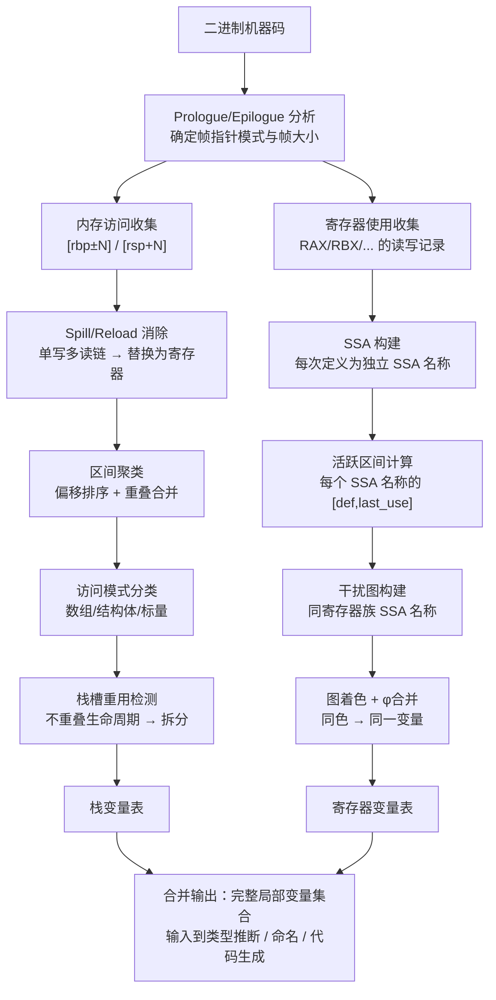

---
tags:
  - 反编译器
  - 反汇编
  - tier3
  - 变量恢复
  - 栈帧
---
# 变量恢复与栈帧分析

> [!abstract] TL;DR
> 变量恢复（variable recovery）是反编译器将机器码中的寄存器分配与栈帧内存映射转化为有意义的源码级变量的核心过程，与第 06 章类型推断在技术上正交——类型推断回答"变量是什么类型"，变量恢复先行回答"存在哪些变量、各占哪段存储、生命周期如何划分"。这一步骤的质量直接决定反编译输出的可读性，也是 IDA Hex-Rays、Ghidra 与其他反编译器质量差异的核心来源。本章系统覆盖栈帧布局重建、栈变量识别聚类、寄存器变量的 SSA 生命周期切割、coalescing/splitting 决策、spill/reload 识别、数组与结构体成员的区分判据、Hex-Rays lvar 系统的实现细节，以及 DIRTY/StateFormer 等 ML 方法。

---

## 概述与定位

### 为何变量恢复是独立问题

编译器将源码中的局部变量映射到两类存储：寄存器（register-allocated variable）和栈内存（stack-allocated variable）。当反编译器从机器码向上分析时，它面对的原始材料只有寄存器引用（如 `rax`、`r12`）和内存访问（如 `[rsp+0x18]`、`[rbp-0x30]`）。这两类存储在编译后都不再直接对应源码变量——一个源码变量可能被寄存器分配器拆分到多个寄存器，也可能在生命周期不重叠时与另一个变量共用同一个栈槽。

变量恢复要解决的核心问题是：

1. **栈变量划分**：`[rbp-0x30]` 到底是一个 48 字节的大对象，还是三个独立的 16 字节变量，还是混合了标量与填充？
2. **寄存器变量切割**：`rax` 在函数内被写了七次，哪些写构成同一个变量，哪些应该被视为不同变量？
3. **变量合并**：编译器为了消除 φ 函数而执行 SSA 消除（第 04 章），将多个 SSA 名称合并到同一寄存器；反编译器能否识别它们原本是同一变量？
4. **生命周期重叠的存储复用**：同一栈偏移在函数执行的不同阶段可能属于不同变量（intra-function stack slot reuse），这是`-O2`以上优化级别下最常见的混淆来源之一。

这些问题在逻辑上先于类型推断（type inference）。只有确定"存在哪些变量"之后，类型推断才能对每个变量施加约束。两个步骤构成反编译管线中的序列依赖，但各自有独立的算法框架。

### 与第 06 章的边界划分

第 06 章（类型推断与结构恢复）的核心算法是基于约束传播的类型格（type lattice）分析：通过分析操作指令（`movzx` 暗示无符号扩展、`sar` 暗示有符号、`lea` 暗示指针）和函数调用的参数类型来传播类型约束。该章的输入已经是"一组具名变量集合"。

本章的工作在其上游：把寄存器引用和内存偏移聚合为"具名变量集合"。这是两套算法框架，互相解耦，尽管在工程实现（如 IDA Hex-Rays）中二者在同一遍次中交替执行以互相利用信息。

---

## 原理与机制

### 栈帧布局的 ABI 约定

不同平台的函数调用约定（calling convention）规定了栈帧的基本布局，理解这些布局是变量恢复的前提。

#### x86-64 SysV ABI（Linux/macOS）

```
高地址
┌─────────────────────────────┐
│      调用者栈帧（参数区）      │  rsp+N 以上（第7+个整数参数）
├─────────────────────────────┤
│         返回地址              │  [rsp] at call site
├─────────────────────────────┤  ← 进入函数时 rsp 指向此处
│      保存的 rbp               │  [rsp-8] after push rbp
├─────────────────────────────┤  ← rbp 建立后指向此处
│      局部变量区               │  [rbp-N] 到 [rbp-M]
├─────────────────────────────┤
│      被调用者保存寄存器         │  rbx/r12-r15 等 callee-saved
├─────────────────────────────┤
│      对齐填充                 │  保证 16 字节对齐
├─────────────────────────────┤  ← rsp 指向此处（调整后）
│      调用子函数的参数区         │  （如使用 shadow space）
低地址
```

SysV ABI 还规定了**红区（red zone）**：`rsp` 下方 128 字节区域，叶函数（leaf function，不调用其他函数）可直接使用而无需先执行 `sub rsp, N`。这对变量恢复产生重大影响——叶函数可能完全不出现经典 prologue，反编译器必须识别 `[rsp-0x8]`、`[rsp-0x10]` 等访问属于红区局部变量。

#### x86-64 Windows ABI

Windows x64 调用约定的差异包括：
- 前四个整数/指针参数走 `rcx`、`rdx`、`r8`、`r9`（SysV 走 `rdi`、`rsi`、`rdx`、`rcx`、`r8`、`r9`，多两个）
- 调用者必须在栈上预留 32 字节的 shadow space（Home Space），即使被调用者不使用
- **没有红区**：任何函数都必须先 `sub rsp, N` 再使用 `[rsp+X]`
- 浮点参数走 `xmm0-xmm3`，SysV 走 `xmm0-xmm7`

这些差异意味着反编译器在识别参数变量时必须首先确定目标平台的调用约定。IDA 通过 `__calling_convention` 属性以及 FLIRT 签名自动检测，Ghidra 通过 `CompilerSpec` XML 配置。

#### Prologue/Epilogue 识别

典型 x86-64 prologue：

```asm
push    rbp          ; 保存调用者 rbp
mov     rbp, rsp     ; 建立帧指针
sub     rsp, 0x50    ; 分配局部变量区（可能含对齐）
push    r12          ; 保存 callee-saved 寄存器（顺序不固定）
push    r13
push    rbx
```

反编译器识别 prologue 的方法：
1. 查找 `push rbp; mov rbp, rsp` 序列（GCC/Clang 默认开启帧指针）
2. 当省略帧指针（`-fomit-frame-pointer` 或 MSVC `/O2`）时，改用 RSP-relative 寻址，prologue 只有 `sub rsp, N`
3. 查找 callee-saved 寄存器 push 序列，确认保存集（save set）用于 epilogue 对称还原

Epilogue 对称：
```asm
pop     rbx
pop     r13
pop     r12
leave              ; mov rsp, rbp; pop rbp（等价序列）
ret
```

某些编译器（如 ICC）会将 epilogue 与 callee-saved 还原合并为不规则形式，增加识别难度。

### 栈变量识别：基于偏移聚类

#### 访问粒度分析

栈变量识别的核心信息来自两个维度：
1. **访问偏移**：`[rbp-0x18]`、`[rsp+0x28]` 等
2. **访问粒度**：操作数的字节宽度（1/2/4/8 字节）

基本启发式规则：
- 若 `[rbp-0x18]` 被 `mov dword ptr [rbp-0x18], eax` 写入（4 字节），则该地址起始处是一个至少 4 字节宽的变量
- 若同一地址 `[rbp-0x18]` 紧接着被 `movzx eax, byte ptr [rbp-0x18]` 读取（1 字节），说明该栈槽被按字节子域访问——可能是联合体（union），也可能是结构体第一个字节成员

#### 区间重叠分析

将栈上所有访问整理为区间 `[offset, offset+width)`，在栈区间上执行覆盖分析：

- 若 `[rbp-0x30, rbp-0x28)` 和 `[rbp-0x28, rbp-0x20)` 均被独立访问且从未出现 `[rbp-0x30, rbp-0x20)` 的整体访问，倾向将其识别为两个独立的 8 字节变量
- 若 `[rbp-0x30, rbp-0x20)` 作为整体传入 `memcpy` 目标，则倾向识别为连续的 16 字节对象（可能是 `struct` 或 `__m128i`）

这是一个典型的区间覆盖问题，在实现中通常用区间树（interval tree）或排序后扫描的线段合并算法处理。

#### 栈槽重用检测

在 `-O2` 以上优化时，编译器执行**栈槽重用（stack slot reuse）**：当两个局部变量生命周期不重叠时，它们可以共用同一个栈偏移。

```c
void foo(int *p) {
    {
        int a = compute();  // 生命周期在第一个块内
        *p = a;
    }
    {
        int b = other();    // 与 a 生命周期不重叠
        *p += b;            // 编译器可能让 b 复用 a 的栈槽
    }
}
```

反编译器检测栈槽重用的方法：
1. 在 CFG 上进行生命周期分析（参见第 03 章活跃变量分析）
2. 若同一栈偏移的两次"定义-使用链"在 CFG 上不存在路径连通，则判定为栈槽重用，需要拆分为两个变量

未检测到栈槽重用会导致反编译器输出形如"同一变量被赋值两次但第一次赋值从未被使用"，这是反编译质量低下的典型表现。

---

### 寄存器变量：SSA 生命周期分割

#### 从 SSA 到变量

第 04 章介绍了 SSA（Static Single Assignment）形式，每个 SSA 名称（如 `rax_1`、`rax_2`）对应寄存器在某次定义后直到下一次定义之前的值。从变量恢复视角，SSA 名称提供了初始的"细粒度变量"划分。

但 SSA 名称并非一一对应源码变量。编译器在 SSA 消除（out-of-SSA）阶段会执行**寄存器合并（register coalescing）**：将生命周期不重叠的多个 SSA 名称分配到同一物理寄存器，消除 copy 指令。反编译器需要逆向这一过程。

#### 干扰图分析（Interference Graph）

判断两个 SSA 名称能否合并为同一变量的标准是它们的生命周期是否重叠（interfere）：

```
SSA 名称 v1 和 v2 干扰 ⟺ 存在某个程序点，v1 和 v2 同时活跃
```

构建干扰图：
- 节点：所有 SSA 名称（同一寄存器家族的，如 rax/eax/ax/al 共用节点）
- 边：若两个 SSA 名称干扰，则连边

反编译器的变量识别目标是找到干扰图的最大独立集（maximum independent set）或等价地进行图着色——在 MIC（Maximum Independent Clique）问题框架下进行变量合并决策。这是 NP-hard 问题，实际实现使用启发式：
1. **保守合并（conservative coalescing）**：只在不增加干扰边的情况下合并（Briggs 算法）
2. **激进合并（aggressive coalescing）**：允许增加边，期待后续溢出处理

#### φ 函数与变量合并

SSA 中的 φ 函数是变量合并的强信号：

```
v3 = φ(v1[from B1], v2[from B2])
```

φ 函数的语义是 `v3` 在运行时等于 `v1` 或 `v2`（取决于控制流来源）。若 `v1`、`v2`、`v3` 的生命周期不互相干扰，反编译器会将其合并为同一个变量，输出为：

```c
int x;  // 对应 v1/v2/v3
if (cond) x = a; else x = b;
use(x);
```

若三者生命周期互相干扰（例如在循环中），则必须引入额外的 copy 或保留为独立变量，产生形如 `int x1, x2, x3` 的输出，损害可读性。

#### 跨基本块生命周期合并

对于长函数，寄存器（如 `rbx`）在整个函数执行过程中可能承载多个逻辑变量。反编译器通过 liveness analysis（第 03 章）精确计算每个 SSA 名称的活跃区间，再在同一寄存器的 SSA 名称集合上执行区间图着色，决定如何拆分为多个变量。

---

### Spill/Reload 识别

#### 什么是 Spill

当寄存器分配器无法将所有活跃变量保持在寄存器中时，它将部分变量"溢出"（spill）到栈上，即在使用前从栈加载（reload），在修改后写回（spill store）。

典型 spill 模式：
```asm
mov     [rbp-0x20], rax    ; spill store
; ... 一些无关指令 ...
mov     rax, [rbp-0x20]    ; reload
```

#### Spill 对变量恢复的干扰

Spill/reload 对变量恢复的影响：
1. 栈槽 `[rbp-0x20]` 是 `rax` 的临时存储，不是独立的局部变量
2. 若反编译器将其识别为独立栈变量，输出会形如 `temp20 = x; ...; x = temp20;`，引入伪变量

#### Spill 检测算法

标准检测方法（Reed-Deaton 算法思路）：
1. 对每个 `mov [addr], reg` 形式的 store 指令，检查 `addr` 是否只有唯一的定义点（即该 store 本身）
2. 检查所有对 `addr` 的 load 是否形成 def-use 链（store 定值，load 使用）且不存在其他写入者
3. 若满足"单写多读、写后即读、无其他写入"模式，判定为 spill store，对应 load 为 reload
4. 将 spill 的寄存器名称直接替换 spill store/reload 对，消除该栈引用

Hex-Rays 的 microcode 优化 passes 中有专门的 `MMAT_GLBOPT1`（全局优化第一遍）负责 spill 消除，这是 microcode 八层管线（第 07 章）中的重要组成部分。

---

### 数组 vs 独立变量、结构体成员 vs 独立变量

#### 问题的核心

栈上 `[rbp-0x30]` 到 `[rbp-0x10]` 共 32 字节，可能是：
- 两个 `long long` 和两个 `int`（四个独立变量）
- 一个 `struct { long long a; long long b; int c; int d; }` 的实例
- 一个 `long long[4]` 数组
- 一个 `long long[2]` 数组后跟两个 `int`（混合）

#### 数组识别的访问模式

数组访问的特征是**基址+索引**形式：
```asm
lea     rax, [rbp-0x30]    ; 取数组基址
mov     rcx, [rdi]         ; 加载索引
lea     rdx, [rax+rcx*8]   ; 基址+索引*步长
mov     [rdx], rsi         ; 写入元素
```

关键判断依据：
1. 是否存在对该区域基址的 `lea`（取地址）操作？若是，说明代码将该区域的地址作为值使用，强烈暗示数组或结构体（取个别标量变量的地址也有这种模式，但通常只取一次）
2. 是否存在以寄存器为变量的索引访问（`rax+rcx*stride`）？若是，几乎可以确定是数组
3. 步长（stride）是否一致？若所有索引访问的步长相同，数组类型概率极高

#### 结构体成员识别

结构体访问的特征是**固定偏移集合**：
```asm
mov     eax, [rbx+0x0]     ; 访问 offset 0（成员 a）
mov     rcx, [rbx+0x8]     ; 访问 offset 8（成员 b）
mov     edx, [rbx+0x10]    ; 访问 offset 16（成员 c）
```

与数组的区别：
- 结构体访问的偏移集合是**有限且固定**的（通常 4-6 个不同偏移）
- 数组访问的偏移通常是**寄存器推导**的（动态索引）
- 结构体不同字段往往有**不同的访问宽度**（如 offset 0 用 `dword ptr`，offset 8 用 `qword ptr`）

实际上，结构体成员识别与类型推断（第 06 章）深度交织：第 06 章的"结构体恢复"正是基于访问模式聚类——将同一基址上的固定偏移访问集合聚合为结构体候选。本章关注的"独立变量 vs 结构体"决策是该算法的前期准备。

#### 实际歧义情况

以下代码编译后无法区分：
```c
int a = 1, b = 2;   // 两个独立变量
int arr[2] = {1,2}; // 数组
struct S {int x,y;} s = {1,2}; // 结构体
```

三者在机器码层面的内存布局完全相同（两个相邻的 `int`）。除非存在：
1. 使用 `&a` 和 `&b` 分别取地址（暗示独立变量）
2. 使用 `arr[i]` 的循环访问（暗示数组）
3. 传入某个已知原型函数 `takes_struct_S(s)` 并有调试信息（暗示结构体）

否则反编译器只能给出最保守的猜测，通常输出为独立变量或简单数组。

---

## 结构/算法/伪代码详解

### 栈变量恢复的完整算法流程

```
函数入口
    │
    ▼
1. Prologue 分析
   ─ 识别 sub rsp, N / push rbp / mov rbp, rsp
   ─ 确定帧指针模式（RBP-based 或 RSP-based）
   ─ 确定总栈帧大小 frame_size
    │
    ▼
2. 内存访问收集
   ─ 遍历所有指令，收集形如 [rbp±C] 或 [rsp+C] 的访问
   ─ 记录 (offset, width, rw_mode, instr_addr)
    │
    ▼
3. Spill 消除
   ─ 识别 def-use 链为单写多读的栈访问
   ─ 以寄存器替换，从访问集合中删除
    │
    ▼
4. 区间聚类（Interval Clustering）
   ─ 将剩余访问按 offset 排序
   ─ 合并重叠或相邻且访问模式一致的区间为候选变量槽
    │
    ▼
5. 访问模式分类（Array/Struct/Scalar）
   ─ 检测寄存器索引访问 → 数组候选
   ─ 检测多偏移固定访问 → 结构体候选
   ─ 其余 → 标量变量
    │
    ▼
6. 栈槽重用检测
   ─ 在 CFG 上执行同槽访问的活跃性分析
   ─ 若存在不重叠生命周期，拆分为多个变量
    │
    ▼
7. 输出：栈变量表（每个变量含 offset, size, type_hint, name_placeholder）
```

### 寄存器变量恢复算法

```python
# 伪代码：基于 SSA 的寄存器变量恢复
def recover_register_variables(ssa_cfg):
    # 步骤1：构建每个 SSA 名称的活跃区间
    live_intervals = {}
    for ssa_name in ssa_cfg.all_defs():
        live_intervals[ssa_name] = compute_live_interval(ssa_name, ssa_cfg)
    
    # 步骤2：按寄存器族分组
    reg_groups = group_by_physical_register(live_intervals)
    
    # 步骤3：对每个寄存器族，构建干扰图
    for reg, ssa_names in reg_groups.items():
        igraph = InterferenceGraph()
        for n1, n2 in combinations(ssa_names, 2):
            if intervals_overlap(live_intervals[n1], live_intervals[n2]):
                igraph.add_edge(n1, n2)
        
        # 步骤4：φ 函数合并提示
        for phi in ssa_cfg.phi_functions():
            if phi_suggests_merge(phi, ssa_names):
                igraph.add_merge_hint(phi.operands)
        
        # 步骤5：在干扰图的连通分量上执行贪心着色
        # 同色 SSA 名称 → 合并为一个变量
        var_map = greedy_color_and_merge(igraph, live_intervals)
        
        # 步骤6：为每组生成变量描述符
        for color, group in var_map.items():
            yield Variable(
                ssa_names=group,
                physical_reg=reg,
                live_range=union_intervals([live_intervals[n] for n in group])
            )
```

### Mermaid：变量恢复全流程



### 变量合并与拆分的决策矩阵

| 场景 | 合并（Coalescing）条件 | 拆分（Splitting）触发 |
|------|----------------------|-------------------|
| 两个 SSA 名称通过 φ 函数关联 | 活跃区间不重叠 | 活跃区间重叠（循环中的归并） |
| 同一栈偏移两次赋值 | CFG 上无路径从第一次赋值到第二次赋值处均保持活跃 | 两次赋值的使用域有交叉 |
| 寄存器在 call 后被重用 | call 保存/恢复约定将其视为 caller-saved | call 未保存（callee-saved 寄存器被 call 修改，说明子函数使用了同名寄存器） |
| 写入低 32 位（`mov eax, ...`）后读高 64 位 | x86-64 零扩展语义下 `eax` 写入隐式清零 `rax` 高 32 位 → 同一变量 | 存在其他写入高 32 位的路径 |

---

## 工具视角与实战

### Hex-Rays lvar 系统深度解析

IDA Hex-Rays 的变量恢复系统围绕 `lvar_t`（local variable）类型构建，位于 `hexrays.hpp`。

#### lvar_t 的核心字段

```cpp
struct lvar_t {
    vdloc_t   location;   // 物理位置：寄存器 or 栈偏移
    tinfo_t   type;        // 类型信息（可能未知）
    char      name[MAX_NAME_LEN]; // 恢复或推断的变量名
    bool      is_spoiled;  // 是否因 call 被破坏
    bool      is_arg_var;  // 是否为函数参数
    uchar     divisor;     // 字节大小提示（用于联合体检测）
    ...
};
```

`vdloc_t` 是一个联合：
```cpp
struct vdloc_t {
    int stkoff;  // 栈偏移（相对于初始 RSP）
    int reg1;    // 主寄存器编号
    int reg2;    // 对于寄存器对（如 rdx:rax 用于 128 位返回值）
};
```

#### lvar_collector_t：变量收集器

Hex-Rays 在 `MMAT_PREOPTIMIZED` 阶段（microcode 层次第二层，见第 07 章）运行 `lvar_collector_t`，遍历 microcode 指令流，对每个 `mreg_t`（micro-register）或 `mop_t`（micro-operand）中的栈偏移引用执行上述聚类算法。

#### 插件钩子：干预变量恢复

IDA SDK 提供 `optblock_t` 接口，插件可在 `MMAT_GLBOPT1` 到 `MMAT_FINAL` 的任意阶段注入 microcode 优化 pass，干预变量恢复决策：

```python
import ida_hexrays

class VarRecoveryPlugin(ida_hexrays.Hexrays_Hooks):
    def maturity(self, cfunc, new_maturity):
        if new_maturity == ida_hexrays.MMAT_LVARS:
            # 此时 lvar_t 已生成，可以修改
            lvars = cfunc.get_stkvar(-0x30, 8)  # 获取 rbp-0x30 的 8 字节变量
            if lvars:
                lvars[0].set_lvar_type(...)  # 覆盖类型
                lvars[0].name = "my_custom_name"
        return 0
```

#### lvar 合并与拆分的用户接口

IDA GUI 中右键局部变量 → "Set lvar type" / "Split variable"：
- **Split variable**（拆分）：将一个栈变量按字节边界拆分为多个小变量，用于反编译器误识别结构体为大数组时的手工修正
- **Map to member**：将栈变量映射到某个结构体成员偏移，触发 Hex-Rays 重新分析上下文

这些操作的底层是修改 `mba_t`（microcode 分析状态块）中的 `lvar_table`，并触发一次局部重新反编译。

### Ghidra 的变量恢复机制

Ghidra 在 Decompiler 引擎（`src/decompile/cpp/`）中通过 `Varnode` 类表示 SSA 形式的操作数，变量恢复称为 **high-level variable merging**，在 `ActionMergeAliasAndNil`（消除别名）和 `ActionMergeMultiEntry`（多入口合并）等 Action 类中实现。

Ghidra 的 `HighVariable` 类对应 Hex-Rays 的 `lvar_t`：

```java
public class HighVariable {
    private Varnode repr;        // 代表性 Varnode（SSA 名称）
    private List<Varnode> instances; // 同一高层变量的所有 SSA 实例
    private DataType datatype;   // 高层类型
    private String name;
    ...
}
```

Ghidra Script API 访问变量：
```java
Function func = currentProgram.getFunctionManager().getFunctionAt(addr);
DecompInterface decomp = new DecompInterface();
decomp.openProgram(currentProgram);
DecompileResults results = decomp.decompileFunction(func, 60, monitor);
HighFunction hf = results.getHighFunction();
Iterator<HighVariable> vars = hf.getLocalSymbolMap().getSymbols();
while (vars.hasNext()) {
    HighVariable hv = vars.next();
    System.out.println(hv.getName() + " : " + hv.getDataType() + 
                       " @ " + hv.getRepresentative().getAddress());
}
```

### 实战场景：`-O2` 优化后的变量恢复挑战

考虑以下 C 代码在 `-O2` 下的编译效果：

```c
int compute(int *arr, int n) {
    int sum = 0;
    for (int i = 0; i < n; i++) {
        sum += arr[i];
    }
    return sum;
}
```

GCC `-O2` 编译后（x86-64），典型输出：
```asm
compute:
    xor     eax, eax        ; sum = 0
    test    esi, esi         ; n == 0?
    jle     .L1
    lea     rcx, [rdi+rsi*4] ; end = arr + n*4
.L2:
    add     eax, [rdi]       ; sum += *arr
    add     rdi, 4           ; arr++
    cmp     rdi, rcx
    jne     .L2
.L1:
    ret
```

变量恢复挑战：
1. `eax` 同时承担 `sum`（循环变量）和返回值（两个逻辑角色），但物理上是同一寄存器——反编译器应合并为一个变量
2. `rdi` 既是参数 `arr`，也是循环指针（被 `add rdi, 4` 修改）——IDA Hex-Rays 通常为此引入一个新变量 `v1 = arr`，原参数保持只读
3. `rcx` 是临时计算的 `end`，无对应源码变量，反编译器会引入 `v2 = &arr[n]`
4. 变量 `i` 被优化消除（指针递增替代索引），反编译器输出中不会出现 `i`

IDA 的典型反编译输出：
```c
int compute(int *arr, int n) {
    int result = 0;
    if (n > 0) {
        int *v3 = arr + n;  // end 指针
        do {
            result += *arr;
            ++arr;
        } while (arr != v3);
    }
    return result;
}
```

注意：原来的 `for` 循环被还原为 `do-while`，`i` 变量消失，这是 `-O2` 下变量恢复的典型信息损失。

---

### ML 方法：DIRTY 与 StateFormer

#### DIRTY：基于数据流的变量命名

DIRTY（USENIX Security 2022）解决的是变量**命名**问题（而非划分问题）：给定已恢复的变量集合，预测每个变量的原始名称（如 `buf`、`size`、`fd`）。

DIRTY 的方法：
1. 收集大量编译好的开源软件（LLVM 编译的各类 Linux 程序）
2. 提取每个函数的（机器码，变量名，类型）三元组作为训练数据
3. 模型输入：变量的上下文特征——它参与的操作序列（作为 src 还是 dst、操作符类型、相邻变量的类型）
4. 模型输出：变量名称的概率分布（Top-K 候选）

关键创新：DIRTY 使用**数据流图（data-flow graph）**表示变量的使用上下文，而非简单的指令序列，捕捉跨基本块的上下文关联。

实际效果：在同等变量划分准确率下，变量命名准确率（exact match）达到 ~52%，而 Hex-Rays 的默认命名（`v1`、`v2`）准确率为 0%。

#### StateFormer：基于 Transformer 的类型与变量恢复

StateFormer（CCS 2021）采用预训练 Transformer 模型（类似 BERT）对二进制函数的机器码序列进行表示学习，在 fine-tuning 阶段同时预测：
1. 变量的数据类型（`int`/`char *`/`struct X *` 等）
2. 变量的作用域（局部变量 vs 参数）
3. 变量的名称

StateFormer 的模型输入是经过归一化的汇编指令 token 序列，token 化策略参考了 BERT 的 WordPiece：
- 寄存器名称直接作为 token（`rax`、`rbp`）
- 立即数按大小分桶（`#SMALL`、`#MED`、`#LARGE`）
- 内存引用分解为 base+offset+scale 三元组 token

与 DIRTY 的主要区别：StateFormer 端到端同时处理变量划分和命名，无需先行手工划分；DIRTY 假设变量划分已由工具（Hex-Rays）完成，只做命名。

#### ML 方法的当前局限

1. **训练数据偏差**：现有数据集以 Linux GCC/Clang 编译的 C 代码为主，对 MSVC 编译的 Windows 二进制、嵌入式 ARM 程序效果明显下降
2. **跨优化级别泛化**：在 `-O0` 上训练的模型在 `-O3` 上准确率显著下降（优化变形了变量的使用模式）
3. **混淆保护代码**：经过 OLLVM/VMProtect 处理的代码，ML 模型几乎完全失效
4. **集成工程化**：DIRTY 和 StateFormer 均以研究原型存在，与 IDA/Ghidra 的集成需要额外工程工作

---

## 安全性与正确使用

### 变量恢复不完美性的影响

变量恢复是反编译管线中误差积累最显著的阶段之一。恢复错误会向下游传播：

1. **类型推断错误放大**：若两个不同类型的变量被错误合并（如 `int` 和 `char *` 因栈槽重用共享一个偏移），类型推断会产生矛盾约束，最终输出 `undefined8` 或 `void *`，掩盖真实类型
2. **控制流误判**：若循环变量被错误拆分为两个变量，循环终止条件分析可能失败，导致无限循环或错误的循环边界
3. **安全分析假阳性**：漏洞分析（缓冲区溢出检测）依赖准确的变量边界；若数组被识别为多个独立变量，溢出路径可能被判定为"写入下一个变量"而非"溢出同一缓冲区"

### 人工校验的关键信号

以下情况需要人工干预变量恢复结果：

1. **IDA 中出现 `HIDWORD(var)`、`LODWORD(var)`**：说明一个 64 位变量的高低 32 位被分别使用，反编译器无法确定这是同一个 64 位变量还是两个相邻 32 位变量的别名访问
2. **Ghidra 中 `undefined4` 类型泛滥**：通常是变量边界识别失败，导致类型推断无法施加约束
3. **赋值后立即被覆盖的变量**：形如 `int v3 = x; v3 = y;` 第一行无使用，说明 spill 消除不完整或栈槽重用未检测到
4. **数组访问形如 `*(int *)((char *)arr + (i << 2))`**：正常数组应是 `arr[i]`，这种形式说明步长计算未被识别为数组索引，需要手工修改变量类型为 `int *`

### 工具差异对比

| 工具 | 优势 | 不足 |
|------|------|------|
| IDA Hex-Rays | lvar 系统成熟，spill 消除效果好，插件生态丰富 | 商业闭源，`-O3` 强优化后仍有较多 `LODWORD/HIDWORD` 伪变量 |
| Ghidra | 开源可扩展，HighVariable API 完整，P-Code 层面可精确干预 | 变量名默认 `local_X` 可读性低，SSA 合并策略比 Hex-Rays 保守 |
| Binary Ninja | HLIL SSA 质量高，Python API 直接操作 SSA 变量，适合自动化 | 复杂函数的栈变量聚类准确率不及 IDA |
| Dewolf（开源） | 专门针对变量恢复设计，支持 spill 检测与栈槽重用分割，学术可复现 | 实用化程度低于商业工具 |

---

## 小结

变量恢复处于反编译管线的核心上游位置，为类型推断、控制流分析和最终代码生成提供"变量集合"这一基础输入。其技术体系涵盖：

- **栈帧分析**：识别 prologue/epilogue，确定 RBP/RSP 基址，处理帧指针省略和红区
- **栈变量聚类**：按访问偏移区间聚合，区分独立变量、数组和结构体成员
- **Spill/Reload 消除**：识别"单写多读"的栈临时访问，以寄存器值替换
- **栈槽重用检测**：通过活跃性分析拆分生命周期不重叠的同偏移访问
- **寄存器变量切割**：基于 SSA 活跃区间构建干扰图，执行图着色确定变量边界
- **变量合并**：φ 函数驱动的合并，消除 SSA 消除阶段引入的伪 copy 变量
- **ML 增强**：DIRTY 的数据流图上下文命名，StateFormer 的端到端预测

核心洞见：编译优化是变量恢复的最大敌人——寄存器分配（register allocation）、栈槽重用（stack slot reuse）和变量内联（variable inlining）共同消除了源码中大量的变量边界信息。反编译器只能通过统计推断和访问模式分析来近似重建，结果不可避免地存在误差，需要逆向工程师结合领域知识进行人工校验。

---

## 相关阅读

- **第 03 章《数据流分析与活跃变量》**：本章算法的基础——活跃变量分析和到达定义是栈槽重用检测、干扰图构建的直接前驱
- **第 04 章《SSA形式与Phi函数》**：SSA 名称是寄存器变量恢复的操作单元，φ 函数是变量合并的主要线索
- **第 06 章《类型推断与结构恢复》**：变量恢复的下游——本章输出的"变量集合"是类型推断的输入
- **第 07 章《Hex-Rays反编译器内部机制》**：lvar 系统在 microcode 管线中的位置，`MMAT_LVARS` 阶段的细节
- **第 22 章《调试信息解析DWARF与PDB》**：DWARF 提供的调试信息（如 `DW_AT_location`、`DW_AT_name`）可以作为变量恢复的 ground truth 验证依据
- **第 24 章《SMT约束求解器在逆向》**：SMT 求解可用于验证变量边界假设的语义等价性

---

**延伸阅读资料：**

- Brumley et al.《Native x86 Decompilation Using Semantics-Preserving Structural Analysis》（USENIX Security 2013）——Phoenix 反编译器的变量恢复章节
- Laune Harris & Barton Miller《PLDI 2005: Practical Analysis for Stripped Binaries》——早期栈帧重建的系统性研究
- Yakdan et al.《Helping Johnny to Analyze Malware》（IEEE S&P 2016）——DREAM 反编译器的变量恢复策略
- Chen et al.《DIRTY: Augmenting Decompiler Output with Learned Variable Names and Types》（USENIX Security 2022）——ML 变量命名的完整方法论
- Pei et al.《StateFormer: Fine-Grained Type Recovery from Binaries Using Generative State Modeling》（CCS 2021）

---

[[00.反编译器与反汇编引擎原理总览|⬆ 系列总览]] | [[22.调试信息解析DWARF与PDB|← 上一章]] | [[24.SMT约束求解器在逆向|→ 下一章]]
