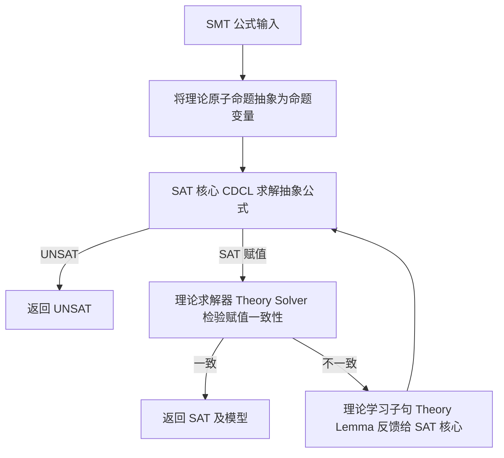
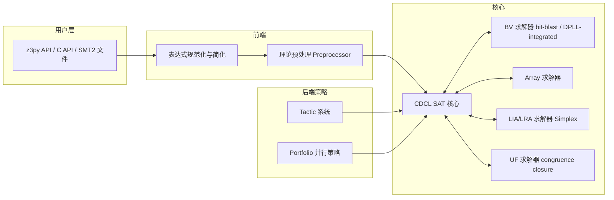
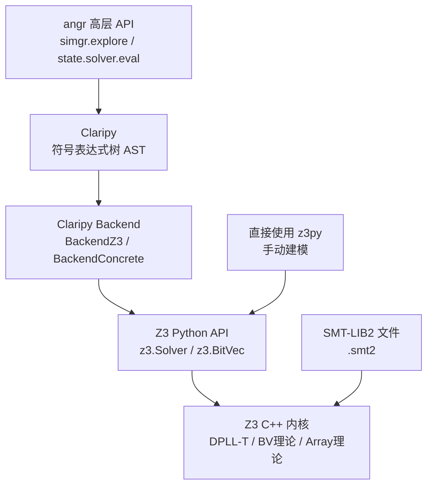
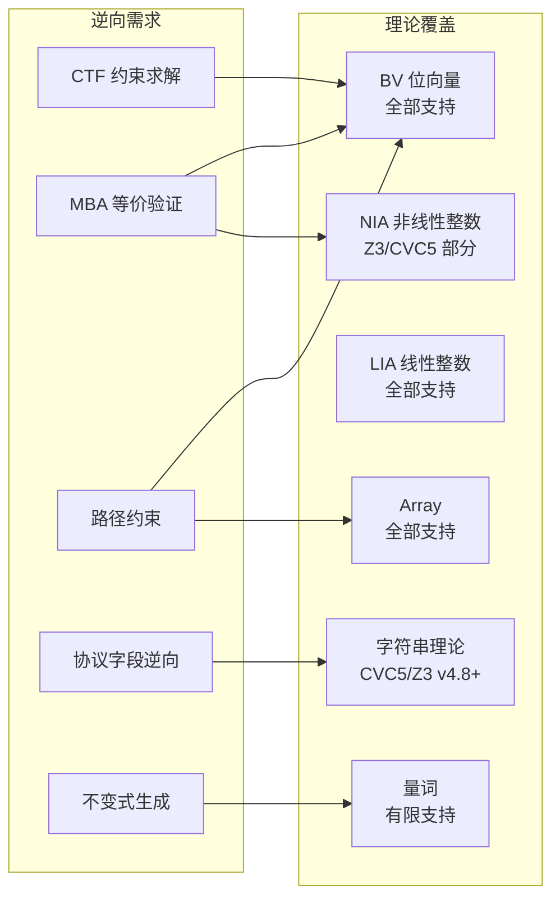

---
tags:
  - 反编译器
  - 反汇编
  - tier3
  - SMT
  - Z3
---
# SMT 约束求解器在逆向工程中的系统应用

> [!abstract] TL;DR
> SMT（可满足性模理论）求解器是现代逆向工程的形式化推理引擎。它不仅是符号执行的路径约束求解后端（angr/Z3），更是不透明谓词证明、MBA 等价验证、密码常量求解、CTF 自动化破解、代码等价性检查的通用基础设施。本章系统讲解 SMT 从理论到 API 的完整技术栈，重点覆盖 Z3 Python API 的逆向工程惯用模式、DPLL(T) 架构的内部工作原理、各主流求解器的取舍策略，以及在实际分析中遭遇的性能陷阱与可判定性边界。

## 概述与定位

逆向工程本质上是一种"逆向推断"过程——从二进制行为推断程序语义，从混淆形式推断原始意图，从路径执行推断输入约束。这些推断任务的共性是：**在一个符号化的变量空间里，找到满足若干约束的赋值，或证明某等价关系成立**。这正是 SMT 求解器的核心能力。

### SMT 在系列章节中的定位

本系列第 11 章（angr 符号执行）已将 Z3 作为路径约束的最后一公里求解器；第 16 章（不透明谓词）用 SMT 做谓词永真/永假的证明；第 18 章（MBA 混淆）依赖 SMT 做化简后等价性验证。这三处均把 SMT 视为配套工具。本章的目标是**反转视角**：以求解器为中心，系统阐明其理论基础、内部架构、API 体系，以及在逆向工程中所有值得专门建模的应用场景。

### 为什么需要专门学习 SMT 层

使用 angr/Claripy 等高层封装的逆向工程师，往往在遇到以下情况时不知所措：

1. **路径约束无法在超时内求解**：不理解位向量理论（BV）与线性算术（LIA）混用时的复杂度爆炸原因，无法采取切割策略。
2. **需要证明等价性而非找解**：angr 的 `solver.eval()` 只给赋值，无法直接表达"对所有输入，函数 A 的输出等于函数 B 的输出"这样的全称命题。
3. **需要对内存和数组建模**：符号执行中符号化内存的每次读写都是一次 Array 理论查询，理解这层才能调优内存模型。
4. **需要直接建模密码学结构**：S-box 查表、模加/模乘、密钥编排等可以精确用 BV 位向量表达，不通过符号执行而是直接写约束。

---

## 原理与机制

### 布尔可满足性（SAT）基础

SAT（Satisfiability Problem）是判定一个命题逻辑公式是否存在使其为真的变量赋值的问题。它是 NP 完全问题，是所有 SMT 理论的共同底层。

一个 SAT 实例的典型形态是合取范式（CNF）：
```
(x₁ ∨ ¬x₂ ∨ x₃) ∧ (¬x₁ ∨ x₂) ∧ (x₂ ∨ ¬x₃)
```
现代 SAT 求解器（MiniSAT、CaDiCaL、Glucose）使用 **CDCL（冲突驱动子句学习）** 算法：通过单元传播（Unit Propagation）推断、在冲突时学习新子句、以启发式策略回跳（non-chronological backtracking）。这使得工业级 SAT 求解器能在百万变量规模上运行。

### SMT 的扩展：带理论的可满足性

SMT（Satisfiability Modulo Theories）在 SAT 之上扩展了**背景理论（background theory）**，允许公式包含整数/实数算术、数组、位向量等丰富的语义域。

SMT 中常见理论及其在逆向中的对应场景：

| 理论缩写 | 全名 | 逆向工程中的对应 |
|---------|------|----------------|
| BV | Bit-Vector Theory（位向量）| x86/ARM 寄存器、整数溢出、位操作 |
| Array | Theory of Arrays | 内存建模、查找表 |
| UF | Uninterpreted Functions | 未知函数、黑盒 API 调用 |
| LIA | Linear Integer Arithmetic | 循环边界、数组下标约束 |
| LRA | Linear Real Arithmetic | 浮点运算的抽象近似 |
| NIA | Non-linear Integer Arithmetic | 乘法、MBA 非线性项（常导致不可判定） |

**位向量理论（BV）** 在逆向中最为核心，因为 x86/ARM 的所有操作（移位、与/或/异或、加法溢出、符号扩展）都在 BV 层有精确的一一对应语义，不需要任何抽象损失。

### DPLL(T) 架构：SMT 求解器内部机制

现代 SMT 求解器普遍采用 **DPLL(T) 架构**（Davis-Putnam-Logemann-Loveland with Theories），其工作流程如下：



其核心循环：
1. **抽象（Abstraction）**：将 `x + y > 5` 这样的理论原子替换为新命题变量 `p₁`，形成纯命题公式。
2. **SAT 求解**：对抽象公式找到一个命题赋值（如 `p₁ = true`）。
3. **理论检验**：把赋值还原为理论语句（`x + y > 5 = true`），发给对应的理论求解器验证语义一致性。若不一致（如当前赋值在 BV 域下矛盾），生成 **理论引理（theory lemma）** 作为新子句加入 SAT 核心。
4. **循环**直到全局一致（SAT）或 SAT 核心无解（UNSAT）。

多个理论求解器可以并行存在，通过 **Nelson-Oppen 方法** 做跨理论推理：各理论求解器共享等式推导，通过不断交换等式等价类（equality class）来达成全局一致。

### 量词（Quantifier）与可判定性边界

无量词的 BV、Array、LIA 均是可判定（decidable）的——存在终止的判定算法。引入全称量词（∀）或存在量词（∃）后情况急剧恶化：

- **∃BV**（存在量词 + 位向量）：可判定，但在最坏情况下是 PSPACE 完全。
- **∀BV**（全称量词 + 位向量）：等价验证的典型形态（"对所有 x，f(x) = g(x)"），可归约为 ∃BV 的否定，同样可判定，但实际求解代价极高。
- **包含非线性整数乘法的量词公式**：一般不可判定（等同于 Diophantine 方程可满足性，Hilbert 第十问题）。

这解释了为什么 MBA 反混淆中的非线性项（如 `(x & y) * z`）直接用 SMT 建模往往超时——NIA 理论在有乘法时不再有完整的决策过程。

---

## 结构/算法/伪代码详解

### Z3 的内部架构层次

Z3 是微软研究院开发的工业级 SMT 求解器，其内部分为以下层次：



**Tactic 系统** 是 Z3 的重要特性：用户可以组合预定义的证明策略（如 `bit-blast`、`simplify`、`ctx-solver-simplify`）形成求解管线，对特定结构的公式（如纯 BV 公式）选择最优路径。

### BV 位向量的逆向工程建模

位向量的关键操作及 z3py 对应：

```python
from z3 import *

# 创建 32 位符号变量
x = BitVec('x', 32)
y = BitVec('y', 32)

# 位操作：与、或、异或、非
expr_and = x & y
expr_or  = x | y
expr_xor = x ^ y
expr_not = ~x

# 移位（逻辑右移 vs 算术右移）
lshr = LShR(x, 3)   # 逻辑右移（无符号）
ashr = x >> 3        # 算术右移（有符号）

# 符号扩展与零扩展（x86 的 movsx vs movzx 语义）
x8  = BitVec('x8', 8)
sx  = SignExt(24, x8)   # 符号扩展到 32 位
zx  = ZeroExt(24, x8)  # 零扩展到 32 位

# 拼接与提取（concat/extract，对应 x86 高低字节访问）
hi = Extract(31, 16, x)  # 提取高 16 位
lo = Extract(15,  0, x)  # 提取低 16 位
xy = Concat(x, y)         # 拼接为 64 位

# 有符号 vs 无符号比较（ULT/UGT vs SLT/SGT）
unsigned_lt = ULT(x, y)  # 无符号小于
signed_lt   = x < y      # 有符号小于（z3py 默认）

# 溢出检测
overflow_add = BVAddNoOverflow(x, y, False)  # 无符号加法是否溢出
```

这些操作几乎与 x86 指令集语义一一对应，使得逆向工程师可以直接将反汇编指令翻译为 BV 表达式，无需任何抽象损失。

### 求解、优化与模型提取

```python
from z3 import *

# 基本求解流程
s = Solver()
x = BitVec('x', 32)
s.add(x * x == 0x51)     # 添加约束
s.add(ULT(x, 0x100))     # 无符号小于 256
result = s.check()         # 返回 sat / unsat / unknown

if result == sat:
    m = s.model()
    print(m[x].as_long())  # 提取具体值

# 优化：寻找满足约束的最小/最大值
opt = Optimize()
x = BitVec('x', 32)
opt.add(x + 42 == 100)
opt.minimize(x)
opt.check()
print(opt.model()[x])

# 全解枚举（block model 技巧）
s = Solver()
x = BitVec('x', 8)
s.add((x & 0xF) == 0x3)
solutions = []
while s.check() == sat:
    m = s.model()
    v = m[x].as_long()
    solutions.append(v)
    s.add(x != v)          # 阻断当前解
print(f"共 {len(solutions)} 个解: {solutions}")
```

### Array 理论：内存建模

逆向工程中的内存读写可以精确映射到 SMT Array 理论：

```python
from z3 import *

# 内存模型：32 位地址 -> 8 位字节
Mem = Array('Mem', BitVecSort(32), BitVecSort(8))

# 读取（Load）
byte_at_0x1000 = Select(Mem, BitVecVal(0x1000, 32))

# 写入（Store，返回新数组，纯函数式语义）
Mem2 = Store(Mem, BitVecVal(0x1000, 32), BitVecVal(0xCC, 8))

# 小端序 32 位读取（4 个字节 concat）
def load32_le(mem, addr):
    b0 = Select(mem, addr)
    b1 = Select(mem, addr + 1)
    b2 = Select(mem, addr + 2)
    b3 = Select(mem, addr + 3)
    return Concat(b3, b2, b1, b0)  # 小端序组装

addr = BitVec('addr', 32)
val32 = load32_le(Mem, addr)
```

这是 angr 的 `MemoryMixin` 在背后执行的操作。当符号地址（`addr` 是符号变量）出现时，约束求解器需要在 Array 上进行约束推理，这正是 angr 内存爆炸的根源之一。

### 增量求解与假设（Incremental Solving / Assumptions）

增量求解是性能优化的核心机制，允许在保留已学习引理的前提下添加/撤销约束：

```python
from z3 import *

s = Solver()
x = BitVec('x', 32)
y = BitVec('y', 32)

# 添加基础约束（持久）
s.add(x + y == 100)
s.add(UGT(x, 0))

# 使用 push/pop 做探索性分析
s.push()          # 保存当前状态
s.add(x > 50)    # 临时约束：x 大于 50 时是否有解？
r1 = s.check()   # sat
s.pop()           # 撤销临时约束（保留引理）

s.push()
s.add(x < 0)     # 临时约束：x 有符号小于 0？
r2 = s.check()   # 取决于类型语义
s.pop()

# 假设（assumption）：更高效，直接作为条件命题
result = s.check(x > 50, y < 50)  # 不影响求解器内部学习状态
```

假设（assumption）的优势在于不触发 push/pop 的栈操作，只向 CDCL 核心传入附加假设子句，所有学习到的引理在 check 后仍然保留。这是高频路径分析场景（如程序路径树的大量分支）的首选模式。

---

## 工具视角与实战

### 主流 SMT 求解器横向对比

| 求解器 | 开发方 | 优势场景 | 逆向工程常用度 |
|--------|--------|----------|----------------|
| Z3 | 微软研究院 | BV/Array/UF 综合、Python API 完善、angr 默认 | ★★★★★ |
| CVC5 | Stanford/Iowa/NYU | 量词推理、字符串理论、SMT-LIB2 兼容 | ★★★ |
| Boolector/Bitwuzla | JKU Linz | 纯 BV 和 Array 最快、嵌入式使用 | ★★★★ |
| Yices 2 | SRI International | 混合理论、速度稳定 | ★★★ |
| MathSAT 5 | Trento 大学 | 量词、Horn 子句、不变式生成 | ★★ |

**Bitwuzla**（Boolector 的重写版）在纯 BV 基准上（SMT-COMP BV 轨道）长期名列前茅，适合密码分析、固件约束等无需高级理论的场景。angr 新版本已支持将 Bitwuzla 替换 Z3 作为 Claripy 后端。

**CVC5** 的字符串理论（theory of strings）使其在分析处理字符串的代码（如协议解析、序列化格式逆向）时具有独特优势。

### 应用场景一：不透明谓词的 SMT 证明

不透明谓词（opaque predicate）是混淆工具插入的恒真或恒假条件。对 `if (x² + x - 1 & 1 == 0)` 这类谓词，穷举验证不现实，SMT 可在数秒内证明：

```python
from z3 import *

x = BitVec('x', 32)

# 不透明谓词：7(x)(x+1) 对所有整数 x 是偶数（恒真）
# 转换为 BV：7*x*(x+1) & 1 == 0 恒成立？
predicate = (7 * x * (x + 1) & 1) == 0

# 证明全称命题：∀x. predicate(x) 成立
# 等价于证明 ∃x. ¬predicate(x) 不可满足
s = Solver()
s.add(Not(predicate))
result = s.check()

if result == unsat:
    print("不透明谓词证明：该条件恒为真")
elif result == sat:
    print(f"非不透明谓词，反例: {s.model()[x]}")
```

第 16 章（反汇编对抗）中的不透明谓词批量识别流程，即是对每个候选条件跑此类查询。批量时应使用增量求解，复用基础约束的学习引理。

### 应用场景二：MBA 表达式等价验证

第 18 章（MBA 混淆）的 SiMBA 等反混淆工具在化简后需要验证原式与简化式语义等价：

```python
from z3 import *

x, y = BitVecs('x y', 64)

# 原始 MBA 表达式（典型混淆后的 x + y）
mba_orig = (x ^ y) + 2 * (x & y)

# 期望的简化目标
simple = x + y

# 等价性检验：∀x,y. mba_orig(x,y) = simple(x,y)
s = Solver()
s.add(mba_orig != simple)  # 假设不等价，看是否 UNSAT
result = s.check()

if result == unsat:
    print("等价！MBA 表达式化简正确")
else:
    m = s.model()
    print(f"不等价，反例: x={m[x].as_signed_long()}, y={m[y].as_signed_long()}")
```

对非线性 MBA（含 `x * y`、`(x & y) * (x | y)` 等项），Z3 在 NIA 理论下可能超时或返回 `unknown`。此时需要：
- 限制位宽（降至 8 位/16 位）做采样验证
- 使用 `bv` tactic 强制位爆炸（bit-blast）：`z3.Then(z3.Tactic('simplify'), z3.Tactic('bit-blast'), z3.Tactic('sat'))`
- 降级为随机测试（100w 随机输入）配合等价验证（伪验证）

### 应用场景三：CTF 约束建模与自动求解

CTF 中的 keygen/crackme 类题目可以直接将验证逻辑逐指令翻译为 SMT 约束：

```python
from z3 import *

# 模拟如下 C 验证逻辑（CTF 典型模式）
# char flag[8]; 
# assert(flag[0] ^ flag[1] == 0x37);
# assert(flag[0] + flag[2] == 0xAB);
# assert((flag[3] << 2) | flag[4] == 0x9C);
# assert(flag[5] * flag[6] == 0x1590);
# assert(flag[7] == 0x7E);

flag = [BitVec(f'f{i}', 8) for i in range(8)]
s = Solver()

# 可打印字符约束
for c in flag:
    s.add(UGE(c, 0x20))
    s.add(ULE(c, 0x7E))

# 验证逻辑约束
s.add(flag[0] ^ flag[1] == 0x37)
s.add(ZeroExt(8, flag[0]) + ZeroExt(8, flag[2]) == 0xAB)
s.add(((flag[3] << 2) | flag[4]) == 0x9C)
s.add(ZeroExt(8, flag[5]) * ZeroExt(8, flag[6]) == 0x1590)
s.add(flag[7] == 0x7E)

if s.check() == sat:
    m = s.model()
    result = ''.join(chr(m[c].as_long()) for c in flag)
    print(f"Flag: {result}")
```

注意乘法结果需要零扩展（ZeroExt）以避免位溢出截断导致约束语义与原 C 代码不符。

### 应用场景四：路径约束求解（与 angr 的对比）

angr 使用 Claripy 封装了 Z3，提供更高层的符号内存和路径管理：

```python
import angr, claripy

proj = angr.Project('/path/to/binary', auto_load_libs=False)
flag = claripy.BVS('flag', 8 * 16)      # 16 字节符号输入
state = proj.factory.full_init_state(
    args=['./binary'],
    stdin=claripy.Concat(*[flag[i*8:(i+1)*8] for i in range(16)])
)
simgr = proj.factory.simgr(state)
simgr.explore(find=0x401234, avoid=0x401500)

if simgr.found:
    solution = simgr.found[0].solver.eval(flag, cast_to=bytes)
    print(solution)
```

直接使用 Z3 而绕过 angr 的场景：当二进制的验证逻辑已通过 IDA 反编译为伪代码，可以直接手动建模，避免符号执行的路径爆炸开销。这通常快 10-100 倍，尤其是逻辑层次清晰的 CrackMe 类题目。

### 应用场景五：密码学常量与魔数求解

密码学算法的常量（如 MD5 的 T 表、SHA-256 的 K 常量、TEA 的 delta = 0x9E3779B9）可以用 SMT 反向求解。更重要的是，当固件使用了未知的私有算法时，可以建模其输入输出关系进行密钥恢复：

```python
from z3 import *

# 已知明文-密文对的简单密钥恢复
# 假设：cipher[i] = (plain[i] ^ key[i % 4]) + key[(i+1) % 4]
key = [BitVec(f'k{i}', 8) for i in range(4)]
s = Solver()

# 可见性约束：密钥是可打印字符
for k in key:
    s.add(UGE(k, 0x20))
    s.add(ULE(k, 0x7E))

# 已知明文-密文对（从流量捕获或调试获得）
known = [
    (0x41, 0x73),  # plain, cipher
    (0x42, 0x85),
    (0x43, 0x76),
    (0x44, 0x88),
]
for i, (p, c) in enumerate(known):
    predicted = (BitVecVal(p, 8) ^ key[i % 4]) + key[(i+1) % 4]
    s.add(predicted == BitVecVal(c, 8))

if s.check() == sat:
    m = s.model()
    k = bytes(m[k].as_long() for k in key)
    print(f"恢复密钥: {k}")
```

### 应用场景六：代码等价性检查（函数语义比对）

二进制补丁分析中，需要证明补丁后的函数与原函数在特定输入域等价（或找到差异输入）：

```python
from z3 import *

# 原始函数：return (x * 2 + 1) & 0xFF（有漏洞版本）
def f_orig(x):
    return (x * 2 + 1) & 0xFF

# 补丁函数：return (x * 2) & 0xFF（修复了某个整数语义）
def f_patched(x):
    return (x * 2) & 0xFF

# 用 SMT 建模
x = BitVec('x', 8)
orig    = (x * 2 + 1) & 0xFF
patched = (x * 2)     & 0xFF

s = Solver()
s.add(orig != patched)  # 找行为差异的输入
result = s.check()

if result == sat:
    m = s.model()
    xv = m[x].as_long()
    print(f"差异输入 x={xv}: orig={((xv*2+1)&0xFF)}, patched={(xv*2)&0xFF}")
```

这可以自动化地生成触发补丁差异的测试用例，用于 PoC 构造或 1-day 漏洞分析。

### 应用场景七：去混淆的等价验证

对 OLLVM 的指令替换（instruction substitution）混淆，如将 `a + b` 替换为 `a - (-b)`，`a ^ b` 替换为 `(a | b) - (a & b)`，SMT 可以批量验证这些等价替换，辅助模式识别去混淆器的规则校验：

```python
from z3 import *

a, b = BitVecs('a b', 32)
s = Solver()

# 验证 OLLVM 指令替换：a + b == a - (-b)
s.add((a + b) != (a - (-b)))
assert s.check() == unsat, "规则错误：两者不等价"
s.reset()

# 验证：a ^ b == (a | b) - (a & b)
s.add((a ^ b) != ((a | b) - (a & b)))
assert s.check() == unsat, "规则错误：两者不等价"
print("所有 OLLVM 替换规则验证通过")
```

这种模式可以构建一个"等价规则库"，在自动化去混淆流水线中作为规则安全阀。

### angr Claripy 与原生 Z3 的层次关系



Claripy 的主要附加值是：管理符号变量的生命周期、维护路径约束集合、处理并发求解。当逻辑足够清晰时（如已反编译的 CrackMe），直接用 z3py 是最高效路径。

---

## 安全性与正确使用

### 性能陷阱与超时处理

**陷阱一：非线性约束混入 BV**

BV 理论本身包含乘法（`*`），但位爆炸（bit-blast）之后 BV 乘法展开为指数级 AND/OR 电路。当操作数宽度增加时（32 位乘法 = 1024 个命题变量的乘法器电路），SAT 核心承受的负担急剧增大。

缓解策略：
- 减少位宽（8 位 or 16 位建模，除非精度关键）
- 将乘法分解为移位+加法（如常数乘法可编译展开）
- 使用 `z3.Tactic('qfbv')` 触发针对 BV 的专用决策过程

**陷阱二：大型 Array 的符号地址访问**

`Select(Mem, sym_addr)` 中 `sym_addr` 为符号变量时，求解器需要对所有可能地址建模，在大地址空间下代价极高。

缓解策略：
- 对已知地址范围添加显式约束（`UGE(sym_addr, base)`, `ULT(sym_addr, end)`）
- 使用惰性求解（lazy evaluation）模型：先对地址范围做粗粒度 BV 约束，仅在需要具体字节时展开
- 分区建模：将内存分为若干固定区域，各区域用独立 Array 表示

**陷阱三：路径爆炸转移至求解器**

符号执行中路径爆炸的一部分会转移为单个约束集过大的问题。当路径条件含有数百个条件分支的连接时，CDCL 的冲突分析空间变得巨大。

缓解策略：
- 使用 `solver.set("timeout", 5000)` 设置毫秒级超时
- 启用增量求解，避免重复求解相同前缀约束
- 对重复子结构使用 `z3.substitute()` 手动共享

**陷阱四：量词的错误使用**

初学者常把等价证明写成存在量词（错误）而非否定全称量词的存在等价：

```python
# 错误：这只是在找一个 x 使条件成立
s.add(ForAll([x], f(x) == g(x)))  # Z3 在无量词决策过程不可用时返回 unknown

# 正确：Skolem 化为存在量词否定
s.add(f(x) != g(x))               # 若 UNSAT 则证明全称等价
```

### 可判定性边界与 unknown 处理

Z3 在以下情况可能返回 `unknown`：
1. 存在量词的 BV 公式（超出 QF_BV 片段）
2. 非线性整数算术（NIA）
3. 求解器超时

```python
result = s.check()
if result == unknown:
    reason = s.reason_unknown()  # 返回 "timeout" / "incomplete" / ...
    print(f"无法判定，原因: {reason}")
    # 此时 s.model() 不可调用，s.statistics() 可查看求解器状态
```

`unknown` 不是错误，是求解器诚实报告其能力边界。逆向工程师需要：
- 降低约束复杂度后重试
- 切换到随机测试作为补充
- 接受"概率性验证"而非"形式化证明"的结论强度差异

### 主流求解器的能力矩阵



### 形式化保证的适用边界

SMT 求解在 `sat` 和 `unsat` 两种结论上具有**完备的形式化保证**：

- **sat + 模型**：模型是原公式的真实满足赋值，100% 可信。
- **unsat + 证明（proof object）**：若 Z3 配置 `produce-proofs = true`，可获取不可满足性证明，可用 DRAT-trim 等工具独立验证。
- **unknown**：无形式化保证，需要其他手段补充。

因此，在以下逆向场景中，SMT 可作为**可靠的形式化根据**：
- 不透明谓词识别（unsat = 永真/永假证明）
- 精确的 CrackMe 解（sat = 具体输入值）
- 简化规则的正确性校验（unsat = 等价性证明）

而对于超时或 unknown 的情况，应当明确标注结论为"未能证明"而非"已证伪"。

---

## 小结

SMT 求解器是逆向工程中形式化推理能力的基础设施。其核心价值可以总结为以下几点：

**能力核心**：在有限位宽的符号变量空间中，以形式化方式给出满足性判断或等价性证明，且保证正确性（在可判定片段内）。

**技术底座**：DPLL(T) 架构将 SAT 的组合搜索能力与理论求解器的语义精度相结合，位向量理论（BV）是逆向工程最常用的理论，其与 x86/ARM 指令集语义的对应几乎是完美的。

**工程实践要点**：
1. 位宽控制是性能的主要杠杆：32 位 BV 和 8 位 BV 的乘法复杂度相差 16 倍。
2. 增量求解（push/pop/assume）对路径树遍历至关重要。
3. unknown 是诚实边界，不是错误：非线性项、量词、超时均可触发。
4. 等价验证用"否定 + UNSAT"模式，而非量词 ForAll（后者触发不完整决策过程）。
5. Bitwuzla 在纯 BV 场景下通常比 Z3 快；CVC5 在字符串理论场景更强。

**与其他章节的关系**：
- 第 11 章 angr 是 Z3 的高层封装，路径约束是 SMT 的自动化应用
- 第 16 章不透明谓词识别依赖本章的 UNSAT 证明模式
- 第 18 章 MBA 等价验证是本章 BV 等价检验的直接应用
- 第 25 章反编译正确性验证将本章技术扩展到函数级语义等价

掌握 SMT 层的核心技能后，逆向工程师能够在混淆分析、漏洞研究、CTF、协议逆向等场景中独立构建形式化推理模型，而不再依赖符号执行框架的黑盒行为。

---

## 相关阅读

- **《Programming Z3》** — Z3 官方教程，覆盖全部理论和 API（在线文档 https://microsoft.github.io/z3guide/programming/Z3%20Python%20-%20Tired%20of%20SAT）
- **《SAT/SMT by Example》** — Dennis Yurichev 著，大量逆向工程/密码分析 SMT 建模实例，免费 PDF
- **de Moura, L., Bjørner, N. (2008). Z3: An Efficient SMT Solver** — TACAS 2008，Z3 原始论文
- **Niemetz, A., Preiner, M. (2023). Bitwuzla** — CAV 2023，最新 BV/Array 专用求解器
- **Barbosa, H. et al. (2022). cvc5** — TACAS 2022，CVC5 系统论文
- **Ganesh, V., Dill, D. (2007). A Decision Procedure for Bit-Vectors and Arrays** — CAV 2007，STP 求解器，奠定 BV+Array 理论组合基础
- **Symbolic Execution for Software Testing: Three Decades Later** — ACM CACM 2013，符号执行综述，SMT 在其中的角色
- **angr: A System for Binary Analysis** — USENIX WOOT 2016，介绍 angr+Claripy+Z3 的集成架构
- 本系列第 11 章《符号执行与 angr 框架》——SMT 在路径探索中的实际应用
- 本系列第 18 章《MBA 混淆原理与自动化反混淆》——BV 等价验证的典型工程场景

---

[[00.反编译器与反汇编引擎原理总览|⬆ 系列总览]] | [[23.变量恢复与栈帧分析|← 上一章]] | [[25.反编译正确性验证|→ 下一章]]
