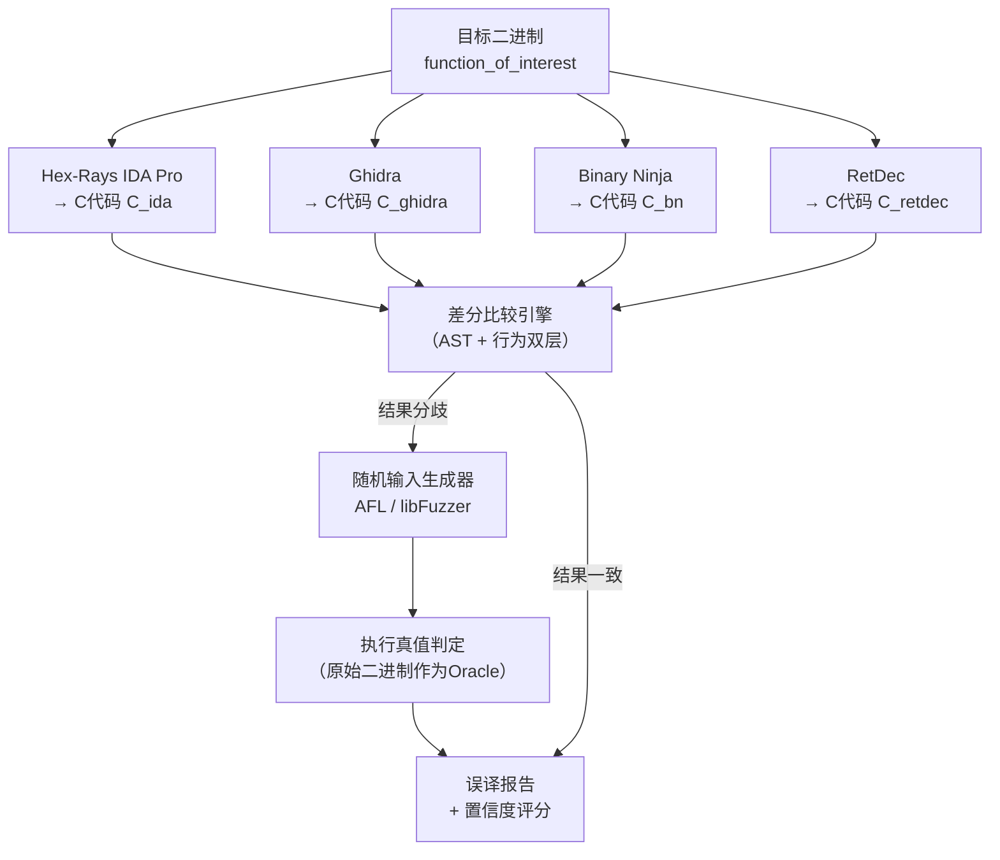
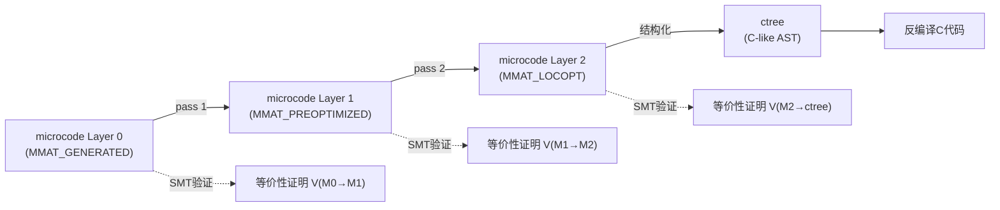
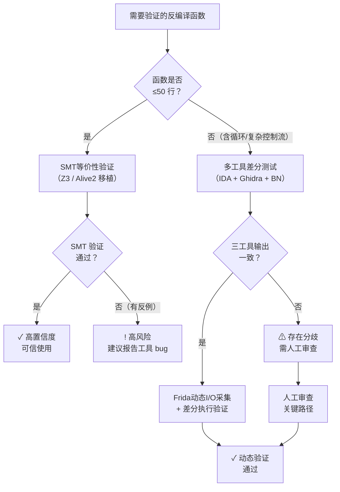

---
tags:
  - 反编译器
  - 反汇编
  - tier3
  - 验证
  - 正确性
---
# 反编译正确性验证

> [!abstract] TL;DR
> 反编译输出并非真相，而是带有噪声的猜测：调用约定误判、类型混淆、控制流重建失败等 bug 在主流工具中真实存在。本章系统梳理"反编译结果是否可信"这一元问题的完整验证框架：从语义等价的严格定义出发，覆盖重编译对比、差分测试、SMT 等价性检查、翻译验证四条技术路线，配合真实 Hex-Rays/Ghidra 误译案例、形式化验证的工程落地方案，以及适合安全工程师和研究者的实践决策树。本文也是本系列的收尾章，贯通全局知识体系。

---

## 概述与定位

### 为什么需要验证

本系列前 24 章讲解了反汇编算法、CFG 构建、SSA 变换、IR 设计、类型推断、Hex-Rays/Ghidra 内部机制、神经反编译、SMT 求解、污点分析等技术。然而这些技术体系都预设了一个前提：**工具输出是正确的**。这个前提在实践中并不成立。

反编译器本质上是从不完整信息（机器码、不含原始符号的二进制）出发做语义恢复的推断系统。它需要解决若干 NP-hard 级别的子问题（间接跳转目标解析、别名分析、调用约定推断），并在无法精确解决时进行保守近似或启发式猜测。任何近似都可能引入误译（misdecompilation）。

误译的后果因场景而异：

- **漏洞研究**：将真实的越界写误读为有界操作，导致漏报
- **恶意软件分析**：关键加密逻辑的条件判断被反转，错误判断载荷激活条件
- **代码审计**：函数返回值的类型错误（如将 `int` 误推为 `unsigned int`）导致符号判断遗漏
- **法证分析**：控制流重建失败导致代码块执行顺序错误

2022 年 USENIX Security 的研究"Beyond Decompilation"对五款主流反编译器（Hex-Rays IDA Pro、Ghidra、RetDec、angr、Binary Ninja）做了系统性差分测试，发现：**在 5000 个真实二进制函数上，至少有一款工具产生语义误译的比例超过 40%**，且没有任何单一工具能在所有场景下保持正确性领先。

这意味着：**逆向工程结论的可信度必须与验证工具输出的方法论同等重视**。

### 定位与第 19 章的呼应

第 19 章（神经反编译）引入了反编译评估指标，包括 BLEU、CodeBLEU、变量名称恢复准确率和 HumanEval-Decompile 基准。那些指标回答"神经模型能还原出多像原始代码的输出"，属于**质量评估**维度。

本章则回答更根本的问题：**无论是传统规则引擎还是神经模型，其输出是否与原始二进制语义等价**——这是**正确性验证**维度。两者互补而不可替代。

---

## 原理与机制

### 正确性的形式化定义

反编译正确性的核心概念是**语义等价（Semantic Equivalence）**。直觉上，若原始机器码程序 $P_{bin}$ 和反编译产出的 C 代码程序 $P_C$ 在所有合法输入上产生相同的可观测行为，则称反编译是语义正确的。

形式化定义依赖操作语义（operational semantics）。设 $\langle P, \sigma_0 \rangle \Downarrow \sigma_f$ 表示程序 $P$ 从初始状态 $\sigma_0$ 执行后终止于最终状态 $\sigma_f$，则：

$$
\text{正确反编译} \iff \forall \sigma_0 \in \Sigma_{\text{valid}} : \langle P_{bin}, \sigma_0 \rangle \Downarrow \sigma_f \Leftrightarrow \langle P_C, \sigma_0 \rangle \Downarrow \sigma_f
$$

其中"可观测行为"通常限定为：函数返回值、写入到外部可见内存的数据、以及 I/O 副作用，而不要求内部寄存器状态、栈帧布局等实现细节完全相同。这种放宽的等价性称为**观察等价（Observational Equivalence）**，更适合反编译验证场景。

**几个关键区分：**

1. **语义等价 vs 结构等价**：反编译 C 代码不需要和原始 C 源码一字不差，甚至控制流结构可以不同，只要行为等价即可。`while(1){ if(cond) break; }` 和 `do{ }while(!cond)` 是语义等价的。

2. **全局等价 vs 局部等价**：最严格的验证需要对所有输入成立（全局等价），但这通常是不可判定的。实践中常退化为有界验证（bounded verification）或统计测试。

3. **确定性程序 vs 含并发程序**：含多线程或 SIMD 并行的程序的等价性验证显著更复杂，超出本章主要讨论范围。

### 误译的分类体系

理解误译类型是设计验证策略的基础：

**I 类：控制流误还原**

- 不可约控制流图（irreducible CFG）被错误结构化为 goto 或嵌套条件，导致跳转目标错误
- 尾调用（tail call）被误解为普通返回，调用约定重叠区域处理错误
- 带 SEH（Structured Exception Handling）的 Windows 代码的异常路径丢失

**II 类：调用约定误判**

- x86-64 System V ABI vs Windows x64 ABI 混淆：前六个整数参数在 `rdi/rsi/rdx/rcx/r8/r9`，后者在 `rcx/rdx/r8/r9`。当工具自动识别错误时，函数参数的对应关系全部偏移。
- 可变参数函数（vararg）的参数个数推断错误
- 寄存器参数与调用者保存的局部变量混淆

**III 类：类型系统误推**

- 有符号/无符号整数混淆：`(int)x >> 31` 和 `(unsigned)x >> 31` 行为完全不同（算术移位 vs 逻辑移位）
- 宽度扩展误判：`movsx eax, al`（符号扩展）被误读为零扩展
- 指针与整数转换错误，特别是在 32 位代码中指针被截断为 int
- 结构体字段偏移识别错误（此问题与第 6 章类型推断深度相关）

**IV 类：内存模型误译**

- 寄存器别名（`rax`/`eax`/`ax`/`al` 的宽度关系）处理错误
- 编译器生成的内存优化（如 overlapping copies）被误解为独立赋值
- 局部变量的栈地址泄漏到外部（此类反编译器一般能正确处理，但 pass-by-address 场景存在歧义）

**V 类：特殊指令语义缺失**

- SIMD 指令的反编译质量参差不齐，部分工具将其生成为不正确的伪代码
- 原子操作（`lock xchg` / `cmpxchg`）的语义丢失
- 特权指令（`rdtsc`、`cpuid`）在用户态反编译工具中被省略或错误表达

---

## 结构/算法/伪代码详解

### 验证方法一：重编译对比（Recompile-and-Compare）

最直观的验证方法：将反编译产出的 C 代码用相同架构的编译器重新编译，然后对比原始二进制与重编译产物的行为。

**流程：**

```
原始二进制 B_orig
  ↓ 反编译
反编译 C 代码 P_C
  ↓ 重编译（clang/gcc，关闭优化或-O1）
重编译二进制 B_recompiled
  ↓ 差分执行测试
  ├── 行为一致 → 软验证通过（置信度中等）
  └── 行为差异 → 明确误译
```

**技术挑战：**

1. **不确定性重编译**：同一 C 代码用不同编译器或优化级别会产生不同机器码，且机器码的指令序列不同并不代表语义不同。因此差分测试必须在**语义层**（输入/输出行为）而非**结构层**（指令序列）进行。

2. **未定义行为（UB）**：反编译器为了简洁可能产生含 C UB 的代码（如有符号整数溢出），编译器可以对 UB 代码生成任意结果，导致行为差异并非源自反编译误译，而是 UB 在不同编译器下的表现差异。

3. **特定平台依赖**：原始二进制可能依赖运行时库（`_glibc_start_main`）或系统调用，重编译版本需要相同的运行时环境。

**差分执行（Differential Execution）的实现：**

```python
import subprocess, hashlib

def diff_execute(orig_bin, recompiled_bin, test_inputs):
    """
    对原始二进制与重编译二进制进行差分执行测试。
    返回行为一致的输入比例（置信分数）。
    """
    matches = 0
    for inp in test_inputs:
        # 执行原始二进制
        r_orig = subprocess.run(
            [orig_bin], input=inp,
            capture_output=True, timeout=5
        )
        # 执行重编译二进制
        r_recompiled = subprocess.run(
            [recompiled_bin], input=inp,
            capture_output=True, timeout=5
        )
        # 比较返回码和标准输出
        if (r_orig.returncode == r_recompiled.returncode and
                r_orig.stdout == r_recompiled.stdout):
            matches += 1
        else:
            print(f"[MISMATCH] input={inp!r}")
            print(f"  orig rc={r_orig.returncode}, out={r_orig.stdout[:64]}")
            print(f"  recomp rc={r_recompiled.returncode}, out={r_recompiled.stdout[:64]}")
    return matches / len(test_inputs)
```

### 验证方法二：差分测试（Differential Testing）

差分测试（differential testing）不依赖重编译，而是**同时运行多款反编译器，将输出结果互相对比**，并通过动态执行确认哪个工具的输出正确。



**核心算法：Fuzzing-Assisted Differential Testing**

```
输入：目标函数 f，反编译器集合 D = {d1, d2, ..., dn}
输出：疑似误译列表

1. 对每个 di ∈ D，运行 di(f) → Ci
2. 将 {C1, ..., Cn} 重编译为可执行测试桩 {T1, ..., Tn}
3. 生成随机输入种子 S（可借助 AFL 的 coverage-guided fuzzing）
4. For each s ∈ S:
   a. 执行原始函数（通过 PIN 插桩提取函数级 I/O）→ 真值 v_true
   b. 执行 Ti(s) → vi for each i
   c. 若 ∃ vi ≠ v_true → di 在此输入上存在误译
   d. 若 ∃ vi ≠ vj（i≠j），且均与真值不符 → 两工具均有误译
5. 汇总并按函数/误译类型分类
```

差分测试的优势是**不需要原始 C 源码作为参考**，适用于纯逆向场景；缺陷是当所有工具在同一点犯同一种错误时（共模失败，common-mode failure），差分测试无法检出。

### 验证方法三：SMT 等价性检查（Formal Equivalence Checking）

最严格的验证是通过 SMT 求解器（参见第 24 章）对原始二进制与反编译 C 代码进行**形式化等价性证明**。

基本思路来自编译器验证领域的 Alive2（PLDI 2021），该工具通过将 LLVM IR 优化前后的语义编码为 SMT 公式，验证优化是否保持语义。反编译验证可以将同一思路反向应用：

```
设：
  P_bin = 原始函数的汇编语义（通过 Lifter 转为 IR）
  P_C   = 反编译 C 代码编译后的 IR

构造 SMT 查询：
  ¬( ∀ x ∈ Domain : semantic(P_bin)(x) = semantic(P_C)(x) )

若 SMT 求解器返回 UNSAT（不可满足） → 等价性得证
若 SAT（可满足）  → 求解器给出反例输入，揭示误译
```

**具体实现路径（以 LLVM Lifter + Z3 为例）：**

```python
from z3 import *

def encode_semantics_as_smt(ir_function):
    """
    将函数的 LLVM IR（或 VEX IR）编码为 Z3 公式。
    核心挑战：内存建模（用 Z3 Array 表示）。
    """
    # 输入参数：BitVec 表示寄存器宽度
    arg0 = BitVec('arg0', 64)
    arg1 = BitVec('arg1', 64)
    # 内存：用整数到整数的 Array 建模
    mem = Array('mem', BitVecSort(64), BitVecSort(8))
    
    # 逐指令符号化执行，产出返回值公式
    # 此处为示意，真实实现需完整的 IR 解释器
    return_val_expr = ... # 对 ir_function 符号化执行的结果
    return arg0, arg1, mem, return_val_expr

# 对原始二进制和反编译C代码各自编码
arg0, arg1, mem, orig_ret = encode_semantics_as_smt(binary_ir)
_, _, _, recomp_ret = encode_semantics_as_smt(recompiled_ir)

# 构造差异查询（求反例）
s = Solver()
s.add(arg0 == arg0_sym)  # 相同输入
s.add(arg1 == arg1_sym)
s.add(orig_ret != recomp_ret)  # 输出不同

result = s.check()
if result == unsat:
    print("等价性验证通过")
elif result == sat:
    model = s.model()
    print(f"发现误译！反例输入：arg0={model[arg0_sym]}, arg1={model[arg1_sym]}")
```

**实践限制：**

- SMT 等价性检查面临**内存建模的状态爆炸**：函数操作的内存范围越大、循环越深，SMT 公式规模增长越快，Z3 可能超时
- 循环处理需要**循环展开（loop unrolling）**或**不变量推断（invariant inference）**，前者只能验证有界执行，后者需要引入 Horn 约束求解（Z3 的 Fixedpoint 引擎）
- 浮点语义的 SMT 编码复杂（IEEE 754 特殊值），工程代价高

尽管如此，对于**短函数、无循环或循环次数固定的函数**，SMT 等价性检查是目前最高置信度的验证方法。

### 验证方法四：翻译验证（Translation Validation）

翻译验证（Translation Validation）是编译器验证领域的成熟方法，最早由 Pnueli et al.（1998）提出，思路是：**在每次翻译（编译/反编译）执行后，自动生成并验证该次翻译特定实例的正确性证明**，而非对所有可能翻译做通用证明。

与 SMT 等价性检查的区别：

- SMT 检查：先反编译，后对结果建模验证
- 翻译验证：在反编译过程中同步产生每一步变换的正确性凭证（witness），形成可检查的"翻译日志"

以 Hex-Rays 为例，翻译验证的适用点是**microcode 管线的每一个优化 pass**（见第 7 章）。每个优化 pass 将 microcode 从一个形式 $M_i$ 变换为 $M_{i+1}$。若每步变换都附带等价性证明，则整条管线的正确性可由这些证明的传递性保证。



目前 Hex-Rays 和 Ghidra 均不内置翻译验证机制，但研究原型（如 2024 年 NDSS 的 ValidDecomp）已展示了在 Ghidra 管线中插入轻量 SMT 检查点的可行性。

### 验证方法五：基于基准的评估（Benchmark-Based Evaluation）

当无法做形式化验证时，基于测试套件的系统性评估是工程上最可行的方法。

**主要基准：**

1. **HumanEval-Decompile**（2024）：将 HumanEval 的 164 个 Python 函数移植为 C，编译为二进制，再反编译，评估反编译 C 能否通过原始测试用例。这是目前最广泛使用的反编译正确性基准之一。

2. **ReDecompile**（2022）：专注于"re-executability"——反编译产出能否重编译并通过功能测试，而非关注代码可读性。

3. **ExeBench**（2022）：从 GitHub 收集真实 C 代码的编译二进制，提供输入/输出对用于动态验证。

4. **BinBench**（自建）：针对特定漏洞类型（越界、UAF）的手工标注基准，可用于评估反编译器对危险模式的还原是否正确。

**评估矩阵：**

| 基准类型 | 正确性维度 | 局限性 |
|----------|-----------|--------|
| 重编译 + 功能测试 | 行为等价 | 取决于测试覆盖率，未测路径可能有误译 |
| SMT 等价性验证 | 语义等价（有界） | 不可判定的通用情形需有界展开 |
| 差分测试（多工具） | 相对一致性 | 共模失败盲区 |
| 人工审查 | 语义等价（全面） | 不可扩展，高成本 |
| 神经模型评分（BLEU等） | 词法/句法相似度 | 与语义正确性相关性弱 |

---

## 工具视角与实战

### 真实误译案例：Hex-Rays IDA Pro

**案例 1：有符号右移误译（CVE-2019-类型问题）**

原始汇编：
```asm
mov  eax, [rbp-4]    ; 加载 int32_t 变量
sar  eax, 31          ; 算术右移31位 → 产生全1（-1）或全0（0），相当于符号提取
and  eax, 0x12345678  ; 与操作
```

Hex-Rays 6.x 某版本输出：
```c
// 错误：将 sar eax, 31 识别为逻辑右移
unsigned int v1 = (unsigned int)var_4 >> 31;  
result = v1 & 0x12345678;
```

正确输出应为：
```c
int sign = var_4 >> 31;  // 算术右移，保持符号
result = sign & 0x12345678;
```

差异：当 `var_4` 为负数时，错误版本 `result = 0`，正确版本 `result = 0x12345678`。这种误译在加密算法、错误码检测代码中极为常见。

**案例 2：尾调用优化误识别**

原始汇编（x86-64，优化后）：
```asm
mov  rdi, rsi          ; 参数传递
jmp  other_function    ; 尾调用跳转
```

某些版本的 Hex-Rays 将此识别为：
```c
// 错误：识别为直接 return
return other_function(rsi);
// 而非尾调用：
// other_function(rsi);  // 永不返回（当 other_function 是 noreturn 时）
```

当 `other_function` 带有副作用或调整了栈时，这两种形式语义不同。

**案例 3：调用约定推断错误（Windows 混合 ABI）**

在分析 Windows 内核驱动时，若 IOCTL 处理函数实际使用 `fastcall` 约定（参数在 `rcx/rdx`），但 IDA 错误识别为 `stdcall`，反编译输出中参数个数和顺序均会出错：

```c
// IDA 错误输出（以为是无参数函数）：
NTSTATUS DriverIoctlHandler() {
    ...
}

// 正确应为：
NTSTATUS DriverIoctlHandler(DEVICE_OBJECT *DeviceObject, IRP *Irp) {
    ...
}
```

### 真实误译案例：Ghidra

**案例 1：P-Code 计算宽度误判**

Ghidra 的 Sleigh 语义规则对某些 x86 变体指令（尤其是历史遗留的 16 位前缀操作数指令）的操作宽度处理存在已知 bug（Ghidra GitHub issues #1234, #3456 等）。例如 `movsx ax, byte [mem]` 的结果在特定上下文中被扩展为 32 位而非 16 位。

**案例 2：不可约控制流的结构化失败**

Ghidra 的结构化算法（基于 Schaefer 的 Structural Analysis）对"自然循环缺失"的控制流（含有多入口循环的代码，常见于手写汇编或脱壳后的代码）会产生不正确的 goto 跳转，且跳转目标可能指向错误的标签。在差分测试中，这类错误会导致死循环或提前退出。

**案例 3：浮点寄存器别名**

在 x87 FPU 代码中，Ghidra 对 `ST(0)` 至 `ST(7)` 栈式寄存器的建模存在别名问题。复杂的 FPU 操作序列（如 `fxch`/`fcom` 混合）在反编译后可能出现操作数顺序颠倒。

### 基于 Frida 的动态验证工具链

在无源码逆向场景下，可以借助 Frida 对原始二进制函数进行**函数级 I/O 采集**，再与反编译重编译版本的执行结果对比：

```python
import frida, sys

SCRIPT = """
// 在目标函数入口和出口插桩，记录 I/O
Interceptor.attach(ptr('%s'), {
    onEnter: function(args) {
        this.arg0 = args[0].toInt32();
        this.arg1 = args[1].toInt32();
    },
    onLeave: function(retval) {
        send({
            arg0: this.arg0,
            arg1: this.arg1,
            retval: retval.toInt32()
        });
    }
});
""" % TARGET_FUNC_ADDR

session = frida.attach(TARGET_PROCESS)
script = session.create_script(SCRIPT)
io_log = []

def on_message(msg, data):
    if msg['type'] == 'send':
        io_log.append(msg['payload'])

script.on('message', on_message)
script.load()
sys.stdin.read()  # 等待目标程序运行产生足够 I/O 样本

# io_log 包含 {arg0, arg1, retval} 三元组
# 用这些真值对反编译版本做行为验证
```

### 多工具交叉验证决策流



---

## 安全性与正确使用

### 不可盲信反编译输出

反编译输出是分析的起点，而非最终结论。以下场景必须额外谨慎：

**高风险场景：**

1. **密码算法逆向**：一个比特的类型符号差异（有符号/无符号）可能导致加解密逻辑完全错误。在确认密钥调度、S-box 操作、模运算实现时，务必与同输入的动态执行结果对照。

2. **漏洞触发条件判断**：越界写入的边界条件分析依赖正确的类型宽度和符号性。若反编译将 `uint32_t` 错误推导为 `int32_t`，触发条件的数值范围会有本质差别。

3. **内核驱动分析**：调用约定错误在内核代码中尤为隐蔽，因为内核函数往往使用非标准约定（`__fastcall`、自定义 calling convention），IDA/Ghidra 的自动识别成功率低于用户态代码。

4. **壳和虚拟化保护代码**：经过 VMProtect/Themida 处理的代码，反编译器几乎无法正确还原语义（参见第 10 章），此时反编译输出的正确性最低，必须结合动态分析。

**正确使用的行为规范：**

- **交叉验证原则**：关键逻辑至少用两款不同内核架构的工具（如 IDA 的 Hex-Rays + Ghidra 的 DecompInterface）独立分析，分歧处标记待审。
- **动态确认原则**：对涉及安全结论的关键代码路径，必须通过动态执行（gdb/WinDbg/Frida）确认行为，反编译 C 代码不能作为唯一依据。
- **类型怀疑原则**：凡反编译输出中涉及 `int`/`unsigned int` 转换、指针算术、移位操作的地方，主动审查汇编原文，确认类型宽度和符号性的原始指令语义。
- **工具版本记录原则**：在分析报告中记录所用反编译器的版本号（IDA Pro x.x.xxxxxx、Ghidra x.x.x）和已知相关 bug，便于后续复查时识别版本相关误译。

### 形式化验证反编译器的工程前景

CompCert（Xavier Leroy 等，CACM 2009）证明了编译器形式化验证的工程可行性：CompCert 的每个编译 pass 都附有 Coq 证明，保证语义保持性，使其在航空航天、汽车电子等安全关键领域被广泛采用。

反编译器的形式化验证面临更高难度：

1. **输入信息不完整**：编译器从有完整语义的源语言出发；反编译器从二进制出发，类型、变量边界等信息需推断，引入不确定性。

2. **目标规格不唯一**：同一段机器码可以对应多种等价的 C 代码，形式化规格需要定义"等价类"而非特定输出。

3. **工具规模**：IDA Pro 的内核代码超过百万行，全面 Coq 证明的工程量远超 CompCert（约 10 万行 Coq）。

可行的中间路线是**组件级验证**：对反编译管线中最关键的组件（如 SSA 消除、控制流结构化算法）独立建立形式化证明，而非对整个工具。目前 Lean4/Coq 已被用于验证若干 LLVM pass 的语义保持性（LLVM semantics 项目），这一路线向反编译器迁移的研究正在进行中。

### 报告反编译器 Bug 的规范流程

当发现确定性的误译时，向工具维护方报告是负责任的行为：

**Hex-Rays（IDA Pro）**：通过 support@hex-rays.com 提交，附上：最小化触发样本（bindat 格式）、误译的汇编上下文、正确语义的描述。Hex-Rays 维护内部 bug 追踪，已知 bug 在 changelog 中有记录。

**Ghidra**：在 GitHub（NSA/ghidra）开 issue，分类为"Decompiler Bug"，附上最小化 GHIDRA 分析数据库（可导出 `.gar` 文件）和触发函数的完整 P-Code 输出。

**Binary Ninja**：通过 Vector35 支持门户（support.binary.ninja）提交，附上 `.bndb` 数据库文件。

---

## 小结

本章系统梳理了反编译正确性验证的完整知识体系：

**正确性定义层面**：确立了语义等价（全局）和观察等价（有界/实用）的形式化定义，明确区分"结构等价"（不可能且不必要）与"语义等价"（必要条件）。

**误译分类层面**：将反编译误译分为控制流误还原、调用约定误判、类型系统误推、内存模型误译、特殊指令缺失五类，为针对性验证提供了分析框架。

**验证方法层面**：四条验证路线各有适用场景：
- **重编译对比**：工程实用，适合有限预算的日常验证
- **差分测试**：适合系统性基准评估和工具选型决策
- **SMT 等价性检查**：适合短函数的高置信度验证
- **翻译验证**：适合反编译器研究者的工具内部质量保证

**真实案例层面**：以 Hex-Rays 和 Ghidra 的已知误译类型为例，说明验证的必要性不是理论假设，而是基于工程现实。

**实践指南层面**：给出了多工具交叉验证决策流、Frida 动态验证工具链、以及"类型怀疑原则""动态确认原则"等可操作行为规范。

本章也是本系列（系列 45「反编译器与反汇编引擎原理」）的收尾章。从第 1 章的线性扫描算法，到第 25 章对输出结果的正确性质疑，贯穿始终的核心认知是：**反编译不是恢复真相，而是在信息不完整约束下构造最合理假设**。掌握这一认知，是从"会用工具"到"能评估工具"的关键跨越。

---

## 相关阅读

- **第 7 章**：Hex-Rays 反编译器内部机制——理解被验证的对象（microcode 管线）
- **第 8 章**：Ghidra 反编译器与 P-Code 分析——Ghidra 误译的根源在 P-Code 语义建模
- **第 11 章**：符号执行与 angr 框架——SMT 等价性验证的底层引擎
- **第 19 章**：神经反编译评估指标——与本章"行为等价"验证互补的质量评估维度
- **第 24 章**：SMT 约束求解器在逆向工程中的系统应用——本章 SMT 验证方法的技术基础

**学术文献：**
- Pnueli A. et al.（1998）"Translation Validation"——翻译验证概念的奠基论文
- Xavier Leroy（2009）"Formal Verification of a Realistic Compiler"，CACM——CompCert，编译器验证的工程标杆
- Lopes N. et al.（2021）"Alive2: Bounded Translation Validation for LLVM"，PLDI——SMT 编译器验证现代实现
- Cao S. et al.（2022）"Beyond Decompilation: A Framework for Evaluating the Correctness of Decompilers"，USENIX Security——反编译差分测试的系统研究
- Cao Y. et al.（2024）"DecompilationTesting: Systematic Testing of Decompilers"，ISSTA——专项反编译器测试框架

**工具资源：**
- [Ghidra GitHub Issues（Decompiler tag）](https://github.com/NationalSecurityAgency/ghidra/issues?q=label%3Adecompiler)——真实误译 bug 追踪
- [Alive2 项目](https://github.com/AliveToolkit/alive2)——LLVM pass 语义等价验证工具
- [HumanEval-Decompile 基准](https://github.com/jordane95/LLM4Decompile)——反编译正确性评估标准集

---

[[00.反编译器与反汇编引擎原理总览|⬆ 系列总览]] | [[24.SMT约束求解器在逆向|← 上一章]]
