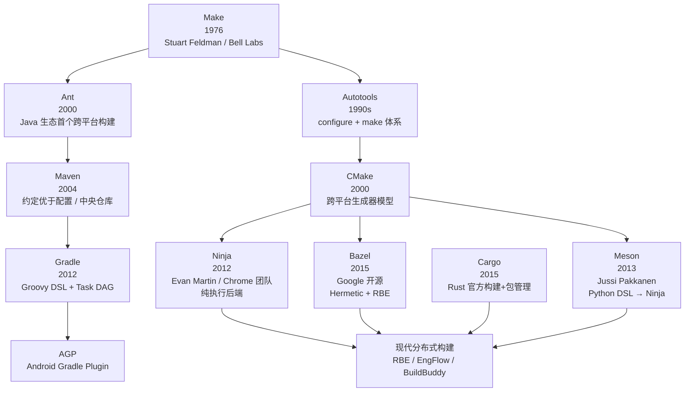
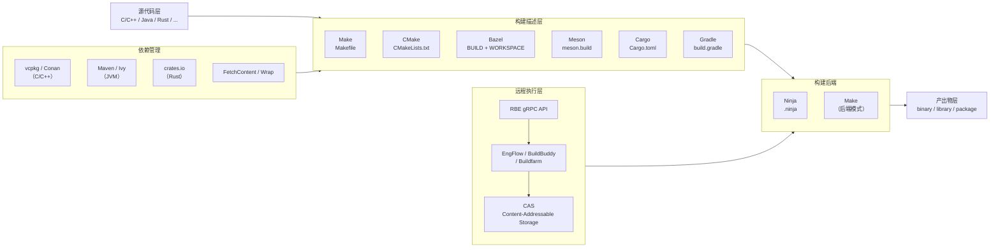

---
tags:
  - build-systems
  - tools
  - tier3
created: 2026-06-30
---
# 构建系统横向对比总览

构建系统是软件工程基础设施的核心组件，负责将源代码转化为可执行产物。本系列横向比较主流构建系统的设计哲学、实现机制与适用场景，涵盖 Make、CMake、Bazel、Ninja、Meson、Gradle、Cargo 等工具，以及增量构建、分布式执行、供应链安全等横切主题。

---

## 构建系统发展史

---

## 构建系统架构分层全景

---

## 系列章节目录

| 序号 | 章节 | 核心主题 |
|------|------|----------|
| 01 | [[01.构建系统概论与横向对比框架]] | 构建系统定义、分类维度、横向对比框架 |
| 02 | [[02.Make与Makefile深度解析]] | 规则语法、自动变量、隐式规则、递归 Make 问题 |
| 03 | [[03.CMake跨平台构建系统]] | 生成器模型、Modern CMake、FetchContent、CPack |
| 04 | [[04.Bazel与大型单仓构建]] | Starlark、沙盒执行、Aspect、Persistent Worker |
| 05 | [[05.Ninja构建后端原理]] | .ninja 语法、deps 跟踪、pool 并发控制 |
| 06 | [[06.Meson现代C++构建]] | meson.build DSL、Wrap 依赖、跨编译支持 |
| 07 | [[07.Gradle与JVM生态构建]] | Task DAG、增量构建、AGP、Gradle Enterprise |
| 08 | [[08.Cargo与Rust构建系统]] | Cargo.toml、Cargo.lock、build.rs、Workspace |
| 09 | [[09.构建系统的依赖管理]] | vcpkg/Conan/crates.io/Maven 对比 |
| 10 | [[10.增量构建与缓存机制]] | mtime vs 内容哈希、Action Graph、构建缓存 |
| 11 | [[11.分布式构建与远程执行]] | RBE 协议、EngFlow、BuildBuddy、CAS |
| 12 | [[12.构建系统安全性与供应链]] | SLSA、SBOM、依赖混淆、恶意构建脚本 |
| 13 | [[13.构建系统性能优化与实战选型]] | 性能对比、选型矩阵、迁移路径 |

---

> [!tip] 学习建议
> **推荐学习路径**：
> 1. 先读 **01**（概论与框架），建立横向对比的认知脚手架
> 2. 按需深入单一工具：**02**（Make）→ **03**（CMake）→ **05**（Ninja）是 C/C++ 工程师必读三件套
> 3. **04**（Bazel）适合大型单仓/分布式场景，与 **11** 配合阅读
> 4. **08**（Cargo）是 Rust 开发者入门必读，设计最现代
> 5. **09**（依赖管理）和 **12**（安全）是横切关注点，可在任意阶段插入
> 6. 最终以 **13** 做选型决策，结合自身项目规模和技术栈

---

## 导航

[[../45.反编译器与反汇编引擎原理/00.反编译器与反汇编引擎原理总览|← 45. 反编译器与反汇编引擎原理]] | [[01.构建系统概论与横向对比框架|01. 构建系统概论与横向对比框架 →]]
