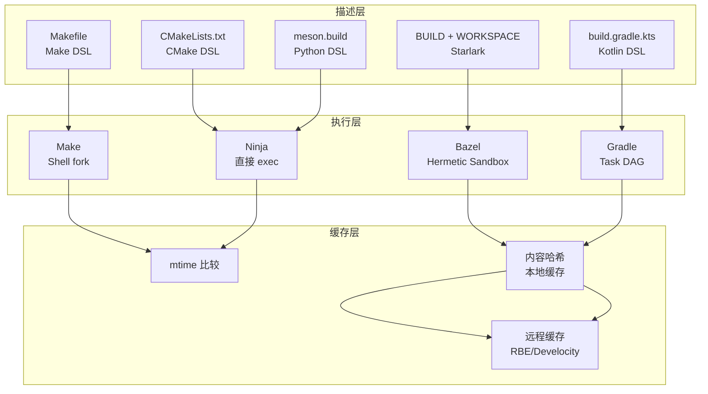
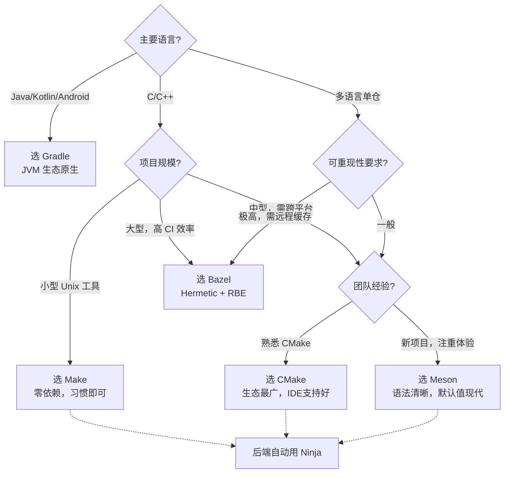

---
tags:
  - build-systems
  - tier3
  - overview
  - comparison
---
# 构建系统概论与横向对比框架

> [!abstract] TL;DR
> 构建系统的本质是将源码（输入）经过有向无环图（DAG）调度转换为产物（输出）。其三大根本难题——增量正确性、构建速度、可复现性——决定了不同系统的设计哲学分野。本章建立统一的三层架构模型（描述层/执行层/缓存层），深入分析 DAG 与拓扑排序的数学基础、时间戳 vs 内容哈希的工程取舍，并对 Make、CMake、Bazel、Ninja、Meson、Gradle 六大主流系统进行横向对比，帮助读者在选型时建立清晰的决策框架。

## 概述与定位

### 什么是构建系统

构建系统解决一个核心问题：**给定一组源文件，以正确的顺序、最小的重复工作，生成目标产物**。

形式化定义：
- **输入**：源文件集合 S、构建规则集合 R、环境变量集合 E
- **过程**：从 S 和 R 构造 DAG，拓扑排序后调度执行
- **输出**：目标产物集合（可执行文件、库、包、文档等）

增量构建的关键在于：识别哪些节点的输入发生了变化，只重新执行这些节点及其下游。

### 三大根本难题

理解构建系统，必须先理解它要解决的三个相互张力的根本问题：

**难题一：增量正确性（Incremental Correctness）**

构建系统的增量判断必须做到"不多编、不少编"，但这两端都有代价。少编意味着漏掉了真正应该重建的目标，产生错误的输出产物——这是静默的正确性 bug，最难察觉；多编意味着做了不必要的重复工作，浪费时间。

增量正确性的难点在于：不是只有源文件内容发生变化才需要重建，编译选项的变化、链接器版本的变化、环境变量的变化，同样可能导致输出产物发生变化。一个只追踪源文件时间戳的系统，天然无法感知"你刚刚把 `-O2` 改成了 `-O3`"这件事，结果就是旧的 `.o` 文件被保留使用，而输出产物的实际行为却已经发生了改变。

**难题二：构建速度（Build Speed）**

构建速度由两个截然不同的指标组成：冷构建（从零开始）的总耗时，和增量构建（修改一个文件后）的响应时间。大型项目往往冷构建耗时数小时，但开发者的日常体验取决于增量构建能否在数秒内完成。

构建速度优化有两个方向：一是减少需要执行的工作量（增量），二是提升并行度（并行）。这两个方向都依赖于 DAG 分析的正确性：错误的 DAG 会导致不必要的串行依赖，白白浪费可并行的机会；而过于激进的并行也可能因竞争条件破坏正确性。

**难题三：可复现性（Reproducibility）**

相同的源码在不同机器、不同时间、不同用户环境下构建，是否产生字节级别相同的输出？这个问题在小型项目中通常被忽略，但在以下场景中至关重要：

- **CI/CD 缓存共享**：只有输出确定，才能安全地在不同 CI 机器间共享缓存产物
- **供应链安全**：可复现性是验证构建产物来源的基础（reproducible builds 项目）
- **调试效率**：当 "在我机器上能跑" 的问题出现时，非复现性构建是根因之一

不可复现的常见根源包括：嵌入了时间戳、用户名、机器路径、随机排序的文件系统遍历顺序等。

### 历史演进

| 年代 | 事件 |
|------|------|
| 1976 | Stuart Feldman 在贝尔实验室发明 Make |
| 1997 | Peter Miller 发表《Recursive Make Considered Harmful》|
| 2000 | Ant 诞生，Java 生态第一个主流构建工具 |
| 2006 | CMake 2.x 广泛采用，跨平台元构建系统兴起 |
| 2008 | Gradle 0.1 发布，Groovy DSL 构建 JVM 生态 |
| 2012 | Ninja 首发，专注纯执行速度 |
| 2013 | Meson 创建，现代 Python DSL |
| 2015 | Google 开源 Bazel，单仓大规模构建进入公共视野 |

## 原理与机制

### DAG 与拓扑排序：构建系统的数学内核

所有构建系统，无论外表多么不同，其执行引擎的数学本质都是同一件事：**对有向无环图（DAG）做拓扑排序，然后调度执行**。

理解这个数学基础，就理解了为什么构建系统要这样设计。

一个构建 DAG 的节点是构建产物（`.o` 文件、`.a` 库、可执行文件等），有向边表示依赖关系：若 A 依赖 B，则存在边 A → B，意为"必须先完成 B，才能构建 A"。拓扑排序保证了每个节点在其所有前驱节点完成之后才被处理。

DAG 的无环性是正确性的前提。循环依赖（A 依赖 B，B 依赖 A）意味着不存在任何合法的构建顺序，构建系统必须拒绝这种情况。Make 遇到循环依赖会打印警告并尝试继续，Bazel 和 Meson 会直接报错终止。

**拓扑排序与并行度的关系**：拓扑排序不是唯一的，在任意时刻，所有"入度为零"（所有依赖均已完成）的节点都可以并行执行。这就是 `make -j N` 和 `ninja -j N` 的并行化基础——构建系统找出当前所有就绪节点，提交给线程池并发执行，某个节点完成后检查是否有新的节点入度变为零，如此循环直至全图完成。

因此，构建速度的上限由 DAG 的**关键路径**（从根到叶的最长路径）决定，而非节点总数。如果所有文件都串行依赖，即使给 128 核机器也无法并行；而如果依赖图扁平，大量节点可以同时开始，效率极高。

### 三层架构模型

所有主流构建系统都可以用三层架构描述：

```
┌─────────────────────────────────┐
│         描述层（Description）     │  Makefile / CMakeLists.txt / BUILD
├─────────────────────────────────┤
│         执行层（Execution）       │  Make / Ninja / Shell 调用链
├─────────────────────────────────┤
│         缓存层（Caching）         │  mtime / 内容哈希 / 远程缓存
└─────────────────────────────────┘
```

**描述层**负责声明 target、依赖关系、构建命令；**执行层**负责拓扑排序与并行调度；**缓存层**负责判断哪些 target 是最新的（up-to-date），避免重复执行。

这个分层的意义在于：它们可以解耦组合。CMake 是纯描述层工具，它生成的 `build.ninja` 或 `Makefile` 分别交由 Ninja 或 Make 的执行层处理。Meson 同样如此。这种解耦让上层工具可以专注于"怎么表达构建意图"，而不必重新实现高性能的并行调度器。

### 增量构建原理：mtime 与内容哈希的工程取舍

增量构建有两种主流策略，理解它们的差异是理解各构建系统设计取舍的核心：

**时间戳比较（mtime）**：Make 的默认策略。若 target 的 mtime 晚于所有 prerequisites 的 mtime，则跳过。这个策略极简高效，但存在多个结构性缺陷：

- **时钟漂移**：NFS/分布式文件系统中，不同机器的时钟不完全同步，导致 mtime 比较出现竞争条件。
- **touch 误触发**：文件内容未变但 `touch` 过（如 Git checkout 后的时间戳重置），会触发不必要的重建。
- **无法跨机器共享**：mtime 只有本地意义，A 机器编译的 `.o` 文件无法告诉 B 机器"这个文件已经是最新的了"。
- **命令行变化不感知**：你把 `-O2` 改成 `-O3`，但 `.c` 文件的 mtime 没变，Make 会错误地认为 `.o` 仍然有效。

**内容哈希（content hash）**：Bazel/Gradle 等现代系统采用。对所有输入（源文件内容 + 编译命令 + 工具链路径等）计算哈希（通常是 SHA-256），存入 action cache。哈希完全匹配才视为缓存命中。

内容哈希彻底解决了 mtime 的所有问题：文件名可以变，时钟可以漂移，但内容哈希不说谎。更关键的是，它使得**跨机器远程缓存**成为可能：CI 机器 A 编译的结果，只要输入哈希与 B 机器的查询键匹配，B 机器就可以直接拉取，完全跳过编译。

内容哈希的代价是计算开销。对大量文件计算 SHA-256 本身有延迟，因此现代系统通常结合 mtime 做两阶段判断：先用 mtime 快速过滤未修改文件，再对 mtime 变化的文件计算哈希确认。

### 并行调度

构建系统在 DAG 中识别无依赖关系的节点，并行执行。关键参数：
- Make：`-j N`（N 个并行 job）
- Ninja：`-j N -l LOAD`（同时限制 CPU 负载）
- Bazel：`--jobs=N`（自动检测核心数）

## 结构/算法/伪代码详解

### 横向对比表

| 维度 | Make | CMake | Bazel | Ninja | Meson | Gradle |
|------|------|-------|-------|-------|-------|--------|
| **描述语言** | Makefile DSL | CMake DSL | Starlark（Python子集）| .ninja（生成产物）| Python DSL | Groovy/Kotlin DSL |
| **执行模型** | Shell fork | 元构建→后端 | Hermetic Action Graph | 直接 exec，无 Shell | 委托 Ninja | Task DAG |
| **增量策略** | mtime | 后端决定 | 内容哈希 | mtime+deps DB | Ninja mtime | @Input/@Output 哈希 |
| **远程缓存** | 无 | 无（依赖后端）| RBE 协议原生支持 | 无 | 无 | Develocity |
| **生态** | Unix 工具链 | C/C++/跨平台 | 大型单仓/多语言 | 纯后端 | C/C++/现代跨平台 | JVM/Android |
| **适用场景** | 小中型 C/C++，Makefile 习惯 | 中大型 C/C++，跨平台发行 | 大型单仓，CI 可重现性要求高 | 不直接使用，CMake/Meson 生成 | 新 C/C++ 项目，注重开发体验 | Java/Kotlin/Android 项目 |
| **学习曲线** | 低（语法简单，陷阱多）| 中（Modern CMake 有陡坡）| 高（Hermetic 心智模型）| 极低（几乎不手写）| 低（Python 语法直觉）| 中（DSL + 生命周期）|

### 七大工具的设计哲学分野

各工具并非功能等价的替代品，它们代表了不同的设计哲学，这些哲学来自于不同的规模诉求和历史背景：

**Make 的设计哲学——通用性与极简主义**：Make 诞生于 1970 年代，资源极度受限，Shell 是通用的胶水语言。Make 的设计哲学是"描述依赖关系，调用 Shell 执行一切"——这使它可以构建任何东西，但也意味着它对构建的语义一无所知，只是个通用的依赖追踪器。

**CMake 的设计哲学——跨平台的元抽象**：CMake 的核心洞察是"不同平台的原生构建工具不能统一，但项目的构建意图可以统一描述"。它选择了成为描述层，把执行委托给平台原生工具，从而在不牺牲原生工具性能的前提下实现了跨平台描述。

**Bazel 的设计哲学——确定性与可扩展性**：Bazel 来自 Google 需要在单仓中管理数十亿行代码的实际需求，其核心洞察是"任何不确定性都会在规模上被放大"。因此它把确定性（Hermetic 沙盒、内容哈希、Starlark 纯函数）做到极致，代价是更高的心智负担和入门门槛。

**Ninja 的设计哲学——纯粹的执行速度**：Ninja 的设计者意识到，项目描述（"我有哪些文件，依赖是什么"）和构建执行（"以最快速度运行编译器"）是两件不同的事，而现有工具把它们混在一起。Ninja 选择只做执行，且把执行速度做到极致，完全不支持手写描述，这个"缺点"反而是设计选择。

**Meson 的设计哲学——现代默认值与开发体验**：Meson 在 CMake 已经统治市场时诞生，其设计哲学是"历史遗留问题不应该成为新项目的包袱"。它用 Python 风格的 DSL 降低认知门槛，用现代安全默认值减少配置错误，用 Wrap 系统解决依赖管理痛点。

**Gradle 的设计哲学——语言集成与生态绑定**：Gradle 的核心优势是深度融入 JVM 生态，不仅仅是编译 Java 代码，而是理解 Maven 仓库格式、Kotlin 增量编译器、Android APK 构建流程的所有细节。这种生态绑定是它在 JVM 世界优势的来源，也是为什么 C++ 项目不选择它的原因。

### DAG 拓扑排序伪代码

```
function build(target):
    if target.is_up_to_date():
        return CACHE_HIT
    for dep in target.dependencies:
        build(dep)           # 递归确保依赖已就绪
    execute(target.recipe)
    target.mark_done()
```

实际实现中，现代系统将递归替换为迭代 BFS/DFS + 工作队列，以支持并行执行和避免栈溢出。并行版本的核心是一个就绪队列：当某个节点的所有依赖节点都完成时，该节点进入就绪队列，被工作线程取出执行。节点完成后，系统检查其所有后继节点，若后继节点的所有依赖均已完成，则将后继节点加入就绪队列。

### 构建系统对比架构图



## 工具视角与实战

### 选型决策树



### 典型工具链组合

- **C/C++ 新项目**：`Meson → Ninja`（开发）/ `CMake → Ninja`（发行兼容）
- **Android APP**：`Gradle + AGP → CMake（Native）→ Ninja`
- **Google 规模单仓**：`Bazel（Starlark 描述 + 内置执行）`
- **传统 Unix 工具**：`Autoconf → Make`（兼容性最广）

### 从 Make 迁移的实际考量

很多团队面临"要不要把 Makefile 迁移到更现代的系统"的决策。这里有几个实用判断标准：

**留在 Make 的理由**：项目规模小（几十个文件）、已有完善 Makefile、团队熟悉 Make、没有跨平台需求、没有 CI 缓存共享需求。维护一个好的 Makefile 的成本，可能低于迁移到新系统并培训团队的成本。

**必须迁移的信号**：出现跨目录依赖问题（典型的递归 Make 噩梦）、头文件变更不能正确触发重建、构建结果在不同机器上不一致、CI 构建时间超过 20 分钟且无法利用缓存、需要 Windows/macOS/Linux 三端支持。

**迁移路径**：Make → CMake 是最常见的迁移路径（生态成熟，IDE 支持好）；Make → Meson 适合愿意接受现代工具且不需要向后兼容老系统的新项目；Make → Bazel 适合已经有大规模单仓需求且愿意投入学习成本的团队。

## 安全性与正确使用

### 常见误区

1. **混淆描述层与执行层**：CMake 不构建代码，它生成 Makefile 或 build.ninja，真正编译由 Make/Ninja 完成。Ninja 本身也不描述项目结构，它由上层工具生成。很多初学者在 CMake 报错时去查 Ninja 文档，或在 Ninja 效率低时去调 CMake 参数，都是层次混淆的表现。

2. **mtime 陷阱**：网络文件系统（NFS）时钟不同步会导致 Make 错误判断 up-to-date。解决：使用内容哈希构建系统，或确保 NFS 时钟同步。另一个常见陷阱是 Git 操作后的批量时间戳更新——`git checkout` 会将所有文件的 mtime 设为当前时间，导致 Make 对整个项目做不必要的重建。

3. **并行度滥用**：`make -j` 不加参数会无限并行，链接阶段消耗大量内存可能导致 OOM。建议 `make -j$(nproc)` 或在 Ninja 中配置 Pool。特别是 LTO 链接，单个链接进程可能消耗数十 GB 内存，多个并行链接会直接耗尽系统内存。

4. **缓存污染**：远程缓存的前提是 Hermetic（输入完全确定）。非 Hermetic 构建写入远程缓存会污染其他机器的构建结果。典型案例：构建规则中调用了 `date` 命令，或读取了 `$HOME` 路径下的本地配置文件，这些输出会因机器而异，写入远程缓存后被其他机器拉取，造成难以排查的构建失败。

5. **构建系统与包管理的混淆**：构建系统负责"如何把代码编译成产物"，包管理器负责"如何获取第三方依赖"。CMake 的 FetchContent、Meson 的 Wrap、Bazel 的 WORKSPACE 规则，都是在构建系统层面对包管理的有限覆盖，并不能完全替代 vcpkg/Conan（C++）、Maven Central/Gradle 依赖解析（Java）等专业包管理器。

### 选型原则

- **不要在非 Hermetic 环境开启远程缓存写入**
- **Makefile 中避免使用绝对路径**（破坏可移植性）
- **CI 环境统一构建工具版本**（用 CMake Minimum Version / Gradle Wrapper 锁定）

## 小结

构建系统的核心价值在于**正确性**（输出产物与输入一致）和**效率**（最小化重复工作）。三大根本难题——增量正确性、构建速度、可复现性——在不同工具中有不同的解答方式：Make 用 mtime 换简单，Bazel 用内容哈希换确定性，Ninja 用静态 DAG 换极致速度，Gradle 用 `@Input/@Output` 注解换 JVM 生态深度集成。

三层架构（描述/执行/缓存）是理解任何构建系统的统一框架。DAG 与拓扑排序是所有系统的数学内核，决定了并行度上限（关键路径长度）和正确性下限（入度为零才可执行）。选型时优先考虑：生态匹配度、增量策略的可靠性、团队学习曲线，以及 CI 可重现性需求。后续各章将分别深入每个系统的内部机制。

## 相关阅读

- Peter Miller, *Recursive Make Considered Harmful* (1997)
- Titus Winters 等, *Software Engineering at Google* — Build Systems 章节
- Bazel 官方文档：[https://bazel.build/basics](https://bazel.build/basics)
- Meson 官方文档：[https://mesonbuild.com/](https://mesonbuild.com/)

---
[[00.构建系统横向对比总览|⬆ 系列总览]] | [[01.构建系统概论与横向对比框架|← 上一章]] | [[02.Make与Makefile深度解析|→ 下一章]]
