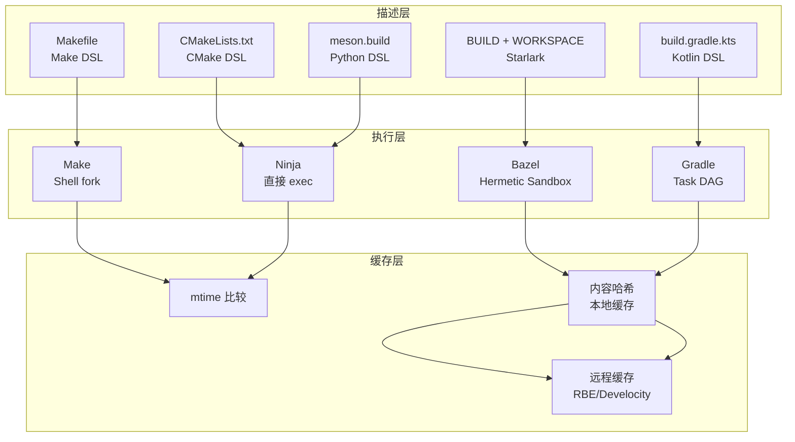
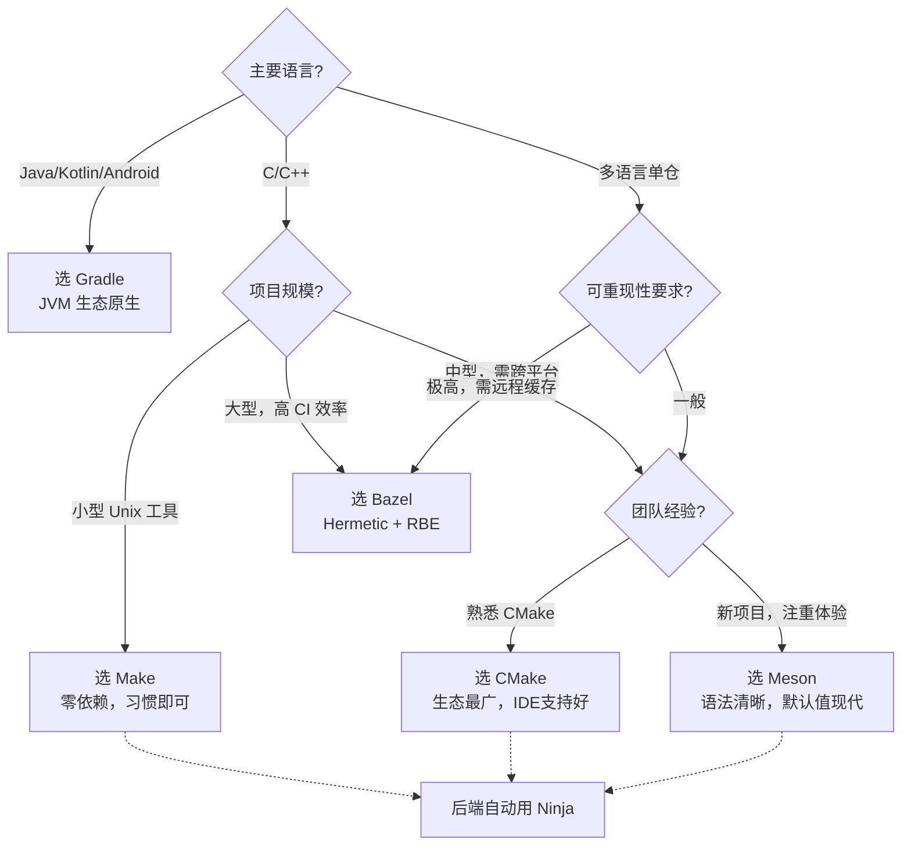

---
tags:
  - build-systems
  - tier3
  - overview
  - comparison
---
# 构建系统概论与横向对比框架

> [!abstract] TL;DR
> 构建系统的本质是将源码（输入）经过有向无环图（DAG）调度转换为产物（输出）。本章建立统一的三层架构模型（描述层/执行层/缓存层），并对 Make、CMake、Bazel、Ninja、Meson、Gradle 六大主流系统进行横向对比，帮助读者在选型时建立清晰的决策框架。

## 概述与定位

### 什么是构建系统

构建系统解决一个核心问题：**给定一组源文件，以正确的顺序、最小的重复工作，生成目标产物**。

形式化定义：
- **输入**：源文件集合 S、构建规则集合 R、环境变量集合 E
- **过程**：从 S 和 R 构造 DAG，拓扑排序后调度执行
- **输出**：目标产物集合（可执行文件、库、包、文档等）

增量构建的关键在于：识别哪些节点的输入发生了变化，只重新执行这些节点及其下游。

### 历史演进

| 年代 | 事件 |
|------|------|
| 1976 | Stuart Feldman 在贝尔实验室发明 Make |
| 1997 | Peter Miller 发表《Recursive Make Considered Harmful》|
| 2000 | Ant 诞生，Java 生态第一个主流构建工具 |
| 2006 | CMake 2.x 广泛采用，跨平台元构建系统兴起 |
| 2008 | Gradle 0.1 发布，Groovy DSL 构建 JVM 生态 |
| 2012 | Ninja 首发，专注纯执行速度 |
| 2013 | Meson 创建，现代 Python DSL |
| 2015 | Google 开源 Bazel，单仓大规模构建进入公共视野 |

## 原理与机制

### 三层架构模型

所有主流构建系统都可以用三层架构描述：

```
┌─────────────────────────────────┐
│         描述层（Description）     │  Makefile / CMakeLists.txt / BUILD
├─────────────────────────────────┤
│         执行层（Execution）       │  Make / Ninja / Shell 调用链
├─────────────────────────────────┤
│         缓存层（Caching）         │  mtime / 内容哈希 / 远程缓存
└─────────────────────────────────┘
```

**描述层**负责声明 target、依赖关系、构建命令；**执行层**负责拓扑排序与并行调度；**缓存层**负责判断哪些 target 是最新的（up-to-date），避免重复执行。

### 增量构建原理

增量构建有两种主流策略：

1. **时间戳比较（mtime）**：Make 的默认策略。若 target 的 mtime 晚于所有 prerequisites 的 mtime，则跳过。简单但存在时钟漂移、跨机器同步等缺陷。

2. **内容哈希（content hash）**：Bazel/Gradle 等现代系统采用。对输入文件内容计算 SHA256，存入 action cache。哈希不变则命中缓存，可跨机器、跨时区共享，是远程缓存的基础。

### 并行调度

构建系统在 DAG 中识别无依赖关系的节点，并行执行。关键参数：
- Make：`-j N`（N 个并行 job）
- Ninja：`-j N -l LOAD`（同时限制 CPU 负载）
- Bazel：`--jobs=N`（自动检测核心数）

## 结构/算法/伪代码详解

### 横向对比表

| 维度 | Make | CMake | Bazel | Ninja | Meson | Gradle |
|------|------|-------|-------|-------|-------|--------|
| **描述语言** | Makefile DSL | CMake DSL | Starlark（Python子集）| .ninja（生成产物）| Python DSL | Groovy/Kotlin DSL |
| **执行模型** | Shell fork | 元构建→后端 | Hermetic Action Graph | 直接 exec，无 Shell | 委托 Ninja | Task DAG |
| **增量策略** | mtime | 后端决定 | 内容哈希 | mtime+deps DB | Ninja mtime | @Input/@Output 哈希 |
| **远程缓存** | 无 | 无（依赖后端）| RBE 协议原生支持 | 无 | 无 | Develocity |
| **生态** | Unix 工具链 | C/C++/跨平台 | 大型单仓/多语言 | 纯后端 | C/C++/现代跨平台 | JVM/Android |
| **适用场景** | 小中型 C/C++，Makefile 习惯 | 中大型 C/C++，跨平台发行 | 大型单仓，CI 可重现性要求高 | 不直接使用，CMake/Meson 生成 | 新 C/C++ 项目，注重开发体验 | Java/Kotlin/Android 项目 |
| **学习曲线** | 低（语法简单，陷阱多）| 中（Modern CMake 有陡坡）| 高（Hermetic 心智模型）| 极低（几乎不手写）| 低（Python 语法直觉）| 中（DSL + 生命周期）|

### DAG 拓扑排序伪代码

```
function build(target):
    if target.is_up_to_date():
        return CACHE_HIT
    for dep in target.dependencies:
        build(dep)           # 递归确保依赖已就绪
    execute(target.recipe)
    target.mark_done()
```

实际实现中，现代系统将递归替换为迭代 BFS/DFS + 工作队列，以支持并行执行和避免栈溢出。

### 构建系统对比架构图



## 工具视角与实战

### 选型决策树



### 典型工具链组合

- **C/C++ 新项目**：`Meson → Ninja`（开发）/ `CMake → Ninja`（发行兼容）
- **Android APP**：`Gradle + AGP → CMake（Native）→ Ninja`
- **Google 规模单仓**：`Bazel（Starlark 描述 + 内置执行）`
- **传统 Unix 工具**：`Autoconf → Make`（兼容性最广）

## 安全性与正确使用

### 常见误区

1. **混淆描述层与执行层**：CMake 不构建代码，它生成 Makefile 或 build.ninja，真正编译由 Make/Ninja 完成。Ninja 本身也不描述项目结构，它由上层工具生成。

2. **mtime 陷阱**：网络文件系统（NFS）时钟不同步会导致 Make 错误判断 up-to-date。解决：使用内容哈希构建系统，或确保 NFS 时钟同步。

3. **并行度滥用**：`make -j` 不加参数会无限并行，链接阶段消耗大量内存可能导致 OOM。建议 `make -j$(nproc)` 或在 Ninja 中配置 Pool。

4. **缓存污染**：远程缓存的前提是 Hermetic（输入完全确定）。非 Hermetic 构建写入远程缓存会污染其他机器的构建结果。

### 选型原则

- **不要在非 Hermetic 环境开启远程缓存写入**
- **Makefile 中避免使用绝对路径**（破坏可移植性）
- **CI 环境统一构建工具版本**（用 CMake Minimum Version / Gradle Wrapper 锁定）

## 小结

构建系统的核心价值在于**正确性**（输出产物与输入一致）和**效率**（最小化重复工作）。三层架构（描述/执行/缓存）是理解任何构建系统的统一框架。选型时优先考虑：生态匹配度、增量策略的可靠性、团队学习曲线，以及 CI 可重现性需求。后续各章将分别深入每个系统的内部机制。

## 相关阅读

- Peter Miller, *Recursive Make Considered Harmful* (1997)
- Titus Winters 等, *Software Engineering at Google* — Build Systems 章节
- Bazel 官方文档：[https://bazel.build/basics](https://bazel.build/basics)
- Meson 官方文档：[https://mesonbuild.com/](https://mesonbuild.com/)

---
[[00.构建系统横向对比总览|⬆ 系列总览]] | [[01.构建系统概论与横向对比框架|← 上一章]] | [[02.Make与Makefile深度解析|→ 下一章]]
