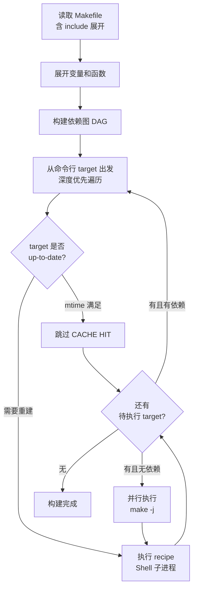

---
tags:
  - build-systems
  - tier3
  - make
  - makefile
---
# Make与Makefile深度解析

> [!abstract] TL;DR
> Make 是 1976 年诞生于贝尔实验室的构建工具，至今仍是 Unix 工具链的基础设施。其核心机制是基于 mtime 的依赖图增量构建，配合 Shell 执行模型。理解变量展开的递归/立即两种模式、模式规则的 stem 匹配算法、并行 job server 机制，以及递归 Make 的结构性缺陷（Peter Miller 1997 论文核心论点），是真正驾驭 Makefile 的关键。

## 概述与定位

### 历史

1976 年，Stuart Feldman 在贝尔实验室发明 Make，初衷是解决"修改了头文件后忘记重新编译哪些 .c 文件"的问题。Make 的设计哲学极简：**声明依赖关系，比较时间戳，执行 Shell 命令**。

Make 的几个里程碑：
- 1976：Stuart Feldman 在贝尔实验室创作原版 Make
- 1988：GNU Make 发布，成为 Linux 生态的标准
- 1997：Peter Miller 发表《Recursive Make Considered Harmful》，指出大型项目中递归 Make 的结构性缺陷
- 至今：GNU Make 4.x 仍是 Linux 内核、GCC、Binutils 等顶级项目的构建系统

Make 之所以历经近五十年仍被广泛使用，在于它解决了一个普遍存在的问题：零依赖、随处可用，语法足够简单，可以表达绝大多数构建场景。理解 Make 不只是为了维护历史项目，它也是理解所有现代构建系统的起点——现代系统的很多设计决策，都是对 Make 局限性的直接回应。

### 适用场景

Make 最适合：
- **C/C++ 小中型项目**，尤其是 Unix/Linux 原生工具链
- **命令行工具和系统软件**，无需跨平台复杂性
- **已有 Makefile 的历史项目维护**
- **作为上层系统（CMake/Meson）的执行后端**（已被 Ninja 大幅替代）

## 原理与机制

### 依赖图构建

Make 读取 Makefile 后，以目标（target）为节点、依赖（prerequisite）为有向边，构建 DAG。执行时从命令行指定的 target 出发，递归检查依赖。

这个 DAG 构建过程发生在 Make 执行的**两阶段**模型中。第一阶段是读取阶段（read-in phase）：Make 解析所有 Makefile，展开变量（遵循变量展开规则），构建完整的依赖图，注册所有规则和目标。第二阶段是执行阶段：Make 从指定的目标出发，通过深度优先遍历确定构建顺序，然后执行各条规则的 recipe。

这两个阶段的存在，是理解 Make 变量展开行为最重要的基础。

### 变量展开机制：递归展开 vs 立即展开

Make 有两种变量赋值语法，行为截然不同，混淆这两种行为是 Makefile 中最常见的陷阱之一：

**递归展开（Recursive Expansion，`=`）**：变量的值在**每次被引用时**才展开。这意味着：
- 可以引用尚未定义的变量（只要在实际引用时该变量已经被定义）
- 但若存在自引用，会导致无限递归展开，Make 会报错

```makefile
# 递归展开：CC 在定义时不展开，只在被引用时才展开
CFLAGS = -I$(INCDIR) -Wall   # INCDIR 此时可以未定义
INCDIR = /usr/local/include

# 使用 CFLAGS 时，$(INCDIR) 才被替换，此时 INCDIR 已定义
# 结果正确：-I/usr/local/include -Wall

# 递归展开的陷阱：自引用
CFLAGS = $(CFLAGS) -O2   # 错误！展开 CFLAGS 时会再次展开 CFLAGS，无限循环
```

**立即展开（Simply Expanded，`:=`）**：变量的值在**定义时立即展开**，结果固化为字符串。这意味着：
- 被引用的变量必须在此之前已经定义，否则展开为空字符串
- 允许自引用（展开时引用的是旧值）
- 性能更好（不会重复展开）

```makefile
# 立即展开：定义时 INCDIR 必须已知
INCDIR := /usr/local/include
CFLAGS := -I$(INCDIR) -Wall   # 立即展开为 "-I/usr/local/include -Wall"

# 允许的自引用：展开 CFLAGS 时取旧值
CFLAGS := $(CFLAGS) -O2    # 正确！先展开旧 CFLAGS，再追加 -O2

# 陷阱：定义顺序颠倒
CFLAGS := -I$(INCDIR) -Wall   # INCDIR 此时未定义，$(INCDIR) 展开为空
INCDIR := /usr/local/include  # 太迟了
# CFLAGS 的值变成 " -Wall"，缺少 include 路径
```

**实用建议**：在几乎所有情况下，应优先使用 `:=`（立即展开）。它行为可预测、性能更好。只有在需要"前向引用"（引用后定义的变量）时才考虑 `=`，且要确保没有循环引用。在大型 Makefile 中混用两种展开方式，是排查构建问题的噩梦。

**第三种：条件赋值（`?=`）**：仅当变量未定义时才赋值，常用于允许外部覆盖的变量：

```makefile
CC ?= gcc          # 若 CC 未在环境或命令行中定义，默认为 gcc
PREFIX ?= /usr/local
```

### mtime 比较增量构建

Make 的增量判断算法：

```
is_stale(target):
    if target 不存在:
        return True  # 必须构建
    for each prereq in target.prerequisites:
        if mtime(prereq) > mtime(target):
            return True  # 依赖比目标新
    return False
```

**mtime 的局限性**：
- 文件内容未变但 touch 过 → 触发不必要重建
- NFS 时钟漂移 → 错误判断
- 跨机器无法共享缓存

### 模式规则匹配算法：stem 提取与隐式规则链

Make 的模式规则（Pattern Rules）允许用 `%` 通配符表达通用的构建规则，是 Make 能够"知道"如何从 `.c` 编译 `.o` 的机制。

`%` 在规则中扮演的角色叫做**词干（stem）**：当 Make 需要构建 `obj/main.o` 时，它搜索所有以 `.o` 结尾的模式规则。若找到规则 `$(OBJDIR)/%.o: $(SRCDIR)/%.c`，则 stem 被提取为 `main`，然后把规则中所有的 `%` 替换为 `main`，得到具体规则 `obj/main.o: src/main.c`。

自动变量 `$*` 就是当前 stem 的值，在需要"提取文件名主干"时非常有用：

```makefile
$(OBJDIR)/%.o: $(SRCDIR)/%.c
    @echo "Compiling $* ..."
    $(CC) $(CFLAGS) -c -o $@ $<
    # $* = "main"（对于 obj/main.o 规则）
```

**隐式规则链（Implicit Rule Chaining）**：Make 内置了大量隐式规则，并且支持多步链推导。例如，Make 内置了：
- `%.o: %.c`（C 编译）
- `%: %.o`（链接）

这意味着 `make myapp` 可以自动推导出需要先编译 `myapp.c` 得到 `myapp.o`，再链接 `myapp.o` 得到 `myapp`，即使 Makefile 中只声明了 `myapp:` 而没有给出 recipe。

隐式规则链是双刃剑：在简单场景下非常便利，但在复杂场景下可能触发意外的隐式规则，导致难以调试的行为。建议在正式 Makefile 中用 `.SUFFIXES:` 清空内置规则，然后显式声明所有需要的规则：

```makefile
# 清空所有内置后缀规则（防止意外匹配）
.SUFFIXES:
# 再显式定义自己需要的
.SUFFIXES: .c .o
```

### Shell 执行模型

Makefile 中每一行 recipe 都在独立的 **Shell 子进程**中执行。这意味着：

```makefile
# 错误：两行在不同 shell，cd 无效
build:
    cd src
    gcc main.c   # 仍在原目录执行！

# 正确：同一 shell 用 && 连接
build:
    cd src && gcc main.c
```

每行 recipe 前缀 `@` 可静默输出，`-` 可忽略错误：
```makefile
clean:
    @echo "Cleaning..."
    -rm -f *.o   # 即使 rm 失败也继续
```

**每行独立 Shell 的性能代价**：每次 fork + exec `/bin/sh` 大约需要几毫秒。对于有数万条编译命令的大型项目，这个开销累积可达数十秒。这正是 Ninja 通过直接 `execve` 绕过 Shell 能显著提速的根本原因。

### 并行构建与 job server 机制

`make -j N` 启动最多 N 个并行 job。但在有子 Make（`$(MAKE) -C subdir`）的场景下，如何控制总并行度？这就是 **job server** 机制的用武之地。

GNU Make 用一个管道（pipe）实现令牌桶：管道中有 N 个令牌（字符），每个 job 开始前读取一个令牌，完成后写回。子 Make 进程继承了父进程的文件描述符，因此可以访问同一个管道，与父进程竞争令牌——这样即使存在递归 Make，也能保证全局并行度不超过 N。

具体实现：父 Make 在启动时将管道的文件描述符号编码进环境变量 `MAKEFLAGS`（如 `MAKEFLAGS=--jobserver-auth=3,4`），子 Make 读取该变量后知道令牌桶的 fd，直接参与竞争，不需要额外的 `-j N` 参数。

这个机制的前提是子 Make 进程必须正确继承环境变量，且没有手动添加会影响 `MAKEFLAGS` 的操作。实践中一个常见错误是在脚本中调用 Make 但 `unset` 了 `MAKEFLAGS`，导致子 Make 不受并行度控制，出现过度并行。

## 结构/算法/伪代码详解

### Makefile 完整示例

```makefile
# 变量定义
CC      := gcc
CFLAGS  := -Wall -O2 -Iinclude
LDFLAGS := -lm
SRCDIR  := src
OBJDIR  := obj
BINDIR  := bin

# 源文件自动发现
SRCS    := $(wildcard $(SRCDIR)/*.c)
OBJS    := $(patsubst $(SRCDIR)/%.c,$(OBJDIR)/%.o,$(SRCS))
TARGET  := $(BINDIR)/myapp

# 默认目标（第一个 target）
.PHONY: all clean install

all: $(TARGET)

# 链接步骤：$@ = 目标, $^ = 所有依赖
$(TARGET): $(OBJS) | $(BINDIR)
    $(CC) $(LDFLAGS) -o $@ $^

# 隐式规则：%.o 依赖 %.c
# $< = 第一个依赖（对应 .c 文件）
$(OBJDIR)/%.o: $(SRCDIR)/%.c | $(OBJDIR)
    $(CC) $(CFLAGS) -MMD -MP -c -o $@ $<

# 包含自动生成的依赖文件（头文件跟踪）
-include $(OBJS:.o=.d)

# 目录创建（Order-only 依赖，| 后不参与 mtime 比较）
$(OBJDIR) $(BINDIR):
    mkdir -p $@

# install 目标
install: $(TARGET)
    install -m 755 $< /usr/local/bin/

clean:
    rm -rf $(OBJDIR) $(BINDIR)
```

### 自动变量速查

| 自动变量 | 含义 | 示例 |
|---------|------|------|
| `$@` | 当前规则的目标 | `obj/main.o` |
| `$<` | 第一个依赖 | `src/main.c` |
| `$^` | 所有依赖（去重）| `obj/a.o obj/b.o` |
| `$+` | 所有依赖（保留重复）| `obj/a.o obj/b.o obj/a.o` |
| `$*` | 模式规则的 stem | `main`（对应 `%.o: %.c` 中的 `main`）|
| `$?` | 比目标更新的依赖 | 增量场景 |
| `$(@D)` | `$@` 的目录部分 | `obj` |
| `$(@F)` | `$@` 的文件部分 | `main.o` |

### .PHONY、.SECONDARY、.PRECIOUS 特殊目标

```makefile
# .PHONY：声明这些 target 不代表实际文件
# 即使存在同名文件也强制执行
.PHONY: all clean test

# 内置隐式规则（Make 内置，可被覆盖）
# %.o: %.c  →  $(CC) $(CFLAGS) -c -o $@ $<

# 删除所有隐式规则（提升速度，避免误匹配）
.SUFFIXES:

# .SECONDARY：防止 Make 删除中间文件
# Make 默认会删除推导链中的中间产物
# 声明 .SECONDARY 后，这些文件被保留
.SECONDARY: $(OBJS)

# .PRECIOUS：类似 .SECONDARY，但在 Make 被中断时也不删除
# 适合生成耗时的中间文件，防止 Ctrl+C 后下次需要重新生成
.PRECIOUS: %.o
```

`.SECONDARY` 和 `.PRECIOUS` 解决的是一个微妙问题：Make 在执行隐式规则链时，会将中间产物标记为"临时文件"，在构建完成或失败后自动删除。这在大多数情况下无关紧要，但在调试或有耗时中间产物时，意外删除会造成困扰。用 `.SECONDARY` 显式声明中间产物，告诉 Make "请保留它们"。

### 递归 Make 问题（Peter Miller 1997）

递归 Make 是在子目录中调用 `$(MAKE)`：

```makefile
# 典型递归 Make（反模式）
all:
    $(MAKE) -C src
    $(MAKE) -C lib
    $(MAKE) -C tests
```

**问题根源**：每次递归调用是独立的 Make 进程，彼此不知道对方的依赖图。若 `lib/` 中的头文件被 `src/` 使用，Make 无法在顶层感知此依赖，导致：
- 正确性问题：更新 `lib/foo.h` 后，`src/bar.o` 可能不重建
- 效率问题：无法跨目录并行
- 难以调试：错误发生在子 Make 中，顶层无法感知

Peter Miller 的 1997 年论文《Recursive Make Considered Harmful》系统地分析了递归 Make 的根本缺陷。论文的核心论点是：**构建系统的正确性依赖于完整的 DAG**。当你把 DAG 割裂成多个独立的子图（每个子目录一个），跨子图的依赖边就消失了，系统从根本上无法保证正确性。

论文中的一个典型案例：项目有 `lib/` 和 `app/` 两个目录。`app/main.c` 包含了 `lib/api.h`。递归 Make 中，顶层首先进入 `lib/` 目录编译，然后进入 `app/` 目录编译。这次没问题。但下次只修改了 `lib/api.h`，直接从顶层运行 `make`：Make 判断 `lib/` 目录的目标是否需要重建，发现需要，进入重建 `lib/`。然后进入 `app/`，此时 `app/main.o` 的 mtime 比 `app/main.c` 新，但 Make **不知道** `app/main.o` 还依赖 `lib/api.h`（因为这个依赖信息在另一个 Make 进程中）。结果：`app/main.o` 不重建，产物是错误的。

**解决方案**：Non-recursive Make（单一顶层 Makefile 包含所有 `include sub/module.mk`），或迁移到 CMake/Meson/Bazel。

### Make 执行流程



### $(eval) 与 $(call) 元编程

Make 的函数与 `$(eval)` 机制使 Makefile 具备了一定的元编程能力——在读取阶段动态生成规则和变量，减少重复代码。

#### $(call)：用户自定义函数

`$(call fn,arg1,arg2,...)` 调用一个在变量中定义的"函数"。在函数体内，`$(1)` 代表第一个参数，`$(2)` 代表第二个，`$(0)` 是函数名本身：

```makefile
# 定义函数：生成编译对象的命令片段
# $(1) = 目标 .o，$(2) = 来源 .c，$(3) = 额外 CFLAGS
define compile_obj
$(1): $(2)
	$$(CC) $$(CFLAGS) $(3) -c -o $$@ $$<
endef

# 调用函数（但只展开为文本，不自动注入规则）
$(info $(call compile_obj,obj/foo.o,src/foo.c,-DFOO_EXTRA))
```

`$(call)` 本质是"带参文本替换"——它把 `$(1)/$(2)` 替换为实参后返回字符串，并不执行任何副作用。要让返回的文本成为 Makefile 的一部分，必须配合 `$(eval)`。

#### $(eval)：把文本当 Makefile 片段解析

`$(eval text)` 将 `text` 作为 Makefile 源代码重新解析，可动态生成规则、变量赋值等任何 Makefile 语句：

```makefile
# 单独使用 eval 动态定义变量
$(eval MY_VAR := hello)
$(info $(MY_VAR))   # 输出: hello

# eval + call 组合：动态生成目标规则
define make_target
$(1): $(2)
	@echo "Building $$@ from $$<"
	$$(CC) $$(CFLAGS) -c -o $$@ $$<
endef

$(eval $(call make_target,obj/bar.o,src/bar.c))
# 等价于在 Makefile 中手写：
# obj/bar.o: src/bar.c
#     @echo "Building $@ from $<"
#     $(CC) $(CFLAGS) -c -o $@ $<
```

#### $(foreach) + $(eval)：批量生成目标模板

这是元编程最常见的应用场景——对一批模块批量生成结构相同的规则，避免重复：

```makefile
MODULES := core network ui storage

# 为每个模块定义构建规则模板
define module_rules
# 每个模块有独立的 obj 目录和测试目标
$(1)_SRCS   := $(wildcard $(1)/src/*.c)
$(1)_OBJS   := $$(patsubst $(1)/src/%.c,$(1)/obj/%.o,$$($(1)_SRCS))

$(1)/obj/%.o: $(1)/src/%.c | $(1)/obj
	$$(CC) $$(CFLAGS) -I$(1)/include -c -o $$@ $$<

$(1)/obj:
	mkdir -p $$@

.PHONY: test-$(1)
test-$(1): $$($(1)_OBJS)
	@echo "Testing module: $(1)"
endef

# 批量展开：为 core network ui storage 各生成一套规则
$(foreach mod,$(MODULES),$(eval $(call module_rules,$(mod))))

# 聚合目标：所有模块
.PHONY: all-modules
all-modules: $(foreach mod,$(MODULES),$($(mod)_OBJS))
```

运行 `make test-core` 或 `make test-network` 即可单独测试某个模块。这种模式在大型 Non-recursive Makefile 中极为常见，用来替代递归 Make 的子目录结构。

#### GNU Make 函数库：$(if)/$(or)/$(and)/$(strip)

GNU Make 内置了一批字符串/逻辑函数，可在元编程中用来做条件判断：

```makefile
# $(strip text)：去除首尾空白（以及压缩内部多余空格）
SRCS_RAW  :=   src/a.c   src/b.c
SRCS      := $(strip $(SRCS_RAW))   # "src/a.c src/b.c"

# $(if condition,then[,else])：condition 非空为真
USE_LTO ?=
LDFLAGS += $(if $(USE_LTO),-flto,)

# $(or val1,val2,...)：返回第一个非空值
CC := $(or $(shell which clang 2>/dev/null),gcc)

# $(and val1,val2,...)：所有非空才返回最后一个；任一为空返回空
CAN_BUILD := $(and $(CC),$(AR),$(RANLIB))

# 综合示例：条件生成规则
$(foreach mod,$(MODULES),\
  $(if $(wildcard $(mod)/test/*.c),\
    $(eval $(call module_rules,$(mod))),\
    $(info Skipping $(mod): no tests found)\
  )\
)
```

#### 元编程陷阱：展开时机与 `$$` 转义

元编程最难的部分是**双重展开**（double expansion）问题。`$(eval ...)` 内的文本会被展开**两次**：第一次在 `$(eval)` 计算参数时，第二次在 Makefile 解析展开后的文本时。因此，凡是希望"留给第二次展开"的 `$` 引用，必须写成 `$$`：

```makefile
define bad_rule
# 错误：$@ 在第一次展开时就被替换（此时上下文中 $@ 为空）
$(1): $(2)
	echo $@   # $@ 在 eval 参数展开时丢失，变成空字符串
endef

define good_rule
# 正确：$$@ 第一次展开变为 $@，第二次展开（在 recipe 执行时）才替换为目标名
$(1): $(2)
	echo $$@
endef

$(eval $(call good_rule,out/foo,src/foo.c))
```

**关键原则**：

| 场景 | 写法 | 原因 |
|------|------|------|
| `define` 模板中引用参数 | `$(1)`, `$(2)` | 第一次展开时替换，期望在 `$(call)` 时求值 |
| `define` 模板中的自动变量 | `$$@`, `$$<`, `$$^` | 要保留到规则执行阶段，需转义 |
| `define` 模板中调用 Make 函数 | `$$(patsubst ...)` | 要保留到第二次展开（rule 定义阶段），需转义 |
| 普通变量引用（非模板内） | `$(VAR)` | 正常单次展开 |

另一个常见陷阱是 `$(eval)` 中的换行：Make 函数调用会把结果中的换行去掉，`define...endef` 块配合 `$(eval)` 才能正确保留多行结构。在 `$(foreach)` 的循环体里直接写多行规则而不用 `define` 是不可行的。

## 工具视角与实战

### 调试命令

```bash
# 干运行：打印将执行的命令但不执行（-n = --dry-run）
make -n all

# 打印所有已知规则（含内置隐式规则），输出量大
make -p 2>/dev/null | less

# 详细调试输出
make --debug=all all

# 并行构建（$(nproc) 返回 CPU 核心数）
make -j$(nproc)

# 查看 target 的依赖树（需 make 4.3+）
make --print-data-base | grep -A5 "^main.o"

# 保持 .d 文件不触发重建（-include 的由来）
# -include 在文件不存在时静默忽略
-include $(DEPS)
```

### 头文件依赖自动跟踪

使用 GCC 的 `-MMD -MP` 选项自动生成 `.d` 依赖文件：

```bash
gcc -MMD -MP -c src/main.c -o obj/main.o
# 生成 obj/main.d：
# obj/main.o: src/main.c include/foo.h include/bar.h
# include/foo.h:    # 空规则，防止 foo.h 被删后报错
# include/bar.h:
```

在 Makefile 顶部 `-include $(OBJS:.o=.d)` 即可实现头文件变化自动重建。

`-MP` 选项的作用是为每个头文件生成一条空规则（没有 recipe），这解决了一个边界情况：若某个头文件被删除，下次构建时 Make 会因为找不到该头文件（现在是一个依赖项）而报错，而非正确地重新编译。有了 `-MP` 生成的空规则，Make 会把删除的头文件视为一个"已满足的目标"，继续推进构建。

### VPATH 与 vpath：源文件搜索路径

Make 的 VPATH 机制允许在当前目录找不到 prerequisite 时，在额外的目录中搜索：

```makefile
# VPATH：所有类型文件的搜索路径（冒号分隔）
VPATH = src:include:generated

# vpath（小写）：为特定模式指定搜索路径，更精确
vpath %.c src        # .c 文件在 src/ 目录搜索
vpath %.h include    # .h 文件在 include/ 目录搜索

# 使用 VPATH 后，规则可以简化：
%.o: %.c              # Make 会在 VPATH 中找 .c 文件
    $(CC) -c -o $@ $<
```

VPATH 适合"源码和构建目录分离"的场景，但要小心 out-of-tree build 中路径自动变量（`$<`、`$@`）的行为：`$<` 会展开为搜索到的完整路径（如 `src/main.c`），而 `$@` 是目标的完整路径。

### 常用模式

```makefile
# 跨目录 include（Non-recursive Make 风格）
include src/module.mk
include lib/module.mk

# 条件构建
ifeq ($(OS),Windows_NT)
    EXT := .exe
else
    EXT :=
endif
TARGET := myapp$(EXT)

# 递归展开（=）vs 简单展开（:=）
LAZY   = $(CC) $(CFLAGS)   # 每次引用时展开，可引用后定义的变量
EAGER := $(CC) $(CFLAGS)   # 定义时立即展开，性能更好
```

## 安全性与正确使用

### Shell 注入风险

Makefile 中的变量会直接展开到 Shell 命令中，若变量来自外部输入（如 `make TARGET_USER=...`），存在注入风险：

```makefile
# 危险：用户可传入 TARGET_USER="foo; rm -rf /"
deploy:
    scp build/app $(TARGET_USER)@$(HOST):/app/
```

**缓解措施**：
- 对外部变量使用 `$(strip ...)` 清理空格
- 在脚本中引用变量时加引号：`"$(TARGET_USER)"`
- 不要在 Makefile 中直接使用未验证的外部变量构造命令

### 敏感变量保护

```makefile
# 不要将密码/Token 硬编码在 Makefile
# 使用环境变量或 .env 文件（加入 .gitignore）
DEPLOY_TOKEN ?= $(shell cat .secret/token 2>/dev/null)

# 静默敏感命令输出（@ 前缀）
deploy:
    @echo "Deploying to $(HOST)..."
    @curl -H "Authorization: $(DEPLOY_TOKEN)" ...

# 防止 make -p 暴露变量
# 在 Makefile 顶部
$(warning Building with user: $(USER))  # 可见信息
# 不要 $(warning Token: $(DEPLOY_TOKEN))
```

### Tab vs 空格

**最常见的 Makefile 错误**：recipe 必须以 **Tab** 字符（`\t`）开头，不是空格。现代编辑器（VSCode/Vim）通常会将 Makefile 中的缩进自动识别为 Tab，但要显式配置：

```
# .editorconfig
[Makefile]
indent_style = tab
indent_size = 4
```

这个设计来自 Make 的历史：原始实现用 Tab 区分规则头（target: prerequisites）和命令（recipe），当时是合理的视觉区分。然而 Stuart Feldman 后来坦承，如果重新设计，他不会用 Tab——但数百万已有 Makefile 使得修改语法成本太高，Tab 缩进就这样保留至今，成为 Make 最著名的历史包袱。

### 增量正确性的边界与陷阱

即使正确使用了 `-MMD -MP`，Make 的增量正确性仍有几个盲区：

**编译选项变更不感知**：修改了 `CFLAGS`（如从 `-O2` 到 `-O3`），源文件的 mtime 不变，Make 不会重新编译。解决方案是将 CFLAGS 记录到一个文件，并将该文件加入依赖：

```makefile
# 将编译选项写入文件，作为依赖
FLAGS_FILE = .make_flags
$(shell echo "$(CFLAGS)" | diff -q $(FLAGS_FILE) - > /dev/null 2>&1 || echo "$(CFLAGS)" > $(FLAGS_FILE))

$(OBJDIR)/%.o: $(SRCDIR)/%.c $(FLAGS_FILE) | $(OBJDIR)
    $(CC) $(CFLAGS) -MMD -MP -c -o $@ $<
```

**生成代码的陈旧性**：若构建流程中有代码生成步骤（如 protobuf 生成、Qt moc、flex/bison），必须确保生成代码的规则依赖源 schema 文件，且下游编译规则依赖生成的代码。这个依赖链稍有断裂，就会出现"改了 proto 文件，但生成的 C++ 代码没更新"的问题。

## 小结

Make 以极简的设计解决了构建自动化的核心问题，历经近五十年仍在大量项目中使用。掌握要点包括：`target: prerequisites + Tab recipe` 三段式结构、变量展开的 `=`（递归）与 `:=`（立即）两种模式及其陷阱、`$@/$</$^/$*` 自动变量、`.PHONY`/`.SECONDARY`/`.PRECIOUS` 特殊目标、`-MMD -MP` 头文件跟踪，以及避免递归 Make 带来的正确性陷阱（Peter Miller 1997 论文的核心教训：被割裂的 DAG 无法保证跨目录依赖的正确性）。

对于新项目，建议将 Make 作为执行后端，由 CMake 或 Meson 生成 Makefile（或更优的 Ninja 文件）。对于必须维护的历史 Makefile，优先修复递归 Make 问题，确保 `-MMD -MP` 头文件跟踪正确启用，并在 CI 中加入全量构建验证步骤防止增量判断漏编。

## 相关阅读

- Stuart Feldman, *Make — A Program for Maintaining Computer Programs* (1978)
- Peter Miller, *Recursive Make Considered Harmful* (1997)
- GNU Make 手册：[https://www.gnu.org/software/make/manual/](https://www.gnu.org/software/make/manual/)
- Chase Lambert, *A Tutorial on Portable Makefiles*

---
[[00.构建系统横向对比总览|⬆ 系列总览]] | [[01.构建系统概论与横向对比框架|← 上一章]] | [[03.CMake跨平台构建系统|→ 下一章]]
