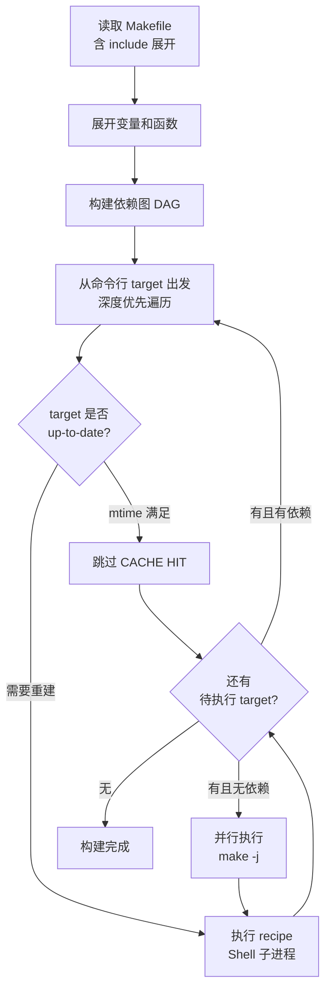

---
tags:
  - build-systems
  - tier3
  - make
  - makefile
---
# Make与Makefile深度解析

> [!abstract] TL;DR
> Make 是 1976 年诞生于贝尔实验室的构建工具，至今仍是 Unix 工具链的基础设施。其核心机制是基于 mtime 的依赖图增量构建，配合 Shell 执行模型。理解 Tab 缩进规则、自动变量、隐式规则和递归 Make 问题，是驾驭 Makefile 的关键。

## 概述与定位

### 历史

1976 年，Stuart Feldman 在贝尔实验室发明 Make，初衷是解决"修改了头文件后忘记重新编译哪些 .c 文件"的问题。Make 的设计哲学极简：**声明依赖关系，比较时间戳，执行 Shell 命令**。

Make 的几个里程碑：
- 1976：Stuart Feldman 在贝尔实验室创作原版 Make
- 1988：GNU Make 发布，成为 Linux 生态的标准
- 1997：Peter Miller 发表《Recursive Make Considered Harmful》，指出大型项目中递归 Make 的结构性缺陷
- 至今：GNU Make 4.x 仍是 Linux 内核、GCC、Binutils 等顶级项目的构建系统

### 适用场景

Make 最适合：
- **C/C++ 小中型项目**，尤其是 Unix/Linux 原生工具链
- **命令行工具和系统软件**，无需跨平台复杂性
- **已有 Makefile 的历史项目维护**
- **作为上层系统（CMake/Meson）的执行后端**（已被 Ninja 大幅替代）

## 原理与机制

### 依赖图构建

Make 读取 Makefile 后，以目标（target）为节点、依赖（prerequisite）为有向边，构建 DAG。执行时从命令行指定的 target 出发，递归检查依赖。

### mtime 比较增量构建

Make 的增量判断算法：

```
is_stale(target):
    if target 不存在:
        return True  # 必须构建
    for each prereq in target.prerequisites:
        if mtime(prereq) > mtime(target):
            return True  # 依赖比目标新
    return False
```

**mtime 的局限性**：
- 文件内容未变但 touch 过 → 触发不必要重建
- NFS 时钟漂移 → 错误判断
- 跨机器无法共享缓存

### Shell 执行模型

Makefile 中每一行 recipe 都在独立的 **Shell 子进程**中执行。这意味着：

```makefile
# 错误：两行在不同 shell，cd 无效
build:
    cd src
    gcc main.c   # 仍在原目录执行！

# 正确：同一 shell 用 && 连接
build:
    cd src && gcc main.c
```

每行 recipe 前缀 `@` 可静默输出，`-` 可忽略错误：
```makefile
clean:
    @echo "Cleaning..."
    -rm -f *.o   # 即使 rm 失败也继续
```

## 结构/算法/伪代码详解

### Makefile 完整示例

```makefile
# 变量定义
CC      := gcc
CFLAGS  := -Wall -O2 -Iinclude
LDFLAGS := -lm
SRCDIR  := src
OBJDIR  := obj
BINDIR  := bin

# 源文件自动发现
SRCS    := $(wildcard $(SRCDIR)/*.c)
OBJS    := $(patsubst $(SRCDIR)/%.c,$(OBJDIR)/%.o,$(SRCS))
TARGET  := $(BINDIR)/myapp

# 默认目标（第一个 target）
.PHONY: all clean install

all: $(TARGET)

# 链接步骤：$@ = 目标, $^ = 所有依赖
$(TARGET): $(OBJS) | $(BINDIR)
    $(CC) $(LDFLAGS) -o $@ $^

# 隐式规则：%.o 依赖 %.c
# $< = 第一个依赖（对应 .c 文件）
$(OBJDIR)/%.o: $(SRCDIR)/%.c | $(OBJDIR)
    $(CC) $(CFLAGS) -MMD -MP -c -o $@ $<

# 包含自动生成的依赖文件（头文件跟踪）
-include $(OBJS:.o=.d)

# 目录创建（Order-only 依赖，| 后不参与 mtime 比较）
$(OBJDIR) $(BINDIR):
    mkdir -p $@

# install 目标
install: $(TARGET)
    install -m 755 $< /usr/local/bin/

clean:
    rm -rf $(OBJDIR) $(BINDIR)
```

### 自动变量速查

| 自动变量 | 含义 | 示例 |
|---------|------|------|
| `$@` | 当前规则的目标 | `obj/main.o` |
| `$<` | 第一个依赖 | `src/main.c` |
| `$^` | 所有依赖（去重）| `obj/a.o obj/b.o` |
| `$+` | 所有依赖（保留重复）| `obj/a.o obj/b.o obj/a.o` |
| `$*` | 模式规则的 stem | `main`（对应 `%.o: %.c` 中的 `main`）|
| `$?` | 比目标更新的依赖 | 增量场景 |
| `$(@D)` | `$@` 的目录部分 | `obj` |
| `$(@F)` | `$@` 的文件部分 | `main.o` |

### .PHONY 与隐式规则

```makefile
# .PHONY：声明这些 target 不代表实际文件
# 即使存在同名文件也强制执行
.PHONY: all clean test

# 内置隐式规则（Make 内置，可被覆盖）
# %.o: %.c  →  $(CC) $(CFLAGS) -c -o $@ $<

# 删除所有隐式规则（提升速度，避免误匹配）
.SUFFIXES:
```

### 递归 Make 问题（Peter Miller 1997）

递归 Make 是在子目录中调用 `$(MAKE)`：

```makefile
# 典型递归 Make（反模式）
all:
    $(MAKE) -C src
    $(MAKE) -C lib
    $(MAKE) -C tests
```

**问题根源**：每次递归调用是独立的 Make 进程，彼此不知道对方的依赖图。若 `lib/` 中的头文件被 `src/` 使用，Make 无法在顶层感知此依赖，导致：
- 正确性问题：更新 `lib/foo.h` 后，`src/bar.o` 可能不重建
- 效率问题：无法跨目录并行
- 难以调试：错误发生在子 Make 中，顶层无法感知

**解决方案**：Non-recursive Make（单一顶层 Makefile 包含所有 `include sub/module.mk`），或迁移到 CMake/Meson/Bazel。

### Make 执行流程



## 工具视角与实战

### 调试命令

```bash
# 干运行：打印将执行的命令但不执行（-n = --dry-run）
make -n all

# 打印所有已知规则（含内置隐式规则），输出量大
make -p 2>/dev/null | less

# 详细调试输出
make --debug=all all

# 并行构建（$(nproc) 返回 CPU 核心数）
make -j$(nproc)

# 查看 target 的依赖树（需 make 4.3+）
make --print-data-base | grep -A5 "^main.o"

# 保持 .d 文件不触发重建（-include 的由来）
# -include 在文件不存在时静默忽略
-include $(DEPS)
```

### 头文件依赖自动跟踪

使用 GCC 的 `-MMD -MP` 选项自动生成 `.d` 依赖文件：

```bash
gcc -MMD -MP -c src/main.c -o obj/main.o
# 生成 obj/main.d：
# obj/main.o: src/main.c include/foo.h include/bar.h
# include/foo.h:    # 空规则，防止 foo.h 被删后报错
# include/bar.h:
```

在 Makefile 顶部 `-include $(OBJS:.o=.d)` 即可实现头文件变化自动重建。

### 常用模式

```makefile
# 跨目录 include（Non-recursive Make 风格）
include src/module.mk
include lib/module.mk

# 条件构建
ifeq ($(OS),Windows_NT)
    EXT := .exe
else
    EXT :=
endif
TARGET := myapp$(EXT)

# 递归展开（=）vs 简单展开（:=）
LAZY   = $(CC) $(CFLAGS)   # 每次引用时展开，可引用后定义的变量
EAGER := $(CC) $(CFLAGS)   # 定义时立即展开，性能更好
```

## 安全性与正确使用

### Shell 注入风险

Makefile 中的变量会直接展开到 Shell 命令中，若变量来自外部输入（如 `make TARGET_USER=...`），存在注入风险：

```makefile
# 危险：用户可传入 TARGET_USER="foo; rm -rf /"
deploy:
    scp build/app $(TARGET_USER)@$(HOST):/app/
```

**缓解措施**：
- 对外部变量使用 `$(strip ...)` 清理空格
- 在脚本中引用变量时加引号：`"$(TARGET_USER)"`
- 不要在 Makefile 中直接使用未验证的外部变量构造命令

### 敏感变量保护

```makefile
# 不要将密码/Token 硬编码在 Makefile
# 使用环境变量或 .env 文件（加入 .gitignore）
DEPLOY_TOKEN ?= $(shell cat .secret/token 2>/dev/null)

# 静默敏感命令输出（@ 前缀）
deploy:
    @echo "Deploying to $(HOST)..."
    @curl -H "Authorization: $(DEPLOY_TOKEN)" ...

# 防止 make -p 暴露变量
# 在 Makefile 顶部
$(warning Building with user: $(USER))  # 可见信息
# 不要 $(warning Token: $(DEPLOY_TOKEN))
```

### Tab vs 空格

**最常见的 Makefile 错误**：recipe 必须以 **Tab** 字符（`\t`）开头，不是空格。现代编辑器（VSCode/Vim）通常会将 Makefile 中的缩进自动识别为 Tab，但要显式配置：

```
# .editorconfig
[Makefile]
indent_style = tab
indent_size = 4
```

## 小结

Make 以极简的设计解决了构建自动化的核心问题，历经近五十年仍在大量项目中使用。掌握要点包括：`target: prerequisites + Tab recipe` 三段式结构、`$@/$</$^/$*` 自动变量、`.PHONY` 声明、`-MMD -MP` 头文件跟踪，以及避免递归 Make 带来的正确性陷阱。对于新项目，建议将 Make 作为执行后端，由 CMake 或 Meson 生成 Makefile（或更优的 Ninja 文件）。

## 相关阅读

- Stuart Feldman, *Make — A Program for Maintaining Computer Programs* (1978)
- Peter Miller, *Recursive Make Considered Harmful* (1997)
- GNU Make 手册：[https://www.gnu.org/software/make/manual/](https://www.gnu.org/software/make/manual/)
- Chase Lambert, *A Tutorial on Portable Makefiles*

---
[[00.构建系统横向对比总览|⬆ 系列总览]] | [[01.构建系统概论与横向对比框架|← 上一章]] | [[03.CMake跨平台构建系统|→ 下一章]]
