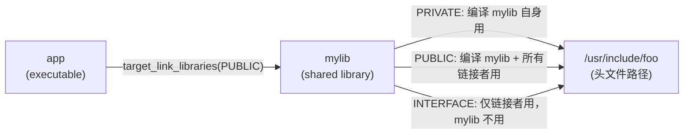
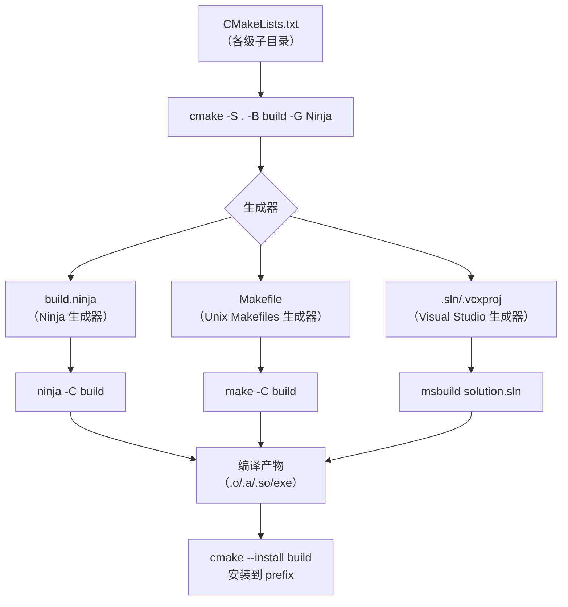

---
tags:
  - build-systems
  - tier3
  - cmake
  - cross-platform
---
# CMake跨平台构建系统

> [!abstract] TL;DR
> CMake 是跨平台**元构建系统**：它不直接编译代码，而是将 CMakeLists.txt 转换为 Ninja/Make/VS 等后端的构建文件。Modern CMake（3.x）以 target 为中心，用 `INTERFACE/PUBLIC/PRIVATE` 传播依赖属性，彻底替代了 2.x 时代的全局变量风格。理解生成器模型、target 属性传播的合并规则、generator expression 的求值时机，以及 find_package 的 Module/Config 两种模式，是真正驾驭 CMake 的核心。

## 概述与定位

### CMake 的定位

CMake 是**元构建系统（Meta Build System）**：

```
CMakeLists.txt  →  cmake -G "Ninja"  →  build.ninja  →  ninja  →  可执行文件
                                    ↳  Makefile      →  make
                                    ↳  .sln/.vcxproj →  msbuild
```

CMake 本身不执行编译，它生成适合目标平台的原生构建文件，再由原生工具执行。这是它实现跨平台的核心机制。

为什么要有元构建系统，而不是直接写平台原生格式？原因在于：Makefile 语法不能生成 Visual Studio 项目，`.vcxproj` 格式在 Linux 上无人维护。不同平台的工具链有各自的项目格式，而项目的构建意图（我有哪些源文件、它们之间的依赖关系是什么、需要哪些编译选项）是通用的。CMake 的价值在于用统一的语言描述这个"意图"，然后自动翻译成各平台的原生格式。

### 2.x vs 3.x（Modern CMake）演进

| 特性 | CMake 2.x（旧风格）| CMake 3.x Modern CMake |
|------|-------------------|----------------------|
| 依赖传播 | `include_directories()`/`link_libraries()` 全局污染 | `target_include_directories(PRIVATE/PUBLIC/INTERFACE)` |
| 编译选项 | `add_definitions()` 全局 | `target_compile_options()`/`target_compile_definitions()` |
| 包管理 | `find_package()` + 手动 | `find_package()` + `FetchContent` (3.11+) |
| 最低版本 | 无强制 | `cmake_minimum_required(VERSION 3.x)` 是必须的第一行 |
| 哲学 | "告诉 CMake 如何编译" | "描述 target 的属性，让 CMake 推导如何编译" |

这个演进背后的核心洞察是：全局变量风格在单目录项目中没问题，但在多目录、多库项目中会出现严重问题。一个库调用了 `include_directories("/path/to/private/impl")`，这个路径就被污染到了整个构建系统——所有 target 都能看到这个本应私有的路径，使得本应内聚的抽象边界被隐式打破。Modern CMake 的 target 属性传播机制从根本上解决了这个问题。

## 原理与机制

### 生成器模型

CMake 的生成器（Generator）决定输出什么类型的构建文件：

```bash
cmake -G "Ninja"                    # 生成 build.ninja
cmake -G "Unix Makefiles"           # 生成 Makefile
cmake -G "Visual Studio 17 2022"    # 生成 .sln + .vcxproj
cmake -G "Xcode"                    # 生成 .xcodeproj
```

生成器分两类：
- **单配置生成器**（Ninja/Make）：每次 `cmake` 只生成一种 build type（Debug/Release）
- **多配置生成器**（VS/Xcode）：单次生成，构建时选择 `--config Debug/Release`

两类生成器的区别对代码有实际影响。使用单配置生成器时，`CMAKE_BUILD_TYPE` 变量在 configure 阶段已确定，条件编译逻辑（`if(CMAKE_BUILD_TYPE STREQUAL "Release")`）可以正常工作。但使用多配置生成器时，`CMAKE_BUILD_TYPE` 为空，这类判断逻辑会静默失效。正确做法是使用 generator expression（见后文）代替配置阶段的条件判断：`$<CONFIG:Release>`。

### CMakeCache 机制

CMake 使用 `CMakeCache.txt` 文件缓存 configure 阶段的决策（编译器路径、依赖库路径、用户设置等）：

```
# CMakeCache.txt（摘要示例）
CMAKE_C_COMPILER:FILEPATH=/usr/bin/gcc
CMAKE_CXX_COMPILER:FILEPATH=/usr/bin/g++
CMAKE_BUILD_TYPE:STRING=Release
ZLIB_INCLUDE_DIR:PATH=/usr/include
ZLIB_LIBRARY:FILEPATH=/usr/lib/x86_64-linux-gnu/libz.so
```

CMakeCache 的存在有深远的工程含义：

**好处**：避免每次构建重新探测（compiler detection、find_package 等），大幅加速 configure 速度。

**陷阱**：旧的 cache 条目会遮蔽新值。当你改变了一个影响 cache 条目的选项（如切换编译器、改变 prefix 路径），必须清理 cache 才能让新值生效。最常见的错误场景：在 Linux 上先 configure 了一次，然后换了一个不同版本的 GCC，重新运行 `cmake`，CMake 找到了 cache 中旧的编译器路径，继续使用旧编译器——用户误以为已经切换，实际没有。

**正确做法**：
```bash
# 方法 1：删除整个 build 目录重新 configure（最彻底）
rm -rf build && cmake -S . -B build ...

# 方法 2：只删除 cache 文件
rm build/CMakeCache.txt && cmake -S . -B build ...

# 方法 3：ccmake / cmake-gui 中手动编辑 cache 变量
ccmake build   # TUI 界面，可直接修改 cache 变量
```

### 三目录结构

```
项目根/
├── CMakeLists.txt          # 源码树（Source Tree）
├── src/
└── build/                  # 二进制树（Binary Tree，推荐 out-of-source）
    ├── CMakeCache.txt       # 缓存变量
    ├── CMakeFiles/
    ├── build.ninja          # 生成的构建文件
    └── install/             # 安装树（Install Tree，cmake --install）
```

**永远使用 out-of-source build**（build 目录在源码树外），避免污染源码。

### Target 传播机制：PUBLIC/PRIVATE/INTERFACE 的合并规则

Modern CMake 的核心是 target 的属性传播：

```
PRIVATE   →  仅当前 target 使用，不向依赖方传播
PUBLIC    →  当前 target 使用，且传播给所有链接它的 target
INTERFACE →  当前 target 不使用，仅传播给链接它的 target（头文件库专用）
```



**传递性合并规则**：当 target A 链接 B，B 链接 C 时，C 的哪些属性会传递给 A？规则如下：
- B 以 `PUBLIC` 或 `INTERFACE` 声明的 C 的属性 → 传递给 A
- B 以 `PRIVATE` 声明的 C 的属性 → 不传递给 A

这个规则的实际含义：`PUBLIC` 表示"我用这个属性，我的用户也需要它"；`PRIVATE` 表示"我实现时用了这个，但不暴露给用户"；`INTERFACE` 表示"我不直接用，只是为了让用户方便"（典型用于头文件库）。

正确选择传播方式，是 Modern CMake 设计健壮库接口的核心能力：

```cmake
add_library(mylib STATIC src/impl.cpp)

# include：PUBLIC 表示 API 头文件，用户 #include 时需要
# PRIVATE 表示实现细节头文件，用户不需要
target_include_directories(mylib
    PUBLIC  ${CMAKE_CURRENT_SOURCE_DIR}/include   # API 头文件
    PRIVATE ${CMAKE_CURRENT_SOURCE_DIR}/src        # 实现内部头文件
)

# ZLIB：PRIVATE 表示实现细节，mylib 链接了 zlib，但不要求用户也显式链接 zlib
# （若 API 头文件中暴露了 zlib 类型，则应改为 PUBLIC）
target_link_libraries(mylib PRIVATE ZLIB::ZLIB)
```

### Generator Expression：为什么需要、何时求值

Generator Expression（生成器表达式）是 CMake 中以 `$<...>` 语法表示的特殊表达式，在 generate 阶段（generate phase）求值，而非 configure 阶段。

**为什么需要 generator expression**：某些信息在 configure 阶段无法确定。最典型的例子是多配置生成器（如 VS）中的构建类型——在 configure 时，VS 生成器尚未确定是 Debug 还是 Release，这个决策延迟到实际构建时。因此，需要一种"延迟求值"的机制：

```cmake
# 错误：在配置阶段判断 CMAKE_BUILD_TYPE，对多配置生成器无效
if(CMAKE_BUILD_TYPE STREQUAL "Debug")
    target_compile_definitions(mylib PRIVATE DEBUG_MODE)
endif()

# 正确：使用 generator expression，在 generate 阶段求值
target_compile_definitions(mylib PRIVATE $<$<CONFIG:Debug>:DEBUG_MODE>)
```

**常用 generator expressions**：

```cmake
# 条件表达式：$<condition:value>
$<$<CONFIG:Release>:NDEBUG>      # Release 时添加 NDEBUG 宏
$<$<PLATFORM_ID:Windows>:WIN32>  # Windows 时添加 WIN32 宏

# 目标属性
$<TARGET_FILE:mylib>             # mylib 产物的完整路径（含扩展名）
$<TARGET_FILE_DIR:mylib>         # mylib 产物的目录

# 编译器信息
$<CXX_COMPILER_ID:GNU>           # 若编译器是 GCC，值为 1，否则为 0
$<COMPILE_LANGUAGE:CXX>          # 只对 C++ 源文件应用

# 安装路径（configure 时未知，generate 时确定）
$<INSTALL_PREFIX>                # 安装前缀（cmake --install 时的 --prefix）
```

### find_package：Module 模式 vs Config 模式

`find_package(SomePkg)` 有两种工作模式，理解区别对排查"找不到包"问题至关重要：

**Module 模式**（FindXxx.cmake）：CMake 查找 `CMAKE_MODULE_PATH` 目录中的 `Find<PackageName>.cmake` 文件，然后执行该文件中的查找逻辑。CMake 自带了 150+ 个 Find 模块（如 `FindZLIB.cmake`、`FindOpenSSL.cmake`）。模块通常通过 `find_library()`/`find_path()` 在系统标准路径搜索。

```cmake
# 触发 Module 模式（明确指定 MODULE）
find_package(ZLIB MODULE REQUIRED)
# 或直接写，CMake 先找 Module，找不到再找 Config
find_package(ZLIB REQUIRED)
```

**Config 模式**（XxxConfig.cmake 或 xxx-config.cmake）：由包自身提供 Config 文件，安装时放入系统路径或 `<prefix>/lib/cmake/<PackageName>/`。Config 文件通常由 CMake 的 `install(EXPORT ...)` 命令自动生成，包含完整的 IMPORTED target 定义，是更现代的方式：

```cmake
# Config 模式找到的包会导出 IMPORTED target
find_package(fmt REQUIRED)        # 找 fmt/fmt-config.cmake
target_link_libraries(myapp PRIVATE fmt::fmt)  # 直接用 IMPORTED target
```

**搜索顺序**：CMake 默认先尝试 Config 模式，找不到 `<Name>Config.cmake` 或 `<name>-config.cmake` 时，再尝试 Module 模式找 `Find<Name>.cmake`。显式指定 `CONFIG` 或 `MODULE` 可以跳过另一种模式。

**排查找不到包的思路**：
```bash
# 开启详细输出，查看搜索路径
cmake -S . -B build --find-package-debug 2>&1 | grep -A5 "ZLIB"

# 临时指定搜索路径（覆盖 CMake 默认路径）
cmake -S . -B build -DZLIB_ROOT=/opt/local
```

### toolchain file 交叉编译

交叉编译指在 A 架构的机器上编译出 B 架构的产物（如在 x86 Linux 上编译 ARM 固件）。CMake 用 toolchain file 封装交叉编译配置：

```cmake
# toolchains/arm-linux.cmake

# 目标系统信息（告诉 CMake 不要用宿主机的编译器探测逻辑）
set(CMAKE_SYSTEM_NAME Linux)
set(CMAKE_SYSTEM_PROCESSOR arm)

# 交叉编译器
set(CMAKE_C_COMPILER arm-linux-gnueabihf-gcc)
set(CMAKE_CXX_COMPILER arm-linux-gnueabihf-g++)

# sysroot（目标系统的根目录，包含目标架构的库和头文件）
set(CMAKE_SYSROOT /opt/arm-sysroot)
set(CMAKE_FIND_ROOT_PATH /opt/arm-sysroot)

# 查找规则：
# NEVER  - 不在 sysroot 中查找（用于宿主机工具）
# ONLY   - 只在 sysroot 中查找（用于目标平台库）
set(CMAKE_FIND_ROOT_PATH_MODE_PROGRAM NEVER)
set(CMAKE_FIND_ROOT_PATH_MODE_LIBRARY ONLY)
set(CMAKE_FIND_ROOT_PATH_MODE_INCLUDE ONLY)
```

使用：
```bash
cmake -S . -B build-arm --toolchain toolchains/arm-linux.cmake
cmake --build build-arm
```

toolchain file 的核心价值是把所有交叉编译相关的配置集中在一个文件，让 CMakeLists.txt 本身保持平台无关。

## 结构/算法/伪代码详解

### 完整 CMakeLists.txt 示例

```cmake
# 必须第一行，防止使用已弃用 API
cmake_minimum_required(VERSION 3.21)

# 项目声明
project(MyProject
    VERSION 1.2.3
    DESCRIPTION "示例项目"
    LANGUAGES CXX C
)

# 全局设置
set(CMAKE_CXX_STANDARD 17)
set(CMAKE_CXX_STANDARD_REQUIRED ON)
set(CMAKE_EXPORT_COMPILE_COMMANDS ON)  # 生成 compile_commands.json，供 clangd 使用

# ── 库 ──────────────────────────────────────────────────────────
add_library(mylib STATIC
    src/foo.cpp
    src/bar.cpp
)

# PUBLIC：编译 mylib 本身需要，链接 mylib 的 target 也需要
target_include_directories(mylib
    PUBLIC  ${CMAKE_CURRENT_SOURCE_DIR}/include
    PRIVATE ${CMAKE_CURRENT_SOURCE_DIR}/src
)

target_compile_options(mylib PRIVATE -Wall -Wextra)

# ── 可执行文件 ────────────────────────────────────────────────────
add_executable(myapp src/main.cpp)

# 链接时自动继承 mylib 的 PUBLIC include 路径
target_link_libraries(myapp PRIVATE mylib)

# ── 外部依赖（find_package）────────────────────────────────────────
find_package(ZLIB REQUIRED)
target_link_libraries(mylib PRIVATE ZLIB::ZLIB)

# ── 安装规则 ──────────────────────────────────────────────────────
install(TARGETS myapp mylib
    RUNTIME DESTINATION bin
    LIBRARY DESTINATION lib
    ARCHIVE DESTINATION lib
)
install(DIRECTORY include/ DESTINATION include)

# ── 测试 ──────────────────────────────────────────────────────────
enable_testing()
add_subdirectory(tests)
```

### INTERFACE/PUBLIC/PRIVATE 详解

```cmake
# 头文件库（Header-only Library）用 INTERFACE
add_library(header_only INTERFACE)
target_include_directories(header_only INTERFACE include/)
# 不需要编译源文件，链接方自动获得 include 路径

# 插件库（只有实现，不暴露接口）用 PRIVATE
add_library(plugin SHARED src/plugin.cpp)
target_include_directories(plugin
    PRIVATE src/internal/   # 内部头文件，不暴露
    PUBLIC  include/        # ABI 接口头文件，链接方需要
)
```

### FetchContent 示例（CMake 3.11+）

```cmake
include(FetchContent)

FetchContent_Declare(
    googletest
    GIT_REPOSITORY https://github.com/google/googletest.git
    GIT_TAG        v1.14.0
    # 内容哈希验证（推荐，防止供应链攻击）
    # DOWNLOAD_EXTRACT_TIMESTAMP TRUE
)

# 填充（首次下载，后续从缓存读取）
FetchContent_MakeAvailable(googletest)

# 之后可直接使用 gtest/gmock targets
add_executable(my_test tests/my_test.cpp)
target_link_libraries(my_test PRIVATE GTest::gtest_main)
```

### tests/CMakeLists.txt

```cmake
find_package(GTest REQUIRED)

add_executable(test_foo test_foo.cpp)
target_link_libraries(test_foo PRIVATE mylib GTest::gtest_main)

include(GoogleTest)
gtest_discover_tests(test_foo)  # 自动注册为 CTest 测试用例
```

## 工具视角与实战

### CMakePresets.json

`CMakePresets.json` 是 CMake 3.19 引入的标准化配置机制，将原本散落在 CI 脚本、IDE 配置和开发者文档中的 `cmake` 命令行参数集中到版本控制中一个 JSON 文件，让所有人（开发者、CI、IDE）使用完全相同的 configure/build/test 参数。

#### 文件结构与四类 preset

```json
{
  "version": 6,
  "cmakeMinimumRequired": { "major": 3, "minor": 25, "patch": 0 },
  "configurePresets": [
    {
      "name": "base",
      "hidden": true,
      "generator": "Ninja",
      "binaryDir": "${sourceDir}/build/${presetName}",
      "cacheVariables": {
        "CMAKE_EXPORT_COMPILE_COMMANDS": "ON"
      }
    },
    {
      "name": "debug",
      "displayName": "Debug (Ninja)",
      "inherits": "base",
      "cacheVariables": {
        "CMAKE_BUILD_TYPE": "Debug",
        "CMAKE_CXX_FLAGS": "-fsanitize=address,undefined"
      }
    },
    {
      "name": "release",
      "displayName": "Release (Ninja)",
      "inherits": "base",
      "cacheVariables": {
        "CMAKE_BUILD_TYPE": "Release",
        "CMAKE_INTERPROCEDURAL_OPTIMIZATION": "ON"
      }
    },
    {
      "name": "ci-linux",
      "displayName": "CI Linux",
      "inherits": "release",
      "condition": {
        "type": "equals",
        "lhs": "${hostSystemName}",
        "rhs": "Linux"
      },
      "cacheVariables": {
        "CMAKE_INSTALL_PREFIX": "/usr/local"
      }
    }
  ],
  "buildPresets": [
    {
      "name": "debug",
      "configurePreset": "debug"
    },
    {
      "name": "release",
      "configurePreset": "release",
      "jobs": 0
    }
  ],
  "testPresets": [
    {
      "name": "unit",
      "configurePreset": "debug",
      "output": { "outputOnFailure": true },
      "execution": { "jobs": 4, "stopOnFailure": true }
    }
  ],
  "packagePresets": [
    {
      "name": "release-tgz",
      "configurePreset": "release",
      "generators": ["TGZ", "DEB"]
    }
  ]
}
```

#### 四类 preset 的职责

| 类型 | 对应命令 | 核心字段 |
|------|---------|---------|
| `configurePresets` | `cmake -S . -B build` | `generator`、`binaryDir`、`cacheVariables`、`toolchainFile` |
| `buildPresets` | `cmake --build` | `configurePreset`（引用）、`jobs`、`targets`、`configuration` |
| `testPresets` | `ctest` | `configurePreset`、`output`、`execution`、`filter` |
| `packagePresets` | `cpack` | `configurePreset`、`generators`、`packageDirectory` |

每个 `buildPreset`/`testPreset`/`packagePreset` 都必须通过 `configurePreset` 字段引用一个 `configurePreset`，形成四层级联。

#### 关键字段说明

**`binaryDir`**：构建目录路径，支持变量插值：
```json
"binaryDir": "${sourceDir}/build/${presetName}"
// ${sourceDir}   = CMakeLists.txt 所在目录
// ${presetName}  = 当前 preset 的 name 字段
// ${hostSystemName} = Linux / Windows / Darwin
```

**`cacheVariables`**：等价于命令行的 `-DVAR=VALUE`，是设置 CMake cache 变量的首选方式：
```json
"cacheVariables": {
  "CMAKE_BUILD_TYPE":    { "type": "STRING", "value": "Release" },
  "MY_OPTION":           "ON",
  "CMAKE_TOOLCHAIN_FILE": "$env{VCPKG_ROOT}/scripts/buildsystems/vcpkg.cmake"
}
```

**`inherits`**：从父 preset 继承所有字段，子 preset 只需覆盖差异部分。支持数组（多重继承，按顺序合并）：
```json
{ "name": "my-preset", "inherits": ["base", "sanitizers"] }
```

**`hidden`**：设为 `true` 的 preset 不会出现在 `cmake --list-presets` 的输出中，专用于被其他 preset 继承的"抽象基类"。

**`condition`**：条件激活，只有满足条件的 preset 才会出现在可用列表中：
```json
"condition": {
  "type": "equals",
  "lhs": "${hostSystemName}",
  "rhs": "Windows"
}
// type 可以是 equals / notEquals / inList / notInList / matches / allOf / anyOf / not
```

#### CMakeUserPresets.json：开发者私有配置

`CMakePresets.json` 提交到版本控制，`CMakeUserPresets.json` 用于开发者个人覆盖，加入 `.gitignore`：

```json
// CMakeUserPresets.json（不提交）
{
  "version": 6,
  "configurePresets": [
    {
      "name": "my-dev",
      "inherits": "debug",
      "cacheVariables": {
        "MY_LOCAL_SDK_PATH": "/home/user/opt/my-sdk",
        "CMAKE_EXPORT_COMPILE_COMMANDS": "ON"
      }
    }
  ]
}
```

CMake 会自动合并两个文件，`CMakeUserPresets.json` 中的 preset 可以 `inherits` `CMakePresets.json` 中的 preset。

#### 命令行使用

```bash
# 列出所有可用 preset（不含 hidden）
cmake --list-presets

# 使用 preset configure
cmake --preset debug
cmake --preset ci-linux

# 使用 preset 构建
cmake --build --preset release

# 使用 preset 测试
ctest --preset unit

# 使用 preset 打包
cpack --preset release-tgz
```

#### CI 与 IDE 统一入口

**CI（GitHub Actions 示例）**：
```yaml
- name: Configure
  run: cmake --preset ci-linux

- name: Build
  run: cmake --build --preset release

- name: Test
  run: ctest --preset unit --output-junit test-results.xml
```

**VS Code（CMake Tools 扩展）**：安装 CMake Tools 后，扩展自动读取 `CMakePresets.json`，在状态栏提供 preset 选择下拉菜单，无需手动配置 `settings.json` 中的 cmake 参数。

**Visual Studio**：打开文件夹模式（Open Folder）时，VS 自动识别 `CMakePresets.json`，在工具栏显示 preset 列表，与 CMake Tools 体验一致。

**CLion**：在 Settings → Build, Execution, Deployment → CMake 中，CLion 2022.3+ 会自动检测并加载 `CMakePresets.json` 中的 configurePresets。

这样，所有角色（CI 服务器、VS Code、Visual Studio、CLion）都通过同一份 `CMakePresets.json` 确定构建参数，彻底消除了"在我机器上可以编过"的环境差异问题。

### 常用命令序列

```bash
# 1. 配置（生成构建文件）
cmake -S . -B build -G Ninja \
    -DCMAKE_BUILD_TYPE=Release \
    -DCMAKE_INSTALL_PREFIX=/usr/local

# 2. 构建
cmake --build build --parallel $(nproc)

# 3. 仅构建特定 target
cmake --build build --target mylib

# 4. 安装
cmake --install build

# 5. 运行测试（通过 CTest）
ctest --test-dir build --output-on-failure -j$(nproc)

# 6. 打包（CPack）
cd build && cpack -G TGZ   # 生成 .tar.gz
cd build && cpack -G DEB   # 生成 .deb（Linux）
```

### CPack 配置

```cmake
# 在 CMakeLists.txt 末尾添加
set(CPACK_PACKAGE_NAME "MyProject")
set(CPACK_PACKAGE_VERSION ${PROJECT_VERSION})
set(CPACK_GENERATOR "TGZ;DEB;RPM")
set(CPACK_DEBIAN_PACKAGE_MAINTAINER "Author <email>")
include(CPack)
```

### cmake-gui / ccmake

```bash
# 图形化配置（cmake-gui 是 Qt GUI，ccmake 是 TUI）
cmake-gui .   # 在源码目录打开 GUI，选择 build 目录
ccmake build  # 终端交互式修改 cache 变量
```

生成的 `compile_commands.json` 可与 clangd/clang-tidy/LSP 集成，提供代码补全和静态检查。

### CMake 生成器模型流程图



## 安全性与正确使用

### CMakeLists.txt 代码注入

`execute_process()` 和 `file(DOWNLOAD ...)` 在 configure 阶段执行，若参数来自外部（`-D` 变量），存在注入风险：

```cmake
# 危险：直接将用户传入的变量拼入命令
execute_process(COMMAND bash -c "echo ${USER_INPUT}")

# 安全：使用 CMake 原生命令，避免 Shell 调用
# 或对变量进行严格验证
if(NOT USER_INPUT MATCHES "^[a-zA-Z0-9_-]+$")
    message(FATAL_ERROR "Invalid USER_INPUT: ${USER_INPUT}")
endif()
```

### FetchContent 的哈希验证

FetchContent 从外部 URL 下载代码，应启用内容哈希验证防止供应链攻击：

```cmake
FetchContent_Declare(
    catch2
    URL      https://github.com/catchorg/Catch2/archive/v3.4.0.tar.gz
    URL_HASH SHA256=122928b814b75717316c71af69bd2b43387643ba076a6ec16e7882bfb2dfacbb
)
```

`GIT_TAG` 应使用完整 commit SHA（如 `a1b2c3d4...`），而非标签名（标签可被强制更新）。

### cmake_minimum_required 的重要性

`cmake_minimum_required(VERSION X.Y)` 除了检查版本，还会**激活/禁用特定行为策略（cmake_policy）**。省略或设置过低会导致行为不一致。

建议设置为项目实际需要的最低 CMake 版本，通常是 3.21（支持 `cmake -S -B` 语法）或更高。

### 与 Make 和 Bazel 的对比

CMake 在正确性保证方面介于 Make 和 Bazel 之间：

比 Make 更强：CMake 生成的 Makefile/Ninja 文件正确追踪了所有显式依赖；`FetchContent` 用内容哈希验证外部依赖；`cmake_minimum_required` 确保策略一致性。

比 Bazel 更弱：CMake 不做沙盒隔离，构建规则可以访问任意文件系统路径，构建结果可能因本地环境差异而不同；没有内置远程缓存，跨机器缓存需要依赖 sccache 等外部工具。

## 小结

CMake 的三大支柱：**生成器模型**（跨平台不侵入原生工具）、**target 传播**（Modern CMake 用 PUBLIC/PRIVATE/INTERFACE 隔离依赖边界）、**FetchContent/find_package**（外部依赖管理）。

深入掌握 CMake 还需要理解：CMakeCache 的缓存机制（改选项必须清 cache）、generator expression 的延迟求值（用于多配置生成器的正确条件编译）、find_package 的 Module vs Config 两种模式（排查"找不到包"问题的基础）、toolchain file 的交叉编译范式（嵌入式开发必备）。

迁移老项目时，最重要的一步是将 `include_directories()`/`link_libraries()` 的全局调用替换为 `target_*()` 的作用域调用，消除全局污染。

## 相关阅读

- Craig Scott, *Professional CMake: A Practical Guide*（权威书籍）
- CMake 官方文档：[https://cmake.org/cmake/help/latest/](https://cmake.org/cmake/help/latest/)
- Daniel Pfeifer, *Effective Modern CMake*（演讲 slides，可搜索）
- CMake 教程：[https://cmake.org/cmake/help/latest/guide/tutorial/](https://cmake.org/cmake/help/latest/guide/tutorial/)

---
[[00.构建系统横向对比总览|⬆ 系列总览]] | [[02.Make与Makefile深度解析|← 上一章]] | [[04.Bazel与大型单仓构建|→ 下一章]]
