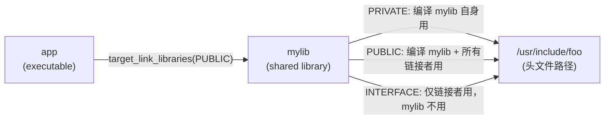
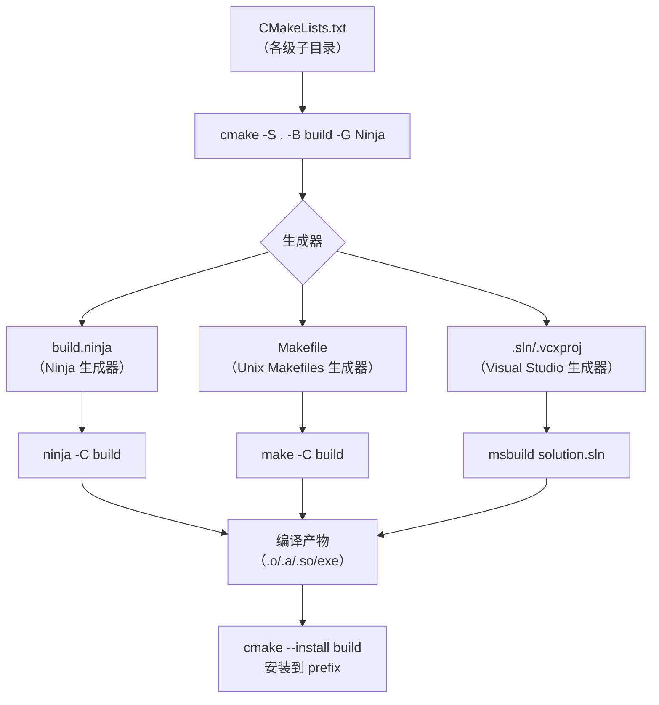

---
tags:
  - build-systems
  - tier3
  - cmake
  - cross-platform
---
# CMake跨平台构建系统

> [!abstract] TL;DR
> CMake 是跨平台**元构建系统**：它不直接编译代码，而是将 CMakeLists.txt 转换为 Ninja/Make/VS 等后端的构建文件。Modern CMake（3.x）以 target 为中心，用 `INTERFACE/PUBLIC/PRIVATE` 传播依赖属性，彻底替代了 2.x 时代的全局变量风格。理解生成器模型和 target 传播机制是驾驭 CMake 的核心。

## 概述与定位

### CMake 的定位

CMake 是**元构建系统（Meta Build System）**：

```
CMakeLists.txt  →  cmake -G "Ninja"  →  build.ninja  →  ninja  →  可执行文件
                                    ↳  Makefile      →  make
                                    ↳  .sln/.vcxproj →  msbuild
```

CMake 本身不执行编译，它生成适合目标平台的原生构建文件，再由原生工具执行。这是它实现跨平台的核心机制。

### 2.x vs 3.x（Modern CMake）演进

| 特性 | CMake 2.x（旧风格）| CMake 3.x Modern CMake |
|------|-------------------|----------------------|
| 依赖传播 | `include_directories()`/`link_libraries()` 全局污染 | `target_include_directories(PRIVATE/PUBLIC/INTERFACE)` |
| 编译选项 | `add_definitions()` 全局 | `target_compile_options()`/`target_compile_definitions()` |
| 包管理 | `find_package()` + 手动 | `find_package()` + `FetchContent` (3.11+) |
| 最低版本 | 无强制 | `cmake_minimum_required(VERSION 3.x)` 是必须的第一行 |
| 哲学 | "告诉 CMake 如何编译" | "描述 target 的属性，让 CMake 推导如何编译" |

## 原理与机制

### 生成器模型

CMake 的生成器（Generator）决定输出什么类型的构建文件：

```bash
cmake -G "Ninja"                    # 生成 build.ninja
cmake -G "Unix Makefiles"           # 生成 Makefile
cmake -G "Visual Studio 17 2022"    # 生成 .sln + .vcxproj
cmake -G "Xcode"                    # 生成 .xcodeproj
```

生成器分两类：
- **单配置生成器**（Ninja/Make）：每次 `cmake` 只生成一种 build type（Debug/Release）
- **多配置生成器**（VS/Xcode）：单次生成，构建时选择 `--config Debug/Release`

### 三目录结构

```
项目根/
├── CMakeLists.txt          # 源码树（Source Tree）
├── src/
└── build/                  # 二进制树（Binary Tree，推荐 out-of-source）
    ├── CMakeCache.txt       # 缓存变量
    ├── CMakeFiles/
    ├── build.ninja          # 生成的构建文件
    └── install/             # 安装树（Install Tree，cmake --install）
```

**永远使用 out-of-source build**（build 目录在源码树外），避免污染源码。

### Target 传播机制

Modern CMake 的核心是 target 的属性传播：

```
PRIVATE   →  仅当前 target 使用，不向依赖方传播
PUBLIC    →  当前 target 使用，且传播给所有链接它的 target
INTERFACE →  当前 target 不使用，仅传播给链接它的 target（头文件库专用）
```



## 结构/算法/伪代码详解

### 完整 CMakeLists.txt 示例

```cmake
# 必须第一行，防止使用已弃用 API
cmake_minimum_required(VERSION 3.21)

# 项目声明
project(MyProject
    VERSION 1.2.3
    DESCRIPTION "示例项目"
    LANGUAGES CXX C
)

# 全局设置
set(CMAKE_CXX_STANDARD 17)
set(CMAKE_CXX_STANDARD_REQUIRED ON)
set(CMAKE_EXPORT_COMPILE_COMMANDS ON)  # 生成 compile_commands.json，供 clangd 使用

# ── 库 ──────────────────────────────────────────────────────────
add_library(mylib STATIC
    src/foo.cpp
    src/bar.cpp
)

# PUBLIC：编译 mylib 本身需要，链接 mylib 的 target 也需要
target_include_directories(mylib
    PUBLIC  ${CMAKE_CURRENT_SOURCE_DIR}/include
    PRIVATE ${CMAKE_CURRENT_SOURCE_DIR}/src
)

target_compile_options(mylib PRIVATE -Wall -Wextra)

# ── 可执行文件 ────────────────────────────────────────────────────
add_executable(myapp src/main.cpp)

# 链接时自动继承 mylib 的 PUBLIC include 路径
target_link_libraries(myapp PRIVATE mylib)

# ── 外部依赖（find_package）────────────────────────────────────────
find_package(ZLIB REQUIRED)
target_link_libraries(mylib PRIVATE ZLIB::ZLIB)

# ── 安装规则 ──────────────────────────────────────────────────────
install(TARGETS myapp mylib
    RUNTIME DESTINATION bin
    LIBRARY DESTINATION lib
    ARCHIVE DESTINATION lib
)
install(DIRECTORY include/ DESTINATION include)

# ── 测试 ──────────────────────────────────────────────────────────
enable_testing()
add_subdirectory(tests)
```

### INTERFACE/PUBLIC/PRIVATE 详解

```cmake
# 头文件库（Header-only Library）用 INTERFACE
add_library(header_only INTERFACE)
target_include_directories(header_only INTERFACE include/)
# 不需要编译源文件，链接方自动获得 include 路径

# 插件库（只有实现，不暴露接口）用 PRIVATE
add_library(plugin SHARED src/plugin.cpp)
target_include_directories(plugin
    PRIVATE src/internal/   # 内部头文件，不暴露
    PUBLIC  include/        # ABI 接口头文件，链接方需要
)
```

### FetchContent 示例（CMake 3.11+）

```cmake
include(FetchContent)

FetchContent_Declare(
    googletest
    GIT_REPOSITORY https://github.com/google/googletest.git
    GIT_TAG        v1.14.0
    # 内容哈希验证（推荐，防止供应链攻击）
    # DOWNLOAD_EXTRACT_TIMESTAMP TRUE
)

# 填充（首次下载，后续从缓存读取）
FetchContent_MakeAvailable(googletest)

# 之后可直接使用 gtest/gmock targets
add_executable(my_test tests/my_test.cpp)
target_link_libraries(my_test PRIVATE GTest::gtest_main)
```

### tests/CMakeLists.txt

```cmake
find_package(GTest REQUIRED)

add_executable(test_foo test_foo.cpp)
target_link_libraries(test_foo PRIVATE mylib GTest::gtest_main)

include(GoogleTest)
gtest_discover_tests(test_foo)  # 自动注册为 CTest 测试用例
```

## 工具视角与实战

### 常用命令序列

```bash
# 1. 配置（生成构建文件）
cmake -S . -B build -G Ninja \
    -DCMAKE_BUILD_TYPE=Release \
    -DCMAKE_INSTALL_PREFIX=/usr/local

# 2. 构建
cmake --build build --parallel $(nproc)

# 3. 仅构建特定 target
cmake --build build --target mylib

# 4. 安装
cmake --install build

# 5. 运行测试（通过 CTest）
ctest --test-dir build --output-on-failure -j$(nproc)

# 6. 打包（CPack）
cd build && cpack -G TGZ   # 生成 .tar.gz
cd build && cpack -G DEB   # 生成 .deb（Linux）
```

### CPack 配置

```cmake
# 在 CMakeLists.txt 末尾添加
set(CPACK_PACKAGE_NAME "MyProject")
set(CPACK_PACKAGE_VERSION ${PROJECT_VERSION})
set(CPACK_GENERATOR "TGZ;DEB;RPM")
set(CPACK_DEBIAN_PACKAGE_MAINTAINER "Author <email>")
include(CPack)
```

### cmake-gui / ccmake

```bash
# 图形化配置（cmake-gui 是 Qt GUI，ccmake 是 TUI）
cmake-gui .   # 在源码目录打开 GUI，选择 build 目录
ccmake build  # 终端交互式修改 cache 变量
```

生成的 `compile_commands.json` 可与 clangd/clang-tidy/LSP 集成，提供代码补全和静态检查。

### CMake 生成器模型流程图



## 安全性与正确使用

### CMakeLists.txt 代码注入

`execute_process()` 和 `file(DOWNLOAD ...)` 在 configure 阶段执行，若参数来自外部（`-D` 变量），存在注入风险：

```cmake
# 危险：直接将用户传入的变量拼入命令
execute_process(COMMAND bash -c "echo ${USER_INPUT}")

# 安全：使用 CMake 原生命令，避免 Shell 调用
# 或对变量进行严格验证
if(NOT USER_INPUT MATCHES "^[a-zA-Z0-9_-]+$")
    message(FATAL_ERROR "Invalid USER_INPUT: ${USER_INPUT}")
endif()
```

### FetchContent 的哈希验证

FetchContent 从外部 URL 下载代码，应启用内容哈希验证防止供应链攻击：

```cmake
FetchContent_Declare(
    catch2
    URL      https://github.com/catchorg/Catch2/archive/v3.4.0.tar.gz
    URL_HASH SHA256=122928b814b75717316c71af69bd2b43387643ba076a6ec16e7882bfb2dfacbb
)
```

`GIT_TAG` 应使用完整 commit SHA（如 `a1b2c3d4...`），而非标签名（标签可被强制更新）。

### cmake_minimum_required 的重要性

`cmake_minimum_required(VERSION X.Y)` 除了检查版本，还会**激活/禁用特定行为策略（cmake_policy）**。省略或设置过低会导致行为不一致。

建议设置为项目实际需要的最低 CMake 版本，通常是 3.21（支持 `cmake -S -B` 语法）或更高。

## 小结

CMake 的三大支柱：**生成器模型**（跨平台不侵入原生工具）、**target 传播**（Modern CMake 用 PUBLIC/PRIVATE/INTERFACE 隔离依赖边界）、**FetchContent/find_package**（外部依赖管理）。迁移老项目时，最重要的一步是将 `include_directories()`/`link_libraries()` 的全局调用替换为 `target_*()` 的作用域调用，消除全局污染。

## 相关阅读

- Craig Scott, *Professional CMake: A Practical Guide*（权威书籍）
- CMake 官方文档：[https://cmake.org/cmake/help/latest/](https://cmake.org/cmake/help/latest/)
- Daniel Pfeifer, *Effective Modern CMake*（演讲 slides，可搜索）
- CMake 教程：[https://cmake.org/cmake/help/latest/guide/tutorial/](https://cmake.org/cmake/help/latest/guide/tutorial/)

---
[[00.构建系统横向对比总览|⬆ 系列总览]] | [[02.Make与Makefile深度解析|← 上一章]] | [[04.Bazel与大型单仓构建|→ 下一章]]
