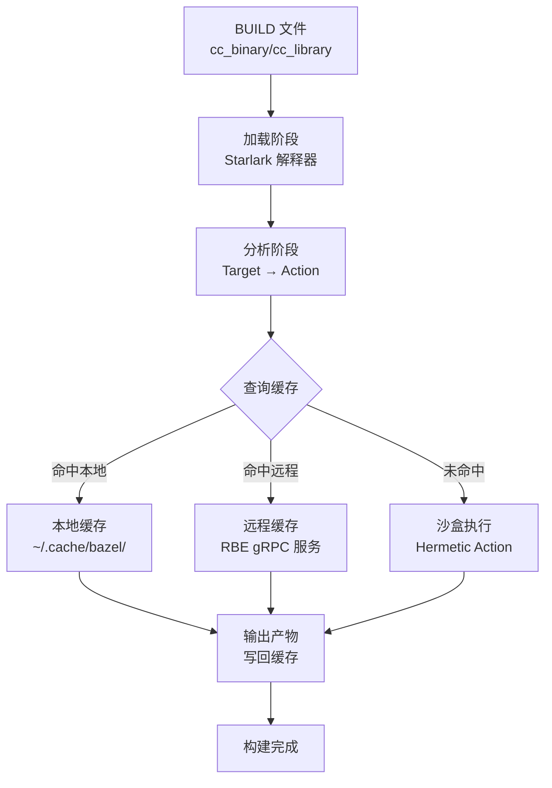

---
tags:
  - build-systems
  - tier3
  - bazel
  - monorepo
  - hermetic
---
# Bazel与大型单仓构建

> [!abstract] TL;DR
> Bazel 是 Google 内部 Blaze 系统的开源版，专为大型单仓（Monorepo）设计。其核心是三阶段执行模型（Loading → Analysis → Execution）和 **Hermetic 沙盒执行**：所有输入必须显式声明，输出完全确定，Action 缓存键由输入内容哈希 + 命令 + 环境的 Merkle 摘要构成，可安全共享远程缓存（RBE）。Starlark 语言的无副作用约束是确定性的保证，但 Hermetic 的代价是工具链也必须纳管。

## 概述与定位

### Bazel 的起源

Bazel 是 Google 内部构建系统 **Blaze** 的开源版本，2015 年以 Apache 2.0 许可证发布。Blaze 在 Google 内部管理着数十亿行代码的单仓构建，支持 C++、Java、Python、Go、Objective-C、Android、iOS 等几十种语言。

Bazel 的核心设计目标：
- **可重现性（Reproducibility）**：相同输入永远产生相同输出
- **正确性（Correctness）**：构建结果不受环境污染（时区/用户名/未声明文件等）
- **可扩展性（Scalability）**：百万文件单仓，数千目标并行
- **远程执行（Remote Execution）**：本地描述，云端分布式编译

### 单仓优势

与多仓相比，单仓（Monorepo）配合 Bazel 的优势：
- 跨组件依赖在编译时验证，而非在 CI/部署时才发现
- 原子提交：一个 commit 可同时修改多个组件并保证兼容
- 统一工具链和版本，消除"依赖地狱"
- 增量构建可感知跨组件变化，只重建受影响的 target

## 原理与机制

### 三阶段执行模型

Bazel 的构建过程严格分为三个阶段，每个阶段有明确的职责边界，理解这三个阶段是理解 Bazel 行为的关键：

**加载阶段（Loading Phase）**：Bazel 读取所有被请求 target 传递依赖到的 BUILD 文件，执行其中的 Starlark 代码（包括宏展开、rule 调用等），生成一棵 **Target 树**。这个阶段的产物是 Target 的集合，每个 Target 有名字、属性（attrs）、以及依赖关系。加载阶段本身不了解 Action，它只知道 "有哪些 target，每个 target 的属性是什么"。

加载阶段的性能：Bazel 会缓存已解析的 BUILD 文件（使用 Skyframe 框架）。若 BUILD 文件未变，对应的加载结果直接从内存复用，不重新解析。

**分析阶段（Analysis Phase）**：对每个 Target，Bazel 调用其 rule 的 `implementation` 函数，该函数通过 `ctx.actions.*` 系列 API 注册 **Action**（一个 Action = 一组输入文件 + 一条命令 + 一组输出文件的三元组）。所有 Action 构成 **Action Graph**（动作图），这是真正的执行 DAG。

分析阶段的关键约束：`implementation` 函数必须是纯函数，不能有副作用（不能读写文件系统、不能随机、不能获取时间）。这由 Starlark 语言的限制保证（见后文）。因此，分析阶段可以安全地并发执行，Skyframe 框架会对分析结果做细粒度缓存。

**执行阶段（Execution Phase）**：Bazel 对 Action Graph 做拓扑排序，按顺序（或并行）执行 Action。执行前，先查询本地缓存（`~/.cache/bazel/`）和远程缓存（若配置了 RBE）：若缓存命中，直接恢复输出文件，跳过执行；若未命中，在沙盒中执行 Action，完成后将结果写入缓存。

三阶段分离的好处是可以精确地在任意粒度做缓存和失效控制：BUILD 文件改变时，只重新加载和分析受影响的包；Action 输入哈希未变时，直接用缓存结果。

### Hermetic 沙盒执行原理

Bazel 的每个 Action 在沙盒中执行：

```
┌─────────────────────────────────────────┐
│              Sandbox 边界                │
│  可见文件 = 显式声明的 srcs + deps        │
│  不可见 = /home/user/、环境变量（默认）   │
│  不可见 = 系统头文件（需通过 toolchain）  │
│                                         │
│  gcc -c foo.c -o foo.o                 │
└─────────────────────────────────────────┘
```

若构建规则未声明某输入文件，在沙盒中该文件根本不存在，构建直接失败。这**强制开发者精确声明依赖**，是 Hermetic 的核心价值。

**Linux 上的沙盒实现**：Bazel 在 Linux 上使用 Linux namespace 实现沙盒隔离：
- **mount namespace**：为每个 Action 创建独立的挂载命名空间，用 bind mount 将声明的输入文件挂载进去，其他路径不可见
- **user namespace**：以无特权用户身份运行，不需要 root 权限
- **network namespace**（可选）：阻断网络访问，防止构建依赖网络状态

macOS 上 Bazel 使用 `sandbox-exec` 实现类似效果；Windows 上沙盒支持较弱，通常通过工具链路径约束而非 OS-level 隔离。

**Hermetic 的代价**：

沙盒带来了一个必须正视的代价：**工具链（编译器、链接器、标准库头文件）也必须被 Bazel 纳管**，否则沙盒中的 Action 看不到它们。在普通 Make/CMake 项目中，你可以使用系统的 `/usr/bin/gcc`，因为所有进程都能看到它。但在 Bazel 的 Hermetic 沙盒中，`/usr/bin/gcc` 不在沙盒内，必须通过 `cc_toolchain` 规则把编译器注册为 Bazel 管理的 toolchain target，然后 Bazel 将其 bind mount 进沙盒。

这意味着在 Bazel 项目中，从零开始使用一个新的编译器或 SDK，需要编写 toolchain 配置，而不是简单地 `export CC=/path/to/new-gcc`。这是 Bazel 最大的门槛之一，也是"Bazel 工程师"这个职位存在的原因。

### Action 缓存 key：Merkle 摘要

Bazel 的 Action 缓存以 Action 的"指纹"为键。这个指纹是一个 **Merkle 树**的根哈希，包含：

```
ActionKey = SHA256(
    所有输入文件内容的哈希树（Merkle tree over input file hashes），
    命令行参数字符串，
    环境变量（仅声明为输入的，默认所有环境变量被屏蔽），
    执行平台（exec platform）标识
)
```

Merkle 树的使用是关键优化：若大量输入文件未变，Merkle 树的大部分内部节点可以复用，只需重新计算发生变化的叶节点及其祖先路径，而非对所有输入文件内容重新哈希。

**远程缓存的工作方式**：本地 Bazel 计算出 ActionKey，向 CAS（Content-Addressable Storage）服务查询。若命中，CAS 返回输出文件的内容哈希，本地 Bazel 再按哈希下载对应文件。整个过程不需要执行 Action，对大型项目的 CI 效率提升极为显著：只有 `git diff` 影响到的 Action 需要真正执行，其余全部从缓存获取。

### Action Graph

Bazel 将构建分为三个阶段：

1. **加载阶段（Loading）**：读取所有 BUILD 文件，执行 Starlark 宏，生成 Target 集合
2. **分析阶段（Analysis）**：将 Target 转换为 Action Graph（Action = 输入 + 命令 + 输出的三元组）
3. **执行阶段（Execution）**：在沙盒中执行 Action，查询本地/远程缓存



### 远程执行（RBE）

RBE（Remote Build Execution）基于 gRPC 协议，使 Bazel 能将 Action 提交到远程集群执行：

```
本地 Bazel ──gRPC──→ RBE 服务端 ──调度──→ Worker 集群
                          ↑
                    Remote Cache（Content-Addressable Storage，CAS）
```

Action 的缓存键是所有输入内容的哈希，任何 CI 机器上相同的 Action 都能命中同一缓存，实现**跨机器增量构建**。

## 结构/算法/伪代码详解

### BUILD 文件示例

```python
# lib/BUILD

# 共享库
cc_library(
    name = "mylib",
    srcs = ["foo.cpp", "bar.cpp"],
    hdrs = ["foo.h", "bar.h"],
    deps = [
        "//third_party/zlib",     # 绝对 Label
        ":helper",                 # 相对 Label（同 package）
    ],
    visibility = ["//visibility:public"],  # 对外可见
)

# 内部辅助库
cc_library(
    name = "helper",
    srcs = ["helper.cpp"],
    hdrs = ["helper.h"],
    visibility = ["//lib:__pkg__"],  # 仅本 package 可见
)

# 可执行文件
cc_binary(
    name = "myapp",
    srcs = ["main.cpp"],
    deps = [":mylib"],
)

# 测试
cc_test(
    name = "mylib_test",
    srcs = ["foo_test.cpp"],
    deps = [
        ":mylib",
        "@com_google_googletest//:gtest_main",
    ],
    size = "small",  # small/medium/large 控制超时
)
```

### WORKSPACE 文件示例

```python
# WORKSPACE（位于仓库根目录）

workspace(name = "my_workspace")

# 加载 Bazel 官方规则
load("@bazel_tools//tools/build_defs/repo:http.bzl", "http_archive")

# 外部依赖：Google Test
http_archive(
    name = "com_google_googletest",
    urls = ["https://github.com/google/googletest/archive/v1.14.0.tar.gz"],
    sha256 = "8ad598c73ad796e0d8280b082cebd82a630d73e73cd3c70057938a6501bba5d7",
    strip_prefix = "googletest-1.14.0",
)

# 外部依赖：Abseil
http_archive(
    name = "com_google_absl",
    urls = ["https://github.com/abseil/abseil-cpp/archive/20240116.0.tar.gz"],
    sha256 = "...",
    strip_prefix = "abseil-cpp-20240116.0",
)
```

> **注意**：Bazel 6+ 推荐使用 `MODULE.bazel`（Bzlmod）替代 `WORKSPACE`，语法更简洁且支持版本解析。

### Starlark 自定义规则骨架

```python
# rules/my_rule.bzl

# 规则实现函数（ctx 提供访问 target 属性的接口）
def _my_rule_impl(ctx):
    # 声明输出文件
    output = ctx.actions.declare_file(ctx.label.name + ".out")

    # 注册 Action
    ctx.actions.run(
        inputs = ctx.files.srcs,        # 输入文件列表
        outputs = [output],              # 输出文件列表
        executable = ctx.executable.tool,  # 工具
        arguments = [
            "--input", ctx.files.srcs[0].path,
            "--output", output.path,
        ],
        mnemonic = "MyRule",             # 进度输出标识
        progress_message = "Processing %s" % ctx.label,
    )

    return [DefaultInfo(files = depset([output]))]

# 规则定义
my_rule = rule(
    implementation = _my_rule_impl,
    attrs = {
        "srcs": attr.label_list(allow_files = [".txt"]),
        "tool": attr.label(
            default = "//tools:my_tool",
            executable = True,
            cfg = "exec",  # 工具在 exec 平台运行
        ),
    },
)
```

### Label 语法

```
//package/path:target_name
│             │
│             └── target 名称（默认等于目录名时可省略）
└──────────────── 从 workspace 根开始的包路径

示例：
//src/lib:mylib     完整 label
//src/lib           等价于 //src/lib:lib（target 名与目录同名）
:mylib              相对 label（同 package）
@repo//pkg:target   引用外部 workspace
```

## 工具视角与实战

### bazel query：依赖分析

```bash
# 查询 myapp 的所有直接依赖
bazel query 'deps(//src:myapp, 1)'

# 查询哪些 target 依赖了 mylib
bazel query 'rdeps(//..., //lib:mylib)'

# 找出 //src:app 和 //lib:mylib 的共同依赖
bazel query 'intersect(deps(//src:app), deps(//lib:mylib))'

# 生成依赖图（Graphviz DOT 格式）
bazel query --output=graph 'deps(//src:myapp)' | dot -Tpng > deps.png
```

### bazel aquery：Action 分析

```bash
# 查看编译 foo.cpp 的具体命令行
bazel aquery '//src:myapp' --output=text | grep "foo.cpp"

# 查看 Action 的输入/输出/环境变量
bazel aquery --output=jsonproto '//src:myapp' > actions.json
```

### Aspect 示例：生成 compile_commands.json

```python
# aspects/compile_commands.bzl

CompileCommandsInfo = provider(fields = ["commands"])

def _compile_commands_aspect_impl(target, ctx):
    commands = []
    if CcInfo in target:
        for action in ctx.rule.attr.srcs:
            commands.append(struct(
                file = action.label.name,
                command = "...",  # 从 target 的编译 flags 构造
                directory = ctx.label.workspace_root,
            ))
    return [CompileCommandsInfo(commands = commands)]

compile_commands_aspect = aspect(
    implementation = _compile_commands_aspect_impl,
    attr_aspects = ["deps"],  # 递归应用到 deps 属性
)
```

运行：`bazel build //... --aspects=//aspects:compile_commands.bzl%compile_commands_aspect`

### BEP（Build Event Protocol）

```bash
# 将构建事件流写入 JSON 文件，供 CI 系统消费
bazel build //... \
    --build_event_json_file=build_events.json \
    --bes_results_url=https://remote.buildbuddy.io
```

BEP 记录每个 Action 的开始/结束、缓存命中率、测试结果等，是接入 CI Dashboard 的标准接口。

### 常用构建命令

```bash
# 构建单个 target
bazel build //src:myapp

# 构建整个仓库（慎用，耗时长）
bazel build //...

# 运行测试
bazel test //src/... --test_output=errors

# 运行可执行文件
bazel run //src:myapp -- --arg1 --arg2

# 清理本地缓存
bazel clean
bazel clean --expunge  # 完全清理，包括外部依赖

# 查看构建信息
bazel info output_base
bazel info execution_root
```

## 安全性与正确使用

### Starlark 安全模型

Starlark（Bazel 的 BUILD 文件语言）是 Python 的严格子集，刻意移除了危险特性：

| 特性 | Python | Starlark |
|------|--------|---------|
| 文件系统访问 | `open()` | 禁止 |
| 网络访问 | `socket` | 禁止 |
| 随机数 | `random` | 禁止（保证确定性）|
| 时间获取 | `time.time()` | 禁止（保证确定性）|
| 递归 | 允许 | 禁止（防止无限循环）|
| 可变全局状态 | 允许 | 禁止 |

这些限制确保 Starlark 代码是**纯函数**：相同输入 → 相同输出，无副作用，可安全并行执行。

**为什么无副作用如此重要**：Starlark 代码（BUILD 文件和 `.bzl` 文件）在分析阶段执行。若允许副作用（如写文件、随机数），同一个 `.bzl` 文件在不同机器、不同时间执行可能产生不同结果，Action Graph 就会因机器而异，缓存共享就失去了意义。无副作用约束直接支撑了远程缓存的可靠性。

这也解释了一个常见的困惑：为什么 Bazel 规则中不能用 `ctx.actions.run_shell()` 随意 `cat /etc/hostname`——即使允许，这个 Action 在每台机器上输出不同，导致缓存键虽然相同但输出不同，污染缓存。

### 外部依赖声明安全

所有外部依赖应提供 `sha256` 验证：

```python
# 正确：提供 sha256
http_archive(
    name = "zlib",
    urls = ["https://zlib.net/zlib-1.3.tar.gz"],
    sha256 = "b5b06d60ce49c8ba700e0ba517fa07de80b5d4628a037f4be8ad16955be7a7c0",
)

# 危险：无 sha256，下载内容可被篡改
http_archive(
    name = "zlib",
    urls = ["https://zlib.net/zlib-1.3.tar.gz"],
    # 缺少 sha256！
)
```

### 可见性控制

合理设置 `visibility` 是大型单仓的重要边界控制：

```python
# 内部实现细节，仅本 package 可见
visibility = [":__pkg__"]

# 子 package 可见（但不对外暴露）
visibility = ["//src:__subpackages__"]

# 仅特定 package 可见
visibility = ["//app:__pkg__", "//tests:__pkg__"]

# 完全公开（谨慎使用）
visibility = ["//visibility:public"]
```

可见性控制在大型单仓中是架构强制工具，而非可选的优化。在 Google 内部，核心库团队通过 `visibility` 约束，强制要求上层使用者通过公开 API 访问，而非直接引用内部实现。违反可见性约束的 BUILD 文件会被 Bazel 拒绝构建，这是机器强制的架构边界，比代码审查更可靠。

## 小结

Bazel 的差异化价值在于三点：**Hermetic 执行**（沙盒隔离消除环境污染，通过 Linux namespace 实现，工具链也必须纳管）、**精确增量**（内容哈希 + Merkle 摘要作为 Action 缓存键，支持跨机器远程缓存共享）、**Starlark 扩展**（无副作用纯函数规则语言，确定性是远程缓存可信的前提）。代价是较陡的学习曲线和严格的依赖声明要求。对于需要高 CI 效率和跨团队协作的大型单仓项目，Bazel 是目前最成熟的选择。

## 相关阅读

- Bazel 官方文档：[https://bazel.build/](https://bazel.build/)
- *Software Engineering at Google*（Winters 等）—— Build Systems 章节
- Bzlmod 迁移指南：[https://bazel.build/external/migration](https://bazel.build/external/migration)
- BuildBuddy RBE 文档：[https://www.buildbuddy.io/docs/rbe-setup/](https://www.buildbuddy.io/docs/rbe-setup/)

---
[[00.构建系统横向对比总览|⬆ 系列总览]] | [[03.CMake跨平台构建系统|← 上一章]] | [[05.Ninja构建后端原理|→ 下一章]]
