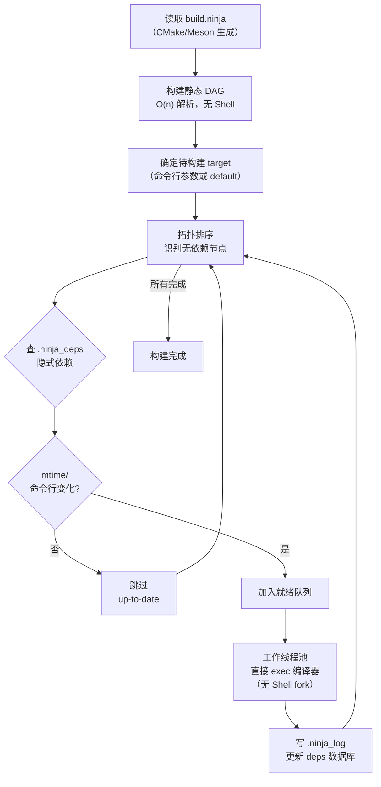

---
tags:
  - build-systems
  - tier3
  - ninja
  - build-backend
---
# Ninja构建后端原理

> [!abstract] TL;DR
> Ninja 是专注于**执行速度**的构建后端，由 Evan Martin 在 Chrome 团队开发，2012 年首发。它不含项目描述能力，`.ninja` 文件由 CMake/Meson/GN 等上层系统生成。其速度优势来自三点：无 Shell fork 直接 exec、静态 DAG 无需解析规则、精确的 deps 数据库实现真正增量。

## 概述与定位

### Ninja 的诞生背景

2012 年，Evan Martin 在 Chromium 项目组开发 Ninja，目标是解决一个具体问题：**Chromium 项目有数千个源文件，Make 的重建检查本身就需要数秒，严重影响开发体验**。

Ninja 的设计哲学与 Make 截然相反：
- Make：通用、灵活，可直接手写，含丰富内置规则
- Ninja：专用、极简，不支持手写，只做一件事——以最快速度执行已知 DAG

### 与 Make 的核心差异

| 对比维度 | Make | Ninja |
|---------|------|-------|
| 设计目标 | 通用构建语言 | 纯执行速度 |
| 输入来源 | 手写 Makefile | 由上层工具生成 |
| Shell 调用 | 每行 recipe 一个 Shell 进程 | 直接 exec，无 Shell fork |
| 依赖描述 | 静态声明或 `$(shell ...)` | 静态 + `deps` 数据库（.ninja_deps）|
| 重建检查 | 解析所有规则后 mtime 比较 | 静态 DAG，O(1) 查表 |
| 内置规则 | 大量（`.c→.o` 等）| 无内置规则 |
| 典型生成方 | 手写 | CMake/Meson/GN/Buck |

## 原理与机制

### 静态 DAG 与无 Shell fork

Make 每执行一行 recipe 都要 fork 一个 Shell 子进程，设置环境变量，解析命令，最后 exec 编译器。对于有数万条命令的大型项目，Shell fork 的开销累计显著。

Ninja 直接解析命令字符串，调用 `execve()` 执行编译器，**完全跳过 Shell 层**：

```
Make:  make → fork → /bin/sh → exec gcc
Ninja: ninja → exec gcc  （少了两次进程创建）
```

### deps 数据库

Ninja 的 `deps` 机制是其增量构建正确性的关键：

```
deps = gcc  →  Ninja 读取 GCC 的 -MMD 输出（.d 文件）
              解析后存入 .ninja_deps 二进制数据库
              下次构建直接查库，无需重新解析 .d 文件
```

两种 deps 模式：
- `deps = gcc`：GCC/Clang 风格，读 `-MF` 生成的 `.d` 文件
- `deps = msvc`：MSVC 风格，读 `/showIncludes` 的 stderr 输出

deps 数据库（`.ninja_deps` + `.ninja_log`）存在 build 目录中，记录每个输出文件的所有隐式输入（头文件），实现**头文件变更的精确增量**。

### 重建检查流程

Ninja 的重建判断比 Make 更精确：
1. 检查输出文件是否存在
2. 检查命令行是否改变（存在 `.ninja_log` 中）
3. 检查所有显式输入（`in` 字段）的 mtime
4. 检查 `deps` 数据库中的隐式输入 mtime

只有上述任一条件满足才重建，**命令行改变也会触发重建**（Make 不具备此能力）。

## 结构/算法/伪代码详解

### .ninja 文件完整语法

```ninja
# ── 全局变量 ──────────────────────────────────────────────────────
cc = gcc
cflags = -Wall -O2
builddir = obj

# ── Pool：控制并发度（防止链接 OOM）──────────────────────────────
pool link_pool
  depth = 2   # 最多同时运行 2 个链接 job

# ── Rule：定义构建规则 ────────────────────────────────────────────
rule cc
  command = $cc $cflags -MMD -MT $out -MF $out.d -c $in -o $out
  depfile = $out.d      # 指定 .d 文件路径
  deps = gcc            # 使用 GCC deps 解析模式
  description = CC $in  # 进度显示文本

rule link
  command = $cc -o $out $in $ldflags
  description = LINK $out
  pool = link_pool      # 使用 link_pool 控制并发

rule ar
  command = ar rcs $out $in
  description = AR $out

# ── Build 语句：声明具体构建边 ──────────────────────────────────
build $builddir/main.o: cc src/main.c
build $builddir/foo.o: cc src/foo.c
build $builddir/bar.o: cc src/bar.c

# 链接（$^ 对应 Ninja 中的多个输入）
build myapp: link $builddir/main.o $builddir/foo.o $builddir/bar.o

# 静态库
build libmylib.a: ar $builddir/foo.o $builddir/bar.o

# 生成步骤（无依赖的代码生成）
rule proto
  command = protoc --cpp_out=$outdir $in
  description = PROTO $in

build src/foo.pb.cc src/foo.pb.h: proto proto/foo.proto

# ── Phony：虚目标 ─────────────────────────────────────────────────
build all: phony myapp libmylib.a

# ── Default：指定默认 target ─────────────────────────────────────
default all
```

### Ninja DAG 构建与执行流程



### deps 隐式依赖工作原理

```
编译阶段：
  gcc -MMD -MF obj/main.o.d -c src/main.c -o obj/main.o
  → 生成 obj/main.o.d:
      obj/main.o: src/main.c include/foo.h include/bar.h

Ninja 读取 .d 文件后：
  1. 将 include/foo.h、include/bar.h 记录到 .ninja_deps
  2. 删除 .d 文件（不再需要）

下次构建：
  修改 include/foo.h
  → Ninja 从 .ninja_deps 发现 obj/main.o 隐式依赖 foo.h
  → obj/main.o 标记为 stale → 重新编译
```

### Pool 并发控制

```ninja
# 链接通常内存消耗大，限制并发
pool link_pool
  depth = 2

# 代码生成工具（如 protoc）可能有许可证限制
pool codegen_pool
  depth = 1

rule link
  command = ld ...
  pool = link_pool

rule generate_proto
  command = protoc ...
  pool = codegen_pool

# 特殊 pool：console（串行，输出不缓冲，用于交互工具）
rule run_tests
  command = ./run_tests.sh
  pool = console
```

## 工具视角与实战

### Ninja 调试工具集

```bash
# 构建（-j 并行，-l 负载限制）
ninja                      # 默认构建 default target
ninja -j4                  # 最多 4 个并行 job
ninja -j4 -l8.0            # 并行 4，但系统负载超 8.0 时暂停
ninja -C build myapp       # 在 build 目录构建 myapp

# 干运行（打印将执行的命令）
ninja -n

# 详细输出（显示完整命令而非 description）
ninja -v

# 生成 Graphviz 依赖图
ninja -t graph myapp | dot -Tpng > deps.png

# 清理（删除所有 build 语句的输出文件）
ninja -t clean
ninja -t clean --generator   # 同时清理生成器输出（build.ninja）

# 查询工具（targets）
ninja -t targets all        # 列出所有 target
ninja -t targets rule cc    # 列出所有用 cc 规则构建的 target

# 查询 target 信息
ninja -t query myapp        # 显示 myapp 的输入和输出

# 列出所有 target 及其规则
ninja -t browse              # 在浏览器中交互查看依赖图（需要 Python）

# 检查重建原因（调试增量失效）
ninja -d explain myapp 2>&1 | head -20
```

### 与 CMake 的集成

Ninja 是 CMake 在 Unix 上的推荐后端：

```bash
# 使用 Ninja 生成器
cmake -S . -B build -G Ninja -DCMAKE_BUILD_TYPE=Release

# 等价于直接调用 ninja
cmake --build build --parallel 8
# 等价于：ninja -C build -j8
```

CMake 生成的 `build.ninja` 结构：
```
build/
├── build.ninja           # 主 ninja 文件
├── CMakeFiles/
│   ├── rules.ninja       # 编译规则定义
│   └── ...
├── .ninja_deps           # 隐式依赖数据库（二进制）
└── .ninja_log            # 构建日志（文本，含命令行哈希）
```

### .ninja_log 分析

```bash
# .ninja_log 格式（文本，可直接读）
# 字段：start_time end_time mtime output command_hash
# 1234 5678 1693000000 obj/main.o a1b2c3d4e5f6

# 找出最慢的编译单元（按 end-start 排序）
sort -t$'\t' -k2,2n build/.ninja_log | tail -20
```

## 安全性与正确使用

### .ninja 文件是生成产物，不应手动编辑

`.ninja` 文件由 CMake/Meson 生成，下次执行 `cmake` 或 `meson setup` 会覆盖。手动修改 `build.ninja` 的变更会在重新 configure 后丢失。

正确做法：修改 `CMakeLists.txt` 或 `meson.build`，然后重新 configure。

### Pool 配置避免链接 OOM

大型 C++ 项目中，LTO（Link-Time Optimization）链接可能消耗数十 GB 内存。不配置 Pool 导致多个链接同时进行时 OOM：

```ninja
# 在生成 .ninja 的工具中控制（CMake 示例）
# CMakeLists.txt:
set_property(GLOBAL PROPERTY JOB_POOLS link_pool=2)
set_property(TARGET myapp PROPERTY JOB_POOL_LINK link_pool)
```

或直接在 `build.ninja` 中（知晓会被覆盖的前提下临时调试用）：

```ninja
pool link_pool
  depth = 1
```

### 构建日志与调试

`.ninja_log` 记录每个输出文件上次构建的命令行哈希。若命令行改变（如编译选项变更），Ninja 会自动重建，即使 mtime 未变——这是 Make 不具备的能力，也是避免"改了编译选项但旧 .o 仍被使用"问题的保障。

## 小结

Ninja 的价值在于极致的执行速度，通过消除 Shell fork、维护静态 DAG、使用 deps 数据库实现精确增量。它的"不可手写"特性反而是优点：强迫开发者使用 CMake/Meson 等高层工具，分离了"描述项目结构"和"执行构建命令"两个关注点。现代 C/C++ 工作流已基本统一为"CMake/Meson 描述 → Ninja 执行"的组合。

## 相关阅读

- Ninja 官方文档：[https://ninja-build.org/manual.html](https://ninja-build.org/manual.html)
- Evan Martin, *Ninja, a small build system with a focus on speed*（Ninja 设计文档）
- Ninja GitHub：[https://github.com/ninja-build/ninja](https://github.com/ninja-build/ninja)
- 与 Make 的基准测试对比：[https://ninja-build.org/](https://ninja-build.org/)

---
[[00.构建系统横向对比总览|⬆ 系列总览]] | [[04.Bazel与大型单仓构建|← 上一章]] | [[06.Meson现代C++构建|→ 下一章]]
