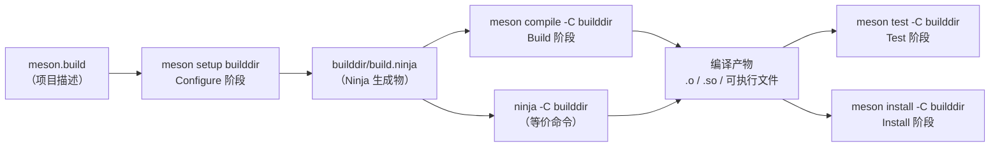

---
tags:
  - build-systems
  - tier3
  - meson
  - modern-cpp
---
# Meson现代C++构建

> [!abstract] TL;DR
> Meson 由 Jussi Pakkanen 于 2013 年创建，使用 Python 风格的 DSL 描述构建，委托 Ninja 执行。相比 CMake，Meson 在三个关键维度具有优势：configure 阶段与 build 阶段严格分离（configure 是解释型脚本，不允许在 build 时运行任意代码）；`dependency()` 自动按 pkg-config → CMake config → subproject/wrap 的顺序回退查找；machine file 用统一的 build/host/target 三元组规范描述交叉编译场景。默认开启编译警告、PIE、调试信息，是新 C/C++ 项目的首选之一。

## 概述与定位

### Meson 的优势

Jussi Pakkanen 在创建 Meson 时，CMake 已是事实标准，但 CMake 2.x 的全局变量风格和晦涩语法广受诟病。Meson 的设计目标：

- **Python 风格 DSL**：直觉友好，不需要学习额外的宏语言
- **快速**：configure 阶段本身速度快，委托 Ninja 执行确保构建速度
- **现代默认值**：默认启用 `-Wall`、PIE、`-g`，无需手动配置
- **内置跨编译**：cross file 格式统一，嵌入式开发首选
- **Wrap 系统**：轻量级依赖管理，无需 git submodule 或手动下载

### 与 CMake 的对比

| 维度 | CMake | Meson |
|------|-------|-------|
| 描述语言 | CMake DSL（类 Tcl）| Python 风格 DSL |
| 学习曲线 | 中高（2.x 遗留陷阱多）| 低（语法直觉）|
| 默认值 | 保守（历史兼容）| 现代（安全默认）|
| 依赖管理 | FetchContent/ExternalProject | Wrap 系统 |
| 跨编译 | toolchain 文件（复杂）| cross 文件（简洁）|
| 生态/IDE 支持 | 极广（CLion/VSCode/Qt）| 良好（VSCode/GNOME）|
| 灵活性 | 极高（可做任何事）| 适中（刻意约束，避免滥用）|

Meson 刻意限制了某些灵活性（如不允许在 build 阶段运行任意 Python 脚本），以确保构建的确定性和可重现性。

## 原理与机制

### Configure 阶段 vs Build 阶段的分离意义

Meson 将构建分为严格的两个阶段，这个分离不只是实现细节，而是设计哲学的核心体现。

**Configure 阶段**（`meson setup builddir`）：
- 解释 `meson.build`，探测编译器/库/系统特性
- 生成 `build.ninja`（以及 `introspect` 数据）
- 结果缓存在 `builddir/` 中，不频繁重跑

**Build 阶段**（`meson compile -C builddir` 或 `ninja -C builddir`）：
- Ninja 读取 `build.ninja` 执行编译
- Configure 变更会自动触发重新 configure（Ninja 检测到 `build.ninja` 过时）

这个分离的意义在于：**configure 阶段是"理解项目"，build 阶段是"执行编译"**，两者的时间特性和正确性保证截然不同。

Configure 阶段允许运行任意逻辑：探测系统库版本、检查编译器特性、生成配置头文件。这些操作可能有副作用（写文件、读取系统状态），但它们只在 configure 时发生，结果被冻结在 `build.ninja` 中。Build 阶段则完全不运行任意逻辑，只是执行 Ninja 的静态 Action Graph，保证了可复现性。

比较一下 CMake 的情况：CMake 也有 configure 阶段（运行 `CMakeLists.txt`）和 build 阶段（运行 Ninja/Make）。但 CMake 允许通过 `add_custom_command(TARGET ... PRE_BUILD ...)` 在 build 阶段运行任意命令，这让 CMake 的 build 阶段行为更难预测。Meson 的严格分离让每个阶段的职责更清晰。



### dependency() 查找回退链

`dependency('zlib')` 的查找顺序是 Meson 依赖管理的核心机制，逐级尝试，直到找到为止：

```
1. pkg-config（zlib.pc）
   → 搜索系统标准路径及 PKG_CONFIG_PATH 中的 .pc 文件
   → 最常见的 Unix 系统包，几乎所有系统库都提供
       ↓ 若不存在

2. cmake find_package（对 CMake 导出的包）
   → 搜索 <prefix>/lib/cmake/<Name>/<Name>Config.cmake
   → 用于安装了 CMake config 但没有 pkg-config 的库
       ↓ 若不存在

3. 内置 dependency 模块（meson 内置对 zlib/openssl/curl 等的处理）
   → Meson 对少数常见库有硬编码的查找逻辑
       ↓ 若不存在

4. wrap 子项目（从 subprojects/ 目录构建）
   → 若有 subprojects/zlib.wrap，下载并作为子项目构建
   → 自动回退，无需用户手动处理系统没有该库的情况
       ↓ 若不存在且非 required

5. 返回 not-found dependency（配合 found() 方法判断）
```

这个自动回退链的价值在于：开发者只需写 `dep = dependency('zlib')`，Meson 自动处理"系统有库时用系统库，系统没有时用 wrap 自动下载编译"的逻辑。相比 CMake 中需要手写 `find_package` + `FetchContent` + 条件判断的复杂代码，Meson 的方式更简洁，也更不容易出错。

### 为什么委托 Ninja 而非自己做后端

Meson 选择不自己实现构建后端，而是委托给 Ninja，这是一个深思熟虑的架构决策：

**专注原则**：实现一个高性能的并行构建调度器本身就是复杂工程（线程池、任务队列、signal 处理、进度报告等），Ninja 已经把这件事做到了极致。Meson 把精力集中在"如何更好地描述项目"上，而非"如何更快地执行编译"。

**性能透明**：Ninja 的性能直接传递给 Meson 用户，不需要 Meson 自己维护一套并行执行逻辑。

**IDE/工具集成**：CMake 和 Meson 都生成 `compile_commands.json` 和 `.ninja` 文件，使得 clangd、IDE、静态分析工具可以直接使用这些标准格式，不需要额外适配。

Meson 也支持其他后端（`--backend=vs` 生成 VS 项目，`--backend=xcode` 生成 Xcode 项目），通过同一个 `meson.build` 支持多平台，正是元构建系统的核心价值。

### machine file 的 build/host/target 三元组

交叉编译中有三个重要概念，来自 GNU autotools 的规范术语：

- **build machine**：运行构建系统本身的机器（如 x86-64 Linux 工作站）
- **host machine**：编译出的产物将要运行的机器（如 ARM Cortex-A53 设备）
- **target machine**：仅对编译器/汇编器/链接器有意义，指它们处理代码时所针对的架构（通常与 host 相同，交叉编译编译器本身时才不同）

Meson 的 cross file 明确声明这三个机器的信息：

```ini
[host_machine]
system = 'linux'
cpu_family = 'arm'
cpu = 'cortex-a53'
endian = 'little'
```

`meson.build` 中可以通过 `host_machine.cpu_family()` 等 API 查询，实现条件编译：

```python
if host_machine.cpu_family() == 'arm'
  # ARM 特定代码
  arm_sources = files('src/arm_asm.s')
endif
```

这比 CMake toolchain file 中通过 `CMAKE_SYSTEM_PROCESSOR` 判断更规范，更少有歧义。

### reproducible build 默认值

Meson 在设计上考虑了可复现构建（reproducible builds）的需求：

- 默认不在产物中嵌入绝对路径（避免 `__FILE__` 暴露本机路径）
- 使用 `-fdebug-prefix-map` 等编译器选项规范化路径信息
- `install_dir` 默认使用相对于 prefix 的路径，而非绝对路径

这些默认值降低了构建产物因机器差异而不同的概率，对需要分发二进制的项目（如 Linux 发行版软件包维护者）特别有价值。

### Ninja 后端委托

Meson 默认且推荐使用 Ninja 后端：

```bash
meson setup builddir            # 默认 Ninja 后端
meson setup builddir --backend=ninja    # 显式指定
meson setup builddir --backend=vs       # Visual Studio 后端（Windows）
meson setup builddir --backend=xcode    # Xcode 后端（macOS）
```

## 结构/算法/伪代码详解

### 完整 meson.build 示例

```python
# meson.build（项目根）

project('myproject', ['c', 'cpp'],
  version : '1.2.3',
  default_options : [
    'warning_level=3',      # -Wall -Wextra
    'cpp_std=c++17',
    'buildtype=debugoptimized',  # -O2 -g
    'b_pie=true',           # 位置无关可执行文件
  ]
)

# 编译器探测
cc = meson.get_compiler('c')
cxx = meson.get_compiler('cpp')

# 外部依赖
zlib_dep = dependency('zlib', required : true)
threads_dep = dependency('threads')
openssl_dep = dependency('openssl', required : false)

# 条件编译
conf = configuration_data()
conf.set('HAVE_OPENSSL', openssl_dep.found())
conf.set_quoted('PROJECT_VERSION', meson.project_version())
configure_file(
  input : 'config.h.in',
  output : 'config.h',
  configuration : conf,
)

# 生成的头文件路径（需加入 include 路径）
config_inc = include_directories('.')

# 共享库
mylib_sources = files(
  'src/foo.cpp',
  'src/bar.cpp',
)

mylib = shared_library('mylib',
  mylib_sources,
  include_directories : [include_directories('include'), config_inc],
  dependencies : [zlib_dep, threads_dep],
  version : meson.project_version(),
  install : true,
)

# 可执行文件
myapp = executable('myapp',
  'src/main.cpp',
  include_directories : include_directories('include'),
  link_with : mylib,
  dependencies : [zlib_dep],
  install : true,
)

# 安装头文件
install_headers('include/mylib.h', subdir : 'mylib')

# 子目录
subdir('tests')
```

### tests/meson.build

```python
# tests/meson.build

# 查找 GTest（优先系统包，回退 wrap）
gtest_dep = dependency('gtest', main : true, required : false)

if gtest_dep.found()
  test_foo = executable('test_foo',
    'test_foo.cpp',
    link_with : mylib,        # 引用父目录的 mylib
    dependencies : gtest_dep,
  )

  # 注册测试用例
  test('foo tests', test_foo,
    timeout : 60,
    protocol : 'gtest',       # 自动解析 GTest XML 输出
  )

  # 带环境变量的测试
  test('integration test', myapp,
    args : ['--mode=test'],
    env : ['TEST_DB=sqlite::memory:'],
  )
endif
```

### Wrap 文件格式

```ini
# subprojects/zlib.wrap

[wrap-file]
directory = zlib-1.3
source_url = https://zlib.net/zlib-1.3.tar.gz
source_filename = zlib-1.3.tar.gz
source_hash = b5b06d60ce49c8ba700e0ba517fa07de80b5d4628a037f4be8ad16955be7a7c0

[provide]
zlib = zlib_dep   # 导出 dependency 变量名
```

Wrap 类型：
- `wrap-file`：下载 tarball
- `wrap-git`：克隆 git 仓库（带 revision）
- `wrap-redirect`：重定向到另一个 wrap 文件

### cross 文件跨编译

```ini
# cross/arm-linux-gnueabihf.ini

[binaries]
c = 'arm-linux-gnueabihf-gcc'
cpp = 'arm-linux-gnueabihf-g++'
ar = 'arm-linux-gnueabihf-ar'
strip = 'arm-linux-gnueabihf-strip'
pkgconfig = 'arm-linux-gnueabihf-pkg-config'
exe_wrapper = 'qemu-arm'   # 在 x86 上运行 ARM 测试

[host_machine]
system = 'linux'
cpu_family = 'arm'
cpu = 'cortex-a53'
endian = 'little'

[built-in options]
c_args = ['-march=armv8-a']
```

使用：
```bash
meson setup builddir-arm --cross-file cross/arm-linux-gnueabihf.ini
meson compile -C builddir-arm
```

## 工具视角与实战

### 完整命令参考

```bash
# Configure
meson setup builddir
meson setup builddir --buildtype=release   # debug/debugoptimized/release/minsize
meson setup builddir -Doption=value        # 覆盖 project() 选项
meson setup builddir --reconfigure         # 修改选项后重新配置

# Build
meson compile -C builddir           # 推荐（跨平台）
meson compile -C builddir -j8       # 指定并行度
ninja -C builddir                   # 直接调用 Ninja（等价）

# Test
meson test -C builddir
meson test -C builddir --suite unit          # 运行指定 suite
meson test -C builddir -v                    # 详细输出
meson test -C builddir --test-args="--gtest_filter=Foo*"  # 传参数

# Install
meson install -C builddir
DESTDIR=/tmp/staging meson install -C builddir  # 安装到 staging 目录

# 发布 tarball
meson dist -C builddir
meson dist -C builddir --formats=xztar,gztar

# 内省（机器可读的项目信息）
meson introspect builddir --targets          # 所有 target 列表
meson introspect builddir --dependencies     # 依赖列表
meson introspect builddir --buildoptions     # 所有可配置选项
meson introspect builddir --compilers        # 编译器信息
```

### 与 IDE 集成

Meson 生成 `compile_commands.json`（`builddir/compile_commands.json`），自动被 VSCode + clangd 识别：

```bash
# VSCode settings.json
{
  "clangd.arguments": [
    "--compile-commands-dir=${workspaceFolder}/builddir"
  ]
}
```

GNOME 项目（GTK、GLib、gnome-builder 等）已全面迁移到 Meson。

### 与 CMake 横向对比的实战视角

在选择 Meson vs CMake 时，除了语法偏好，还有几个实际工程因素值得考量：

**生态宽度**：CMake 的 `find_package` 模块生态成熟，对于 Qt、Boost、OpenCV、PCL 等大型库，CMake 有官方或社区维护的 Find 模块，开箱即用。Meson 对这些库的支持虽然在改善，但仍不如 CMake 广泛。若项目依赖多个大型 C++ 框架，CMake 生态优势明显。

**IDE 集成**：CLion 对 CMake 有深度支持，可以直接 parse CMakeLists.txt 并提供代码智能提示。Meson 的 CLion 集成相对有限，VSCode + clangd 是 Meson 项目更自然的选择。

**遗留代码迁移**：从 Makefile 迁移到 CMake 有大量文档和工具支持，社区案例丰富。Meson 的迁移文档相对较少，但 Meson 提供了与 pkg-config 和 CMake config 的兼容性，使其可以直接消费 CMake 项目安装的依赖。

## 安全性与正确使用

### Wrap 来源验证

Wrap 文件中的 `source_hash` 字段是 SHA256 哈希，Meson 下载后验证，防止下载内容被篡改：

```ini
# 必须提供 source_hash
source_hash = b5b06d60ce49c8ba700e0ba517fa07de80b5d4628a037f4be8ad16955be7a7c0

# wrap-git 使用 revision（完整 commit SHA，不要用分支名）
revision = a1b2c3d4e5f6a1b2c3d4e5f6a1b2c3d4e5f6a1b2
```

使用 WrapDB（Meson 官方 wrap 仓库）可获得经过审核的 wrap 文件：
```bash
meson wrap install zlib      # 从 WrapDB 下载并添加 subprojects/zlib.wrap
meson wrap update zlib       # 更新 wrap 文件
```

### subproject 沙盒边界

Meson 的 subproject 在构建时与主项目共享编译器设置，但有独立的命名空间：
- subproject 的 `dependency()` 不会自动传播到父项目
- 父项目通过 `subproject.get_variable('dep')` 显式获取子项目导出的 dependency

```python
# 显式获取 subproject 的 dependency
sp = subproject('mylib', default_options : ['tests=false'])
mylib_dep = sp.get_variable('mylib_dep')

executable('myapp', 'main.cpp', dependencies : mylib_dep)
```

### 选项验证

Meson 的 `option()` 函数强制类型和范围检查，防止无效输入：

```python
# meson_options.txt（或 meson.options，Meson 1.1+）
option('backend', type : 'combo',
  choices : ['sqlite', 'postgresql', 'mysql'],
  value : 'sqlite',
  description : 'Database backend'
)

option('max_connections', type : 'integer',
  min : 1, max : 1000,
  value : 100,
  description : 'Maximum concurrent connections'
)
```

用户输入的无效选项值会在 configure 阶段立即报错，而非在编译时产生晦涩错误。

这与 CMake 的变量风格形成对比：CMake 的 `OPTION()` 只是一个 bool，而 Meson 的 option 有完整的类型系统（bool/integer/string/combo/array/feature），类型安全约束让构建脚本的意图更清晰，错误更早暴露。

## 小结

Meson 的核心价值是**降低 C/C++ 构建系统的认知负担**：Python 风格语法减少学习成本，现代安全默认值减少配置错误，`dependency()` 自动多源回退（pkg-config → CMake config → subproject/wrap）减少手动路径配置，build/host/target 三元组规范描述交叉编译场景，Wrap 系统提供内置哈希验证的轻量级依赖管理，reproducible build 默认值降低分发风险。

对于新 C/C++ 项目，Meson 是 CMake 最有力的竞争者；对于 GNOME/GTK 生态和嵌入式 Linux，Meson 已是事实标准。若项目依赖大量 Qt/Boost 等有深度 CMake 集成的库，则 CMake 的生态广度仍是决定因素。

## 相关阅读

- Meson 官方文档：[https://mesonbuild.com/](https://mesonbuild.com/)
- WrapDB（官方 wrap 仓库）：[https://wrapdb.mesonbuild.com/](https://wrapdb.mesonbuild.com/)
- Jussi Pakkanen, *Why I wrote Meson*（博客，可搜索）
- GNOME 构建系统迁移说明：[https://wiki.gnome.org/Initiatives/GnomeGoals/MesonPorting](https://wiki.gnome.org/Initiatives/GnomeGoals/MesonPorting)

---
[[00.构建系统横向对比总览|⬆ 系列总览]] | [[05.Ninja构建后端原理|← 上一章]] | [[07.Gradle与JVM生态构建|→ 下一章]]
