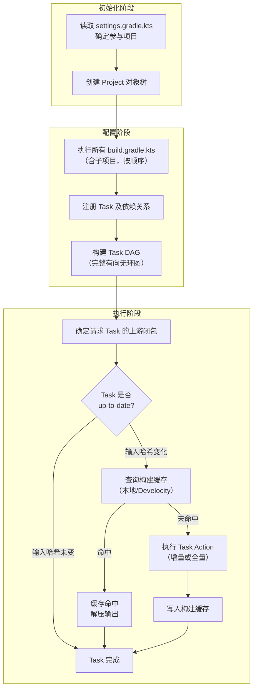

---
tags:
  - build-systems
  - tier3
  - gradle
  - jvm
  - android
---
# Gradle与JVM生态构建

> [!abstract] TL;DR
> Gradle 是 JVM 和 Android 生态的主流构建系统，以 Groovy/Kotlin DSL 描述 Task DAG，通过 `@Input/@Output` 注解实现精确增量构建。本地缓存（`~/.gradle/caches/`）加远程缓存（Develocity）可将 CI 构建时间大幅缩减。理解初始化/配置/执行三阶段生命周期和 Task DAG 是驾驭 Gradle 的核心。

## 概述与定位

### Gradle 在 JVM/Android 生态的地位

Gradle 于 2008 年首发，2012 年被 Google 选为 Android 官方构建工具（AGP），此后成为 Android 开发事实标准。在 JVM 生态中，Gradle 正逐步替代 Maven，尤其在：
- Kotlin/多模块项目（Gradle + Kotlin DSL 比 Maven XML 更简洁）
- Android 项目（AGP 深度集成资源/ABI 分割/混淆等 Android 特有构建步骤）
- 微服务/多语言单仓（Gradle 多项目构建支持 Java/Kotlin/Scala/Groovy/C++）

### Gradle vs Maven 对比

| 维度 | Maven | Gradle |
|------|-------|--------|
| 描述语言 | XML（pom.xml）| Kotlin DSL / Groovy DSL |
| 构建模型 | 生命周期阶段（固定顺序）| Task DAG（灵活，可自定义）|
| 增量构建 | 有限（基于时间戳）| 精确（`@Input/@Output` 哈希）|
| 构建缓存 | 无 | 本地 + 远程（Develocity）|
| 灵活性 | 低（Convention over Configuration）| 高（可编程 DSL）|
| 学习曲线 | 低（XML 声明式）| 中（DSL + 生命周期理解）|
| 多项目支持 | 有（modules）| 原生支持，性能更好 |

## 原理与机制

### Task DAG

Gradle 的构建模型是 **Task 的有向无环图（DAG）**。每个 Task 代表一个构建步骤（编译/测试/打包等），Task 之间通过 `dependsOn`/`mustRunAfter`/`finalizedBy` 声明执行顺序。

```
:compileJava → :processResources → :classes → :jar
      ↓                                          ↓
:compileTestJava → :testClasses → :test → :check → :build
```

与 Maven 的固定生命周期不同，Gradle 的 Task DAG 完全由插件和用户配置动态组装，执行时只运行被请求 Task 的**上游闭包**。

### 三阶段生命周期

```
Initialization → Configuration → Execution
初始化             配置              执行
```

**初始化阶段**：读取 `settings.gradle.kts`，确定哪些子项目参与构建，创建 `Project` 对象。

**配置阶段**：执行所有 `build.gradle.kts`（即使只运行一个 Task 也会配置**所有项目**），注册 Task 及其依赖关系，构建 Task DAG。这是 Gradle 性能优化的关键——**避免在配置阶段做耗时操作**（I/O、网络等应在 Task Action 中执行）。

**执行阶段**：按 DAG 拓扑顺序执行被请求的 Task，跳过 up-to-date 的 Task。

### 增量构建（@Input/@Output）

Gradle 通过注解声明 Task 的输入/输出，计算内容哈希决定是否重建：

```kotlin
abstract class ProcessTemplatesTask : DefaultTask() {

    @get:InputFiles  // 输入文件集合（哈希变化则重建）
    abstract val templates: ConfigurableFileCollection

    @get:Input       // 输入属性（值变化则重建）
    abstract val templateVersion: Property<String>

    @get:OutputDirectory  // 输出目录（不存在则重建）
    abstract val outputDir: DirectoryProperty

    @TaskAction
    fun process() {
        templates.forEach { template ->
            // 处理模板文件...
        }
    }
}
```

**增量任务（Incremental Task）**：只处理发生变化的输入文件，而非全量重新处理：

```kotlin
@TaskAction
fun processIncrementally(inputChanges: InputChanges) {
    inputChanges.getFileChanges(templates).forEach { change ->
        when (change.changeType) {
            ChangeType.ADDED, ChangeType.MODIFIED -> processFile(change.file)
            ChangeType.REMOVED -> removeOutput(change.file)
        }
    }
}
```

### 构建缓存原理

Gradle 的构建缓存基于 **Task 输入的内容哈希**：

```
缓存键 = hash(
    Task 类名 + 版本,
    所有 @Input 属性的值,
    所有 @InputFiles 的内容哈希,
    classpath 元素哈希,
    环境（JVM 版本等）
)
```

命中缓存时，直接解压缓存产物到 `@OutputDirectory`，无需执行 Task Action。本地缓存存储在 `~/.gradle/caches/build-cache/`，远程缓存通过 Develocity 服务共享。

## 结构/算法/伪代码详解

### build.gradle.kts 完整示例（Java 项目）

```kotlin
// build.gradle.kts（根项目）
plugins {
    java
    application
    id("com.github.spotbugs") version "6.0.6"  // 第三方插件
}

group = "com.example"
version = "1.0.0"

// Java 工具链（推荐，自动下载正确版本的 JDK）
java {
    toolchain {
        languageVersion = JavaLanguageVersion.of(21)
        vendor = JvmVendorSpec.ADOPTIUM
    }
}

repositories {
    mavenCentral()
    google()  // Android 依赖需要
}

dependencies {
    // 编译期 + 运行期依赖
    implementation("com.google.guava:guava:33.0.0-jre")
    implementation("org.slf4j:slf4j-api:2.0.9")

    // 仅运行期（如日志实现）
    runtimeOnly("ch.qos.logback:logback-classic:1.4.14")

    // 仅编译期（如注解处理器 API）
    compileOnly("org.projectlombok:lombok:1.18.30")
    annotationProcessor("org.projectlombok:lombok:1.18.30")

    // 测试依赖
    testImplementation(platform("org.junit:junit-bom:5.10.1"))
    testImplementation("org.junit.jupiter:junit-jupiter")
    testRuntimeOnly("org.junit.platform:junit-platform-launcher")
}

application {
    mainClass = "com.example.Main"
}

tasks.test {
    useJUnitPlatform()
    maxParallelForks = Runtime.getRuntime().availableProcessors() / 2
    testLogging {
        events("passed", "failed", "skipped")
    }
}

tasks.jar {
    manifest {
        attributes["Main-Class"] = "com.example.Main"
        attributes["Implementation-Version"] = version
    }
}

// 自定义 Task
abstract class GenerateVersionTask : DefaultTask() {

    @get:Input
    abstract val appVersion: Property<String>

    @get:OutputFile
    abstract val outputFile: RegularFileProperty

    @TaskAction
    fun generate() {
        outputFile.get().asFile.writeText("version=${appVersion.get()}\n")
    }
}

val generateVersion by tasks.registering(GenerateVersionTask::class) {
    appVersion = project.version.toString()
    outputFile = layout.buildDirectory.file("generated/version.properties")
}

// 让 processResources 依赖版本生成
tasks.processResources {
    from(generateVersion)
}
```

### settings.gradle.kts（多项目构建）

```kotlin
// settings.gradle.kts

rootProject.name = "my-monorepo"

// 插件版本管理（集中管理）
pluginManagement {
    repositories {
        gradlePluginPortal()
        google()
        mavenCentral()
    }
}

// 依赖版本目录（Version Catalog）
dependencyResolutionManagement {
    versionCatalogs {
        create("libs") {
            from(files("gradle/libs.versions.toml"))
        }
    }
    repositories {
        mavenCentral()
        google()
    }
}

// 子项目声明
include(":app")
include(":core:domain")
include(":core:data")
include(":feature:login")
include(":feature:home")
```

### AGP（Android Gradle Plugin）基础配置

```kotlin
// app/build.gradle.kts（Android 应用模块）
plugins {
    id("com.android.application")
    id("org.jetbrains.kotlin.android")
}

android {
    namespace = "com.example.myapp"
    compileSdk = 34

    defaultConfig {
        applicationId = "com.example.myapp"
        minSdk = 24
        targetSdk = 34
        versionCode = 1
        versionName = "1.0.0"

        testInstrumentationRunner = "androidx.test.runner.AndroidJUnitRunner"
    }

    buildTypes {
        release {
            isMinifyEnabled = true
            proguardFiles(
                getDefaultProguardFile("proguard-android-optimize.txt"),
                "proguard-rules.pro"
            )
            signingConfig = signingConfigs.getByName("release")
        }
        debug {
            isDebuggable = true
            applicationIdSuffix = ".debug"
        }
    }

    buildFeatures {
        compose = true        // 启用 Jetpack Compose
        buildConfig = true    // 生成 BuildConfig 类
    }

    compileOptions {
        sourceCompatibility = JavaVersion.VERSION_17
        targetCompatibility = JavaVersion.VERSION_17
    }
}

dependencies {
    implementation(libs.androidx.core.ktx)
    implementation(libs.compose.ui)
    testImplementation(libs.junit)
    androidTestImplementation(libs.androidx.espresso.core)
}
```

### Gradle Task 生命周期图



## 工具视角与实战

### 常用命令

```bash
# Gradle Wrapper（推荐，锁定 Gradle 版本）
./gradlew tasks --all              # 列出所有 task
./gradlew build                    # 完整构建（编译+测试+打包）
./gradlew assemble                 # 仅打包（跳过测试）
./gradlew test                     # 运行测试
./gradlew clean                    # 清理 build 目录
./gradlew :app:compileDebugKotlin  # 运行特定模块特定 task

# 增量构建调试
./gradlew build --rerun-tasks      # 强制重新执行所有 task（忽略缓存）
./gradlew build --info             # 显示 task up-to-date 原因

# 性能分析
./gradlew build --scan             # 生成 Gradle Build Scan（上传到 scans.gradle.com）
./gradlew build --profile          # 生成本地 HTML 性能报告（build/reports/profile/）

# 依赖分析
./gradlew dependencies             # 打印完整依赖树
./gradlew :app:dependencies --configuration runtimeClasspath  # 指定 configuration
./gradlew dependencyInsight --dependency guava  # 分析特定依赖的来源

# 多项目构建
./gradlew :core:domain:test        # 仅测试 core:domain 模块
./gradlew build -p core/domain     # 等价（-p 指定项目路径）
```

### Develocity（远程缓存/构建扫描）

```kotlin
// settings.gradle.kts（启用 Develocity）
plugins {
    id("com.gradle.develocity") version "3.17.4"
}

develocity {
    buildScan {
        termsOfUseUrl = "https://gradle.com/terms-of-service"
        termsOfUseAgree = "yes"
    }
    buildCache {
        remote(HttpBuildCache::class) {
            url = uri("https://cache.example.com/cache/")
            credentials {
                username = providers.environmentVariable("CACHE_USER").orNull
                password = providers.environmentVariable("CACHE_KEY").orNull
            }
            isPush = System.getenv("CI") == "true"  # 仅 CI 写入缓存
        }
    }
}
```

### Version Catalog（统一依赖版本）

```toml
# gradle/libs.versions.toml

[versions]
kotlin = "1.9.22"
compose = "1.6.1"
junit = "5.10.1"
coroutines = "1.7.3"

[libraries]
compose-ui = { module = "androidx.compose.ui:ui", version.ref = "compose" }
compose-material3 = { module = "androidx.compose.material3:material3", version.ref = "compose" }
junit-jupiter = { module = "org.junit.jupiter:junit-jupiter", version.ref = "junit" }
coroutines-core = { module = "org.jetbrains.kotlinx:kotlinx-coroutines-core", version.ref = "coroutines" }

[bundles]
compose = ["compose-ui", "compose-material3"]

[plugins]
kotlin-android = { id = "org.jetbrains.kotlin.android", version.ref = "kotlin" }
android-application = { id = "com.android.application", version = "8.3.0" }
```

使用：`implementation(libs.compose.ui)` / `implementation(libs.bundles.compose)`

## 安全性与正确使用

### Gradle Wrapper 哈希验证

Gradle Wrapper 下载 Gradle 发行包，应使用 `distributionSha256Sum` 验证完整性，防止 MITM 攻击或仓库被篡改：

```properties
# gradle/wrapper/gradle-wrapper.properties
distributionBase=GRADLE_USER_HOME
distributionPath=wrapper/dists
distributionUrl=https\://services.gradle.org/distributions/gradle-8.6-bin.zip
distributionSha256Sum=85719317abd2112f021d4f41f09ec370534ba288432065f4b477b6a3b652910d
zipStoreBase=GRADLE_USER_HOME
zipStorePath=wrapper/dists
```

`distributionSha256Sum` 可从 [https://gradle.org/releases/](https://gradle.org/releases/) 的 `checksum` 链接获取。

### 插件仓库可信度

```kotlin
// settings.gradle.kts（限制插件来源）
pluginManagement {
    repositories {
        // 仅允许官方仓库
        gradlePluginPortal()
        mavenCentral()
        // 不要无脑添加未知 Maven 仓库
    }
}

// 验证依赖哈希（Dependency Verification，Gradle 6.2+）
// 启用后，首次运行生成 gradle/verification-metadata.xml
// ./gradlew --write-verification-metadata sha256 dependencies
```

### 不要在配置阶段执行耗时操作

```kotlin
// 错误：在配置阶段执行 I/O（每次 Gradle 调用都会运行）
val version = File("VERSION").readText().trim()  // 配置阶段执行

// 正确：在 Task Action 中执行（懒加载）
val readVersion by tasks.registering {
    doFirst {
        val version = File("VERSION").readText().trim()
        println("Building version: $version")
    }
}
```

**配置缓存（Configuration Cache）**：Gradle 8.x 的实验性功能，序列化配置阶段的结果，后续构建跳过配置阶段，可将 `./gradlew test` 的启动时间从数秒降至毫秒级。启用：`--configuration-cache`。

## 小结

Gradle 的核心竞争力是 **Task DAG + 精确增量构建 + 构建缓存**。相比 Maven，它在多模块大型项目中性能优势显著，在 Android 开发中无可替代（AGP 深度绑定）。关键实践：理解三阶段生命周期避免配置阶段副作用、正确声明 `@Input/@Output` 启用增量构建、在 CI 中配置 Develocity 远程缓存、用 `distributionSha256Sum` 锁定 Wrapper 版本、用 Version Catalog 统一多模块依赖版本。

## 相关阅读

- Gradle 官方文档：[https://docs.gradle.org/](https://docs.gradle.org/)
- Android Gradle Plugin 文档：[https://developer.android.com/build](https://developer.android.com/build)
- Gradle Version Catalog 指南：[https://docs.gradle.org/current/userguide/version_catalogs.html](https://docs.gradle.org/current/userguide/version_catalogs.html)
- Develocity 文档：[https://docs.gradle.com/](https://docs.gradle.com/)
- Tom Gregory, *Gradle Hero*（实践教程，可搜索）

---
[[00.构建系统横向对比总览|⬆ 系列总览]] | [[06.Meson现代C++构建|← 上一章]] | [[07.Gradle与JVM生态构建|→ 下一章]]
