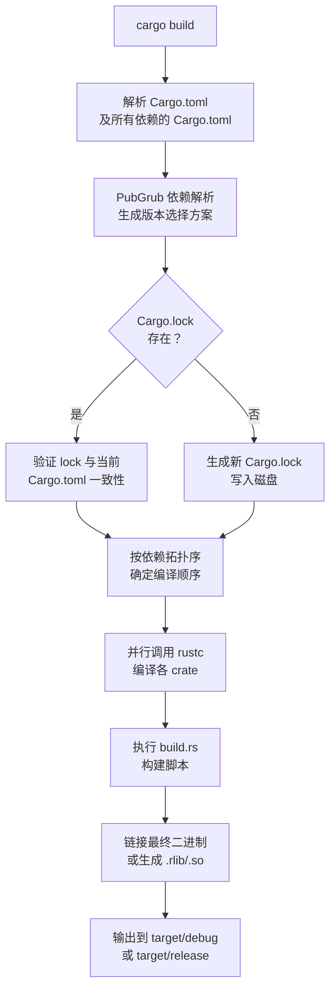

---
tags:
  - build-systems
  - tier3
  - cargo
  - rust
  - package-manager
---
# Cargo 与 Rust 构建系统

> [!abstract] TL;DR
> Cargo 是 Rust 官方一体化工具链，将包管理、构建、测试、文档生成统一为单一命令。其依赖解析基于 PubGrub 算法，`Cargo.lock` 精确固定版本树，`build.rs` 脚本机制允许在编译前生成代码或链接原生库。相比 Go modules，Cargo 的 features 系统提供更精细的可选功能组合能力。

## 概述与定位

Cargo 于 Rust 1.0（2015年）随语言一同发布，设计目标是消除 C/C++ 生态中"构建系统散装化"的历史包袱。它同时承担以下职责：

| 职责 | 命令 |
|------|------|
| 依赖管理 | `cargo add` / `Cargo.toml` |
| 构建 | `cargo build` |
| 测试 | `cargo test` |
| 基准测试 | `cargo bench` |
| 文档生成 | `cargo doc` |
| 发布 | `cargo publish` |

**与 Go modules 的核心差异**：Go modules 是语言内置的最小化依赖管理层，不负责构建编排；Cargo 则是完整的构建系统，`rustc` 只是其调用的底层编译器。Cargo 的 features 系统允许同一 crate 按条件启用不同功能集，而 Go 没有等价机制（只能靠 build tags）。

## 原理与机制

### Cargo.toml 解析

`Cargo.toml` 使用 TOML 格式描述包元数据和依赖关系。Cargo 在启动时递归解析所有 `Cargo.toml`，构建完整依赖图（DAG）。

**版本语义（SemVer）**：

| 版本说明符 | 等价范围 | 含义 |
|-----------|---------|------|
| `^1.2.3` | `>=1.2.3, <2.0.0` | 兼容更新（默认） |
| `~1.2.3` | `>=1.2.3, <1.3.0` | 补丁级更新 |
| `=1.2.3` | 精确版本 | 固定版本 |
| `>=1.2, <1.5` | 范围 | 显式区间 |

### 依赖解析算法：PubGrub

Cargo 自 2021 年起使用 **PubGrub** 算法（取代早期的 SAT solver）。PubGrub 是一种基于单元传播（Unit Propagation）和回溯（Backtracking）的依赖解析算法，核心优势是在解析失败时能给出**人类可读的冲突原因链**，而不是单纯报告"无解"。

### Cargo.lock 设计哲学

- **Binary crate（应用程序）**：应当提交 `Cargo.lock`，确保所有开发者和 CI 使用完全相同的依赖版本树
- **Library crate（库）**：通常不提交 `Cargo.lock`，避免限制下游使用者的版本选择空间；但 `Cargo.lock` 本身仍会在本地生成用于开发时复现

`Cargo.lock` 记录每个包的精确版本、来源 URL 及内容哈希（`checksum`），防止供应链攻击者替换已发布版本的内容。

## 结构/算法/伪代码详解

### 完整 Cargo.toml 示例

```toml
[package]
name = "my-app"
version = "0.1.0"
edition = "2021"

# 功能特性开关
[features]
default = ["compression"]
compression = ["dep:flate2"]
tls = ["dep:rustls", "dep:tokio-rustls"]

[dependencies]
serde = { version = "1", features = ["derive"] }
tokio = { version = "1", features = ["full"] }
flate2 = { version = "1", optional = true }

[dev-dependencies]
criterion = "0.5"
tempfile = "3"

[build-dependencies]
bindgen = "0.69"
cc = "1"

# Workspace 配置（根 Cargo.toml）
[workspace]
members = [
    "crates/core",
    "crates/cli",
    "crates/server",
]
resolver = "2"

[workspace.dependencies]
tokio = { version = "1", features = ["full"] }
```

### build.rs 示例（生成 bindgen 绑定）

```rust
// build.rs —— 在 Cargo 编译 src/ 之前执行
use std::path::PathBuf;

fn main() {
    // 告知 Cargo：当 C 头文件变化时重新执行 build.rs
    println!("cargo:rerun-if-changed=wrapper.h");
    println!("cargo:rerun-if-changed=native/");

    // 链接原生静态库
    println!("cargo:rustc-link-lib=static=mylib");
    println!("cargo:rustc-link-search=native=native/");

    // 使用 bindgen 生成 Rust FFI 绑定
    let bindings = bindgen::Builder::default()
        .header("wrapper.h")
        .parse_callbacks(Box::new(bindgen::CargoCallbacks::new()))
        .generate()
        .expect("Unable to generate bindings");

    let out_path = PathBuf::from(std::env::var("OUT_DIR").unwrap());
    bindings
        .write_to_file(out_path.join("bindings.rs"))
        .expect("Couldn't write bindings!");
}
```

在 `src/lib.rs` 中引入生成的绑定：

```rust
include!(concat!(env!("OUT_DIR"), "/bindings.rs"));
```

### Workspace 多 crate 配置

```toml
# crates/core/Cargo.toml
[package]
name = "core"
version.workspace = true   # 从 workspace 继承版本

[dependencies]
tokio.workspace = true     # 从 workspace 继承依赖版本
```

### Cargo 构建流程 Mermaid



## 工具视角与实战

### 常用 Cargo 子命令

```bash
# 查看完整依赖树（含重复版本）
cargo tree
cargo tree --duplicates        # 仅显示存在多版本的包

# 安全漏洞扫描（查询 RustSec 数据库）
cargo install cargo-audit
cargo audit

# 宏展开（调试 derive 宏）
cargo install cargo-expand
cargo expand --lib             # 展开 lib.rs 中所有宏

# 策略检查（许可证/ban 列表/漏洞）
cargo install cargo-deny
cargo deny check

# 最小化 features（找出哪些 features 实际未用）
cargo install cargo-minimal-versions
cargo +nightly minimal-versions check

# 更新依赖到最新兼容版本
cargo update                   # 更新所有
cargo update -p serde          # 更新单个包
```

### Cargo Workspace 实战

大型 Rust 项目通常使用 Workspace 将多个 crate 组织在同一仓库中。Workspace 共享：
- 单一 `Cargo.lock`（保证所有 crate 使用相同的传递依赖版本）
- `target/` 编译缓存目录（避免重复编译相同依赖）
- 工作区级别的 `[workspace.dependencies]`（统一版本声明）

```bash
# 在 workspace 根目录运行，作用于所有成员
cargo build --workspace
cargo test --workspace
```

## 安全性与正确使用

### cargo audit 与 RustSec 数据库

`cargo audit` 查询 [RustSec Advisory Database](https://rustsec.org/)，该数据库由社区维护，包含已知漏洞的 CVE 编号、受影响版本范围及建议修复版本。建议在 CI 中将 `cargo audit` 作为必须通过的检查步骤。

```bash
# CI 中使用：若存在未修复漏洞则退出码非零
cargo audit --deny warnings
```

### build.rs 信任边界

`build.rs` 在用户机器上以构建用户权限执行任意代码，是 Cargo 生态中最重要的安全边界：

- **风险**：恶意 crate 可在 `build.rs` 中执行网络请求、读写文件系统、植入后门
- **防御**：
  - 使用 `cargo-deny` 审核 build-dependencies
  - 审查陌生 crate 的 `build.rs` 源码再添加依赖
  - 在 CI 沙盒环境（无网络访问）中构建，观察是否有异常网络连接

### Features 组合攻击面

启用过多 features 可能引入未预期的依赖路径，扩大攻击面：

```toml
# 危险：引入整个 tokio 的 full features
tokio = { version = "1", features = ["full"] }

# 更安全：仅启用实际需要的 features
tokio = { version = "1", features = ["rt", "net", "io-util"] }
```

`cargo tree -f '{p} {f}'` 可列出每个依赖实际启用的 features 集合，用于审计。

## 小结

Cargo 是现代构建系统设计的范本：一体化工具链消除了"选择构建系统"的认知负担，PubGrub 算法提供了比 SAT-solver 更友好的错误诊断，`Cargo.lock` 的二元哲学（应用提交/库不提交）在实践中被证明是正确的权衡。`build.rs` 是连接 Rust 与原生生态的桥梁，也是需要最谨慎对待的安全边界。

## 相关阅读

- [The Cargo Book](https://doc.rust-lang.org/cargo/)
- [RustSec Advisory Database](https://rustsec.org/)
- [PubGrub 算法论文](https://github.com/dart-lang/pub/blob/master/doc/solver.md)
- `[[07.Gradle与JVM生态构建|← Gradle]]`（对比 JVM 生态的依赖管理）
- `[[09.构建系统的依赖管理|→ 通用依赖管理]]`

---
[[00.构建系统横向对比总览|⬆ 系列总览]] | [[07.Gradle与JVM生态构建|← 上一章]] | [[09.构建系统的依赖管理|→ 下一章]]
