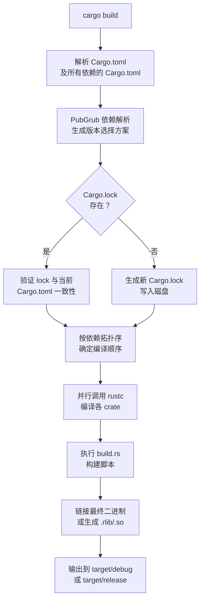

---
tags:
  - build-systems
  - tier3
  - cargo
  - rust
  - package-manager
---
# Cargo 与 Rust 构建系统

> [!abstract] TL;DR
> Cargo 是 Rust 官方一体化工具链，将包管理、构建、测试、文档生成统一为单一命令。其依赖解析基于 PubGrub 算法，`Cargo.lock` 精确固定版本树，`build.rs` 脚本机制允许在编译前生成代码或链接原生库。相比 Go modules，Cargo 的 features 系统提供更精细的可选功能组合能力。

## 概述与定位

Cargo 于 Rust 1.0（2015年）随语言一同发布，设计目标是消除 C/C++ 生态中"构建系统散装化"的历史包袱。它同时承担以下职责：

| 职责 | 命令 |
|------|------|
| 依赖管理 | `cargo add` / `Cargo.toml` |
| 构建 | `cargo build` |
| 测试 | `cargo test` |
| 基准测试 | `cargo bench` |
| 文档生成 | `cargo doc` |
| 发布 | `cargo publish` |

**与 Go modules 的核心差异**：Go modules 是语言内置的最小化依赖管理层，不负责构建编排；Cargo 则是完整的构建系统，`rustc` 只是其调用的底层编译器。Cargo 的 features 系统允许同一 crate 按条件启用不同功能集，而 Go 没有等价机制（只能靠 build tags）。

Cargo 统一工具链的设计哲学来自于对 C/C++ 生态痛苦教训的反思。在 Rust 之前，C++ 开发者需要分别选择构建系统（Make/CMake/Bazel）、包管理器（vcpkg/Conan/手动 submodule）、测试框架（GTest/Catch2/Doctest）、文档工具（Doxygen）。每种组合都需要大量胶水配置，且在 CI 环境中极难做到一致性。Cargo 的"约定优于配置"策略规定了标准目录结构（`src/lib.rs`、`src/main.rs`、`tests/`、`benches/`），消除了"从零配置"的认知摩擦。这种设计上的取舍是有意为之——为通用性付出的代价就是当项目结构必须偏离约定时，定制的难度会比 CMake 高。

## 原理与机制

### Cargo.toml 解析

`Cargo.toml` 使用 TOML 格式描述包元数据和依赖关系。Cargo 在启动时递归解析所有 `Cargo.toml`，构建完整依赖图（DAG）。

**版本语义（SemVer）**：

| 版本说明符 | 等价范围 | 含义 |
|-----------|---------|------|
| `^1.2.3` | `>=1.2.3, <2.0.0` | 兼容更新（默认） |
| `~1.2.3` | `>=1.2.3, <1.3.0` | 补丁级更新 |
| `=1.2.3` | 精确版本 | 固定版本 |
| `>=1.2, <1.5` | 范围 | 显式区间 |

`^` 规则的设计逻辑是：SemVer 承诺 major 版本号相同时 API 向后兼容，因此允许在相同 major 内自动取最新。`0.x.y` 是特殊情况：`^0.2.3` 等价于 `>=0.2.3, <0.3.0`，因为 `0.x` 版本尚未稳定化，minor 号的变更也可能破坏 API。这个细节经常被忽略，却是实际依赖冲突的常见来源。

Pre-release 版本（如 `1.0.0-alpha.1`）在 Cargo 中必须显式指定才会被选取——用户写 `version = "1.0.0-alpha"` 才会匹配 alpha 版，写 `"^1.0"` 不会意外选到 pre-release，这是一种安全默认。

### 依赖解析算法：PubGrub

Cargo 自 2021 年起使用 **PubGrub** 算法（取代早期的 SAT solver）。PubGrub 是一种基于单元传播（Unit Propagation）和回溯（Backtracking）的依赖解析算法，核心优势是在解析失败时能给出**人类可读的冲突原因链**，而不是单纯报告"无解"。

PubGrub 的本质思路来自 DPLL 算法（布尔可满足性问题求解器），但专为包管理的版本约束域设计。它维护一个"不兼容集合"（Incompatibility Set），每条不兼容性记录形如「A@1.x 要求 C@^1.0，但 B@2.x 要求 C@^2.0，因此 A@1.x 与 B@2.x 不可共存」。当算法在回溯过程中触发冲突时，它能从不兼容集合中反推出解释链，输出类似以下的错误：

```
error: failed to select a version for `openssl`
  ... required by package `reqwest v0.11.0`
  ... required by package `my-app v0.1.0`
because `reqwest v0.11.0` requires `openssl ^0.10`
and `native-tls v0.2.11` requires `openssl ^0.10`
but `openssl ^0.10` conflicts with `openssl 0.9.x` already selected
```

相比旧版的 SAT solver，这种错误信息可以直接定位到哪条依赖链引入了冲突，大幅降低了调试难度。PubGrub 的另一个特点是它首先尝试"最新优先"的策略选版本，只有在发现冲突时才回溯降级——这与依赖图的实际使用模式（大多数项目的依赖不冲突）高度吻合，使平均情况的解析极快。

### Feature Unification：同一 Crate 的特性合并

Cargo 的 feature 系统允许 crate 声明可选功能，但有一个关键约束：**在同一依赖图中，同一 crate 的某个 feature 只能被"开启"，不能被"关闭"**。这叫做 feature unification（特性联合/求并集）。

假设依赖图中：
- `crate A` 依赖 `serde { version = "1", features = ["derive"] }`
- `crate B` 依赖 `serde { version = "1" }`

最终编译时，`serde` 会以 `derive` feature 开启的状态编译，即使 B 不需要它。这一设计的理由是：Cargo 只编译每个 crate 一次（同版本），所有使用者共享同一编译产物。如果允许不同使用者用不同 feature 集合，就需要为同一版本编译多次——这既浪费又容易引起链接时的符号冲突。

但 feature unification 也带来隐患：如果 crate A 的某个 feature 引入了一个大型依赖（如 `tokio`），而 B 根本不需要异步运行时，B 的用户在引入 A 时会无声地获得 tokio 作为传递依赖。`cargo tree -e features` 命令可以显示每个 crate 实际激活的 feature 来源，是诊断这类问题的利器。

### Cargo.lock 设计哲学

- **Binary crate（应用程序）**：应当提交 `Cargo.lock`，确保所有开发者和 CI 使用完全相同的依赖版本树
- **Library crate（库）**：通常不提交 `Cargo.lock`，避免限制下游使用者的版本选择空间；但 `Cargo.lock` 本身仍会在本地生成用于开发时复现

`Cargo.lock` 记录每个包的精确版本、来源 URL 及内容哈希（`checksum`），防止供应链攻击者替换已发布版本的内容。

库不提交 lock 文件的深层原因是：库的 `Cargo.toml` 里写的是版本约束（如 `serde = "1"`），下游用户会用自己的 lock 文件统一锁定版本。如果库也提交 lock，两份 lock 文件会产生歧义，且库的 lock 在下游根本不起作用。然而有一个例外：如果库包含可执行程序（比如命令行工具），作为最终交付物时同样应该提交 lock。这条规则的本质是"谁是最终构建的根？谁就应该拥有 lock"。

`cargo update` 会在满足 `Cargo.toml` 约束的范围内将 lock 文件更新到最新兼容版本。`cargo update -p serde --precise 1.0.195` 可以将单个 crate 精确定点到某版本，这在需要临时降级以规避 bug 时很有用。

### build.rs 执行时机与 cargo: 指令

`build.rs` 是一个在编译 `src/` 之前由 Cargo 执行的普通 Rust 程序。它运行在**构建主机**（host）上，而非目标平台（target），因此在交叉编译时使用的是 host 架构的工具链。

Cargo 通过 `build.rs` 的 stdout 解析以 `cargo:` 前缀开头的指令行：

| 指令 | 含义 |
|------|------|
| `cargo:rerun-if-changed=PATH` | 仅当 PATH 变化时重新执行 build.rs |
| `cargo:rerun-if-env-changed=VAR` | 仅当环境变量 VAR 变化时重新执行 |
| `cargo:rustc-link-lib=NAME` | 链接名为 NAME 的库 |
| `cargo:rustc-link-search=native=PATH` | 告知 rustc 在 PATH 搜索库 |
| `cargo:rustc-cfg=KEY="VALUE"` | 向 rustc 传递条件编译标志 |
| `cargo:rustc-env=VAR=VALUE` | 设置 crate 编译时可用的环境变量 |
| `cargo:warning=MESSAGE` | 输出一条构建警告 |

`OUT_DIR` 是 Cargo 为每个 crate 的 build.rs 准备的输出目录，路径类似 `target/debug/build/my-crate-xxx/out/`。build.rs 生成的文件（绑定代码、常量文件等）必须放在此目录下，然后在 `src/` 中通过 `include!` 宏引入。这种设计将生成产物与源码目录隔离，防止生成代码污染 git 工作区。

如果 `build.rs` 没有声明任何 `cargo:rerun-if-changed` 指令，Cargo 会默认在**任何文件变化时**重新执行，这是一个常见性能陷阱——应当显式声明监控范围以避免不必要的重新构建。

### Workspace 的 target 目录共享与 lock 共享

Workspace 是 Cargo 管理多 crate 仓库的机制。所有 workspace 成员共享：
- 根目录的单一 `Cargo.lock`（保证成员间传递依赖一致）
- 根目录的 `target/` 编译缓存（相同 crate 在不同成员中只编译一次）

`[workspace.dependencies]` 允许在根 `Cargo.toml` 统一声明依赖版本，成员 `Cargo.toml` 通过 `dep.workspace = true` 引用，避免版本号分散在多处导致的维护负担。

Workspace 的 resolver 版本至关重要：`resolver = "2"`（Cargo 1.51+）修复了 resolver v1 中 dev-dependencies 的 feature 会意外泄漏到非 dev 编译路径的问题。新项目应始终指定 `resolver = "2"`。

### Profile：dev/release 继承与 opt-level

Cargo profile 控制编译器优化级别和调试信息。内置 profile 及其默认值：

| Profile | opt-level | debug | 用途 |
|---------|-----------|-------|------|
| `dev` | 0 | true | `cargo build` 默认 |
| `release` | 3 | false | `cargo build --release` |
| `test` | 0 | true | `cargo test` |
| `bench` | 3 | false | `cargo bench` |

自定义 profile 可以继承内置 profile 并覆盖特定字段：

```toml
[profile.release-with-debug]
inherits = "release"
debug = true        # 保留调试符号（用于 profiling）

[profile.dev.package."*"]
opt-level = 2       # 仅对依赖项启用 O2，自身代码仍 O0，加速开发编译
```

`opt-level = 2` 用于依赖包、`opt-level = 0` 用于自身代码，是平衡编译速度与运行时性能（依赖性能往往比自身代码更重要）的常见实践。这个技巧对于依赖大量计算型 crate（如 `rayon`、`ndarray`）的项目效果尤其显著——未优化的这些 crate 运行速度可能比 release 版慢 10 倍以上，但用 release 全量编译又会让每次修改后的增量构建时间翻倍。

## 结构/算法/伪代码详解

### 完整 Cargo.toml 示例

```toml
[package]
name = "my-app"
version = "0.1.0"
edition = "2021"

# 功能特性开关
[features]
default = ["compression"]
compression = ["dep:flate2"]
tls = ["dep:rustls", "dep:tokio-rustls"]

[dependencies]
serde = { version = "1", features = ["derive"] }
tokio = { version = "1", features = ["full"] }
flate2 = { version = "1", optional = true }

[dev-dependencies]
criterion = "0.5"
tempfile = "3"

[build-dependencies]
bindgen = "0.69"
cc = "1"

# Workspace 配置（根 Cargo.toml）
[workspace]
members = [
    "crates/core",
    "crates/cli",
    "crates/server",
]
resolver = "2"

[workspace.dependencies]
tokio = { version = "1", features = ["full"] }
```

### build.rs 示例（生成 bindgen 绑定）

```rust
// build.rs —— 在 Cargo 编译 src/ 之前执行
use std::path::PathBuf;

fn main() {
    // 告知 Cargo：当 C 头文件变化时重新执行 build.rs
    println!("cargo:rerun-if-changed=wrapper.h");
    println!("cargo:rerun-if-changed=native/");

    // 链接原生静态库
    println!("cargo:rustc-link-lib=static=mylib");
    println!("cargo:rustc-link-search=native=native/");

    // 使用 bindgen 生成 Rust FFI 绑定
    let bindings = bindgen::Builder::default()
        .header("wrapper.h")
        .parse_callbacks(Box::new(bindgen::CargoCallbacks::new()))
        .generate()
        .expect("Unable to generate bindings");

    let out_path = PathBuf::from(std::env::var("OUT_DIR").unwrap());
    bindings
        .write_to_file(out_path.join("bindings.rs"))
        .expect("Couldn't write bindings!");
}
```

在 `src/lib.rs` 中引入生成的绑定：

```rust
include!(concat!(env!("OUT_DIR"), "/bindings.rs"));
```

### Workspace 多 crate 配置

```toml
# crates/core/Cargo.toml
[package]
name = "core"
version.workspace = true   # 从 workspace 继承版本

[dependencies]
tokio.workspace = true     # 从 workspace 继承依赖版本
```

### Cargo 构建流程 Mermaid



## 工具视角与实战

### 日常工作流：check / clippy / nextest

大型 Rust 项目的日常开发循环并不总是从 `cargo build` 开始。针对不同的反馈目标，有专用子命令可以更快地给出结果。

#### cargo check：跳过 codegen 的极速类型检查

`cargo check` 执行完整的类型检查（borrow checker、trait 解析、lifetime 验证），但**不生成任何机器码**，因此通常比 `cargo build` 快 2~5 倍：

```bash
cargo check                      # 检查整个 workspace
cargo check -p my-crate          # 只检查指定 crate
cargo check --tests              # 同时检查测试代码（含 #[cfg(test)] 块）
cargo check --all-targets        # 检查所有 target（lib/bin/test/bench/example）
```

`cargo check` 的适用场景是**边写边验证**：每保存一次文件就跑一遍 `cargo check`，在秒级别内得到类型错误反馈，而不必等待链接器完成。很多编辑器（rust-analyzer）的后台检查就是调用 `cargo check`。

#### cargo clippy：Lint 与代码质量

Clippy 是 Rust 官方 lint 工具，内置 700+ 条规则，覆盖正确性、性能、风格、惯用写法四大类：

```bash
cargo clippy                         # 运行所有默认 lint
cargo clippy --all-targets           # 含测试/bench/example 的 lint
cargo clippy -- -D warnings          # 将所有 warning 视为 error（CI 推荐）
cargo clippy --fix                   # 自动修复可安全修复的 lint
```

在代码中通过 attribute 控制 lint 级别：

```rust
// 全局启用更严格的 lint 集（推荐在 lib.rs / main.rs 顶部声明）
#![warn(clippy::all)]           // 所有默认 lint 提升为 warning
#![warn(clippy::pedantic)]      // 更严格的风格 lint
#![warn(clippy::nursery)]       // 实验性 lint（可能有误报）
#![allow(clippy::must_use_candidate)]  // 针对性关闭某条 lint

// 局部抑制（配合原因说明）
#[allow(clippy::unwrap_used)]   // 在测试/原型代码中临时允许
fn test_helper() { /* ... */ }
```

常见高价值 lint 示例：

| lint | 含义 | 示例 |
|------|------|------|
| `clippy::unwrap_used` | 禁止 `.unwrap()`，强制处理错误 | 改用 `?` 或 `expect` |
| `clippy::clone_on_ref_ptr` | `Arc`/`Rc` clone 应显式调用 | 替代隐式 `.clone()` |
| `clippy::large_enum_variant` | 枚举分支大小差异过大，建议 `Box` | 减少栈拷贝 |
| `clippy::inefficient_to_string` | `format!("{}", x)` 比 `.to_string()` 慢 | 直接用 `.to_string()` |
| `clippy::needless_pass_by_value` | 参数可改为引用 | 避免不必要的 move |

#### cargo fmt：代码格式化

```bash
cargo fmt                   # 格式化整个 workspace
cargo fmt --check           # 只检查不修改（CI 用，格式不对则非零退出）
cargo fmt -- --edition 2021 # 指定 edition
```

`rustfmt.toml`（或 `.rustfmt.toml`）可配置少量格式选项（行宽、import 排序等）。与 Clippy 不同，`cargo fmt` 没有语义理解，只处理排版，因此几乎不会引入 bug。

#### cargo-nextest：下一代测试运行器

[cargo-nextest](https://nexte.st/) 是一个替代 `cargo test` 的第三方测试运行器，正逐渐成为大型 Rust 项目的标准选择（被 rustc 编译器自身、Firefox 等项目采用）。

**安装**：
```bash
cargo install cargo-nextest --locked
# 或通过预编译二进制（CI 推荐，更快）
curl -LsSf https://get.nexte.st/latest/linux | tar zxf - -C ~/.cargo/bin
```

**基本用法**：
```bash
cargo nextest run                    # 运行所有测试
cargo nextest run -p my-crate        # 只运行指定 crate
cargo nextest run --test integration # 只运行集成测试
cargo nextest run -E 'test(foo)'     # 过滤：名称含 "foo" 的测试
cargo nextest run --profile ci       # 使用 .config/nextest.toml 中的 CI profile
```

**核心优势：进程隔离与并行**

`cargo test` 在单进程内多线程运行测试，线程共享全局状态（全局变量、环境变量、`std::io` 输出混杂）。nextest 为**每个测试用例启动独立进程**：

```
cargo test 执行模型：
  [单进程] → [线程 A: test_auth] [线程 B: test_db] [线程 C: test_cache]
            → 线程间共享进程状态，一个 panic 可能影响其他测试

cargo nextest 执行模型：
  [进程 1: test_auth]   独立环境，独立 stdin/stdout
  [进程 2: test_db]     独立环境，测试互不干扰
  [进程 3: test_cache]  一个进程崩溃不影响其他测试
```

进程隔离的实际好处：
- 消除测试间通过全局状态泄露的隐式耦合（flaky test 的常见根源）
- 一个测试因 panic/SIGSEGV 崩溃，其他测试继续跑，不会整批失败
- 每个测试有独立的 stdout/stderr，输出不混杂

**更快的速度**

nextest 的并行模型不受线程数限制，由操作系统调度多进程：

```bash
# 对比（以 1000 个测试为例的典型数据）
cargo test:     ~45s  # 单进程多线程，受 GIL 等全局资源竞争影响
cargo nextest:  ~12s  # 多进程并行，充分利用所有核心
```

速度提升主要来自：进程级并行（无线程同步开销）、跳过已通过测试的重新编译（`--no-fail-fast` 下更明显）、以及更精确的超时控制。

**更好的输出格式**

```
cargo nextest run 的输出示例：

PASS [   0.012s] my-crate tests::unit::test_parse_ok
PASS [   0.003s] my-crate tests::unit::test_serialize
FAIL [   0.001s] my-crate tests::unit::test_deserialize_invalid
─── STDOUT ────────────────────────────────────────────────
thread 'main' panicked at 'assertion failed: result.is_ok()'
src/parser.rs:42
─────────────────────────────────────────────────────────
Summary [   0.450s] 42 tests run: 41 passed, 1 failed
```

每个测试的耗时单独显示，失败的测试输出单独分组（不与其他测试混杂），颜色高亮。

**nextest.toml 配置**

在项目根目录的 `.config/nextest.toml` 中配置 profile：

```toml
[profile.default]
test-threads = "num-cpus"   # 使用所有 CPU 核心
retries = 0                 # 失败后不重试（调试环境）

[profile.ci]
test-threads = 8
retries = 2                 # CI 中对 flaky test 重试 2 次
failure-output = "immediate-final"  # 只在最终摘要显示失败输出

[profile.ci.junit]
path = "test-results.xml"   # 生成 JUnit XML，供 CI 系统（GitHub Actions/Jenkins）解析
```

#### cargo test vs cargo nextest 对比

| 维度 | `cargo test` | `cargo nextest` |
|------|-------------|-----------------|
| 执行模型 | 单进程多线程 | 每测试独立进程 |
| 测试隔离 | 线程共享状态，可能互扰 | 进程隔离，完全独立 |
| 速度 | 基准 | 通常快 2~5× |
| 输出格式 | 所有输出混杂 | 每测试单独显示，含耗时 |
| JUnit XML | 需第三方工具 | 内置（`--junit` / `nextest.toml`） |
| doc test | 支持 | **不支持**（需 `cargo test --doc` 补充） |
| 安装 | 内置 | 需额外安装 |
| 标准化程度 | Cargo 官方 | 事实标准（大型项目广泛采用） |

**重要局限**：nextest 目前不运行 doc test（文档中的 `///` 代码块测试）。完整的 CI 测试矩阵需要同时运行两者：

```bash
cargo nextest run --workspace    # 单元测试 + 集成测试
cargo test --doc                 # doc test 补充
```

### 常用 Cargo 子命令

```bash
# 查看完整依赖树（含重复版本）
cargo tree
cargo tree --duplicates        # 仅显示存在多版本的包

# 安全漏洞扫描（查询 RustSec 数据库）
cargo install cargo-audit
cargo audit

# 宏展开（调试 derive 宏）
cargo install cargo-expand
cargo expand --lib             # 展开 lib.rs 中所有宏

# 策略检查（许可证/ban 列表/漏洞）
cargo install cargo-deny
cargo deny check

# 最小化 features（找出哪些 features 实际未用）
cargo install cargo-minimal-versions
cargo +nightly minimal-versions check

# 更新依赖到最新兼容版本
cargo update                   # 更新所有
cargo update -p serde          # 更新单个包
```

### Cargo Workspace 实战

大型 Rust 项目通常使用 Workspace 将多个 crate 组织在同一仓库中。Workspace 共享：
- 单一 `Cargo.lock`（保证所有 crate 使用相同的传递依赖版本）
- `target/` 编译缓存目录（避免重复编译相同依赖）
- 工作区级别的 `[workspace.dependencies]`（统一版本声明）

```bash
# 在 workspace 根目录运行，作用于所有成员
cargo build --workspace
cargo test --workspace
```

**调试 feature unification 问题**是 Workspace 实战中的常见挑战。当某个成员开启了某 feature，会影响所有成员对该 crate 的编译。`cargo tree -e features --workspace` 可以显示整个 workspace 中每条依赖路径的 feature 传播情况。如果发现某成员因为其他成员的 feature 引入了不需要的大依赖，解决方法是将"feature 密集"的成员和"最小依赖"的成员拆分为独立编译单元，或通过 Cargo workspace 的 `exclude` 字段将其从主 workspace 分离。

**构建缓存的坑**：`target/` 目录在 workspace 级别共享，但不同 profile 和不同 feature 组合会生成不同的编译产物，存放在不同子目录。如果频繁切换 feature 组合编译，`target/` 目录会急速膨胀。`cargo clean -p crate-name` 可以只清理特定 crate 的编译产物，而非全部重建。

## 安全性与正确使用

### cargo audit 与 RustSec 数据库

`cargo audit` 查询 [RustSec Advisory Database](https://rustsec.org/)，该数据库由社区维护，包含已知漏洞的 CVE 编号、受影响版本范围及建议修复版本。建议在 CI 中将 `cargo audit` 作为必须通过的检查步骤。

```bash
# CI 中使用：若存在未修复漏洞则退出码非零
cargo audit --deny warnings
```

### build.rs 信任边界

`build.rs` 在用户机器上以构建用户权限执行任意代码，是 Cargo 生态中最重要的安全边界：

- **风险**：恶意 crate 可在 `build.rs` 中执行网络请求、读写文件系统、植入后门
- **防御**：
  - 使用 `cargo-deny` 审核 build-dependencies
  - 审查陌生 crate 的 `build.rs` 源码再添加依赖
  - 在 CI 沙盒环境（无网络访问）中构建，观察是否有异常网络连接

`build.rs` 的安全问题比 npm `postinstall` 更隐蔽，因为它是 Rust 代码而非 shell 脚本，代码审查的难度更高。有些恶意 build.rs 会通过判断 `CI` 环境变量是否存在来决定是否激活恶意行为，从而逃避本地开发时的审查。实践中，应优先选择没有 `build.rs` 的 crate，或 `build.rs` 极简单（只有几行 `println!("cargo:...")`）的 crate 作为依赖。

### Features 组合攻击面

启用过多 features 可能引入未预期的依赖路径，扩大攻击面：

```toml
# 危险：引入整个 tokio 的 full features
tokio = { version = "1", features = ["full"] }

# 更安全：仅启用实际需要的 features
tokio = { version = "1", features = ["rt", "net", "io-util"] }
```

`cargo tree -f '{p} {f}'` 可列出每个依赖实际启用的 features 集合，用于审计。

## 小结

Cargo 是现代构建系统设计的范本：一体化工具链消除了"选择构建系统"的认知负担，PubGrub 算法提供了比 SAT-solver 更友好的错误诊断，`Cargo.lock` 的二元哲学（应用提交/库不提交）在实践中被证明是正确的权衡。`build.rs` 是连接 Rust 与原生生态的桥梁，也是需要最谨慎对待的安全边界。Feature unification 机制保证了同一依赖只编译一次，但也要求开发者主动管理 feature 的传播路径，避免隐式引入不需要的大型依赖。Workspace 的目录与 lock 共享策略在多 crate 仓库中显著降低了依赖管理的维护成本，是规模化 Rust 项目的标准组织形式。Profile 继承机制（`dev.package."*"` 中为依赖开启 O2）则是在开发速度与测试真实性之间找到平衡点的实用手段。

## 相关阅读

- [The Cargo Book](https://doc.rust-lang.org/cargo/)
- [RustSec Advisory Database](https://rustsec.org/)
- [PubGrub 算法论文](https://github.com/dart-lang/pub/blob/master/doc/solver.md)
- `[[07.Gradle与JVM生态构建|← Gradle]]`（对比 JVM 生态的依赖管理）
- `[[09.构建系统的依赖管理|→ 通用依赖管理]]`

---
[[00.构建系统横向对比总览|⬆ 系列总览]] | [[07.Gradle与JVM生态构建|← 上一章]] | [[09.构建系统的依赖管理|→ 下一章]]
